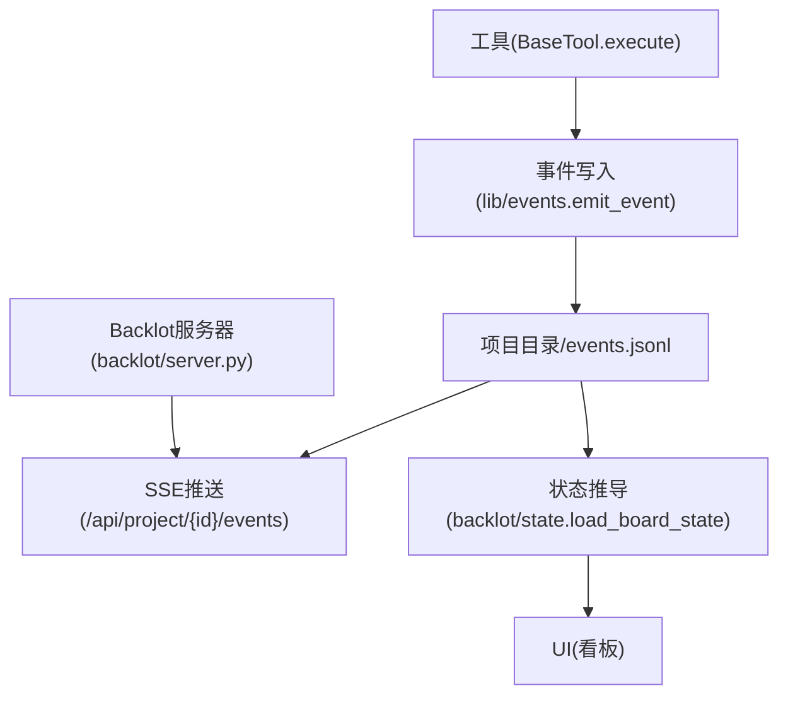
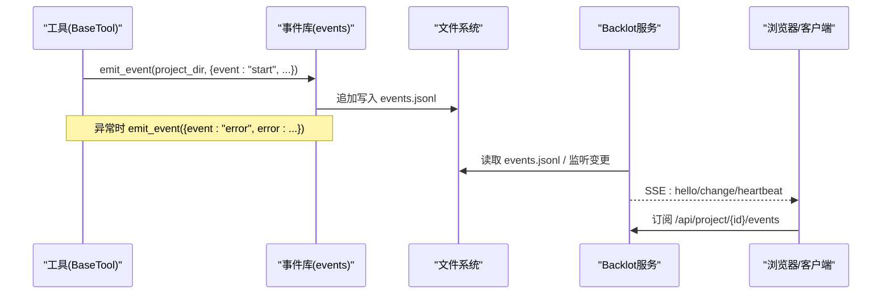
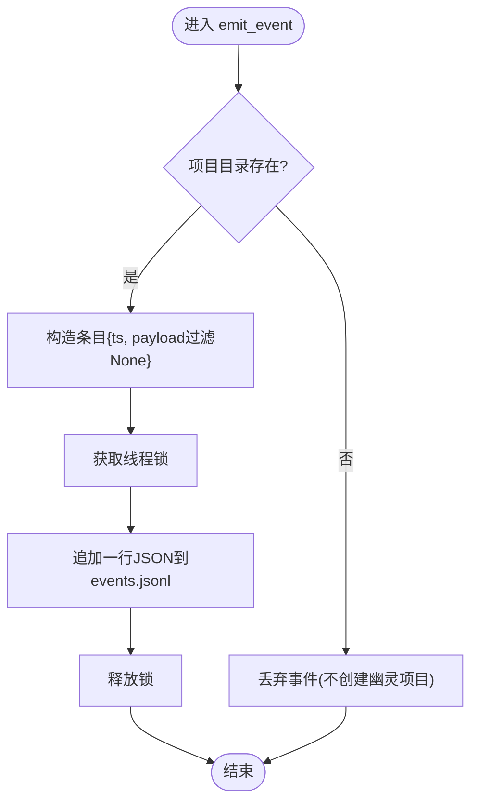
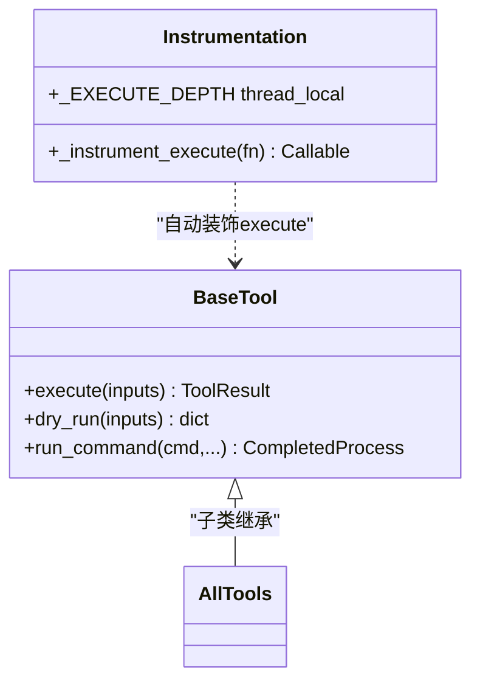
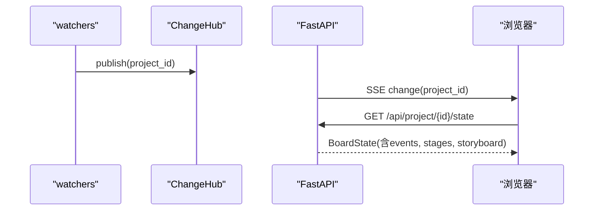
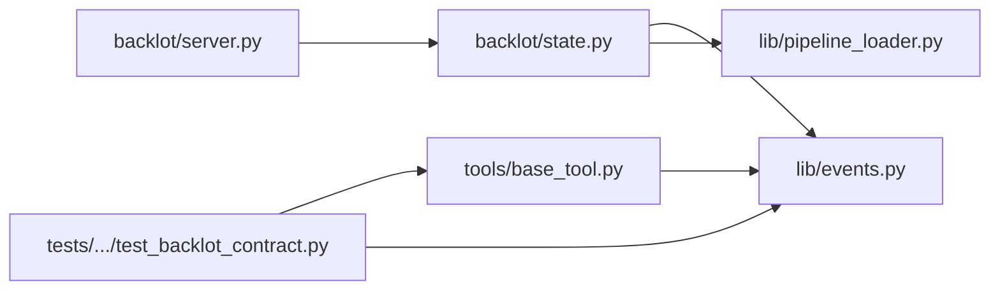

# 日志分析

<cite>
**本文引用的文件**
- [lib/events.py](file://lib/events.py)
- [tools/base_tool.py](file://tools/base_tool.py)
- [backlot/server.py](file://backlot/server.py)
- [backlot/state.py](file://backlot/state.py)
- [tests/contracts/test_backlot_contract.py](file://tests/contracts/test_backlot_contract.py)
- [config.yaml](file://config.yaml)
</cite>

## 目录
1. [简介](#简介)
2. [项目结构](#项目结构)
3. [核心组件](#核心组件)
4. [架构总览](#架构总览)
5. [详细组件分析](#详细组件分析)
6. [依赖关系分析](#依赖关系分析)
7. [性能考虑](#性能考虑)
8. [故障排查指南](#故障排查指南)
9. [结论](#结论)
10. [附录](#附录)

## 简介
本指南聚焦 OpenMontage 的日志与可观测性体系，重点说明：
- Backlot 事件系统的记录机制、事件格式与含义（管道执行事件、工具调用事件、状态变更事件）
- 日志文件位置、读取方式与可扩展的轮转/长期存储建议
- 常见错误模式的日志特征识别方法（网络超时、认证失败、资源不足等）
- 日志聚合与分析实践（命令行工具与 ELK 栈集成思路）

OpenMontage 的“日志”主要由两部分构成：
- 结构化事件流：每个项目的 events.jsonl，由工具执行层自动埋点写入，供 Backlot 看板实时展示。
- 进程级标准日志：Python logging 在各模块中的警告/信息输出，用于调试与运维。

## 项目结构
与日志相关的关键路径与职责：
- lib/events.py：事件写入与读取（append-only JSONL），线程安全追加，容错丢弃。
- tools/base_tool.py：BaseTool 的 execute() 被装饰器自动包装，自动发射 start/finish/error 事件。
- backlot/server.py：FastAPI 服务，提供 SSE 推送与媒体访问；通过 watchfiles 监听项目目录变化并广播。
- backlot/state.py：将项目目录（checkpoints、artifacts、events.jsonl 等）汇总为 BoardState，驱动 UI。
- tests/contracts/test_backlot_contract.py：验证事件契约（如 start→error 序列）。
- config.yaml：全局配置（不含日志级别开关，但体现 pipeline/output/checkpoint 等上下文）。

图表来源
- [lib/events.py:77-118](file://lib/events.py#L77-L118)
- [tools/base_tool.py:148-224](file://tools/base_tool.py#L148-L224)
- [backlot/server.py:183-240](file://backlot/server.py#L183-L240)
- [backlot/state.py:588-658](file://backlot/state.py#L588-L658)

章节来源
- [lib/events.py:1-119](file://lib/events.py#L1-L119)
- [tools/base_tool.py:148-224](file://tools/base_tool.py#L148-L224)
- [backlot/server.py:1-369](file://backlot/server.py#L1-L369)
- [backlot/state.py:1-716](file://backlot/state.py#L1-L716)
- [tests/contracts/test_backlot_contract.py:218-232](file://tests/contracts/test_backlot_contract.py#L218-L232)
- [config.yaml:1-34](file://config.yaml#L1-L34)

## 核心组件
- 事件写入器（emit_event/read_events）：以 append 模式写入 JSONL，包含时间戳与 payload；读取时跳过损坏行，保证鲁棒性。
- 工具执行埋点（_instrument_execute）：在 BaseTool.execute 前后自动注入 start/finish/error 事件，支持嵌套深度 depth，便于区分选择器与提供者调用。
- 项目归属推断（infer_project_dir）：从输入参数中推断项目目录（优先显式 project_dir/project_path，其次基于 output/input 路径归一化到 projects/<id>）。
- Backlot 服务端：提供健康检查、项目列表、项目状态、事件流（SSE）、缩略图与媒体访问；后台 watcher 监听文件系统变更并广播。
- 状态推导：读取 checkpoints、artifacts、events.jsonl，构建场景卡片、阶段轨道、成本快照、是否活跃/停滞等。

章节来源
- [lib/events.py:46-118](file://lib/events.py#L46-L118)
- [tools/base_tool.py:148-224](file://tools/base_tool.py#L148-L224)
- [backlot/server.py:165-307](file://backlot/server.py#L165-L307)
- [backlot/state.py:588-658](file://backlot/state.py#L588-L658)

## 架构总览
下图展示了从工具执行到看板展示的完整链路，以及事件如何驱动实时状态。

图表来源
- [tools/base_tool.py:148-224](file://tools/base_tool.py#L148-L224)
- [lib/events.py:77-118](file://lib/events.py#L77-L118)
- [backlot/server.py:183-240](file://backlot/server.py#L183-L240)

## 详细组件分析

### 事件系统与日志格式
- 写入策略
  - 单行 JSON，字段包括 ts（UTC ISO 时间）与 payload 键值对。
  - 线程锁保护追加写；跨进程未同步，但单行 O_APPEND 极少撕裂，读端容忍损坏行。
  - 写入失败静默丢弃，确保可观测性不阻塞生产。
- 项目归属
  - 优先匹配 project_dir/project_path；否则扫描 output/input 等路径，归一到 projects/<id>。
  - 无法归属则不发射事件，避免误写。
- 事件类型与含义
  - start：工具开始执行，携带 tool、scene_id、depth、output_path 等。
  - finish：工具完成，携带 success、cost_usd、duration_s 等。
  - error：工具抛出异常，携带 error（截断至300字符）、duration_s。
  - 这些事件驱动看板“生成中”状态与活动流。
- 读取与限制
  - read_events 按最旧到最新顺序返回，支持 limit 限制条数（状态推导默认取最近 250 条）。

图表来源
- [lib/events.py:77-95](file://lib/events.py#L77-L95)

章节来源
- [lib/events.py:1-119](file://lib/events.py#L1-L119)
- [tests/contracts/test_backlot_contract.py:218-232](file://tests/contracts/test_backlot_contract.py#L218-L232)

### 工具调用事件的自动埋点
- 装饰器 _instrument_execute 自动包裹所有 BaseTool.execute。
- 在调用前发射 start；捕获异常后发射 error；正常返回后发射 finish。
- 支持嵌套 depth：选择器调用提供者时，外层和内层都记录，消费方可按 depth=0 聚合成本等指标。
- 若事件子系统不可用（导入失败），工具照常执行，不影响业务。

图表来源
- [tools/base_tool.py:148-224](file://tools/base_tool.py#L148-L224)
- [tools/base_tool.py:227-236](file://tools/base_tool.py#L227-L236)

章节来源
- [tools/base_tool.py:148-224](file://tools/base_tool.py#L148-L224)

### Backlot 事件流与看板联动
- SSE 接口
  - /api/project/{project_id}/events：订阅指定项目的事件变更，发送 hello/change/heartbeat。
  - /api/library/events：订阅全量项目变更。
- 文件监听
  - 使用 watchfiles 监听 projects/ 下变更，去重后广播对应 project_id。
  - 忽略 node_modules/.git/__pycache__/.cache 等噪声目录。
- 状态推导
  - load_board_state 读取 checkpoints、artifacts、events.jsonl，计算 stages、storyboard、media、cost、live/stalled 等。
  - 事件用于判定场景“generating”：最近一条顶层 start 且无 finish/error 即视为生成中。

图表来源
- [backlot/server.py:132-149](file://backlot/server.py#L132-L149)
- [backlot/server.py:183-240](file://backlot/server.py#L183-L240)
- [backlot/state.py:588-658](file://backlot/state.py#L588-L658)

章节来源
- [backlot/server.py:1-369](file://backlot/server.py#L1-L369)
- [backlot/state.py:1-716](file://backlot/state.py#L1-L716)

### 管道执行事件与状态变更事件
- 管道阶段（stages）来自 manifest 或回退列表，checkpoint 记录各阶段 status/timestamp/review/cost_snapshot/error/human_approved 等。
- 看板根据 checkpoint 历史与当前 checkpoint 构建 stage rail，并检测 gate_skipped（需人工审批但未等待）。
- 事件与 checkpoint 共同决定“活跃/停滞”：
  - live：最近活动时间在窗口内（默认5分钟）。
  - stalled：in_progress 阶段超过阈值（默认10分钟）无新活动。

章节来源
- [backlot/state.py:145-224](file://backlot/state.py#L145-L224)
- [backlot/state.py:588-658](file://backlot/state.py#L588-L658)

## 依赖关系分析
- BaseTool 依赖 lib/events 进行埋点；若导入失败则降级运行。
- Backlot server 依赖 watchfiles（可选，缺失时仍可通过手动刷新工作）。
- state 模块依赖 events、paths、pipeline_loader（加载 manifest）等。
- 测试用例验证事件契约（start→error 序列）与工具异常传播。

图表来源
- [tools/base_tool.py:148-224](file://tools/base_tool.py#L148-L224)
- [backlot/server.py:165-307](file://backlot/server.py#L165-L307)
- [backlot/state.py:588-658](file://backlot/state.py#L588-L658)
- [tests/contracts/test_backlot_contract.py:218-232](file://tests/contracts/test_backlot_contract.py#L218-L232)

章节来源
- [tools/base_tool.py:148-224](file://tools/base_tool.py#L148-L224)
- [backlot/server.py:165-307](file://backlot/server.py#L165-L307)
- [backlot/state.py:588-658](file://backlot/state.py#L588-L658)
- [tests/contracts/test_backlot_contract.py:218-232](file://tests/contracts/test_backlot_contract.py#L218-L232)

## 性能考虑
- 事件写入为单行追加，低开销；read_events 支持 limit，避免大文件全量读取。
- Backlot 服务端对变更做批处理与去重，队列满时丢弃多余通知，防止风暴。
- 缩略图缓存与媒体范围请求减少带宽与 CPU 消耗。
- 建议在大规模渲染时关注 events.jsonl 大小增长，结合轮转策略控制磁盘占用。

[本节为通用指导，无需具体文件引用]

## 故障排查指南

### 常见错误模式的日志特征
- 工具异常
  - 事件中出现 event="error"，error 字段包含异常消息片段（截断至300字符），duration_s 表示耗时。
  - 参考：测试用例验证 start→error 序列与错误消息包含关系。
- 项目归属失败
  - 若 infer_project_dir 无法归属，不会发射任何事件；排查时需确认输入参数是否指向 projects/ 下的有效路径。
- 事件写入失败
  - emit_event 内部 try/except 吞掉异常，不会中断工具执行；若看板无活动，检查文件系统权限与磁盘空间。
- 管道阶段停滞
  - 看板会标记 stalled=true 并给出 stalled_minutes；检查 checkpoint 与 events.jsonl 是否仍有更新。
- 外部 API 错误（示例）
  - 认证失败（401）、配额不足（402）、限流（429）、服务端错误（5xx）等会在上层工具中抛出异常，最终被埋点为 error 事件。
  - 可结合工具实现中的错误格式化与重试策略定位问题。

章节来源
- [tests/contracts/test_backlot_contract.py:218-232](file://tests/contracts/test_backlot_contract.py#L218-L232)
- [lib/events.py:77-118](file://lib/events.py#L77-L118)
- [backlot/state.py:588-658](file://backlot/state.py#L588-L658)

### 日志级别与配置
- 本项目未提供统一的日志级别开关；事件系统遵循“非致命、不阻塞”的设计，写入失败静默丢弃。
- Python logging 在各模块中以 warning/info 等形式输出，可用于辅助诊断（例如 checkpoint 模块在回退路径发出 warning）。
- 如需集中管理日志级别，可在应用入口统一配置 logging.basicConfig(level=...)，或在容器/进程启动脚本中设置环境变量。

章节来源
- [lib/checkpoint.py:62-67](file://lib/checkpoint.py#L62-L67)
- [config.yaml:1-34](file://config.yaml#L1-L34)

### 日志文件位置与轮转策略
- 位置
  - 每个项目目录下存在 events.jsonl，作为该项目的工具事件流水。
  - 其他状态文件位于 checkpoints、artifacts、history 等目录。
- 轮转建议
  - 由于 events.jsonl 持续增长，建议按天或按大小轮转（例如 logrotate），保留最近 N 天的滚动文件。
  - 归档到对象存储（如 S3/OSS）或日志平台，配合索引与查询。
- 长期存储
  - 将 events.jsonl 与 checkpoint/artifact 元数据纳入备份策略。
  - 对高吞吐场景，可考虑将事件转发至 Kafka/ES 等后端，本地仅保留短期热数据。

[本节为通用指导，无需具体文件引用]

### 日志聚合与分析工具
- 命令行工具
  - grep：快速筛选特定工具或错误关键字，例如搜索 error 事件。
  - awk：提取字段（如 tool、duration_s、success），统计成功率与耗时分布。
  - jq：解析 JSONL 事件，过滤 scene_id、tool、event 等维度。
- ELK 栈集成
  - Filebeat/Fluent Bit：采集 events.jsonl 与标准日志，转发至 Logstash/Elasticsearch。
  - 索引设计：按项目/日期分片，建立 tool、event、scene_id、success 等字段映射。
  - Kibana：构建仪表盘，监控错误率、平均耗时、top 工具、场景生成中状态等。
  - 告警：当某项目长时间无事件或错误率突增时触发告警。

[本节为通用指导，无需具体文件引用]

## 结论
OpenMontage 的可观测性以轻量、健壮为核心：
- 事件系统以 JSONL 形式持久化，零侵入地记录工具调用生命周期，支撑 Backlot 看板实时反馈。
- 通过项目归属推断与容错设计，确保即使事件写入失败也不影响生产流程。
- 结合合理的轮转与聚合方案，可实现从单机调试到集群监控的平滑扩展。
- 针对常见错误模式，可通过事件字段与 checkpoint 状态快速定位问题根因。

[本节为总结性内容，无需具体文件引用]

## 附录

### 事件字段速查
- ts：UTC 时间戳（ISO 格式）
- event：start | finish | error
- tool：工具名称
- scene_id：场景标识（可选）
- depth：调用嵌套深度（可选）
- output_path：输出路径（可选）
- success：是否成功（finish 时）
- cost_usd：费用（美元，finish 时）
- duration_s：耗时（秒）
- error：错误消息（error 时）

章节来源
- [lib/events.py:77-118](file://lib/events.py#L77-L118)
- [tools/base_tool.py:148-224](file://tools/base_tool.py#L148-L224)