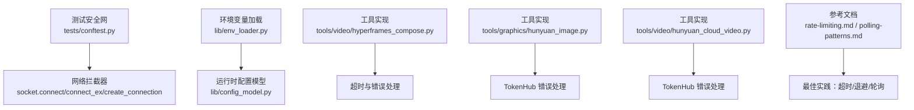
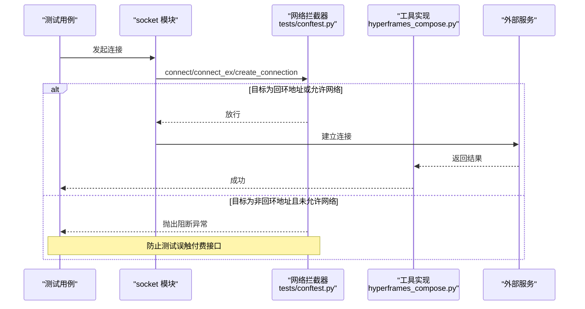
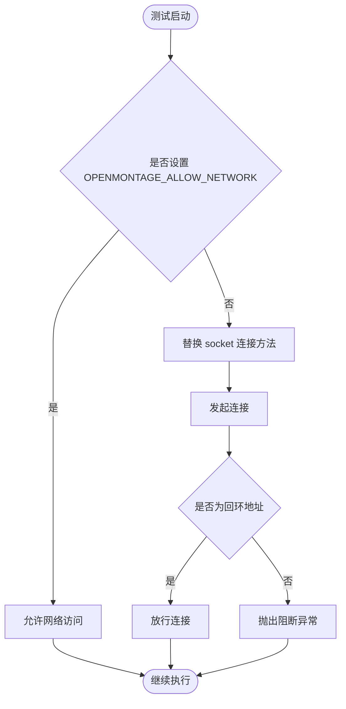
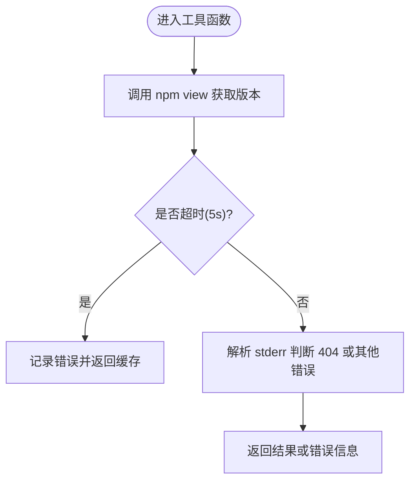
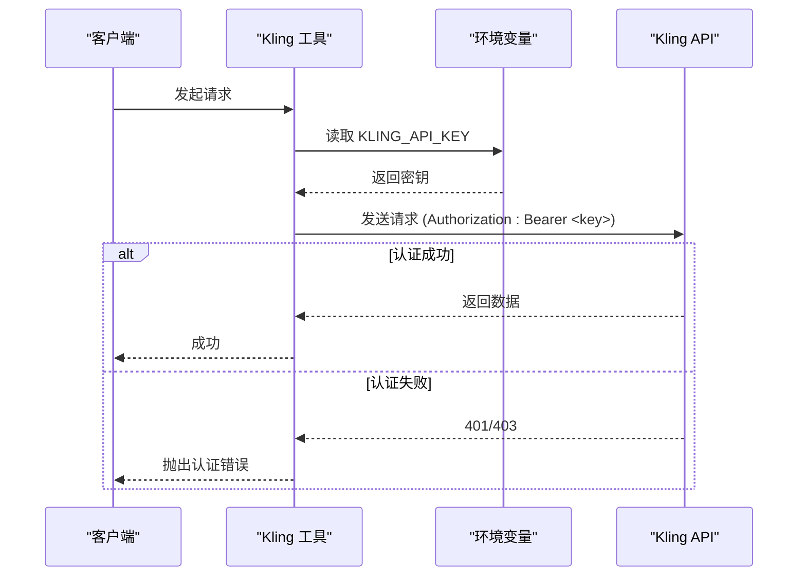
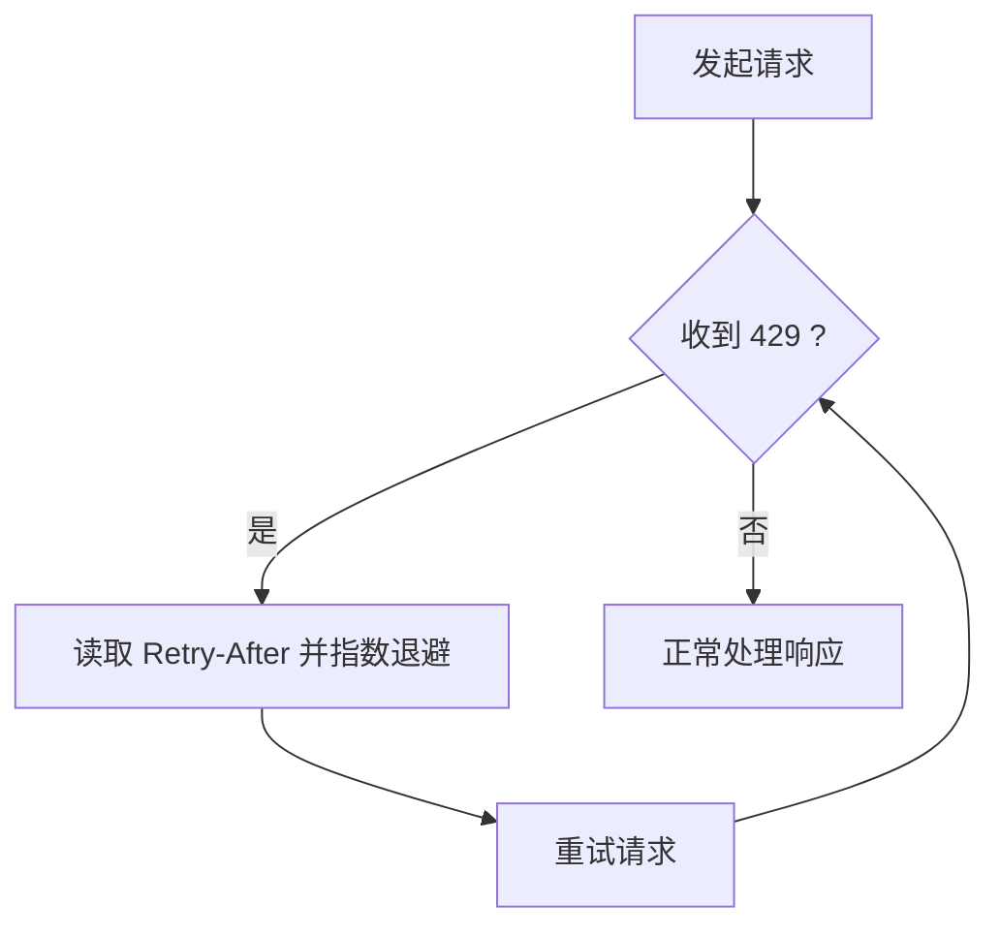
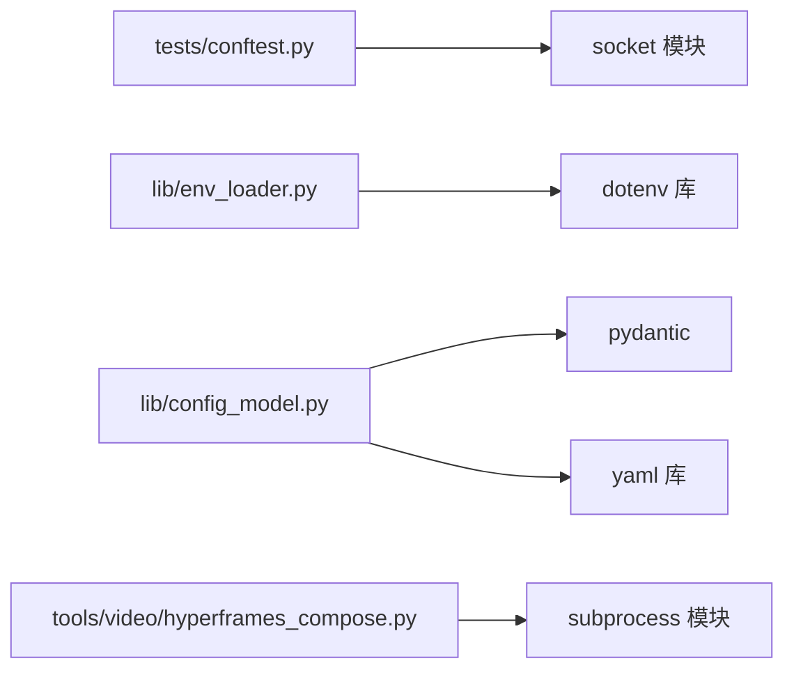

# 网络连接问题

<cite>
**本文引用的文件**
- [tests/conftest.py](file://tests/conftest.py)
- [tests/test_network_guard.py](file://tests/test_network_guard.py)
- [lib/env_loader.py](file://lib/env_loader.py)
- [lib/config_model.py](file://lib/config_model.py)
- [tools/video/hyperframes_compose.py](file://tools/video/hyperframes_compose.py)
- [tools/graphics/hunyuan_image.py](file://tools/graphics/hunyuan_image.py)
- [tools/video/hunyuan_cloud_video.py](file://tools/video/hunyuan_cloud_video.py)
- [tests/contracts/test_kling_official_core.py](file://tests/contracts/test_kling_official_core.py)
- [.agents/skills/bfl-api/references/rate-limiting.md](file://.agents/skills/bfl-api/references/rate-limiting.md)
- [.agents/skills/bfl-api/references/polling-patterns.md](file://.agents/skills/bfl-api/references/polling-patterns.md)
</cite>

## 目录
1. [简介](#简介)
2. [项目结构](#项目结构)
3. [核心组件](#核心组件)
4. [架构总览](#架构总览)
5. [详细组件分析](#详细组件分析)
6. [依赖关系分析](#依赖关系分析)
7. [性能考量](#性能考量)
8. [故障排查指南](#故障排查指南)
9. [结论](#结论)
10. [附录](#附录)

## 简介
本指南聚焦于 OpenMontage 在网络与 API 调用方面的常见问题诊断与排障，覆盖以下主题：
- API 连接失败：超时设置、重试机制、连接池配置
- 认证失败：API 密钥配置、权限验证、令牌刷新
- 速率限制：请求排队、退避算法、配额监控
- 网络层问题：代理服务器、防火墙规则、DNS 解析
- 测试环境隔离：OPENMONTAGE_ALLOW_NETWORK 环境变量与网络连接拦截原理
- 抓包与调试工具：curl、wget、Wireshark 等的使用建议

## 项目结构
OpenMontage 的网络相关能力分布在多处：
- 测试安全网：在测试会话中拦截所有非回环网络访问，防止误用真实 API 产生费用
- 环境变量加载：统一从 .env 与环境变量读取配置（如 API Key、Base URL）
- 运行时配置模型：集中管理 LLM、预算、输出、路径等配置项
- 工具实现：视频/图像生成工具中包含超时、错误处理、响应校验等逻辑
- 参考文档：速率限制、轮询模式的最佳实践

图表来源
- [tests/conftest.py:81-111](file://tests/conftest.py#L81-L111)
- [lib/env_loader.py:15-34](file://lib/env_loader.py#L15-L34)
- [lib/config_model.py:65-85](file://lib/config_model.py#L65-L85)
- [tools/video/hyperframes_compose.py:288-317](file://tools/video/hyperframes_compose.py#L288-L317)
- [tools/graphics/hunyuan_image.py:521-551](file://tools/graphics/hunyuan_image.py#L521-L551)
- [tools/video/hunyuan_cloud_video.py:508-530](file://tools/video/hunyuan_cloud_video.py#L508-L530)
- [.agents/skills/bfl-api/references/rate-limiting.md:67-88](file://.agents/skills/bfl-api/references/rate-limiting.md#L67-L88)
- [.agents/skills/bfl-api/references/polling-patterns.md:232-241](file://.agents/skills/bfl-api/references/polling-patterns.md#L232-L241)

章节来源
- [tests/conftest.py:1-132](file://tests/conftest.py#L1-L132)
- [lib/env_loader.py:1-35](file://lib/env_loader.py#L1-L35)
- [lib/config_model.py:1-93](file://lib/config_model.py#L1-L93)
- [tools/video/hyperframes_compose.py:288-317](file://tools/video/hyperframes_compose.py#L288-L317)
- [tools/graphics/hunyuan_image.py:521-551](file://tools/graphics/hunyuan_image.py#L521-L551)
- [tools/video/hunyuan_cloud_video.py:508-530](file://tools/video/hunyuan_cloud_video.py#L508-L530)
- [.agents/skills/bfl-api/references/rate-limiting.md:67-88](file://.agents/skills/bfl-api/references/rate-limiting.md#L67-L88)
- [.agents/skills/bfl-api/references/polling-patterns.md:232-241](file://.agents/skills/bfl-api/references/polling-patterns.md#L232-L241)

## 核心组件
- 测试网络拦截器：通过替换 socket 的 connect/connect_ex/create_connection，阻止非回环地址的网络访问；仅在设置 OPENMONTAGE_ALLOW_NETWORK 时放行。
- 环境变量加载器：提供 load_env/get_env/require_env 等方法，统一读取 .env 与环境变量。
- 运行时配置模型：使用 Pydantic 模型组织配置，支持 YAML 加载与默认值。
- 工具中的超时与错误处理：在 npm 版本检查、TokenHub 响应解析与错误检查等处体现。
- 参考最佳实践：速率限制与轮询模式的指导文档，包括指数退避、抖动、429 处理等。

章节来源
- [tests/conftest.py:45-111](file://tests/conftest.py#L45-L111)
- [lib/env_loader.py:15-34](file://lib/env_loader.py#L15-L34)
- [lib/config_model.py:65-85](file://lib/config_model.py#L65-L85)
- [tools/video/hyperframes_compose.py:288-317](file://tools/video/hyperframes_compose.py#L288-L317)
- [tools/graphics/hunyuan_image.py:521-551](file://tools/graphics/hunyuan_image.py#L521-L551)
- [tools/video/hunyuan_cloud_video.py:508-530](file://tools/video/hunyuan_cloud_video.py#L508-L530)
- [.agents/skills/bfl-api/references/rate-limiting.md:67-88](file://.agents/skills/bfl-api/references/rate-limiting.md#L67-L88)
- [.agents/skills/bfl-api/references/polling-patterns.md:232-241](file://.agents/skills/bfl-api/references/polling-patterns.md#L232-L241)

## 架构总览
下图展示了测试会话中的网络拦截流程以及工具侧的超时与错误处理如何协同工作，确保测试安全与稳定性。

图表来源
- [tests/conftest.py:81-111](file://tests/conftest.py#L81-L111)
- [tools/video/hyperframes_compose.py:288-317](file://tools/video/hyperframes_compose.py#L288-L317)

## 详细组件分析

### 测试环境网络隔离机制
- 拦截点：socket.socket.connect、socket.socket.connect_ex、socket.create_connection
- 白名单：回环地址（localhost、127.x.x.x、::1、0.0.0.0、空字符串）
- 开关：OPENMONTAGE_ALLOW_NETWORK=1/true/yes 时放行
- 标记：@pytest.mark.live_api 的用例默认跳过，需显式启用

图表来源
- [tests/conftest.py:49-68](file://tests/conftest.py#L49-L68)
- [tests/conftest.py:81-111](file://tests/conftest.py#L81-L111)

章节来源
- [tests/conftest.py:1-132](file://tests/conftest.py#L1-L132)
- [tests/test_network_guard.py:16-77](file://tests/test_network_guard.py#L16-L77)

### 环境变量与配置加载
- 环境变量加载：load_env 自动加载 .env；get_env/require_env 提供类型化访问
- 配置模型：OpenMontageConfig 组织 LLM、预算、输出、路径等配置，支持 YAML 加载与默认值
- 典型用途：API Key、Base URL、缓存目录、最大缓存大小等通过环境变量注入

章节来源
- [lib/env_loader.py:15-34](file://lib/env_loader.py#L15-L34)
- [lib/config_model.py:65-85](file://lib/config_model.py#L65-L85)

### 工具中的超时与错误处理
- npm 版本检查：使用 subprocess.run 并设置 timeout，捕获超时与错误，避免长时间阻塞
- TokenHub 错误处理：解析 JSON 响应并检查 error 字段，抛出带状态码的错误信息
- 敏感信息脱敏：在异常消息中隐藏 API Key，避免泄露

图表来源
- [tools/video/hyperframes_compose.py:288-317](file://tools/video/hyperframes_compose.py#L288-L317)

章节来源
- [tools/video/hyperframes_compose.py:288-317](file://tools/video/hyperframes_compose.py#L288-L317)
- [tools/graphics/hunyuan_image.py:521-551](file://tools/graphics/hunyuan_image.py#L521-L551)
- [tools/video/hunyuan_cloud_video.py:508-530](file://tools/video/hunyuan_cloud_video.py#L508-L530)

### 认证失败的常见原因与解决方案
- API 密钥配置：确认环境变量已正确设置（例如 KLING_API_KEY），并通过 Authorization: Bearer 头传递
- 权限验证：检查账号订阅资源包名称与请求参数是否匹配
- 令牌刷新：OAuth 过期时需重新登录或刷新令牌，否则抛出明确错误提示

图表来源
- [tests/contracts/test_kling_official_core.py:318-341](file://tests/contracts/test_kling_official_core.py#L318-L341)

章节来源
- [tests/contracts/test_kling_official_core.py:274-347](file://tests/contracts/test_kling_official_core.py#L274-L347)

### 速率限制的处理策略
- 指数退避：对 429 响应按 Retry-After 进行指数级等待，减少服务器压力
- 抖动：在多个并发请求中加入随机抖动，避免“惊群效应”
- 队列与限流：在高并发场景下使用队列缓冲请求，使用信号量控制并发
- 配额监控：统计请求数与 429 次数，计算命中率以评估限流影响
- 区域分布：高流量时可考虑多区域端点轮询或负载均衡

图表来源
- [.agents/skills/bfl-api/references/rate-limiting.md:67-88](file://.agents/skills/bfl-api/references/rate-limiting.md#L67-L88)

章节来源
- [.agents/skills/bfl-api/references/rate-limiting.md:67-88](file://.agents/skills/bfl-api/references/rate-limiting.md#L67-L88)
- [.agents/skills/bfl-api/references/rate-limiting.md:197-247](file://.agents/skills/bfl-api/references/rate-limiting.md#L197-L247)
- [.agents/skills/bfl-api/references/polling-patterns.md:232-241](file://.agents/skills/bfl-api/references/polling-patterns.md#L232-L241)

### 代理服务器、防火墙与 DNS 的诊断
- 代理服务器：若通过代理访问外部 API，请确认代理地址、端口、认证信息与协议（HTTP/HTTPS/SOCKS）正确；在工具或 SDK 中配置代理参数
- 防火墙规则：检查出站规则是否允许目标域名与端口；必要时添加例外或白名单
- DNS 解析：使用 nslookup/dig 验证域名解析；若解析失败，检查本地 DNS 服务器或 hosts 文件
- 连通性测试：使用 curl/wget 直接访问目标端点，观察 HTTP 状态码与延迟

[本节为通用网络排障建议，不直接分析具体代码文件]

## 依赖关系分析
- 测试安全网依赖 socket 模块，并在会话级别替换连接方法
- 环境变量加载器依赖 dotenv 库加载 .env 文件
- 配置模型依赖 pydantic 与 yaml 进行数据校验与加载
- 工具实现依赖 subprocess 与 httpx/requests（视具体工具而定）

图表来源
- [tests/conftest.py:81-111](file://tests/conftest.py#L81-L111)
- [lib/env_loader.py:12-21](file://lib/env_loader.py#L12-L21)
- [lib/config_model.py:12-13](file://lib/config_model.py#L12-L13)
- [tools/video/hyperframes_compose.py:288-317](file://tools/video/hyperframes_compose.py#L288-L317)

章节来源
- [tests/conftest.py:81-111](file://tests/conftest.py#L81-L111)
- [lib/env_loader.py:12-21](file://lib/env_loader.py#L12-L21)
- [lib/config_model.py:12-13](file://lib/config_model.py#L12-L13)
- [tools/video/hyperframes_compose.py:288-317](file://tools/video/hyperframes_compose.py#L288-L317)

## 性能考量
- 超时设置：为所有外部调用设置合理超时，避免长时间阻塞；npm 版本检查示例中采用 5 秒超时
- 重试与退避：对临时性错误（如 429、网络抖动）实施指数退避与抖动，降低服务器压力
- 连接池：复用 HTTP 连接以减少握手开销；在高并发场景下注意连接池上限与空闲连接清理
- 缓存：对频繁查询的结果进行短期缓存（如账户用量），减少重复请求
- 监控：记录请求耗时、错误率与限流命中情况，便于定位瓶颈

[本节为通用性能优化建议，不直接分析具体代码文件]

## 故障排查指南
- API 连接失败
  - 检查超时设置是否过短或过长；参考工具中的超时实现
  - 确认代理、防火墙、DNS 解析是否正常
  - 查看日志中的错误码与消息，定位具体失败阶段
- 认证失败
  - 确认 API Key 已正确设置并通过 Authorization 头传递
  - 检查账号权限与资源包名称是否匹配
  - 若使用 OAuth，确认令牌未过期并及时刷新
- 速率限制
  - 监听 429 响应并按 Retry-After 进行指数退避
  - 使用队列与信号量控制并发，避免突发流量
  - 监控限流命中率，调整请求节奏
- 测试环境隔离
  - 如需运行真实 API 测试，设置 OPENMONTAGE_ALLOW_NETWORK=1 并使用 @pytest.mark.live_api
  - 默认情况下，非回环连接会被阻断，防止误触付费接口

章节来源
- [tests/conftest.py:49-111](file://tests/conftest.py#L49-L111)
- [tests/test_network_guard.py:16-77](file://tests/test_network_guard.py#L16-L77)
- [tools/video/hyperframes_compose.py:288-317](file://tools/video/hyperframes_compose.py#L288-L317)
- [tests/contracts/test_kling_official_core.py:318-341](file://tests/contracts/test_kling_official_core.py#L318-L341)
- [.agents/skills/bfl-api/references/rate-limiting.md:67-88](file://.agents/skills/bfl-api/references/rate-limiting.md#L67-L88)

## 结论
OpenMontage 在测试环境中通过 socket 层拦截确保不会意外调用付费 API，同时提供了环境变量与配置模型来统一管理网络与认证参数。工具实现中体现了超时、错误处理与响应校验的最佳实践。结合速率限制与轮询模式的指导文档，可在生产环境中构建稳定、可观测的网络调用链路。建议在开发过程中始终遵循超时、退避、监控与缓存的原则，以提升系统鲁棒性与用户体验。

## 附录
- 常用命令与工具
  - curl：快速测试 HTTP/HTTPS 端点，查看响应头与状态码
  - wget：下载文件或测试连通性
  - Wireshark：抓包分析 TCP/HTTP 握手与数据传输
  - nslookup/dig：诊断 DNS 解析问题
- 环境变量示例
  - OPENMONTAGE_ALLOW_NETWORK：控制测试环境网络访问
  - KLING_API_KEY：Kling 服务的 API 密钥
  - ATLASCLOUD_API_KEY：Atlas Cloud 的 API 密钥
- 参考最佳实践
  - 指数退避与抖动：避免服务器过载与惊群效应
  - 轮询模式：设置合理超时与状态处理，及时下载过期链接
  - 配额监控：统计请求与限流命中，动态调整策略

[本节为通用操作建议，不直接分析具体代码文件]