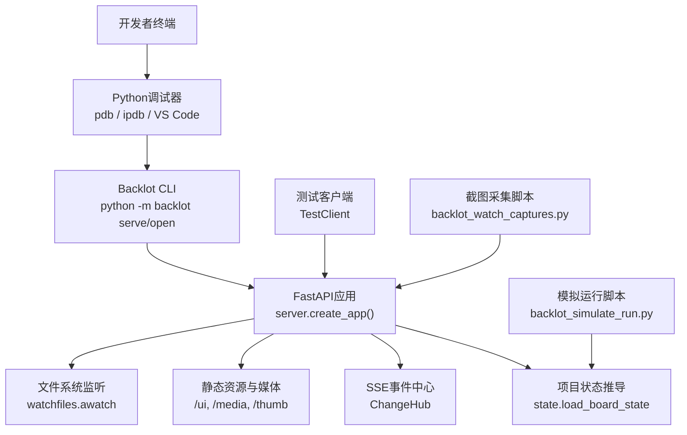
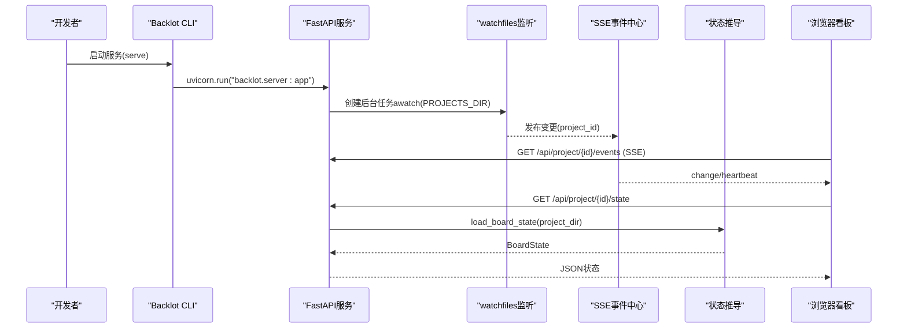
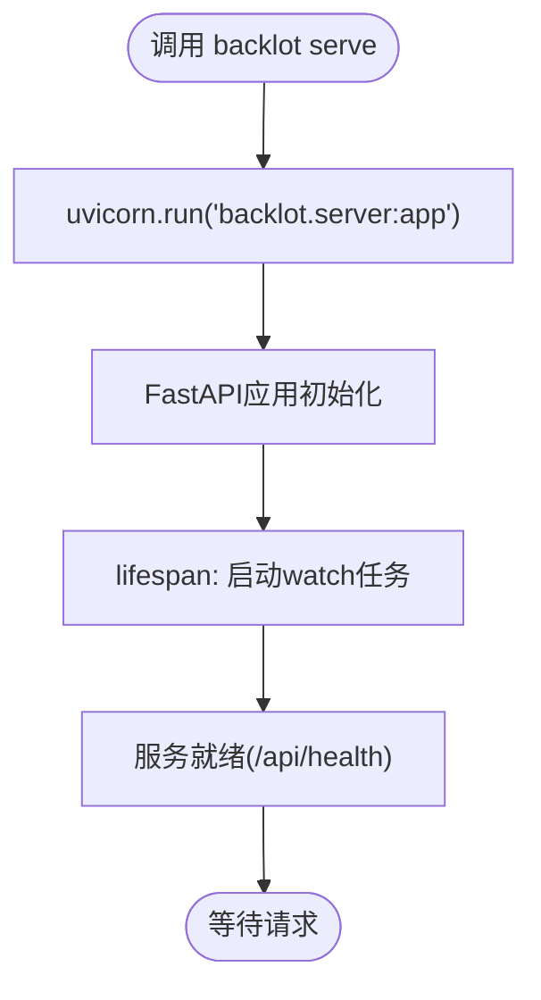
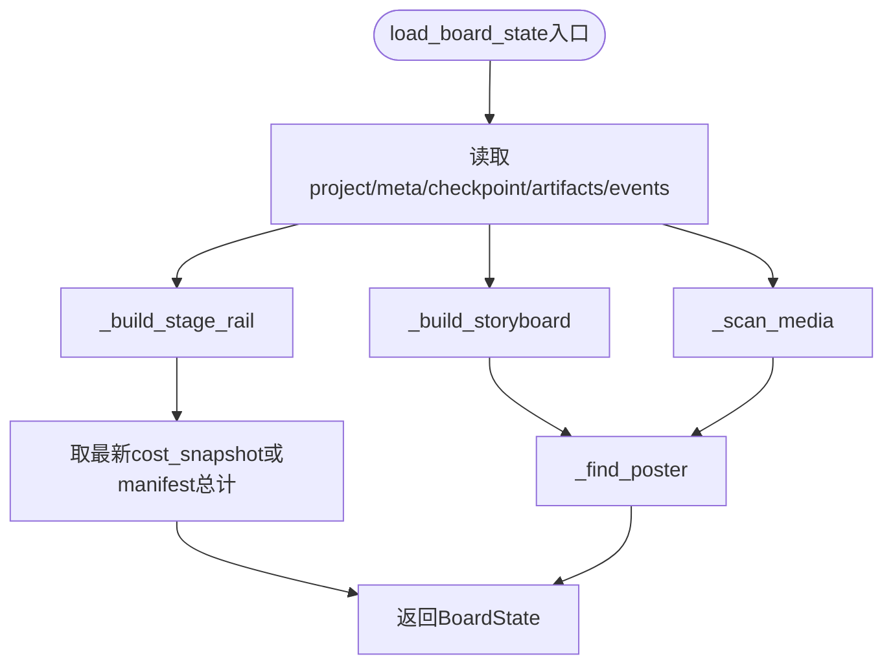
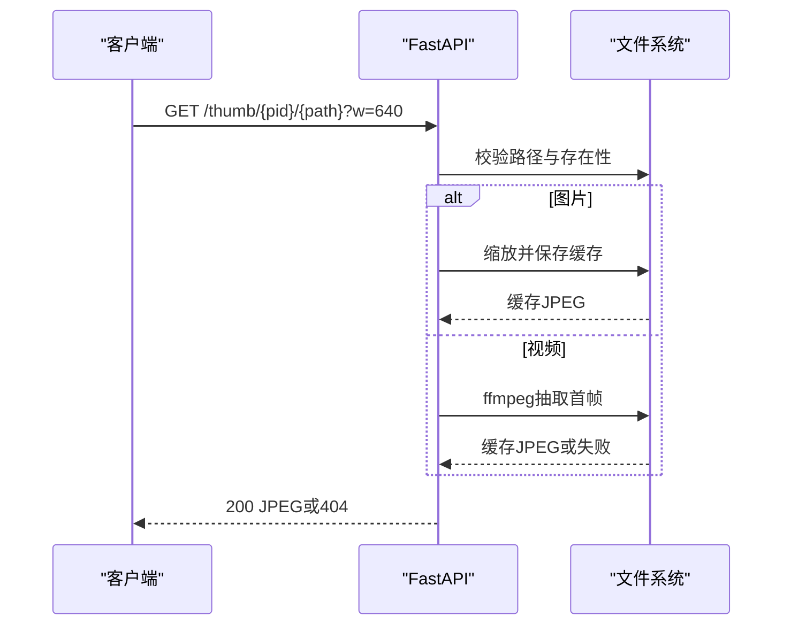
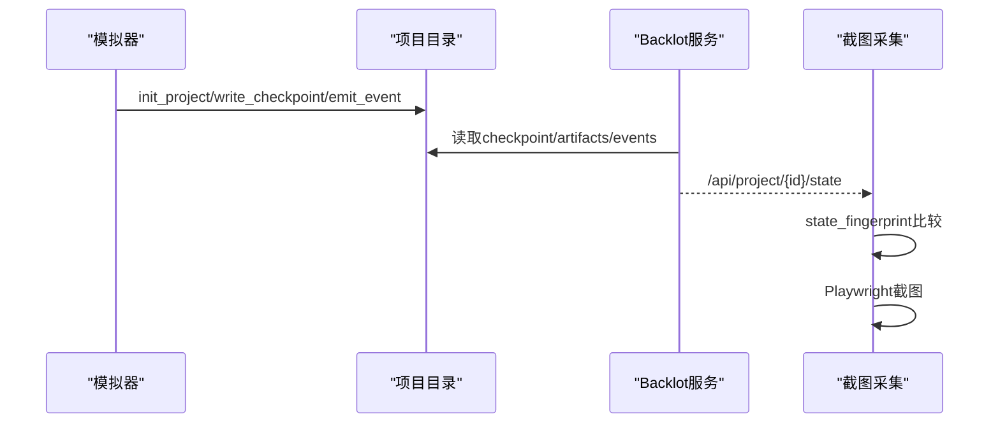
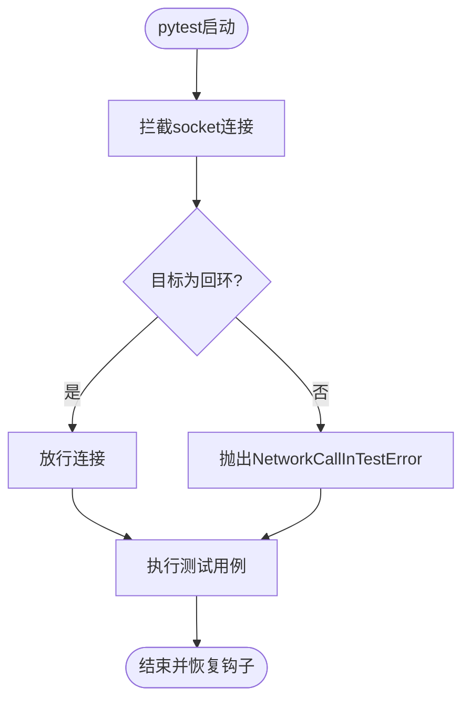
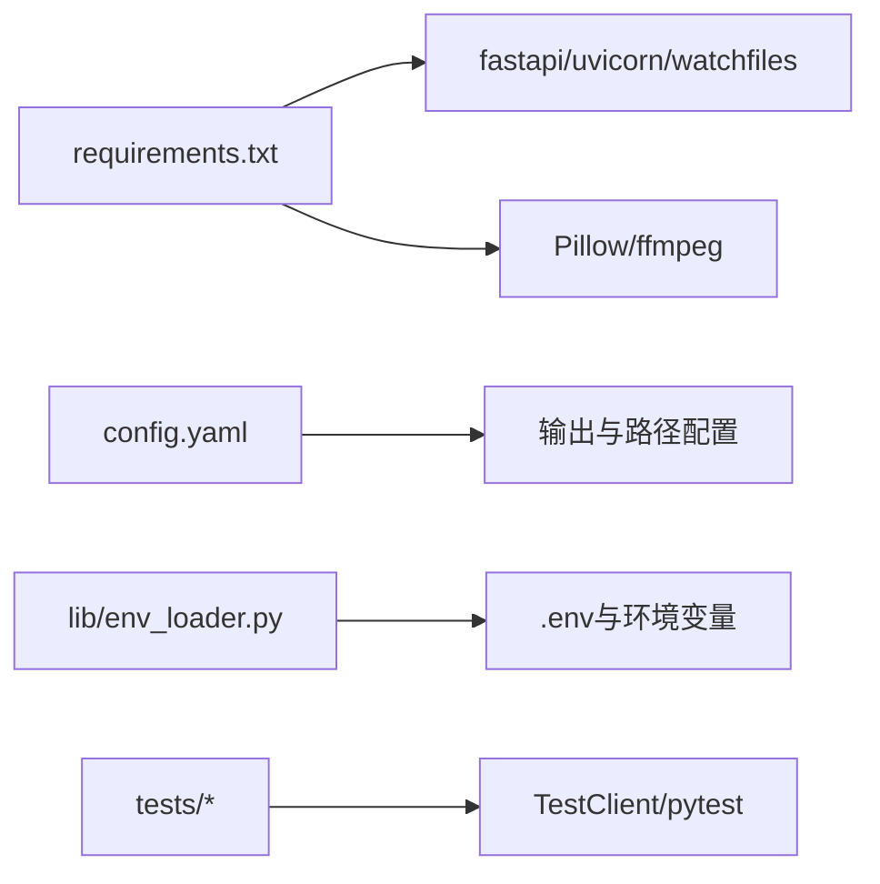

# 调试工具

<cite>
**本文引用的文件**
- [backlot/__main__.py](file://backlot/__main__.py)
- [backlot/server.py](file://backlot/server.py)
- [backlot/state.py](file://backlot/state.py)
- [scripts/backlot_simulate_run.py](file://scripts/backlot_simulate_run.py)
- [scripts/backlot_watch_captures.py](file://scripts/backlot_watch_captures.py)
- [tests/conftest.py](file://tests/conftest.py)
- [tests/backlot/test_server.py](file://tests/backlot/test_server.py)
- [tests/backlot/test_state.py](file://tests/backlot/test_state.py)
- [.claude/launch.json](file://.claude/launch.json)
- [lib/env_loader.py](file://lib/env_loader.py)
- [config.yaml](file://config.yaml)
- [requirements.txt](file://requirements.txt)
</cite>

## 目录
1. [简介](#简介)
2. [项目结构](#项目结构)
3. [核心组件](#核心组件)
4. [架构总览](#架构总览)
5. [详细组件分析](#详细组件分析)
6. [依赖关系分析](#依赖关系分析)
7. [性能注意事项](#性能注意事项)
8. [故障排查指南](#故障排查指南)
9. [结论](#结论)
10. [附录](#附录)

## 简介
本指南面向OpenMontage的调试与开发，聚焦Backlot开发模式下的实时看板、事件流、媒体服务与测试生态。内容涵盖：
- Python调试器使用（pdb/ipdb/VS Code）在Backlot服务与状态推导中的断点、变量检查与堆栈跟踪
- Backlot开发模式的启动、SSE事件订阅、日志与状态监控
- 单元测试与集成测试的调试技巧（网络隔离、模拟数据、环境隔离）
- Docker容器调试方法（端口映射、日志收集、进程内调试）
- 生产环境远程调试方案（安全、性能、访问控制）
- 常用调试命令与脚本集合（快速定位问题）

## 项目结构
OpenMontage将“实时看板”能力封装为Backlot子模块，提供FastAPI服务、文件系统监听、SSE事件推送与媒体缩略图服务；配套脚本用于模拟运行与截图采集；测试套件覆盖API、状态推导与性能预算。



图表来源
- [backlot/__main__.py:82-86](file://backlot/__main__.py#L82-L86)
- [backlot/server.py:165-307](file://backlot/server.py#L165-L307)
- [backlot/state.py:588-658](file://backlot/state.py#L588-L658)
- [scripts/backlot_simulate_run.py:62-157](file://scripts/backlot_simulate_run.py#L62-L157)
- [scripts/backlot_watch_captures.py:133-191](file://scripts/backlot_watch_captures.py#L133-L191)

章节来源
- [backlot/__main__.py:1-110](file://backlot/__main__.py#L1-L110)
- [backlot/server.py:1-369](file://backlot/server.py#L1-L369)
- [backlot/state.py:1-716](file://backlot/state.py#L1-L716)

## 核心组件
- Backlot CLI：提供serve与open两个子命令，支持后台启动、健康检查与浏览器打开看板。
- FastAPI服务：暴露健康检查、项目列表、项目状态、SSE事件流、媒体与缩略图接口，并挂载UI静态资源。
- 状态推导：从项目目录读取checkpoint、artifacts、events等，构建可渲染的BoardState，包含阶段轨道、故事板、媒体清单与成本快照。
- 模拟器：按真实契约驱动项目生命周期，写入checkpoint与事件，便于观察看板实时更新。
- 截图采集：轮询项目状态指纹变化，通过Playwright截取库视图与项目看板。
- 测试套件：基于TestClient验证API形状、路径安全、范围请求、缩略图生成与性能预算；会话级网络拦截确保测试不产生外部费用。

章节来源
- [backlot/__main__.py:23-86](file://backlot/__main__.py#L23-L86)
- [backlot/server.py:165-307](file://backlot/server.py#L165-L307)
- [backlot/state.py:588-658](file://backlot/state.py#L588-L658)
- [scripts/backlot_simulate_run.py:62-157](file://scripts/backlot_simulate_run.py#L62-L157)
- [scripts/backlot_watch_captures.py:133-191](file://scripts/backlot_watch_captures.py#L133-L191)
- [tests/backlot/test_server.py:88-206](file://tests/backlot/test_server.py#L88-L206)
- [tests/backlot/test_state.py:54-357](file://tests/backlot/test_state.py#L54-L357)
- [tests/conftest.py:1-132](file://tests/conftest.py#L1-L132)

## 架构总览
Backlot以FastAPI为核心，结合watchfiles进行项目目录变更监听，通过SSE向浏览器推送变更通知；状态推导层负责将磁盘上的checkpoint/artifacts/events聚合为统一的BoardState；媒体与缩略图服务提供安全的文件访问与缓存。



图表来源
- [backlot/__main__.py:82-86](file://backlot/__main__.py#L82-L86)
- [backlot/server.py:132-163](file://backlot/server.py#L132-L163)
- [backlot/server.py:178-212](file://backlot/server.py#L178-L212)
- [backlot/state.py:588-658](file://backlot/state.py#L588-L658)

## 详细组件分析

### Backlot CLI与服务启动
- serve子命令通过uvicorn启动FastAPI应用，默认监听本地回环地址，便于调试时避免外网暴露。
- open子命令会检查服务是否存活，若未启动则后台拉起serve进程，并自动打开浏览器看板页面。
- 端口可通过环境变量BACKLOT_PORT或命令行参数调整。



图表来源
- [backlot/__main__.py:82-86](file://backlot/__main__.py#L82-L86)
- [backlot/server.py:151-167](file://backlot/server.py#L151-L167)

章节来源
- [backlot/__main__.py:23-86](file://backlot/__main__.py#L23-L86)

### SSE事件与变更广播
- ChangeHub维护订阅队列，按项目过滤广播，避免无关项目风暴影响单项目看板。
- 服务端提供/api/project/{id}/events与/api/library/events两个SSE端点，心跳间隔固定，超时发送心跳帧。
- watchfiles监听PROJECTS_DIR，忽略node_modules/.git/__pycache__/.cache等噪声目录，仅对有效变更触发摘要失效与广播。

```mermaid
classDiagram
class ChangeHub {
+subscribe(project_id) Queue
+unsubscribe(q) void
+publish(project_id) void
-_subscribers dict
}
class Server {
+create_app() FastAPI
+/api/project/{id}/events
+/api/library/events
}
Server --> ChangeHub : "使用"
```

图表来源
- [backlot/server.py:43-74](file://backlot/server.py#L43-L74)
- [backlot/server.py:178-239](file://backlot/server.py#L178-L239)

章节来源
- [backlot/server.py:43-74](file://backlot/server.py#L43-L74)
- [backlot/server.py:132-163](file://backlot/server.py#L132-L163)
- [backlot/server.py:178-239](file://backlot/server.py#L178-L239)

### 项目状态推导与看板数据
- load_board_state读取project/meta/checkpoint/artifacts/events，构建stages、storyboard、media、cost等字段。
- 阶段轨道根据manifest或fallback stages生成，支持gated阶段审计与历史版本回溯。
- 故事板合并scene_plan/script/asset_manifest，并结合events推断generating状态与工具来源。
- 媒体扫描renders/snapshots/music，poster选择优先图像，其次快照，最后视频首帧。



图表来源
- [backlot/state.py:588-658](file://backlot/state.py#L588-L658)
- [backlot/state.py:145-224](file://backlot/state.py#L145-L224)
- [backlot/state.py:403-495](file://backlot/state.py#L403-L495)
- [backlot/state.py:502-562](file://backlot/state.py#L502-L562)

章节来源
- [backlot/state.py:588-658](file://backlot/state.py#L588-L658)
- [backlot/state.py:145-224](file://backlot/state.py#L145-L224)
- [backlot/state.py:403-495](file://backlot/state.py#L403-L495)
- [backlot/state.py:502-562](file://backlot/state.py#L502-L562)

### 媒体与缩略图服务
- /media/{project_id}/{file_path}提供带Range请求的文件响应，适合视频流式播放。
- /thumb/{project_id}/{file_path}对图片缩放与视频抽取首帧，结果缓存至.thumbs目录，非媒体文件透传。
- 严格校验路径，防止目录穿越与越权访问。



图表来源
- [backlot/server.py:242-262](file://backlot/server.py#L242-L262)
- [backlot/server.py:325-365](file://backlot/server.py#L325-L365)

章节来源
- [backlot/server.py:242-262](file://backlot/server.py#L242-L262)
- [backlot/server.py:325-365](file://backlot/server.py#L325-L365)

### 模拟运行与截图采集
- backlot_simulate_run.py按真实契约驱动项目生命周期：init_project、in_progress、awaiting_human、completed，并逐步写入artifacts与events，便于观察看板更新。
- backlot_watch_captures.py轮询项目状态指纹，当可见状态变化时通过Playwright截取库视图与项目看板，输出到指定目录。



图表来源
- [scripts/backlot_simulate_run.py:62-157](file://scripts/backlot_simulate_run.py#L62-L157)
- [scripts/backlot_watch_captures.py:40-84](file://scripts/backlot_watch_captures.py#L40-L84)
- [scripts/backlot_watch_captures.py:123-131](file://scripts/backlot_watch_captures.py#L123-L131)

章节来源
- [scripts/backlot_simulate_run.py:62-157](file://scripts/backlot_simulate_run.py#L62-L157)
- [scripts/backlot_watch_captures.py:133-191](file://scripts/backlot_watch_captures.py#L133-L191)

### 测试环境与网络隔离
- tests/conftest.py在会话级别拦截socket.connect/connect_ex/create_connection，阻止非回环网络访问，避免测试产生外部费用。
- 允许通过OPENMONTAGE_ALLOW_NETWORK=1启用真实网络测试，并使用live_api标记筛选。
- 针对Backlot的测试使用TestClient构造内存服务，注入临时projects_root与缩略图缓存目录，验证API形状、路径安全、范围请求与性能预算。



图表来源
- [tests/conftest.py:45-111](file://tests/conftest.py#L45-L111)
- [tests/backlot/test_server.py:23-42](file://tests/backlot/test_server.py#L23-L42)

章节来源
- [tests/conftest.py:1-132](file://tests/conftest.py#L1-L132)
- [tests/backlot/test_server.py:88-206](file://tests/backlot/test_server.py#L88-L206)
- [tests/backlot/test_state.py:54-357](file://tests/backlot/test_state.py#L54-L357)

## 依赖关系分析
- 运行时依赖：fastapi、uvicorn、watchfiles用于服务与监听；Pillow、ffmpeg用于缩略图生成。
- 配置与环境：config.yaml定义全局输出与路径；lib/env_loader.py加载.env并提供get_env/require_env；BACKLOT_PORT控制服务端口。
- 测试依赖：pytest、fastapi.testclient.TestClient、Pillow用于构造与验证。



图表来源
- [requirements.txt:1-17](file://requirements.txt#L1-L17)
- [config.yaml:1-34](file://config.yaml#L1-L34)
- [lib/env_loader.py:15-34](file://lib/env_loader.py#L15-L34)

章节来源
- [requirements.txt:1-17](file://requirements.txt#L1-L17)
- [config.yaml:1-34](file://config.yaml#L1-L34)
- [lib/env_loader.py:15-34](file://lib/env_loader.py#L15-L34)

## 性能注意事项
- 项目列表与状态查询有宽松性能预算，冷启动与热路径分别限制在秒级与亚百毫秒级。
- 缩略图生成需控制在1.5秒以内，避免阻塞UI。
- 变更监听批量处理，忽略噪声目录，减少不必要的摘要失效。
- 建议在生产部署中开启反向代理缓存静态资源，并对SSE连接做负载均衡与健康检查。

章节来源
- [tests/backlot/test_server.py:156-193](file://tests/backlot/test_server.py#L156-L193)
- [backlot/server.py:111-149](file://backlot/server.py#L111-L149)

## 故障排查指南
- 服务无法启动：检查端口占用与BACKLOT_PORT设置；查看健康端点/api/health。
- 看板无更新：确认watchfiles可用且PROJECTS_DIR存在；检查变更是否被忽略；验证SSE订阅是否断开。
- 媒体无法访问：确认路径安全校验未拒绝；检查文件是否存在；缩略图失败时返回404而非原始视频。
- 测试失败：确认未意外发起外部网络；如需真实API调用，设置OPENMONTAGE_ALLOW_NETWORK=1并标记live_api。
- 状态异常：检查checkpoint与artifacts格式；关注gate_skipped与stalled标志；核对events.jsonl是否写入。

章节来源
- [backlot/server.py:170-172](file://backlot/server.py#L170-L172)
- [backlot/server.py:242-276](file://backlot/server.py#L242-L276)
- [backlot/state.py:630-638](file://backlot/state.py#L630-L638)
- [tests/conftest.py:45-111](file://tests/conftest.py#L45-L111)

## 结论
Backlot为OpenMontage提供了强大的实时看板与调试基础设施。通过CLI、FastAPI、SSE与文件系统监听，开发者可在本地快速迭代与诊断；配合模拟器与截图采集脚本，能够可视化地验证流水线状态与产物；严格的测试网络隔离与性能预算保障开发体验与稳定性。生产环境应结合反向代理、访问控制与安全策略，谨慎开放调试能力。

## 附录

### Python调试器使用要点
- pdb/ipdb：在服务入口或关键函数插入断点，查看变量、调用栈与表达式；推荐在状态推导与媒体处理路径设置断点。
- VS Code调试：使用已配置的backlot启动项，直接附加到serve进程；设置断点后刷新看板观察SSE事件与状态变化。
- 断点建议位置：
  - 服务启动：backlot/__main__.py的cmd_serve
  - 路由处理：backlot/server.py的API端点
  - 状态推导：backlot/state.py的load_board_state与_build_*系列函数
  - 事件写入：scripts/backlot_simulate_run.py的emit_event与write_checkpoint

章节来源
- [backlot/__main__.py:82-86](file://backlot/__main__.py#L82-L86)
- [backlot/server.py:165-307](file://backlot/server.py#L165-L307)
- [backlot/state.py:588-658](file://backlot/state.py#L588-L658)
- [scripts/backlot_simulate_run.py:62-157](file://scripts/backlot_simulate_run.py#L62-L157)

### Backlot开发模式启用与调试
- 启动服务：python -m backlot serve [--port N]
- 打开看板：python -m backlot open [project-id]
- 模拟运行：python scripts/backlot_simulate_run.py [--project <id>] [--fast] [--cleanup]
- 截图采集：python scripts/backlot_watch_captures.py --projects <ids> [--base-url http://127.0.0.1:4750]
- 健康检查：curl http://127.0.0.1:4750/api/health
- 获取项目状态：curl http://127.0.0.1:4750/api/project/<id>/state
- 订阅事件：浏览器打开http://127.0.0.1:4750/p/<id>，观察SSE更新

章节来源
- [backlot/__main__.py:23-86](file://backlot/__main__.py#L23-L86)
- [scripts/backlot_simulate_run.py:62-157](file://scripts/backlot_simulate_run.py#L62-L157)
- [scripts/backlot_watch_captures.py:133-191](file://scripts/backlot_watch_captures.py#L133-L191)

### 单元测试与集成测试调试技巧
- 网络隔离：默认禁止非回环连接；需要真实API时设置OPENMONTAGE_ALLOW_NETWORK=1并标记live_api。
- 模拟数据：使用tmp_path构造项目目录，写入project.json、checkpoint、artifacts与events，验证状态推导与API行为。
- 环境隔离：通过monkeypatch替换PROJECTS_DIR与缩略图缓存目录，避免污染宿主环境。
- 性能验证：测量/api/projects与/api/project/{id}/state的冷/热路径耗时，确保满足预算。

章节来源
- [tests/conftest.py:1-132](file://tests/conftest.py#L1-L132)
- [tests/backlot/test_server.py:23-42](file://tests/backlot/test_server.py#L23-L42)
- [tests/backlot/test_server.py:156-193](file://tests/backlot/test_server.py#L156-L193)
- [tests/backlot/test_state.py:54-357](file://tests/backlot/test_state.py#L54-L357)

### Docker容器调试方法
- 端口映射：将服务端口映射到宿主机，如-p 4750:4750，便于外部访问看板与API。
- 日志收集：捕获stdout/stderr与SSE心跳，结合反向代理记录请求；必要时挂载卷持久化缩略图缓存。
- 进程内调试：在容器内安装debugpy或pdb，附加到uvicorn进程；或使用VS Code remote attach。
- 环境变量：通过.env或docker run -e传入BACKLOT_PORT、OPENMONTAGE_ALLOW_NETWORK等。

[本节为通用指导，不直接分析具体文件]

### 生产环境远程调试方案
- 安全考虑：仅对内网或受信任网络暴露调试端口；使用TLS与认证；避免在生产镜像中包含调试依赖。
- 性能影响：调试会降低吞吐与增加延迟；仅在必要时启用，并在低峰期执行。
- 访问控制：结合反向代理与IP白名单；限制可访问的路径与用户角色。
- 监控与告警：记录调试会话与关键指标；异常时自动降级或关闭调试能力。

[本节为通用指导，不直接分析具体文件]

### 常用调试命令与脚本集合
- 启动服务：python -m backlot serve --port 4750
- 打开看板：python -m backlot open my-project
- 模拟运行：python scripts/backlot_simulate_run.py --project demo-run --fast
- 截图采集：python scripts/backlot_watch_captures.py --projects demo-run --interval 10
- 健康检查：curl http://127.0.0.1:4750/api/health
- 获取状态：curl http://127.0.0.1:4750/api/project/demo-run/state
- 运行测试：pytest tests/backlot -v
- 允许网络测试：OPENMONTAGE_ALLOW_NETWORK=1 pytest -m live_api

章节来源
- [backlot/__main__.py:82-86](file://backlot/__main__.py#L82-L86)
- [scripts/backlot_simulate_run.py:62-157](file://scripts/backlot_simulate_run.py#L62-L157)
- [scripts/backlot_watch_captures.py:133-191](file://scripts/backlot_watch_captures.py#L133-L191)
- [tests/conftest.py:114-132](file://tests/conftest.py#L114-L132)