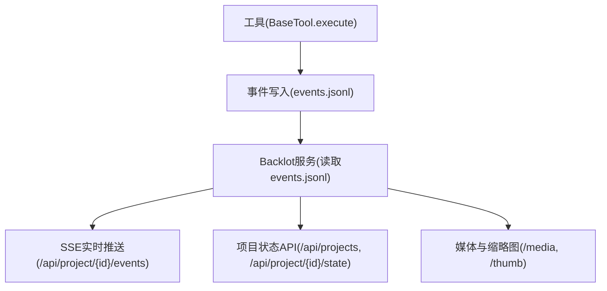
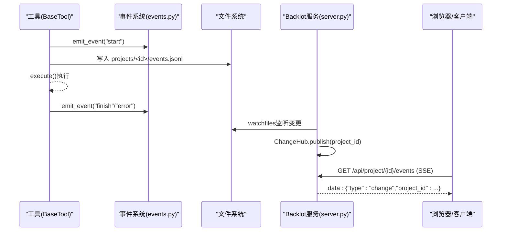
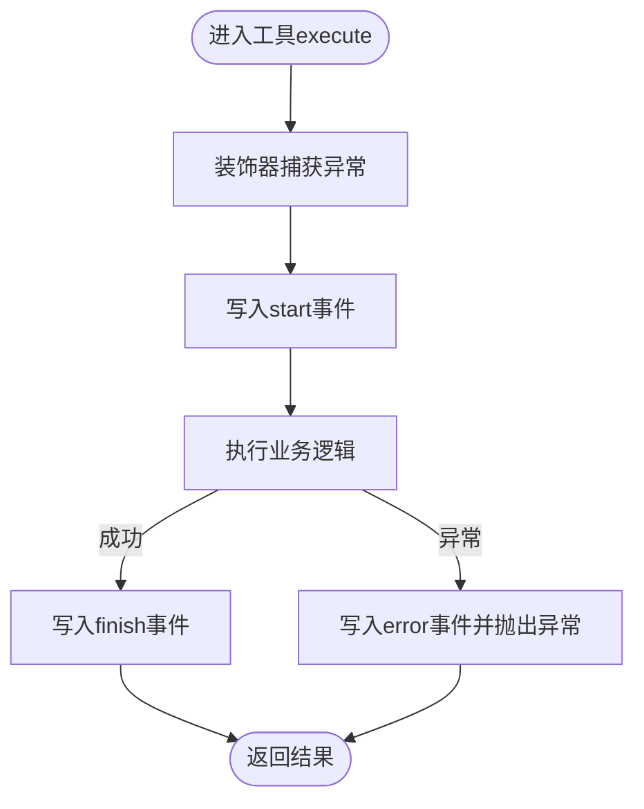
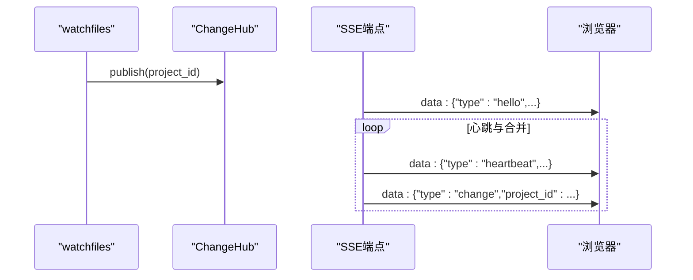
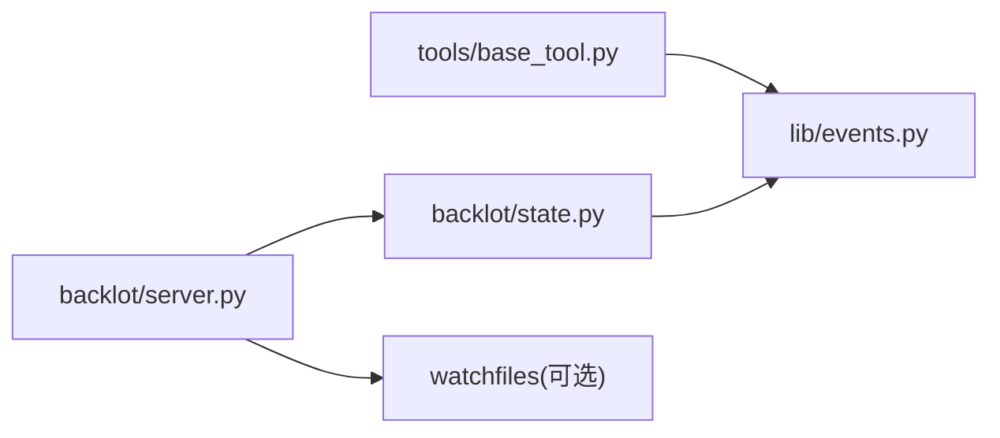

# 运行时错误

<cite>
**本文引用的文件**
- [lib/events.py](file://lib/events.py)
- [backlot/server.py](file://backlot/server.py)
- [backlot/state.py](file://backlot/state.py)
- [tools/base_tool.py](file://tools/base_tool.py)
- [config.yaml](file://config.yaml)
- [.claude/launch.json](file://.claude/launch.json)
- [tests/backlot/test_ui_bug_bash.py](file://tests/backlot/test_ui_bug_bash.py)
- [tests/contracts/test_backlot_contract.py](file://tests/contracts/test_backlot_contract.py)
- [tests/contracts/test_env_example.py](file://tests/contracts/test_env_example.py)
- [tests/conftest.py](file://tests/conftest.py)
- [backlot/ui/lib.js](file://backlot/ui/lib.js)
</cite>

## 目录
1. [简介](#简介)
2. [项目结构](#项目结构)
3. [核心组件](#核心组件)
4. [架构总览](#架构总览)
5. [详细组件分析](#详细组件分析)
6. [依赖关系分析](#依赖关系分析)
7. [性能与资源问题排查](#性能与资源问题排查)
8. [故障诊断指南](#故障诊断指南)
9. [结论](#结论)
10. [附录](#附录)

## 简介
本指南面向OpenMontage运行时的错误诊断，覆盖以下关键场景：
- Python异常、工具执行错误、管道执行失败的堆栈解读
- Backlot事件系统的监控与调试（events.jsonl、SSE实时流）
- 网络请求失败（API超时、认证失败、速率限制）的诊断方法
- 内存泄漏检测、性能瓶颈识别、资源占用异常的调试技巧
- 测试环境的网络隔离机制与调试模式启用方法

目标是帮助你在生产或本地环境中快速定位根因、缩小影响面并恢复服务。

## 项目结构
OpenMontage的运行时可观测性由“工具层 + 事件系统 + Backlot服务”构成：
- 工具层：所有工具继承BaseTool，execute被自动包装以记录start/finish/error事件
- 事件系统：lib/events.py将事件追加到每个项目的events.jsonl
- Backlot服务：FastAPI提供状态查询、SSE变更推送、媒体与缩略图服务；watchfiles监听projects目录变化并广播

图表来源
- [tools/base_tool.py:148-224](file://tools/base_tool.py#L148-L224)
- [lib/events.py:77-118](file://lib/events.py#L77-L118)
- [backlot/server.py:165-240](file://backlot/server.py#L165-L240)

章节来源
- [tools/base_tool.py:148-224](file://tools/base_tool.py#L148-L224)
- [lib/events.py:1-118](file://lib/events.py#L1-L118)
- [backlot/server.py:1-369](file://backlot/server.py#L1-L369)

## 核心组件
- BaseTool与事件包装：为每个工具的execute注入start/finish/error事件，支持嵌套深度、成本与耗时统计
- events.jsonl：按项目分文件的追加式事件日志，读端容忍损坏行
- Backlot服务器：提供健康检查、项目列表、项目状态、SSE事件流、媒体访问；后台watchfiles监听文件系统变更并广播
- 状态推导：从checkpoint、artifacts、events等构建看板状态，包含停滞检测、活跃窗口判断

章节来源
- [tools/base_tool.py:148-224](file://tools/base_tool.py#L148-L224)
- [lib/events.py:77-118](file://lib/events.py#L77-L118)
- [backlot/server.py:132-240](file://backlot/server.py#L132-L240)
- [backlot/state.py:588-658](file://backlot/state.py#L588-L658)

## 架构总览

图表来源
- [tools/base_tool.py:148-224](file://tools/base_tool.py#L148-L224)
- [lib/events.py:77-118](file://lib/events.py#L77-L118)
- [backlot/server.py:132-240](file://backlot/server.py#L132-L240)

## 详细组件分析

### 工具执行与错误传播
- BaseTool对execute进行装饰器包装，捕获异常并写入error事件，再向上抛出原始异常，保证调用方可获得完整堆栈
- 子进程命令通过run_command统一封装，返回码非零时抛出ToolCommandError，附带stderr/stdout/detail便于定位外部工具失败原因
- 依赖检查在check_dependencies中完成，缺失环境、二进制或Python模块会抛出DependencyError

图表来源
- [tools/base_tool.py:148-224](file://tools/base_tool.py#L148-L224)
- [tools/base_tool.py:411-453](file://tools/base_tool.py#L411-L453)

章节来源
- [tools/base_tool.py:148-224](file://tools/base_tool.py#L148-L224)
- [tools/base_tool.py:411-453](file://tools/base_tool.py#L411-L453)
- [tools/base_tool.py:304-327](file://tools/base_tool.py#L304-L327)

### Backlot事件系统与SSE
- events.jsonl是追加式JSON Lines，每行一个事件，包含时间戳、工具名、scene_id、depth、event类型等
- read_events容错解析，忽略损坏行；emit_event永不抛错，确保可观测性不影响主流程
- Backlot服务通过watchfiles监听projects目录，变更时向ChangeHub发布项目ID，SSE订阅者收到change事件后刷新状态

图表来源
- [lib/events.py:77-118](file://lib/events.py#L77-L118)
- [backlot/server.py:43-74](file://backlot/server.py#L43-L74)
- [backlot/server.py:183-240](file://backlot/server.py#L183-L240)

章节来源
- [lib/events.py:77-118](file://lib/events.py#L77-L118)
- [backlot/server.py:132-240](file://backlot/server.py#L132-L240)

### 项目状态与停滞检测
- load_board_state聚合checkpoint、artifacts、events，计算stage rail、storyboard、媒体清单
- 停滞检测：若某阶段处于in_progress且超过阈值无活动，标记stalled并给出分钟数
- 活跃窗口：最近活动时间在阈值内视为live

章节来源
- [backlot/state.py:588-658](file://backlot/state.py#L588-L658)
- [backlot/state.py:630-638](file://backlot/state.py#L630-L638)

### 网络请求失败与前端交互
- 前端库函数getJSON在响应非ok时抛出错误，便于UI层快速感知后端不可用
- 服务端提供/api/health用于健康探测，测试中通过轮询该接口确认服务就绪

章节来源
- [backlot/ui/lib.js:3-7](file://backlot/ui/lib.js#L3-L7)
- [backlot/server.py:170-172](file://backlot/server.py#L170-L172)
- [tests/backlot/test_ui_bug_bash.py:135-167](file://tests/backlot/test_ui_bug_bash.py#L135-L167)

## 依赖关系分析
- tools/base_tool.py依赖lib.events进行事件写入；若导入失败则降级为不记录事件
- backlot/server.py依赖watchfiles（可选），若无则仍可通过手动刷新工作
- backlot/state.py依赖lib.paths与lib.events，负责只读推导看板状态
- config.yaml提供全局配置（LLM、预算、输出格式、路径等），但不直接参与运行时错误处理

图表来源
- [tools/base_tool.py:166-170](file://tools/base_tool.py#L166-L170)
- [backlot/server.py:132-138](file://backlot/server.py#L132-L138)
- [backlot/state.py:16-17](file://backlot/state.py#L16-L17)

章节来源
- [tools/base_tool.py:166-170](file://tools/base_tool.py#L166-L170)
- [backlot/server.py:132-138](file://backlot/server.py#L132-L138)
- [backlot/state.py:16-17](file://backlot/state.py#L16-L17)

## 性能与资源问题排查
- 事件写入采用线程锁保护，跨进程未同步但单行追加通常安全；若出现丢失事件，属于设计上的降级行为
- Backlot服务对summary缓存避免重复解析大文件；watchfiles批量变更去重后广播，减少风暴
- 停滞检测基于最后活动时间与阈值，有助于发现卡住的阶段
- 缩略图生成使用ffmpeg/PIL并缓存至磁盘，失败时静默降级，避免阻塞媒体服务

建议实践
- 关注events.jsonl中的duration_s字段，定位慢工具
- 观察stalled标志与last_activity，识别长时间无活动的阶段
- 监控SSE心跳间隔与队列长度，评估高并发下的推送延迟

章节来源
- [lib/events.py:26-29](file://lib/events.py#L26-L29)
- [backlot/server.py:76-108](file://backlot/server.py#L76-L108)
- [backlot/server.py:132-149](file://backlot/server.py#L132-L149)
- [backlot/state.py:626-638](file://backlot/state.py#L626-L638)
- [backlot/server.py:325-365](file://backlot/server.py#L325-L365)

## 故障诊断指南

### 如何分析与解读错误堆栈
- 工具异常：BaseTool会在error事件中记录异常消息前若干字符与耗时；同时向上抛出原始异常，调用方应保留完整堆栈
- 子进程失败：ToolCommandError包含returncode、cmd、output、stderr、detail，优先查看detail与stderr定位外部工具错误
- 依赖缺失：DependencyError指明缺失的环境变量、二进制或Python模块，按install_instructions修复

操作要点
- 在调用链顶层捕获异常并打印完整traceback
- 结合events.jsonl中的tool、scene_id、depth、event=error字段定位具体工具与场景
- 对于外部工具失败，检查run_command传入的timeout与cwd参数是否合理

章节来源
- [tools/base_tool.py:194-203](file://tools/base_tool.py#L194-L203)
- [tools/base_tool.py:443-453](file://tools/base_tool.py#L443-L453)
- [tools/base_tool.py:304-327](file://tools/base_tool.py#L304-L327)

### Backlot事件系统的监控与调试
- 查看项目events.jsonl：过滤event=error的行，获取错误消息与耗时
- 使用SSE实时观察：/api/project/{id}/events返回hello/heartbeat/change事件，可用于验证事件链路
- 若watchfiles不可用，服务仍可工作但需手动刷新；此时关注健康端点与项目列表

章节来源
- [lib/events.py:77-118](file://lib/events.py#L77-L118)
- [backlot/server.py:183-240](file://backlot/server.py#L183-L240)
- [backlot/server.py:132-138](file://backlot/server.py#L132-L138)

### 网络请求失败的诊断方法
- API连接超时：检查工具的网络相关resource_profile与外部依赖；在调用处设置合理的timeout并捕获超时异常
- 认证失败：确认.env或环境变量已正确加载（BaseTool在导入时加载.env）；检查依赖项中的env:XXX要求
- 速率限制：参考技能文档中的重试策略与指数退避；在服务端侧关注429响应与Retry-After头

注意
- 本项目未内置统一的HTTP客户端重试框架，需在具体工具实现中遵循最佳实践
- 前端getJSON对非ok响应直接抛错，便于快速失败

章节来源
- [tools/base_tool.py:25-60](file://tools/base_tool.py#L25-L60)
- [tools/base_tool.py:304-327](file://tools/base_tool.py#L304-L327)
- [backlot/ui/lib.js:3-7](file://backlot/ui/lib.js#L3-L7)

### 内存泄漏检测、性能瓶颈识别、资源占用异常
- 事件写入与状态推导均为I/O密集，关注events.jsonl大小增长与read_events的limit参数
- 停滞检测可辅助识别卡住的任务；结合duration_s与stage状态定位瓶颈
- 缩略图生成失败会静默降级，不会阻塞媒体服务；若频繁失败，检查ffmpeg/PIL可用性与权限

建议
- 定期清理历史checkpoint与history目录，控制磁盘占用
- 在高并发渲染时，关注watchfiles批处理与ChangeHub队列是否积压

章节来源
- [backlot/state.py:626-638](file://backlot/state.py#L626-L638)
- [backlot/server.py:325-365](file://backlot/server.py#L325-L365)
- [lib/events.py:98-118](file://lib/events.py#L98-L118)

### 测试环境的网络隔离与调试模式
- 启动Backlot服务：使用VS Code launch配置或命令行python -m backlot serve --port <端口>
- 健康检查：测试中轮询/api/health确认服务就绪
- 隔离注册表：测试夹具isolated_tool_registry可替换全局ToolRegistry，避免测试间污染
- .env示例校验：确保.env.example不包含假凭据，避免误加载

章节来源
- [.claude/launch.json:1-17](file://.claude/launch.json#L1-L17)
- [tests/backlot/test_ui_bug_bash.py:135-167](file://tests/backlot/test_ui_bug_bash.py#L135-L167)
- [tests/conftest.py:10-15](file://tests/conftest.py#L10-L15)
- [tests/contracts/test_env_example.py:9-19](file://tests/contracts/test_env_example.py#L9-L19)

## 结论
OpenMontage通过BaseTool的事件包装与Backlot的可观测性服务，提供了端到端的运行时诊断能力。遇到错误时，优先从events.jsonl与SSE入手，结合工具异常与子进程错误信息定位根因；在网络与性能问题上，结合停滞检测、心跳与队列状态进行综合判断。测试环境可通过健康检查与隔离夹具保障稳定性。

## 附录
- 全局配置位于config.yaml，涵盖LLM、预算、输出格式与路径等，可按需调整
- 建议在关键工具中记录cost_usd与duration_seconds，便于成本与性能分析
- 对于外部依赖（如ffmpeg、PIL），确保安装与权限正确，避免静默降级掩盖真实问题

章节来源
- [config.yaml:1-34](file://config.yaml#L1-L34)