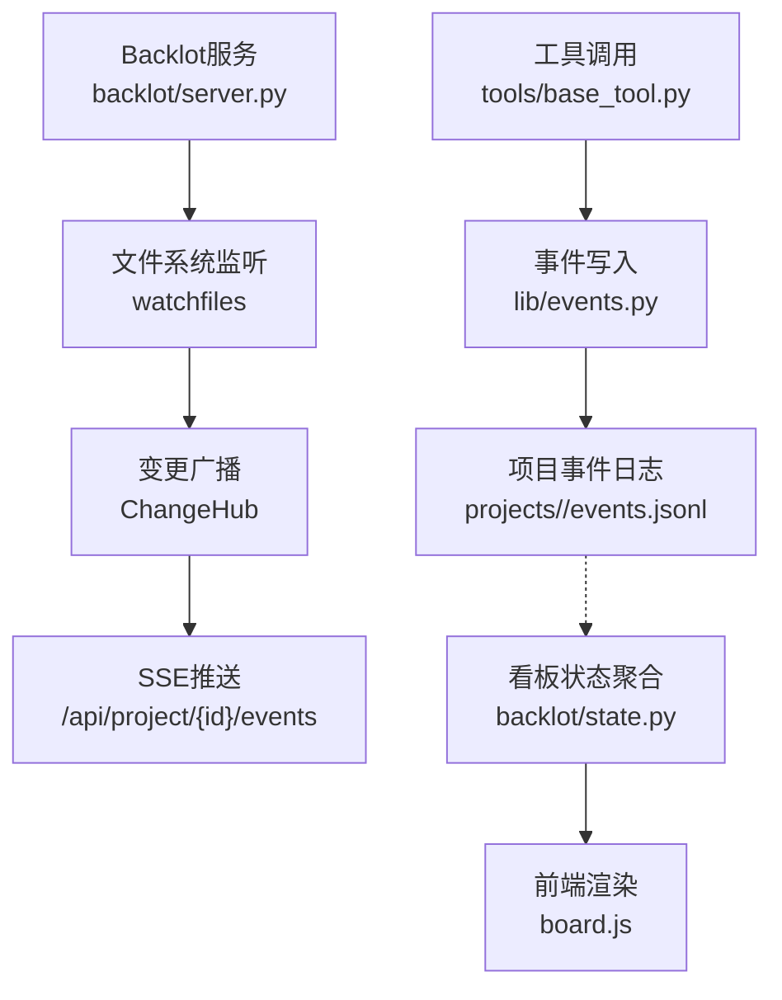
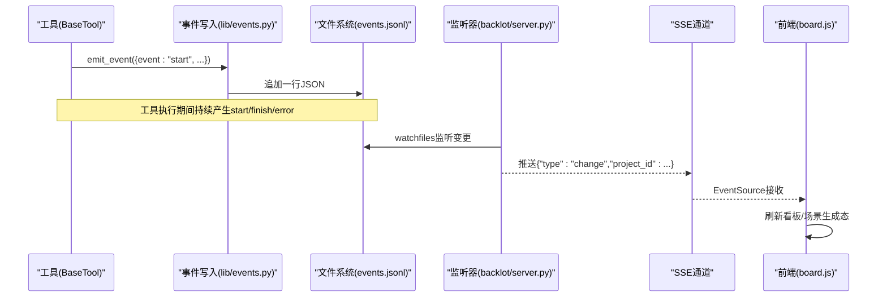
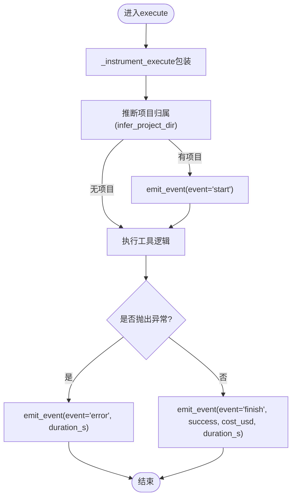
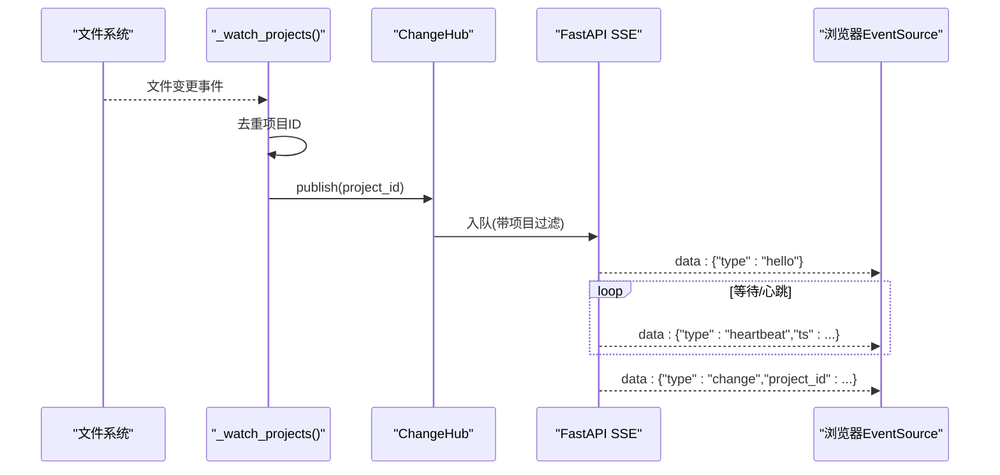
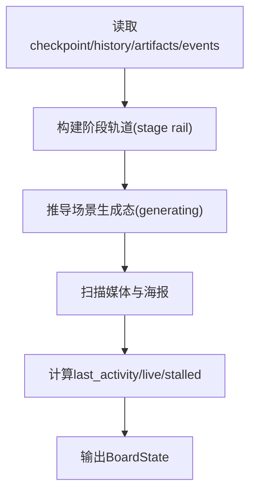
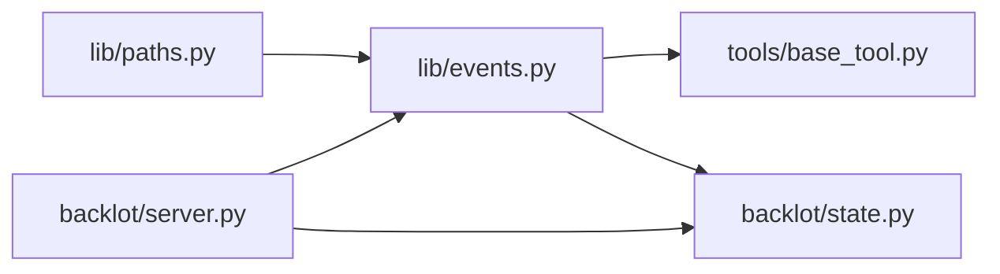

# 事件系统

<cite>
**本文引用的文件**
- [lib/events.py](file://lib/events.py)
- [tools/base_tool.py](file://tools/base_tool.py)
- [backlot/server.py](file://backlot/server.py)
- [backlot/state.py](file://backlot/state.py)
- [lib/paths.py](file://lib/paths.py)
- [tests/contracts/test_backlot_contract.py](file://tests/contracts/test_backlot_contract.py)
</cite>

## 目录
1. [简介](#简介)
2. [项目结构](#项目结构)
3. [核心组件](#核心组件)
4. [架构总览](#架构总览)
5. [详细组件分析](#详细组件分析)
6. [依赖关系分析](#依赖关系分析)
7. [性能考量](#性能考量)
8. [故障排查指南](#故障排查指南)
9. [结论](#结论)
10. [附录：API与集成](#附录api与集成)

## 简介
本技术文档面向OpenMontage的事件系统，聚焦Backlot监控下的“工具执行事件”的发布-订阅、异步处理、持久化与实时追踪。该事件系统以“追加式日志（append-only）”为核心，通过BaseTool自动埋点将工具执行生命周期写入每个项目的events.jsonl；Backlot服务通过文件系统监听变化，经SSE向浏览器推送变更，驱动看板实时刷新。

设计原则：
- 可观测性不破坏生产：所有公开函数吞掉异常，失败写事件不会中断主流程。
- 零代理负担：项目归属从工具输入推断，无需额外配置。
- 健壮容错：读取容忍损坏行；跨进程并发写入采用单行追加，偶发撕裂仅丢失一行活动记录。

## 项目结构
事件系统涉及以下关键模块：
- 事件写入与读取：lib/events.py
- 工具自动埋点：tools/base_tool.py
- Backlot服务与SSE：backlot/server.py
- 看板状态聚合与场景生成态推导：backlot/state.py
- 路径常量：lib/paths.py
- 行为验证测试：tests/contracts/test_backlot_contract.py

图表来源
- [tools/base_tool.py:148-224](file://tools/base_tool.py#L148-L224)
- [lib/events.py:77-118](file://lib/events.py#L77-L118)
- [backlot/server.py:132-240](file://backlot/server.py#L132-L240)
- [backlot/state.py:588-658](file://backlot/state.py#L588-L658)

章节来源
- [lib/events.py:1-119](file://lib/events.py#L1-L119)
- [tools/base_tool.py:148-224](file://tools/base_tool.py#L148-L224)
- [backlot/server.py:1-369](file://backlot/server.py#L1-L369)
- [backlot/state.py:1-716](file://backlot/state.py#L1-L716)
- [lib/paths.py:1-18](file://lib/paths.py#L1-L18)

## 核心组件
- 事件写入器（emit_event/read_events）：负责按项目追加JSON Lines事件，提供安全读取与限流。
- 工具埋点（_instrument_execute）：在BaseTool.execute前后自动注入start/finish/error事件，并计算耗时与成本。
- 项目归属推断（infer_project_dir）：从输入参数中解析出项目根目录，确保事件归因准确。
- 变更分发（ChangeHub/SSE）：基于watchfiles监听项目目录变化，向订阅者推送变更通知，支持心跳保活。
- 看板状态聚合（load_board_state/summarize_project）：读取checkpoint、artifacts、events等，构建BoardState，推导场景生成态、活跃阶段、停滞检测等。

章节来源
- [lib/events.py:46-118](file://lib/events.py#L46-L118)
- [tools/base_tool.py:148-224](file://tools/base_tool.py#L148-L224)
- [backlot/server.py:43-74](file://backlot/server.py#L43-L74)
- [backlot/state.py:588-658](file://backlot/state.py#L588-L658)

## 架构总览
事件系统采用“生产者-消费者”解耦模式：
- 生产者：所有工具通过BaseTool自动埋点，将事件追加到各自项目的events.jsonl。
- 消费者：
  - 看板状态聚合器：周期性或按需读取events.jsonl，结合checkpoint/artifacts构建BoardState。
  - 实时推送通道：watchfiles监听项目目录变化，触发SSE推送，前端拉取最新状态。

图表来源
- [tools/base_tool.py:148-224](file://tools/base_tool.py#L148-L224)
- [lib/events.py:77-118](file://lib/events.py#L77-L118)
- [backlot/server.py:132-240](file://backlot/server.py#L132-L240)

## 详细组件分析

### 事件数据结构与序列化
- 存储格式：每行一个JSON对象（JSON Lines），字段包含时间戳与业务负载。
- 关键字段：
  - ts：UTC时间戳（ISO格式）。
  - event：事件类型，如start/finish/error。
  - tool：工具名称。
  - scene_id：场景标识（可选）。
  - depth：嵌套深度（用于去重与聚合）。
  - output_path：输出路径（可选）。
  - success/cost_usd/duration_s：完成或错误时附带。
- 序列化策略：使用默认序列化器，None值字段会被过滤，避免冗余。

章节来源
- [lib/events.py:77-118](file://lib/events.py#L77-L118)
- [tools/base_tool.py:182-220](file://tools/base_tool.py#L182-L220)
- [tests/contracts/test_backlot_contract.py:167-180](file://tests/contracts/test_backlot_contract.py#L167-L180)

### 项目归属推断
- 规则优先级：显式键（project_dir/project_path）优先于路径提示键（output_path/output_dir/input_path等）。
- 约束：仅当解析路径位于PROJECTS_DIR下才认为可归属；否则返回None，不发出事件。
- 鲁棒性：任何异常均返回None，保证“从不猜测 loudly，从不失败”。

章节来源
- [lib/events.py:31-74](file://lib/events.py#L31-L74)
- [lib/paths.py:13-18](file://lib/paths.py#L13-L18)
- [tests/contracts/test_backlot_contract.py:182-187](file://tests/contracts/test_backlot_contract.py#L182-L187)

### 工具埋点与事件发射
- 自动包装：BaseTool子类在执行execute前自动注入_instrument_execute。
- 事件序列：
  - start：进入执行，携带tool、scene_id、depth、output_path。
  - error：捕获异常，记录error消息与duration_s。
  - finish：成功返回，记录success、cost_usd、duration_s。
- 线程安全：使用thread-local计数器跟踪嵌套深度，避免重复统计。
- 非致命性：事件层异常被吞掉，不影响工具执行。

图表来源
- [tools/base_tool.py:148-224](file://tools/base_tool.py#L148-L224)

章节来源
- [tools/base_tool.py:148-224](file://tools/base_tool.py#L148-L224)
- [tests/contracts/test_backlot_contract.py:190-232](file://tests/contracts/test_backlot_contract.py#L190-L232)

### Backlot实时监控与SSE推送
- 监听机制：watchfiles递归监听PROJECTS_DIR，忽略噪声目录（node_modules/.git/__pycache__/.cache）。
- 变更聚合：对批量变更进行去重，仅对受影响的项目ID广播。
- SSE接口：
  - /api/project/{project_id}/events：订阅指定项目变更。
  - /api/library/events：订阅全库变更。
  - 心跳：每15秒发送heartbeat，保持连接活跃。
- 队列管理：每个订阅者维护独立队列，满队丢弃多余通知，避免风暴。

图表来源
- [backlot/server.py:132-240](file://backlot/server.py#L132-L240)

章节来源
- [backlot/server.py:27-149](file://backlot/server.py#L27-L149)
- [backlot/server.py:183-240](file://backlot/server.py#L183-L240)

### 看板状态聚合与场景生成态
- 数据源：checkpoint_*.json、history/checkpoint_*、artifacts/*.json、events.jsonl。
- 阶段轨道：根据pipeline manifest或回退阶段列表构建stage rail，标注gated、produces、status等。
- 场景生成态：遍历events，识别未完成的start且depth=0的事件，标记对应scene为generating。
- 停滞检测：若in_progress阶段超过阈值无活动，标记stalled及stalled_minutes。
- 媒体与海报：扫描renders/snapshots/music，选择最佳poster。

图表来源
- [backlot/state.py:118-224](file://backlot/state.py#L118-L224)
- [backlot/state.py:403-495](file://backlot/state.py#L403-L495)
- [backlot/state.py:565-658](file://backlot/state.py#L565-L658)

章节来源
- [backlot/state.py:118-224](file://backlot/state.py#L118-L224)
- [backlot/state.py:403-495](file://backlot/state.py#L403-L495)
- [backlot/state.py:565-658](file://backlot/state.py#L565-L658)

## 依赖关系分析
- lib/events.py依赖lib/paths.py获取PROJECTS_DIR。
- tools/base_tool.py依赖lib/events.py进行埋点。
- backlot/server.py依赖watchfiles（可选）、backlot/state.py进行状态聚合。
- backlot/state.py依赖lib/events.py读取事件。

图表来源
- [lib/paths.py:13-18](file://lib/paths.py#L13-L18)
- [lib/events.py:22-29](file://lib/events.py#L22-L29)
- [tools/base_tool.py:167-180](file://tools/base_tool.py#L167-L180)
- [backlot/server.py:21-22](file://backlot/server.py#L21-L22)
- [backlot/state.py:16-17](file://backlot/state.py#L16-L17)

章节来源
- [lib/events.py:22-29](file://lib/events.py#L22-L29)
- [tools/base_tool.py:167-180](file://tools/base_tool.py#L167-L180)
- [backlot/server.py:21-22](file://backlot/server.py#L21-L22)
- [backlot/state.py:16-17](file://backlot/state.py#L16-L17)

## 性能考量
- 写入性能：单行追加+线程锁，跨进程并发容忍撕裂行；读取跳过损坏行。
- 监听性能：watchfiles批处理变更，字符串比较快速映射项目ID，避免频繁IO。
- SSE缓冲：队列容量限制，满队丢弃，防止内存膨胀。
- 缓存策略：项目摘要缓存，变更时失效；缩略图缓存至磁盘。
- 停滞检测：基于最后活动时间窗口，减少误报。

[本节为通用指导，不直接分析具体文件]

## 故障排查指南
- 事件未写入：
  - 检查项目归属推断是否成功（infer_project_dir返回None则不写）。
  - 确认PROJECTS_DIR存在且目标目录有效。
- 事件读取异常：
  - read_events容忍损坏行，若仍为空，检查events.jsonl是否存在与权限。
- SSE无推送：
  - 确认watchfiles已安装且PROJECTS_DIR存在。
  - 检查浏览器EventSource连接与心跳。
- 停滞误报：
  - 调整STALL_WINDOW_SECONDS或检查工具是否持续写入checkpoint/events。

章节来源
- [lib/events.py:46-74](file://lib/events.py#L46-L74)
- [lib/events.py:98-118](file://lib/events.py#L98-L118)
- [backlot/server.py:132-149](file://backlot/server.py#L132-L149)
- [backlot/state.py:32-38](file://backlot/state.py#L32-L38)

## 结论
OpenMontage事件系统以轻量、健壮的方式实现了工具执行的可视化与实时追踪。通过BaseTool自动埋点、追加式事件日志、watchfiles+SSE推送，以及稳健的状态聚合，系统在保障生产稳定性的同时提供了丰富的可观测能力。建议在生产环境中关注事件写入成功率、SSE连接健康度与停滞检测阈值调优。

[本节为总结，不直接分析具体文件]

## 附录：API与集成

### 服务端API
- GET /api/health：健康检查。
- GET /api/projects：项目列表摘要。
- GET /api/project/{project_id}/state：项目完整状态。
- GET /api/project/{project_id}/events：SSE订阅项目变更。
- GET /api/library/events：SSE订阅全库变更。
- GET /thumb/{project_id}/{file_path:path}：缩略图。
- GET /media/{project_id}/{file_path:path}：媒体文件。

章节来源
- [backlot/server.py:170-276](file://backlot/server.py#L170-L276)

### 客户端集成方法（浏览器）
- 使用EventSource连接SSE端点，处理hello/heartbeat/change事件。
- 收到change后拉取/api/project/{id}/state更新看板。
- 示例流程：
  - 初始化EventSource("/api/project/{id}/events")。
  - 监听message事件，解析data。
  - 根据type分支处理：hello建立会话、heartbeat保活、change触发刷新。

章节来源
- [backlot/server.py:183-240](file://backlot/server.py#L183-L240)

### 事件数据结构参考
- 事件类型：start、finish、error。
- 公共字段：ts、tool、scene_id、depth、output_path。
- 完成字段：success、cost_usd、duration_s。
- 错误字段：error（截断至300字符）。

章节来源
- [tools/base_tool.py:182-220](file://tools/base_tool.py#L182-L220)
- [lib/events.py:77-118](file://lib/events.py#L77-L118)