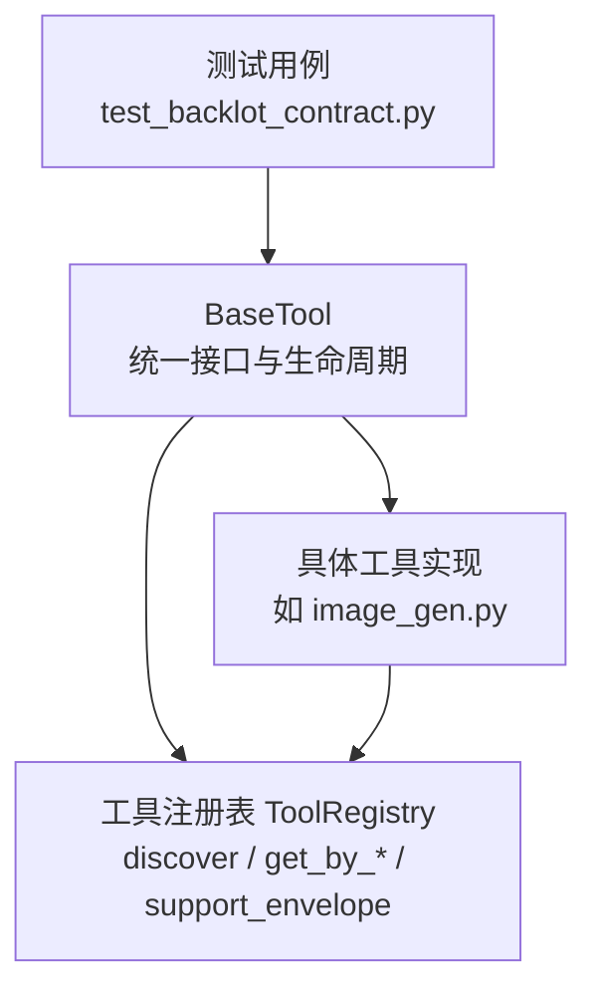
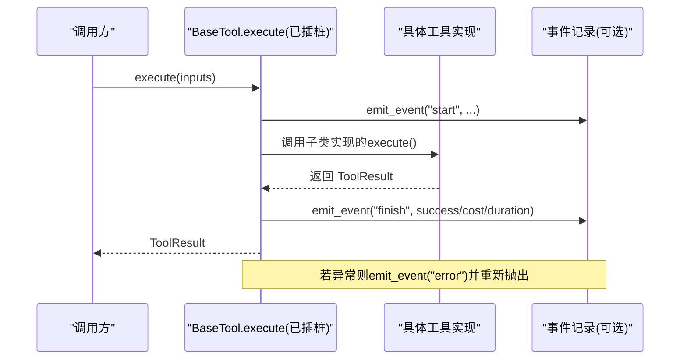

# 基础工具类

<cite>
**本文引用的文件**
- [tools/base_tool.py](file://tools/base_tool.py)
- [tools/tool_registry.py](file://tools/tool_registry.py)
- [tests/contracts/test_backlot_contract.py](file://tests/contracts/test_backlot_contract.py)
- [tools/graphics/image_gen.py](file://tools/graphics/image_gen.py)
</cite>

## 目录
1. [简介](#简介)
2. [项目结构](#项目结构)
3. [核心组件](#核心组件)
4. [架构总览](#架构总览)
5. [详细组件分析](#详细组件分析)
6. [依赖关系分析](#依赖关系分析)
7. [性能考虑](#性能考虑)
8. [故障排查指南](#故障排查指南)
9. [结论](#结论)
10. [附录：自定义工具实现示例](#附录自定义工具实现示例)

## 简介
本文件面向OpenMontage的基础工具体系，聚焦BaseTool抽象基类的设计理念与实现细节，系统阐述统一接口、生命周期管理、依赖检查机制、工具元数据系统（ToolTier、ToolStability、ExecutionMode、Determinism等）、资源配置文件ResourceProfile与重试策略RetryPolicy、以及标准结果ToolResult的规范。同时提供基于真实代码路径的“如何继承BaseTool创建自定义工具”的实践指引，帮助开发者快速构建可发现、可编排、可观测的工具。

## 项目结构
OpenMontage将工具能力以“工具模块 + 注册表”的方式组织：
- 所有工具均继承自BaseTool，暴露统一的execute接口与元数据描述。
- ToolRegistry负责自动发现、注册、查询工具的能力与状态，并提供支持包络报告。
- 测试用例验证了BaseTool的执行插桩、事件上报与错误传播行为。

图表来源
- [tools/base_tool.py:227-407](file://tools/base_tool.py#L227-L407)
- [tools/tool_registry.py:55-210](file://tools/tool_registry.py#L55-L210)
- [tests/contracts/test_backlot_contract.py:190-245](file://tests/contracts/test_backlot_contract.py#L190-L245)

章节来源
- [tools/base_tool.py:227-407](file://tools/base_tool.py#L227-L407)
- [tools/tool_registry.py:55-210](file://tools/tool_registry.py#L55-L210)
- [tests/contracts/test_backlot_contract.py:190-245](file://tests/contracts/test_backlot_contract.py#L190-L245)

## 核心组件
- BaseTool抽象基类：定义工具的统一契约（名称、版本、能力、执行模式、确定性、运行时、依赖、资源、重试、恢复、副作用、回退、质量指标等），并实现依赖检查、信息导出、成本/时长估算、幂等键计算、子进程命令执行、以及execute的自动插桩。
- 枚举类型：ToolTier、ToolStability、ToolStatus、ToolRuntime、ExecutionMode、Determinism、ResumeSupport，用于表达工具的元数据与运行特征。
- 数据结构：ResourceProfile（CPU/内存/显存/磁盘/网络需求）、RetryPolicy（最大重试次数、退避时间、可重试错误集合）、ToolResult（成功标志、数据、产物、错误、成本、时长、种子、模型）。
- ToolRegistry：集中注册与发现工具，按能力/提供商/层级/状态筛选，生成支持包络与菜单摘要，辅助编排器与代理进行预检与路由。

章节来源
- [tools/base_tool.py:63-139](file://tools/base_tool.py#L63-L139)
- [tools/base_tool.py:227-407](file://tools/base_tool.py#L227-L407)
- [tools/tool_registry.py:55-210](file://tools/tool_registry.py#L55-L210)

## 架构总览
BaseTool通过子类化扩展具体能力；ToolRegistry在导入时扫描工具模块并注册实例；测试覆盖execute的插桩与事件上报；实际工具（如image_gen）展示如何声明元数据、配置资源与重试、实现execute并返回ToolResult。

图表来源
- [tools/base_tool.py:148-224](file://tools/base_tool.py#L148-L224)
- [tests/contracts/test_backlot_contract.py:190-245](file://tests/contracts/test_backlot_contract.py#L190-L245)

## 详细组件分析

### BaseTool抽象基类
- 统一接口设计：强制实现execute(inputs)->ToolResult，提供dry_run、estimate_cost、estimate_runtime、idempotency_key等通用方法，便于编排器做预检、成本估算与缓存。
- 生命周期管理：通过__init_subclass__自动为每个非抽象execute包装插桩函数，记录start/finish/error事件，支持嵌套深度统计与项目上下文推断。
- 依赖检查机制：check_dependencies支持三类依赖：
  - cmd:/binary: 检查外部命令或二进制是否存在
  - env: 检查环境变量是否设置
  - python: 尝试import Python模块
  未满足时抛出DependencyError，get_status据此返回AVAILABLE/UNAVAILABLE/DEGRADED。
- 元数据导出：get_info汇总工具契约信息，供注册表与UI使用。
- 子进程执行：run_command封装subprocess.run，处理Windows可执行解析、UTF-8解码、超时与错误输出，失败时抛出ToolCommandError。

章节来源
- [tools/base_tool.py:227-407](file://tools/base_tool.py#L227-L407)
- [tools/base_tool.py:411-453](file://tools/base_tool.py#L411-L453)

### 工具元数据系统（枚举）
- ToolTier：工具分层（core/voice/enhance/generate/source/analyze/publish），用于能力分组与优先级。
- ToolStability：稳定性等级（experimental/beta/production），影响编排策略与用户提示。
- ExecutionMode：执行模式（sync/async），指示同步或异步执行语义。
- Determinism：确定性控制（deterministic/seeded/stochastic），配合幂等键与缓存策略。
- ToolRuntime：运行环境（local/local_gpu/api/hybrid），指导资源分配与可用性判断。
- ResumeSupport：断点续跑支持（none/from_start/from_checkpoint）。
- ToolStatus：运行时状态（available/unavailable/degraded），由get_status动态判定。

章节来源
- [tools/base_tool.py:63-108](file://tools/base_tool.py#L63-L108)
- [tools/base_tool.py:296-303](file://tools/base_tool.py#L296-L303)

### 资源配置文件 ResourceProfile 与重试策略 RetryPolicy
- ResourceProfile：声明CPU核数、内存MB、显存MB、磁盘MB、是否需要网络。注册表可据此筛选GPU/网络相关工具。
- RetryPolicy：max_retries、backoff_seconds、retryable_errors列表，为工具级重试提供声明式配置。

章节来源
- [tools/base_tool.py:110-126](file://tools/base_tool.py#L110-L126)
- [tools/tool_registry.py:476-488](file://tools/tool_registry.py#L476-L488)

### 工具结果 ToolResult 标准格式
- success：布尔值，表示执行是否成功。
- data：任意字典，承载业务数据（如输出路径、模型名、提示词等）。
- artifacts：字符串列表，标识生成的产物路径。
- error：可选错误消息。
- cost_usd：美元成本估算或实际花费。
- duration_seconds：执行耗时。
- seed：随机种子（用于可复现性）。
- model：使用的模型标识。

章节来源
- [tools/base_tool.py:128-139](file://tools/base_tool.py#L128-L139)

### 工具注册与发现
- ToolRegistry.register_module：扫描模块中所有非抽象的BaseTool子类并实例化注册。
- discover：递归导入tools包下的模块，跳过base_tool与tool_registry自身，完成批量注册。
- 查询能力：get_by_tier/get_by_capability/get_by_provider/get_by_status/find_by_capability等。
- 支持包络：support_envelope返回所有工具的完整契约信息；provider_menu_summary生成人类可读的预检摘要。

章节来源
- [tools/tool_registry.py:55-210](file://tools/tool_registry.py#L55-L210)
- [tools/tool_registry.py:249-471](file://tools/tool_registry.py#L249-L471)

### 执行插桩与事件上报
- _instrument_execute：对execute进行装饰，自动记录start/finish/error事件，包含工具名、场景ID、嵌套深度、输出路径、成功标志、成本、耗时等。
- 事件层可选：若lib.events不可用，则直接透传执行逻辑，不影响工具运行。
- 测试覆盖：验证事件写入、错误事件与异常重抛、无项目上下文时的静默执行。

章节来源
- [tools/base_tool.py:148-224](file://tools/base_tool.py#L148-L224)
- [tests/contracts/test_backlot_contract.py:190-245](file://tests/contracts/test_backlot_contract.py#L190-L245)

### 实际工具示例：图像生成工具
- 元数据：name/version/tier/capability/provider/stability/execution_mode/determinism/runtime等。
- 依赖与安装说明：dependencies为空（动态检测），install_instructions给出API Key或本地依赖安装指引。
- 资源与重试：resource_profile声明网络需求；retry_policy配置最大重试与可重试错误。
- 幂等键：idempotency_key_fields指定参与哈希的输入字段。
- 执行流程：detect_provider -> 选择后端 -> 调用对应实现 -> 填充ToolResult的data/artifacts/model/cost_usd/duration_seconds。

章节来源
- [tools/graphics/image_gen.py:37-153](file://tools/graphics/image_gen.py#L37-L153)

## 依赖关系分析
- BaseTool被所有工具继承，是能力契约的核心。
- ToolRegistry依赖BaseTool的类型与属性，完成工具发现与能力聚合。
- 测试依赖BaseTool的行为（插桩、事件、异常传播）来保证契约稳定。
- 具体工具（如image_gen）依赖BaseTool提供的枚举、数据结构与方法。

图表来源
- [tools/base_tool.py:227-407](file://tools/base_tool.py#L227-L407)
- [tools/tool_registry.py:55-210](file://tools/tool_registry.py#L55-L210)
- [tools/graphics/image_gen.py:37-153](file://tools/graphics/image_gen.py#L37-L153)
- [tests/contracts/test_backlot_contract.py:190-245](file://tests/contracts/test_backlot_contract.py#L190-L245)

章节来源
- [tools/base_tool.py:227-407](file://tools/base_tool.py#L227-L407)
- [tools/tool_registry.py:55-210](file://tools/tool_registry.py#L55-L210)
- [tools/graphics/image_gen.py:37-153](file://tools/graphics/image_gen.py#L37-L153)
- [tests/contracts/test_backlot_contract.py:190-245](file://tests/contracts/test_backlot_contract.py#L190-L245)

## 性能考虑
- 执行插桩开销：事件上报为可选且非致命，不会阻塞主执行流；仅在存在项目上下文时写入事件。
- 子进程执行：run_command强制UTF-8解码与错误替换，避免Unicode解码异常导致的中断；支持超时控制。
- 资源与重试：通过ResourceProfile与RetryPolicy声明式配置，便于上层调度器进行资源隔离与重试退避。
- 幂等与缓存：idempotency_key结合Determinism与Seed，可实现去重与缓存命中，降低重复执行成本。

[本节为通用性能建议，不直接分析特定文件]

## 故障排查指南
- 依赖缺失：
  - 现象：get_status返回unavailable或degraded；check_dependencies抛出DependencyError。
  - 排查：确认cmd/binary是否在PATH；env变量是否设置；python模块是否安装。
  - 参考路径：[tools/base_tool.py:304-327](file://tools/base_tool.py#L304-L327)
- 执行异常：
  - 现象：execute抛出异常；事件记录error并重新抛出；测试验证异常传播。
  - 排查：查看ToolResult.error或事件中的error字段；检查子进程stderr/stdout。
  - 参考路径：[tools/base_tool.py:194-203](file://tools/base_tool.py#L194-L203), [tests/contracts/test_backlot_contract.py:214-232](file://tests/contracts/test_backlot_contract.py#L214-L232)
- 子进程错误：
  - 现象：run_command抛出ToolCommandError，包含returncode、cmd、detail等。
  - 排查：检查命令参数、工作目录、超时；查看detail中的stderr/stdout。
  - 参考路径：[tools/base_tool.py:411-453](file://tools/base_tool.py#L411-L453)

章节来源
- [tools/base_tool.py:304-327](file://tools/base_tool.py#L304-L327)
- [tools/base_tool.py:194-203](file://tools/base_tool.py#L194-L203)
- [tools/base_tool.py:411-453](file://tools/base_tool.py#L411-L453)
- [tests/contracts/test_backlot_contract.py:214-232](file://tests/contracts/test_backlot_contract.py#L214-L232)

## 结论
BaseTool为OpenMontage提供了统一、可扩展、可观测的工具基座。通过标准化的元数据、资源与重试配置、以及强一致的结果格式，使得工具可以被自动发现、安全编排、精确计量与可靠回退。结合ToolRegistry与测试保障，开发者可以高效地构建高质量、可维护的工具生态。

[本节为总结性内容，不直接分析特定文件]

## 附录：自定义工具实现示例
以下以“图像生成工具”为例，展示如何继承BaseTool创建自定义工具的关键步骤与要点（仅列出路径与行号，不包含代码内容）：

- 声明工具元数据
  - name/version/tier/capability/provider/stability/execution_mode/determinism/runtime
  - 参考路径：[tools/graphics/image_gen.py:37-46](file://tools/graphics/image_gen.py#L37-L46)
- 配置依赖与安装说明
  - dependencies为空（动态检测），install_instructions提供API Key或本地依赖指引
  - 参考路径：[tools/graphics/image_gen.py:48-56](file://tools/graphics/image_gen.py#L48-L56)
- 配置资源与重试
  - resource_profile声明网络需求；retry_policy配置最大重试与可重试错误
  - 参考路径：[tools/graphics/image_gen.py:93-97](file://tools/graphics/image_gen.py#L93-L97)
- 定义幂等键字段
  - idempotency_key_fields决定哪些输入参与缓存键生成
  - 参考路径：[tools/graphics/image_gen.py:97-98](file://tools/graphics/image_gen.py#L97-L98)
- 实现execute并返回ToolResult
  - 探测可用后端 -> 调用对应实现 -> 填充data/artifacts/model/cost_usd/duration_seconds
  - 参考路径：[tools/graphics/image_gen.py:129-153](file://tools/graphics/image_gen.py#L129-L153)
- 利用BaseTool的通用能力
  - estimate_cost/estimate_runtime/dry_run/idempotency_key/run_command
  - 参考路径：[tools/base_tool.py:374-407](file://tools/base_tool.py#L374-L407), [tools/base_tool.py:411-453](file://tools/base_tool.py#L411-L453)
- 验证执行插桩与事件上报
  - 通过测试用例确认start/finish/error事件与异常传播
  - 参考路径：[tests/contracts/test_backlot_contract.py:190-245](file://tests/contracts/test_backlot_contract.py#L190-L245)

章节来源
- [tools/graphics/image_gen.py:37-153](file://tools/graphics/image_gen.py#L37-L153)
- [tools/base_tool.py:374-453](file://tools/base_tool.py#L374-L453)
- [tests/contracts/test_backlot_contract.py:190-245](file://tests/contracts/test_backlot_contract.py#L190-L245)