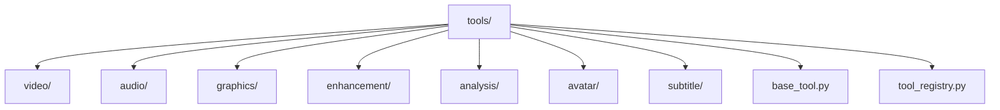
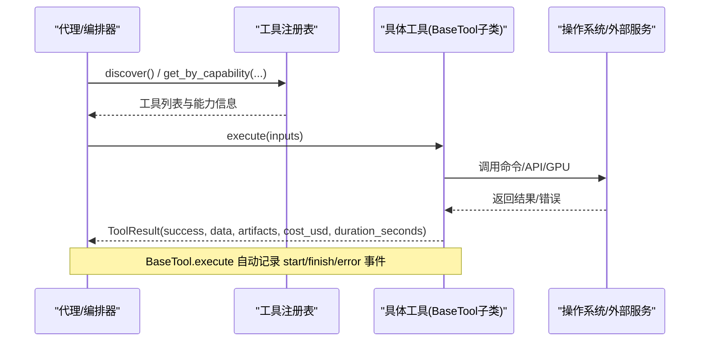
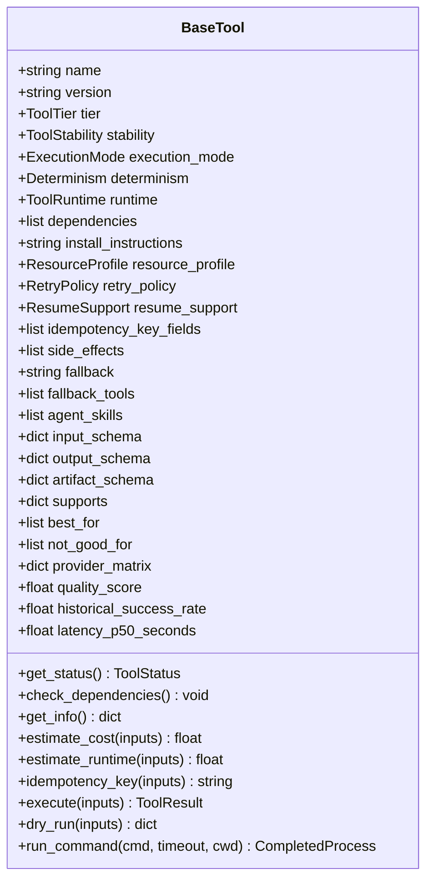
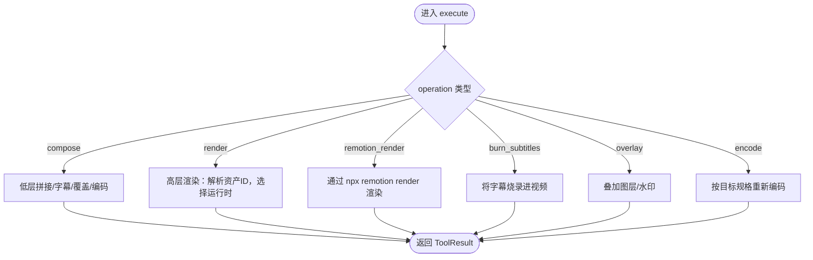
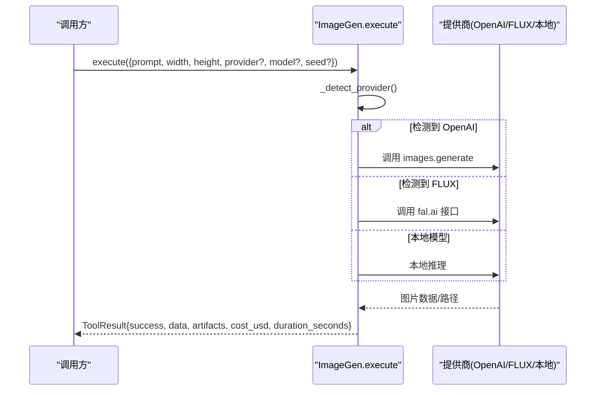
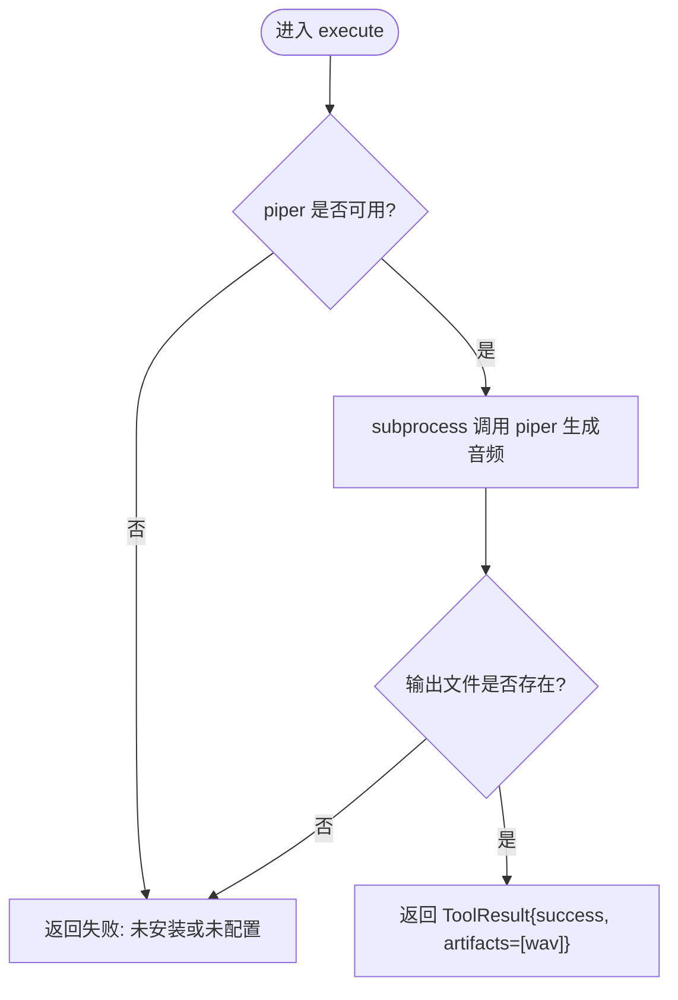
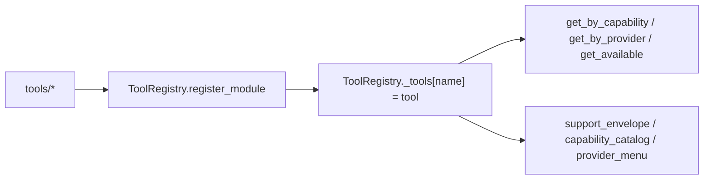
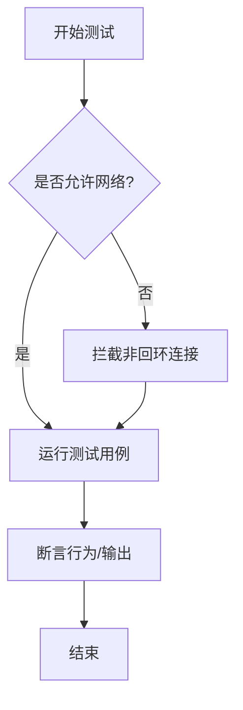

# 工具开发指南

<cite>
**本文引用的文件**
- [tools/base_tool.py](file://tools/base_tool.py)
- [tools/tool_registry.py](file://tools/tool_registry.py)
- [tools/video/video_compose.py](file://tools/video/video_compose.py)
- [tools/graphics/image_gen.py](file://tools/graphics/image_gen.py)
- [tools/audio/piper_tts.py](file://tools/audio/piper_tts.py)
- [tests/tools/test_base_tool_dependencies.py](file://tests/tools/test_base_tool_dependencies.py)
- [tests/tools/test_video_compose_vertical.py](file://tests/tools/test_video_compose_vertical.py)
- [tests/conftest.py](file://tests/conftest.py)
- [README.md](file://README.md)
- [setup.py](file://setup.py)
</cite>

## 目录
1. [简介](#简介)
2. [项目结构](#项目结构)
3. [核心组件](#核心组件)
4. [架构总览](#架构总览)
5. [详细组件分析](#详细组件分析)
6. [依赖关系分析](#依赖关系分析)
7. [性能与资源考量](#性能与资源考量)
8. [测试策略](#测试策略)
9. [调试与排错](#调试与排错)
10. [发布与版本管理](#发布与版本管理)
11. [结论](#结论)

## 简介
本指南面向希望在 OpenMontage 中从零开始创建自定义工具的开发者。内容涵盖：
- 项目结构与代码组织最佳实践
- 依赖管理与环境配置
- 继承 BaseTool、实现 execute、定义输入输出 Schema、元数据声明等核心步骤
- 本地工具、API 工具、混合工具的实现模式
- 单元测试、集成测试、端到端测试的编写方法
- 调试技巧（日志、错误处理、性能分析）
- 打包、版本管理、文档生成与发布流程

OpenMontage 通过统一的工具契约与自动发现机制，使新增工具无需手动注册即可被编排器与代理使用。

## 项目结构
OpenMontage 的工具位于 tools 目录下，按能力域划分（video、audio、graphics、enhancement、analysis、avatar、subtitle 等）。每个工具是一个 Python 模块，继承 BaseTool，并通过 ToolRegistry 自动发现。

**图表来源**
- [tools/base_tool.py:227-397](file://tools/base_tool.py#L227-L397)
- [tools/tool_registry.py:55-134](file://tools/tool_registry.py#L55-L134)

**章节来源**
- [README.md:450-475](file://README.md#L450-L475)
- [tools/base_tool.py:227-397](file://tools/base_tool.py#L227-L397)
- [tools/tool_registry.py:55-134](file://tools/tool_registry.py#L55-L134)

## 核心组件
- BaseTool：所有工具的抽象基类，统一了身份、能力、依赖、执行、成本估算、状态报告等契约。
- ToolRegistry：集中注册与发现工具，提供按能力、提供者、稳定性、状态的查询与汇总。
- ToolResult：工具执行的标准返回结构，包含成功标志、数据、产物、错误、成本、耗时、模型、随机种子等。
- 运行模式与资源描述：支持 LOCAL、LOCAL_GPU、API、HYBRID；可声明 CPU/内存/显存/磁盘/网络需求。

关键要点
- 自动事件埋点：BaseTool.__init_subclass__ 会包装 execute，向 Backlot 写入 start/finish/error 事件，便于可视化追踪。
- 依赖检查：check_dependencies 支持 cmd:/binary:、env:、python: 三类依赖校验。
- 幂等键：idempotency_key 基于指定字段计算缓存键，便于重试与去重。
- CLI 辅助：run_command 封装子进程调用，统一错误处理与 UTF-8 解码。

**章节来源**
- [tools/base_tool.py:63-108](file://tools/base_tool.py#L63-L108)
- [tools/base_tool.py:110-139](file://tools/base_tool.py#L110-L139)
- [tools/base_tool.py:148-224](file://tools/base_tool.py#L148-L224)
- [tools/base_tool.py:227-397](file://tools/base_tool.py#L227-L397)
- [tools/base_tool.py:411-453](file://tools/base_tool.py#L411-L453)
- [tools/tool_registry.py:55-134](file://tools/tool_registry.py#L55-L134)

## 架构总览
下图展示了工具在系统中的角色与交互：代理或编排器通过 ToolRegistry 发现可用工具，选择并调用其 execute；BaseTool 在执行前后记录事件，返回标准结果；工具内部可能调用外部 API、本地命令或 GPU 资源。

**图表来源**
- [tools/tool_registry.py:118-134](file://tools/tool_registry.py#L118-L134)
- [tools/base_tool.py:148-224](file://tools/base_tool.py#L148-L224)
- [tools/base_tool.py:394-407](file://tools/base_tool.py#L394-L407)

## 详细组件分析

### 基础工具基类与执行契约
- 身份与元数据：name、version、tier、stability、execution_mode、determinism、runtime、provider、capabilities、best_for、not_good_for、agent_skills 等。
- 依赖与安装说明：dependencies、install_instructions。
- 资源与重试：resource_profile、retry_policy。
- 恢复与幂等：resume_support、idempotency_key_fields、idempotency_key。
- 执行接口：execute(inputs) -> ToolResult；可选 dry_run、estimate_cost、estimate_runtime。
- 状态与健康：get_status、check_dependencies。
- 命令行封装：run_command 用于安全地执行外部命令，统一错误处理。

**图表来源**
- [tools/base_tool.py:227-397](file://tools/base_tool.py#L227-L397)
- [tools/base_tool.py:411-453](file://tools/base_tool.py#L411-L453)

**章节来源**
- [tools/base_tool.py:227-397](file://tools/base_tool.py#L227-L397)
- [tools/base_tool.py:411-453](file://tools/base_tool.py#L411-L453)

### 视频合成工具（本地+多运行时）
VideoCompose 演示了“本地工具 + 多运行时”的模式：根据 edit_decisions.render_runtime 路由到 Remotion、HyperFrames 或 FFmpeg 进行合成与编码。它声明了操作类型、输入输出 Schema、依赖（如 ffmpeg）、能力集、资源需求与重试策略。

**图表来源**
- [tools/video/video_compose.py:58-120](file://tools/video/video_compose.py#L58-L120)

**章节来源**
- [tools/video/video_compose.py:1-120](file://tools/video/video_compose.py#L1-L120)

### 图像生成工具（混合模式）
ImageGen 展示了 HYBRID 运行模式：优先检测可用的提供商（OpenAI、FLUX via fal.ai、本地 diffusers），并据此选择后端。它定义了输入 Schema、成本估算、重试策略、幂等键、副作用与用户可见验证项。

**图表来源**
- [tools/graphics/image_gen.py:37-153](file://tools/graphics/image_gen.py#L37-L153)

**章节来源**
- [tools/graphics/image_gen.py:1-200](file://tools/graphics/image_gen.py#L1-L200)

### 本地 TTS 工具（纯本地）
PiperTTS 是典型的 LOCAL 工具：依赖系统命令 piper，离线生成语音，无网络需求。它声明了二进制依赖、安装说明、资源轮廓、重试策略、幂等键与用户可见验证项。

**图表来源**
- [tools/audio/piper_tts.py:25-156](file://tools/audio/piper_tts.py#L25-L156)

**章节来源**
- [tools/audio/piper_tts.py:1-156](file://tools/audio/piper_tts.py#L1-L156)

## 依赖关系分析
- 工具注册与发现：ToolRegistry.discover 遍历 tools 包下的模块，自动注册所有 BaseTool 子类实例。
- 能力分组与菜单：capability_catalog、provider_catalog、provider_menu、provider_menu_summary 提供多维视图，便于代理和用户展示。
- 健康检查：get_status/check_dependencies 结合 dependencies 中的 env:/cmd:/binary:/python: 前缀判断可用性。
- 回退机制：find_fallback 可根据工具声明的 fallback/fallback_tools 查找可用替代。

**图表来源**
- [tools/tool_registry.py:55-134](file://tools/tool_registry.py#L55-L134)
- [tools/tool_registry.py:149-230](file://tools/tool_registry.py#L149-L230)
- [tools/tool_registry.py:249-471](file://tools/tool_registry.py#L249-L471)

**章节来源**
- [tools/tool_registry.py:55-134](file://tools/tool_registry.py#L55-L134)
- [tools/tool_registry.py:149-230](file://tools/tool_registry.py#L149-L230)
- [tools/tool_registry.py:249-471](file://tools/tool_registry.py#L249-L471)

## 性能与资源考量
- 资源轮廓：通过 ResourceProfile 声明 CPU/内存/显存/磁盘/网络需求，帮助调度器做容量规划。
- 重试策略：RetryPolicy 控制最大重试次数、退避时间与可重试错误集合。
- 估计指标：estimate_cost/estimate_runtime 为预算治理与用户体验提供前置预估。
- 幂等性：idempotency_key_fields 组合输入关键字段生成缓存键，避免重复执行。
- 运行时差异：LOCAL/LOCAL_GPU/API/HYBRID 影响部署与资源准备。

**章节来源**
- [tools/base_tool.py:110-139](file://tools/base_tool.py#L110-L139)
- [tools/base_tool.py:374-390](file://tools/base_tool.py#L374-L390)
- [tools/graphics/image_gen.py:93-98](file://tools/graphics/image_gen.py#L93-L98)
- [tools/audio/piper_tts.py:90-96](file://tools/audio/piper_tts.py#L90-L96)

## 测试策略
- 单元测试：针对工具逻辑与边界条件，例如依赖检查、命令执行错误处理。
- 集成测试：对真实子系统（如 FFmpeg）进行端到端验证，确保输出符合预期（分辨率、时长、码率等）。
- 安全护栏：tests/conftest.py 默认阻断非回环网络访问，防止测试意外产生费用；需显式启用 live_api 标记才能调用真实 API。

示例
- 依赖与命令错误：验证 binary: 前缀与 run_command 的错误传播。
- 视频合成维度回归：验证垂直比例与目标尺寸是否正确应用。

**图表来源**
- [tests/conftest.py:31-132](file://tests/conftest.py#L31-L132)

**章节来源**
- [tests/tools/test_base_tool_dependencies.py:1-53](file://tests/tools/test_base_tool_dependencies.py#L1-L53)
- [tests/tools/test_video_compose_vertical.py:1-92](file://tests/tools/test_video_compose_vertical.py#L1-L92)
- [tests/conftest.py:1-132](file://tests/conftest.py#L1-L132)

## 调试与排错
- 事件埋点：BaseTool 自动包装 execute，记录 start/finish/error，便于 Backlot 看板实时追踪。
- 依赖诊断：get_status/check_dependencies 能明确指出缺失的命令、环境变量或 Python 模块。
- 子进程错误：run_command 统一捕获 CalledProcessError 并附带 stderr/stdout 详情，便于定位。
- 日志建议：在工具内部记录关键阶段（请求发送、响应接收、文件落盘）以便问题复现。
- 性能分析：利用 estimate_runtime、duration_seconds 与资源轮廓评估瓶颈。

**章节来源**
- [tools/base_tool.py:148-224](file://tools/base_tool.py#L148-L224)
- [tools/base_tool.py:296-328](file://tools/base_tool.py#L296-L328)
- [tools/base_tool.py:411-453](file://tools/base_tool.py#L411-L453)

## 发布与版本管理
- 包名与版本：setup.py 定义 package 名称、版本与依赖；遵循语义化版本管理。
- 依赖声明：requirements.txt/requirements-dev.txt/requirements-gpu.txt 区分环境与 GPU 依赖。
- 工具注册：新增工具只需放在 tools 下对应子目录，继承 BaseTool 并实现 execute；无需手动注册。
- 文档与技能：为工具添加 skill 文件（skills/core 或 skills/pipelines 下）以指导代理如何正确使用。
- 测试与质量：提交前运行合同测试与工具相关测试，确保契约稳定。

**章节来源**
- [setup.py:1-20](file://setup.py#L1-L20)
- [README.md:707-724](file://README.md#L707-L724)
- [tools/tool_registry.py:118-134](file://tools/tool_registry.py#L118-L134)

## 结论
OpenMontage 提供了统一、可扩展且可观测的工具框架。通过继承 BaseTool、声明元数据与 Schema、实现 execute，即可快速构建本地、API 或混合模式的工具，并被自动发现与编排。配合完善的测试护栏、事件埋点与资源治理，能够高效交付高质量的视频生产工具。