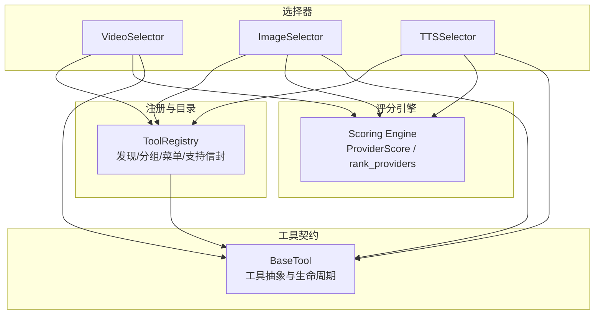
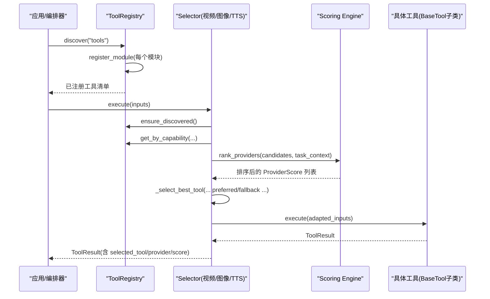
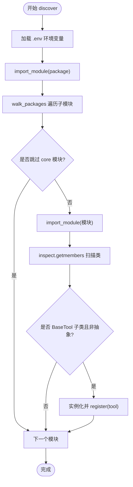
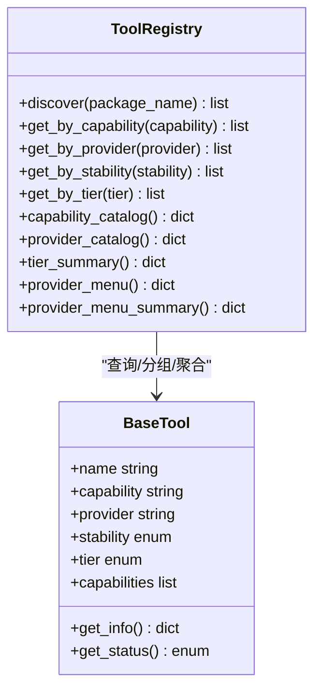
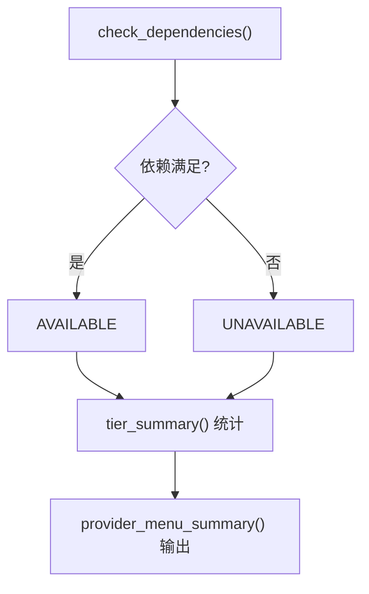
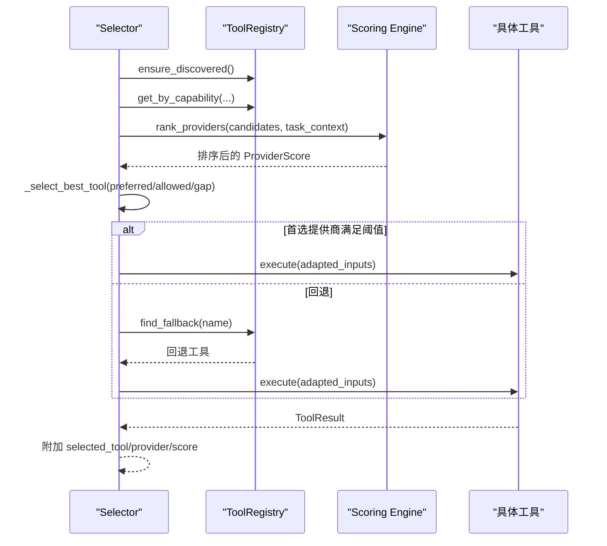
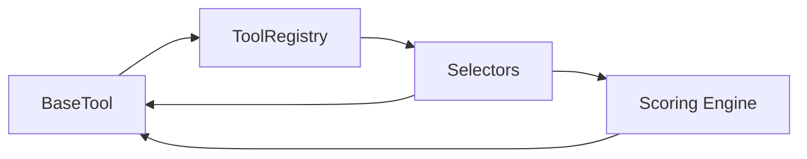

# 工具注册表

<cite>
**本文引用的文件**
- [tools/tool_registry.py](file://tools/tool_registry.py)
- [tools/base_tool.py](file://tools/base_tool.py)
- [lib/scoring.py](file://lib/scoring.py)
- [tools/video/video_selector.py](file://tools/video/video_selector.py)
- [tools/graphics/image_selector.py](file://tools/graphics/image_selector.py)
- [tools/audio/tts_selector.py](file://tools/audio/tts_selector.py)
- [tests/contracts/test_phase0_contracts.py](file://tests/contracts/test_phase0_contracts.py)
- [tests/tools/test_hyperframes_compose.py](file://tests/tools/test_hyperframes_compose.py)
- [AGENT_GUIDE.md](file://AGENT_GUIDE.md)
</cite>

## 目录
1. [简介](#简介)
2. [项目结构](#项目结构)
3. [核心组件](#核心组件)
4. [架构总览](#架构总览)
5. [详细组件分析](#详细组件分析)
6. [依赖关系分析](#依赖关系分析)
7. [性能考量](#性能考量)
8. [故障排除指南](#故障排除指南)
9. [结论](#结论)
10. [附录：使用示例与最佳实践](#附录使用示例与最佳实践)

## 简介
本技术文档聚焦 OpenMontage 的“工具注册表”子系统，系统性地解释以下能力：
- 工具发现机制：动态模块导入、类扫描、元数据提取。
- 工具分类管理：按能力、提供商、稳定性等维度组织与查询。
- 工具状态监控：可用性检查、健康状态跟踪、资源与网络需求汇总。
- 工具选择算法：基于评分的自动选择、手动指定、回退策略。
- 注册与使用：注册新工具、查询信息、执行调用的完整流程。
- 故障排除：常见问题定位与修复建议。

该子系统通过统一的基类契约与集中式注册表，使新增工具无需修改路由逻辑即可被自动发现与编排。

## 项目结构
OpenMontage 的工具子系统位于 tools 包下，核心由三类代码组成：
- 基础契约与运行时：base_tool.py 定义工具抽象、枚举、结果对象、依赖校验、命令执行封装等。
- 注册与目录服务：tool_registry.py 提供动态发现、分组、菜单生成、支持信封（support envelope）等。
- 选择器与评分：video_selector.py、image_selector.py、tts_selector.py 作为能力级路由；lib/scoring.py 提供多维权重评分引擎。

图表来源
- [tools/tool_registry.py:55-134](file://tools/tool_registry.py#L55-L134)
- [tools/base_tool.py:227-372](file://tools/base_tool.py#L227-L372)
- [tools/video/video_selector.py:15-46](file://tools/video/video_selector.py#L15-L46)
- [tools/graphics/image_selector.py:185-210](file://tools/graphics/image_selector.py#L185-L210)
- [tools/audio/tts_selector.py:157-181](file://tools/audio/tts_selector.py#L157-L181)
- [lib/scoring.py:21-70](file://lib/scoring.py#L21-L70)

章节来源
- [tools/tool_registry.py:55-134](file://tools/tool_registry.py#L55-L134)
- [tools/base_tool.py:227-372](file://tools/base_tool.py#L227-L372)

## 核心组件
- BaseTool：所有工具的抽象基类，统一身份、能力、资源、重试、成本估算、执行接口、依赖校验、状态报告等。
- ToolRegistry：集中式注册表，负责动态发现、查询、分组、菜单生成、支持信封输出、GPU/网络需求统计。
- Selector（视频/图像/TTS）：能力级路由，自动发现同能力提供者，调用评分引擎进行排序选择，并处理回退。
- Scoring Engine：将任务上下文与工具元数据映射为多维分数，加权计算后排序，支持可解释性说明。

章节来源
- [tools/base_tool.py:227-372](file://tools/base_tool.py#L227-L372)
- [tools/tool_registry.py:55-230](file://tools/tool_registry.py#L55-L230)
- [lib/scoring.py:21-70](file://lib/scoring.py#L21-L70)

## 架构总览
下图展示了从“注册与发现”到“选择与执行”的端到端流程，以及各组件之间的交互。

图表来源
- [tools/tool_registry.py:118-134](file://tools/tool_registry.py#L118-L134)
- [tools/video/video_selector.py:352-440](file://tools/video/video_selector.py#L352-L440)
- [lib/scoring.py:533-542](file://lib/scoring.py#L533-L542)

## 详细组件分析

### 工具发现机制（动态导入、类扫描、元数据提取）
- 动态导入：ToolRegistry.discover(package_name) 使用 importlib.import_module 加载包，并通过 pkgutil.walk_packages 遍历子模块，跳过 base_tool 与 tool_registry 自身以避免循环。
- 类扫描：register_module(module) 使用 inspect.getmembers 扫描模块中的类，过滤掉非 BaseTool 子类、抽象类与不在当前模块定义的类，然后实例化并注册。
- 元数据提取：BaseTool.get_info() 返回工具契约信息（名称、版本、能力、提供商、稳定性、状态、资源、输入输出 schema、支持特性、质量/延迟指标等），供注册表聚合与展示。

图表来源
- [tools/tool_registry.py:86-134](file://tools/tool_registry.py#L86-L134)
- [tools/base_tool.py:329-372](file://tools/base_tool.py#L329-L372)

章节来源
- [tools/tool_registry.py:86-134](file://tools/tool_registry.py#L86-L134)
- [tools/base_tool.py:329-372](file://tools/base_tool.py#L329-L372)

### 工具分类管理系统（能力、提供商、稳定性）
- 能力维度：get_by_capability(capability)、find_by_capability(capability) 支持按顶层能力族或 capabilities 列表筛选。
- 提供商维度：get_by_provider(provider) 按 provider 字段分组。
- 稳定性维度：get_by_stability(stability) 按实验/测试/生产阶段筛选。
- 分层维度：get_by_tier(tier) 按 CORE/VOICE/ENHANCE/GENERATE/SOURCE/ANALYZE/PUBLISH 分层。
- 目录视图：capability_catalog、provider_catalog、tier_summary、provider_menu、provider_menu_summary 提供不同粒度的聚合视图，用于预检菜单与用户呈现。

图表来源
- [tools/tool_registry.py:149-230](file://tools/tool_registry.py#L149-L230)
- [tools/base_tool.py:237-291](file://tools/base_tool.py#L237-L291)

章节来源
- [tools/tool_registry.py:149-230](file://tools/tool_registry.py#L149-L230)
- [tools/base_tool.py:237-291](file://tools/base_tool.py#L237-L291)

### 工具状态监控（可用性、健康、性能指标）
- 可用性检查：BaseTool.check_dependencies() 校验 cmd/binary/env/python 依赖；get_status() 据此返回 available/unavailable/degraded。
- 健康状态跟踪：ToolRegistry.get_available()/get_unavailable() 汇总全局可用/不可用工具；tier_summary() 统计各层级的状态分布。
- 性能指标收集：BaseTool 暴露 quality_score、historical_success_rate、latency_p50_seconds 等可选指标；Scoring Engine 在评分时利用这些指标提升可靠性与延迟评估。
- 资源与网络需求：resource_profile.cpu_cores/ram_mb/vram_mb/disk_mb/network_required；ToolRegistry.gpu_required_tools()/network_required_tools() 快速列出需要 GPU/网络的工具。

图表来源
- [tools/base_tool.py:296-327](file://tools/base_tool.py#L296-L327)
- [tools/tool_registry.py:232-247](file://tools/tool_registry.py#L232-L247)
- [tools/tool_registry.py:316-471](file://tools/tool_registry.py#L316-L471)

章节来源
- [tools/base_tool.py:296-327](file://tools/base_tool.py#L296-L327)
- [tools/tool_registry.py:232-247](file://tools/tool_registry.py#L232-L247)
- [tools/tool_registry.py:316-471](file://tools/tool_registry.py#L316-L471)

### 工具选择算法（评分、手动指定、回退）
- 自动选择：Selector 调用 lib.scoring.rank_providers(candidates, task_context)，根据任务意图、风格关键词、预算、控制能力、可靠性、成本效率、延迟、连续性等多维权重计算 ProviderScore.weighted_score，并按降序排列。
- 手动指定：Selector 支持 preferred_provider 与 allowed_providers；若指定了首选提供商，且其得分不低于最高分减去允许差距（preferred_provider_gap），则优先选择该提供商。
- 回退机制：
  - 工具级回退：BaseTool.fallback/fallback_tools 声明候选回退工具名；ToolRegistry.find_fallback(name) 按顺序查找第一个 AVAILABLE 的回退工具。
  - 选择器级回退：例如 VideoSelector 对运动必需操作限制 image_selector 作为回退；TTS/Image 选择器也动态构建 fallback_tools。
- 结果增强：成功执行后，ToolResult.data 包含 selected_tool、selected_provider、selection_reason、provider_score、alternatives_considered、fallback_tools 等，便于审计与调试。

图表来源
- [lib/scoring.py:373-542](file://lib/scoring.py#L373-L542)
- [tools/video/video_selector.py:352-440](file://tools/video/video_selector.py#L352-L440)
- [tools/tool_registry.py:184-196](file://tools/tool_registry.py#L184-L196)

章节来源
- [lib/scoring.py:373-542](file://lib/scoring.py#L373-L542)
- [tools/video/video_selector.py:352-440](file://tools/video/video_selector.py#L352-L440)
- [tools/tool_registry.py:184-196](file://tools/tool_registry.py#L184-L196)

### 注册与使用示例（注册、查询、执行）
- 注册新工具：
  - 新建一个继承 BaseTool 的类，设置 name、version、tier、capability、provider、dependencies、input/output_schema 等元数据，实现 execute(inputs)。
  - 将工具放入 tools 包下的对应子模块（如 video、audio、graphics），运行 registry.discover("tools") 即可自动发现并注册。
- 查询工具信息：
  - registry.support_envelope() 获取所有工具的完整契约信息。
  - registry.provider_menu_summary() 获取能力菜单摘要（composition_runtimes、capabilities、setup_offers、runtime_warnings）。
  - registry.get_by_capability/get_by_provider/get_by_stability 等按维度筛选。
- 执行工具调用：
  - 通过 Selector 的 execute(inputs) 触发自动选择与执行；或直接调用具体工具实例的 execute(inputs)。
  - 结果 ToolResult 包含 success、data、artifacts、cost_usd、duration_seconds、seed、model 等字段。

章节来源
- [tools/tool_registry.py:118-134](file://tools/tool_registry.py#L118-L134)
- [tools/tool_registry.py:198-230](file://tools/tool_registry.py#L198-L230)
- [tools/tool_registry.py:316-471](file://tools/tool_registry.py#L316-L471)
- [tools/base_tool.py:394-407](file://tools/base_tool.py#L394-L407)
- [AGENT_GUIDE.md:283-303](file://AGENT_GUIDE.md#L283-L303)

## 依赖关系分析
- 低耦合高内聚：BaseTool 定义统一契约；ToolRegistry 仅依赖 BaseTool 的元数据与状态；Selector 通过 Registry 发现提供者，再委托 Scoring Engine 做选择；具体工具只关注自身业务逻辑。
- 直接依赖：
  - ToolRegistry 依赖 BaseTool、importlib、pkgutil、inspect。
  - Selector 依赖 ToolRegistry、lib.scoring。
  - Scoring Engine 依赖 BaseTool 的 get_info() 与 estimate_cost()。
- 间接依赖：
  - 事件埋点：BaseTool.execute 包装器在存在 lib.events 时记录 start/finish/error，不影响主流程。
  - 环境加载：base_tool.py 与 tool_registry.py 均支持从根目录 .env 加载环境变量，确保 API Key 可用。

图表来源
- [tools/tool_registry.py:55-134](file://tools/tool_registry.py#L55-L134)
- [tools/base_tool.py:148-224](file://tools/base_tool.py#L148-L224)
- [lib/scoring.py:373-542](file://lib/scoring.py#L373-L542)

章节来源
- [tools/tool_registry.py:55-134](file://tools/tool_registry.py#L55-L134)
- [tools/base_tool.py:148-224](file://tools/base_tool.py#L148-L224)
- [lib/scoring.py:373-542](file://lib/scoring.py#L373-L542)

## 性能考量
- 发现开销：discover() 会遍历整个 tools 包并导入模块，建议在应用启动时一次性调用 ensure_discovered()，避免重复导入。
- 评分开销：rank_providers() 对候选工具逐一评分，候选集过大时可能影响响应时间；可通过 allowed_providers 缩小范围。
- 资源约束：ToolRegistry.gpu_required_tools()/network_required_tools() 可用于前置资源检查，提前规避不满足环境的工具。
- 事件埋点：execute 包装器在非项目路径下不会写入事件，减少 I/O 开销；在有项目路径时才记录 start/finish/error。

[本节为通用指导，不直接分析具体文件]

## 故障排除指南
- 工具未被发现：
  - 确认工具类继承自 BaseTool，且位于 tools 包下的子模块中；确保类名不是抽象类，且 module 与当前模块一致。
  - 调用 registry.discover("tools") 或 ensure_discovered() 后再查询。
- 工具显示不可用：
  - 检查 dependencies：cmd/binary 是否存在于 PATH；env 变量是否设置；python 模块是否安装。
  - 查看 ToolStatus：get_status() 返回 unavailable 通常意味着依赖缺失。
- 选择器未选择期望提供商：
  - 检查 task_context 的 intent/style_keywords/asset_type/motion_required 等字段是否正确；必要时调整 preferred_provider 与 preferred_provider_gap。
  - 查看 provider_matrix 与 best_for 是否准确描述能力。
- Windows 控制台乱码：
  - provider_menu_summary() 已内置 Unicode 破折号替换，确保预检输出可读；如遇异常，检查 PYTHONIOENCODING 设置。
- 事件埋点失败：
  - 当无法导入 lib.events 时，execute 包装器会静默降级，不影响工具执行；如需调试，检查项目路径推断与 events.jsonl 写入权限。

章节来源
- [tests/contracts/test_phase0_contracts.py:407-475](file://tests/contracts/test_phase0_contracts.py#L407-L475)
- [tests/tools/test_hyperframes_compose.py:146-348](file://tests/tools/test_hyperframes_compose.py#L146-L348)
- [tools/base_tool.py:296-327](file://tools/base_tool.py#L296-L327)
- [tools/tool_registry.py:316-471](file://tools/tool_registry.py#L316-L471)

## 结论
OpenMontage 的工具注册表以 BaseTool 契约为核心，结合 ToolRegistry 的动态发现与多维度分组能力，配合 Selector 与 Scoring Engine 的智能选择与回退机制，实现了可扩展、可观测、可治理的工具生态。开发者只需遵循契约规范，即可无缝接入新的工具提供方，并获得一致的预检、选择、执行与监控体验。

[本节为总结性内容，不直接分析具体文件]

## 附录：使用示例与最佳实践
- 注册新工具
  - 创建继承 BaseTool 的类，填写必要元数据与 input/output_schema，实现 execute(inputs)。
  - 将文件放入 tools 包对应子目录，运行 registry.discover("tools") 完成自动注册。
- 查询工具信息
  - 使用 registry.support_envelope() 获取全量契约；使用 registry.provider_menu_summary() 获取能力菜单摘要。
  - 使用 get_by_capability/get_by_provider/get_by_stability 进行筛选。
- 执行工具调用
  - 通过 Selector.execute(inputs) 触发自动选择；或直接调用具体工具实例。
  - 解析 ToolResult 中的 success/data/artifacts/cost_usd/duration_seconds 等字段。
- 最佳实践
  - 明确 best_for/supports/provider_matrix，提高评分准确性。
  - 合理设置 dependencies/install_instructions，便于预检与引导配置。
  - 使用 preferred_provider 与 preferred_provider_gap 平衡用户偏好与系统最优选择。
  - 在复杂任务中提供丰富的 task_context（intent/style_keywords/budget/locked_providers），提升选择质量。

章节来源
- [AGENT_GUIDE.md:283-303](file://AGENT_GUIDE.md#L283-L303)
- [tools/tool_registry.py:198-230](file://tools/tool_registry.py#L198-L230)
- [tools/base_tool.py:394-407](file://tools/base_tool.py#L394-L407)