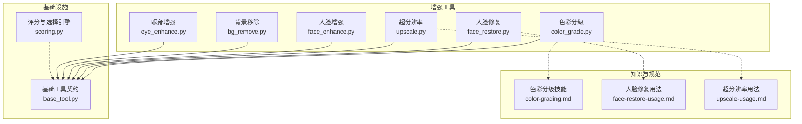
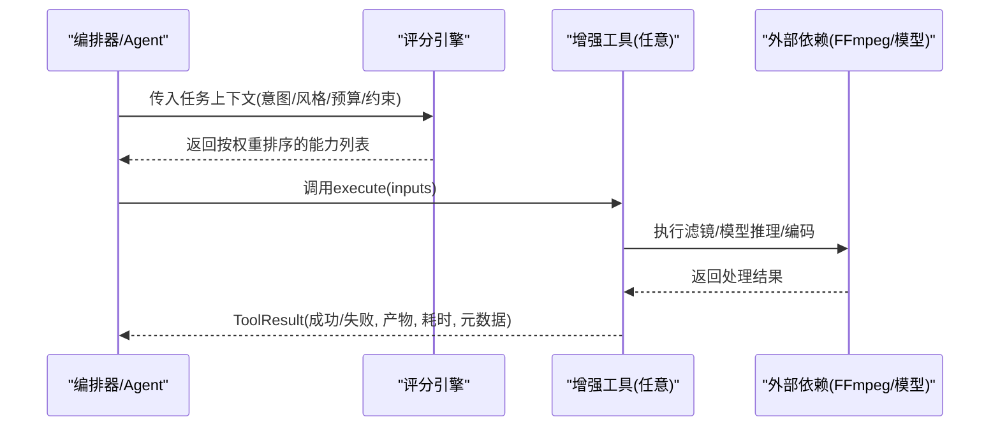
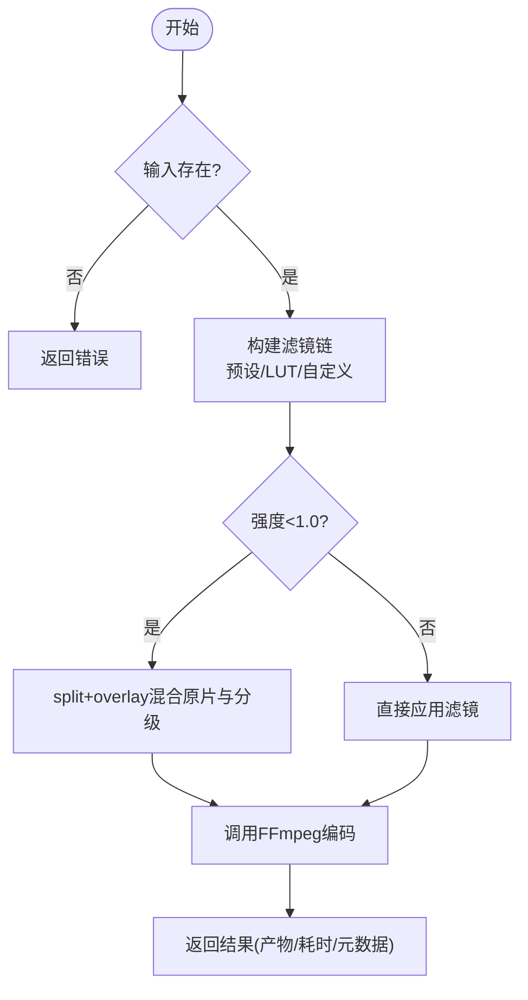
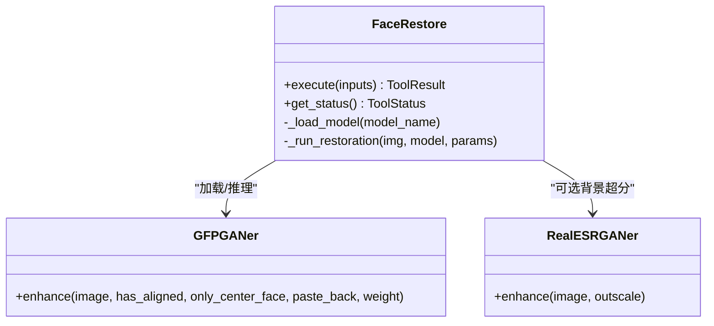
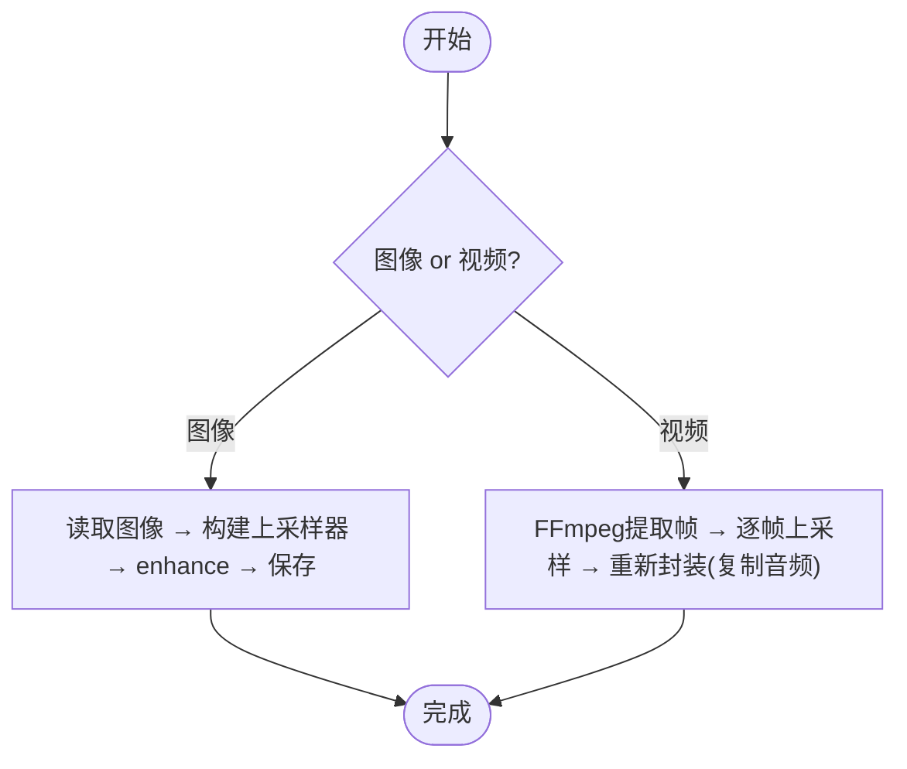
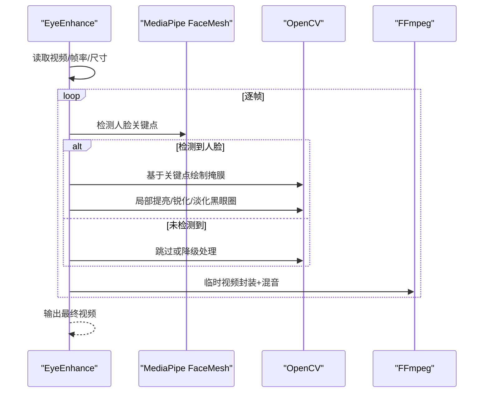
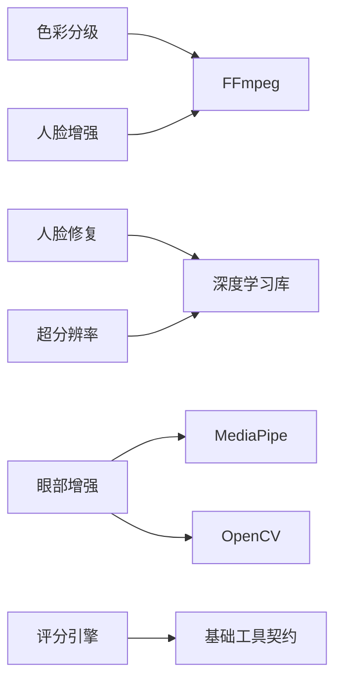

# 图像增强工具示例

<cite>
**本文引用的文件**
- [README.md](file://README.md)
- [base_tool.py](file://tools/base_tool.py)
- [scoring.py](file://lib/scoring.py)
- [color_grade.py](file://tools/enhancement/color_grade.py)
- [face_restore.py](file://tools/enhancement/face_restore.py)
- [upscale.py](file://tools/enhancement/upscale.py)
- [face_enhance.py](file://tools/enhancement/face_enhance.py)
- [bg_remove.py](file://tools/enhancement/bg_remove.py)
- [eye_enhance.py](file://tools/enhancement/eye_enhance.py)
- [color-grading.md](file://skills/core/color-grading.md)
- [face-restore-usage.md](file://skills/creative/face-restore-usage.md)
- [upscale-usage.md](file://skills/creative/upscale-usage.md)
</cite>

## 目录
1. [简介](#简介)
2. [项目结构](#项目结构)
3. [核心组件](#核心组件)
4. [架构总览](#架构总览)
5. [详细组件分析](#详细组件分析)
6. [依赖关系分析](#依赖关系分析)
7. [性能考量](#性能考量)
8. [故障排查指南](#故障排查指南)
9. [结论](#结论)
10. [附录](#附录)

## 简介
本文件面向OpenMontage的图像增强子系统，系统性阐述统一处理流水线、质量评估与批处理能力，并深入解析色彩分级、面部修复、超分辨率等关键工具的实现原理与最佳实践。文档同时提供参数调优指南、质量评估标准与性能优化策略，帮助开发者构建专业、可自动化、可审计的图像增强工作流。

## 项目结构
OpenMontage将“工具”与“技能/规范”分层组织：
- tools/enhancement：具体增强工具实现（色彩分级、人脸修复、超分、背景移除、眼部增强、通用人脸增强）
- skills/core 与 skills/creative：针对工具的用法指南、参数建议与工作流编排
- lib：评分与选择引擎（provider scoring），用于在任务上下文中自动权衡选择
- base_tool：统一的工具契约（输入输出、资源画像、执行模式、状态报告）

图表来源
- [base_tool.py:110-139](file://tools/base_tool.py#L110-L139)
- [scoring.py:21-70](file://lib/scoring.py#L21-L70)
- [color_grade.py:78-128](file://tools/enhancement/color_grade.py#L78-L128)
- [face_restore.py:27-95](file://tools/enhancement/face_restore.py#L27-L95)
- [upscale.py:47-105](file://tools/enhancement/upscale.py#L47-L105)
- [face_enhance.py:70-120](file://tools/enhancement/face_enhance.py#L70-L120)
- [bg_remove.py:27-86](file://tools/enhancement/bg_remove.py#L27-L86)
- [eye_enhance.py:47-120](file://tools/enhancement/eye_enhance.py#L47-L120)

章节来源
- [README.md:450-475](file://README.md#L450-L475)

## 核心组件
- 统一工具契约（BaseTool）：定义工具元数据、输入Schema、资源画像、执行模式、幂等键、副作用、用户可见验证项；所有增强工具均继承该基类，保证一致发现、执行与结果格式。
- 评分与选择引擎（Provider Scoring）：基于任务上下文对可用能力进行多维度加权评分（任务契合度、输出质量、可控性、可靠性、成本效率、延迟、连续性），支持语义同义词扩展与偏好信号注入。
- 增强工具族：
  - 色彩分级：内置FFmpeg滤镜链与外部LUT应用，支持强度混合与多预设
  - 人脸修复：CodeFormer/GFPGAN模型驱动，可选背景超分，支持保真度调节
  - 超分辨率：Real-ESRGAN系列模型，支持图像/视频帧级批量处理与人脸增强联动
  - 人脸增强：纯FFmpeg滤镜链（皮肤平滑、锐化、光照校正、降噪）
  - 背景移除：rembg/U2Net，支持透明通道或自定义背景合成
  - 眼部增强：MediaPipe Face Mesh + OpenCV精准定位眼区，支持黑眼圈淡化、眼部提亮与锐化

章节来源
- [base_tool.py:63-139](file://tools/base_tool.py#L63-L139)
- [scoring.py:21-70](file://lib/scoring.py#L21-L70)
- [color_grade.py:78-128](file://tools/enhancement/color_grade.py#L78-L128)
- [face_restore.py:27-95](file://tools/enhancement/face_restore.py#L27-L95)
- [upscale.py:47-105](file://tools/enhancement/upscale.py#L47-L105)
- [face_enhance.py:70-120](file://tools/enhancement/face_enhance.py#L70-L120)
- [bg_remove.py:27-86](file://tools/enhancement/bg_remove.py#L27-L86)
- [eye_enhance.py:47-120](file://tools/enhancement/eye_enhance.py#L47-L120)

## 架构总览
OpenMontage采用“工具+技能+评分”的分层架构：
- 工具层：每个增强工具以统一接口暴露能力，声明依赖、资源需求与副作用
- 技能层：为工具提供领域知识（如色彩科学、人脸修复流程、超分策略）
- 评分层：根据任务上下文（意图、风格、预算、约束）对候选能力进行加权排序，指导编排决策

图表来源
- [scoring.py:373-542](file://lib/scoring.py#L373-L542)
- [base_tool.py:128-139](file://tools/base_tool.py#L128-L139)
- [color_grade.py:134-179](file://tools/enhancement/color_grade.py#L134-L179)
- [face_restore.py:108-245](file://tools/enhancement/face_restore.py#L108-L245)
- [upscale.py:126-173](file://tools/enhancement/upscale.py#L126-L173)

## 详细组件分析

### 色彩分级（Color Grade）
- 实现要点
  - 通过FFmpeg滤镜链实现色调曲线、色平衡、对比度/饱和度调整
  - 支持内置预设（电影暖/冷、情绪暗调、明亮干净、复古胶片、高对比、中性）
  - 支持外部.cube LUT，并以强度参数与原片混合，避免过度着色
  - 资源画像轻量（CPU为主），适合快速迭代与批量处理
- 典型工作流
  - 先做基础校正（白平衡/归一化），再应用创意LUT或预设
  - 人像内容注意肤色线保护，控制饱和度上限
- 参数调优建议
  - 强度0.6-0.8更自然；人像优先测试单帧再全片渲染
  - 不同内容类型匹配不同预设（企业/科普/叙事/科技/戏剧/生活方式/复古）
- 质量评估
  - 肤色自然、无过饱和；字幕/叠加文本满足对比度要求
  - 同一视频内保持一致的视觉风格

图表来源
- [color_grade.py:181-207](file://tools/enhancement/color_grade.py#L181-L207)
- [color_grade.py:134-179](file://tools/enhancement/color_grade.py#L134-L179)

章节来源
- [color_grade.py:24-75](file://tools/enhancement/color_grade.py#L24-L75)
- [color_grade.py:98-128](file://tools/enhancement/color_grade.py#L98-L128)
- [color-grading.md:18-45](file://skills/core/color-grading.md#L18-L45)
- [color-grading.md:47-85](file://skills/core/color-grading.md#L47-L85)
- [color-grading.md:87-106](file://skills/core/color-grading.md#L87-L106)
- [color-grading.md:108-148](file://skills/core/color-grading.md#L108-L148)
- [color-grading.md:150-162](file://skills/core/color-grading.md#L150-L162)

### 面部修复（Face Restore）
- 实现要点
  - 基于CodeFormer/GFPGAN的人脸重建与细节恢复，支持保真度滑块（仅CodeFormer）
  - 可选背景超分（Real-ESRGAN），提升整体画质
  - 设备自适应（CUDA/MPS/CPU），自动检测可用性
- 典型工作流
  - 旧素材/低清人脸：先修复（fidelity 0.3-0.5），再做轻度增强与调色
  - 网络摄像头素材：轻修复（fidelity 0.7）+ 通用人脸增强
- 参数调优建议
  - fidelity=0.5为默认平衡点；越接近1越保守，越接近0越强调质量但可能改变身份
  - 仅在需要时开启背景超分，避免不必要计算
- 质量评估
  - 身份一致性、无幻觉特征、纹理自然、跨帧稳定

图表来源
- [face_restore.py:27-95](file://tools/enhancement/face_restore.py#L27-L95)
- [face_restore.py:108-245](file://tools/enhancement/face_restore.py#L108-L245)

章节来源
- [face-restore-usage.md:6-24](file://skills/creative/face-restore-usage.md#L6-L24)
- [face-restore-usage.md:25-41](file://skills/creative/face-restore-usage.md#L25-L41)
- [face-restore-usage.md:42-74](file://skills/creative/face-restore-usage.md#L42-L74)
- [face-restore-usage.md:76-97](file://skills/creative/face-restore-usage.md#L76-L97)

### 超分辨率（Upscale）
- 实现要点
  - 使用Real-ESRGAN系列模型（通用/动漫/轻量），支持2x/4x缩放
  - 图像直出；视频通过FFmpeg逐帧提取→超分→重新封装，保留原音频
  - 可选人脸增强（GFPGAN）与去噪强度控制
  - 内存管理：非CUDA设备启用tile分块以降低峰值显存/内存占用
- 典型工作流
  - 低清素材→超分→检查伪影→进入合成阶段
  - AI生成图→超分到目标分辨率→必要时开启人脸增强
- 参数调优建议
  - 4x适用于480p→1080p/720p→4K；720p→1080p用2x更稳妥
  - 动漫/图形用anime_6B模型；老素材提高去噪强度至0.7-0.8
  - 长视频谨慎全量超分，优先关键镜头
- 质量评估
  - 边缘清晰、无幻觉细节、文字可读、文件大小合理

图表来源
- [upscale.py:126-173](file://tools/enhancement/upscale.py#L126-L173)
- [upscale.py:179-259](file://tools/enhancement/upscale.py#L179-L259)
- [upscale.py:265-337](file://tools/enhancement/upscale.py#L265-L337)

章节来源
- [upscale-usage.md:6-14](file://skills/creative/upscale-usage.md#L6-L14)
- [upscale-usage.md:16-26](file://skills/creative/upscale-usage.md#L16-L26)
- [upscale-usage.md:27-44](file://skills/creative/upscale-usage.md#L27-L44)
- [upscale-usage.md:46-63](file://skills/creative/upscale-usage.md#L46-L63)
- [upscale-usage.md:64-71](file://skills/creative/upscale-usage.md#L64-L71)
- [upscale-usage.md:72-110](file://skills/creative/upscale-usage.md#L72-L110)
- [upscale-usage.md:112-131](file://skills/creative/upscale-usage.md#L112-L131)

### 通用人脸增强（Face Enhance）
- 实现要点
  - 纯FFmpeg滤镜链：皮肤平滑、锐化、光照校正、冷暖色调、降噪
  - 支持单一预设或多预设串联，以及自定义滤镜串
  - 零GPU依赖，适合快速批量处理
- 适用场景
  - 高质量素材的轻度修饰（说话人镜头、采访、直播回放）

章节来源
- [face_enhance.py:25-67](file://tools/enhancement/face_enhance.py#L25-L67)
- [face_enhance.py:93-120](file://tools/enhancement/face_enhance.py#L93-L120)
- [face_enhance.py:126-188](file://tools/enhancement/face_enhance.py#L126-L188)

### 背景移除（Background Remove）
- 实现要点
  - 基于rembg/U2Net，支持多种模型与Alpha遮罩
  - 可输出透明PNG或合成到指定背景色
- 适用场景
  - 抠像、合成、产品图制作

章节来源
- [bg_remove.py:27-86](file://tools/enhancement/bg_remove.py#L27-L86)
- [bg_remove.py:99-161](file://tools/enhancement/bg_remove.py#L99-L161)

### 眼部增强（Eye Enhance）
- 实现要点
  - MediaPipe Face Mesh精准定位眼区，结合OpenCV进行局部操作
  - 支持黑眼圈淡化、眼部提亮、眼部锐化
  - 无MediaPipe时回退到OpenCV级联分类器或FFmpeg全局亮度/对比度
- 适用场景
  - 说话人镜头中眼部细节优化，提升观感

图表来源
- [eye_enhance.py:176-268](file://tools/enhancement/eye_enhance.py#L176-L268)
- [eye_enhance.py:270-423](file://tools/enhancement/eye_enhance.py#L270-L423)
- [eye_enhance.py:425-574](file://tools/enhancement/eye_enhance.py#L425-L574)

章节来源
- [eye_enhance.py:32-44](file://tools/enhancement/eye_enhance.py#L32-L44)
- [eye_enhance.py:72-120](file://tools/enhancement/eye_enhance.py#L72-L120)
- [eye_enhance.py:149-174](file://tools/enhancement/eye_enhance.py#L149-L174)

## 依赖关系分析
- 工具间耦合
  - 色彩分级与人脸增强主要依赖FFmpeg，解耦且可独立运行
  - 人脸修复与超分辨率依赖深度学习库（torch/gfpgan/realesrgan），需GPU或MPS加速更佳
  - 眼部增强依赖MediaPipe/OpenCV，具备多级回退机制
- 外部依赖
  - FFmpeg：滤镜链、编码、音视频复用
  - 深度学习：CodeFormer/GFPGAN/Real-ESRGAN/MediaPipe
- 评分与编排
  - 评分引擎根据任务上下文与工具能力描述进行加权选择，确保在预算、质量、延迟之间取得平衡

图表来源
- [color_grade.py:88-90](file://tools/enhancement/color_grade.py#L88-L90)
- [face_enhance.py:80-82](file://tools/enhancement/face_enhance.py#L80-L82)
- [face_restore.py:38-44](file://tools/enhancement/face_restore.py#L38-L44)
- [upscale.py:58-64](file://tools/enhancement/upscale.py#L58-L64)
- [eye_enhance.py:57-63](file://tools/enhancement/eye_enhance.py#L57-L63)
- [base_tool.py:110-139](file://tools/base_tool.py#L110-L139)

章节来源
- [scoring.py:373-542](file://lib/scoring.py#L373-L542)

## 性能考量
- 批处理与吞吐
  - 视频超分逐帧处理，I/O与模型推理为瓶颈；建议使用GPU/MPS，合理设置tile大小降低内存峰值
  - 色彩分级与人脸增强为CPU友好型滤镜链，适合大批量快速处理
- 内存与显存
  - 非CUDA设备启用tile分块；大分辨率图像/视频优先分块或降采样预处理
- 编码与存储
  - CRF与编码器选择影响体积与质量；超分后文件显著增大，需规划存储与传输
- 端到端流水线
  - 先修复/增强，再上色/合成；避免重复计算与多次编解码

[本节为通用性能建议，不直接分析具体文件]

## 故障排查指南
- 常见错误与对策
  - 输入不存在：检查路径与权限
  - 依赖缺失：安装对应Python包或系统命令（ffmpeg、torch、gfpgan、realesrgan、mediapipe、opencv）
  - 模型加载失败：检查网络下载与缓存；确认设备兼容（CUDA/MPS/CPU）
  - 编码失败：检查编码器与CRF设置；尝试更换preset或crf
- 诊断信息
  - 利用ToolResult中的error字段与duration_seconds定位问题
  - 使用评分引擎的输出解释（explain）理解选择逻辑

章节来源
- [base_tool.py:128-139](file://tools/base_tool.py#L128-L139)
- [color_grade.py:134-179](file://tools/enhancement/color_grade.py#L134-L179)
- [face_restore.py:108-245](file://tools/enhancement/face_restore.py#L108-L245)
- [upscale.py:126-173](file://tools/enhancement/upscale.py#L126-L173)
- [face_enhance.py:126-188](file://tools/enhancement/face_enhance.py#L126-L188)
- [bg_remove.py:99-161](file://tools/enhancement/bg_remove.py#L99-L161)
- [eye_enhance.py:149-174](file://tools/enhancement/eye_enhance.py#L149-L174)

## 结论
OpenMontage的图像增强子系统以统一工具契约为基础，结合领域技能与评分引擎，实现了可扩展、可编排、可审计的高质量图像处理流水线。色彩分级、人脸修复、超分辨率、背景移除、眼部增强等工具覆盖了从基础校正到AI重建的关键环节，并提供丰富的参数与最佳实践，便于在不同业务场景中快速落地与持续优化。

[本节为总结性内容，不直接分析具体文件]

## 附录
- 推荐工作流组合
  - 旧素材修复：人脸修复(fidelity 0.3-0.5) → 超分(4x) → 色彩分级(预设/强度0.6-0.8)
  - 说话人镜头：人脸修复(fidelity 0.7) → 人脸增强(预设) → 眼部增强 → 色彩分级
  - 产品图合成：背景移除 → 超分(如需) → 色彩分级(品牌风格)
- 质量检查清单
  - 色彩：肤色自然、对比度达标、风格一致
  - 人脸：身份一致、无幻觉、纹理自然
  - 超分：细节清晰、无伪影、文件大小合理
  - 眼部：淡化自然、提亮适度、锐化不过度

[本节为补充说明，不直接分析具体文件]