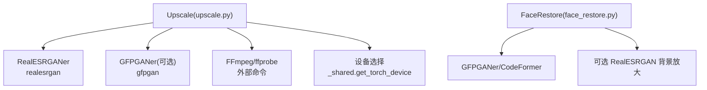
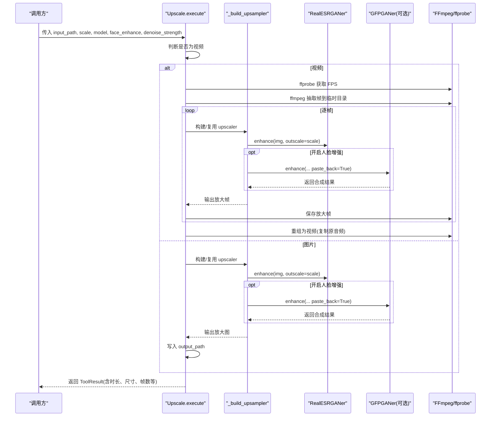
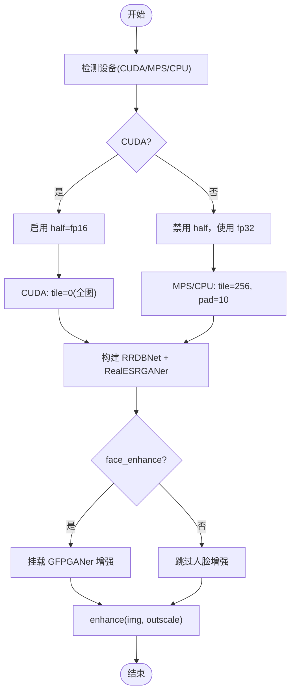
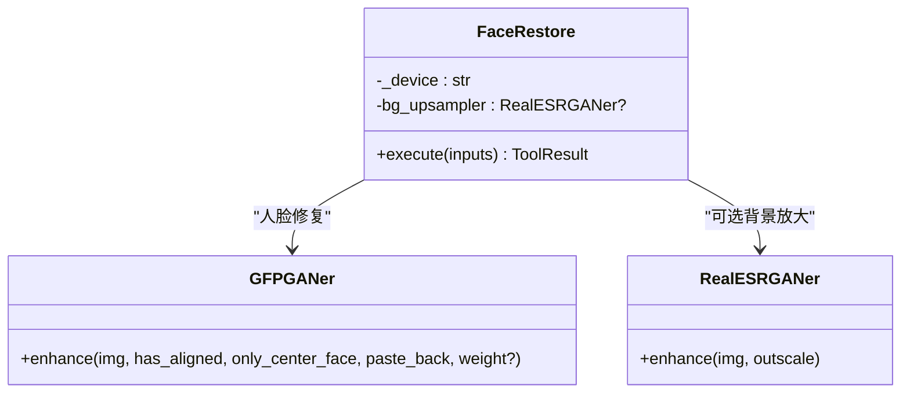
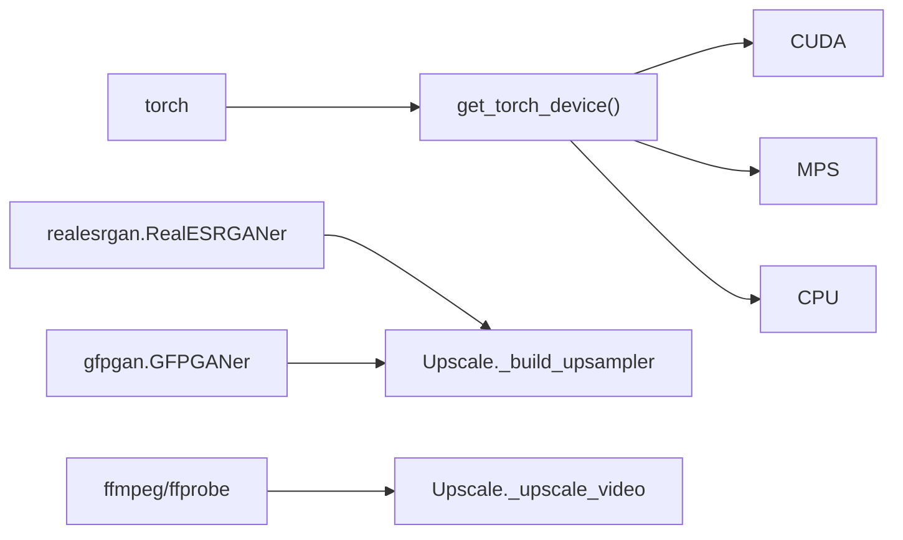

# 图像超分辨率工具

<cite>
**本文引用的文件**
- [tools/enhancement/upscale.py](file://tools/enhancement/upscale.py)
- [tools/enhancement/face_restore.py](file://tools/enhancement/face_restore.py)
- [tools/video/_shared.py](file://tools/video/_shared.py)
- [tests/tools/test_mps_device.py](file://tests/tools/test_mps_device.py)
</cite>

## 目录
1. [简介](#简介)
2. [项目结构](#项目结构)
3. [核心组件](#核心组件)
4. [架构总览](#架构总览)
5. [详细组件分析](#详细组件分析)
6. [依赖关系分析](#依赖关系分析)
7. [性能与批处理优化](#性能与批处理优化)
8. [质量控制策略](#质量控制策略)
9. [配置选项说明](#配置选项说明)
10. [使用示例与最佳实践](#使用示例与最佳实践)
11. [故障排查指南](#故障排查指南)
12. [结论](#结论)

## 简介
本工具提供基于深度学习的图像与视频超分辨率能力，当前实现以 Real-ESRGAN 系列模型为核心，支持通用照片/视频、动漫插画以及轻量网络等模型变体；可选启用人脸增强（GFPGAN）以提升人像区域细节。工具同时封装了设备选择（CUDA/MPS/CPU）、分块推理（tile）以降低内存峰值、半精度推理（half）加速、以及视频帧级提取与重编码流程，便于在本地 GPU 或 Apple Silicon 设备上高效运行。

## 项目结构
- 增强工具位于 tools/enhancement 目录：
  - upscale.py：图像/视频超分辨率主入口，封装模型构建、设备选择、分块推理、人脸增强集成与视频帧处理流程。
  - face_restore.py：人脸修复工具，封装 CodeFormer/GFPGAN 的人脸恢复流程，并可选择背景同步放大。
- 共享设备与运行时逻辑位于 tools/video/_shared.py：统一设备检测（get_torch_device）与部分资源管理辅助。
- 测试覆盖 MPS/CPU 设备路径与参数签名兼容性（test_mps_device.py）。

**图表来源**
- [tools/enhancement/upscale.py:265-337](file://tools/enhancement/upscale.py#L265-L337)
- [tools/enhancement/face_restore.py:140-195](file://tools/enhancement/face_restore.py#L140-L195)
- [tools/video/_shared.py:249-279](file://tools/video/_shared.py#L249-L279)

**章节来源**
- [tools/enhancement/upscale.py:1-105](file://tools/enhancement/upscale.py#L1-L105)
- [tools/enhancement/face_restore.py:1-99](file://tools/enhancement/face_restore.py#L1-L99)
- [tools/video/_shared.py:249-279](file://tools/video/_shared.py#L249-L279)

## 核心组件
- Upscale（超分辨率）
  - 输入：图片/视频路径、缩放倍数、模型类型、是否人脸增强、降噪强度。
  - 输出：放大后的图片/视频路径及元信息（尺寸、帧数、FPS 等）。
  - 关键特性：
    - 自动设备选择（CUDA > MPS > CPU），MPS/CPU 使用分块推理避免进程崩溃。
    - 半精度推理仅在 CUDA 启用，MPS/CPU 保持 fp32 稳定性。
    - 可选 GFPGAN 人脸增强，通过 monkey-patch 复用同一接口。
    - 视频走“抽取帧 → 单帧放大 → FFmpeg 重组”的流水线。
- FaceRestore（人脸修复）
  - 输入：图片/帧路径、模型（CodeFormer/GFPGAN）、保真度、放大倍数、是否背景放大。
  - 输出：修复后图片路径、检测到的面部数量等。
  - 关键特性：
    - 可选背景放大（Real-ESRGAN_x2plus）。
    - 同样具备设备选择与签名兼容保护。

**章节来源**
- [tools/enhancement/upscale.py:47-105](file://tools/enhancement/upscale.py#L47-L105)
- [tools/enhancement/face_restore.py:27-99](file://tools/enhancement/face_restore.py#L27-L99)

## 架构总览

**图表来源**
- [tools/enhancement/upscale.py:126-173](file://tools/enhancement/upscale.py#L126-L173)
- [tools/enhancement/upscale.py:179-259](file://tools/enhancement/upscale.py#L179-L259)
- [tools/enhancement/upscale.py:265-337](file://tools/enhancement/upscale.py#L265-L337)

## 详细组件分析

### 超分辨率引擎（Upscale）
- 模型选择与权重加载
  - 支持 RealESRGAN_x4plus、RealESRGAN_x4plus_anime_6B、RealESRNet_x4plus。
  - 根据模型名构造 RRDBNet 架构并指定下载权重 URL。
  - 通过 _shared.get_torch_device 选择设备，并在支持的版本上注入 device= 参数。
- 推理优化
  - CUDA：half=True 启用半精度；tile=0 全图推理。
  - MPS/CPU：half=False；tile=256、tile_pad=10 控制分块大小，避免低内存主机进程终止。
- 人脸增强
  - 可选 GFPGANer，将 enhance 方法替换为“先人脸修复再粘贴回原图”的流程，对外保持统一接口。
- 视频处理
  - 使用 ffprobe 读取 FPS；ffmpeg 抽取 PNG 帧；逐帧放大后重新编码为 MP4，保留原音轨。

**图表来源**
- [tools/enhancement/upscale.py:265-337](file://tools/enhancement/upscale.py#L265-L337)
- [tools/video/_shared.py:249-279](file://tools/video/_shared.py#L249-L279)

**章节来源**
- [tools/enhancement/upscale.py:265-337](file://tools/enhancement/upscale.py#L265-L337)
- [tools/video/_shared.py:249-279](file://tools/video/_shared.py#L249-L279)

### 人脸修复（FaceRestore）
- 模型选择
  - CodeFormer：侧重保真度，可通过 fidelity 调节“质量 vs 保真”。
  - GFPGAN：通用人脸修复，arch="clean"。
- 背景放大
  - 可选 Real-ESRGAN_x2plus 作为背景 upscaler，提升整体清晰度。
- 设备与签名兼容
  - 通过 inspect.signature 检查 GFPGANer/RealESRGANer 是否接受 device= 参数，避免不兼容版本报错。

**图表来源**
- [tools/enhancement/face_restore.py:140-195](file://tools/enhancement/face_restore.py#L140-L195)
- [tools/enhancement/face_restore.py:201-245](file://tools/enhancement/face_restore.py#L201-L245)

**章节来源**
- [tools/enhancement/face_restore.py:140-245](file://tools/enhancement/face_restore.py#L140-L245)

## 依赖关系分析
- 运行时依赖
  - Python：torch、realesrgan、gfpgan、opencv(cv2)。
  - 外部命令：ffmpeg、ffprobe（用于视频抽取与重组）。
- 设备与后端
  - 优先 CUDA，其次 MPS（Apple Silicon），最后 CPU。
  - MPS/CPU 下强制分块推理以避免进程异常终止。
- 版本兼容
  - 通过 inspect.signature 动态判断第三方库是否接受 device= 参数，确保跨版本稳定。

**图表来源**
- [tools/video/_shared.py:249-279](file://tools/video/_shared.py#L249-L279)
- [tools/enhancement/upscale.py:265-337](file://tools/enhancement/upscale.py#L265-L337)
- [tools/enhancement/upscale.py:206-259](file://tools/enhancement/upscale.py#L206-L259)

**章节来源**
- [tools/enhancement/upscale.py:58-64](file://tools/enhancement/upscale.py#L58-L64)
- [tools/video/_shared.py:249-279](file://tools/video/_shared.py#L249-L279)

## 性能与批处理优化
- 设备选择与精度
  - CUDA：启用 half=fp16 推理，减少显存占用并提升速度。
  - MPS/CPU：禁用 half，保证数值稳定性。
- 分块推理（Tile）
  - MPS/CPU：tile=256、tile_pad=10，限制工作集，避免低内存主机进程崩溃。
  - CUDA：tile=0，全图推理以获得更好吞吐。
- 视频批处理
  - 采用“帧级并行”思路：按顺序抽取帧，逐帧放大后重组。由于当前实现为串行循环，适合中等规模视频；对超大视频建议分批处理或降低分辨率。
- 内存管理
  - 使用临时目录存放中间帧，处理完成后释放。
  - 仅当安装版本支持时传递 device=，避免额外开销与错误。

[本节为通用性能讨论，不直接分析具体代码行]

## 质量控制策略
- 质量评估指标
  - 可结合 SSIM/PSNR 等指标进行前后对比（本项目未内置自动评测，可在外部脚本中计算）。
- 过度放大防护
  - 通过 scale_factor 限制（当前支持 2x/4x），避免无界放大导致伪影。
  - 在 MPS/CPU 上使用分块推理，防止极端分辨率导致的崩溃。
- 边缘保持与降噪
  - 通过 denoise_strength（DNI 权重）控制去噪强度，平衡细节与平滑。
  - 人脸增强（GFPGAN）针对人像区域进行局部修复，减少模糊与压缩伪影。

[本节为通用质量讨论，不直接分析具体代码行]

## 配置选项说明
- Upscale 输入参数
  - input_path：必填，输入图片/视频路径。
  - output_path：可选，输出路径（默认同名加后缀）。
  - scale：2 或 4，默认 4。
  - model：模型类型，枚举包括 RealESRGAN_x4plus、RealESRGAN_x4plus_anime_6B、RealESRNet_x4plus，默认 RealESRGAN_x4plus。
  - face_enhance：是否启用 GFPGAN 人脸增强，默认 False。
  - denoise_strength：去噪强度，范围 0.0–1.0，默认 0.5。
- FaceRestore 输入参数
  - input_path：必填，输入图片/帧路径。
  - output_path：可选，输出路径。
  - model：CodeFormer 或 GFPGAN，默认 CodeFormer。
  - fidelity：CodeFormer 保真度权重，默认 0.5。
  - upscale：人脸放大倍数，默认 2。
  - bg_upsampler：是否启用背景放大（Real-ESRGAN_x2plus），默认 False。

**章节来源**
- [tools/enhancement/upscale.py:72-101](file://tools/enhancement/upscale.py#L72-L101)
- [tools/enhancement/face_restore.py:53-89](file://tools/enhancement/face_restore.py#L53-L89)

## 使用示例与最佳实践
- 基本用法
  - 图片超分：设置 input_path、scale=4、model=RealESRGAN_x4plus，必要时开启 face_enhance。
  - 视频超分：同上，工具会自动抽取帧、放大并重组视频。
- 设备与环境
  - 推荐 CUDA 环境以获得最佳性能；Apple Silicon 可使用 MPS；CPU 可用但较慢。
  - 确保安装 realesrgan、torch、gfpgan、opencv 以及 ffmpeg/ffprobe。
- 性能调优
  - 大图/高分辨率视频：在 MPS/CPU 上保持 tile=256；在 CUDA 上关闭 tile 以获得更高吞吐。
  - 大视频建议分段处理或降低分辨率以减少 I/O 与显存压力。
- 质量调优
  - 适当提高 denoise_strength 抑制噪声，但过高会损失细节。
  - 人像场景开启 face_enhance 可获得更自然的面部细节。

[本节为使用指导，不直接分析具体代码行]

## 故障排查指南
- 常见错误
  - 输入不存在：检查 input_path 是否正确。
  - 依赖缺失：缺少 realesrgan/gfpgan/torch/cv2 或 ffmpeg/ffprobe 未安装。
  - 设备不兼容：旧版 realesrgan 可能不支持 device= 参数，工具已通过签名检查规避。
- 内存不足
  - MPS/CPU：确认已启用分块推理（tile=256）。
  - CUDA：尝试降低分辨率或关闭人脸增强。
- 视频处理失败
  - 检查 ffmpeg/ffprobe 是否可用；确认输入视频格式受支持。

**章节来源**
- [tools/enhancement/upscale.py:126-173](file://tools/enhancement/upscale.py#L126-L173)
- [tools/enhancement/upscale.py:339-363](file://tools/enhancement/upscale.py#L339-L363)
- [tests/tools/test_mps_device.py:204-285](file://tests/tools/test_mps_device.py#L204-L285)

## 结论
本工具以 Real-ESRGAN 为核心，提供稳定高效的图像与视频超分辨率能力，并通过设备自适应、分块推理、半精度加速与可选人脸增强，兼顾质量与性能。对于大规模视频处理，建议结合分段策略与硬件能力进行优化。未来可扩展更多模型（如 SwinIR）与自动化质量评估管线，进一步提升易用性与鲁棒性。