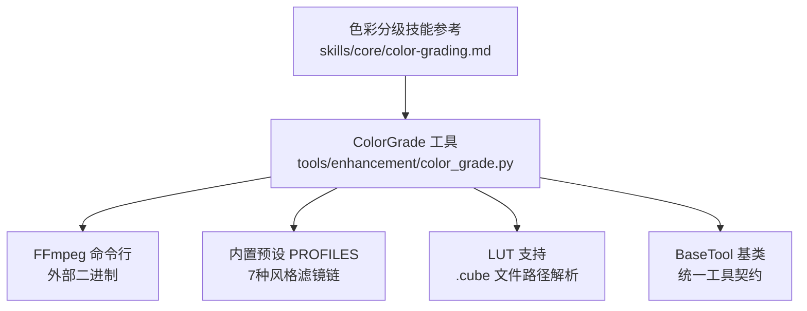
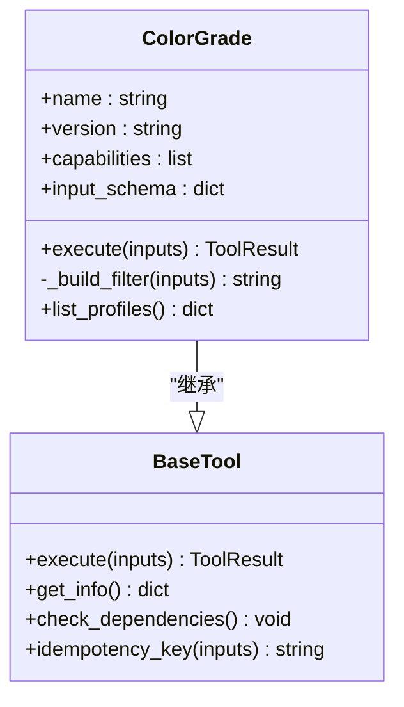
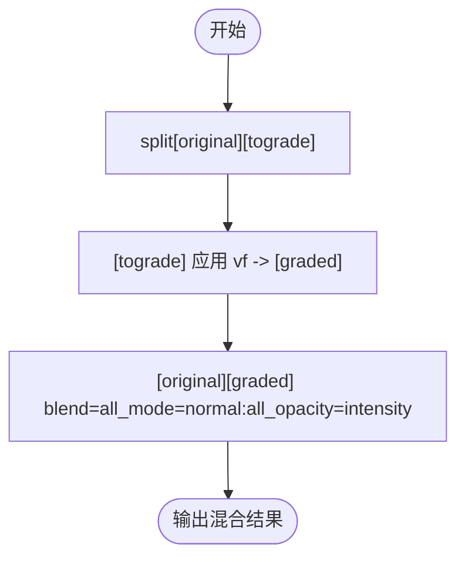
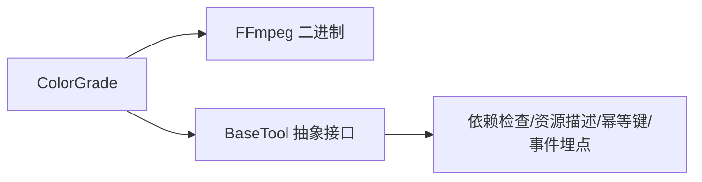

# 色彩分级工具

<cite>
**本文引用的文件**
- [tools/enhancement/color_grade.py](file://tools/enhancement/color_grade.py)
- [skills/core/color-grading.md](file://skills/core/color-grading.md)
- [tools/base_tool.py](file://tools/base_tool.py)
</cite>

## 目录
1. [简介](#简介)
2. [项目结构](#项目结构)
3. [核心组件](#核心组件)
4. [架构总览](#架构总览)
5. [详细组件分析](#详细组件分析)
6. [依赖关系分析](#依赖关系分析)
7. [性能考量](#性能考量)
8. [故障排查指南](#故障排查指南)
9. [结论](#结论)
10. [附录](#附录)

## 简介
本文件面向开发者与视频后期工程师，系统化阐述 OpenMontage 中的“色彩分级工具”实现。重点包括：
- ColorGrade 类的架构设计与职责边界
- 内置预设配置（7种）的色彩理论基础与适用场景
- LUT（.cube）文件支持机制
- 自定义滤镜链（custom_vf）扩展方式
- FFmpeg 滤镜链构建原理（colorbalance、curves、eq、lut3d 等）
- 强度混合算法（split + blend 模式）与透明度控制
- 完整参数配置指南（profile、lut_path、intensity、codec、crf 等）
- 使用示例、性能优化建议与常见问题解决方案

## 项目结构
OpenMontage 将色彩分级能力封装为独立工具，位于增强类工具目录下，并通过统一的 BaseTool 契约进行注册与执行。相关文档与最佳实践集中在技能参考中。



图表来源
- [tools/enhancement/color_grade.py:24-75](file://tools/enhancement/color_grade.py#L24-L75)
- [tools/enhancement/color_grade.py:78-124](file://tools/enhancement/color_grade.py#L78-L124)
- [tools/base_tool.py:227-399](file://tools/base_tool.py#L227-L399)
- [skills/core/color-grading.md:18-45](file://skills/core/color-grading.md#L18-L45)

章节来源
- [tools/enhancement/color_grade.py:24-75](file://tools/enhancement/color_grade.py#L24-L75)
- [tools/enhancement/color_grade.py:78-124](file://tools/enhancement/color_grade.py#L78-L124)
- [tools/base_tool.py:227-399](file://tools/base_tool.py#L227-L399)
- [skills/core/color-grading.md:18-45](file://skills/core/color-grading.md#L18-L45)

## 核心组件
- ColorGrade：继承自 BaseTool，负责输入校验、滤镜链构建、调用 FFmpeg 执行、结果封装。
- 内置预设 PROFILES：以 FFmpeg 滤镜字符串形式定义，涵盖色温、对比度、饱和度、曲线等调整。
- LUT 支持：通过 lut3d 滤镜应用 .cube 三维查找表。
- 强度混合：当 intensity < 1.0 时，使用 split + blend 将原始画面与分级画面按透明度混合。
- 自定义滤镜链：允许用户直接传入 custom_vf，绕过预设与 LUT。

章节来源
- [tools/enhancement/color_grade.py:78-124](file://tools/enhancement/color_grade.py#L78-L124)
- [tools/enhancement/color_grade.py:181-207](file://tools/enhancement/color_grade.py#L181-L207)
- [tools/enhancement/color_grade.py:24-75](file://tools/enhancement/color_grade.py#L24-L75)

## 架构总览
ColorGrade 的执行流程如下：
- 输入校验：检查 input_path 是否存在
- 滤镜构建：优先 custom_vf，其次 lut_path（若存在），最后回退到 profile
- 强度混合：当 0 < intensity < 1.0 时，采用 split + blend 混合原始与分级画面
- FFmpeg 执行：组装命令并调用 run_command
- 结果返回：包含输入/输出路径、使用的滤镜、耗时等信息

```mermaid
sequenceDiagram
participant U as "调用方"
participant CG as "ColorGrade.execute"
participant BF as "_build_filter"
participant FF as "FFmpeg"
U->>CG : 传入 inputs(input_path, profile/lut_path/intensity/custom_vf, codec, crf)
CG->>CG : 校验 input_path 存在性
CG->>BF : 构建滤镜链
alt custom_vf 提供
BF-->>CG : 返回 custom_vf
else 提供 lut_path 且存在
BF-->>CG : 返回 "lut3d='...'"
else 使用 profile
BF-->>CG : 返回预设 vf
opt intensity < 1.0
BF-->>CG : 包装 split[original][tograde]; [tograde]vf[graded]; [original][graded]blend=...
end
end
CG->>FF : 执行 ffmpeg -i ... -vf ... -c : v ... -c : a copy output
FF-->>CG : 返回执行状态
CG-->>U : ToolResult(成功/失败, 元数据, 产物路径, 耗时)
```

图表来源
- [tools/enhancement/color_grade.py:134-179](file://tools/enhancement/color_grade.py#L134-L179)
- [tools/enhancement/color_grade.py:181-207](file://tools/enhancement/color_grade.py#L181-L207)

章节来源
- [tools/enhancement/color_grade.py:134-179](file://tools/enhancement/color_grade.py#L134-L179)
- [tools/enhancement/color_grade.py:181-207](file://tools/enhancement/color_grade.py#L181-L207)

## 详细组件分析

### ColorGrade 类设计
- 职责：封装色彩分级逻辑，统一入口 execute，滤镜构建 _build_filter，静态方法 list_profiles
- 能力声明：grade_preset、grade_lut、grade_custom
- 资源与稳定性：CPU 2核、内存 1024MB、无显存要求；实验级稳定性；确定性执行
- 幂等键：基于 input_path、profile、lut_path、intensity 生成缓存键



图表来源
- [tools/base_tool.py:227-399](file://tools/base_tool.py#L227-L399)
- [tools/enhancement/color_grade.py:78-124](file://tools/enhancement/color_grade.py#L78-L124)
- [tools/enhancement/color_grade.py:209-212](file://tools/enhancement/color_grade.py#L209-L212)

章节来源
- [tools/enhancement/color_grade.py:78-124](file://tools/enhancement/color_grade.py#L78-L124)
- [tools/base_tool.py:227-399](file://tools/base_tool.py#L227-L399)

### 内置预设与色彩理论
7种预设及其色彩理论基础与适用场景：
- cinematic_warm：暖色调电影感，提升阴影与高光橙调，适合叙事类内容，建立情感连接
- cinematic_cool：冷色调青橙电影感，适合科技/暗主题内容，搭配深色 UI 截图
- moody_dark：压黑、去饱和中灰，营造暗黑氛围，适合严肃题材，注意保留细节
- bright_clean：明亮干净，提升阴影与色彩鲜艳度，适合企业/SaaS演示
- vintage_film：褪色胶片质感，轻微暖偏色与低饱和，适合怀旧风格
- high_contrast：高对比强冲击，适合动态内容与移动端注意力抓取
- neutral：最小化校正，仅标准化电平与轻微对比，适合科学/教育类需要准确色彩的场景

章节来源
- [tools/enhancement/color_grade.py:24-75](file://tools/enhancement/color_grade.py#L24-L75)
- [skills/core/color-grading.md:47-57](file://skills/core/color-grading.md#L47-L57)

### LUT 文件支持
- 格式：.cube（3D LUT），行业标准，通过 FFmpeg 的 lut3d 滤镜应用
- 路径处理：解析绝对路径并进行跨平台转义（Windows 盘符冒号转义）
- 应用时机：在修正后的素材上最后应用创意 LUT，避免对未校正素材直接套用导致失真

章节来源
- [tools/enhancement/color_grade.py:185-188](file://tools/enhancement/color_grade.py#L185-L188)
- [skills/core/color-grading.md:87-106](file://skills/core/color-grading.md#L87-L106)

### 自定义滤镜链（custom_vf）
- 优先级最高：若提供 custom_vf，则直接使用，不叠加预设或 LUT
- 推荐顺序：normalize → colortemperature → colorbalance → curves → eq → lut3d
- 可组合专业滤镜：colorbalance（阴影/中间调/高光 RGB 调节）、curves（通道曲线）、eq（亮度/对比度/饱和度/伽马）、colortemperature（白平衡）、hue（色相旋转）、normalize（自动直方图拉伸）

章节来源
- [skills/core/color-grading.md:18-45](file://skills/core/color-grading.md#L18-L45)
- [tools/enhancement/color_grade.py:181-183](file://tools/enhancement/color_grade.py#L181-L183)

### 强度混合算法（split-overlay 模式）
- 触发条件：0 < intensity < 1.0
- 实现方式：使用 split 将输入分为 original 与 tograde 两路；对 tograde 应用 vf 得到 graded；再用 blend 将 original 与 graded 按 all_opacity=intensity 混合
- 效果：实现“原片与分级结果的透明度混合”，便于微调强度而不破坏原始画面



图表来源
- [tools/enhancement/color_grade.py:197-205](file://tools/enhancement/color_grade.py#L197-L205)

章节来源
- [tools/enhancement/color_grade.py:197-205](file://tools/enhancement/color_grade.py#L197-L205)

### FFmpeg 滤镜链构建原理
- 核心滤镜：
  - colorbalance：RGB 在阴影/中间调/高光的偏移（rs/gs/bs, rm/gm/bm, rh/gh/bh）
  - curves：通道曲线（all/red/green/blue），用于对比度与色调塑造
  - eq：最终对比度/饱和度/亮度/伽马微调
  - colortemperature：白平衡温度调节
  - lut3d：应用 .cube LUT
  - normalize：自动拉伸直方图至全范围
  - hue：色相旋转与饱和度倍增
- 滤镜顺序：先校正（normalize、colortemperature、colorbalance），再造型（curves、eq），最后创意（lut3d）

章节来源
- [skills/core/color-grading.md:18-45](file://skills/core/color-grading.md#L18-L45)
- [tools/enhancement/color_grade.py:24-75](file://tools/enhancement/color_grade.py#L24-L75)

## 依赖关系分析
- 外部依赖：FFmpeg 二进制（cmd:ffmpeg），需安装并可执行
- 内部依赖：BaseTool 提供的统一工具契约、资源描述、幂等键、错误处理与事件埋点
- 耦合与内聚：ColorGrade 内聚了滤镜构建与执行逻辑，通过 BaseTool 解耦于上层编排器



图表来源
- [tools/enhancement/color_grade.py:88-90](file://tools/enhancement/color_grade.py#L88-L90)
- [tools/base_tool.py:227-399](file://tools/base_tool.py#L227-L399)

章节来源
- [tools/enhancement/color_grade.py:88-90](file://tools/enhancement/color_grade.py#L88-L90)
- [tools/base_tool.py:227-399](file://tools/base_tool.py#L227-L399)

## 性能考量
- 计算开销：主要取决于滤镜复杂度与分辨率；curves、colorbalance、lut3d 会增加 CPU 负载
- 编码参数：默认 libx264 + CRF 20，可在保证画质的同时控制体积；如需更快导出可降低 preset 或提高 CRF
- 混合模式：split+blend 会引入额外计算，但通常开销可控；建议在必要时使用 intensity 混合
- 位深与色彩空间：尽量在 10-bit 下分级，交付 8-bit 用于网络；BT.709 适用于 Web，HDR 才用 BT.2020
- 皮肤保护：避免过度饱和（>1.2），确保肤色自然；必要时降低饱和度或调整色相

章节来源
- [tools/enhancement/color_grade.py:126-127](file://tools/enhancement/color_grade.py#L126-L127)
- [skills/core/color-grading.md:7-16](file://skills/core/color-grading.md#L7-L16)
- [skills/core/color-grading.md:116-121](file://skills/core/color-grading.md#L116-L121)

## 故障排查指南
- 输入不存在：检查 input_path 是否正确，工具会返回明确错误信息
- 未指定任何滤镜：必须提供 custom_vf、有效的 lut_path 或 profile，否则返回错误
- FFmpeg 失败：确认已安装 FFmpeg 并在 PATH 中；查看错误日志定位问题
- LUT 路径无效：确保 .cube 文件存在且路径正确；Windows 路径会被转义处理
- 强度混合异常：确认 intensity 在 (0,1) 范围内；超出范围不会触发混合
- 肤色异常：降低饱和度或调整色相；遵循肤色线原则（约 123° I-line）

章节来源
- [tools/enhancement/color_grade.py:134-147](file://tools/enhancement/color_grade.py#L134-L147)
- [tools/enhancement/color_grade.py:185-188](file://tools/enhancement/color_grade.py#L185-L188)
- [tools/enhancement/color_grade.py:197-205](file://tools/enhancement/color_grade.py#L197-L205)
- [skills/core/color-grading.md:108-121](file://skills/core/color-grading.md#L108-L121)

## 结论
OpenMontage 的色彩分级工具以 ColorGrade 为核心，结合 FFmpeg 的强大滤镜能力，提供了开箱即用的 7 种预设、灵活的 LUT 支持与可扩展的自定义滤镜链。通过 split+blend 的强度混合机制，开发者可以精细控制分级强度，满足从企业演示到电影感的多样化需求。配合技能文档中的滤镜顺序与参数配方，能够快速搭建专业的视频色彩分级工作流。

## 附录

### 参数配置指南
- 必填参数：
  - input_path：输入视频路径
- 可选参数：
  - output_path：输出视频路径（默认在原文件名后加 _graded）
  - profile：选择内置预设（cinematic_warm、cinematic_cool、moody_dark、bright_clean、vintage_film、high_contrast、neutral）
  - lut_path：外部 .cube LUT 文件路径
  - intensity：混合强度（0.0-1.0），0 为原片，1 为全量分级
  - custom_vf：自定义 FFmpeg 滤镜链字符串
  - codec：视频编码器（默认 libx264）
  - crf：码率控制（默认 20）

章节来源
- [tools/enhancement/color_grade.py:98-124](file://tools/enhancement/color_grade.py#L98-L124)

### 使用示例
- 使用内置预设：
  - 输入：input_path="video.mp4", profile="cinematic_warm", intensity=0.85
  - 输出：video_graded.mp4
- 应用 LUT：
  - 输入：input_path="video.mp4", lut_path="assets/luts/my_lut.cube", intensity=0.7
  - 输出：video_graded.mp4
- 自定义滤镜链：
  - 输入：input_path="video.mp4", custom_vf="colorbalance=rs=0.06:gs=0.02:bs=-0.04:rh=0.05:gh=0.01:bh=-0.03,eq=contrast=1.05:saturation=1.08:brightness=0.01"
  - 输出：video_graded.mp4

章节来源
- [tools/enhancement/color_grade.py:134-179](file://tools/enhancement/color_grade.py#L134-L179)
- [skills/core/color-grading.md:59-79](file://skills/core/color-grading.md#L59-L79)

### 滤镜链顺序与配方
- 推荐顺序：normalize → colortemperature → colorbalance → curves → eq → lut3d
- 常用配方：
  - 温暖/亲切：colorbalance + eq
  - 冷静/技术：colorbalance + eq
  - 高能量：curves + eq
  - 低沉/严肃：curves + eq

章节来源
- [skills/core/color-grading.md:18-45](file://skills/core/color-grading.md#L18-L45)
- [skills/core/color-grading.md:59-85](file://skills/core/color-grading.md#L59-L85)