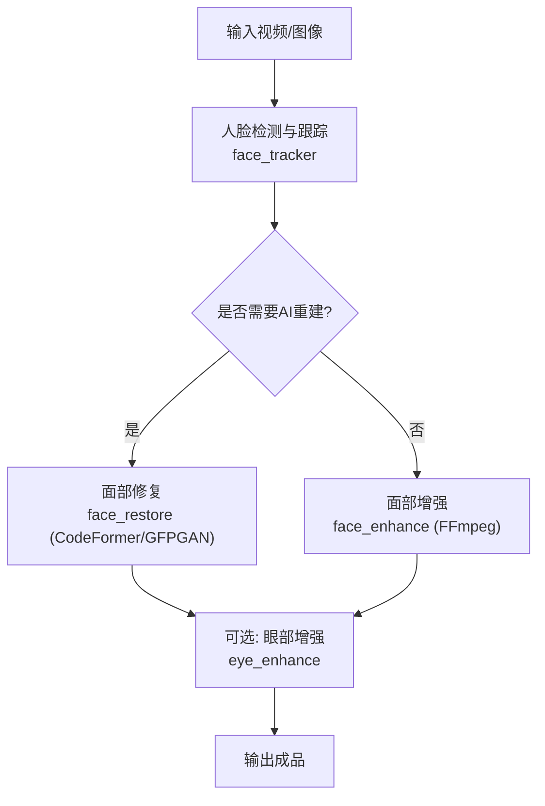
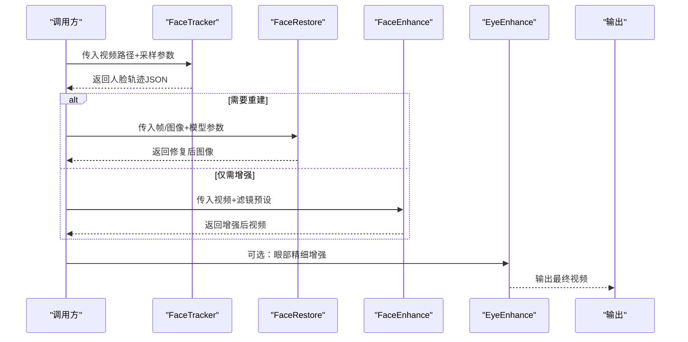
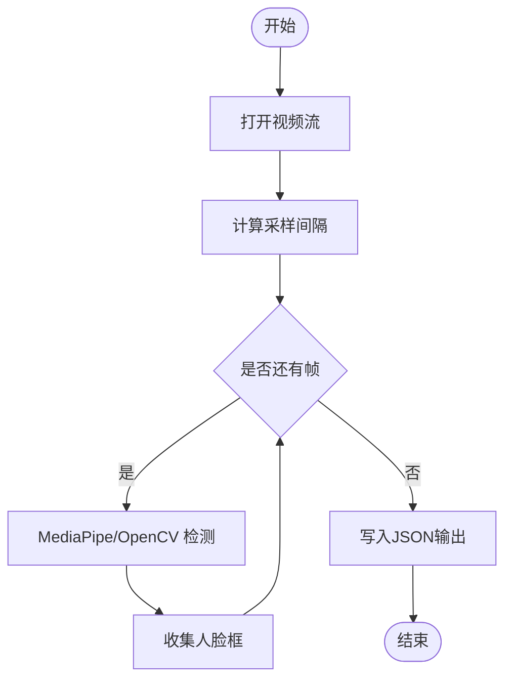
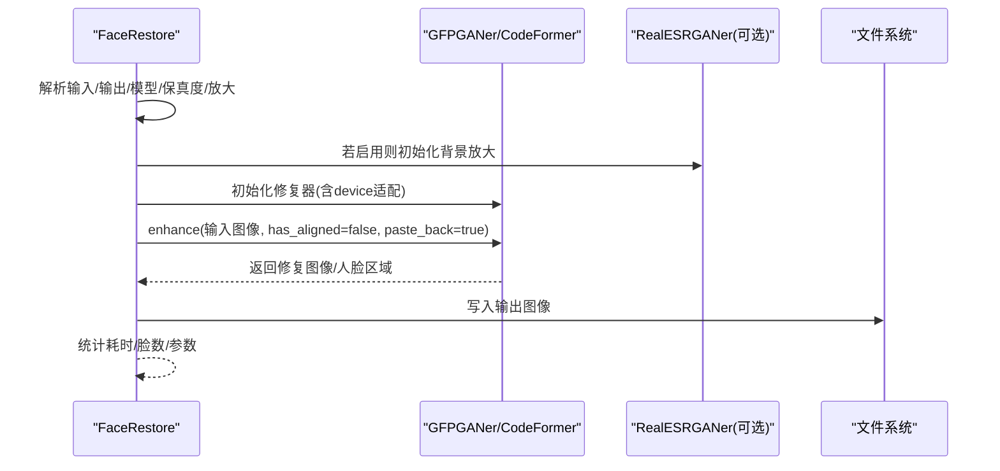
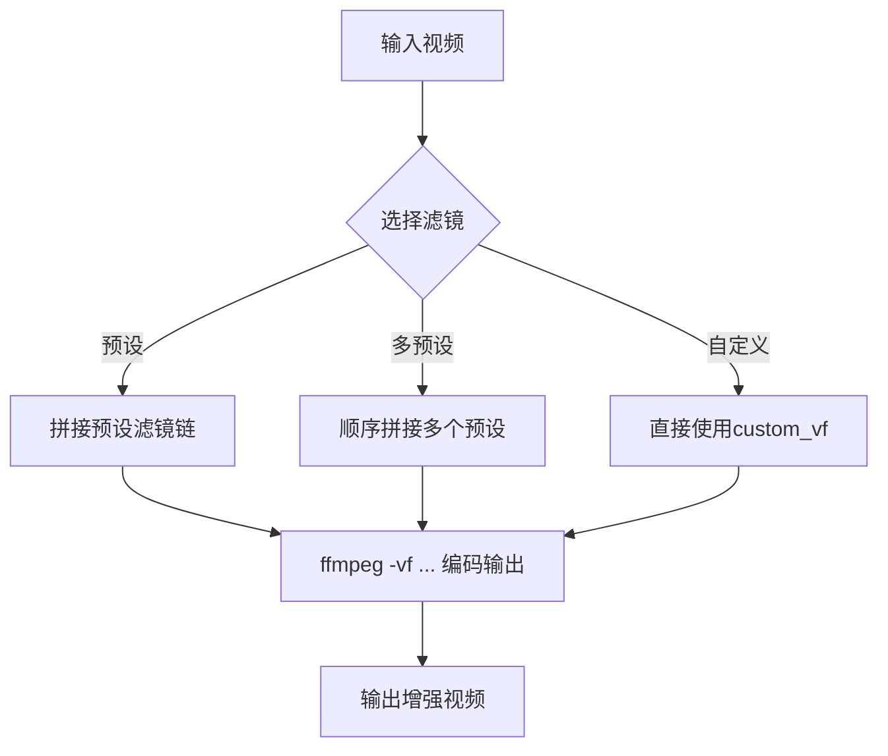
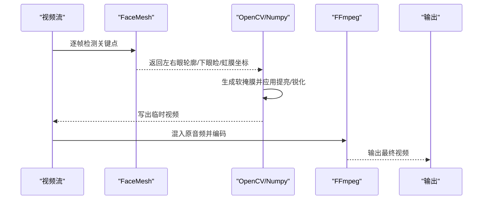
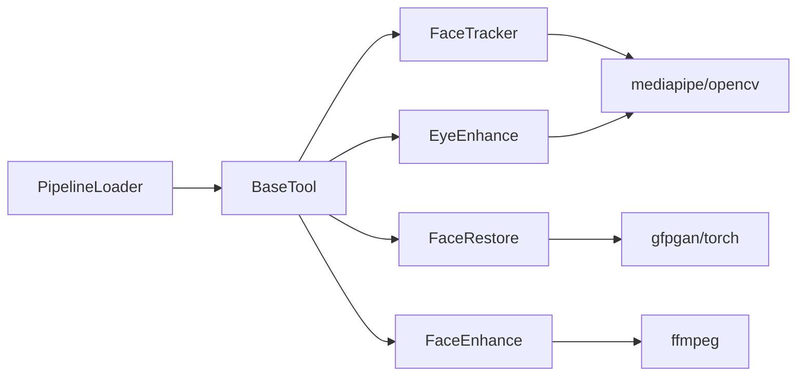

# 面部修复工具

<cite>
**本文引用的文件**
- [tools/enhancement/face_restore.py](file://tools/enhancement/face_restore.py)
- [tools/enhancement/face_enhance.py](file://tools/enhancement/face_enhance.py)
- [tools/analysis/face_tracker.py](file://tools/analysis/face_tracker.py)
- [tools/enhancement/eye_enhance.py](file://tools/enhancement/eye_enhance.py)
- [tools/base_tool.py](file://tools/base_tool.py)
- [lib/pipeline_loader.py](file://lib/pipeline_loader.py)
- [skills/creative/face-restore-usage.md](file://skills/creative/face-restore-usage.md)
</cite>

## 目录
1. [简介](#简介)
2. [项目结构](#项目结构)
3. [核心组件](#核心组件)
4. [架构总览](#架构总览)
5. [详细组件分析](#详细组件分析)
6. [依赖关系分析](#依赖关系分析)
7. [性能与资源管理](#性能与资源管理)
8. [批处理与生产级特性](#批处理与生产级特性)
9. [API 接口文档](#api-接口文档)
10. [故障排除指南](#故障排除指南)
11. [结论](#结论)

## 简介
本文件面向 OpenMontage 中的“面部修复”能力，系统性梳理从人脸检测、特征点定位到细节重建的完整技术链路，并说明深度学习模型集成方式（加载、推理优化、内存管理）、面部增强效果的处理流程（皮肤平滑、皱纹减少、细节锐化），以及批量处理能力的设计要点。同时提供完整的 API 接口说明、质量评估建议、实际应用场景示例、性能调优指南与故障排除方案，帮助开发者构建高质量的面部修复流水线。

## 项目结构
OpenMontage 将“面部修复”相关能力拆分为多个可组合的工具：
- 人脸检测与跟踪：基于 MediaPipe/OpenCV 的视频帧采样与人脸框输出
- 面部修复：基于 CodeFormer/GFPGAN 的重建式修复
- 面部增强：基于 FFmpeg 滤镜链的皮肤平滑、锐化、色彩校正
- 眼部增强：基于 MediaPipe Face Mesh 的眼周精细增强
- 基础工具框架：统一的工具契约、执行模式、资源描述、结果封装
- 管线加载：YAML 清单加载与校验，支撑编排与阶段控制

**图示来源**
- [tools/analysis/face_tracker.py:138-182](file://tools/analysis/face_tracker.py#L138-L182)
- [tools/enhancement/face_restore.py:108-246](file://tools/enhancement/face_restore.py#L108-L246)
- [tools/enhancement/face_enhance.py:126-170](file://tools/enhancement/face_enhance.py#L126-L170)
- [tools/enhancement/eye_enhance.py:149-268](file://tools/enhancement/eye_enhance.py#L149-L268)

**章节来源**
- [tools/analysis/face_tracker.py:1-315](file://tools/analysis/face_tracker.py#L1-L315)
- [tools/enhancement/face_restore.py:1-246](file://tools/enhancement/face_restore.py#L1-L246)
- [tools/enhancement/face_enhance.py:1-194](file://tools/enhancement/face_enhance.py#L1-L194)
- [tools/enhancement/eye_enhance.py:1-579](file://tools/enhancement/eye_enhance.py#L1-L579)
- [tools/base_tool.py:1-200](file://tools/base_tool.py#L1-L200)
- [lib/pipeline_loader.py:1-200](file://lib/pipeline_loader.py#L1-L200)

## 核心组件
- 人脸检测与跟踪（FaceTracker）
  - 功能：按采样率读取视频帧，使用 MediaPipe 或 OpenCV Haar 检测人脸框，输出每帧的人脸区域 JSON
  - 关键参数：采样帧率、最低置信度、输出路径
  - 输出：包含视频元数据与每帧人脸框列表的 JSON
- 面部修复（FaceRestore）
  - 功能：对低质/模糊/压缩严重的人脸进行重建，支持 CodeFormer 与 GFPGAN 两种模型
  - 关键参数：模型选择、保真度（仅 CodeFormer）、放大倍数、背景是否同步放大
  - 输出：修复后的图像/帧，附带检测到的脸数、耗时等元信息
- 面部增强（FaceEnhance）
  - 功能：通过 FFmpeg 滤镜链实现皮肤平滑、锐化、亮度/对比度调整、降噪、色温调节等
  - 关键参数：预设、多预设串联、自定义滤镜串、编码参数
  - 输出：增强后的视频
- 眼部增强（EyeEnhance）
  - 功能：基于 MediaPipe Face Mesh 精确定位眼周区域，实施黑眼圈淡化、眼睛提亮、眼部锐化
  - 关键参数：操作集合、强度参数、编码参数
  - 输出：眼部增强后的视频（自动回灌原音频）
- 基础工具框架（BaseTool）
  - 统一抽象：工具声明、运行环境、资源需求、幂等键、结果对象、执行包装与事件埋点
- 管线加载（PipelineLoader）
  - 功能：加载 YAML 管线清单并校验，提取阶段顺序、所需工具、子阶段等，用于编排与治理

**章节来源**
- [tools/analysis/face_tracker.py:29-115](file://tools/analysis/face_tracker.py#L29-L115)
- [tools/enhancement/face_restore.py:27-99](file://tools/enhancement/face_restore.py#L27-L99)
- [tools/enhancement/face_enhance.py:70-124](file://tools/enhancement/face_enhance.py#L70-L124)
- [tools/enhancement/eye_enhance.py:47-125](file://tools/enhancement/eye_enhance.py#L47-L125)
- [tools/base_tool.py:63-139](file://tools/base_tool.py#L63-L139)
- [lib/pipeline_loader.py:49-70](file://lib/pipeline_loader.py#L49-L70)

## 架构总览
整体采用“检测→修复/增强→精修→合成”的分层流水线。各工具遵循统一契约，便于在 Backlot 中编排、监控与审计。

**图示来源**
- [tools/analysis/face_tracker.py:138-182](file://tools/analysis/face_tracker.py#L138-L182)
- [tools/enhancement/face_restore.py:108-246](file://tools/enhancement/face_restore.py#L108-L246)
- [tools/enhancement/face_enhance.py:126-170](file://tools/enhancement/face_enhance.py#L126-L170)
- [tools/enhancement/eye_enhance.py:149-268](file://tools/enhancement/eye_enhance.py#L149-L268)

## 详细组件分析

### 人脸检测与跟踪（FaceTracker）
- 算法与实现
  - 首选 MediaPipe Face Detection，按采样间隔读取帧，取最高置信度检测结果
  - 无 MediaPipe 时回退至 OpenCV Haar Cascade，选取最大人脸框
  - 输出标准化 JSON，包含视频宽高、FPS、时长、采样帧数、检测到的脸数及每帧人脸框
- 关键流程
  - 打开视频流 → 计算采样间隔 → 循环读帧 → 检测/跟踪 → 收集人脸框 → 写入 JSON
- 错误处理
  - 缺失依赖时返回不可用状态；缺少 OpenCV 直接报错
- 适用场景
  - 为后续修复/增强提供人脸位置先验，降低误处理区域

**图示来源**
- [tools/analysis/face_tracker.py:184-251](file://tools/analysis/face_tracker.py#L184-L251)
- [tools/analysis/face_tracker.py:253-314](file://tools/analysis/face_tracker.py#L253-L314)

**章节来源**
- [tools/analysis/face_tracker.py:138-182](file://tools/analysis/face_tracker.py#L138-L182)
- [tools/analysis/face_tracker.py:184-314](file://tools/analysis/face_tracker.py#L184-L314)

### 面部修复（FaceRestore）
- 模型与策略
  - 支持 CodeFormer（可调保真度）与 GFPGAN（更快但可控性弱）
  - 可选 Real-ESRGAN 背景放大（按需启用）
- 推理与设备
  - 动态探测 GFPGANer/RealESRGANer 构造函数签名，决定是否传递 device 参数
  - 使用共享设备选择函数获取 CUDA/MPS/CPU
- 处理流程
  - 读取输入 → 初始化修复器 → 执行 enhance（自动检测人脸、粘贴回原图）→ 保存输出
- 质量与验证
  - 返回检测到的脸数量、放大倍数、保真度、是否启用背景放大、耗时
  - 用户可见验证：对比前后外观自然、身份一致、无幻觉特征

**图示来源**
- [tools/enhancement/face_restore.py:108-246](file://tools/enhancement/face_restore.py#L108-L246)

**章节来源**
- [tools/enhancement/face_restore.py:27-99](file://tools/enhancement/face_restore.py#L27-L99)
- [tools/enhancement/face_restore.py:108-246](file://tools/enhancement/face_restore.py#L108-L246)

### 面部增强（FaceEnhance）
- 滤镜链与预设
  - 内置多种预设：柔肤、锐化、增亮、对比度提升、冷暖色调、降噪、综合人像标准
  - 支持多预设串联与自定义滤镜串
- 执行方式
  - 通过 FFmpeg 命令执行滤镜链，保持音频直通
- 质量控制
  - 用户可见验证：皮肤纹理自然不塑料感，边缘清晰不过锐

**图示来源**
- [tools/enhancement/face_enhance.py:25-67](file://tools/enhancement/face_enhance.py#L25-L67)
- [tools/enhancement/face_enhance.py:126-170](file://tools/enhancement/face_enhance.py#L126-L170)

**章节来源**
- [tools/enhancement/face_enhance.py:70-124](file://tools/enhancement/face_enhance.py#L70-L124)
- [tools/enhancement/face_enhance.py:126-188](file://tools/enhancement/face_enhance.py#L126-L188)

### 眼部增强（EyeEnhance）
- 关键点定位
  - 使用 MediaPipe Face Mesh（468 关键点）定位上下眼睑、眼眶、虹膜区域
- 增强操作
  - 黑眼圈淡化：在下眼睑区域创建软掩膜，LAB 空间提亮并适度去饱和
  - 眼睛提亮：眼眶区域掩膜 + LAB 提亮
  - 眼部锐化：眼眶掩膜 + unsharp 锐化
- 降级策略
  - 无 MediaPipe：回退到 OpenCV Haar 粗略定位 + 全局亮度对比度调整
  - 无 OpenCV：最后手段使用 FFmpeg 全局 eq 滤镜
- 音频处理
  - 中间视频临时写入，再使用 FFmpeg 混入原始音轨

**图示来源**
- [tools/enhancement/eye_enhance.py:176-268](file://tools/enhancement/eye_enhance.py#L176-L268)
- [tools/enhancement/eye_enhance.py:270-423](file://tools/enhancement/eye_enhance.py#L270-L423)
- [tools/enhancement/eye_enhance.py:425-574](file://tools/enhancement/eye_enhance.py#L425-L574)

**章节来源**
- [tools/enhancement/eye_enhance.py:47-125](file://tools/enhancement/eye_enhance.py#L47-L125)
- [tools/enhancement/eye_enhance.py:149-268](file://tools/enhancement/eye_enhance.py#L149-L268)
- [tools/enhancement/eye_enhance.py:270-574](file://tools/enhancement/eye_enhance.py#L270-L574)

### 基础工具框架（BaseTool）
- 统一契约
  - 工具元信息：名称、版本、层级、能力、提供者、稳定性、执行模式、确定性
  - 资源画像：CPU/内存/显存/磁盘/网络需求
  - 幂等键字段：用于缓存与重试
  - 结果对象：成功标志、数据、产物、错误、成本、耗时、种子、模型
- 执行包装
  - 可选 Backlot 事件埋点（start/finish/error），不影响主流程
- 设备与环境
  - 自动加载 .env 环境变量，供工具运行时使用

**章节来源**
- [tools/base_tool.py:63-139](file://tools/base_tool.py#L63-L139)
- [tools/base_tool.py:148-200](file://tools/base_tool.py#L148-L200)

### 管线加载（PipelineLoader）
- 功能
  - 加载 pipeline_defs/*.yaml 清单并校验 schema
  - 提供阶段顺序、子阶段、所需工具、技能路径、人工审批默认值等查询
- 作用
  - 作为编排与治理的基础，确保工具链的可发现性与一致性

**章节来源**
- [lib/pipeline_loader.py:27-70](file://lib/pipeline_loader.py#L27-L70)
- [lib/pipeline_loader.py:125-182](file://lib/pipeline_loader.py#L125-L182)

## 依赖关系分析
- 外部库
  - gfpgan、torch：面部修复模型推理
  - mediapipe、opencv-python、numpy：人脸检测/跟踪与眼部增强
  - ffmpeg：滤镜链执行与音视频复用
- 内部模块
  - base_tool：统一工具契约与执行包装
  - pipeline_loader：管线清单加载与校验
- 耦合与内聚
  - 各工具高内聚、低耦合，通过统一 ToolResult 与 BaseTool 交互
  - 设备选择与依赖探测在各工具内部完成，避免跨模块强耦合

**图示来源**
- [tools/base_tool.py:63-139](file://tools/base_tool.py#L63-L139)
- [tools/enhancement/face_restore.py:108-246](file://tools/enhancement/face_restore.py#L108-L246)
- [tools/analysis/face_tracker.py:138-182](file://tools/analysis/face_tracker.py#L138-L182)
- [tools/enhancement/face_enhance.py:126-170](file://tools/enhancement/face_enhance.py#L126-L170)
- [tools/enhancement/eye_enhance.py:149-268](file://tools/enhancement/eye_enhance.py#L149-L268)
- [lib/pipeline_loader.py:49-70](file://lib/pipeline_loader.py#L49-L70)

**章节来源**
- [tools/base_tool.py:63-139](file://tools/base_tool.py#L63-L139)
- [lib/pipeline_loader.py:49-70](file://lib/pipeline_loader.py#L49-L70)

## 性能与资源管理
- 设备选择
  - 优先 CUDA/MPS，回退 CPU；在 GFPGANer/RealESRGANer 初始化时根据签名决定是否传入 device
- 显存与精度
  - 在 GPU 上启用 half precision 以降低显存占用（RealESRGANer）
- 采样与降载
  - 人脸跟踪支持采样帧率，降低全量帧处理的开销
- 资源画像
  - 每个工具声明 CPU/内存/显存/磁盘需求，便于调度与配额
- 建议
  - 大分辨率视频优先降低采样率或分片处理
  - 仅在必要时开启背景放大，避免额外显存峰值

**章节来源**
- [tools/enhancement/face_restore.py:91-99](file://tools/enhancement/face_restore.py#L91-L99)
- [tools/enhancement/face_restore.py:140-168](file://tools/enhancement/face_restore.py#L140-L168)
- [tools/analysis/face_tracker.py:54-75](file://tools/analysis/face_tracker.py#L54-L75)
- [tools/enhancement/eye_enhance.py:113-119](file://tools/enhancement/eye_enhance.py#L113-L119)

## 批处理与生产级特性
- 任务队列与并发
  - 当前工具以同步执行模式为主；可在上层编排中使用进程/线程池并行处理不同片段
  - 借助 BaseTool 的事件埋点，可在 Backlot 中可视化进度与状态
- 幂等与缓存
  - 通过 idempotency_key_fields 定义幂等键，结合上游缓存机制避免重复计算
- 错误恢复
  - 工具内部捕获导入错误、模型加载失败、读写失败等异常，返回结构化 ToolResult
  - 眼部增强在音频复用失败时明确报错，并清理临时文件
- 可观测性
  - 记录耗时、检测脸数、使用的模型/滤镜、产物路径等元数据，便于审计与回溯

**章节来源**
- [tools/base_tool.py:110-139](file://tools/base_tool.py#L110-L139)
- [tools/base_tool.py:148-200](file://tools/base_tool.py#L148-L200)
- [tools/enhancement/eye_enhance.py:237-268](file://tools/enhancement/eye_enhance.py#L237-L268)
- [tools/enhancement/eye_enhance.py:505-574](file://tools/enhancement/eye_enhance.py#L505-L574)

## API 接口文档

### FaceRestore（面部修复）
- 输入
  - input_path：必填，图像或视频帧路径
  - output_path：可选，默认 {stem}_restored.{ext}
  - model：可选，枚举 ["CodeFormer","GFPGAN"]，默认 CodeFormer
  - fidelity：可选，0–1，仅 CodeFormer，默认 0.5
  - upscale：可选，整数，默认 2
  - bg_upsampler：可选，布尔，默认 False
- 输出
  - success：布尔
  - data：包含 input/output/model/faces_detected/upscale/fidelity/bg_upsampler
  - artifacts：输出文件路径列表
  - duration_seconds：耗时
- 行为
  - 自动检测人脸并重建，支持背景放大（可选）
  - 设备自适应（CUDA/MPS/CPU）

**章节来源**
- [tools/enhancement/face_restore.py:53-99](file://tools/enhancement/face_restore.py#L53-L99)
- [tools/enhancement/face_restore.py:108-246](file://tools/enhancement/face_restore.py#L108-L246)

### FaceEnhance（面部增强）
- 输入
  - input_path：必填
  - output_path：可选
  - preset：可选，枚举内置预设，默认 talking_head_standard
  - presets：可选，数组，顺序应用多个预设
  - custom_vf：可选，自定义 FFmpeg 滤镜串
  - codec/crf：可选，编码参数
- 输出
  - success/data/artifacts/duration_seconds
- 行为
  - 通过 FFmpeg 滤镜链执行，保留原音频

**章节来源**
- [tools/enhancement/face_enhance.py:93-124](file://tools/enhancement/face_enhance.py#L93-L124)
- [tools/enhancement/face_enhance.py:126-170](file://tools/enhancement/face_enhance.py#L126-L170)

### FaceTracker（人脸检测与跟踪）
- 输入
  - input_path：必填
  - output_path：可选，默认 {input}.faces.json
  - sample_fps：可选，默认 5
  - min_detection_confidence：可选，默认 0.5
- 输出
  - success/data/artifacts/duration_seconds
  - data 中包含 video_width/height/fps/duration_seconds/frames_sampled/faces_detected/method
- 行为
  - 首选 MediaPipe，回退 OpenCV Haar

**章节来源**
- [tools/analysis/face_tracker.py:54-115](file://tools/analysis/face_tracker.py#L54-L115)
- [tools/analysis/face_tracker.py:138-182](file://tools/analysis/face_tracker.py#L138-L182)

### EyeEnhance（眼部增强）
- 输入
  - input_path：必填
  - output_path：可选
  - operations：可选，数组 ["dark_circles","brighten_eyes","sharpen_eyes"]，默认前两项
  - dark_circle_intensity/eye_brighten_intensity/sharpen_intensity：可选，0–1
  - codec/crf：可选
- 输出
  - success/data/artifacts/duration_seconds
  - data 中包含 method/frames_processed/frames_enhanced/operations
- 行为
  - 首选 MediaPipe Face Mesh，回退 OpenCV/FFmpeg

**章节来源**
- [tools/enhancement/eye_enhance.py:72-125](file://tools/enhancement/eye_enhance.py#L72-L125)
- [tools/enhancement/eye_enhance.py:149-268](file://tools/enhancement/eye_enhance.py#L149-L268)

## 故障排除指南
- 依赖缺失
  - gfpgan/torch 未安装：FaceRestore 会返回缺失依赖错误
  - mediapipe/opencv 未安装：FaceTracker/EyeEnhance 降级或不可用
- 模型加载失败
  - 网络下载权重失败或版本不兼容：检查网络与模型路径，确认签名兼容性
- 设备问题
  - CUDA/MPS 不可用：自动回退 CPU，性能下降
- 视频读写错误
  - 输入不存在或无法读取：检查路径与权限
  - FFmpeg 命令失败：检查命令行参数与编码器可用性
- 音频复用失败
  - 眼部增强在混入音频时失败：检查源音频轨道与编码器设置

**章节来源**
- [tools/enhancement/face_restore.py:124-134](file://tools/enhancement/face_restore.py#L124-L134)
- [tools/enhancement/face_restore.py:185-199](file://tools/enhancement/face_restore.py#L185-L199)
- [tools/analysis/face_tracker.py:131-147](file://tools/analysis/face_tracker.py#L131-L147)
- [tools/enhancement/eye_enhance.py:237-268](file://tools/enhancement/eye_enhance.py#L237-L268)
- [tools/enhancement/eye_enhance.py:505-574](file://tools/enhancement/eye_enhance.py#L505-L574)

## 结论
OpenMontage 的面部修复体系以“检测—修复/增强—精修”为主线，结合深度学习重建与传统滤镜增强，兼顾质量与效率。通过统一工具契约、资源画像与管线加载，实现了可编排、可观测、可扩展的生产级能力。建议在复杂场景中优先使用 FaceTracker 提供先验，再根据素材质量选择 FaceRestore 或 FaceEnhance，并在必要时叠加 EyeEnhance 进行精细化修饰。配合合理的采样、设备选择与批处理策略，可稳定产出高质量的人像修复结果。