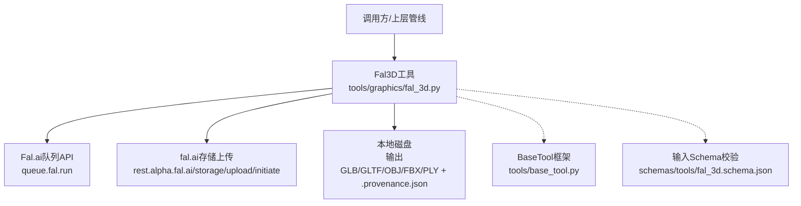
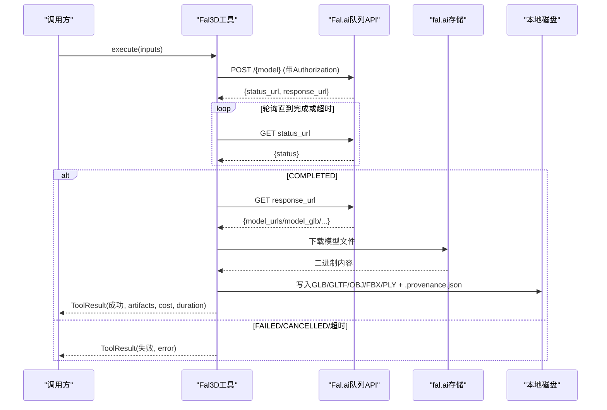
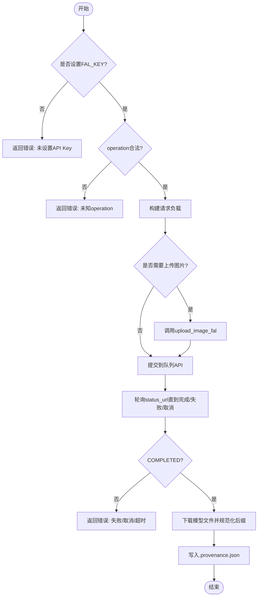
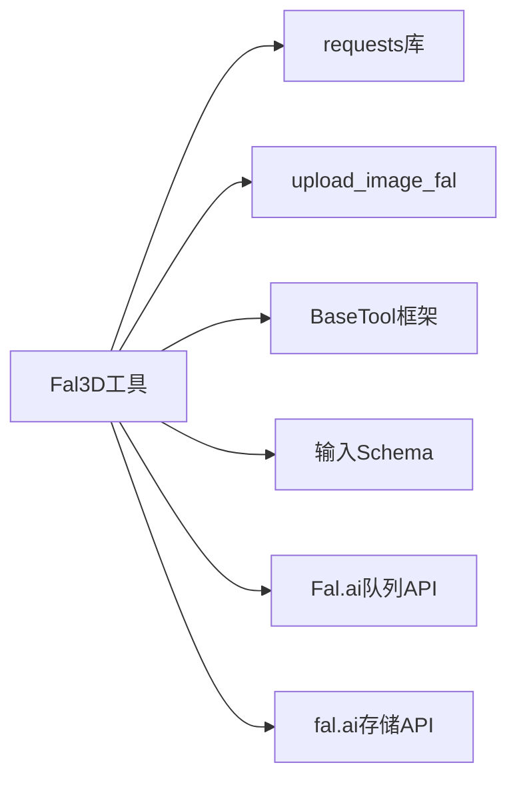

# Fal.ai 3D图像生成

<cite>
**本文引用的文件**
- [fal_3d.py](file://tools/graphics/fal_3d.py)
- [fal_3d.schema.json](file://schemas/tools/fal_3d.schema.json)
- [_shared.py](file://tools/video/_shared.py)
- [base_tool.py](file://tools/base_tool.py)
- [SKILL.md（3D资产生成）](file://.agents/skills/3d-asset-generation/SKILL.md)
</cite>

## 目录
1. [简介](#简介)
2. [项目结构](#项目结构)
3. [核心组件](#核心组件)
4. [架构总览](#架构总览)
5. [详细组件分析](#详细组件分析)
6. [依赖关系分析](#依赖关系分析)
7. [性能与优化](#性能与优化)
8. [故障排查指南](#故障排查指南)
9. [结论](#结论)
10. [附录：开发指南与最佳实践](#附录开发指南与最佳实践)

## 简介
本技术文档围绕OpenMontage中的Fal.ai 3D图像生成功能，系统性解析其API集成、异步任务处理、模型下载与产物管理、质量评估与质量控制、以及性能优化策略。重点覆盖以下方面：
- 3D模型转换与纹理映射：支持文本到3D、图像到3D、多对象重建，输出GLB/GLTF/OBJ/FBX/PLY等格式，并可选PBR材质。
- Fal.ai API集成：认证配置、请求构建、队列式异步任务轮询、结果下载与溯源记录。
- 质量评估机制：分辨率检测、格式验证、元数据提取、文件大小优化等。
- 性能优化：缓存、并发控制、内存管理与重试策略。
- 开发指南：API密钥配置、参数调优建议、错误处理模式与调试技巧。

## 项目结构
与Fal.ai 3D图像生成直接相关的代码与规范主要分布在以下位置：
- 工具实现：tools/graphics/fal_3d.py
- 输入Schema：schemas/tools/fal_3d.schema.json
- 共享上传能力：tools/video/_shared.py（用于将本地图片上传至fal.ai存储）
- 基础工具框架：tools/base_tool.py（统一工具接口、资源画像、重试策略、执行模式等）
- 3D资产生成技能说明：.agents/skills/3d-asset-generation/SKILL.md（提示词契约、网格质检、装配归一化等）

图表来源
- [fal_3d.py:52-213](file://tools/graphics/fal_3d.py#L52-L213)
- [_shared.py:517-553](file://tools/video/_shared.py#L517-L553)
- [base_tool.py:110-139](file://tools/base_tool.py#L110-L139)
- [fal_3d.schema.json:1-21](file://schemas/tools/fal_3d.schema.json#L1-L21)

章节来源
- [fal_3d.py:52-213](file://tools/graphics/fal_3d.py#L52-L213)
- [fal_3d.schema.json:1-21](file://schemas/tools/fal_3d.schema.json#L1-L21)
- [_shared.py:517-553](file://tools/video/_shared.py#L517-L553)
- [base_tool.py:110-139](file://tools/base_tool.py#L110-L139)

## 核心组件
- Fal3D工具类：封装了三种操作（text_to_3d、image_to_3d、reconstruct_objects），负责参数校验、构造请求、异步轮询、结果下载、产物与溯源写入。
- 输入Schema：定义operation枚举、prompt/image_url/image_path/output_path、enable_pbr、seed、export_textured_glb、detection_threshold、poll_timeout_seconds等字段约束。
- 共享上传函数：upload_image_fal将本地图片上传到fal.ai存储并返回公开URL，供图像到3D或多对象重建使用。
- BaseTool基类：提供统一的工具生命周期、资源画像、重试策略、执行模式、成本估算、状态查询等基础设施。

章节来源
- [fal_3d.py:28-103](file://tools/graphics/fal_3d.py#L28-L103)
- [fal_3d.schema.json:1-21](file://schemas/tools/fal_3d.schema.json#L1-L21)
- [_shared.py:517-553](file://tools/video/_shared.py#L517-L553)
- [base_tool.py:110-139](file://tools/base_tool.py#L110-L139)

## 架构总览
Fal.ai 3D图像生成的整体流程如下：
- 认证与鉴权：从环境变量读取FAL_KEY或FAL_AI_API_KEY，以Key方式附加到Authorization头。
- 请求构建：根据operation选择对应模型路径，组装payload（prompt、enable_pbr、image相关字段、导出选项、阈值、seed等）。
- 异步任务：POST到队列端点获取status_url与response_url，循环轮询直至COMPLETED或失败/取消。
- 结果下载：根据响应中的model_urls/model_glb/individual_glbs等字段，下载模型文件并规范化后缀。
- 产物与溯源：主产物写入output_path，其余产物命名追加序号；同时写入.provenance.json记录provider、model、request_id、operation、prompt、metadata、source_url、outputs等。

图表来源
- [fal_3d.py:113-213](file://tools/graphics/fal_3d.py#L113-L213)
- [_shared.py:517-553](file://tools/video/_shared.py#L517-L553)

章节来源
- [fal_3d.py:113-213](file://tools/graphics/fal_3d.py#L113-L213)

## 详细组件分析

### Fal3D工具类（Fal3D）
- 能力与定位：
  - 支持text_to_3d、image_to_3d、reconstruct_objects三种操作。
  - 支持PBR材质、GLB导出、种子复现、多对象重建。
  - 声明资源需求（CPU/内存/磁盘/网络）、重试策略（rate_limit、timeout）、幂等键字段（operation、prompt、image_url、image_path、enable_pbr、seed）。
- 关键流程：
  - 参数校验：必填字段检查（operation、prompt或image）、operation合法性校验。
  - 请求构建：按operation填充payload，必要时通过upload_image_fal上传本地图片。
  - 异步轮询：基于status_url轮询，默认超时时间可配置（poll_timeout_seconds）。
  - 结果处理：识别不同模型的响应结构，优先下载glb或obj，保存为标准化后缀。
  - 溯源记录：写入.provenance.json，包含provider、model、request_id、operation、prompt、metadata、source_url、outputs等。
- 成本估算：
  - reconstruct_objects固定成本；text/image-to-3d基础成本+可选PBR附加成本。

图表来源
- [fal_3d.py:113-213](file://tools/graphics/fal_3d.py#L113-L213)

章节来源
- [fal_3d.py:28-103](file://tools/graphics/fal_3d.py#L28-L103)
- [fal_3d.py:113-213](file://tools/graphics/fal_3d.py#L113-L213)

### 输入Schema（fal_3d.schema.json）
- 字段说明：
  - operation：枚举值text_to_3d、image_to_3d、reconstruct_objects。
  - prompt：文本到3D的提示词。
  - image_url/image_path：图像到3D或多对象重建的输入图像（二选一）。
  - output_path：输出目录/文件名。
  - enable_pbr：是否启用PBR材质（影响成本与渲染效果）。
  - seed：随机种子，用于可重复性。
  - export_textured_glb：多对象重建时是否导出带纹理的GLB。
  - detection_threshold：多对象重建的检测阈值（0.1~1.0）。
  - poll_timeout_seconds：轮询超时时间（30~1800秒）。
- 约束：additionalProperties=false，严格限制输入字段。

章节来源
- [fal_3d.schema.json:1-21](file://schemas/tools/fal_3d.schema.json#L1-L21)

### 共享上传能力（upload_image_fal）
- 功能：将本地图片上传到fal.ai存储，返回公开URL。
- 流程：
  - 读取API Key（FAL_KEY或FAL_AI_API_KEY）。
  - 检测文件存在性与扩展名，推断content_type。
  - 发起initiate请求获取upload_url与file_url。
  - PUT上传文件内容，成功后返回file_url。
- 错误处理：缺少API Key或文件不存在时抛出异常。

章节来源
- [_shared.py:517-553](file://tools/video/_shared.py#L517-L553)

### 基础工具框架（BaseTool）
- 统一接口：所有工具继承BaseTool，具备get_status、estimate_cost、execute等标准方法。
- 资源画像：ResourceProfile描述CPU/内存/显存/磁盘/网络需求。
- 重试策略：RetryPolicy支持最大重试次数、退避间隔、可重试错误类型。
- 执行模式：ExecutionMode区分同步/异步；Determinism区分确定性/种子/随机。
- 事件埋点：execute包装器在Backlot中发射start/finish/error事件，便于可视化追踪。

章节来源
- [base_tool.py:63-139](file://tools/base_tool.py#L63-L139)
- [base_tool.py:148-200](file://tools/base_tool.py#L148-L200)

## 依赖关系分析
- Fal3D依赖：
  - requests：HTTP客户端，用于队列提交、状态轮询、结果下载。
  - tools.video._shared.upload_image_fal：本地图片上传至fal.ai存储。
  - tools.base_tool.BaseTool：统一工具框架。
- 外部依赖：
  - fal.ai队列API：https://queue.fal.run/{model}
  - fal.ai存储API：https://rest.alpha.fal.ai/storage/upload/initiate
- 耦合与内聚：
  - Fal3D对上传逻辑解耦为独立函数，降低模块耦合度。
  - 通过Schema严格限定输入，提升内聚性与可维护性。
- 潜在循环依赖：无直接循环导入；上传逻辑位于video模块，被graphics模块按需导入。

图表来源
- [fal_3d.py:52-213](file://tools/graphics/fal_3d.py#L52-L213)
- [_shared.py:517-553](file://tools/video/_shared.py#L517-L553)
- [base_tool.py:110-139](file://tools/base_tool.py#L110-L139)
- [fal_3d.schema.json:1-21](file://schemas/tools/fal_3d.schema.json#L1-L21)

章节来源
- [fal_3d.py:52-213](file://tools/graphics/fal_3d.py#L52-L213)
- [_shared.py:517-553](file://tools/video/_shared.py#L517-L553)
- [base_tool.py:110-139](file://tools/base_tool.py#L110-L139)
- [fal_3d.schema.json:1-21](file://schemas/tools/fal_3d.schema.json#L1-L21)

## 性能与优化
- 缓存机制：
  - 幂等键：通过idempotency_key_fields（operation、prompt、image_url、image_path、enable_pbr、seed）避免重复计算，减少不必要的API调用。
  - 结果复用：相同参数的多次请求可直接复用历史产物（由上层调度层结合幂等键实现）。
- 并发控制：
  - 轮询间隔：默认每3秒轮询一次，避免高频请求导致限流。
  - 超时控制：poll_timeout_seconds可配置，防止长时间阻塞。
- 内存管理：
  - 流式下载：requests.get后直接写入磁盘，避免大文件驻留内存。
  - 临时文件清理：建议在调用方对中间产物进行清理，避免磁盘膨胀。
- 重试策略：
  - RetryPolicy支持rate_limit与timeout重试，提高鲁棒性。
- 传输优化：
  - 图片上传：自动推断content_type，减少额外开销。
  - 模型后缀规范化：根据URL后缀或content_type确定最终后缀，确保下游加载兼容。

[本节为通用性能讨论，不直接分析具体文件]

## 故障排查指南
- 常见错误与处理：
  - 未设置API Key：返回错误并提示安装说明。
  - 未知operation：返回错误并列出支持的operation。
  - 缺少prompt或image：针对text_to_3d或image_to_3d分别校验。
  - 队列失败/取消：抛出运行时异常并返回错误。
  - 轮询超时：抛出TimeoutError并返回错误。
  - 无可用模型下载：当响应不包含model_urls/model_glb/individual_glbs时报错。
- 调试技巧：
  - 启用日志：在调用方打印ToolResult.error与duration_seconds。
  - 检查.provenance.json：确认request_id、operation、prompt、metadata等信息。
  - 手动复现：使用相同的seed与参数，观察是否可重现问题。
  - 网络诊断：检查防火墙/代理设置，确保能访问queue.fal.run与rest.alpha.fal.ai。

章节来源
- [fal_3d.py:113-213](file://tools/graphics/fal_3d.py#L113-L213)

## 结论
Fal.ai 3D图像生成功能在OpenMontage中实现了完整的端到端流程：从参数校验、请求构建、异步轮询、结果下载到溯源记录，均具备健壮的实现。通过Schema约束、重试策略、幂等键与资源画像，系统在稳定性与可维护性上表现良好。结合3D资产生成的技能说明，可在提示词设计、网格质检、装配归一化等方面进一步提升产出质量。

[本节为总结性内容，不直接分析具体文件]

## 附录：开发指南与最佳实践
- API密钥配置：
  - 设置FAL_KEY或FAL_AI_API_KEY环境变量。
  - 在.env文件中配置（BaseTool会在导入时加载）。
- 参数调优建议：
  - text_to_3d：合理设置prompt，明确物体轮廓、材质、风格、尺度与朝向。
  - image_to_3d：使用简洁背景，主体占画面一半以上；仅在近距离受益时启用PBR。
  - reconstruct_objects：调整detection_threshold以平衡召回率与误检；设置export_textured_glb以获得带纹理的GLB。
  - seed：固定seed以实现可重复性。
  - poll_timeout_seconds：根据模型复杂度调整，避免过早超时。
- 错误处理模式：
  - 捕获ToolResult.error并记录上下文（operation、prompt、image_path等）。
  - 对于rate_limit与timeout，利用RetryPolicy自动重试。
- 调试技巧：
  - 查看.provenance.json中的request_id与metadata，便于在fal.ai控制台定位任务。
  - 使用Blender导入GLB进行网格质检（正面、背面、剪影、拓扑、接缝、材质响应等）。
  - 遵循3D资产生成技能中的“强制网格质检”与“装配归一化”要求。

章节来源
- [fal_3d.py:113-213](file://tools/graphics/fal_3d.py#L113-L213)
- [SKILL.md（3D资产生成）:39-102](file://.agents/skills/3d-asset-generation/SKILL.md#L39-L102)