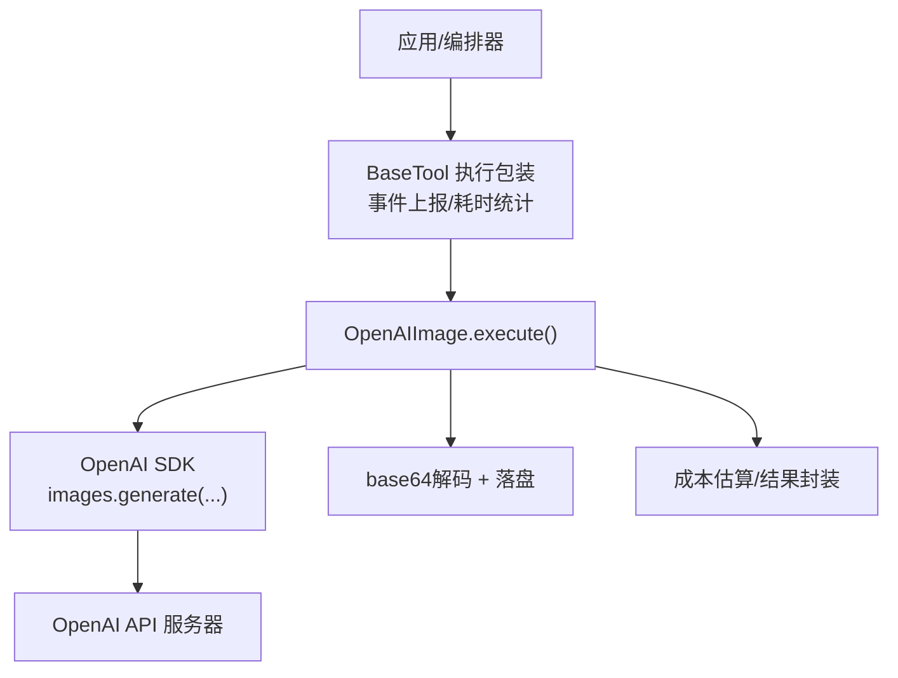
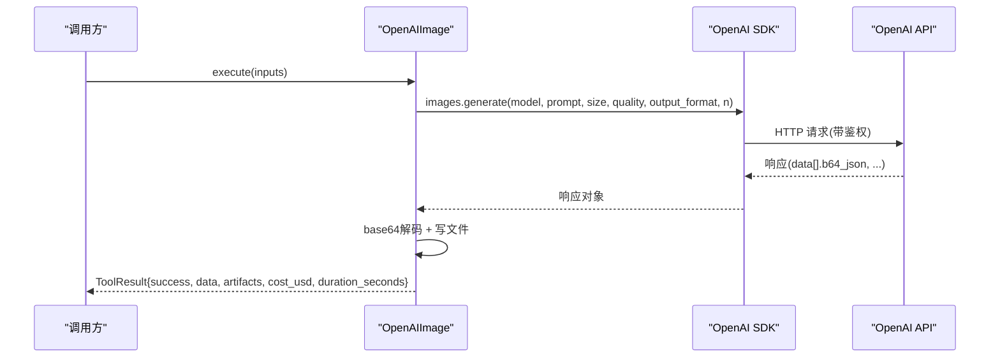
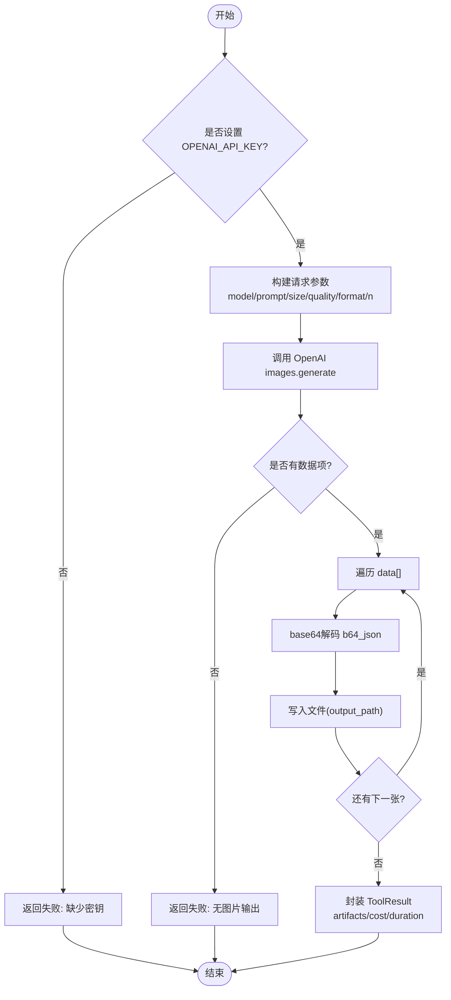
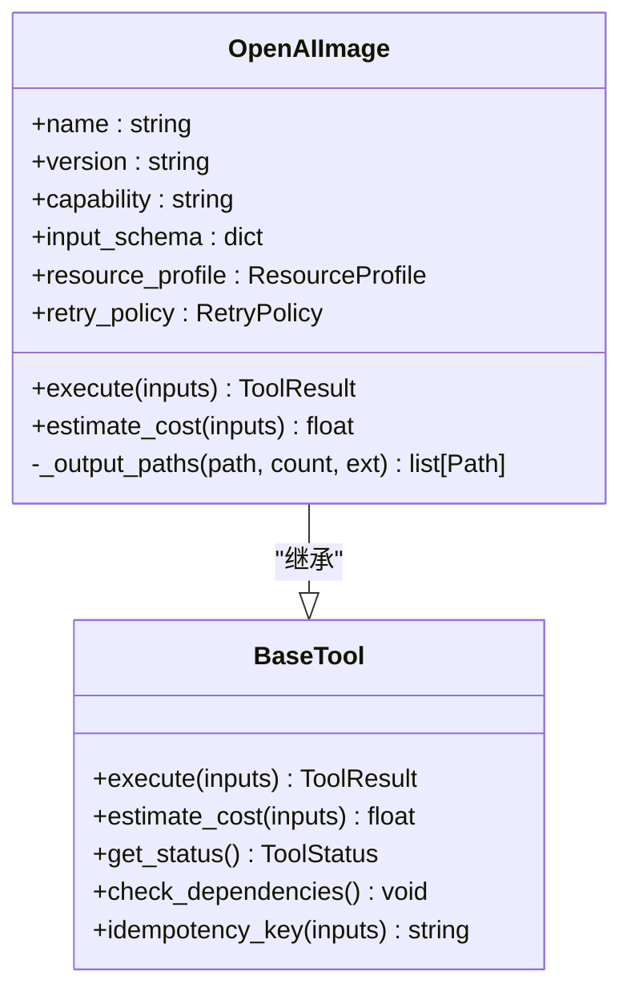

# OpenAI图像生成实现

<cite>
**本文引用的文件**
- [tools/graphics/openai_image.py](file://tools/graphics/openai_image.py)
- [tests/tools/test_openai_image_multi_output.py](file://tests/tools/test_openai_image_multi_output.py)
- [tools/base_tool.py](file://tools/base_tool.py)
- [lib/env_loader.py](file://lib/env_loader.py)
</cite>

## 目录
1. [简介](#简介)
2. [项目结构](#项目结构)
3. [核心组件](#核心组件)
4. [架构总览](#架构总览)
5. [详细组件分析](#详细组件分析)
6. [依赖关系分析](#依赖关系分析)
7. [性能与成本控制](#性能与成本控制)
8. [故障排查指南](#故障排查指南)
9. [结论](#结论)
10. [附录：集成示例与最佳实践](#附录集成示例与最佳实践)

## 简介
本文件面向需要在OpenMontage中集成OpenAI图像生成能力的开发者，聚焦于GPT Image（当前以gpt-image-2为主）的API调用流程、认证配置、请求构建、响应解析、成本控制、错误处理与性能优化。文档基于仓库中的实际代码进行分析，提供可操作的集成步骤、参数调优建议与监控指标收集方法，帮助快速、稳定地接入OpenAI图像生成服务。

## 项目结构
围绕OpenAI图像生成的关键代码位于工具层与基础框架层：
- 工具实现：tools/graphics/openai_image.py
- 基础工具契约与执行包装：tools/base_tool.py
- 环境变量加载：lib/env_loader.py
- 回归测试（多输出、计费一致性等）：tests/tools/test_openai_image_multi_output.py

图表来源
- [tools/graphics/openai_image.py:126-183](file://tools/graphics/openai_image.py#L126-L183)
- [tools/base_tool.py:148-224](file://tools/base_tool.py#L148-L224)

章节来源
- [tools/graphics/openai_image.py:1-184](file://tools/graphics/openai_image.py#L1-L184)
- [tools/base_tool.py:1-481](file://tools/base_tool.py#L1-L481)
- [lib/env_loader.py:1-35](file://lib/env_loader.py#L1-L35)
- [tests/tools/test_openai_image_multi_output.py:1-92](file://tests/tools/test_openai_image_multi_output.py#L1-L92)

## 核心组件
- OpenAIImage：继承自BaseTool，封装gpt-image-2文本到图像的生成能力，支持多输出、质量档位、尺寸选择、格式输出、成本估算与幂等键。
- BaseTool：统一工具契约，提供执行包装（事件上报、耗时统计）、依赖检查、状态报告、成本估算接口、幂等键计算等。
- 环境变量加载：通过.env或系统环境变量注入OPENAI_API_KEY等密钥。

章节来源
- [tools/graphics/openai_image.py:25-93](file://tools/graphics/openai_image.py#L25-L93)
- [tools/base_tool.py:227-391](file://tools/base_tool.py#L227-L391)
- [lib/env_loader.py:15-34](file://lib/env_loader.py#L15-L34)

## 架构总览
OpenAI图像生成在OpenMontage中以“工具”形式存在，由编排器或上层逻辑调用execute完成一次生成任务。执行过程包括：
- 鉴权：读取OPENAI_API_KEY（来自环境或.env）
- 构建请求：模型、提示词、尺寸、质量、输出格式、数量n
- 调用OpenAI images.generate
- 解析响应：将b64_json解码为二进制并写入磁盘
- 返回结果：包含路径列表、成本估算、耗时、模型信息等

图表来源
- [tools/graphics/openai_image.py:126-183](file://tools/graphics/openai_image.py#L126-L183)
- [tools/base_tool.py:148-224](file://tools/base_tool.py#L148-L224)

## 详细组件分析

### OpenAIImage 类
- 能力与约束
  - 能力：generate_image、generate_illustration、text_to_image
  - 支持：复杂指令、图内文字、多输出
  - 适用场景：复杂构图、含文字/标签的图像、严格遵循详细指令
  - 不适用：离线生成、高画质且预算受限的项目
- 输入参数
  - prompt（必填）
  - model：默认gpt-image-2
  - size：1024x1024 / 1536x1024 / 1024x1536 / auto
  - quality：low / medium / high / auto
  - output_format：png / jpeg / webp
  - n：1..4
  - output_path：可选，单图时保持原路径，多图时自动加后缀避免覆盖
- 资源与重试
  - 资源需求：CPU 1核、内存512MB、无显存、磁盘约100MB、需要网络
  - 重试策略：最多重试2次，针对rate_limit和timeout
  - 幂等键字段：prompt、size、quality、model
- 成本估算
  - 按quality映射单价，乘以n得到总成本；auto按medium计价
- 执行流程
  - 校验OPENAI_API_KEY
  - 构造OpenAI客户端并发起images.generate
  - 遍历response.data，将每个item.b64_json解码并写入对应output_path
  - 返回ToolResult，包含provider、model、prompt、outputs、images_generated、cost_usd、duration_seconds等

图表来源
- [tools/graphics/openai_image.py:126-183](file://tools/graphics/openai_image.py#L126-L183)

章节来源
- [tools/graphics/openai_image.py:25-184](file://tools/graphics/openai_image.py#L25-L184)

### BaseTool 执行包装与事件上报
- 自动包装execute：所有工具的execute会被包装，记录start/finish/error事件，附带耗时与成本
- 依赖检查：env:ENVVAR_NAME形式的依赖会在get_status/check_dependencies中校验
- 成本与耗时：ToolResult.cost_usd与duration_seconds被事件层记录，便于看板与审计
- 幂等键：根据idempotency_key_fields计算哈希前缀，可用于缓存或去重

章节来源
- [tools/base_tool.py:148-224](file://tools/base_tool.py#L148-L224)
- [tools/base_tool.py:296-391](file://tools/base_tool.py#L296-L391)

### 环境变量与认证
- OPENAI_API_KEY：必须设置，否则直接返回失败
- .env支持：BaseTool导入时会尝试加载根目录.env文件，确保API Key在工具实例化前可用
- 获取方式：可通过lib.env_loader.get_env/require_env统一管理

章节来源
- [tools/graphics/openai_image.py:113-131](file://tools/graphics/openai_image.py#L113-L131)
- [tools/base_tool.py:25-60](file://tools/base_tool.py#L25-L60)
- [lib/env_loader.py:15-34](file://lib/env_loader.py#L15-L34)

### 多输出与路径管理
- _output_paths：单图保留原始路径；多图自动追加_1/_2...后缀，保证不覆盖
- 测试验证：test_openai_image_multi_output确认n张图全部写出、artifacts长度等于n、计费与产出一致

章节来源
- [tools/graphics/openai_image.py:94-111](file://tools/graphics/openai_image.py#L94-L111)
- [tests/tools/test_openai_image_multi_output.py:53-92](file://tests/tools/test_openai_image_multi_output.py#L53-L92)

## 依赖关系分析
- OpenAIImage依赖openai SDK（动态import），并通过OpenAI(images.generate)访问OpenAI图像生成API
- 依赖BaseTool提供的执行包装、状态检查、成本估算接口
- 环境变量OPENAI_API_KEY为运行时必需

图表来源
- [tools/base_tool.py:227-391](file://tools/base_tool.py#L227-L391)
- [tools/graphics/openai_image.py:25-93](file://tools/graphics/openai_image.py#L25-L93)

章节来源
- [tools/graphics/openai_image.py:1-184](file://tools/graphics/openai_image.py#L1-L184)
- [tools/base_tool.py:1-481](file://tools/base_tool.py#L1-L481)

## 性能与成本控制

### 成本控制
- 单价映射：quality=low/medium/high/auto分别对应不同单价，auto按medium计价
- 多输出计费：成本=单价×n，测试用例验证artifacts数量与计费一致
- 预估成本：estimate_cost用于dry_run与事件上报，便于预算控制

章节来源
- [tools/graphics/openai_image.py:118-124](file://tools/graphics/openai_image.py#L118-L124)
- [tests/tools/test_openai_image_multi_output.py:67-74](file://tests/tools/test_openai_image_multi_output.py#L67-L74)

### 连接与并发
- 连接池：使用openai SDK内置HTTP连接池，无需手动管理
- 并发控制：建议在编排层对并发进行限制，避免触发API限流
- 超时与重试：工具定义max_retries=2，仅对rate_limit与timeout重试；可在调用侧增加指数退避

章节来源
- [tools/graphics/openai_image.py:89-90](file://tools/graphics/openai_image.py#L89-L90)

### 内存与I/O
- 内存：每张图片在内存中为base64字符串+解码后的字节数组，注意n较大时的峰值内存
- I/O：批量写入磁盘，建议合理设置output_path目录权限与磁盘空间
- 格式选择：webp通常体积更小，适合带宽敏感场景；png无损但体积更大

章节来源
- [tools/graphics/openai_image.py:154-164](file://tools/graphics/openai_image.py#L154-L164)

## 故障排查指南

### 常见问题与定位
- 未设置OPENAI_API_KEY：get_status返回UNAVAILABLE，execute直接失败并给出安装指引
- 无图片输出：response.data为空时返回失败
- 网络异常/限流：依赖重试策略（最多2次），若仍失败需检查网络与配额
- 多输出不一致：通过测试用例验证artifacts数量与计费一致，确保每张图都写出

章节来源
- [tools/graphics/openai_image.py:113-131](file://tools/graphics/openai_image.py#L113-L131)
- [tools/graphics/openai_image.py:154-167](file://tools/graphics/openai_image.py#L154-L167)
- [tests/tools/test_openai_image_multi_output.py:53-92](file://tests/tools/test_openai_image_multi_output.py#L53-L92)

### 错误处理策略
- 重试：仅对rate_limit与timeout重试，避免无限重试导致雪崩
- 降级：当OpenAI不可用时，可在编排层切换到其他图像生成工具（如flux、dashscope等）
- 监控：借助BaseTool的事件上报，记录每次执行的success、cost_usd、duration_s，便于告警与复盘

章节来源
- [tools/base_tool.py:148-224](file://tools/base_tool.py#L148-L224)
- [tools/graphics/openai_image.py:89-90](file://tools/graphics/openai_image.py#L89-L90)

## 结论
OpenAI图像生成在OpenMontage中以标准化“工具”形式集成，具备清晰的输入输出契约、成本估算、幂等键与执行事件上报。gpt-image-2支持多种尺寸与质量档位，结合多输出与格式选择，满足多样化生成需求。通过合理的并发控制、重试策略与监控指标，可实现稳定、可控、可观测的图像生成流水线。

## 附录：集成示例与最佳实践

### 环境变量配置
- 设置OPENAI_API_KEY（推荐通过.env或系统环境变量）
- 如需集中管理，可使用lib.env_loader.load_env在项目启动时加载.env

章节来源
- [tools/graphics/openai_image.py:113-131](file://tools/graphics/openai_image.py#L113-L131)
- [lib/env_loader.py:15-34](file://lib/env_loader.py#L15-L34)

### 参数调优指南
- 尺寸：1024x1024为基准；1536x1024/1024x1536横向/纵向更宽；auto让模型自适应
- 质量：low/medium/high/auto，高质量提升细节但成本更高
- 格式：webp体积小，png无损；根据下游用途选择
- 数量：n最大为4，注意成本与内存占用

章节来源
- [tools/graphics/openai_image.py:56-84](file://tools/graphics/openai_image.py#L56-L84)
- [tools/graphics/openai_image.py:118-124](file://tools/graphics/openai_image.py#L118-L124)

### 监控指标收集
- 事件上报：每次execute会记录start/finish/error，包含tool、scene_id、depth、output_path、success、cost_usd、duration_s
- 成本追踪：ToolResult.cost_usd参与事件上报，便于汇总与预算控制
- 耗时统计：duration_seconds用于性能分析与SLA评估

章节来源
- [tools/base_tool.py:148-224](file://tools/base_tool.py#L148-L224)

### 故障排查清单
- 检查OPENAI_API_KEY是否存在
- 检查网络连通性与OpenAI服务状态
- 查看事件日志中的error与duration_s
- 验证多输出是否全部写出（参考测试用例）

章节来源
- [tests/tools/test_openai_image_multi_output.py:53-92](file://tests/tools/test_openai_image_multi_output.py#L53-L92)