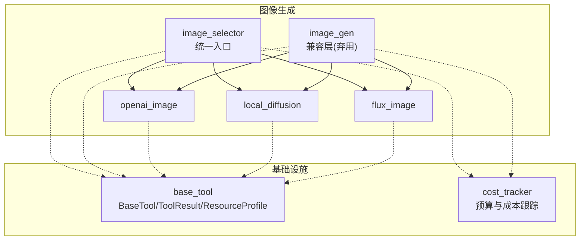
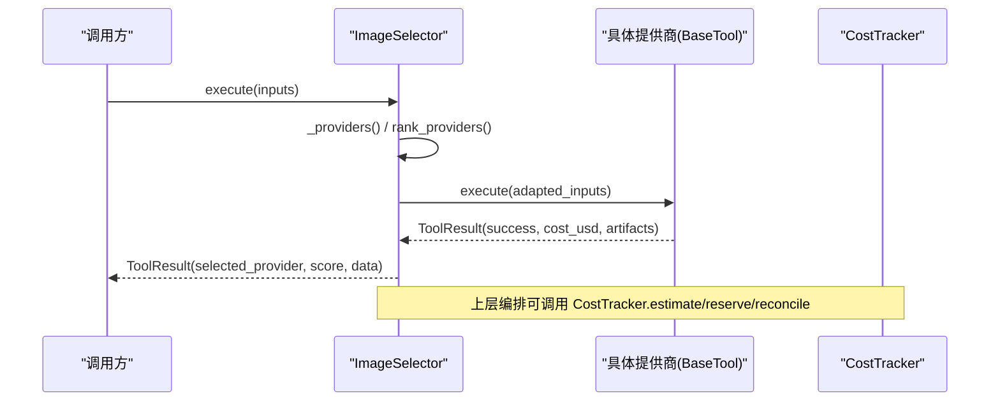
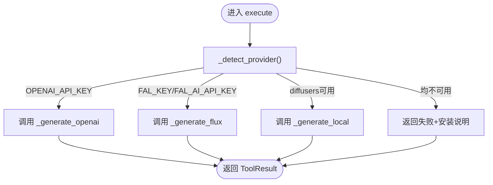
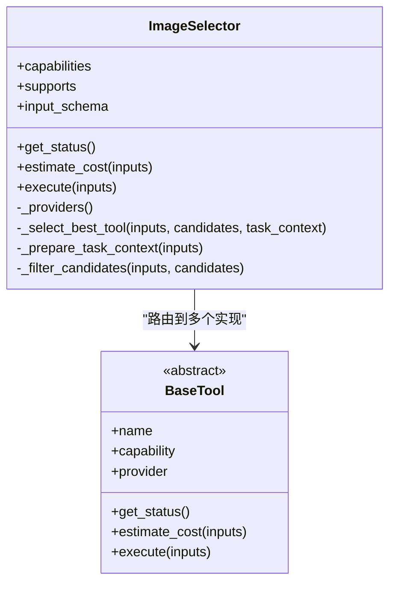
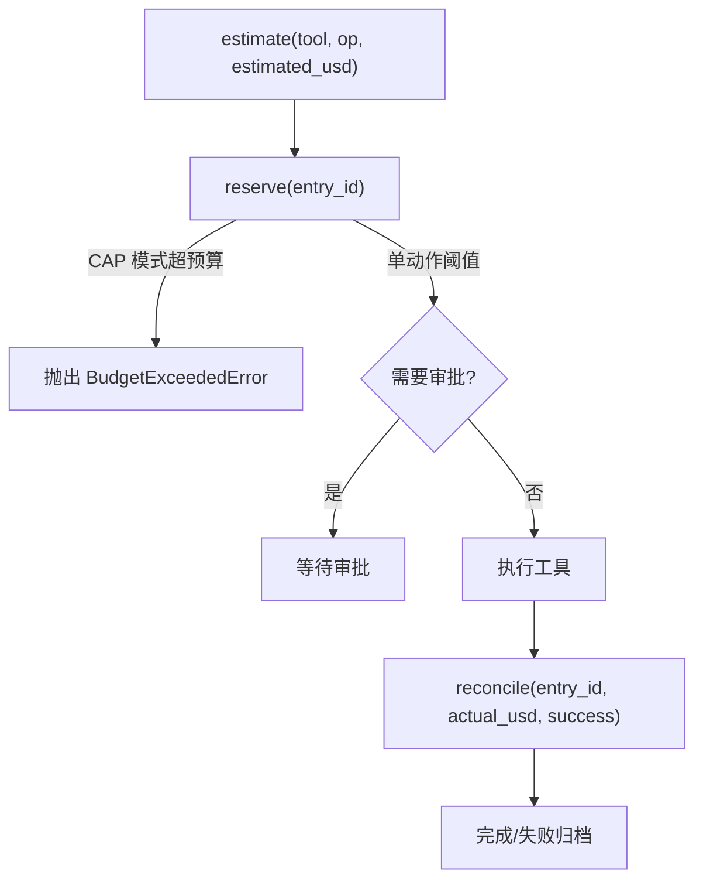
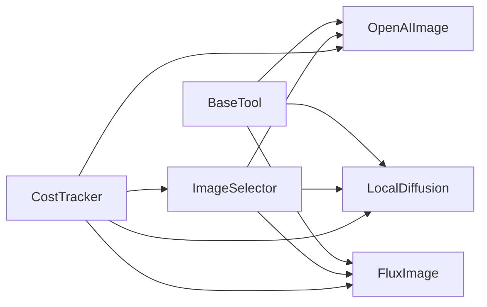

# 图像生成基类设计

<cite>
**本文引用的文件**
- [tools/graphics/image_gen.py](file://tools/graphics/image_gen.py)
- [tools/base_tool.py](file://tools/base_tool.py)
- [tools/graphics/image_selector.py](file://tools/graphics/image_selector.py)
- [tools/graphics/openai_image.py](file://tools/graphics/openai_image.py)
- [tools/graphics/local_diffusion.py](file://tools/graphics/local_diffusion.py)
- [tools/cost_tracker.py](file://tools/cost_tracker.py)
</cite>

## 目录
1. [简介](#简介)
2. [项目结构](#项目结构)
3. [核心组件](#核心组件)
4. [架构总览](#架构总览)
5. [详细组件分析](#详细组件分析)
6. [依赖关系分析](#依赖关系分析)
7. [性能考量](#性能考量)
8. [故障排查指南](#故障排查指南)
9. [结论](#结论)
10. [附录](#附录)

## 简介
本技术文档聚焦于 OpenMontage 的图像生成基类与多提供商抽象架构，围绕 ImageGen 的设计模式展开，系统阐述：
- 多提供商抽象与自动检测（OpenAI API Key、Fal.ai 配置、本地 Diffusers）
- 参数标准化与统一接口
- 错误处理与重试策略
- 成本估算与预算控制
- 工具状态管理与可用性检查
- 扩展机制与最佳实践

目标是帮助开发者理解统一的图像生成接口设计与扩展方式，并在实际项目中高效集成。

## 项目结构
OpenMontage 将“图像生成”能力拆分为：
- 统一选择器：ImageSelector，负责发现、评分与路由到具体提供商工具
- 具体提供商实现：如 OpenAIImage、LocalDiffusion、FluxImage 等
- 基类与通用设施：BaseTool、CostTracker、工具注册表等
- 历史兼容层：ImageGen（已弃用，保留向后兼容）

图表来源
- [tools/graphics/image_selector.py:15-23](file://tools/graphics/image_selector.py#L15-L23)
- [tools/graphics/image_gen.py:37-47](file://tools/graphics/image_gen.py#L37-L47)
- [tools/base_tool.py:110-139](file://tools/base_tool.py#L110-L139)
- [tools/cost_tracker.py:40-97](file://tools/cost_tracker.py#L40-L97)

章节来源
- [tools/graphics/image_selector.py:1-467](file://tools/graphics/image_selector.py#L1-L467)
- [tools/graphics/image_gen.py:1-280](file://tools/graphics/image_gen.py#L1-L280)
- [tools/base_tool.py:1-481](file://tools/base_tool.py#L1-L481)
- [tools/cost_tracker.py:1-524](file://tools/cost_tracker.py#L1-L524)

## 核心组件
- BaseTool：所有工具的抽象基类，定义执行契约、资源画像、重试策略、幂等键、状态报告、成本估算等
- ImageSelector：能力级图像选择器，自动发现并评分路由到具体提供商
- ImageGen：历史兼容层，内部按环境变量自动检测 provider 并调用对应实现
- OpenAIImage：基于 OpenAI GPT Image 的云端生成
- LocalDiffusion：基于 diffusers 的本地 Stable Diffusion 生成
- CostTracker：预算估算、预留、核销与持久化

章节来源
- [tools/base_tool.py:227-397](file://tools/base_tool.py#L227-L397)
- [tools/graphics/image_selector.py:15-210](file://tools/graphics/image_selector.py#L15-L210)
- [tools/graphics/image_gen.py:37-153](file://tools/graphics/image_gen.py#L37-L153)
- [tools/graphics/openai_image.py:25-125](file://tools/graphics/openai_image.py#L25-L125)
- [tools/graphics/local_diffusion.py:23-97](file://tools/graphics/local_diffusion.py#L23-L97)
- [tools/cost_tracker.py:40-179](file://tools/cost_tracker.py#L40-L179)

## 架构总览
OpenMontage 采用“选择器 + 提供商”的多提供商抽象架构：
- 选择器通过工具注册表发现所有 capability="image_generation" 的工具
- 根据任务上下文对候选工具进行评分排序，结合用户偏好与约束选择最优提供商
- 输入参数在 selector 中做标准化适配，再转发给具体提供商
- 每个提供商独立实现 get_status、estimate_cost、execute 等契约方法
- 成本由 CostTracker 统一管理，支持估算、预留、超支拦截与事后核销

图表来源
- [tools/graphics/image_selector.py:218-332](file://tools/graphics/image_selector.py#L218-L332)
- [tools/base_tool.py:374-397](file://tools/base_tool.py#L374-L397)
- [tools/cost_tracker.py:101-179](file://tools/cost_tracker.py#L101-L179)

## 详细组件分析

### ImageGen：兼容层与自动检测
- 角色定位：向后兼容的单体工具，内部按环境变量自动检测 provider（openai、flux、local），并委派到对应实现
- 自动检测逻辑：
  - OPENAI_API_KEY 存在 → openai
  - FAL_KEY 或 FAL_AI_API_KEY 存在 → flux
  - 否则尝试 import diffusers → local
- 成本估算：不同 provider 返回固定单价（openai 约 0.053，flux 约 0.03，local 为 0）
- 错误处理：未检测到可用 provider 时返回失败结果并附带安装指引

图表来源
- [tools/graphics/image_gen.py:109-153](file://tools/graphics/image_gen.py#L109-L153)

章节来源
- [tools/graphics/image_gen.py:37-153](file://tools/graphics/image_gen.py#L37-L153)

### ImageSelector：统一入口与智能路由
- 自动发现：从工具注册表中获取 capability="image_generation" 的所有工具
- 评分与选择：基于任务上下文对候选工具评分，支持 preferred_provider 与 allowed_providers 过滤
- 参数标准化：
  - 将 selector 的 prompt 映射为 stock 工具的 query
  - 将多种图片引用字段（image_path/url(s)）归一化为 images 数组
  - 将 model_name 映射为 model（若目标工具接受）
  - 剥离 selector 专属字段（preferred_provider、allowed_providers 等）
- 自定义工作流：当提供 workflow_json/workflow_path 且 output_node 时，仅路由到支持 custom_workflow 且可达的提供商
- 状态聚合：只要任一提供商可用，selector 即标记为 AVAILABLE

图表来源
- [tools/graphics/image_selector.py:15-210](file://tools/graphics/image_selector.py#L15-L210)
- [tools/base_tool.py:227-397](file://tools/base_tool.py#L227-L397)

章节来源
- [tools/graphics/image_selector.py:185-467](file://tools/graphics/image_selector.py#L185-L467)

### OpenAIImage：云端图像生成
- 环境要求：需设置 OPENAI_API_KEY
- 参数：model、size、quality、output_format、n、output_path
- 成本估算：按 quality 与 n 计算单价×数量
- 执行流程：调用 OpenAI images.generate，解码 b64 写入文件，返回输出路径列表
- 状态检查：存在 OPENAI_API_KEY 即 AVAILABLE

章节来源
- [tools/graphics/openai_image.py:25-184](file://tools/graphics/openai_image.py#L25-L184)

### LocalDiffusion：本地扩散模型生成
- 环境要求：安装 diffusers、transformers、accelerate、torch；优先使用 CUDA
- 参数：prompt、negative_prompt、width、height、model、seed、num_inference_steps、guidance_scale、output_path
- 成本估算：本地免费（0）
- 执行流程：加载模型管道，构造 generator（可选 seed），推理并保存图像
- 状态检查：import diffusers 成功即 AVAILABLE

章节来源
- [tools/graphics/local_diffusion.py:23-160](file://tools/graphics/local_diffusion.py#L23-L160)

### FluxImage：fal.ai 云端生成（补充）
- 环境要求：设置 FAL_KEY 或 FAL_AI_API_KEY
- 参数：prompt、negative_prompt、width、height、model、seed、num_inference_steps、guidance_scale、output_path
- 成本估算：按模型与请求计费（各提供商定价不同）
- 状态检查：存在密钥即 AVAILABLE

章节来源
- [tools/graphics/flux_image.py:55-89](file://tools/graphics/flux_image.py#L55-L89)

### CostTracker：成本估算与预算控制
- 功能：记录 estimate → reserve → reconcile/refund 的生命周期，支持 CAP/WARN/OBSERVE 模式
- 预算保护：
  - 单动作阈值审批：超过阈值需人工批准
  - 新付费工具首次使用需批准
  - CAP 模式下超预算直接拒绝
- 参考驱动估算：基于视频分析简报与目标时长，估算场景数、图像/视频片段数、TTS 字数等，给出分项成本与置信度

图表来源
- [tools/cost_tracker.py:101-179](file://tools/cost_tracker.py#L101-L179)

章节来源
- [tools/cost_tracker.py:40-179](file://tools/cost_tracker.py#L40-L179)
- [tools/cost_tracker.py:181-398](file://tools/cost_tracker.py#L181-L398)

## 依赖关系分析
- BaseTool 是所有工具的基础，定义了统一的执行契约、资源画像、重试策略、幂等键、状态报告与成本估算
- ImageSelector 依赖工具注册表动态发现 providers，并通过评分函数选择最优实现
- 各提供商工具依赖各自的外部依赖（OpenAI SDK、fal.ai 客户端、diffusers/torch 等）
- CostTracker 与编排层协作，对付费操作进行事前估算与预留、事后核销

图表来源
- [tools/base_tool.py:227-397](file://tools/base_tool.py#L227-L397)
- [tools/graphics/image_selector.py:185-210](file://tools/graphics/image_selector.py#L185-L210)
- [tools/cost_tracker.py:40-179](file://tools/cost_tracker.py#L40-L179)

章节来源
- [tools/base_tool.py:227-397](file://tools/base_tool.py#L227-L397)
- [tools/graphics/image_selector.py:185-210](file://tools/graphics/image_selector.py#L185-L210)
- [tools/cost_tracker.py:40-179](file://tools/cost_tracker.py#L40-L179)

## 性能考量
- 本地 GPU 加速：LocalDiffusion 优先使用 CUDA 与 float16 降低显存占用并提升速度
- 网络与超时：云端提供商调用设置合理超时，避免长时间阻塞
- 批处理与复用：OpenAIImage 支持一次请求多张图（n>1），减少往返开销
- 缓存与幂等：BaseTool 提供 idempotency_key_fields，便于上层缓存相同输入的结果
- 资源画像：ResourceProfile 声明 CPU/RAM/VRAM/Disk/Network，辅助调度与容量规划

[本节为通用指导，不直接分析具体文件]

## 故障排查指南
- 无可用提供商：
  - 现象：ImageGen 返回失败并提示安装说明
  - 处理：设置 OPENAI_API_KEY 或 FAL_KEY/FAL_AI_API_KEY，或安装 diffusers
  - 参考：[tools/graphics/image_gen.py:109-153](file://tools/graphics/image_gen.py#L109-L153)
- 缺少 API Key：
  - 现象：OpenAIImage 或 FluxImage 执行失败
  - 处理：确保环境变量正确设置
  - 参考：[tools/graphics/openai_image.py:113-131](file://tools/graphics/openai_image.py#L113-L131)、[tools/graphics/flux_image.py:83-89](file://tools/graphics/flux_image.py#L83-L89)
- 本地依赖缺失：
  - 现象：LocalDiffusion 无法导入 diffusers
  - 处理：安装 diffusers、transformers、accelerate、torch
  - 参考：[tools/graphics/local_diffusion.py:85-103](file://tools/graphics/local_diffusion.py#L85-L103)
- 预算超限：
  - 现象：CostTracker.reserve 抛出 BudgetExceededError
  - 处理：调整预算、降低单次预估成本或切换更便宜提供商
  - 参考：[tools/cost_tracker.py:117-157](file://tools/cost_tracker.py#L117-L157)

章节来源
- [tools/graphics/image_gen.py:109-153](file://tools/graphics/image_gen.py#L109-L153)
- [tools/graphics/openai_image.py:113-131](file://tools/graphics/openai_image.py#L113-L131)
- [tools/graphics/flux_image.py:83-89](file://tools/graphics/flux_image.py#L83-L89)
- [tools/graphics/local_diffusion.py:85-103](file://tools/graphics/local_diffusion.py#L85-L103)
- [tools/cost_tracker.py:117-157](file://tools/cost_tracker.py#L117-L157)

## 结论
OpenMontage 通过 BaseTool 的统一契约与 ImageSelector 的智能路由，实现了跨提供商的图像生成能力抽象。ImageGen 作为兼容层提供了便捷的自动检测与快速上手体验。配合 CostTracker 的成本与预算治理，使得生产环境中的资源消耗可控、可审计、可扩展。开发者只需遵循 BaseTool 契约，即可轻松接入新的图像生成提供商，并享受统一的参数标准化、状态管理、错误处理与成本估算能力。

[本节为总结性内容，不直接分析具体文件]

## 附录

### 提供商自动检测逻辑对照
- OpenAI：检测 OPENAI_API_KEY
- Fal.ai：检测 FAL_KEY 或 FAL_AI_API_KEY
- 本地 Diffusers：尝试 import diffusers

章节来源
- [tools/graphics/image_gen.py:109-119](file://tools/graphics/image_gen.py#L109-L119)

### 成本估算算法要点
- 单工具维度：OpenAIImage 按 quality×n 计价；LocalDiffusion 免费；FluxImage 按模型与请求计费
- 项目维度：CostTracker 支持 estimate/reserve/reconcile，CAP/WARN/OBSERVE 三种模式，单动作阈值与新付费工具审批
- 参考驱动估算：基于视频分析简报估算场景数、图像/视频片段数、TTS 字数，给出分项成本与置信度

章节来源
- [tools/graphics/openai_image.py:118-125](file://tools/graphics/openai_image.py#L118-L125)
- [tools/graphics/local_diffusion.py:92-97](file://tools/graphics/local_diffusion.py#L92-L97)
- [tools/cost_tracker.py:101-179](file://tools/cost_tracker.py#L101-L179)
- [tools/cost_tracker.py:181-398](file://tools/cost_tracker.py#L181-L398)

### 工具状态管理机制
- BaseTool.get_status：默认检查 dependencies（env/python/cmd/binary）
- 提供商覆盖：OpenAIImage/LocalDiffusion/FluxImage 分别实现 get_status，依据环境或依赖可用性返回 AVAILABLE/UNAVAILABLE
- Selector 聚合：只要任一提供商可用，selector 即标记为 AVAILABLE

章节来源
- [tools/base_tool.py:296-328](file://tools/base_tool.py#L296-L328)
- [tools/graphics/openai_image.py:113-116](file://tools/graphics/openai_image.py#L113-L116)
- [tools/graphics/local_diffusion.py:85-90](file://tools/graphics/local_diffusion.py#L85-L90)
- [tools/graphics/flux_image.py:86-89](file://tools/graphics/flux_image.py#L86-L89)
- [tools/graphics/image_selector.py:206-209](file://tools/graphics/image_selector.py#L206-L209)