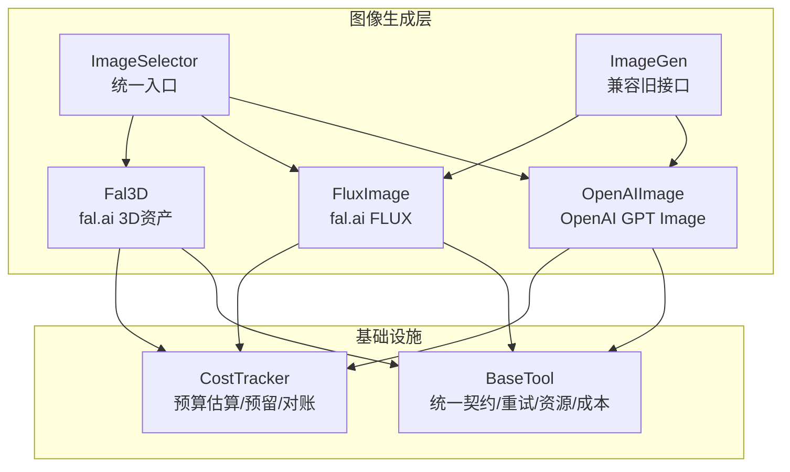
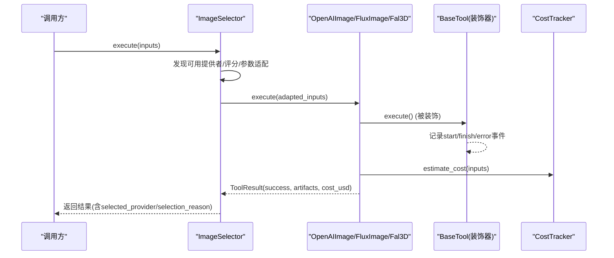
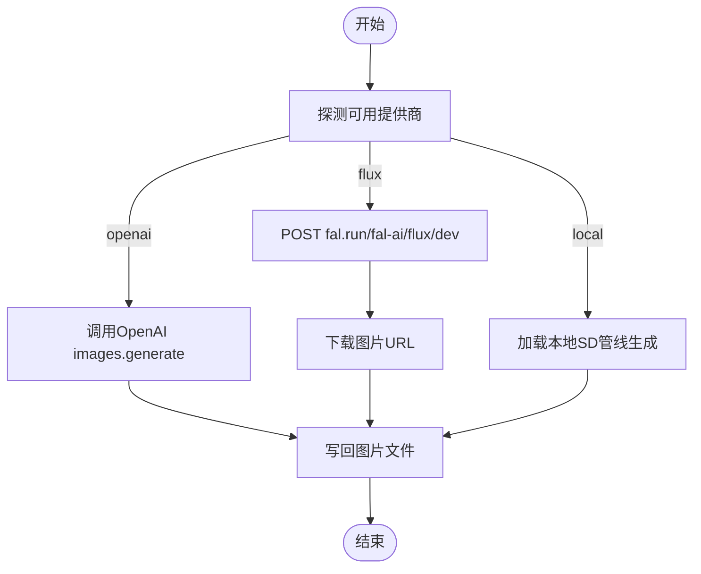
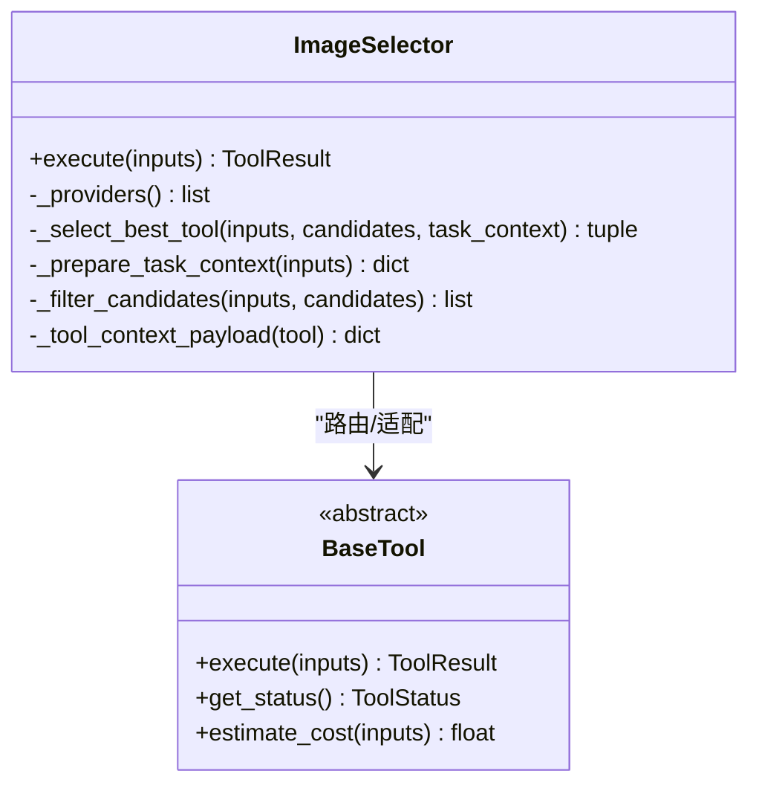
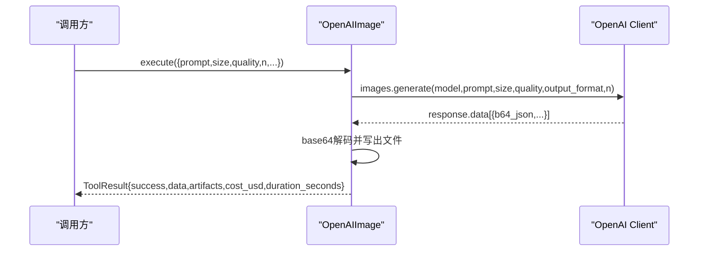
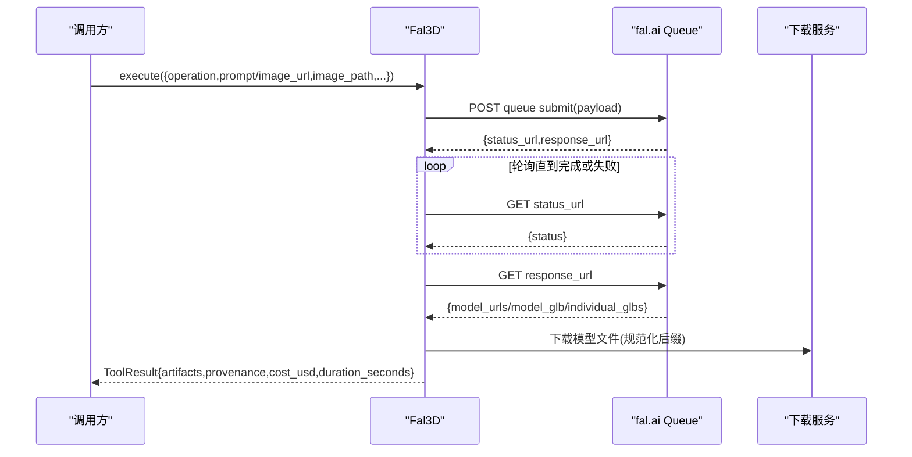
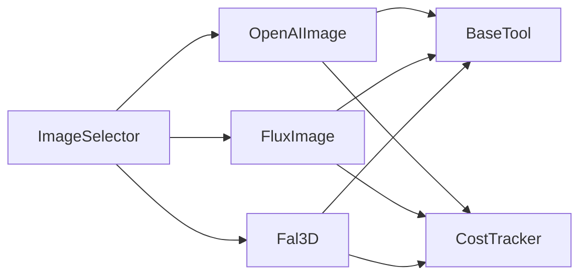

# 图像生成工具示例

<cite>
**本文引用的文件**
- [tools/base_tool.py](file://tools/base_tool.py)
- [tools/graphics/image_gen.py](file://tools/graphics/image_gen.py)
- [tools/graphics/image_selector.py](file://tools/graphics/image_selector.py)
- [tools/graphics/openai_image.py](file://tools/graphics/openai_image.py)
- [tools/graphics/fal_3d.py](file://tools/graphics/fal_3d.py)
- [tools/graphics/flux_image.py](file://tools/graphics/flux_image.py)
- [tools/cost_tracker.py](file://tools/cost_tracker.py)
</cite>

## 目录
1. [简介](#简介)
2. [项目结构](#项目结构)
3. [核心组件](#核心组件)
4. [架构总览](#架构总览)
5. [详细组件分析](#详细组件分析)
6. [依赖关系分析](#依赖关系分析)
7. [性能与成本优化](#性能与成本优化)
8. [故障排查指南](#故障排查指南)
9. [结论](#结论)
10. [附录](#附录)

## 简介
本文件面向OpenMontage的图像生成子系统，系统性梳理并解释以下关键主题：
- ImageGen基类的设计模式（多提供商抽象、参数标准化、错误重试机制）
- OpenAI图像生成的API调用流程（认证配置、请求构建、响应解析、成本控制）
- Fal.ai 3D图像生成的特殊处理逻辑（任务提交与轮询、模型下载、纹理与PBR输出、可追溯性）
- 图像质量评估与质量控制（分辨率检测、格式验证、元数据提取等）
- 各工具实现的集成要点（API密钥、参数说明、错误策略、性能技巧）

该文档既适合快速上手，也提供深入的技术细节与可视化图示。

## 项目结构
OpenMontage将“图像生成”能力以工具（Tool）的形式组织，遵循统一的BaseTool契约，并通过选择器进行路由与适配。

图表来源
- [tools/graphics/image_selector.py:15-210](file://tools/graphics/image_selector.py#L15-L210)
- [tools/graphics/openai_image.py:25-184](file://tools/graphics/openai_image.py#L25-L184)
- [tools/graphics/flux_image.py:24-165](file://tools/graphics/flux_image.py#L24-L165)
- [tools/graphics/fal_3d.py:52-214](file://tools/graphics/fal_3d.py#L52-L214)
- [tools/base_tool.py:227-398](file://tools/base_tool.py#L227-L398)
- [tools/cost_tracker.py:40-179](file://tools/cost_tracker.py#L40-L179)

章节来源
- [tools/graphics/image_selector.py:1-210](file://tools/graphics/image_selector.py#L1-L210)
- [tools/base_tool.py:227-398](file://tools/base_tool.py#L227-L398)

## 核心组件
- BaseTool：所有工具的抽象基类，定义执行契约、状态报告、资源画像、重试策略、幂等键、副作用声明、用户可见校验提示、质量评分等。
- ImageSelector：能力级选择器，自动发现具备“image_generation”能力的工具，按任务上下文评分选择最佳提供者，并做参数适配与透传。
- ImageGen：向后兼容的多提供商聚合工具，内部根据环境变量或本地库可用性选择openai/flux/local。
- OpenAIImage：OpenAI GPT Image（gpt-image-2）专用实现，支持多尺寸、质量等级、输出格式、批量出图与成本估算。
- FluxImage：fal.ai FLUX图像生成实现，支持负向提示、种子、推理步数、引导系数等。
- Fal3D：fal.ai 3D资产生成（文本到3D、图像到3D、对象重建），异步队列+轮询，下载GLB/OBJ等，写入溯源JSON。
- CostTracker：预算估算、预留、对账、持久化，支持警告/封顶/观察模式及单动作审批阈值。

章节来源
- [tools/base_tool.py:227-398](file://tools/base_tool.py#L227-L398)
- [tools/graphics/image_selector.py:15-210](file://tools/graphics/image_selector.py#L15-L210)
- [tools/graphics/image_gen.py:37-153](file://tools/graphics/image_gen.py#L37-L153)
- [tools/graphics/openai_image.py:25-184](file://tools/graphics/openai_image.py#L25-L184)
- [tools/graphics/flux_image.py:24-165](file://tools/graphics/flux_image.py#L24-L165)
- [tools/graphics/fal_3d.py:52-214](file://tools/graphics/fal_3d.py#L52-L214)
- [tools/cost_tracker.py:40-179](file://tools/cost_tracker.py#L40-L179)

## 架构总览
下图展示了从选择器到具体提供商的执行流，以及成本跟踪与事件埋点的协作方式。

图表来源
- [tools/graphics/image_selector.py:218-332](file://tools/graphics/image_selector.py#L218-L332)
- [tools/base_tool.py:148-224](file://tools/base_tool.py#L148-L224)
- [tools/graphics/openai_image.py:126-184](file://tools/graphics/openai_image.py#L126-L184)
- [tools/graphics/flux_image.py:97-165](file://tools/graphics/flux_image.py#L97-L165)
- [tools/graphics/fal_3d.py:113-214](file://tools/graphics/fal_3d.py#L113-L214)
- [tools/cost_tracker.py:101-179](file://tools/cost_tracker.py#L101-L179)

## 详细组件分析

### ImageGen（向后兼容的多提供商聚合）
- 设计要点
  - 通过环境变量或本地库动态探测可用提供商（openai/flux/local）。
  - 统一输入schema（prompt、negative_prompt、width/height、provider、model、seed、output_path）。
  - 成本估算：按provider与模型给出近似单价；本地为0。
  - 错误处理：无可用提供商时返回明确错误与安装指引；异常捕获后包装为失败结果。
  - 幂等键：基于prompt/宽高/seed，便于缓存去重。
- 执行路径
  - openai：构造size字符串，调用images.generate，解码b64落盘。
  - flux：POST fal.run/fal-ai/flux/dev，获取图片URL再下载落盘。
  - local：使用StableDiffusionPipeline，按设备与精度加载，生成并保存。

图表来源
- [tools/graphics/image_gen.py:103-153](file://tools/graphics/image_gen.py#L103-L153)
- [tools/graphics/image_gen.py:155-280](file://tools/graphics/image_gen.py#L155-L280)

章节来源
- [tools/graphics/image_gen.py:37-153](file://tools/graphics/image_gen.py#L37-L153)
- [tools/graphics/image_gen.py:155-280](file://tools/graphics/image_gen.py#L155-L280)

### ImageSelector（统一入口与参数适配）
- 自动发现：扫描registry中capability="image_generation"的工具。
- 评分选择：基于任务上下文（prompt、operation、是否编辑模式等）与工具best_for/supports进行排序。
- 参数适配：将selector的统一字段（如query/prompt、images数组、model_name/model、n/num_images等）映射到下游工具的input_schema。
- 自定义工作流：当传入workflow_json/workflow_path且目标工具支持custom_workflow时，仅路由到可达的后端。
- 结果增强：返回selected_tool、selected_provider、selection_reason、alternatives_considered等。

图表来源
- [tools/graphics/image_selector.py:15-210](file://tools/graphics/image_selector.py#L15-L210)
- [tools/graphics/image_selector.py:218-467](file://tools/graphics/image_selector.py#L218-L467)
- [tools/base_tool.py:227-398](file://tools/base_tool.py#L227-L398)

章节来源
- [tools/graphics/image_selector.py:15-210](file://tools/graphics/image_selector.py#L15-L210)
- [tools/graphics/image_selector.py:218-467](file://tools/graphics/image_selector.py#L218-L467)

### OpenAI图像生成（OpenAIImage）
- 认证配置：读取OPENAI_API_KEY；未设置则直接返回不可用错误。
- 请求构建：model=gpt-image-2，size支持多种预设，quality支持low/medium/high/auto，output_format支持png/jpeg/webp，n支持1-4。
- 响应解析：base64解码多个输出，按数量生成带序号的文件名，避免覆盖。
- 成本控制：按quality与n计算cost_usd；高质量非正方形略便宜。
- 错误处理：捕获异常并返回失败结果；空输出时提示无图像。

图表来源
- [tools/graphics/openai_image.py:25-184](file://tools/graphics/openai_image.py#L25-L184)

章节来源
- [tools/graphics/openai_image.py:25-184](file://tools/graphics/openai_image.py#L25-L184)

### Fal.ai 3D图像生成（Fal3D）
- 操作类型：text_to_3d、image_to_3d、reconstruct_objects。
- 认证与提交：从环境变量取FAL_KEY/FAL_AI_API_KEY，POST到queue.fal.run/{model}，获得status_url与response_url。
- 轮询等待：循环查询status_url直至COMPLETED/FAILED/CANCELLED或超时。
- 结果下载：根据operation从返回结构中收集模型文件信息（glb/obj等），统一后缀规范化后下载。
- 可追溯性：写入.provenance.json，包含provider、model、request_id、operation、prompt、metadata、source_url、outputs。
- 成本估算：reconstruct_objects固定单价；其他按enable_pbr开关增加费用。

图表来源
- [tools/graphics/fal_3d.py:52-214](file://tools/graphics/fal_3d.py#L52-L214)

章节来源
- [tools/graphics/fal_3d.py:52-214](file://tools/graphics/fal_3d.py#L52-L214)

### FLUX图像生成（FluxImage）
- 认证：读取FAL_KEY/FAL_AI_API_KEY。
- 请求构建：支持negative_prompt、seed、num_inference_steps、guidance_scale、自定义宽高。
- 响应解析：从images[0].url下载图片并落盘。
- 成本估算：pro系列与dev系列不同单价。

章节来源
- [tools/graphics/flux_image.py:24-165](file://tools/graphics/flux_image.py#L24-L165)

### 基础能力与重试机制（BaseTool）
- 重试策略：每个工具可声明RetryPolicy（max_retries、backoff_seconds、retryable_errors），由上层编排触发重试。
- 资源画像：CPU/RAM/VRAM/Disk/Network需求，便于调度与配额控制。
- 幂等键：基于idempotency_key_fields计算哈希，用于缓存与去重。
- 事件埋点：execute被装饰后自动记录start/finish/error事件，供看板与审计使用。
- 依赖检查：支持env:/cmd:/binary:/python:模块依赖校验。

章节来源
- [tools/base_tool.py:120-127](file://tools/base_tool.py#L120-L127)
- [tools/base_tool.py:148-224](file://tools/base_tool.py#L148-L224)
- [tools/base_tool.py:304-398](file://tools/base_tool.py#L304-L398)

## 依赖关系分析
- 组件耦合
  - ImageSelector强依赖BaseTool契约与工具注册表，弱依赖具体提供商实现。
  - OpenAIImage/FluxImage/Fal3D均继承BaseTool，复用重试、资源、成本、事件等横切能力。
  - CostTracker独立于工具，通过工具返回的cost_usd进行对账。
- 外部依赖
  - OpenAI SDK（OpenAIImage）
  - requests（FluxImage、Fal3D）
  - diffusers/torch（ImageGen local分支）
- 潜在循环依赖
  - 选择器与工具之间通过接口解耦，无直接循环导入。

图表来源
- [tools/graphics/image_selector.py:185-210](file://tools/graphics/image_selector.py#L185-L210)
- [tools/graphics/openai_image.py:25-184](file://tools/graphics/openai_image.py#L25-L184)
- [tools/graphics/flux_image.py:24-165](file://tools/graphics/flux_image.py#L24-L165)
- [tools/graphics/fal_3d.py:52-214](file://tools/graphics/fal_3d.py#L52-L214)
- [tools/base_tool.py:227-398](file://tools/base_tool.py#L227-L398)
- [tools/cost_tracker.py:40-179](file://tools/cost_tracker.py#L40-L179)

章节来源
- [tools/graphics/image_selector.py:185-210](file://tools/graphics/image_selector.py#L185-L210)
- [tools/base_tool.py:227-398](file://tools/base_tool.py#L227-L398)

## 性能与成本优化
- 性能优化建议
  - 并发与批处理：OpenAIImage支持n>1批量出图，减少往返次数。
  - 超时与重试：为网络请求设置合理timeout；利用RetryPolicy对rate_limit/timeout进行指数退避重试。
  - 本地优先：在满足质量前提下，优先使用本地diffusers以降低延迟与成本。
  - 3D下载优化：Fal3D下载大文件时确保超时与重试，必要时断点续传（可扩展）。
- 成本控制
  - 预估与预留：在调用前调用estimate_cost，结合CostTracker.reserve进行预算预留；CAP模式下超预算直接拒绝。
  - 质量与尺寸权衡：OpenAIImage的quality=auto/low可降低单次成本；非正方形尺寸可能更便宜。
  - 重试缓冲：在规划阶段考虑约30%重试缓冲，避免预算不足导致中断。
  - 对账与审计：每次执行完成后reconcile实际花费，持久化到cost_log.json。

章节来源
- [tools/graphics/openai_image.py:118-125](file://tools/graphics/openai_image.py#L118-L125)
- [tools/graphics/flux_image.py:91-96](file://tools/graphics/flux_image.py#L91-L96)
- [tools/graphics/fal_3d.py:108-112](file://tools/graphics/fal_3d.py#L108-L112)
- [tools/cost_tracker.py:101-179](file://tools/cost_tracker.py#L101-L179)

## 故障排查指南
- 常见问题定位
  - 缺少API密钥：OpenAIImage/FluxImage/Fal3D会在执行前检查环境变量，未设置直接返回错误与安装指引。
  - 网络超时/限流：借助RetryPolicy重试rate_limit/timeout；适当增大timeout与重试次数。
  - 3D任务失败：Fal3D轮询期间若收到FAILED/CANCELLED，抛出运行时错误；检查prompt/image_url与阈值参数。
  - 本地环境缺失：ImageGen local分支需要diffusers/torch等依赖，未安装会导入失败。
- 调试建议
  - 启用日志：关注选择器的参数剥离与适配日志，确认下游工具接收到的参数是否符合其input_schema。
  - 查看事件：BaseTool装饰器记录的start/finish/error可用于定位耗时与失败点。
  - 成本对账：核对cost_usd与实际账单，必要时调整estimate_cost策略。

章节来源
- [tools/graphics/openai_image.py:126-168](file://tools/graphics/openai_image.py#L126-L168)
- [tools/graphics/flux_image.py:97-149](file://tools/graphics/flux_image.py#L97-L149)
- [tools/graphics/fal_3d.py:113-204](file://tools/graphics/fal_3d.py#L113-L204)
- [tools/base_tool.py:148-224](file://tools/base_tool.py#L148-L224)

## 结论
OpenMontage的图像生成子系统通过BaseTool统一契约、ImageSelector智能路由与各提供商专用实现，实现了高内聚、低耦合、可扩展的架构。OpenAI与Fal.ai的集成覆盖了2D图像与3D资产生成，配合CostTracker实现预算治理与可观测性。开发者可按需扩展新提供商，无需改动选择器即可接入生态。

## 附录

### 集成示例与参数说明（摘要）
- OpenAIImage
  - 必需：OPENAI_API_KEY
  - 关键参数：prompt、model（gpt-image-2）、size（1024x1024/1536x1024/1024x1536/auto）、quality（low/medium/high/auto）、output_format（png/jpeg/webp）、n（1-4）、output_path
  - 成本：按quality与n估算
- FluxImage
  - 必需：FAL_KEY或FAL_AI_API_KEY
  - 关键参数：prompt、negative_prompt、width/height、model（flux-pro/v1.1/flux/dev/flux-pro）、seed、num_inference_steps、guidance_scale、output_path
  - 成本：pro与dev不同单价
- Fal3D
  - 必需：FAL_KEY或FAL_AI_API_KEY
  - 关键参数：operation（text_to_3d/image_to_3d/reconstruct_objects）、prompt或image_url/image_path、enable_pbr、export_textured_glb、detection_threshold、poll_timeout_seconds、output_path
  - 成本：reconstruct_objects固定；其他按enable_pbr增减
- ImageGen（兼容）
  - 自动探测：OPENAI_API_KEY/FAL_KEY或本地diffusers
  - 关键参数：prompt、negative_prompt、width/height、provider（openai/flux/local）、model、seed、output_path

章节来源
- [tools/graphics/openai_image.py:56-92](file://tools/graphics/openai_image.py#L56-L92)
- [tools/graphics/flux_image.py:55-81](file://tools/graphics/flux_image.py#L55-L81)
- [tools/graphics/fal_3d.py:80-103](file://tools/graphics/fal_3d.py#L80-L103)
- [tools/graphics/image_gen.py:74-99](file://tools/graphics/image_gen.py#L74-L99)

### 质量评估与质量控制机制（实践建议）
- 分辨率检测：根据输出文件的尺寸与期望规格进行校验，不匹配时触发重新生成或后处理缩放。
- 格式验证：校验输出后缀与MIME类型，确保下游渲染管线可正确消费。
- 元数据提取：从生成结果中提取模型、seed、provider等信息，写入.provenance.json或同级元数据文件，便于追踪与复现。
- 质量评分：结合工具quality_score与历史成功率，辅助选择器决策与后续评估。

章节来源
- [tools/graphics/fal_3d.py:189-201](file://tools/graphics/fal_3d.py#L189-L201)
- [tools/base_tool.py:286-293](file://tools/base_tool.py#L286-L293)