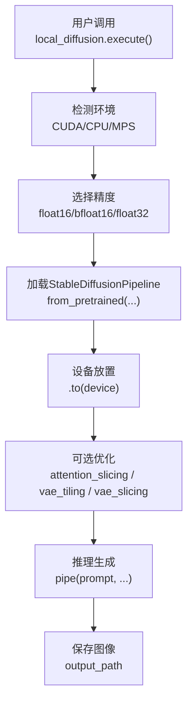
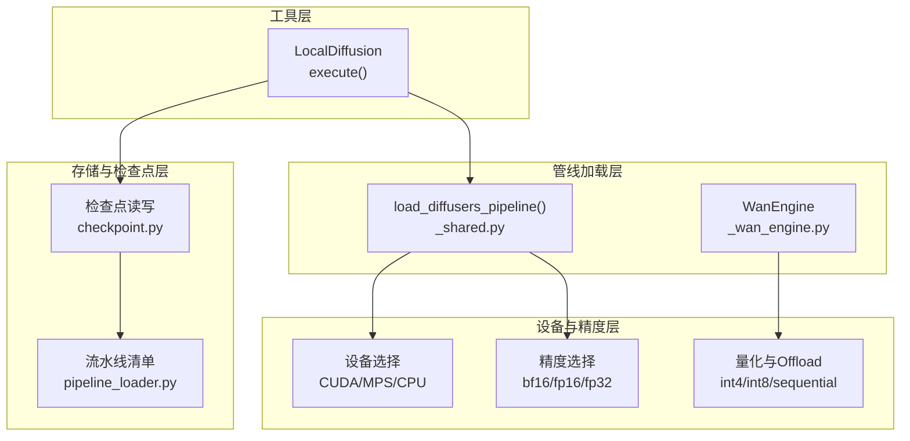
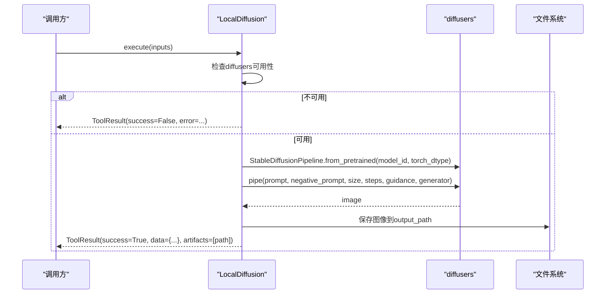
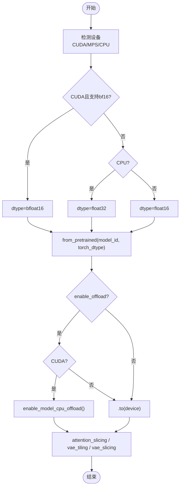
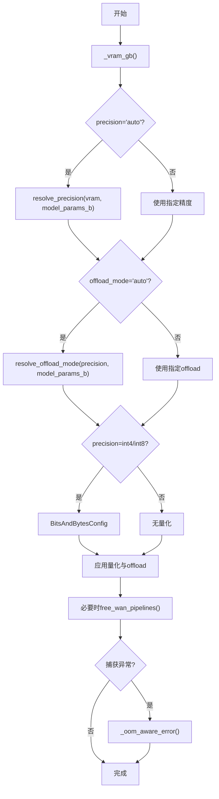
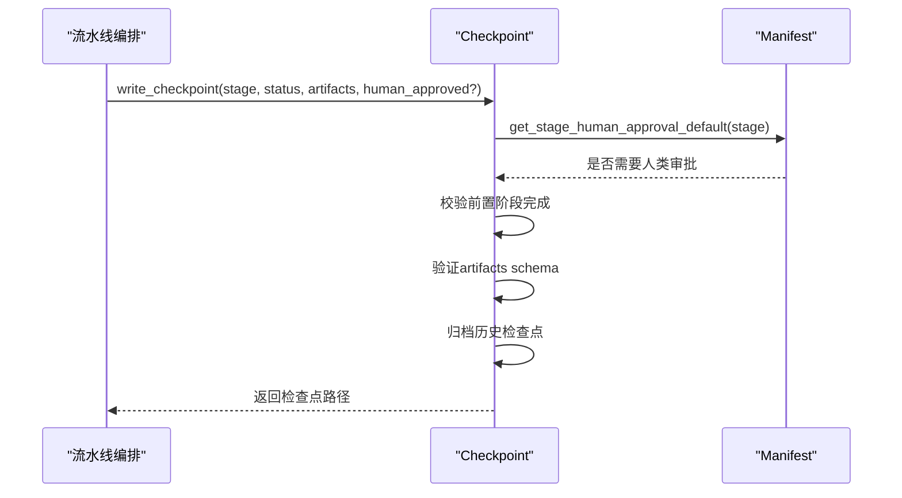
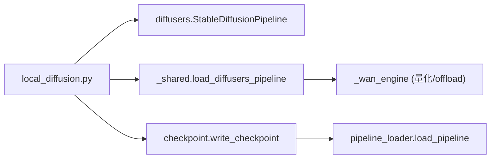

# 本地Diffusion模型生成

<cite>
**本文引用的文件**
- [tools/graphics/local_diffusion.py](file://tools/graphics/local_diffusion.py)
- [tools/video/_shared.py](file://tools/video/_shared.py)
- [tools/video/_wan_engine.py](file://tools/video/_wan_engine.py)
- [lib/checkpoint.py](file://lib/checkpoint.py)
- [lib/pipeline_loader.py](file://lib/pipeline_loader.py)
- [config.yaml](file://config.yaml)
- [requirements-gpu.txt](file://requirements-gpu.txt)
</cite>

## 目录
1. [简介](#简介)
2. [项目结构](#项目结构)
3. [核心组件](#核心组件)
4. [架构总览](#架构总览)
5. [详细组件分析](#详细组件分析)
6. [依赖关系分析](#依赖关系分析)
7. [性能与优化](#性能与优化)
8. [故障排查指南](#故障排查指南)
9. [部署与运行指南](#部署与运行指南)
10. [结论](#结论)

## 简介
本文件面向在本地环境中高效运行Diffusion模型进行图像生成的开发者，聚焦于Stable Diffusion管道的本地部署配置、模型加载与管理、推理优化（半精度、批处理、显存管理）、错误处理与恢复策略，以及完整的部署与监控方案。内容基于仓库中本地Diffusion实现及相关工具链代码进行分析总结，帮助你在GPU/CPU/MPS环境下稳定、可观测地运行图像生成任务。

## 项目结构
- 本地图像生成入口：tools/graphics/local_diffusion.py 提供基于diffusers的Stable Diffusion文本到图像能力，支持负向提示、自定义尺寸、种子控制、离线运行等。
- 通用Diffusers管线加载与优化：tools/video/_shared.py 提供统一的load_diffusers_pipeline函数，封装设备选择、精度选择、注意力切片、VAE分块/切片等优化。
- 高级内存管理与量化：tools/video/_wan_engine.py 提供显存自适应的精度与offload模式选择、量化配置、显存释放、OOM诊断与建议。
- 流水线状态与检查点：lib/checkpoint.py 负责阶段检查点读写、前置条件校验、归档与决策日志合并，保障流程可恢复与可审计。
- 流水线清单加载：lib/pipeline_loader.py 负责YAML清单加载、校验、阶段顺序解析与扩展权限控制。
- 全局配置：config.yaml 定义输出格式、路径、预算与检查点策略等。
- GPU依赖：requirements-gpu.txt 声明torch/torchaudio/torchvision等GPU相关依赖。

**图表来源**
- [tools/graphics/local_diffusion.py:98-159](file://tools/graphics/local_diffusion.py#L98-L159)
- [tools/video/_shared.py:330-372](file://tools/video/_shared.py#L330-L372)

**章节来源**
- [tools/graphics/local_diffusion.py:23-83](file://tools/graphics/local_diffusion.py#L23-L83)
- [tools/video/_shared.py:330-372](file://tools/video/_shared.py#L330-L372)
- [config.yaml:1-34](file://config.yaml#L1-L34)
- [requirements-gpu.txt:1-6](file://requirements-gpu.txt#L1-L6)

## 核心组件
- LocalDiffusion工具
  - 能力：generate_image、text_to_image、negative_prompt、seed、offline、custom_size。
  - 资源需求：CPU 2核、RAM 8GB、VRAM 4GB、磁盘约5GB、无需网络（首次下载权重除外）。
  - 执行模式：同步执行；确定性：seeded；运行时：LOCAL_GPU。
  - 输入参数：prompt、negative_prompt、width、height、model、seed、num_inference_steps、guidance_scale、output_path。
  - 成本估算：0美元；运行时间估计：约30秒（中高端GPU）。
- 通用Diffusers管线加载
  - 自动设备选择（优先CUDA，其次MPS，最后CPU）。
  - 自动精度选择（CUDA+bf16支持则bfloat16，否则float16或float32）。
  - 启用attention slicing、VAE tiling/slicing以降低峰值显存。
- 高级内存与量化（视频管线复用）
  - 根据显存大小自动选择精度（bf16/int8/int4）与offload模式（model/sequential）。
  - 使用BitsAndBytesConfig进行量化，降低权重占用。
  - 显存释放与缓存清理，避免累积占用。
- 检查点与流水线治理
  - 写入阶段检查点，校验前置阶段完成与人类审批门控。
  - 归档历史检查点，维护决策日志，保证可追溯性。
  - 读取最新检查点、获取下一步阶段。

**章节来源**
- [tools/graphics/local_diffusion.py:23-83](file://tools/graphics/local_diffusion.py#L23-L83)
- [tools/video/_shared.py:330-372](file://tools/video/_shared.py#L330-L372)
- [tools/video/_wan_engine.py:101-163](file://tools/video/_wan_engine.py#L101-L163)
- [lib/checkpoint.py:198-564](file://lib/checkpoint.py#L198-L564)
- [lib/pipeline_loader.py:39-70](file://lib/pipeline_loader.py#L39-L70)

## 架构总览
本地Diffusion图像生成由“工具层”、“管线加载层”、“设备与精度层”、“存储与检查点层”组成。LocalDiffusion作为入口，调用diffusers的StableDiffusionPipeline进行推理；通用加载器统一处理设备、精度与优化开关；高级引擎提供量化与offload策略；检查点系统确保流程可恢复与合规。

**图表来源**
- [tools/graphics/local_diffusion.py:98-159](file://tools/graphics/local_diffusion.py#L98-L159)
- [tools/video/_shared.py:330-372](file://tools/video/_shared.py#L330-L372)
- [tools/video/_wan_engine.py:101-163](file://tools/video/_wan_engine.py#L101-L163)
- [lib/checkpoint.py:422-564](file://lib/checkpoint.py#L422-L564)
- [lib/pipeline_loader.py:39-70](file://lib/pipeline_loader.py#L39-L70)

## 详细组件分析

### LocalDiffusion 组件
- 职责：封装Stable Diffusion文本到图像的本地推理，支持负向提示、尺寸定制、种子控制、离线运行。
- 关键流程：
  - 环境检测：检查diffusers是否可用。
  - 设备与精度：优先CUDA并选择float16；否则CPU使用float32。
  - 管线加载：from_pretrained(model_id, torch_dtype=dtype)，移动到设备。
  - 推理：pipe(prompt, negative_prompt, width, height, num_inference_steps, guidance_scale, generator)。
  - 输出：保存到output_path，返回ToolResult包含元数据与耗时。
- 错误处理：捕获异常并返回失败结果，附带错误信息。

**图表来源**
- [tools/graphics/local_diffusion.py:98-159](file://tools/graphics/local_diffusion.py#L98-L159)

**章节来源**
- [tools/graphics/local_diffusion.py:23-83](file://tools/graphics/local_diffusion.py#L23-L83)
- [tools/graphics/local_diffusion.py:98-159](file://tools/graphics/local_diffusion.py#L98-L159)

### 通用Diffusers管线加载（_shared.py）
- 职责：统一加载不同diffusers管线，自动选择设备与精度，启用注意力切片与VAE分块/切片以节省显存。
- 关键点：
  - 设备优先级：CUDA > MPS > CPU。
  - 精度选择：CUDA且支持bf16则bfloat16；CPU强制float32；其他情况float16。
  - 优化开关：enable_attention_slicing、vae.enable_tiling、vae.enable_slicing。
  - Offload：CUDA下可启用model_cpu_offload，非CUDA回退到直接设备放置。

**图表来源**
- [tools/video/_shared.py:330-372](file://tools/video/_shared.py#L330-L372)

**章节来源**
- [tools/video/_shared.py:330-372](file://tools/video/_shared.py#L330-L372)

### 高级内存管理与量化（_wan_engine.py）
- 职责：为大型模型提供显存自适应的精度与offload策略，量化权重，释放显存，诊断OOM并提供建议。
- 关键点：
  - 显存探测：_vram_gb()获取可用显存。
  - 精度选择：resolve_precision根据显存与模型规模选择bf16/int8/int4。
  - Offload模式：resolve_offload_mode根据显存与精度选择model或sequential。
  - 量化配置：BitsAndBytesConfig用于int8/int4量化。
  - 显存释放：free_wan_pipelines()清理缓存并empty_cache。
  - OOM诊断：_oom_aware_error识别驱动不匹配与真实OOM，给出调整建议（分辨率、帧数、offload、精度）。

**图表来源**
- [tools/video/_wan_engine.py:101-163](file://tools/video/_wan_engine.py#L101-L163)
- [tools/video/_wan_engine.py:898-947](file://tools/video/_wan_engine.py#L898-L947)

**章节来源**
- [tools/video/_wan_engine.py:101-163](file://tools/video/_wan_engine.py#L101-L163)
- [tools/video/_wan_engine.py:898-947](file://tools/video/_wan_engine.py#L898-L947)

### 检查点与流水线治理（checkpoint.py & pipeline_loader.py）
- 职责：确保每个阶段完成后写入检查点，校验前置阶段完成与人类审批门控，归档历史，合并决策日志；从YAML清单加载阶段顺序与策略。
- 关键点：
  - 写入检查点：write_checkpoint()校验阶段、状态、人工审批、前置阶段，原子写入并归档历史。
  - 读取检查点：read_checkpoint()与get_latest_checkpoint()。
  - 阶段顺序：get_stage_order()解析manifest中的stages与sub_stages。
  - 人类审批：get_stage_human_approval_default()读取清单配置，checkpoint写入时强制执行。
  - 扩展权限：check_extension_permitted()限制自定义脚本/技能/工具的使用。

**图表来源**
- [lib/checkpoint.py:422-564](file://lib/checkpoint.py#L422-L564)
- [lib/pipeline_loader.py:173-182](file://lib/pipeline_loader.py#L173-L182)

**章节来源**
- [lib/checkpoint.py:198-564](file://lib/checkpoint.py#L198-L564)
- [lib/pipeline_loader.py:39-70](file://lib/pipeline_loader.py#L39-L70)
- [lib/pipeline_loader.py:125-149](file://lib/pipeline_loader.py#L125-L149)

## 依赖关系分析
- 外部依赖：
  - diffusers、transformers、accelerate、torch、pillow、requests（用于参考图像加载）。
  - GPU环境：NVIDIA CUDA或Apple Silicon MPS。
- 内部依赖：
  - LocalDiffusion依赖diffusers的StableDiffusionPipeline。
  - _shared.py提供通用管线加载逻辑，被多个视频/图像工具复用。
  - _wan_engine.py提供高级内存管理，供复杂模型使用。
  - checkpoint.py与pipeline_loader.py为流水线治理提供基础设施。

**图表来源**
- [tools/graphics/local_diffusion.py:98-159](file://tools/graphics/local_diffusion.py#L98-L159)
- [tools/video/_shared.py:330-372](file://tools/video/_shared.py#L330-L372)
- [tools/video/_wan_engine.py:101-163](file://tools/video/_wan_engine.py#L101-L163)
- [lib/checkpoint.py:422-564](file://lib/checkpoint.py#L422-L564)
- [lib/pipeline_loader.py:39-70](file://lib/pipeline_loader.py#L39-L70)

**章节来源**
- [requirements-gpu.txt:1-6](file://requirements-gpu.txt#L1-L6)
- [tools/graphics/local_diffusion.py:35-38](file://tools/graphics/local_diffusion.py#L35-L38)

## 性能与优化
- 半精度计算：
  - CUDA且支持bf16时使用bfloat16；否则float16；CPU使用float32以保证稳定性。
  - 通过load_diffusers_pipeline统一设置torch_dtype。
- 批处理优化：
  - 当前LocalDiffusion单次生成单图；如需批处理，可在上层循环调用并复用已加载的pipeline以减少初始化开销。
  - 注意显存随batch增大而增加，需结合分辨率与步数调优。
- 显存管理：
  - attention_slicing减少注意力计算峰值。
  - VAE tiling/slicing将大图像分块解码，显著降低峰值显存。
  - offload模式：model保持权重常驻；sequential逐模块加载，适合小显存但牺牲带宽。
  - 量化：int8/int4进一步压缩权重，配合bitsandbytes。
  - 显存释放：free_wan_pipelines()清理缓存并empty_cache。
- 资源预估：
  - LocalDiffusion资源轮廓：CPU 2核、RAM 8GB、VRAM 4GB、磁盘约5GB。
  - 运行时间估计：约30秒（中高端GPU），可根据steps与分辨率调整。

[本节为通用指导，不直接分析具体文件]

## 故障排查指南
- 模型加载失败：
  - 检查diffusers是否安装；若未安装，按install_instructions提示安装。
  - 确认网络连接（首次下载权重需要）；离线环境需提前准备模型缓存。
- GPU内存不足（OOM）：
  - 降低分辨率与帧数；减少num_inference_steps。
  - 切换offload_mode为sequential；或降低精度至int8/int4。
  - 启用VAE tiling/slicing与attention_slicing。
  - 使用free_wan_pipelines()释放显存。
- CUDA驱动不匹配：
  - 当错误包含nvmlInit断言时，表示内核与用户态库版本不一致；重启以加载匹配的内核模块，或暂时保持在bf16并降低负载。
- 设备不可用：
  - 若无CUDA/MPS，将回退到CPU，速度较慢但功能正常；可通过环境变量或配置启用本地生成。

**章节来源**
- [tools/graphics/local_diffusion.py:85-103](file://tools/graphics/local_diffusion.py#L85-L103)
- [tools/video/_wan_engine.py:898-947](file://tools/video/_wan_engine.py#L898-L947)
- [tools/video/_shared.py:300-309](file://tools/video/_shared.py#L300-L309)

## 部署与运行指南
- 环境要求：
  - Python环境；GPU推荐NVIDIA CUDA或Apple Silicon MPS；CPU也可运行但较慢。
  - 安装基础依赖：pip install diffusers transformers accelerate torch pillow requests。
  - GPU额外依赖：torch>=2.0、torchaudio>=2.0、torchvision>=0.15。
- 模型配置：
  - 默认模型：stabilityai/stable-diffusion-2-1-base；可通过model参数切换。
  - 首次运行将自动下载权重到缓存目录；后续运行离线可用。
- 运行步骤：
  - 准备输入：prompt、可选negative_prompt、width/height、seed、num_inference_steps、guidance_scale、output_path。
  - 调用LocalDiffusion.execute(inputs)；等待生成完成并保存图像。
- 性能基准测试：
  - 使用不同分辨率、steps、guidance_scale对比生成时间与质量。
  - 记录显存占用变化，评估offload与量化的效果。
- 监控方案：
  - 利用检查点系统记录每阶段状态与产物，便于回溯与审计。
  - 通过ToolResult.duration_seconds与cost_usd统计运行成本与耗时。
  - 结合events.jsonl（如启用）观察实时活动与错误事件。

**章节来源**
- [tools/graphics/local_diffusion.py:35-38](file://tools/graphics/local_diffusion.py#L35-L38)
- [tools/graphics/local_diffusion.py:58-83](file://tools/graphics/local_diffusion.py#L58-L83)
- [requirements-gpu.txt:1-6](file://requirements-gpu.txt#L1-L6)
- [config.yaml:16-34](file://config.yaml#L16-L34)

## 结论
本项目提供了完整且可扩展的本地Diffusion图像生成能力。通过LocalDiffusion工具与通用管线加载器，开发者可以在多种硬件环境下稳定运行Stable Diffusion；借助量化、offload与VAE优化，有效缓解显存压力；检查点与流水线治理保障了流程的可恢复性与合规性。建议在生产环境中结合监控与基准测试，持续优化参数与资源配置，以获得最佳性能与质量平衡。