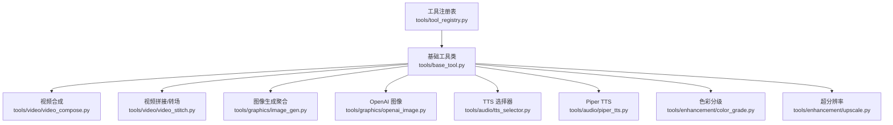
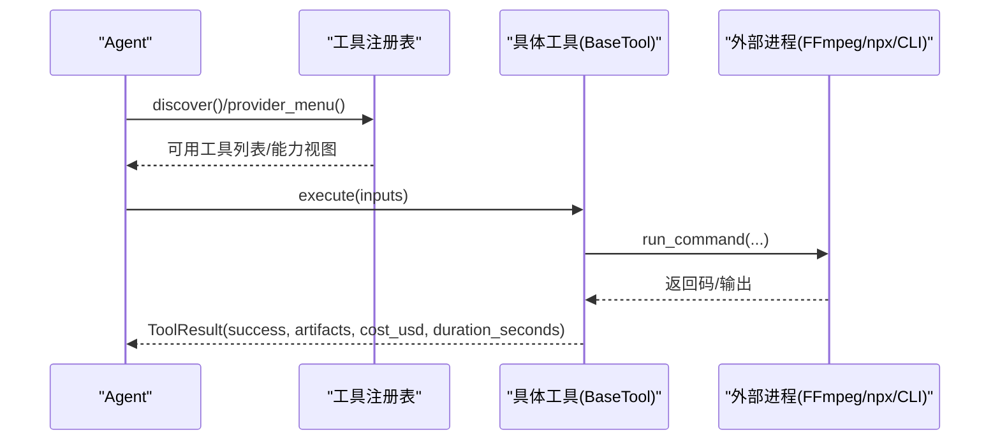
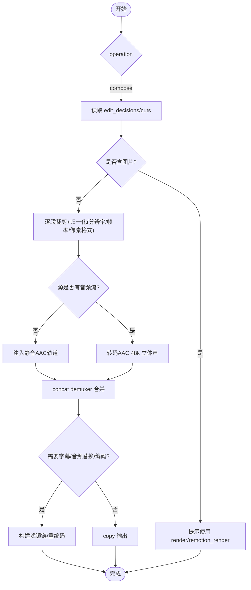
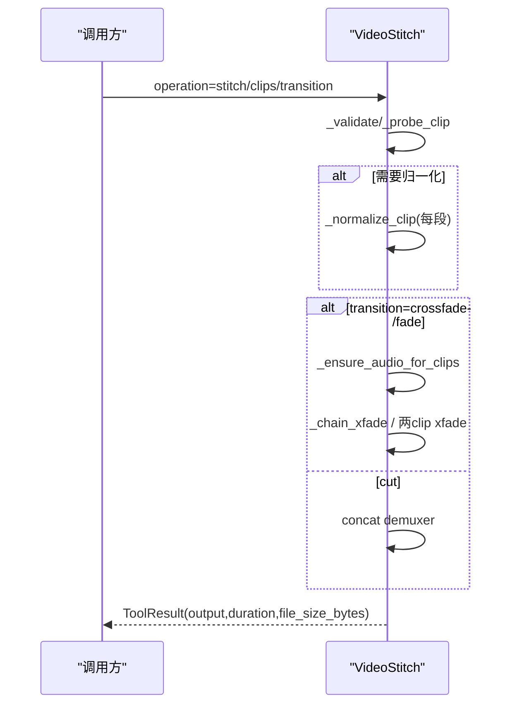
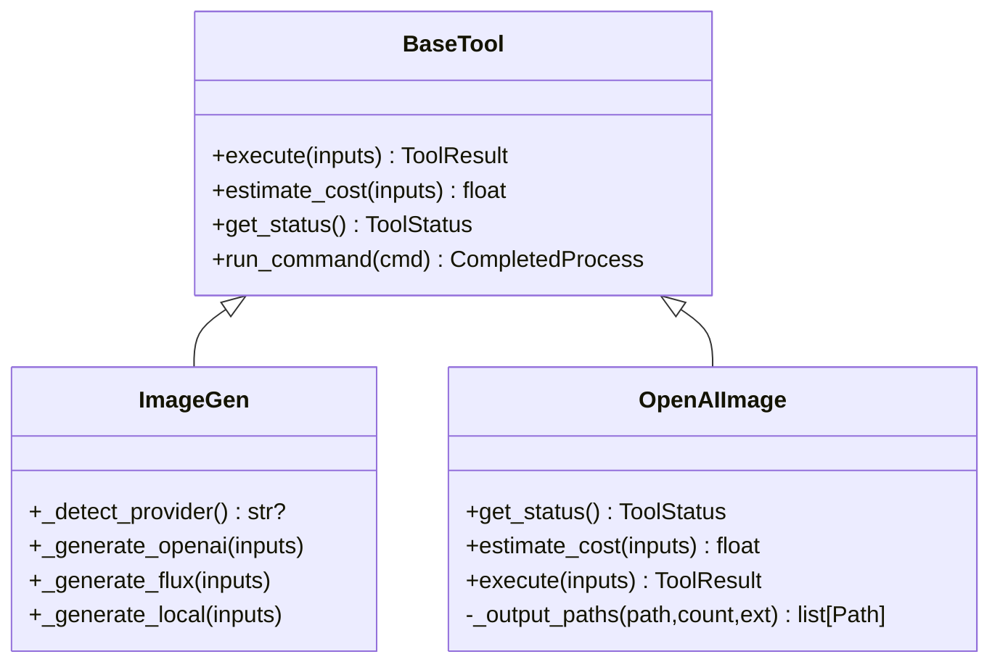
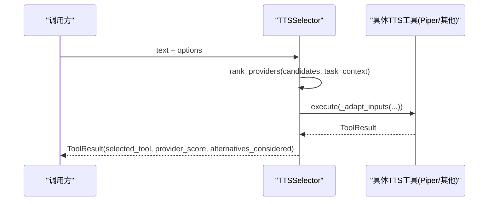
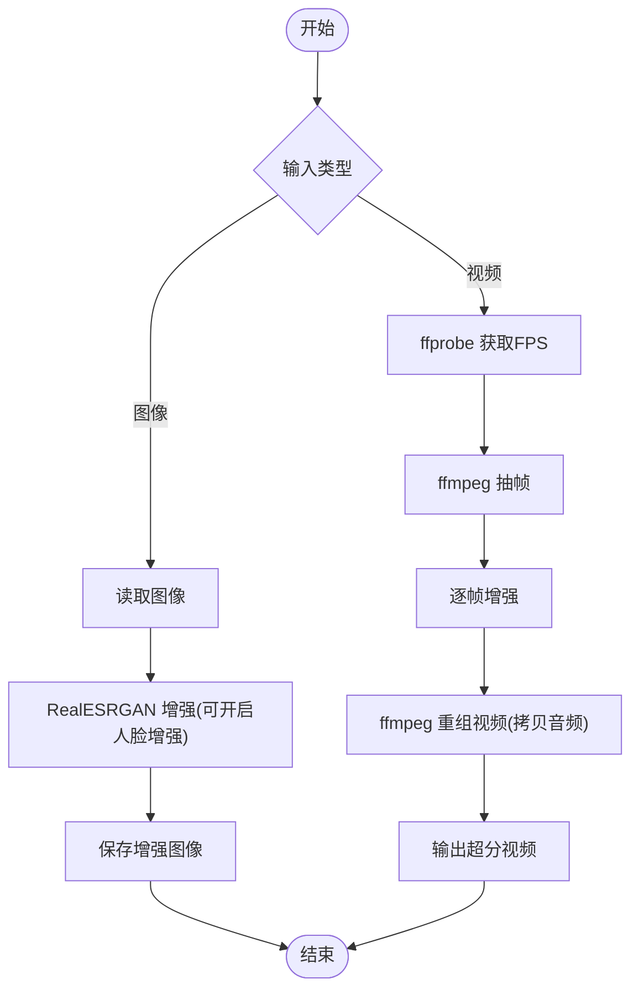
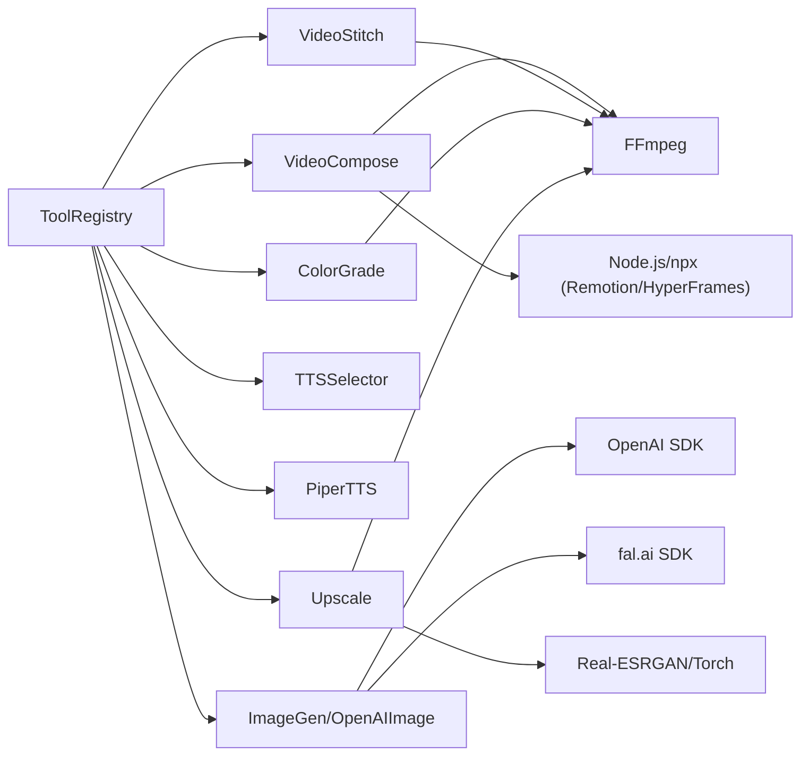

# 工具示例集合

<cite>
**本文引用的文件**
- [README.md](file://README.md)
- [base_tool.py](file://tools/base_tool.py)
- [tool_registry.py](file://tools/tool_registry.py)
- [video_compose.py](file://tools/video/video_compose.py)
- [video_stitch.py](file://tools/video/video_stitch.py)
- [image_gen.py](file://tools/graphics/image_gen.py)
- [openai_image.py](file://tools/graphics/openai_image.py)
- [tts_selector.py](file://tools/audio/tts_selector.py)
- [piper_tts.py](file://tools/audio/piper_tts.py)
- [color_grade.py](file://tools/enhancement/color_grade.py)
- [upscale.py](file://tools/enhancement/upscale.py)
</cite>

## 目录
1. [简介](#简介)
2. [项目结构](#项目结构)
3. [核心组件](#核心组件)
4. [架构总览](#架构总览)
5. [详细组件分析](#详细组件分析)
6. [依赖关系分析](#依赖关系分析)
7. [性能考量](#性能考量)
8. [故障排查指南](#故障排查指南)
9. [结论](#结论)
10. [附录](#附录)

## 简介
本文件面向希望快速理解并复用 OpenMontage 工具实现模式的开发者。围绕四类典型工具，给出完整实现模式与最佳实践：
- 视频合成工具：FFmpeg 集成、多轨道处理、转场效果、字幕烧录、编码配置等
- 图像生成工具：API 调用、参数映射、错误处理、成本估算、本地与云端混合执行
- 语音合成工具：TTS 选择器、离线与在线提供商切换、格式控制、成本控制
- 图像增强工具：算法封装（LUT/滤镜链）、帧级处理、性能优化、质量评估

每个示例均包含源码路径、配置说明、使用方法与扩展指南，帮助你在不重复造轮子的情况下快速集成或二次开发。

## 项目结构
OpenMontage 以“工具即能力”的方式组织代码：所有生产工具统一继承基类，通过注册表自动发现；上层由管道与技能驱动编排。关键目录：
- tools：按能力分层的工具集（video、audio、graphics、enhancement、analysis、subtitle、avatar 等）
- lib：基础设施（配置、检查点、管道加载、评分、媒体规格等）
- pipeline_defs：YAML 管道清单（编排脚本）
- skills：Markdown 技能文件（指导 Agent 如何正确使用工具）
- schemas：JSON Schema 校验契约
- remotion-composer：Remotion 渲染工程（React 场景与动画）

图表来源
- [tool_registry.py:55-134](file://tools/tool_registry.py#L55-L134)
- [base_tool.py:227-397](file://tools/base_tool.py#L227-L397)
- [video_compose.py:58-233](file://tools/video/video_compose.py#L58-L233)
- [video_stitch.py:29-146](file://tools/video/video_stitch.py#L29-L146)
- [image_gen.py:37-99](file://tools/graphics/image_gen.py#L37-L99)
- [openai_image.py:25-92](file://tools/graphics/openai_image.py#L25-L92)
- [tts_selector.py:15-155](file://tools/audio/tts_selector.py#L15-L155)
- [piper_tts.py:25-96](file://tools/audio/piper_tts.py#L25-L96)
- [color_grade.py:78-132](file://tools/enhancement/color_grade.py#L78-L132)
- [upscale.py:47-109](file://tools/enhancement/upscale.py#L47-L109)

章节来源
- [README.md:450-475](file://README.md#L450-L475)

## 核心组件
- BaseTool：统一工具契约（状态、依赖、资源、重试、成本估算、幂等键、命令执行封装、Backlot 事件埋点）
- ToolRegistry：自动发现、能力分组、可用性报告、提供者菜单、回退工具查找
- 工具实例：每个具体工具声明自身能力、输入输出 Schema、运行环境、依赖、成本估算与用户可见验证项

关键要点
- 所有 execute() 被自动包装为 Backlot 事件埋点，便于可视化追踪
- 依赖检测支持 cmd/binary/env/python 模块，失败时给出安装指引
- 统一的 ToolResult 返回成功/失败、产物、成本、耗时、模型/种子等元信息

章节来源
- [base_tool.py:25-60](file://tools/base_tool.py#L25-L60)
- [base_tool.py:128-139](file://tools/base_tool.py#L128-L139)
- [base_tool.py:227-397](file://tools/base_tool.py#L227-L397)
- [tool_registry.py:55-134](file://tools/tool_registry.py#L55-L134)
- [tool_registry.py:184-230](file://tools/tool_registry.py#L184-L230)
- [tool_registry.py:249-314](file://tools/tool_registry.py#L249-L314)

## 架构总览
OpenMontage 的“工具层 + 注册表 + 管道/技能”三层协作：
- 工具层：各能力独立实现，遵循 BaseTool 契约
- 注册表：自动发现工具、提供能力视图、回退策略、运行时可用性
- 管道/技能：Agent 读取 YAML 清单与 Markdown 技能，决定何时调用哪个工具

图表来源
- [tool_registry.py:118-134](file://tools/tool_registry.py#L118-L134)
- [tool_registry.py:249-314](file://tools/tool_registry.py#L249-L314)
- [base_tool.py:411-453](file://tools/base_tool.py#L411-L453)

## 详细组件分析

### 视频合成工具（VideoCompose）
职责
- 根据 edit_decisions 与资产清单，路由到 Remotion/HyperFrames/FFmpeg 三种渲染后端
- 纯视频剪辑走 FFmpeg compose：片段裁剪、统一分辨率/帧率、字幕烧录、音频混音、编码配置
- 图片/动画/组件场景走 Remotion；HTML/GSAP 走 HyperFrames

关键技术细节
- 片段裁剪：使用 -ss 前置 seek + -t 精确时长，避免 keyframe 对齐导致的越界
- 统一容器：中间段统一为 yuv420p、30fps、目标分辨率，确保 concat-copy 安全
- 无音频流处理：ffprobe 探测后注入静音 AAC 轨道，保证后续滤镜链稳定
- 字幕样式：从显式参数 > edit_decisions > playbook > 默认值分层解析
- 运行时治理：render_runtime 在提案阶段锁定，禁止静默切换

图表来源
- [video_compose.py:438-728](file://tools/video/video_compose.py#L438-L728)
- [video_compose.py:364-393](file://tools/video/video_compose.py#L364-L393)

章节来源
- [video_compose.py:58-233](file://tools/video/video_compose.py#L58-L233)
- [video_compose.py:234-335](file://tools/video/video_compose.py#L234-L335)
- [video_compose.py:337-360](file://tools/video/video_compose.py#L337-L360)
- [video_compose.py:438-728](file://tools/video/video_compose.py#L438-L728)

### 视频拼接与转场（VideoStitch）
职责
- 多片段顺序拼接、交叉淡入淡出、黑场过渡
- 空间布局：左右并列、垂直堆叠、画中画
- 预检：ffprobe 探测分辨率/帧率/编解码一致性，必要时自动归一化

关键技术细节
- 兼容性检测：对比首片段作为参考，列出差异字段（宽高、fps、编解码、采样率、声道数）
- 自动归一化：当 auto_normalize=true 或存在转场时，统一缩放/填充/帧率/编解码
- 转场实现：两 clip 直接 xfade；N clip 使用复杂滤镜图链式叠加
- 无音频流保护：对跨片段的 acrossfade 前，先为无音频片段注入静音轨道

图表来源
- [video_stitch.py:148-173](file://tools/video/video_stitch.py#L148-L173)
- [video_stitch.py:314-399](file://tools/video/video_stitch.py#L314-L399)
- [video_stitch.py:481-583](file://tools/video/video_stitch.py#L481-L583)
- [video_stitch.py:609-735](file://tools/video/video_stitch.py#L609-L735)

章节来源
- [video_stitch.py:29-146](file://tools/video/video_stitch.py#L29-L146)
- [video_stitch.py:200-308](file://tools/video/video_stitch.py#L200-L308)
- [video_stitch.py:405-475](file://tools/video/video_stitch.py#L405-L475)
- [video_stitch.py:584-735](file://tools/video/video_stitch.py#L584-L735)

### 图像生成工具（ImageGen 与 OpenAIImage）
职责
- ImageGen：向后兼容的多提供商聚合入口（已弃用，推荐 image_selector）
- OpenAIImage：调用 OpenAI GPT Image 2，支持尺寸/质量/数量/输出格式，持久化 b64 图像

关键技术细节
- 提供商检测：环境变量与本地库可用性判断（OPENAI_API_KEY、FAL_KEY、diffusers）
- 成本估算：按质量档位与生成数量计算 USD 成本
- 错误处理：网络/鉴权/空结果等异常统一捕获，返回 ToolResult
- 多输出：n>1 时自动追加序号后缀，避免覆盖

图表来源
- [base_tool.py:227-397](file://tools/base_tool.py#L227-L397)
- [image_gen.py:37-153](file://tools/graphics/image_gen.py#L37-L153)
- [openai_image.py:25-184](file://tools/graphics/openai_image.py#L25-L184)

章节来源
- [image_gen.py:37-153](file://tools/graphics/image_gen.py#L37-L153)
- [openai_image.py:25-184](file://tools/graphics/openai_image.py#L25-L184)

### 语音合成工具（TTS 选择器与 Piper）
职责
- TTSSelector：基于任务上下文对 TTS 提供商进行打分排序，自动适配参数并委派执行
- PiperTTS：离线本地 TTS，零成本、隐私友好，适合兜底与内网环境

关键技术细节
- 提供商发现：registry.get_by_capability("tts") 动态获取
- 参数适配：将通用 speed/pitch/style 等映射到 Azure/ElevenLabs 等原生字段
- 成本与回退：优先 preferred_provider，否则按评分选择；若全部不可用则失败
- 本地执行：调用 piper CLI，超时保护，输出 WAV

图表来源
- [tts_selector.py:157-225](file://tools/audio/tts_selector.py#L157-L225)
- [tts_selector.py:227-288](file://tools/audio/tts_selector.py#L227-L288)
- [piper_tts.py:98-156](file://tools/audio/piper_tts.py#L98-L156)

章节来源
- [tts_selector.py:15-155](file://tools/audio/tts_selector.py#L15-L155)
- [tts_selector.py:157-225](file://tools/audio/tts_selector.py#L157-L225)
- [tts_selector.py:227-288](file://tools/audio/tts_selector.py#L227-L288)
- [piper_tts.py:25-96](file://tools/audio/piper_tts.py#L25-L96)
- [piper_tts.py:98-156](file://tools/audio/piper_tts.py#L98-L156)

### 图像增强工具（ColorGrade 与 Upscale）
职责
- ColorGrade：内置 LUT/滤镜链预设，支持强度混合与自定义 vf
- Upscale：Real-ESRGAN 图像/视频超分，可选人脸增强（GFPGAN），视频帧提取与重组

关键技术细节
- 滤镜链：colorbalance/curves/eq 组合，支持 .cube LUT 与 intensity 混合
- 视频超分：ffmpeg 抽帧 -> RealESRGAN 单帧增强 -> ffmpeg 重组并拷贝原音频
- 设备选择：CUDA/MPS/CPU 自适应，非 CUDA 启用 tile 分块降低内存占用
- 质量评估：用户可见验证项（皮肤自然度、细节与伪影）

图表来源
- [color_grade.py:78-213](file://tools/enhancement/color_grade.py#L78-L213)
- [upscale.py:47-173](file://tools/enhancement/upscale.py#L47-L173)
- [upscale.py:206-259](file://tools/enhancement/upscale.py#L206-L259)
- [upscale.py:265-337](file://tools/enhancement/upscale.py#L265-L337)
- [upscale.py:339-363](file://tools/enhancement/upscale.py#L339-L363)

章节来源
- [color_grade.py:78-213](file://tools/enhancement/color_grade.py#L78-L213)
- [upscale.py:47-173](file://tools/enhancement/upscale.py#L47-L173)
- [upscale.py:179-200](file://tools/enhancement/upscale.py#L179-L200)
- [upscale.py:206-259](file://tools/enhancement/upscale.py#L206-L259)
- [upscale.py:265-337](file://tools/enhancement/upscale.py#L265-L337)
- [upscale.py:339-363](file://tools/enhancement/upscale.py#L339-L363)

## 依赖关系分析
- 工具间耦合低：均以 BaseTool 为抽象，通过 ToolRegistry 解耦发现与选择
- 外部依赖：FFmpeg/ffprobe、Node.js/npx（Remotion/HyperFrames）、第三方 SDK（OpenAI、fal.ai）、本地库（diffusers、realesrgan、torch）
- 运行时治理：render_runtime 锁定，禁止静默切换；availability 检查集中在 get_info/get_status

图表来源
- [tool_registry.py:118-134](file://tools/tool_registry.py#L118-L134)
- [video_compose.py:234-335](file://tools/video/video_compose.py#L234-L335)
- [video_stitch.py:39-46](file://tools/video/video_stitch.py#L39-L46)
- [openai_image.py:36-41](file://tools/graphics/openai_image.py#L36-L41)
- [upscale.py:58-64](file://tools/enhancement/upscale.py#L58-L64)

章节来源
- [tool_registry.py:118-134](file://tools/tool_registry.py#L118-L134)
- [video_compose.py:234-335](file://tools/video/video_compose.py#L234-L335)
- [video_stitch.py:39-46](file://tools/video/video_stitch.py#L39-L46)
- [openai_image.py:36-41](file://tools/graphics/openai_image.py#L36-L41)
- [upscale.py:58-64](file://tools/enhancement/upscale.py#L58-L64)

## 性能考量
- 视频拼接与转场
  - 尽量使用 concat demuxer copy 减少重编码；仅在需要滤镜/转场时重编码
  - 对 N 段 crossfade/fade 使用复杂滤镜图链式叠加，注意累积偏移计算
  - 无音频流提前注入静音轨道，避免 acrossfade 失败
- 图像生成
  - 合理设置 n 与 quality，结合 estimate_cost 控制预算
  - 本地 diffusers 推理时优先 GPU，CPU 下考虑分块/降分辨率
- 语音合成
  - 优先选择低成本/高成功率提供商；Piper 作为离线兜底
  - 批量生成前先 rank 一次，避免无效调用
- 图像增强
  - 视频超分采用帧抽取+重组，注意磁盘 IO 与临时目录清理
  - 非 CUDA 设备启用 tile 分块，防止 OOM；人脸增强按需开启

## 故障排查指南
常见问题与定位
- FFmpeg/ffprobe 未找到：检查 PATH 与依赖声明；查看 ToolResult.error 中的命令详情
- 片段无音频导致转场失败：确认已调用 _ensure_audio_for_clips 或手动注入静音轨道
- Remotion/HyperFrames 不可用：检查 npx、node_modules、npm 包是否安装；查看 get_info 中 runtime_note
- API Key 缺失：检查 .env 与 os.environ；BaseTool 会在 import 时加载 .env
- 供应商不可用：通过 registry.provider_menu_summary 查看 capabilities 与 setup_offers

建议步骤
- 使用 dry_run 预检：VideoStitch 支持 dry_run 返回预期行为与探测信息
- 查看 ToolResult.data/artifacts：确认输出路径、成本、耗时、模型/种子
- 利用 Backlot 事件：execute() 自动埋点 start/finish/error，便于定位问题

章节来源
- [base_tool.py:25-60](file://tools/base_tool.py#L25-L60)
- [base_tool.py:411-453](file://tools/base_tool.py#L411-L453)
- [video_stitch.py:175-198](file://tools/video/video_stitch.py#L175-L198)
- [video_compose.py:234-335](file://tools/video/video_compose.py#L234-L335)
- [tool_registry.py:316-471](file://tools/tool_registry.py#L316-L471)

## 结论
OpenMontage 的工具体系以 BaseTool 为核心契约，配合 ToolRegistry 的动态发现与评分选择，实现了高度可扩展的视频、图像、语音与增强能力。通过严格的运行时治理、成本估算与错误处理，既保证了生产稳定性，又为二次开发提供了清晰的扩展点。建议在新项目中优先复用现有工具与模式，按需扩展新的提供商或能力。

## 附录
- 快速上手
  - 安装依赖与 FFmpeg/Node.js，配置 .env 密钥
  - 通过 AI 助手描述需求，系统自动选择管道与工具
- 扩展新工具
  - 新建 Python 文件，继承 BaseTool，实现 execute 与必要元数据
  - 无需手动注册，ToolRegistry 自动发现
- 扩展新管道
  - 新增 YAML 清单与对应技能文件，引用现有工具或新工具