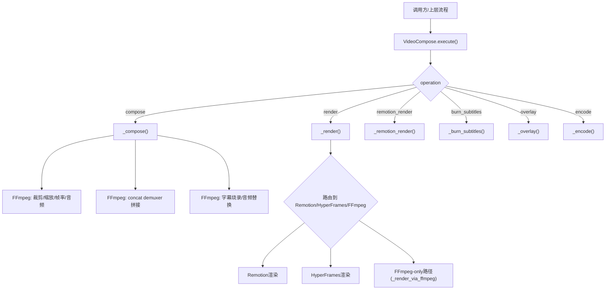
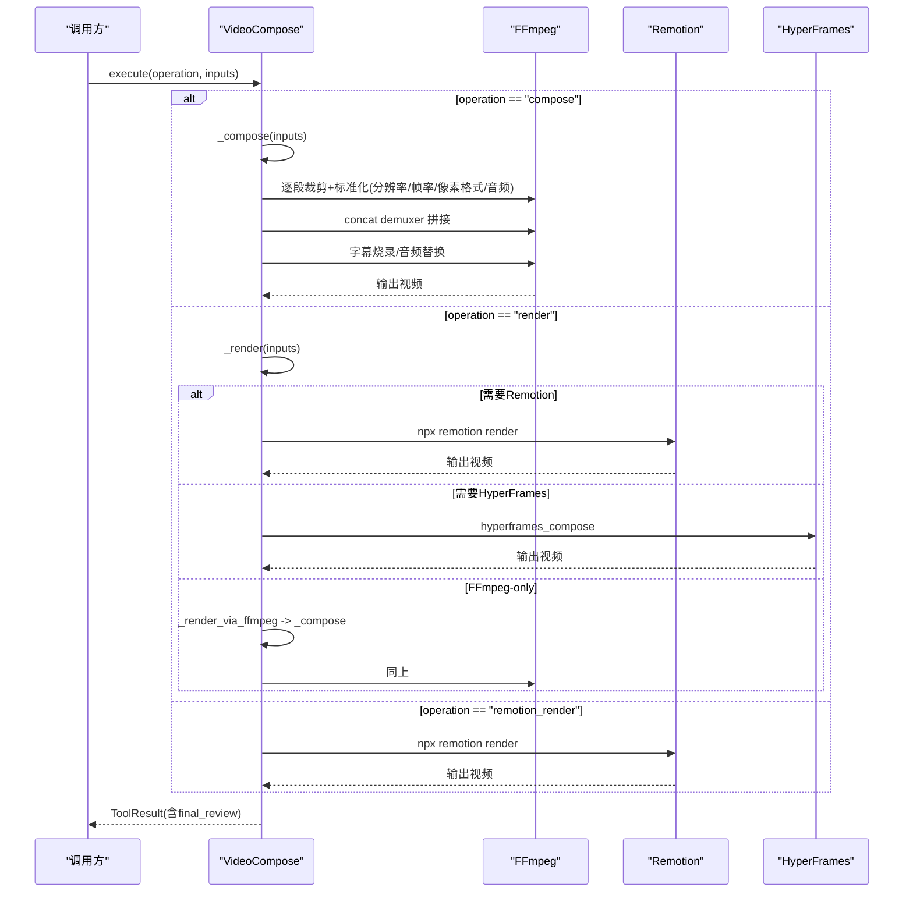
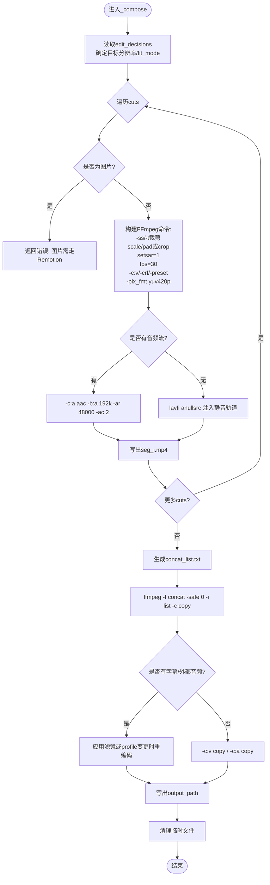
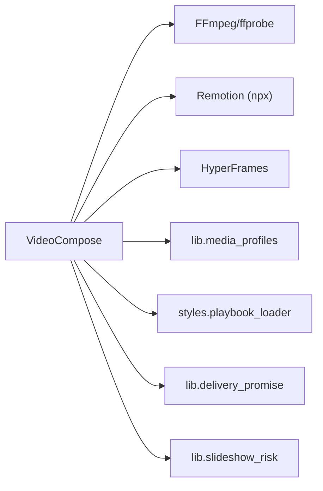

# FFmpeg视频合成

<cite>
**本文引用的文件**
- [tools/video/video_compose.py](file://tools/video/video_compose.py)
- [tools/video/video_stitch.py](file://tools/video/video_stitch.py)
- [skills/core/subtitle-sync.md](file://skills/core/subtitle-sync.md)
</cite>

## 目录
1. [简介](#简介)
2. [项目结构](#项目结构)
3. [核心组件](#核心组件)
4. [架构总览](#架构总览)
5. [详细组件分析](#详细组件分析)
6. [依赖关系分析](#依赖关系分析)
7. [性能考量](#性能考量)
8. [故障排查指南](#故障排查指南)
9. [结论](#结论)
10. [附录](#附录)

## 简介
本技术文档聚焦于OpenMontage中的FFmpeg视频合成功能，重点解析VideoCompose类的_compose方法实现。内容涵盖：
- 视频片段裁剪、音频流处理、字幕烧录、转场效果等核心能力
- FFmpeg命令构建逻辑（缩放、分辨率适配、帧率转换、音频重采样）
- 多段视频拼接机制（concat demuxer使用、临时文件管理、错误处理策略）
- 字幕样式配置系统（ASS格式支持、字体设置、颜色配置、对齐方式等）
- 完整代码示例与配置参数说明，帮助开发者理解FFmpeg在视频制作流水线中的关键作用

## 项目结构
与FFmpeg视频合成直接相关的核心文件：
- tools/video/video_compose.py：提供compose、render、remotion_render、burn_subtitles、overlay、encode等操作；_compose负责纯视频剪辑、拼接、字幕烧录与音频混音
- tools/video/video_stitch.py：提供stitch/crossfade/fade/spatial等多段拼接与空间布局能力
- skills/core/subtitle-sync.md：字幕同步与烧录样式最佳实践

图表来源
- [tools/video/video_compose.py:337-360](file://tools/video/video_compose.py#L337-L360)
- [tools/video/video_compose.py:438-728](file://tools/video/video_compose.py#L438-L728)
- [tools/video/video_compose.py:1517-1750](file://tools/video/video_compose.py#L1517-L1750)

章节来源
- [tools/video/video_compose.py:337-360](file://tools/video/video_compose.py#L337-L360)
- [tools/video/video_stitch.py:1-147](file://tools/video/video_stitch.py#L1-L147)

## 核心组件
- VideoCompose类：统一入口，封装多种操作（compose/render/remotion_render/burn_subtitles/overlay/encode），并负责运行时选择、资源检查、最终自检
- _compose方法：纯视频剪辑与合成的核心，负责：
  - 读取edit_decisions.cuts，逐段裁剪
  - 统一输出分辨率、帧率、像素格式，确保concat兼容
  - 处理无音频流的片段（注入静音轨道）
  - 生成concat列表并使用concat demuxer拼接
  - 可选字幕烧录与外部音频替换
- VideoStitch类：提供跨淡、黑场过渡、空间布局（侧边、上下堆叠、画中画）等高级拼接能力

章节来源
- [tools/video/video_compose.py:58-78](file://tools/video/video_compose.py#L58-L78)
- [tools/video/video_compose.py:438-728](file://tools/video/video_compose.py#L438-L728)
- [tools/video/video_stitch.py:29-147](file://tools/video/video_stitch.py#L29-L147)

## 架构总览
整体流程分为“高层路由”和“底层执行”两层：
- 高层路由：根据operation与edit_decisions.render_runtime决定走Remotion、HyperFrames或FFmpeg路径
- 底层执行：
  - FFmpeg路径：_compose完成剪辑、标准化、拼接、字幕烧录与音频替换
  - Remotion路径：通过npx remotion render进行帧级精确渲染
  - HyperFrames路径：通过hyperframes_compose进行HTML/CSS/GSAP驱动的合成

图表来源
- [tools/video/video_compose.py:337-360](file://tools/video/video_compose.py#L337-L360)
- [tools/video/video_compose.py:438-728](file://tools/video/video_compose.py#L438-L728)
- [tools/video/video_compose.py:1517-1750](file://tools/video/video_compose.py#L1517-L1750)
- [tools/video/video_compose.py:1944-2136](file://tools/video/video_compose.py#L1944-L2136)

## 详细组件分析

### VideoCompose._compose 方法详解
职责：对纯视频素材进行裁剪、标准化、拼接、字幕烧录与音频替换，输出最终视频。

关键步骤与实现要点：
- 输入校验与目标分辨率/适配模式确定
  - 从edit_decisions.metadata.compose_target或profile获取目标分辨率与fit_mode（pad/cover）
  - 默认1920x1080，pad为保留全画面（加黑边），cover为填充裁剪（适合竖屏）
- 逐段裁剪与标准化
  - 使用“-ss before -i”快速定位起点，“-t duration”精确时长
  - 强制统一分辨率、像素格式yuv420p、帧率30fps，保证concat兼容性
  - 若速度不等于1.0，应用setpts调整视频时间轴，并用atempo链调整音频速度
  - 检测音频流存在性：若无音频，注入静音立体声AAC轨道，保持流布局一致
- 多段拼接
  - 生成concat_list.txt，使用“-f concat -safe 0 -i list -c copy”零拷贝拼接
- 字幕烧录与外部音频替换
  - 若提供subtitle_path且存在，则通过subtitles滤镜烧录，使用_build_subtitle_style生成ASS force_style
  - 若提供audio_path，则以类型选择器映射音视频流，重新编码音频为AAC并shortest截断
  - 是否需要重编码取决于是否包含滤镜或profile尺寸/帧率变化
- 临时文件管理与清理
  - 所有中间段、concat列表与中间结果写入“.compose_tmp”，完成后统一删除

图表来源
- [tools/video/video_compose.py:438-728](file://tools/video/video_compose.py#L438-L728)

章节来源
- [tools/video/video_compose.py:438-728](file://tools/video/video_compose.py#L438-L728)

### 视频缩放、分辨率适配、帧率转换、音频重采样
- 缩放与适配
  - fit="pad": scale降低以适应目标宽高，再pad居中加黑边
  - fit="cover": scale放大至覆盖目标，再center crop
- 帧率转换
  - 统一fps=30，确保不同源素材一致性
- 像素格式
  - 统一yuv420p，避免播放器兼容问题
- 音频重采样
  - 统一aac、48kHz、立体声；无音频时注入静音轨道
- 速度调整
  - 视频setpts与音频atempo链联动，保证音画同步

章节来源
- [tools/video/video_compose.py:548-634](file://tools/video/video_compose.py#L548-L634)
- [tools/video/video_compose.py:2932-2944](file://tools/video/video_compose.py#L2932-L2944)

### 多段视频拼接机制（concat demuxer）
- 生成concat列表：每行一个绝对路径，使用-safe 0允许相对路径
- 零拷贝拼接：-c copy，要求所有segment具备相同编解码器、分辨率、帧率、像素格式、SAR
- 异常处理：若segment不兼容，需在拼接前标准化（已在裁剪阶段完成）

章节来源
- [tools/video/video_compose.py:638-653](file://tools/video/video_compose.py#L638-L653)

### 字幕样式配置系统（ASS）
- 样式优先级：显式传入 > edit_decisions.subtitles.style > playbook > 默认值
- ASS force_style字段：FontName、FontSize、Bold、PrimaryColour、OutlineColour、BackColour、BorderStyle、Outline、Shadow、MarginV、Alignment
- 颜色格式：&H00FFFFFF（Alpha-BGR），注意不是普通RGB
- 垂直/水平视频建议字号与边距不同，避免遮挡主体

章节来源
- [tools/video/video_compose.py:2860-2930](file://tools/video/video_compose.py#L2860-L2930)
- [skills/core/subtitle-sync.md:42-81](file://skills/core/subtitle-sync.md#L42-L81)

### 转场效果
- _compose本身不做跨段转场（仅硬切），如需crossfade或fade-through-black，请使用VideoStitch的stitch操作
- VideoStitch支持：
  - cut：简单拼接
  - crossfade：相邻两段交叉淡入淡出
  - fade：黑场过渡
  - spatial：侧边、上下堆叠、画中画布局

章节来源
- [tools/video/video_stitch.py:481-735](file://tools/video/video_stitch.py#L481-L735)

### 错误处理策略
- 输入校验：缺失edit_decisions、无cuts、源文件不存在等直接返回失败
- 运行时可用性：检查ffmpeg/npx/hyperframes环境，不可用则明确报错而非静默降级
- 子进程异常：捕获CalledProcessError/TimeoutExpired，输出stderr尾部信息便于诊断
- 临时文件清理：finally块确保中间文件被删除，避免磁盘泄漏

章节来源
- [tools/video/video_compose.py:234-253](file://tools/video/video_compose.py#L234-L253)
- [tools/video/video_compose.py:337-360](file://tools/video/video_compose.py#L337-L360)
- [tools/video/video_compose.py:1944-2136](file://tools/video/video_compose.py#L1944-L2136)

## 依赖关系分析
- 工具依赖
  - ffmpeg/ffprobe：用于媒体探测、转码、滤镜、拼接
  - npx/remotion：用于React帧级渲染（当需要图像/动画/组件场景时）
  - hyperframes：HTML/CSS/GSAP驱动合成（可选）
- 内部模块
  - lib.media_profiles：媒体规格（分辨率、帧率、编码）
  - styles.playbook_loader：样式主题加载（Remotion/HyperFrames）
  - lib.delivery_promise/lib.slideshow_risk：质量门禁（投递承诺、幻灯片风险评分）

图表来源
- [tools/video/video_compose.py:234-253](file://tools/video/video_compose.py#L234-L253)
- [tools/video/video_compose.py:1264-1373](file://tools/video/video_compose.py#L1264-L1373)
- [tools/video/video_compose.py:1415-1515](file://tools/video/video_compose.py#L1415-L1515)

章节来源
- [tools/video/video_compose.py:234-253](file://tools/video/video_compose.py#L234-L253)
- [tools/video/video_compose.py:1264-1373](file://tools/video/video_compose.py#L1264-L1373)
- [tools/video/video_compose.py:1415-1515](file://tools/video/video_compose.py#L1415-L1515)

## 性能考量
- 零拷贝拼接优先：标准化后使用-c copy拼接，减少CPU占用
- 统一参数降低重编码：分辨率、帧率、像素格式、音频格式统一，避免多次转码
- atempo链优化：极端速度变化时分段应用atempo，避免超出范围导致失败
- 并发与超时：Remotion渲染可配置timeout_ms，避免浏览器启动慢导致的超时
- 临时文件管理：及时清理中间文件，避免磁盘压力影响后续任务

[本节为通用指导，不直接分析具体文件]

## 故障排查指南
常见问题与定位方法：
- 源文件缺失：检查cut.source是否存在
- 无音频流：确认已注入静音轨道或使用_has_audio_stream探测
- 拼接失败：确认所有segment分辨率/帧率/像素格式一致
- 字幕位置异常：检查ASS颜色格式与MarginV/Alignment设置
- Remotion超时：提高remotion_timeout_ms，检查node_modules是否安装
- 最终自检失败：查看final_review中technical_probe与visual_spotcheck的问题列表

章节来源
- [tools/video/video_compose.py:370-393](file://tools/video/video_compose.py#L370-L393)
- [tools/video/video_compose.py:2285-2386](file://tools/video/video_compose.py#L2285-L2386)
- [skills/core/subtitle-sync.md:75-81](file://skills/core/subtitle-sync.md#L75-L81)

## 结论
VideoCompose._compose提供了稳定、可控的FFmpeg视频合成能力，适用于纯视频剪辑与拼接场景。通过严格的标准化、concat demuxer高效拼接、字幕烧录与音频替换，以及完善的错误处理与临时文件管理，确保了生产环境的可靠性。对于更复杂的视觉合成需求，可通过_remotion_render或_hyperframes路径获得更高阶能力。配合VideoStitch的转场与空间布局，可覆盖大多数短视频/长视频制作流水线。

[本节为总结，不直接分析具体文件]

## 附录

### 配置参数速查（_compose相关）
- 输入
  - edit_decisions：必须，包含cuts、metadata.compose_target、subtitles等
  - audio_path：可选，外部混音替换
  - subtitle_path：可选，字幕文件路径
  - profile：可选，媒体规格名称（如youtube_landscape、tiktok等）
  - codec/crf/preset：可选，编码器与质量参数
- 输出
  - output_path：输出视频路径
- 行为
  - fit_mode：pad（保留全画面）/ cover（填充裁剪）
  - 帧率：统一30fps
  - 像素格式：yuv420p
  - 音频：aac、48kHz、立体声；无音频时注入静音

章节来源
- [tools/video/video_compose.py:80-207](file://tools/video/video_compose.py#L80-L207)
- [tools/video/video_compose.py:438-728](file://tools/video/video_compose.py#L438-L728)

### 代码示例路径（不直接展示代码）
- 构建FFmpeg命令（裁剪+标准化+音频处理）
  - [video_compose.py:548-634](file://tools/video/video_compose.py#L548-L634)
- 生成concat列表并拼接
  - [video_compose.py:638-653](file://tools/video/video_compose.py#L638-L653)
- 字幕烧录与外部音频替换
  - [video_compose.py:655-701](file://tools/video/video_compose.py#L655-L701)
- ASS样式构建
  - [video_compose.py:2911-2930](file://tools/video/video_compose.py#L2911-L2930)
- atempo链构建
  - [video_compose.py:2932-2944](file://tools/video/video_compose.py#L2932-L2944)
- 转场与空间布局（VideoStitch）
  - [video_stitch.py:481-735](file://tools/video/video_stitch.py#L481-L735)