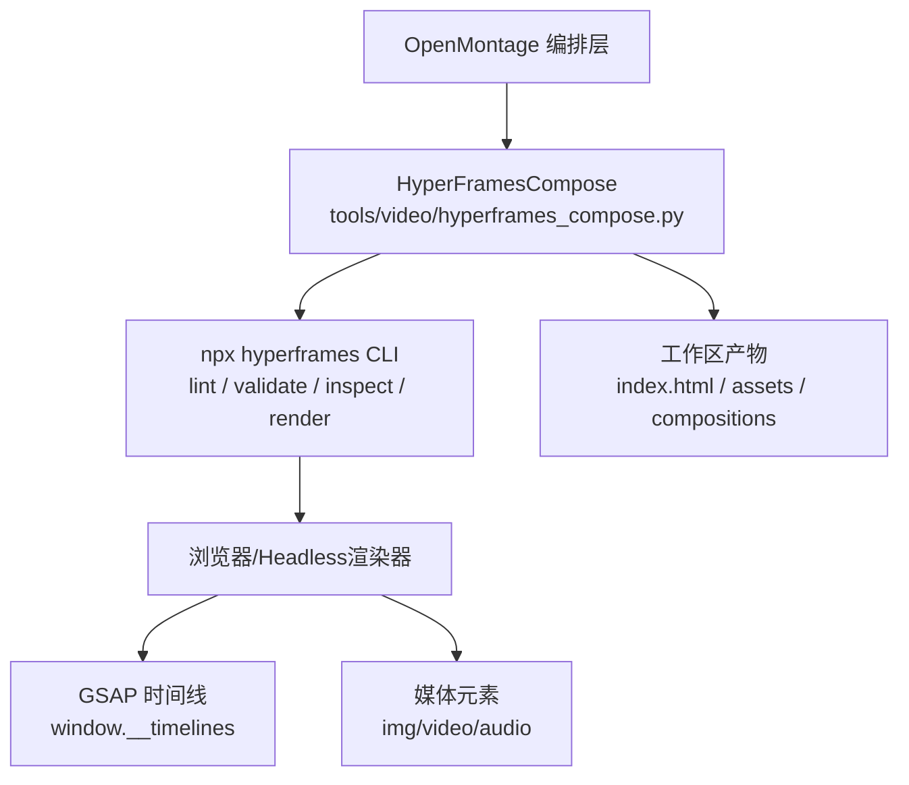
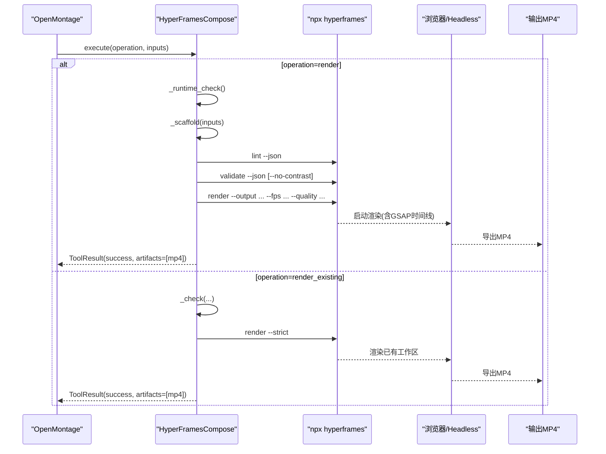
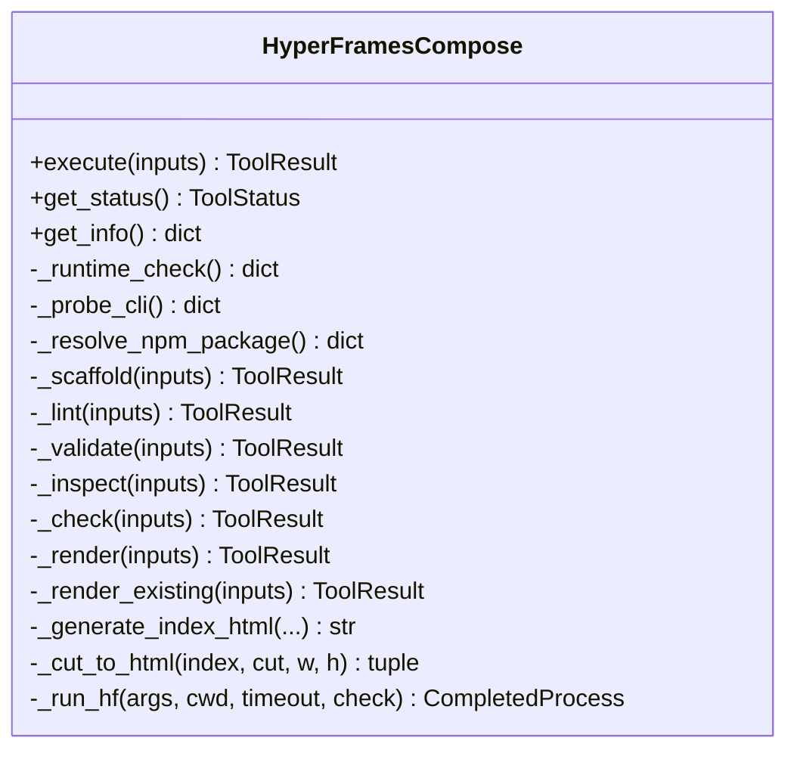
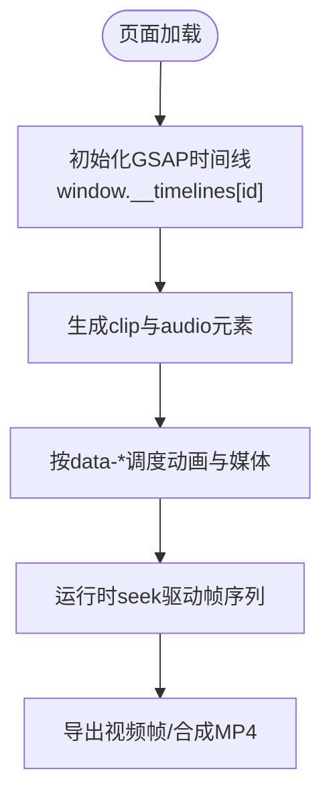
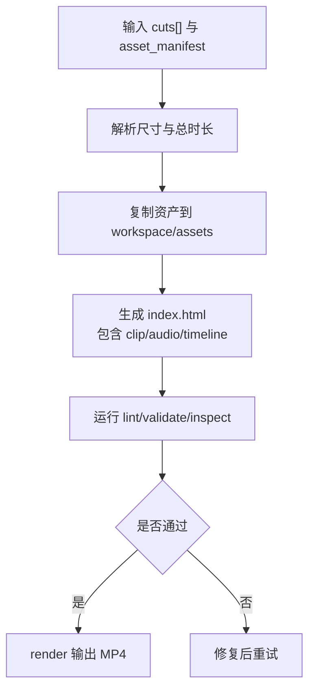
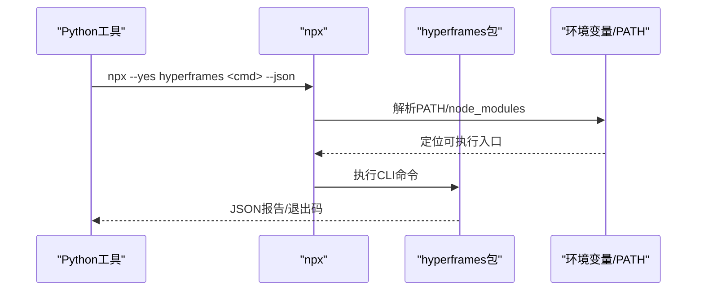
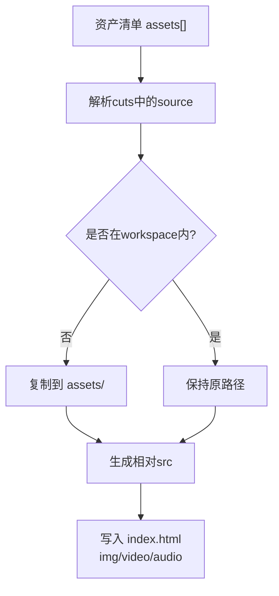
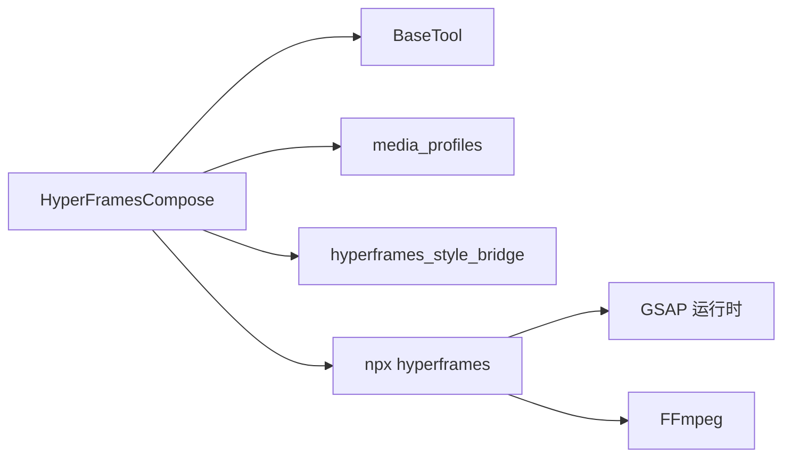

# HyperFrames动画合成

<cite>
**本文引用的文件**
- [tools/video/hyperframes_compose.py](file://tools/video/hyperframes_compose.py)
- [.agents/skills/hyperframes-core/SKILL.md](file://.agents/skills/hyperframes-core/SKILL.md)
- [.agents/skills/hyperframes-cli/SKILL.md](file://.agents/skills/hyperframes-cli/SKILL.md)
- [.agents/skills/hyperframes-animation/adapters/gsap.md](file://.agents/skills/hyperframes-animation/adapters/gsap.md)
- [.agents/skills/hyperframes-animation/adapters/animejs.md](file://.agents/skills/hyperframes-animation/adapters/animejs.md)
- [.agents/skills/hyperframes-animation/rules/dynamic-content-sequencing.md](file://.agents/skills/hyperframes-animation/rules/dynamic-content-sequencing.md)
- [.agents/skills/website-to-video/references/step-5-build.md](file://.agents/skills/website-to-video/references/step-5-build.md)
- [.agents/skills/remotion-to-hyperframes/references/media.md](file://.agents/skills/remotion-to-hyperframes/references/media.md)
- [.agents/skills/hyperframes-core/references/minimal-composition.md](file://.agents/skills/hyperframes-core/references/minimal-composition.md)
- [.agents/skills/hyperframes-core/references/variables-and-media.md](file://.agents/skills/hyperframes-core/references/variables-and-media.md)
- [.agents/skills/hyperframes-animation/scripts/package-loader.mjs](file://.agents/skills/hyperframes-animation/scripts/package-loader.mjs)
</cite>

## 目录
1. [简介](#简介)
2. [项目结构](#项目结构)
3. [核心组件](#核心组件)
4. [架构总览](#架构总览)
5. [详细组件分析](#详细组件分析)
6. [依赖关系分析](#依赖关系分析)
7. [性能考虑](#性能考虑)
8. [故障排查指南](#故障排查指南)
9. [结论](#结论)
10. [附录：API参考与使用示例](#附录api参考与使用示例)

## 简介
本技术文档面向希望基于OpenMontage的HyperFrames能力进行网页动画与视频合成的开发者。重点覆盖：
- HyperFramesCompose类的核心架构与执行流程
- HTML/CSS/GSAP动画引擎集成、动态内容生成与响应式尺寸
- Node.js环境集成（npm包管理、命令行工具调用、环境变量）
- 动画脚本系统（GSAP时间线控制、CSS动画、JS交互）
- 媒体资源管理（图片、视频、音频的处理与加载优化）
- 完整API参考与使用示例，帮助构建高性能网页动画与视频内容

## 项目结构
OpenMontage将HyperFrames作为“HTML/CSS/GSAP渲染路径”的工具实现，位于tools/video/hyperframes_compose.py；同时通过技能文档定义Composition契约、CLI工作流、动画适配器与媒体规范。

图表来源
- [tools/video/hyperframes_compose.py:51-91](file://tools/video/hyperframes_compose.py#L51-L91)
- [.agents/skills/hyperframes-cli/SKILL.md:10-26](file://.agents/skills/hyperframes-cli/SKILL.md#L10-L26)

章节来源
- [tools/video/hyperframes_compose.py:1-14](file://tools/video/hyperframes_compose.py#L1-L14)
- [.agents/skills/hyperframes-cli/SKILL.md:10-26](file://.agents/skills/hyperframes-cli/SKILL.md#L10-L26)

## 核心组件
- HyperFramesCompose：封装了从环境探测、工作区脚手架、静态检查、浏览器校验到最终渲染的全链路。它通过npx调用hyperframes CLI，并负责资产拷贝、样式桥接、HTML生成等。
- Composition契约：由hyperframes-core技能定义，规定根节点data属性、clip组织、轨道、子组合、变量与媒体播放规则。
- CLI工作流：提供init/lint/validate/inspect/preview/render等命令，支持JSON输出、严格模式、Lambda云端渲染等。
- 动画适配器：以GSAP为主，兼容Anime.js等，遵循seek-driven模型，禁止异步构建时间线与无限循环。
- 媒体规范：明确video/audio放置、音量控制、裁剪、跨域等约束。

章节来源
- [tools/video/hyperframes_compose.py:51-91](file://tools/video/hyperframes_compose.py#L51-L91)
- [.agents/skills/hyperframes-core/SKILL.md:31-79](file://.agents/skills/hyperframes-core/SKILL.md#L31-L79)
- [.agents/skills/hyperframes-cli/SKILL.md:10-26](file://.agents/skills/hyperframes-cli/SKILL.md#L10-L26)
- [.agents/skills/hyperframes-animation/adapters/gsap.md:10-32](file://.agents/skills/hyperframes-animation/adapters/gsap.md#L10-L32)
- [.agents/skills/hyperframes-core/references/variables-and-media.md:79-89](file://.agents/skills/hyperframes-core/references/variables-and-media.md#L79-L89)

## 架构总览
下图展示从OpenMontage调用到最终MP4输出的端到端流程，包括环境探测、工作区生成、静态检查、浏览器校验与渲染。

图表来源
- [tools/video/hyperframes_compose.py:766-876](file://tools/video/hyperframes_compose.py#L766-L876)
- [tools/video/hyperframes_compose.py:878-975](file://tools/video/hyperframes_compose.py#L878-L975)
- [.agents/skills/hyperframes-cli/SKILL.md:10-26](file://.agents/skills/hyperframes-cli/SKILL.md#L10-L26)

## 详细组件分析

### HyperFramesCompose类
- 职责边界
  - 环境探测：Node版本、FFmpeg、npx可用性，以及npm包解析与CLI可执行性探测。
  - 工作区脚手架：根据edit_decisions与asset_manifest生成index.html、assets、compositions与hyperframes.json。
  - 质量门禁：lint/validate/inspect/check，支持严格模式与对比度跳过。
  - 渲染管线：调用hyperframes render，产出MP4，并进行输出存在性与完整性校验。
  - 现有工作区渲染：保护用户手写index.html，仅做质量门与渲染。
- 关键方法
  - _runtime_check/_probe_cli/_resolve_npm_package：进程级缓存避免重复网络开销。
  - _scaffold/_generate_index_html/_cut_to_html：按cuts类型生成图像/视频/文本卡片与入场动画。
  - _run_hf：统一封装npx调用，处理Windows .cmd解析与超时。
  - _style_bridge：将playbook映射为CSS自定义属性与DESIGN.md。
- 错误与健壮性
  - 对npm/CLI失败、超时、返回码进行分级处理，保留stdout/stderr尾部便于诊断。
  - 对render_existing在渲染期间修改index.html进行哈希校验，防止并发篡改。

图表来源
- [tools/video/hyperframes_compose.py:51-91](file://tools/video/hyperframes_compose.py#L51-L91)
- [tools/video/hyperframes_compose.py:459-488](file://tools/video/hyperframes_compose.py#L459-L488)
- [tools/video/hyperframes_compose.py:766-876](file://tools/video/hyperframes_compose.py#L766-L876)
- [tools/video/hyperframes_compose.py:878-975](file://tools/video/hyperframes_compose.py#L878-L975)
- [tools/video/hyperframes_compose.py:1167-1262](file://tools/video/hyperframes_compose.py#L1167-L1262)
- [tools/video/hyperframes_compose.py:1264-1343](file://tools/video/hyperframes_compose.py#L1264-L1343)
- [tools/video/hyperframes_compose.py:1349-1387](file://tools/video/hyperframes_compose.py#L1349-L1387)

章节来源
- [tools/video/hyperframes_compose.py:238-417](file://tools/video/hyperframes_compose.py#L238-L417)
- [tools/video/hyperframes_compose.py:532-621](file://tools/video/hyperframes_compose.py#L532-L621)
- [tools/video/hyperframes_compose.py:623-718](file://tools/video/hyperframes_compose.py#L623-L718)
- [tools/video/hyperframes_compose.py:766-876](file://tools/video/hyperframes_compose.py#L766-L876)
- [tools/video/hyperframes_compose.py:878-975](file://tools/video/hyperframes_compose.py#L878-L975)
- [tools/video/hyperframes_compose.py:1167-1343](file://tools/video/hyperframes_compose.py#L1167-L1343)
- [tools/video/hyperframes_compose.py:1349-1437](file://tools/video/hyperframes_compose.py#L1349-L1437)

### HTML/CSS/GSAP动画引擎集成
- Composition契约
  - 根节点需声明data-composition-id、data-width、data-height、data-duration。
  - 每个composition注册一个gsap.timeline({ paused: true })于window.__timelines["id"]。
  - 媒体元素必须直接置于宿主根下，框架拥有播放控制权。
- GSAP适配
  - 禁止异步构建时间线、禁止无限repeat、禁止驱动媒体播放。
  - 使用位置参数、标签、缓动、stagger等高级特性编排复杂时序。
- Anime.js适配
  - 设置autoplay:false，实例push到window.__hfAnime，由运行时seek驱动。
- 网站转视频模式
  - 场景容器使用data-composition-src与data-start/data-duration，配合过渡配置。

图表来源
- [.agents/skills/hyperframes-core/SKILL.md:47-79](file://.agents/skills/hyperframes-core/SKILL.md#L47-L79)
- [.agents/skills/hyperframes-animation/adapters/gsap.md:10-32](file://.agents/skills/hyperframes-animation/adapters/gsap.md#L10-L32)
- [.agents/skills/hyperframes-animation/adapters/animejs.md:10-18](file://.agents/skills/hyperframes-animation/adapters/animejs.md#L10-L18)
- [.agents/skills/website-to-video/references/step-5-build.md:197-260](file://.agents/skills/website-to-video/references/step-5-build.md#L197-L260)

章节来源
- [.agents/skills/hyperframes-core/SKILL.md:31-79](file://.agents/skills/hyperframes-core/SKILL.md#L31-L79)
- [.agents/skills/hyperframes-animation/adapters/gsap.md:10-32](file://.agents/skills/hyperframes-animation/adapters/gsap.md#L10-L32)
- [.agents/skills/hyperframes-animation/adapters/animejs.md:10-18](file://.agents/skills/hyperframes-animation/adapters/animejs.md#L10-L18)
- [.agents/skills/website-to-video/references/step-5-build.md:197-260](file://.agents/skills/website-to-video/references/step-5-build.md#L197-L260)

### 动态内容生成与响应式设计
- 动态内容序列
  - 通过CONTENT数组与累计时长计算，结合onUpdate更新DOM文本与进度条，避免每帧重排。
- 响应式尺寸
  - 通过media profile解析width/height/fps，默认回退至1920x1080/30fps。
  - 根容器固定像素尺寸，确保帧合成稳定。
- 样式桥接
  - 将playbook的视觉语言映射为CSS变量（颜色、字体、缓动、时长），并生成DESIGN.md辅助审阅。

图表来源
- [tools/video/hyperframes_compose.py:532-621](file://tools/video/hyperframes_compose.py#L532-L621)
- [tools/video/hyperframes_compose.py:994-1012](file://tools/video/hyperframes_compose.py#L994-L1012)
- [tools/video/hyperframes_compose.py:1106-1161](file://tools/video/hyperframes_compose.py#L1106-L1161)
- [.agents/skills/hyperframes-animation/rules/dynamic-content-sequencing.md:110-198](file://.agents/skills/hyperframes-animation/rules/dynamic-content-sequencing.md#L110-L198)

章节来源
- [tools/video/hyperframes_compose.py:994-1012](file://tools/video/hyperframes_compose.py#L994-L1012)
- [tools/video/hyperframes_compose.py:1106-1161](file://tools/video/hyperframes_compose.py#L1106-L1161)
- [.agents/skills/hyperframes-animation/rules/dynamic-content-sequencing.md:110-198](file://.agents/skills/hyperframes-animation/rules/dynamic-content-sequencing.md#L110-L198)

### Node.js环境集成机制
- npm包管理
  - 通过npm view查询hyperframes包版本，缓存结果避免重复网络请求。
  - 使用npx --yes hyperframes调用CLI，自动拉取或复用本地安装。
- 命令行工具调用
  - 统一封装_run_hf，处理Windows .cmd解析、超时与退出码。
  - 各操作（lint/validate/inspect/check/render）均支持--json输出。
- 环境变量与模块解析
  - package-loader.mjs支持从PATH中查找node_modules/.bin，并从环境变量注入额外node_modules目录，便于多仓库/monorepo场景。

图表来源
- [tools/video/hyperframes_compose.py:271-363](file://tools/video/hyperframes_compose.py#L271-L363)
- [tools/video/hyperframes_compose.py:1349-1387](file://tools/video/hyperframes_compose.py#L1349-L1387)
- [.agents/skills/hyperframes-animation/scripts/package-loader.mjs:89-134](file://.agents/skills/hyperframes-animation/scripts/package-loader.mjs#L89-L134)

章节来源
- [tools/video/hyperframes_compose.py:271-363](file://tools/video/hyperframes_compose.py#L271-L363)
- [tools/video/hyperframes_compose.py:1349-1387](file://tools/video/hyperframes_compose.py#L1349-L1387)
- [.agents/skills/hyperframes-animation/scripts/package-loader.mjs:89-134](file://.agents/skills/hyperframes-animation/scripts/package-loader.mjs#L89-L134)

### 动画脚本系统（GSAP时间线、CSS动画、JS交互）
- GSAP时间线
  - 使用gsap.timeline({ paused: true })，通过位置参数、标签、嵌套、回放控制编排复杂时序。
  - 推荐defaults集中配置duration/ease，提升可维护性。
- CSS动画
  - 简单过渡可用CSS @keyframes；复杂时序优先GSAP。
- JS交互
  - 动态内容序列通过onUpdate更新DOM，避免频繁重排；进度条等UI随时间推进。
- 适配器约定
  - 所有动画需可被seek驱动，禁止依赖wall-clock、网络状态、未播种随机数。

章节来源
- [.agents/skills/gsap-timeline/SKILL.md:15-100](file://.agents/skills/gsap-timeline/SKILL.md#L15-L100)
- [.agents/skills/hyperframes-animation/adapters/gsap.md:10-32](file://.agents/skills/hyperframes-animation/adapters/gsap.md#L10-L32)
- [.agents/skills/hyperframes-animation/rules/dynamic-content-sequencing.md:110-198](file://.agents/skills/hyperframes-animation/rules/dynamic-content-sequencing.md#L110-L198)

### 媒体资源管理（图片、视频、音频）
- 资源拷贝与相对路径
  - 将外部资产复制到workspace/assets，生成相对于index.html的src路径。
  - 未知类型回退为占位文本卡片，保证渲染不中断。
- 音频与音乐
  - 旁白与背景音乐分别以<audio>元素声明，支持data-volume、裁剪与淡入淡出。
- 视频与图片
  - 图片与视频clip通过/<video>声明，视频默认muted playsinline；声音走独立<audio>。
- 媒体规则
  - 禁止在composition代码中调用play/pause/seek；媒体必须由框架驱动。
  - 媒体元素必须直接置于宿主根下，避免被template包裹导致无法解码。

图表来源
- [tools/video/hyperframes_compose.py:1014-1096](file://tools/video/hyperframes_compose.py#L1014-L1096)
- [tools/video/hyperframes_compose.py:1192-1221](file://tools/video/hyperframes_compose.py#L1192-L1221)
- [tools/video/hyperframes_compose.py:1264-1343](file://tools/video/hyperframes_compose.py#L1264-L1343)
- [.agents/skills/remotion-to-hyperframes/references/media.md:1-150](file://.agents/skills/remotion-to-hyperframes/references/media.md#L1-L150)
- [.agents/skills/hyperframes-core/references/variables-and-media.md:79-89](file://.agents/skills/hyperframes-core/references/variables-and-media.md#L79-L89)

章节来源
- [tools/video/hyperframes_compose.py:1014-1096](file://tools/video/hyperframes_compose.py#L1014-L1096)
- [tools/video/hyperframes_compose.py:1192-1221](file://tools/video/hyperframes_compose.py#L1192-L1221)
- [tools/video/hyperframes_compose.py:1264-1343](file://tools/video/hyperframes_compose.py#L1264-L1343)
- [.agents/skills/remotion-to-hyperframes/references/media.md:1-150](file://.agents/skills/remotion-to-hyperframes/references/media.md#L1-L150)
- [.agents/skills/hyperframes-core/references/variables-and-media.md:79-89](file://.agents/skills/hyperframes-core/references/variables-and-media.md#L79-L89)

## 依赖关系分析
- 内部依赖
  - tools/base_tool：工具基类、状态、重试策略等。
  - lib.media_profiles：媒体规格解析（宽/高/FPS）。
  - lib.hyperframes_style_bridge：样式桥接逻辑（可回退内置默认）。
- 外部依赖
  - Node.js >= 22、FFmpeg、npx/npm。
  - hyperframes CLI（npm包名：hyperframes）。
  - GSAP运行时（CDN引入）。

图表来源
- [tools/video/hyperframes_compose.py:28-40](file://tools/video/hyperframes_compose.py#L28-L40)
- [tools/video/hyperframes_compose.py:994-1006](file://tools/video/hyperframes_compose.py#L994-L1006)
- [tools/video/hyperframes_compose.py:1106-1161](file://tools/video/hyperframes_compose.py#L1106-L1161)
- [tools/video/hyperframes_compose.py:1349-1387](file://tools/video/hyperframes_compose.py#L1349-L1387)

章节来源
- [tools/video/hyperframes_compose.py:28-40](file://tools/video/hyperframes_compose.py#L28-L40)
- [tools/video/hyperframes_compose.py:994-1006](file://tools/video/hyperframes_compose.py#L994-L1006)
- [tools/video/hyperframes_compose.py:1106-1161](file://tools/video/hyperframes_compose.py#L1106-L1161)
- [tools/video/hyperframes_compose.py:1349-1387](file://tools/video/hyperframes_compose.py#L1349-L1387)

## 性能考虑
- 渲染时长估算：基础开销+按总时长线性增长，适合批量任务预估。
- 资产拷贝策略：仅在目标不存在或大小变化时复制，减少IO。
- 时间线构建：同步创建、有限循环、避免每帧DOM重排（如动态内容序列的onUpdate最小化变更）。
- 媒体播放：框架驱动播放，避免JS干预导致的解码抖动。
- 质量门：lint/validate/inspect尽早发现问题，降低无效渲染成本。

章节来源
- [tools/video/hyperframes_compose.py:442-453](file://tools/video/hyperframes_compose.py#L442-L453)
- [tools/video/hyperframes_compose.py:1014-1096](file://tools/video/hyperframes_compose.py#L1014-L1096)
- [.agents/skills/hyperframes-animation/rules/dynamic-content-sequencing.md:110-198](file://.agents/skills/hyperframes-animation/rules/dynamic-content-sequencing.md#L110-L198)

## 故障排查指南
- 环境不可用
  - 现象：runtime_available=False，原因包含node版本过低、ffmpeg缺失、npx不可用、npm包不可解析或CLI不可执行。
  - 处理：安装Node 22+、FFmpeg，确保npx可用；首次运行会下载hyperframes包。
- Lint/Validate失败
  - 现象：exit非零，附带stdout/stderr尾部。
  - 处理：依据报告修复data属性、轨道冲突、未注册时间线、对比度问题等。
- Render失败或无输出
  - 现象：exit非零或输出文件缺失。
  - 处理：检查工作区index.html是否存在、资产路径是否正确、渲染超时与磁盘空间。
- 已有工作区渲染异常
  - 现象：render_existing检测到index.html被修改。
  - 处理：确保渲染期间不并发编辑index.html。

章节来源
- [tools/video/hyperframes_compose.py:365-417](file://tools/video/hyperframes_compose.py#L365-L417)
- [tools/video/hyperframes_compose.py:623-718](file://tools/video/hyperframes_compose.py#L623-L718)
- [tools/video/hyperframes_compose.py:829-876](file://tools/video/hyperframes_compose.py#L829-L876)
- [tools/video/hyperframes_compose.py:956-975](file://tools/video/hyperframes_compose.py#L956-L975)

## 结论
HyperFramesCompose将OpenMontage的创意意图转化为可验证、可渲染的HTML/CSS/GSAP作品，并通过CLI完成高质量的视频导出。其设计强调确定性、可审计与可迭代：通过严格的契约、质量门与适配器规范，确保动画与媒体在预览与渲染中行为一致。借助该工具链，开发者可以高效构建高性能网页动画与视频内容。

## 附录：API参考与使用示例

### HyperFramesCompose API
- 输入字段
  - operation：render / render_existing / lint / validate / inspect / check / doctor / scaffold_workspace / add_block
  - workspace_path：目标工作区路径
  - output_path：输出MP4路径（render相关）
  - edit_decisions：剪辑与元数据
  - asset_manifest：资产清单
  - playbook：风格与排版配置
  - profile：媒体规格名称（如youtube_landscape、tiktok_vertical）
  - quality：draft / standard / high
  - fps：24 / 30 / 60
  - strict：严格模式下lint失败即终止
  - skip_contrast：跳过对比度审计
  - strict_check：将check警告视为错误
  - snapshots：保存代表性快照
- 返回值
  - ToolResult：success、error、data、artifacts（如MP4路径）

章节来源
- [tools/video/hyperframes_compose.py:107-220](file://tools/video/hyperframes_compose.py#L107-L220)
- [tools/video/hyperframes_compose.py:459-488](file://tools/video/hyperframes_compose.py#L459-L488)

### 典型使用流程
- 渲染新工作区
  - 步骤：scaffold → lint → validate → render
  - 关键点：确保edit_decisions.cuts非空；资产已拷贝至workspace/assets；quality选择合适档位
- 渲染已有工作区
  - 步骤：check → render --strict
  - 关键点：index.html不得在渲染期间被修改；必要时开启snapshots辅助定位问题
- 添加注册表块/组件
  - 步骤：add_block <name>
  - 关键点：安装后需在index.html中按指引接入（data-composition-src或粘贴片段）

章节来源
- [tools/video/hyperframes_compose.py:766-876](file://tools/video/hyperframes_compose.py#L766-L876)
- [tools/video/hyperframes_compose.py:878-975](file://tools/video/hyperframes_compose.py#L878-L975)
- [tools/video/hyperframes_compose.py:720-764](file://tools/video/hyperframes_compose.py#L720-L764)

### 动画与媒体最佳实践
- 时间线
  - 使用gsap.timeline({ paused: true })，注册到window.__timelines["id"]
  - 使用位置参数与标签编排，避免异步构建与无限循环
- 媒体
  - video/muted playsinline；声音走独立audio
  - 媒体元素直接置于宿主根下，禁止在composition代码中调用play/pause/seek
- 动态内容
  - 使用onUpdate最小化DOM变更，避免每帧重排
  - 进度条等UI与时间线同步更新

章节来源
- [.agents/skills/hyperframes-core/SKILL.md:47-79](file://.agents/skills/hyperframes-core/SKILL.md#L47-L79)
- [.agents/skills/hyperframes-animation/adapters/gsap.md:10-32](file://.agents/skills/hyperframes-animation/adapters/gsap.md#L10-L32)
- [.agents/skills/hyperframes-core/references/variables-and-media.md:79-89](file://.agents/skills/hyperframes-core/references/variables-and-media.md#L79-L89)
- [.agents/skills/hyperframes-animation/rules/dynamic-content-sequencing.md:110-198](file://.agents/skills/hyperframes-animation/rules/dynamic-content-sequencing.md#L110-L198)