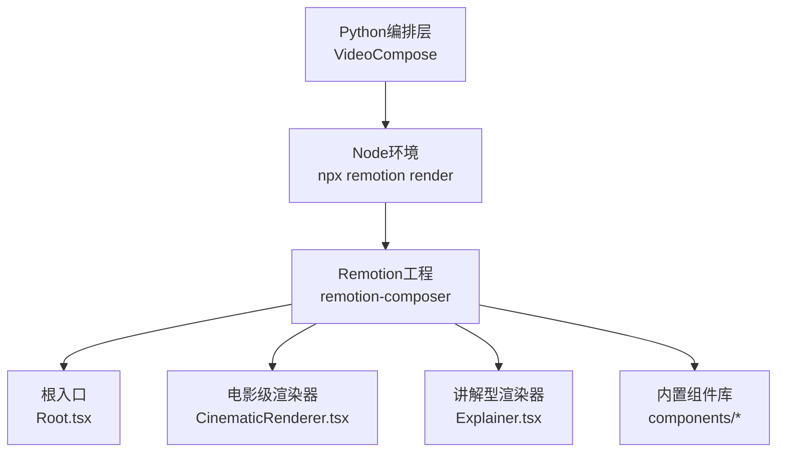
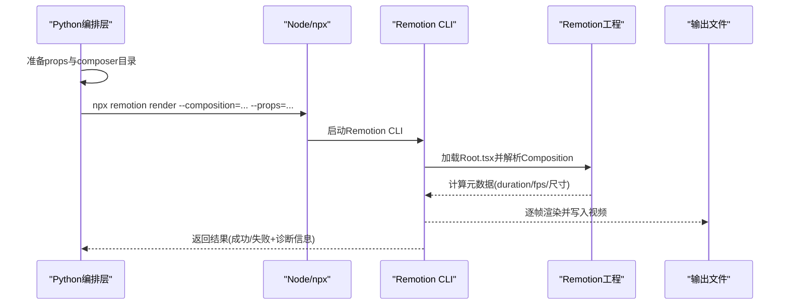
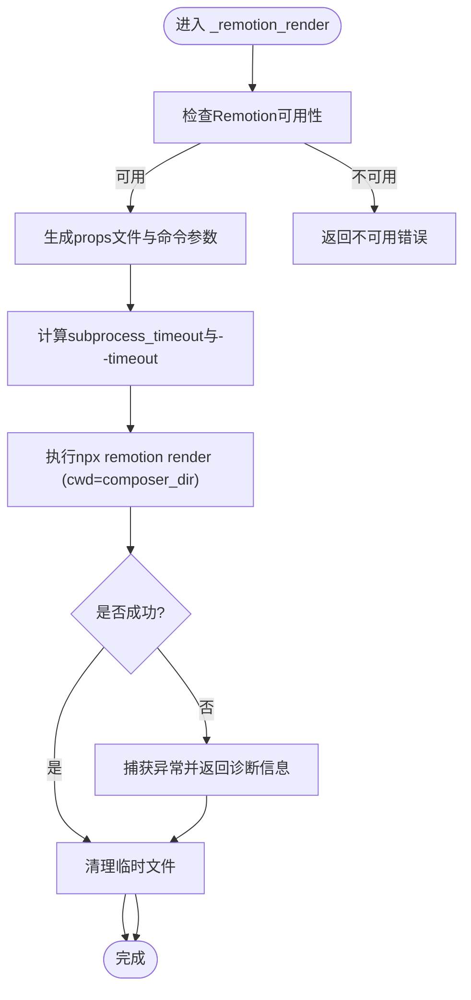
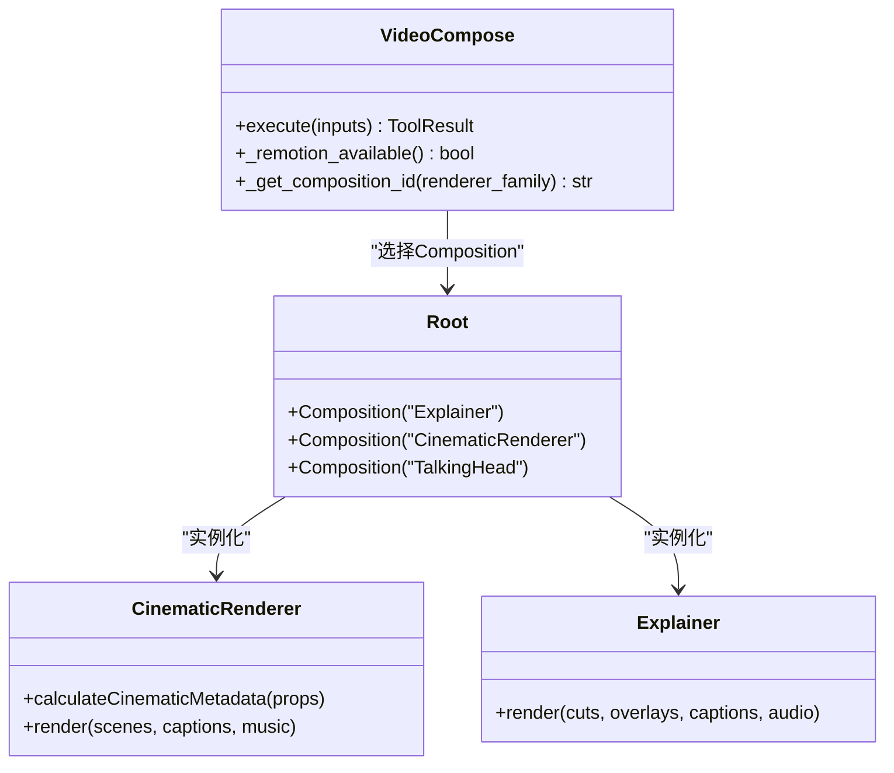
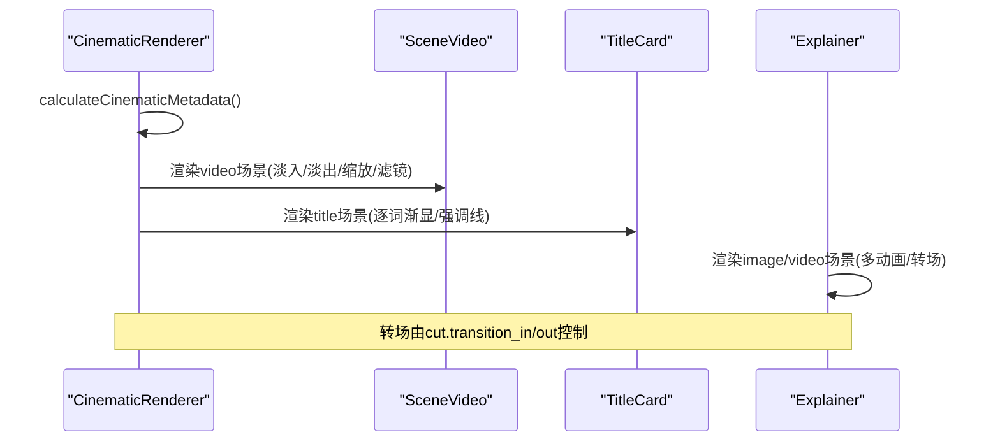
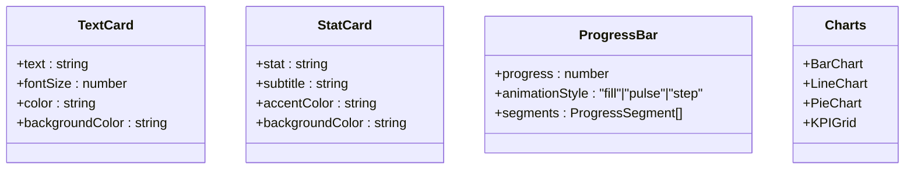
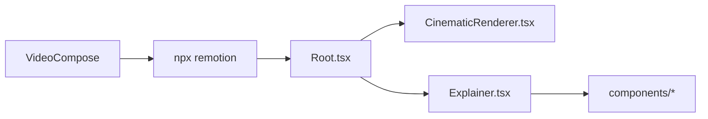

# Remotion渲染引擎

<cite>
**本文引用的文件**
- [tools/video/video_compose.py](file://tools/video/video_compose.py)
- [remotion-composer/src/Root.tsx](file://remotion-composer/src/Root.tsx)
- [remotion-composer/src/CinematicRenderer.tsx](file://remotion-composer/src/CinematicRenderer.tsx)
- [remotion-composer/src/Explainer.tsx](file://remotion-composer/src/Explainer.tsx)
- [remotion-composer/src/components/index.ts](file://remotion-composer/src/components/index.ts)
- [remotion-composer/src/components/TextCard.tsx](file://remotion-composer/src/components/TextCard.tsx)
- [remotion-composer/src/components/StatCard.tsx](file://remotion-composer/src/components/StatCard.tsx)
- [remotion-composer/src/components/ProgressBar.tsx](file://remotion-composer/src/components/ProgressBar.tsx)
- [tests/tools/test_remotion_diagnostics.py](file://tests/tools/test_remotion_diagnostics.py)
- [tests/tools/test_cinematic_remotion_adapter.py](file://tests/tools/test_cinematic_remotion_adapter.py)
- [tests/contracts/test_remotion_video_transition_contract.py](file://tests/contracts/test_remotion_video_transition_contract.py)
</cite>

## 目录
1. [简介](#简介)
2. [项目结构](#项目结构)
3. [核心组件](#核心组件)
4. [架构总览](#架构总览)
5. [详细组件分析](#详细组件分析)
6. [依赖关系分析](#依赖关系分析)
7. [性能考量](#性能考量)
8. [故障排查指南](#故障排查指南)
9. [结论](#结论)
10. [附录：配置与使用示例](#附录：配置与使用示例)

## 简介
本技术文档聚焦于OpenMontage中的Remotion渲染引擎，系统性解析VideoCompose类的_remotion_render方法实现、Remotion与Node.js环境的集成机制（npx调用、子进程管理、超时控制）、场景组件系统（文本卡片、统计卡片、图表、进度条等）以及性能优化策略（内存管理、渲染缓存、并行处理）。文档同时提供完整的配置选项与使用示例，帮助开发者高效进行高质量视频渲染。

## 项目结构
OpenMontage将“编排层”与“渲染层”解耦：
- 编排层：tools/video/video_compose.py中的VideoCompose负责选择运行时、准备参数、调用npx remotion render并管理子进程生命周期。
- 渲染层：remotion-composer为Remotion工程，包含多个Composition（如Explainer、CinematicRenderer、TalkingHead），并通过components目录暴露可复用UI组件。

**图示来源**
- [tools/video/video_compose.py:234-247](file://tools/video/video_compose.py#L234-L247)
- [remotion-composer/src/Root.tsx:135-167](file://remotion-composer/src/Root.tsx#L135-L167)
- [remotion-composer/src/CinematicRenderer.tsx:441-456](file://remotion-composer/src/CinematicRenderer.tsx#L441-L456)
- [remotion-composer/src/Explainer.tsx:1-35](file://remotion-composer/src/Explainer.tsx#L1-L35)

**章节来源**
- [tools/video/video_compose.py:1-29](file://tools/video/video_compose.py#L1-L29)
- [remotion-composer/src/Root.tsx:135-167](file://remotion-composer/src/Root.tsx#L135-L167)

## 核心组件
- VideoCompose（Python编排）
  - 能力声明：compose/render/remotion_render/burn_subtitles/overlay/encode
  - 运行时检测：_remotion_available/_ffmpeg_available/_hyperframes_available
  - 场景类型映射：RENDERER_FAMILY_MAP将renderer_family映射到Remotion Composition ID
  - 子进程管理：run_command执行npx命令，支持cwd、timeout、错误输出捕获
  - 超时策略：根据remotion_timeout_ms和场景数量计算子进程超时
- Remotion工程（TypeScript/React）
  - Root.tsx注册多个Composition（Explainer、CinematicRenderer、TalkingHead等）
  - CinematicRenderer.tsx负责视频片段、标题卡、字幕叠加、音频淡入淡出
  - Explainer.tsx负责数据可视化、卡片、动画背景、转场与覆盖层
  - components/*提供可复用UI组件（TextCard、StatCard、ProgressBar、图表等）

**章节来源**
- [tools/video/video_compose.py:58-78](file://tools/video/video_compose.py#L58-L78)
- [tools/video/video_compose.py:234-247](file://tools/video/video_compose.py#L234-L247)
- [tools/video/video_compose.py:729-763](file://tools/video/video_compose.py#L729-L763)
- [remotion-composer/src/Root.tsx:135-167](file://remotion-composer/src/Root.tsx#L135-L167)
- [remotion-composer/src/CinematicRenderer.tsx:441-456](file://remotion-composer/src/CinematicRenderer.tsx#L441-L456)
- [remotion-composer/src/Explainer.tsx:1-35](file://remotion-composer/src/Explainer.tsx#L1-L35)

## 架构总览
Remotion渲染流程从Python编排层开始，构建props并调用npx remotion render；Remotion在浏览器无头模式下逐帧渲染，最终输出视频文件。

**图示来源**
- [tools/video/video_compose.py:2074-2094](file://tools/video/video_compose.py#L2074-L2094)
- [remotion-composer/src/Root.tsx:135-167](file://remotion-composer/src/Root.tsx#L135-L167)
- [remotion-composer/src/CinematicRenderer.tsx:441-456](file://remotion-composer/src/CinematicRenderer.tsx#L441-L456)

## 详细组件分析

### VideoCompose._remotion_render实现要点
- 可用性检查：确保npx存在且remotion-composer的node_modules已安装
- 参数组装：将composition_data转为props文件，附加--composition与--props
- 超时控制：根据remotion_timeout_ms与场景数量计算子进程超时，避免提前杀死进程
- 错误诊断：捕获CalledProcessError并保留stderr/stdout尾部信息，便于定位Remotion内部错误
- 清理：渲染完成后删除临时props与public目录

**图示来源**
- [tools/video/video_compose.py:234-247](file://tools/video/video_compose.py#L234-L247)
- [tools/video/video_compose.py:2074-2119](file://tools/video/video_compose.py#L2074-L2119)

**章节来源**
- [tools/video/video_compose.py:234-247](file://tools/video/video_compose.py#L234-L247)
- [tools/video/video_compose.py:2074-2119](file://tools/video/video_compose.py#L2074-L2119)
- [tests/tools/test_remotion_diagnostics.py:28-78](file://tests/tools/test_remotion_diagnostics.py#L28-L78)

### React组件集成与场景类型映射
- 根入口Root.tsx注册多个Composition，每个Composition指定组件、时长、分辨率与默认props
- 编排层通过RENDERER_FAMILY_MAP将业务侧的renderer_family映射到具体Composition ID
- 对于cinematic-trailer/documentary-montage等，使用CinematicRenderer；explainer/product-reveal/screen-demo等使用Explainer

**图示来源**
- [tools/video/video_compose.py:729-763](file://tools/video/video_compose.py#L729-L763)
- [remotion-composer/src/Root.tsx:135-167](file://remotion-composer/src/Root.tsx#L135-L167)
- [remotion-composer/src/CinematicRenderer.tsx:441-456](file://remotion-composer/src/CinematicRenderer.tsx#L441-L456)
- [remotion-composer/src/Explainer.tsx:1-35](file://remotion-composer/src/Explainer.tsx#L1-L35)

**章节来源**
- [tools/video/video_compose.py:729-763](file://tools/video/video_compose.py#L729-L763)
- [remotion-composer/src/Root.tsx:135-167](file://remotion-composer/src/Root.tsx#L135-L167)

### 动画效果渲染与转场
- CinematicRenderer中SceneVideo对视频片段应用淡入淡出、缩放、裁剪与滤镜，结合toneGradient与叠加层营造电影感
- TitleCard实现逐词渐显、模糊过渡、顶部强调线与信号纹理装饰
- Explainer中ImageScene/VideoScene支持多种动画（zoom-in、ken-burns、pan等）与硬切/软切转场
- 测试契约验证了transitionIn/transitionOut与backgroundColor等字段在组件中的正确使用

**图示来源**
- [remotion-composer/src/CinematicRenderer.tsx:40-115](file://remotion-composer/src/CinematicRenderer.tsx#L40-L115)
- [remotion-composer/src/CinematicRenderer.tsx:162-386](file://remotion-composer/src/CinematicRenderer.tsx#L162-L386)
- [remotion-composer/src/Explainer.tsx:348-477](file://remotion-composer/src/Explainer.tsx#L348-L477)
- [tests/contracts/test_remotion_video_transition_contract.py:7-20](file://tests/contracts/test_remotion_video_transition_contract.py#L7-L20)

**章节来源**
- [remotion-composer/src/CinematicRenderer.tsx:40-115](file://remotion-composer/src/CinematicRenderer.tsx#L40-L115)
- [remotion-composer/src/CinematicRenderer.tsx:162-386](file://remotion-composer/src/CinematicRenderer.tsx#L162-L386)
- [remotion-composer/src/Explainer.tsx:348-477](file://remotion-composer/src/Explainer.tsx#L348-L477)
- [tests/contracts/test_remotion_video_transition_contract.py:7-20](file://tests/contracts/test_remotion_video_transition_contract.py#L7-L20)

### 场景组件系统
- 文本卡片（TextCard）：支持字体大小、颜色、背景色，弹簧动画入场
- 统计卡片（StatCard）：主数值与副标题分离显示，强调色突出
- 进度条（ProgressBar）：填充/脉冲/步进三种动画，支持分段与百分比标签
- 图表：柱状图、折线图、饼图、KPI网格，统一主题配色与动画风格
- 组件出口：components/index.ts集中导出，便于Explainer/CinematicRenderer引用

**图示来源**
- [remotion-composer/src/components/TextCard.tsx:1-54](file://remotion-composer/src/components/TextCard.tsx#L1-L54)
- [remotion-composer/src/components/StatCard.tsx:1-78](file://remotion-composer/src/components/StatCard.tsx#L1-L78)
- [remotion-composer/src/components/ProgressBar.tsx:1-285](file://remotion-composer/src/components/ProgressBar.tsx#L1-L285)
- [remotion-composer/src/components/charts/index.ts:1-4](file://remotion-composer/src/components/charts/index.ts#L1-L4)

**章节来源**
- [remotion-composer/src/components/index.ts:1-19](file://remotion-composer/src/components/index.ts#L1-L19)
- [remotion-composer/src/components/TextCard.tsx:1-54](file://remotion-composer/src/components/TextCard.tsx#L1-L54)
- [remotion-composer/src/components/StatCard.tsx:1-78](file://remotion-composer/src/components/StatCard.tsx#L1-L78)
- [remotion-composer/src/components/ProgressBar.tsx:1-285](file://remotion-composer/src/components/ProgressBar.tsx#L1-L285)

## 依赖关系分析
- Python编排层依赖Node/npx与remotion-composer工程
- Remotion工程依赖React、Remotion API与Google Fonts
- 组件间通过props传递数据，根入口统一管理Composition注册与默认值

**图示来源**
- [tools/video/video_compose.py:234-247](file://tools/video/video_compose.py#L234-L247)
- [remotion-composer/src/Root.tsx:135-167](file://remotion-composer/src/Root.tsx#L135-L167)
- [remotion-composer/src/Explainer.tsx:1-35](file://remotion-composer/src/Explainer.tsx#L1-L35)

**章节来源**
- [tools/video/video_compose.py:234-247](file://tools/video/video_compose.py#L234-L247)
- [remotion-composer/src/Root.tsx:135-167](file://remotion-composer/src/Root.tsx#L135-L167)

## 性能考量
- 子进程超时与渲染预算：根据remotion_timeout_ms与场景数量动态调整subprocess.timeout，避免过早杀死进程
- 资源隔离：在composer目录下执行npx，确保本地二进制解析正确，减少跨平台问题
- 错误诊断：保留stderr/stdout尾部信息，快速定位Remotion内部失败原因
- 渲染确定性：遵循Remotion逐帧渲染模型，避免依赖非确定性API（如Math.random或定时器），保证可重复渲染
- 组件动画优化：使用spring与interpolate进行时间驱动动画，减少重排重绘；背景层与前景层分离，降低复杂度过高导致的卡顿

[本节为通用指导，不直接分析具体文件]

## 故障排查指南
- 渲染失败诊断：当npx remotion render抛出CalledProcessError时，提取stderr/stdout尾部信息，定位具体错误原因
- 超时问题：若出现TimeoutExpired，提升remotion_timeout_ms并相应增大subprocess.timeout，确保浏览器初始化与delayRender有足够时间
- 场景数量影响：场景越多，建议提高超时阈值；测试表明50个hero_title场景对应750ms超时
- 直传场景保持：当composition_data中包含scenes数组时，应原样透传到Remotion，避免被转换逻辑修改

**章节来源**
- [tools/video/video_compose.py:2074-2119](file://tools/video/video_compose.py#L2074-L2119)
- [tests/tools/test_remotion_diagnostics.py:28-78](file://tests/tools/test_remotion_diagnostics.py#L28-L78)
- [tests/tools/test_cinematic_remotion_adapter.py:120-177](file://tests/tools/test_cinematic_remotion_adapter.py#L120-L177)

## 结论
OpenMontage的Remotion渲染引擎通过Python编排层与Remotion工程的清晰分层，实现了灵活的运行时选择、稳定的子进程管理与丰富的场景组件体系。借助超时控制、错误诊断与动画优化策略，开发者可以高效构建高质量的视频内容。建议在提案阶段锁定renderer_family，并在运行前验证环境可用性，以获得最佳渲染体验。

[本节为总结性内容，不直接分析具体文件]

## 附录：配置与使用示例
- 基本调用
  - operation: "remotion_render"
  - composition_data: 包含renderer_family与cuts/scenes
  - output_path: 输出视频路径
  - remotion_timeout_ms: 可选，用于调整浏览器初始化与渲染超时
- 场景类型映射
  - cinematic-trailer → CinematicRenderer
  - explainer-data/explainer-teacher → Explainer
  - presenter → TalkingHead
- 组件使用
  - text_card/stat_card/callout/comparison/progress/chart/bar_chart/line_chart/pie_chart/kpi_grid
  - 通过cut.type与cut.*字段传入组件所需属性
- 转场与背景
  - transition_in/transition_out支持"cut"/"none"硬切或其他软切
  - backgroundColor可用于设置场景底色

**章节来源**
- [tools/video/video_compose.py:80-207](file://tools/video/video_compose.py#L80-L207)
- [tools/video/video_compose.py:729-763](file://tools/video/video_compose.py#L729-L763)
- [remotion-composer/src/Explainer.tsx:558-775](file://remotion-composer/src/Explainer.tsx#L558-L775)
- [tests/contracts/test_remotion_video_transition_contract.py:7-20](file://tests/contracts/test_remotion_video_transition_contract.py#L7-L20)