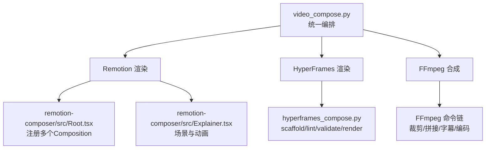
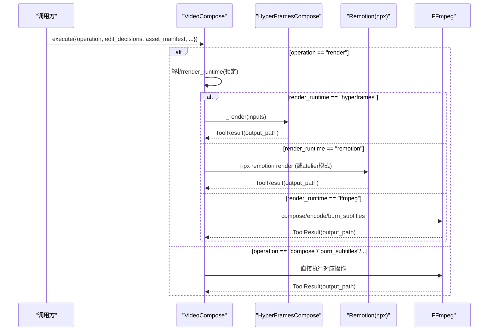
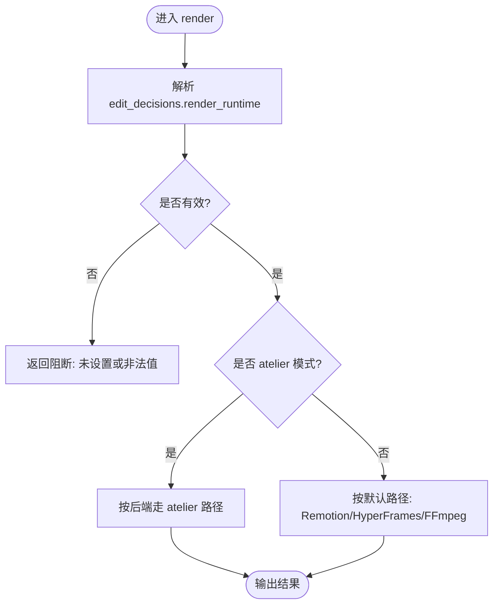
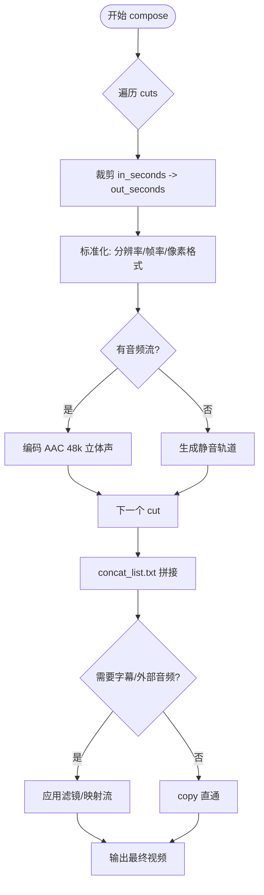
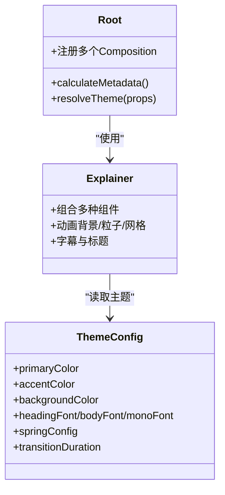
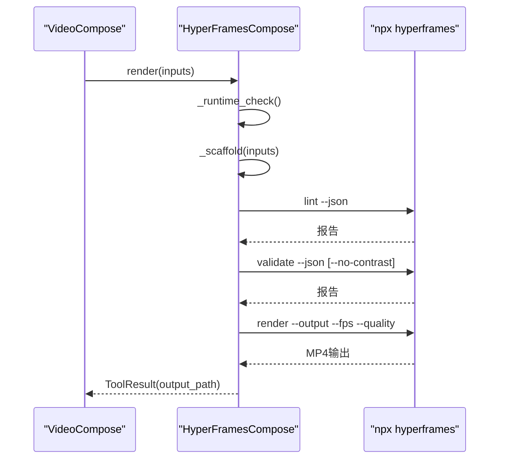
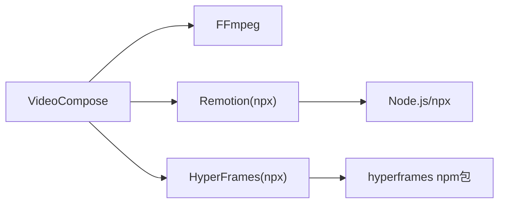

# 视频合成工具示例

<cite>
**本文引用的文件**
- [tools/video/video_compose.py](file://tools/video/video_compose.py)
- [tools/video/hyperframes_compose.py](file://tools/video/hyperframes_compose.py)
- [remotion-composer/src/index.tsx](file://remotion-composer/src/index.tsx)
- [remotion-composer/src/Root.tsx](file://remotion-composer/src/Root.tsx)
- [remotion-composer/src/Explainer.tsx](file://remotion-composer/src/Explainer.tsx)
- [skills/core/remotion.md](file://skills/core/remotion.md)
- [tests/qa/test_05_video_compose.py](file://tests/qa/test_05_video_compose.py)
</cite>

## 目录
1. [简介](#简介)
2. [项目结构](#项目结构)
3. [核心组件](#核心组件)
4. [架构总览](#架构总览)
5. [详细组件分析](#详细组件分析)
6. [依赖关系分析](#依赖关系分析)
7. [性能考量](#性能考量)
8. [故障排查指南](#故障排查指南)
9. [结论](#结论)
10. [附录](#附录)

## 简介
本文件面向OpenMontage视频合成工具，聚焦VideoCompose类的多运行时路由机制（Remotion、HyperFrames、FFmpeg）、编辑决策处理与资产清单解析、以及三大渲染路径的技术细节。文档同时覆盖：
- FFmpeg集成：片段裁剪、音频流处理、字幕烧录、转场效果
- Remotion渲染器：React组件集成、场景类型映射、动画与性能优化
- HyperFrames：HTML/CSS/GSAP动画引擎集成、动态内容生成、响应式设计与浏览器兼容性

目标是帮助开发者理解复杂视频合成的实现模式与最佳实践，并提供可操作的配置参数说明、错误处理策略和性能调优建议。

## 项目结构
OpenMontage将“视频合成”能力拆分为三个并行渲染后端，并由统一的编排入口进行调度：
- tools/video/video_compose.py：统一编排层，负责路由到Remotion/HyperFrames/FFmpeg，并处理编辑决策、资产清单、字幕、音频等
- tools/video/hyperframes_compose.py：HyperFrames工作区脚手架、校验、渲染管线
- remotion-composer/*：Remotion工程，包含根注册、主题系统、多种Composition（Explainer、CinematicRenderer、TalkingHead等）

图表来源
- [tools/video/video_compose.py:337-360](file://tools/video/video_compose.py#L337-L360)
- [tools/video/hyperframes_compose.py:459-488](file://tools/video/hyperframes_compose.py#L459-L488)
- [remotion-composer/src/Root.tsx:135-333](file://remotion-composer/src/Root.tsx#L135-L333)

章节来源
- [tools/video/video_compose.py:1-29](file://tools/video/video_compose.py#L1-L29)
- [tools/video/hyperframes_compose.py:1-14](file://tools/video/hyperframes_compose.py#L1-L14)
- [remotion-composer/src/index.tsx:1-5](file://remotion-composer/src/index.tsx#L1-L5)

## 核心组件
- VideoCompose：提供compose/render/remotion_render/burn_subtitles/overlay/encode等操作；根据edit_decisions.render_runtime锁定渲染后端；内置预检查（交付承诺、幻灯片风险、renderer_family缺失阻断）；支持Atelier（手工定制）Remotion渲染路径。
- HyperFramesCompose：提供doctor/scaffold/lint/validate/inspect/check/render/render_existing/add_block等操作；严格的环境探测与npm包可用性检查；工作区脚手架与质量门禁。
- Remotion工程：Root注册多个Composition（Explainer、CinematicRenderer、TalkingHead、TitledVideo、EndTag等），提供主题系统与默认值；Explainer承载丰富的组件与动画。

章节来源
- [tools/video/video_compose.py:58-232](file://tools/video/video_compose.py#L58-L232)
- [tools/video/hyperframes_compose.py:51-236](file://tools/video/hyperframes_compose.py#L51-L236)
- [remotion-composer/src/Root.tsx:24-121](file://remotion-composer/src/Root.tsx#L24-L121)

## 架构总览
VideoCompose作为编排器，依据edit_decisions.render_runtime（提案阶段锁定）选择具体渲染器：
- remotion：React帧级渲染，适合图像/动画/组件/混合内容
- hyperframes：HTML/CSS/GSAP渲染，适合动效排版、产品宣传、网站转视频
- ffmpeg：纯视频剪辑/拼接/字幕/编码，适合简单视频流水线

图表来源
- [tools/video/video_compose.py:337-360](file://tools/video/video_compose.py#L337-L360)
- [tools/video/video_compose.py:1517-1599](file://tools/video/video_compose.py#L1517-L1599)
- [tools/video/hyperframes_compose.py:766-876](file://tools/video/hyperframes_compose.py#L766-L876)

章节来源
- [tools/video/video_compose.py:1517-1599](file://tools/video/video_compose.py#L1517-L1599)
- [tools/video/hyperframes_compose.py:766-876](file://tools/video/hyperframes_compose.py#L766-L876)

## 详细组件分析

### VideoCompose：多运行时路由与编辑决策处理
- 路由策略：
  - 强制使用提案阶段锁定的render_runtime，禁止静默切换
  - atelier模式：Remotion允许手工定制项目（bespoke.entry/composition_id），HyperFrames也支持保留已存在index.html的渲染
- 编辑决策与资产清单：
  - 解析edit_decisions.cuts、metadata.compose_target/profile、subtitles、audio等
  - 通过asset_manifest将ID解析为实际路径，并在各后端中拷贝/链接资源
- 预检查：
  - 交付承诺验证（motion要求与静态片段比例）
  - 幻灯片风险评估（避免单调静态画面）
  - renderer_family必须设置（未设置则阻断）

图表来源
- [tools/video/video_compose.py:1517-1599](file://tools/video/video_compose.py#L1517-L1599)
- [tools/video/video_compose.py:1415-1515](file://tools/video/video_compose.py#L1415-L1515)

章节来源
- [tools/video/video_compose.py:1415-1515](file://tools/video/video_compose.py#L1415-L1515)
- [tools/video/video_compose.py:1517-1599](file://tools/video/video_compose.py#L1517-L1599)

### FFmpeg集成：裁剪、音频、字幕、转场
- 片段裁剪与标准化：
  - 对每个cut进行-in/out时间裁剪，重编码为一致分辨率/帧率/像素格式，确保concat安全
  - 无音频流的素材注入静音轨道，保证拼接一致性
- 音频处理：
  - 外部混音替换（原子替换临时文件后rename）
  - 自动检测源是否有音频流，必要时生成AAC立体声
- 字幕烧录：
  - 支持ASS样式，路径转义与force_style应用
  - 独立burn_subtitles操作，便于后期叠加
- 转场与缩放：
  - fit_mode=pad/cover控制填充或裁切
  - speed!=1时调整音视频时序（setpts/atempo）

图表来源
- [tools/video/video_compose.py:438-728](file://tools/video/video_compose.py#L438-L728)
- [tools/video/video_compose.py:2709-2744](file://tools/video/video_compose.py#L2709-L2744)

章节来源
- [tools/video/video_compose.py:438-728](file://tools/video/video_compose.py#L438-L728)
- [tools/video/video_compose.py:2709-2744](file://tools/video/video_compose.py#L2709-L2744)

### Remotion渲染器：React组件集成、场景映射、动画与性能
- 场景类型映射：
  - RENDERER_FAMILY_MAP将renderer_family映射到Remotion Composition ID（Explainer、CinematicRenderer、TalkingHead等）
  - Root.tsx注册多个Composition，定义默认尺寸、帧率、props与元数据计算
- 动画与组件：
  - Explainer整合TextCard、StatCard、CalloutBox、ComparisonCard、图表、进度条、字幕、标题、AnimeScene等
  - 主题系统（ThemeConfig）从playbook或metadata推导颜色、字体、弹簧动画参数、过渡时长
- 性能优化要点：
  - 使用useCurrentFrame()与interpolate()做帧级动画，避免CSS动画在渲染中的不一致
  - 注意useVideoConfig().durationInFrames返回的是整段composition时长，需在子Sequence中传入sceneDurationSeconds计算有效时长
  - 渲染串行执行，避免并发导致内存压力

图表来源
- [remotion-composer/src/Root.tsx:24-121](file://remotion-composer/src/Root.tsx#L24-L121)
- [remotion-composer/src/Root.tsx:135-333](file://remotion-composer/src/Root.tsx#L135-L333)
- [remotion-composer/src/Explainer.tsx:1-200](file://remotion-composer/src/Explainer.tsx#L1-L200)

章节来源
- [remotion-composer/src/Root.tsx:24-121](file://remotion-composer/src/Root.tsx#L24-L121)
- [remotion-composer/src/Root.tsx:135-333](file://remotion-composer/src/Root.tsx#L135-L333)
- [remotion-composer/src/Explainer.tsx:1-200](file://remotion-composer/src/Explainer.tsx#L1-L200)
- [skills/core/remotion.md:324-342](file://skills/core/remotion.md#L324-L342)

### HyperFrames：HTML/CSS/GSAP动画引擎集成
- 环境探测与可用性：
  - Node>=22、FFmpeg、npx、npm包hyperframes可解析且CLI可执行
  - 进程级缓存避免重复探测开销
- 工作区脚手架与质量门禁：
  - scaffold_workspace生成index.html、CSS变量、DESIGN.md、assets拷贝
  - lint/validate/inspect/check提供静态与运行时质量检查
  - render/render_existing支持现有工作区的保真渲染
- 动态内容生成：
  - 将edit_decisions.cuts转换为HTML clip元素，附带GSAP时间线
  - 音频引用（旁白/音乐）解析与拷贝
  - 风格桥接：playbook→CSS自定义属性+设计说明

图表来源
- [tools/video/hyperframes_compose.py:766-876](file://tools/video/hyperframes_compose.py#L766-L876)
- [tools/video/hyperframes_compose.py:532-621](file://tools/video/hyperframes_compose.py#L532-L621)
- [tools/video/hyperframes_compose.py:977-1200](file://tools/video/hyperframes_compose.py#L977-L1200)

章节来源
- [tools/video/hyperframes_compose.py:252-421](file://tools/video/hyperframes_compose.py#L252-L421)
- [tools/video/hyperframes_compose.py:532-621](file://tools/video/hyperframes_compose.py#L532-L621)
- [tools/video/hyperframes_compose.py:766-876](file://tools/video/hyperframes_compose.py#L766-L876)
- [tools/video/hyperframes_compose.py:977-1200](file://tools/video/hyperframes_compose.py#L977-L1200)

## 依赖关系分析
- VideoCompose依赖：
  - FFmpeg（裁剪/拼接/字幕/编码）
  - Remotion（npx remotion render，需node_modules）
  - HyperFrames（npx hyperframes，需Node>=22与npm包）
- HyperFramesCompose依赖：
  - Node.js、FFmpeg、npx、hyperframes npm包
  - 内部调用lint/validate/inspect/check/render等CLI子命令
- Remotion工程依赖：
  - React/Remotion生态，主题系统与组件库

图表来源
- [tools/video/video_compose.py:234-265](file://tools/video/video_compose.py#L234-L265)
- [tools/video/hyperframes_compose.py:252-421](file://tools/video/hyperframes_compose.py#L252-L421)

章节来源
- [tools/video/video_compose.py:234-265](file://tools/video/video_compose.py#L234-L265)
- [tools/video/hyperframes_compose.py:252-421](file://tools/video/hyperframes_compose.py#L252-L421)

## 性能考量
- Remotion：
  - 使用帧级动画（useCurrentFrame/interpolate），避免CSS动画在渲染中的不一致
  - 注意useVideoConfig().durationInFrames语义，正确计算子序列时长
  - 串行渲染以避免内存压力
- FFmpeg：
  - 统一segment规格（分辨率/帧率/像素格式）以安全concat
  - 无音频流时注入静音轨道，避免拼接失败
  - 合理CRF/preset平衡质量与速度
- HyperFrames：
  - 环境探测缓存减少重复开销
  - 质量门禁（lint/validate/check）提前发现问题，降低渲染失败成本

[本节为通用指导，不直接分析具体文件]

## 故障排查指南
- 常见错误与处理：
  - 未设置render_runtime：阻断并提示必须在提案阶段设置
  - 未知render_runtime：返回阻断并列出合法值
  - HyperFrames不可用：返回结构化阻塞信息，禁止静默降级
  - FFmpeg输入不存在/字幕文件缺失：明确错误信息与路径
- 测试用例参考：
  - 带字幕的合成与独立字幕烧录流程

章节来源
- [tools/video/video_compose.py:1546-1567](file://tools/video/video_compose.py#L1546-L1567)
- [tools/video/hyperframes_compose.py:766-779](file://tools/video/hyperframes_compose.py#L766-L779)
- [tools/video/video_compose.py:2709-2744](file://tools/video/video_compose.py#L2709-L2744)
- [tests/qa/test_05_video_compose.py:112-153](file://tests/qa/test_05_video_compose.py#L112-L153)

## 结论
OpenMontage的视频合成通过VideoCompose实现了统一编排与多运行时路由，结合Remotion的React组件化能力、HyperFrames的HTML/CSS/GSAP动画能力以及FFmpeg的高效媒体处理能力，覆盖了从简单剪辑到复杂动效排版的广泛需求。严格的提案阶段锁定与环境探测确保了渲染路径的可控性与可追溯性，配合预检查与质量门禁提升了成品质量与稳定性。

[本节为总结，不直接分析具体文件]

## 附录
- 关键配置项速查：
  - VideoCompose.operation：compose/render/remotion_render/burn_subtitles/overlay/encode
  - edit_decisions.render_runtime：remotion/hyperframes/ffmpeg（提案阶段锁定）
  - profile/compose_target：目标分辨率与fit模式（pad/cover）
  - subtitle_style：ASS样式（字体、大小、颜色、边距、对齐）
  - HyperFrames.quality/fps/strict/skip_contrast/strict_check/snapshots
- 参考测试与技能文档：
  - tests/qa/test_05_video_compose.py：字幕合成与烧录
  - skills/core/remotion.md：Remotion动画与约束

[本节为补充信息，不直接分析具体文件]