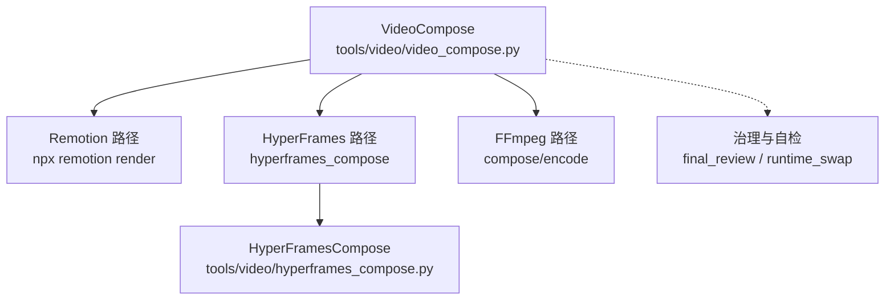
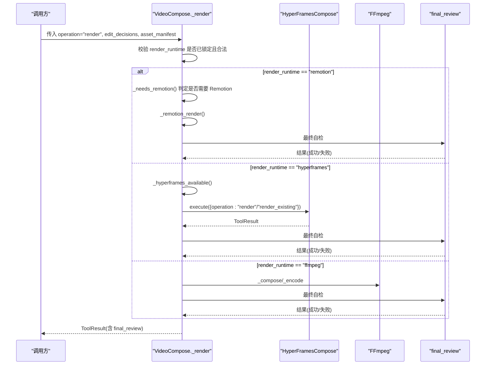
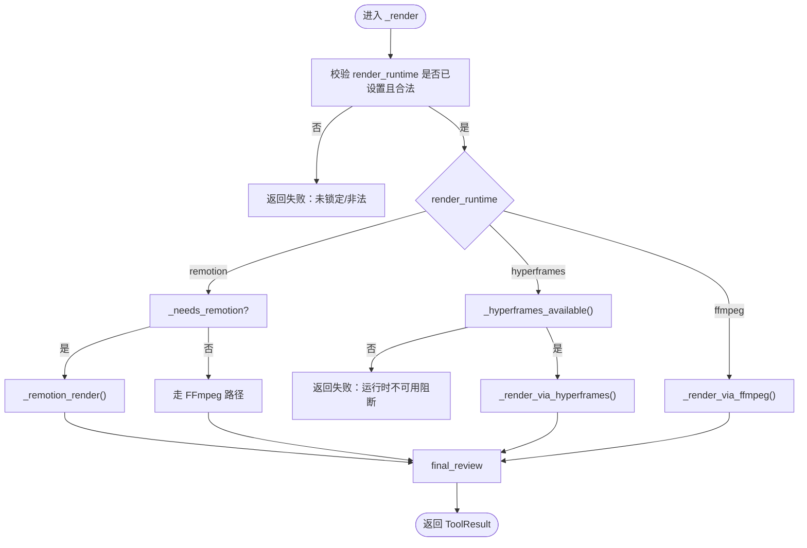
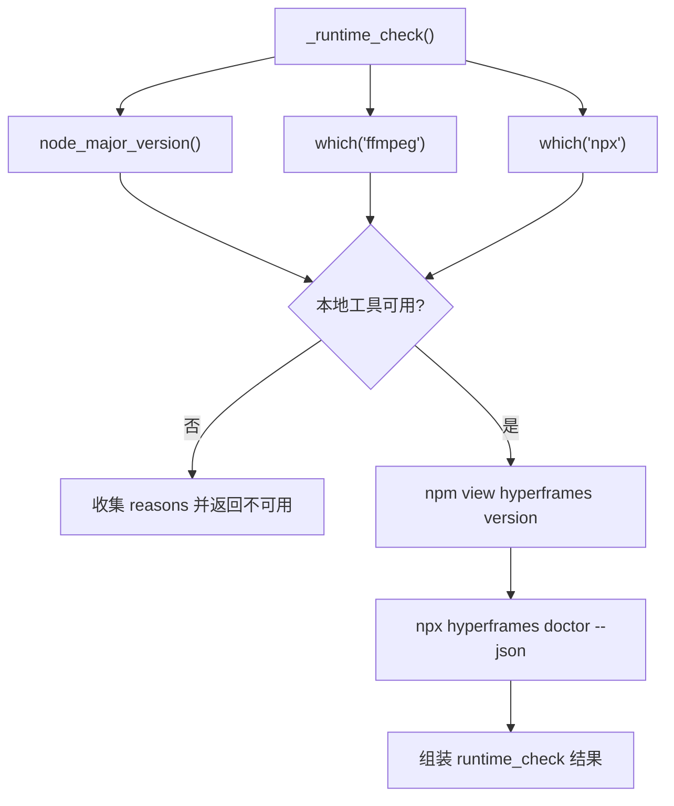
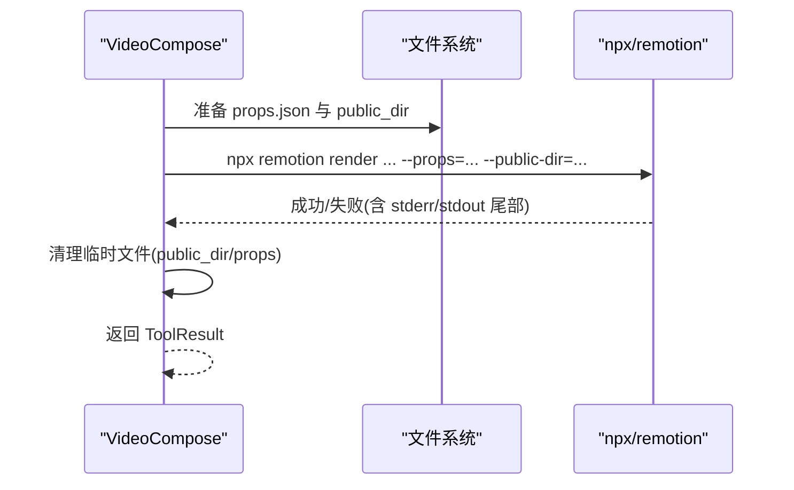
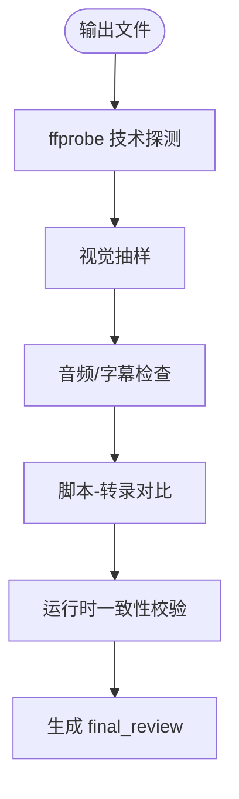
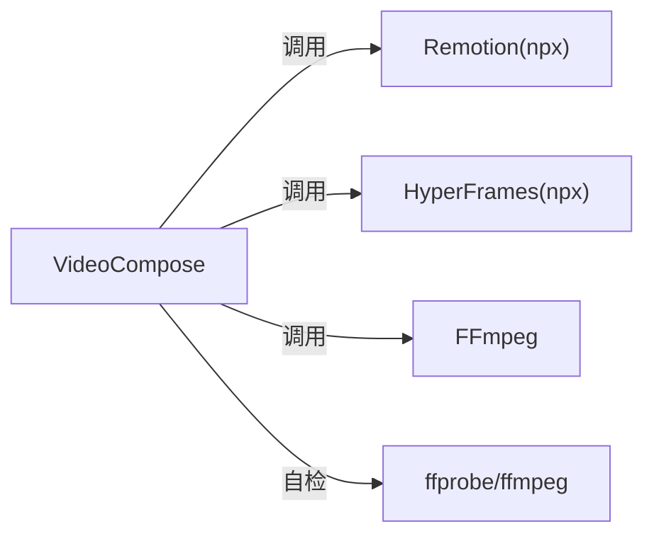

# 运行时路由机制

<cite>
**本文引用的文件**
- [tools/video/video_compose.py](file://tools/video/video_compose.py)
- [tools/video/hyperframes_compose.py](file://tools/video/hyperframes_compose.py)
- [skills/meta/animation-runtime-selector.md](file://skills/meta/animation-runtime-selector.md)
- [tests/tools/test_hyperframes_compose.py](file://tests/tools/test_hyperframes_compose.py)
</cite>

## 目录
1. [简介](#简介)
2. [项目结构](#项目结构)
3. [核心组件](#核心组件)
4. [架构总览](#架构总览)
5. [详细组件分析](#详细组件分析)
6. [依赖关系分析](#依赖关系分析)
7. [性能考量](#性能考量)
8. [故障排除指南](#故障排除指南)
9. [结论](#结论)
10. [附录](#附录)

## 简介
本技术文档聚焦于视频合成运行时的路由机制，围绕 VideoCompose 类的多运行时选择与切换逻辑展开。系统支持三种渲染引擎：Remotion（React 帧级渲染）、HyperFrames（HTML/CSS/GSAP 渲染）与 FFmpeg（纯视频拼接/裁剪）。文档将深入说明：
- 运行时可用性检测：环境检查、依赖验证、能力探测
- 治理规则：运行时锁定、禁止静默切换、错误处理
- 不同运行时的适用场景与性能特征
- 完整配置选项与生产环境稳定运行的故障排除建议

## 项目结构
OpenMontage 的视频合成由工具层驱动，核心入口为 tools/video/video_compose.py；HyperFrames 的独立实现位于 tools/video/hyperframes_compose.py；运行时选择策略与规范在 skills/meta/animation-runtime-selector.md 中定义；相关契约与行为约束通过测试用例覆盖。

图表来源
- [tools/video/video_compose.py:1517-1750](file://tools/video/video_compose.py#L1517-L1750)
- [tools/video/hyperframes_compose.py:459-488](file://tools/video/hyperframes_compose.py#L459-L488)

章节来源
- [tools/video/video_compose.py:1-29](file://tools/video/video_compose.py#L1-L29)
- [tools/video/hyperframes_compose.py:1-14](file://tools/video/hyperframes_compose.py#L1-L14)

## 核心组件
- VideoCompose：统一编排入口，负责解析 edit_decisions、资产清单、音频与字幕，依据 render_runtime 路由到具体引擎，并执行前后质量门禁与最终自检。
- HyperFramesCompose：HyperFrames 运行时专用工具，提供环境探针、工作区脚手架、lint/validate/check、渲染等能力。
- 治理与自检：final_review 对输出进行 ffprobe 探测、视觉抽样、音频核对、脚本-转录对比，以及运行时一致性校验（proposal vs edit）。

章节来源
- [tools/video/video_compose.py:58-78](file://tools/video/video_compose.py#L58-L78)
- [tools/video/hyperframes_compose.py:51-105](file://tools/video/hyperframes_compose.py#L51-L105)
- [tools/video/video_compose.py:2285-2400](file://tools/video/video_compose.py#L2285-L2400)

## 架构总览
运行时路由的核心流程如下：
- 读取 edit_decisions.render_runtime（提案阶段锁定），若未设置或非法则直接失败
- 根据运行时类型进入对应分支：
  - Remotion：优先用于图像、动画、组件场景、转场与混合内容；若失败不静默降级
  - HyperFrames：HTML/CSS/GSAP 风格化强、注册块驱动、网站转视频等
  - FFmpeg：仅用于简单拼接/裁剪或明确指定
- 每个路径均执行最终自检（ffprobe、抽样、音频/字幕、转录比对、运行时一致性）

图表来源
- [tools/video/video_compose.py:1517-1750](file://tools/video/video_compose.py#L1517-L1750)
- [tools/video/video_compose.py:1752-1882](file://tools/video/video_compose.py#L1752-L1882)
- [tools/video/video_compose.py:1884-1942](file://tools/video/video_compose.py#L1884-L1942)
- [tools/video/video_compose.py:2285-2400](file://tools/video/video_compose.py#L2285-L2400)

## 详细组件分析

### VideoCompose 运行时选择与切换
- 运行时锁定与校验：
  - 必须从 edit_decisions.render_runtime 读取，未设置或非法值立即失败
  - 不允许在 compose 阶段静默切换（例如 Remotion 失败后自动降级 FFmpeg）
- 选择策略：
  - Remotion：默认优先，适用于图像、动画、组件、转场与混合内容；_needs_remotion 快速判断
  - HyperFrames：当 render_runtime 显式为 hyperframes 时进入该路径，需先做可用性检查
  - FFmpeg：仅在 render_runtime 为 ffmpeg 或 Remotion 不可用且走 fallback 时使用
- 关键方法：
  - _render：主路由入口，按 render_runtime 分发
  - _render_via_hyperframes：封装 HyperFrames 调用与最终自检
  - _render_via_ffmpeg：封装 FFmpeg 调用与最终自检
  - _remotion_render：调用 npx remotion render，处理 props/public-dir/profile/timeout
  - _needs_remotion：基于 cuts 内容与类型判断是否需要 Remotion

图表来源
- [tools/video/video_compose.py:1517-1750](file://tools/video/video_compose.py#L1517-L1750)
- [tools/video/video_compose.py:1752-1882](file://tools/video/video_compose.py#L1752-L1882)
- [tools/video/video_compose.py:1884-1942](file://tools/video/video_compose.py#L1884-L1942)
- [tools/video/video_compose.py:1375-1413](file://tools/video/video_compose.py#L1375-L1413)

章节来源
- [tools/video/video_compose.py:1517-1750](file://tools/video/video_compose.py#L1517-L1750)
- [tools/video/video_compose.py:1752-1882](file://tools/video/video_compose.py#L1752-L1882)
- [tools/video/video_compose.py:1884-1942](file://tools/video/video_compose.py#L1884-L1942)
- [tools/video/video_compose.py:1375-1413](file://tools/video/video_compose.py#L1375-L1413)

### HyperFrames 运行时可用性检测
- 环境检查：Node.js >= 22、FFmpeg、npx 是否在 PATH
- 包可解析性：npm view hyperframes version 成功（缓存进程内结果）
- CLI 探测：npx hyperframes doctor 可执行（缓存进程内结果）
- 返回结构包含 runtime_available、reasons、npm_package_version、cli_probe_status 等

图表来源
- [tools/video/hyperframes_compose.py:252-324](file://tools/video/hyperframes_compose.py#L252-L324)
- [tools/video/hyperframes_compose.py:327-417](file://tools/video/hyperframes_compose.py#L327-L417)

章节来源
- [tools/video/hyperframes_compose.py:252-324](file://tools/video/hyperframes_compose.py#L252-L324)
- [tools/video/hyperframes_compose.py:327-417](file://tools/video/hyperframes_compose.py#L327-L417)

### Remotion 渲染路径
- 前置条件：npx 存在、composer 工程与 node_modules 存在
- Props 与主题：从 playbook 提取主题色/字体/动效参数注入 themeConfig
- 资源暂存：将 file:// 或绝对路径媒体拷贝至 public_dir，避免 OffthreadVideo 拒绝 file:// 源
- 命令构建：npx remotion render <entry> <composition_id> <output> --props=... [--public-dir=...] [--width/--height] [--timeout=ms]
- 超时控制：根据 scene_count 与 remotion_timeout_ms 动态调整子进程超时
- 失败处理：捕获 CalledProcessError/TimeoutExpired，输出诊断尾部信息；禁止静默降级

图表来源
- [tools/video/video_compose.py:1944-2136](file://tools/video/video_compose.py#L1944-L2136)

章节来源
- [tools/video/video_compose.py:1944-2136](file://tools/video/video_compose.py#L1944-L2136)

### FFmpeg 路径
- 用途：纯视频剪辑、拼接、字幕烧录、编码与重采样
- 片段标准化：统一分辨率、像素格式、帧率，确保 concat-copy 安全
- 无音频流处理：探测并注入静音轨道，保证段间一致
- 字幕与音频复用：按需添加滤镜或 copy，必要时重新编码
- 最终自检：同样执行 final_review

章节来源
- [tools/video/video_compose.py:438-728](file://tools/video/video_compose.py#L438-L728)
- [tools/video/video_compose.py:1884-1942](file://tools/video/video_compose.py#L1884-L1942)

### 最终自检与运行时一致性校验
- 技术探测：ffprobe 容器/流/时长/分辨率/FPS/编解码器/文件大小
- 视觉抽样：抽取若干帧，检测黑帧、覆盖物异常、缺失资源、文字不可读
- 音频/字幕：核对音轨存在、时长漂移、字幕烧录
- 脚本-转录对比：词级对齐，检测 TTS 标点泄漏与低匹配度
- 运行时一致性：比较 proposal_packet.production_plan.render_runtime 与 edit_decisions.render_runtime，标记 runtime_swap_detected

图表来源
- [tools/video/video_compose.py:2285-2400](file://tools/video/video_compose.py#L2285-L2400)
- [tools/video/video_compose.py:2497-2559](file://tools/video/video_compose.py#L2497-L2559)

章节来源
- [tools/video/video_compose.py:2285-2400](file://tools/video/video_compose.py#L2285-L2400)
- [tools/video/video_compose.py:2497-2559](file://tools/video/video_compose.py#L2497-L2559)

## 依赖关系分析
- VideoCompose 依赖：
  - FFmpeg（基础依赖）
  - Node.js/npx + remotion-composer（Remotion 路径）
  - HyperFrames npm 包（HyperFrames 路径）
- 耦合与内聚：
  - 路由逻辑集中在 VideoCompose，各运行时实现解耦
  - HyperFrames 内部自包含环境探测与 CLI 调用
- 外部集成点：
  - npx remotion render
  - npx hyperframes（doctor/lint/validate/check/render）
  - ffprobe/ffmpeg

图表来源
- [tools/video/video_compose.py:1517-1750](file://tools/video/video_compose.py#L1517-L1750)
- [tools/video/hyperframes_compose.py:459-488](file://tools/video/hyperframes_compose.py#L459-L488)

章节来源
- [tools/video/video_compose.py:1517-1750](file://tools/video/video_compose.py#L1517-L1750)
- [tools/video/hyperframes_compose.py:459-488](file://tools/video/hyperframes_compose.py#L459-L488)

## 性能考量
- Remotion：
  - 适合复杂动画与混合内容；受浏览器启动与渲染耗时影响
  - 可通过 remotion_timeout_ms 调优；并发与场景数影响子进程超时
- HyperFrames：
  - HTML/CSS/GSAP 渲染，首屏与资源加载影响整体耗时
  - 使用 quality/fps 控制渲染质量与速度
- FFmpeg：
  - 纯视频操作速度快；但片段标准化与重编码会引入 CPU 开销
  - 合理设置 profile、crf、preset 平衡质量与速度

[本节为通用指导，无需特定文件引用]

## 故障排除指南
- 运行时不可用（HyperFrames）：
  - 现象：_hyperframes_available 返回 False，_render_via_hyperframes 返回阻断错误
  - 排查：确认 Node.js >= 22、FFmpeg、npx 可用；npm 可解析 hyperframes 包；CLI doctor 通过
  - 参考：_runtime_check 与 get_info 中的 setup_offer
- Remotion 渲染失败：
  - 现象：npx remotion render 报错或超时
  - 排查：检查 composer 工程与 node_modules；public_dir 是否存在；props 路径是否正确；适当提高 remotion_timeout_ms
- FFmpeg 拼接/编码失败：
  - 现象：concat 报错或输出异常
  - 排查：确认片段分辨率/像素格式/帧率一致；无音频流时已注入静音轨道；profile 与滤镜组合正确
- 运行时一致性违规：
  - 现象：final_review 检测到 runtime_swap_detected
  - 排查：确保 edit_decisions.render_runtime 与 proposal_packet.production_plan.render_runtime 一致；如需变更，需在提案阶段记录决策并获批准

章节来源
- [tools/video/hyperframes_compose.py:365-417](file://tools/video/hyperframes_compose.py#L365-L417)
- [tools/video/video_compose.py:1752-1780](file://tools/video/video_compose.py#L1752-L1780)
- [tools/video/video_compose.py:1944-2136](file://tools/video/video_compose.py#L1944-L2136)
- [tools/video/video_compose.py:2497-2559](file://tools/video/video_compose.py#L2497-L2559)

## 结论
VideoCompose 以“提案阶段锁定运行时”为核心治理原则，严格禁止静默切换，并通过完备的环境探测、能力检查与最终自检保障生产稳定性。Remotion、HyperFrames、FFmpeg 三者各司其职：Remotion 擅长复杂动画与混合内容，HyperFrames 擅长 HTML/CSS/GSAP 风格化与注册块驱动，FFmpeg 专注高效视频剪辑与编码。结合明确的配置选项与故障排除流程，可在不同场景下选择最优渲染引擎并确保交付质量。

[本节为总结，无需特定文件引用]

## 附录

### 配置选项速览
- VideoCompose（render 操作）
  - edit_decisions：必需，包含 cuts、render_runtime、renderer_family、metadata 等
  - asset_manifest：必需，用于将 cuts.source 的 ID 解析为文件路径
  - profile：媒体规格名（如 youtube_landscape、tiktok_vertical）
  - options.subtitle_burn：是否烧录字幕
  - options.two_pass_encode：是否两遍编码
  - codec/crf/preset：编码器与质量参数
  - remotion_timeout_ms：Remotion 渲染超时（毫秒）
  - public_dir：Remotion 公共目录（可选）
- HyperFramesCompose
  - operation：render/render_existing/lint/validate/inspect/check/doctor/scaffold_workspace/add_block
  - workspace_path：工作区路径
  - output_path：输出 MP4 路径
  - quality/fps/strict/skip_contrast/strict_check/snapshots：渲染与质检开关
- FFmpeg（compose/encode）
  - 通过 profile 与滤镜链控制分辨率、帧率、像素格式、字幕与音频复用

章节来源
- [tools/video/video_compose.py:80-207](file://tools/video/video_compose.py#L80-L207)
- [tools/video/hyperframes_compose.py:107-220](file://tools/video/hyperframes_compose.py#L107-L220)

### 运行时选择策略与最佳实践
- 何时选择 Remotion：
  - 需要 React 场景组件（text_card、stat_card、chart、comparison 等）
  - 需要逐字级字幕高亮/卡拉 OK
  - 需要 Avatar/口型同步/演讲者
- 何时选择 HyperFrames：
  - 强调动效排版、产品宣传片、网站转视频
  - 需要使用注册块（data-chart、grain-overlay 等）
  - 需要可编辑的浏览器原生 3D 世界/自由视角飞行
- 何时选择 FFmpeg：
  - 仅需视频拼接/裁剪/编码，无复杂合成需求
- 提案阶段必须呈现两种可用运行时并等待用户批准，记录决策日志

章节来源
- [skills/meta/animation-runtime-selector.md:26-75](file://skills/meta/animation-runtime-selector.md#L26-L75)
- [tools/video/video_compose.py:1375-1413](file://tools/video/video_compose.py#L1375-L1413)

### 治理规则与契约
- 运行时锁定：edit_decisions.render_runtime 必须在提案阶段设定并携带至 compose
- 禁止静默切换：任一运行时失败不得自动降级到其他引擎，必须上报并等待审批
- 运行时一致性：final_review 比较 proposal 与 edit 的 render_runtime，标记 swap 并记录问题
- 契约强制：schema 要求 render_runtime 必填，测试用例保障契约不被绕过

章节来源
- [tools/video/video_compose.py:1517-1567](file://tools/video/video_compose.py#L1517-L1567)
- [tools/video/video_compose.py:2497-2559](file://tools/video/video_compose.py#L2497-L2559)
- [tests/tools/test_hyperframes_compose.py:510-531](file://tests/tools/test_hyperframes_compose.py#L510-L531)
- [tests/tools/test_hyperframes_compose.py:900-934](file://tests/tools/test_hyperframes_compose.py#L900-L934)