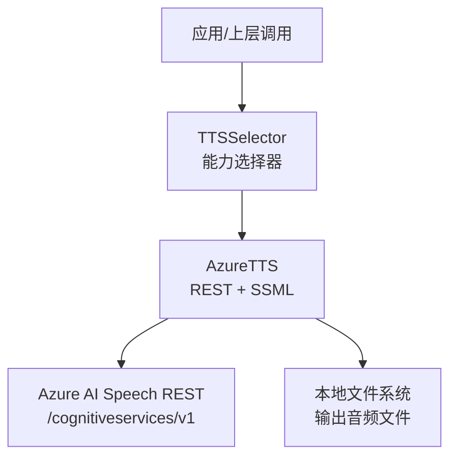
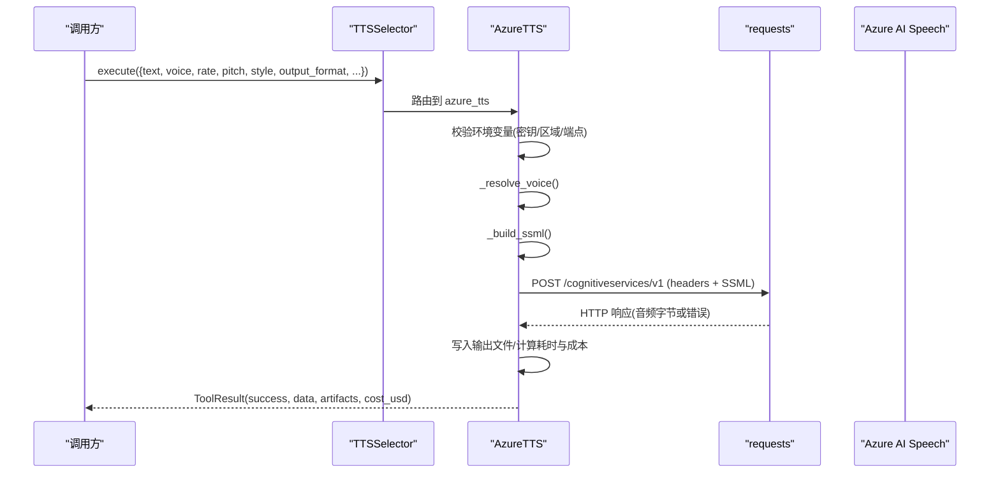
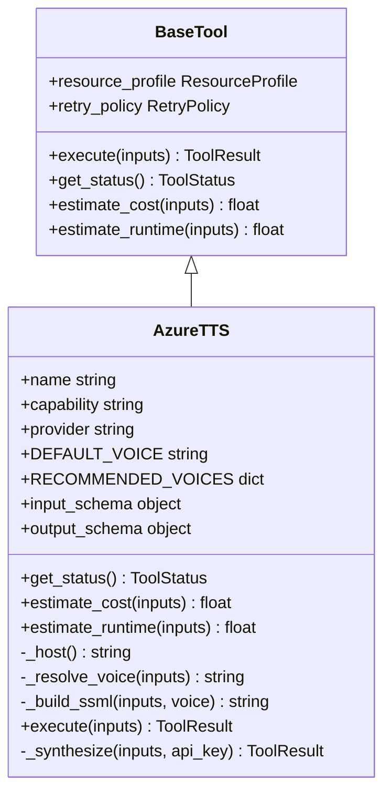
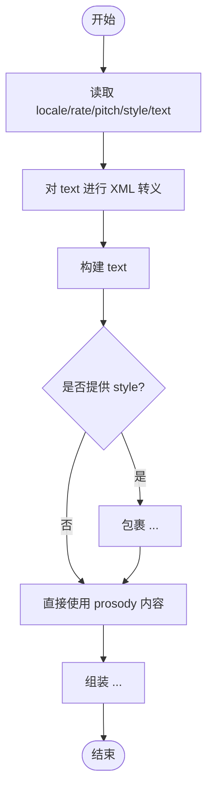
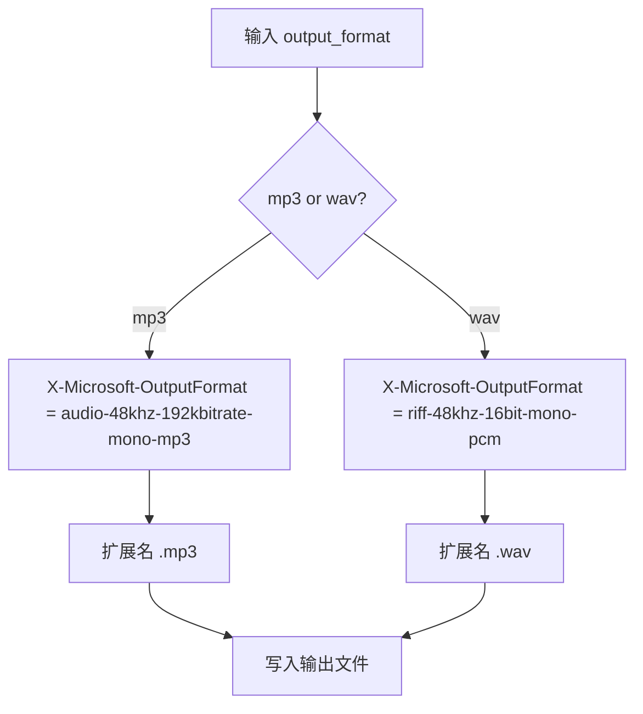
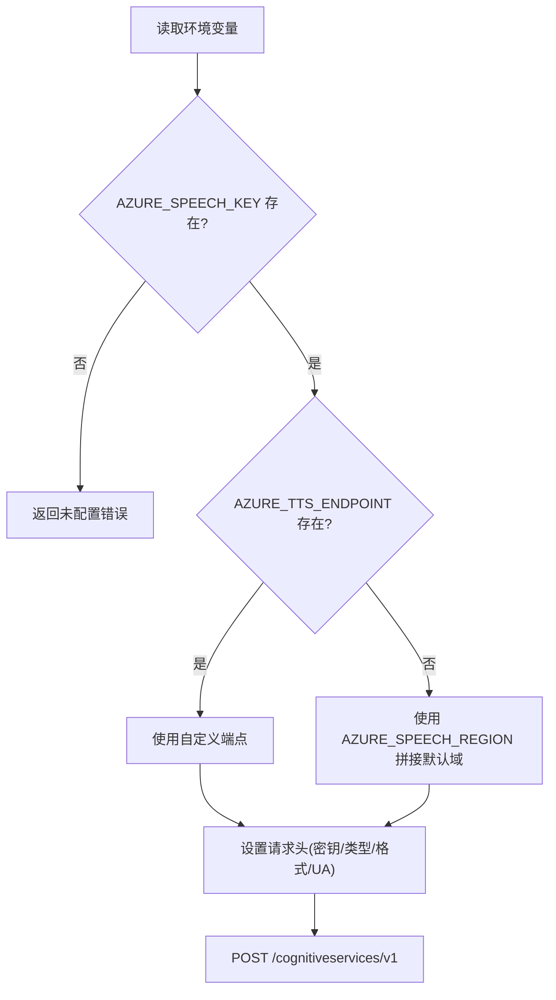
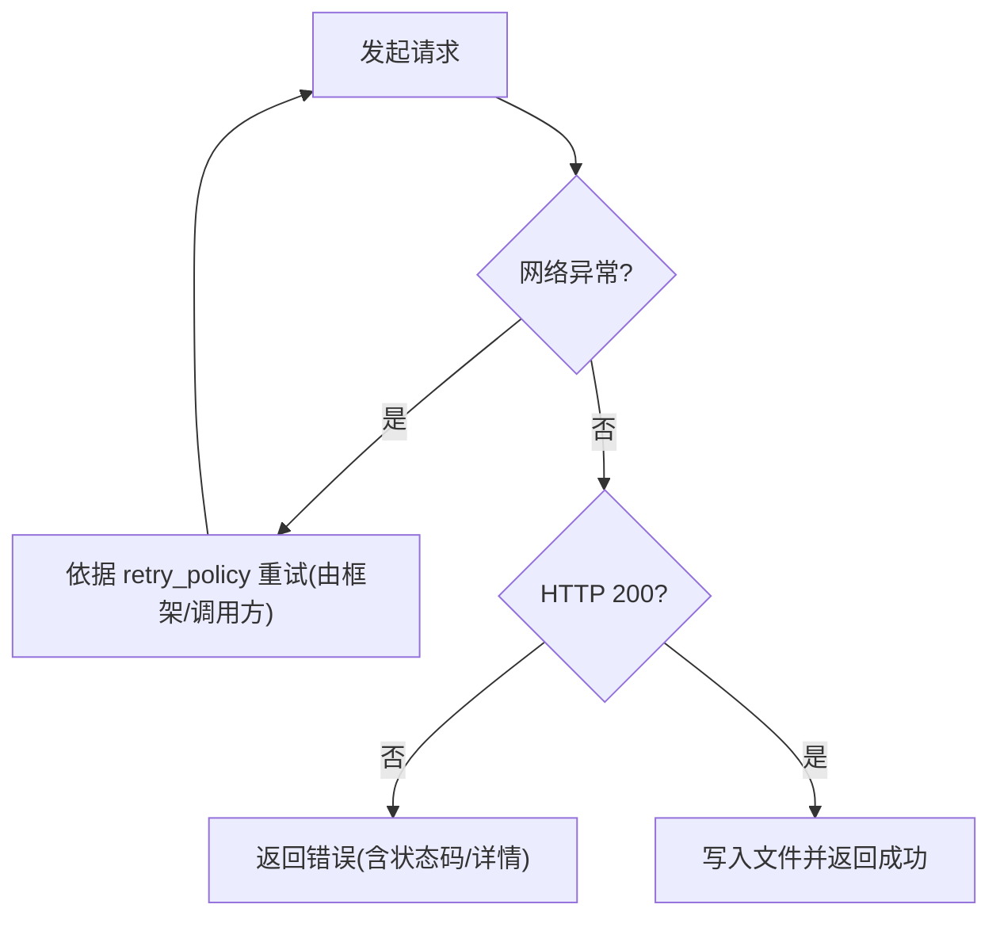
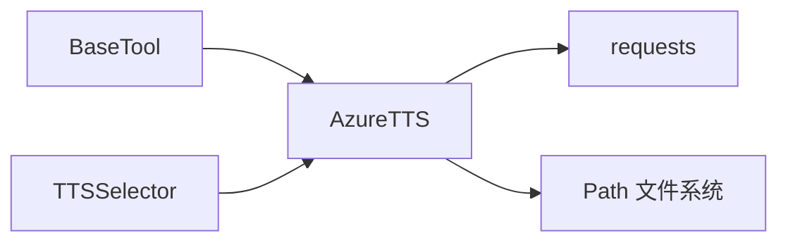

# Azure TTS实现详解

<cite>
**本文引用的文件**
- [tools/audio/azure_tts.py](file://tools/audio/azure_tts.py)
- [tests/tools/test_azure_tts.py](file://tests/tools/test_azure_tts.py)
- [tools/base_tool.py](file://tools/base_tool.py)
- [tools/audio/tts_selector.py](file://tools/audio/tts_selector.py)
</cite>

## 目录
1. [简介](#简介)
2. [项目结构](#项目结构)
3. [核心组件](#核心组件)
4. [架构总览](#架构总览)
5. [详细组件分析](#详细组件分析)
6. [依赖关系分析](#依赖关系分析)
7. [性能与成本](#性能与成本)
8. [故障排除指南](#故障排除指南)
9. [结论](#结论)
10. [附录：API调用示例与配置说明](#附录api调用示例与配置说明)

## 简介
本文件面向开发者，系统性解析 OpenMontage 中的 Azure TTS（文本转语音）工具实现。重点覆盖以下方面：
- AzureTTS 类的核心架构与职责边界
- 通过 REST API 调用 Azure AI Speech 的完整流程
- SSML（Speech Synthesis Markup Language）构建与高级控制（语速、音调、情感表达）
- 语音选择机制与别名映射
- 音频格式转换与编码参数（MP3/WAV）
- 认证配置、端点解析与请求头设置
- 错误处理策略、重试机制与成本估算
- 完整的 API 调用示例、配置选项与排错建议

## 项目结构
Azure TTS 能力以“工具”形式提供，遵循统一的 BaseTool 契约，便于注册、发现与编排。关键文件与角色如下：
- tools/audio/azure_tts.py：Azure TTS 工具实现，封装 REST 调用、SSML 构建、输出写入等逻辑
- tests/tools/test_azure_tts.py：针对 Azure TTS 的单元测试，覆盖状态检查、SSML 构造、执行路径与错误场景
- tools/base_tool.py：基础工具抽象，定义 ToolResult、RetryPolicy、资源画像、执行模式等通用契约
- tools/audio/tts_selector.py：TTS 能力选择器，自动发现并路由到具体提供者（如 azure_tts）

图表来源
- [tools/audio/tts_selector.py:15-163](file://tools/audio/tts_selector.py#L15-L163)
- [tools/audio/azure_tts.py:221-287](file://tools/audio/azure_tts.py#L221-L287)

章节来源
- [tools/audio/azure_tts.py:1-288](file://tools/audio/azure_tts.py#L1-L288)
- [tools/audio/tts_selector.py:1-200](file://tools/audio/tts_selector.py#L1-L200)
- [tools/base_tool.py:1-200](file://tools/base_tool.py#L1-L200)

## 核心组件
- AzureTTS：继承自 BaseTool，实现 text_to_speech、voice_selection、ssml_support、prosody_control 等能力；负责环境校验、SSML 构建、REST 调用、结果落盘与成本估算。
- TTSSelector：按 capability="tts" 自动发现可用提供者，支持用户偏好路由与降级。
- BaseTool：统一工具契约（输入/输出 schema、重试策略、资源画像、执行模式、结果对象等）。

章节来源
- [tools/audio/azure_tts.py:42-174](file://tools/audio/azure_tts.py#L42-L174)
- [tools/audio/tts_selector.py:15-163](file://tools/audio/tts_selector.py#L15-L163)
- [tools/base_tool.py:110-139](file://tools/base_tool.py#L110-L139)

## 架构总览
AzureTTS 的工作流如下：
- 环境校验：读取 AZURE_SPEECH_KEY、AZURE_SPEECH_REGION 或 AZURE_TTS_ENDPOINT
- 语音选择：将别名映射为 Azure 短名或直接使用传入的短名
- SSML 构建：根据 locale、rate、pitch、style 生成标准 SSML
- REST 调用：POST 到 /cognitiveservices/v1，携带订阅密钥、内容类型与输出格式头
- 结果处理：成功时写音频文件，返回 ToolResult；失败时返回错误信息

图表来源
- [tools/audio/azure_tts.py:176-287](file://tools/audio/azure_tts.py#L176-L287)
- [tools/audio/tts_selector.py:158-200](file://tools/audio/tts_selector.py#L158-L200)

## 详细组件分析

### AzureTTS 类核心设计
- 能力声明与元数据：name、capability、provider、stability、execution_mode、determinism、resource_profile、retry_policy、idempotency_key_fields、side_effects 等
- 可用性判定：get_status() 基于环境变量判断是否可用
- 成本估算：estimate_cost() 按字符数乘以单价（约 $16/百万字符）
- 运行时估计：estimate_runtime() 固定估算值（典型片段远小于实时）
- 端点解析：_host() 优先使用 AZURE_TTS_ENDPOINT，否则按 AZURE_SPEECH_REGION 拼接默认域名
- 语音选择：_resolve_voice() 支持别名映射（andrew/ava/guy/jenny 等）与全量短名透传
- SSML 构建：_build_ssml() 生成 speak/voice/prosody/mstts:express-as 结构，并对文本进行 XML 转义，属性值使用安全引号包裹
- 执行流程：execute() 校验环境 -> 调用 _synthesize() -> 记录耗时与成本 -> 返回 ToolResult
- 合成实现：_synthesize() 使用 requests.post 发送 SSML，设置 Ocp-Apim-Subscription-Key、Content-Type、X-Microsoft-OutputFormat、User-Agent；处理非 200 响应与网络异常；成功则写入音频文件并返回结果

图表来源
- [tools/base_tool.py:110-139](file://tools/base_tool.py#L110-L139)
- [tools/audio/azure_tts.py:42-174](file://tools/audio/azure_tts.py#L42-L174)
- [tools/audio/azure_tts.py:176-287](file://tools/audio/azure_tts.py#L176-L287)

章节来源
- [tools/audio/azure_tts.py:42-287](file://tools/audio/azure_tts.py#L42-L287)

### SSML 构建与高级控制
- 语速控制：通过 prosody 的 rate 属性（例如 "-8%"、"+5%"、"slow"/"medium"）
- 音调调节：通过 prosody 的 pitch 属性（例如 "-2st"、"+1st"）
- 情感表达：可选地用 mstts:express-as 包裹 prosody，指定 style（如 "narration-professional"、"calm"、"newscast"）
- 语言区域：speak 根节点 xml:lang 由 locale 决定（默认 en-US）
- 安全转义：文本使用 XML 转义，属性值使用安全引号包装，避免注入与格式错误

图表来源
- [tools/audio/azure_tts.py:203-219](file://tools/audio/azure_tts.py#L203-L219)

章节来源
- [tools/audio/azure_tts.py:203-219](file://tools/audio/azure_tts.py#L203-L219)
- [tests/tools/test_azure_tts.py:122-165](file://tests/tools/test_azure_tts.py#L122-L165)

### 音频格式转换与编码参数
- 容器选择：mp3 或 wav（默认 mp3）
- 对应 Azure 输出格式：
  - MP3：audio-48khz-192kbitrate-mono-mp3
  - WAV：riff-48khz-16bit-mono-pcm
- 扩展名：根据容器选择 .mp3 或 .wav
- 写入：将响应体二进制直接写入 output_path 指定的文件

图表来源
- [tools/audio/azure_tts.py:37-39](file://tools/audio/azure_tts.py#L37-L39)
- [tools/audio/azure_tts.py:241-287](file://tools/audio/azure_tts.py#L241-L287)

章节来源
- [tools/audio/azure_tts.py:37-39](file://tools/audio/azure_tts.py#L37-L39)
- [tools/audio/azure_tts.py:241-287](file://tools/audio/azure_tts.py#L241-L287)
- [tests/tools/test_azure_tts.py:252-269](file://tests/tools/test_azure_tts.py#L252-L269)

### 认证配置、端点解析与请求头
- 认证：通过 AZURE_SPEECH_KEY 作为订阅密钥
- 端点解析：
  - 若设置 AZURE_TTS_ENDPOINT，则使用该完整主机地址
  - 否则按 AZURE_SPEECH_REGION 拼接 https://{region}.tts.speech.microsoft.com
- 请求头：
  - Ocp-Apim-Subscription-Key：订阅密钥
  - Content-Type：application/ssml+xml
  - X-Microsoft-OutputFormat：根据输出格式选择
  - User-Agent：OpenMontage-azure-tts

图表来源
- [tools/audio/azure_tts.py:176-195](file://tools/audio/azure_tts.py#L176-L195)
- [tools/audio/azure_tts.py:241-256](file://tools/audio/azure_tts.py#L241-L256)

章节来源
- [tools/audio/azure_tts.py:176-195](file://tools/audio/azure_tts.py#L176-L195)
- [tools/audio/azure_tts.py:241-256](file://tools/audio/azure_tts.py#L241-L256)
- [tests/tools/test_azure_tts.py:166-172](file://tests/tools/test_azure_tts.py#L166-L172)

### 错误处理策略与重试机制
- 错误分类：
  - 网络异常：捕获 requests.RequestException，返回 ToolResult 错误信息
  - HTTP 错误：非 200 状态码，返回包含状态码与响应摘要的错误信息
- 重试策略：
  - 工具级 retry_policy 定义最大重试次数与可重试错误类型（ConnectionError、Timeout、429、503）
  - 注意：当前 _synthesize 内部未显式实现重试循环，重试行为由上层工具框架或调用方依据 retry_policy 管理
- 幂等键：idempotency_key_fields 包含 text、voice、rate、pitch、style、output_format，用于去重与缓存

图表来源
- [tools/audio/azure_tts.py:165-168](file://tools/audio/azure_tts.py#L165-L168)
- [tools/audio/azure_tts.py:258-270](file://tools/audio/azure_tts.py#L258-L270)

章节来源
- [tools/audio/azure_tts.py:165-168](file://tools/audio/azure_tts.py#L165-L168)
- [tools/audio/azure_tts.py:258-270](file://tools/audio/azure_tts.py#L258-L270)
- [tests/tools/test_azure_tts.py:271-295](file://tests/tools/test_azure_tts.py#L271-L295)

### 成本估算算法
- 单价：约 $16/百万字符（Standard 层级）
- 公式：cost = len(text) × (16.0 / 1,000,000)，四舍五入到小数点后四位
- 集成：在 execute 成功后设置 result.cost_usd

章节来源
- [tools/audio/azure_tts.py:173-184](file://tools/audio/azure_tts.py#L173-L184)
- [tests/tools/test_azure_tts.py:62-66](file://tests/tools/test_azure_tts.py#L62-L66)

## 依赖关系分析
- AzureTTS 依赖 BaseTool 提供的统一接口与数据结构
- TTSSelector 通过能力发现机制动态选择 AzureTTS 或其他 TTS 提供者
- 运行时依赖 requests 库进行 HTTP 调用
- 文件系统依赖 Path 进行输出写入

图表来源
- [tools/base_tool.py:110-139](file://tools/base_tool.py#L110-L139)
- [tools/audio/tts_selector.py:158-163](file://tools/audio/tts_selector.py#L158-L163)
- [tools/audio/azure_tts.py:241-287](file://tools/audio/azure_tts.py#L241-L287)

章节来源
- [tools/audio/azure_tts.py:241-287](file://tools/audio/azure_tts.py#L241-L287)
- [tools/audio/tts_selector.py:158-163](file://tools/audio/tts_selector.py#L158-L163)
- [tools/base_tool.py:110-139](file://tools/base_tool.py#L110-L139)

## 性能与成本
- 性能特征：
  - 同步执行（ExecutionMode.SYNC），适合单次合成任务
  - 典型片段耗时远低于实时，estimate_runtime 固定估算为 10 秒
  - 网络 I/O 为主，CPU/GPU 占用低
- 成本特征：
  - 按字符计费，单价约 $16/百万字符
  - 可通过 estimate_cost 预估成本，便于预算控制

章节来源
- [tools/audio/azure_tts.py:49-52](file://tools/audio/azure_tts.py#L49-L52)
- [tools/audio/azure_tts.py:162-164](file://tools/audio/azure_tts.py#L162-L164)
- [tools/audio/azure_tts.py:183-188](file://tools/audio/azure_tts.py#L183-L188)
- [tools/audio/azure_tts.py:173-184](file://tools/audio/azure_tts.py#L173-L184)

## 故障排除指南
- 未配置凭据：
  - 现象：execute 返回 success=False，提示未配置
  - 排查：确保设置 AZURE_SPEECH_KEY，并至少设置 AZURE_SPEECH_REGION 或 AZURE_TTS_ENDPOINT
- 网络异常：
  - 现象：连接错误或超时
  - 排查：检查网络连通性；依据 retry_policy 进行重试（由框架或调用方管理）
- HTTP 错误：
  - 现象：非 200 状态码（如 401 Unauthorized）
  - 排查：确认订阅密钥与区域/端点正确；查看响应详情定位原因
- 输出文件问题：
  - 现象：文件未写入或路径无效
  - 排查：确认 output_path 有效且父目录可创建；检查磁盘权限

章节来源
- [tools/audio/azure_tts.py:221-239](file://tools/audio/azure_tts.py#L221-L239)
- [tools/audio/azure_tts.py:258-270](file://tools/audio/azure_tts.py#L258-L270)
- [tests/tools/test_azure_tts.py:177-183](file://tests/tools/test_azure_tts.py#L177-L183)
- [tests/tools/test_azure_tts.py:271-295](file://tests/tools/test_azure_tts.py#L271-L295)

## 结论
AzureTTS 以标准化工具形态集成 Azure AI Speech REST API，提供高可用的文本转语音能力。其优势包括：
- 清晰的 SSML 构建与高级控制（语速、音调、情感）
- 灵活的语音选择与别名映射
- 稳定的认证与端点解析机制
- 明确的错误处理与重试策略
- 精确的成本估算与输出格式支持（MP3/WAV）
建议在需要高质量神经语音合成的场景中优先选用该工具，并结合 TTSSelector 进行多提供者路由与降级。

## 附录：API调用示例与配置说明

### 配置与环境变量
- 必需：
  - AZURE_SPEECH_KEY：Azure Speech 资源的订阅密钥
- 二选一：
  - AZURE_SPEECH_REGION：Speech 资源所在区域（如 eastus）
  - AZURE_TTS_ENDPOINT：自定义 TTS 主机地址（如 https://<region>.tts.speech.microsoft.com）

章节来源
- [tools/audio/azure_tts.py:57-65](file://tools/audio/azure_tts.py#L57-L65)
- [tools/audio/azure_tts.py:176-195](file://tools/audio/azure_tts.py#L176-L195)

### 输入参数说明
- text：待合成文本（必填）
- voice：语音短名或别名（andrew/ava/guy/jenny/brandon），默认 en-US-AndrewMultilingualNeural
- rate：语速（如 "-8%"、"+5%"、"slow"/"medium"），默认 "0%"
- pitch：音调（如 "-2st"、"+1st"），默认 "0%"
- style：情感风格（如 "narration-professional"、"calm"、"newscast"），可选
- locale：BCP-47 语言区域（默认 en-US）
- output_format：输出容器 mp3 或 wav（默认 mp3）
- output_path：输出文件路径（可选）

章节来源
- [tools/audio/azure_tts.py:103-149](file://tools/audio/azure_tts.py#L103-L149)

### 调用示例（概念性）
- 基本调用：
  - 输入：{text: "你好世界", voice: "jenny", output_format: "mp3"}
  - 行为：生成 SSML，POST 到 Azure TTS，返回 MP3 音频文件
- 带情感风格：
  - 输入：{text: "欢迎使用", style: "calm", voice: "andrew"}
  - 行为：在 SSML 中包裹 express-as 标签，生成更自然的语气
- 切换输出格式：
  - 输入：{text: "测试", output_format: "wav"}
  - 行为：设置 X-Microsoft-OutputFormat 为 WAV 格式，输出 PCM 音频

章节来源
- [tests/tools/test_azure_tts.py:185-218](file://tests/tools/test_azure_tts.py#L185-L218)
- [tests/tools/test_azure_tts.py:252-269](file://tests/tools/test_azure_tts.py#L252-L269)

### 输出结果说明
- provider：提供者名称（azure）
- voice：实际使用的语音短名
- output：输出文件路径
- format：Azure 输出格式标识
- text_length：文本长度（字符数）
- cost_usd：估算成本（美元）
- duration_seconds：执行耗时（秒）

章节来源
- [tools/audio/azure_tts.py:151-160](file://tools/audio/azure_tts.py#L151-L160)
- [tools/audio/azure_tts.py:276-287](file://tools/audio/azure_tts.py#L276-L287)