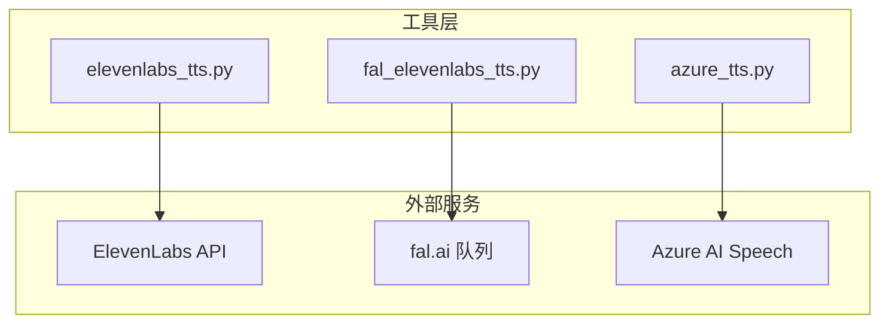
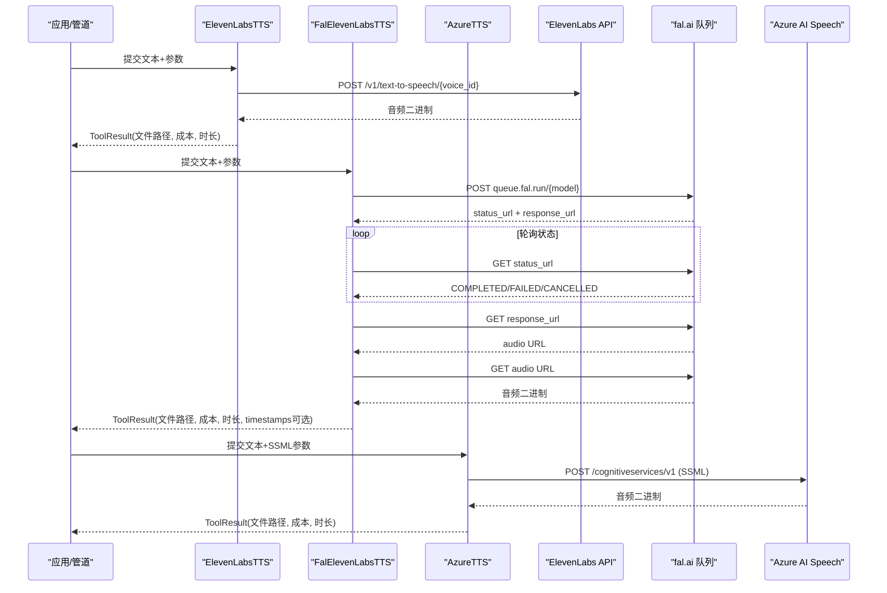
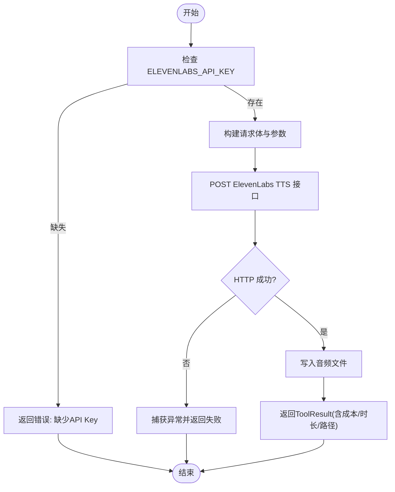
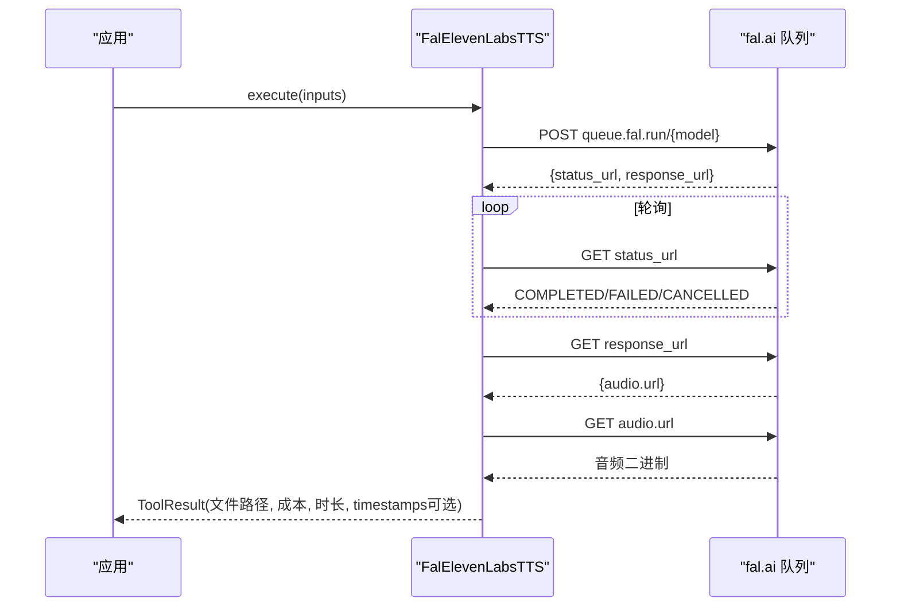
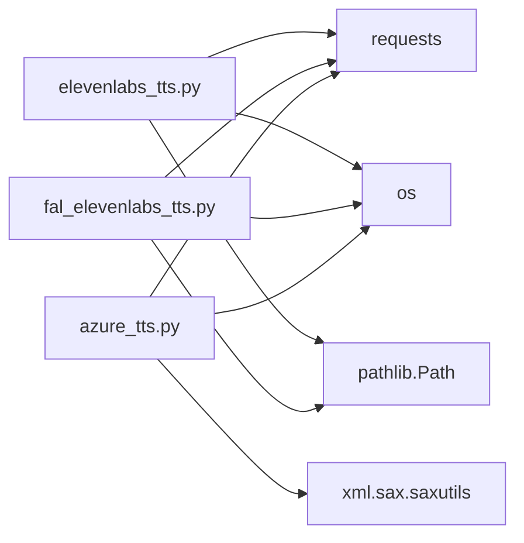

# ElevenLabs TTS实现详解

<cite>
**本文引用的文件**
- [tools/audio/elevenlabs_tts.py](file://tools/audio/elevenlabs_tts.py)
- [tools/audio/fal_elevenlabs_tts.py](file://tools/audio/fal_elevenlabs_tts.py)
- [tools/audio/azure_tts.py](file://tools/audio/azure_tts.py)
- [.agents/skills/elevenlabs/SKILL.md](file://.agents/skills/elevenlabs/SKILL.md)
- [.claude/skills/elevenlabs/reference.md](file://.claude/skills/elevenlabs/reference.md)
- [tests/tools/test_fal_elevenlabs_tts.py](file://tests/tools/test_fal_elevenlabs_tts.py)
</cite>

## 目录
1. [简介](#简介)
2. [项目结构](#项目结构)
3. [核心组件](#核心组件)
4. [架构总览](#架构总览)
5. [详细组件分析](#详细组件分析)
6. [依赖关系分析](#依赖关系分析)
7. [性能与成本](#性能与成本)
8. [故障排查指南](#故障排查指南)
9. [结论](#结论)
10. [附录](#附录)

## 简介
本文件面向需要在生产环境中集成ElevenLabs语音合成（TTS）的开发者，系统梳理OpenMontage仓库中对ElevenLabs的两种接入方式：直接调用ElevenLabs官方API（elevenlabs_tts），以及通过fal.ai托管服务访问ElevenLabs模型（fal_elevenlabs_tts）。文档覆盖声音克隆、多语言支持、参数调优（稳定性、相似度、风格、语速）、输出格式选择、成本估算、重试策略、错误处理、与Azure TTS的差异对比，以及流式音频处理的实践建议。同时提供完整的集成步骤、最佳实践和常见问题解决方案，帮助你在真实业务中稳定高效地使用ElevenLabs的强大能力。

## 项目结构
围绕ElevenLabs TTS的核心代码位于 tools/audio 目录下，包含两个工具类：
- elevenlabs_tts.py：直接调用ElevenLabs REST API，适合已有ElevenLabs密钥的场景。
- fal_elevenlabs_tts.py：通过fal.ai队列异步生成ElevenLabs语音，无需单独ElevenLabs密钥，使用FAL_KEY统一鉴权。

此外，.agents/skills/elevenlabs 与 .claude/skills/elevenlabs 提供了技能说明、模型选择、语音设置、SSML控制、长音频拼接等参考；tests/tools/test_fal_elevenlabs_tts.py 对fal路径的关键流程进行契约测试。

图表来源
- [tools/audio/elevenlabs_tts.py:162-192](file://tools/audio/elevenlabs_tts.py#L162-L192)
- [tools/audio/fal_elevenlabs_tts.py:277-336](file://tools/audio/fal_elevenlabs_tts.py#L277-L336)
- [tools/audio/azure_tts.py:241-287](file://tools/audio/azure_tts.py#L241-L287)

章节来源
- [tools/audio/elevenlabs_tts.py:24-136](file://tools/audio/elevenlabs_tts.py#L24-L136)
- [tools/audio/fal_elevenlabs_tts.py:24-199](file://tools/audio/fal_elevenlabs_tts.py#L24-L199)
- [tools/audio/azure_tts.py:42-171](file://tools/audio/azure_tts.py#L42-L171)

## 核心组件
- ElevenLabsTTS（直接调用ElevenLabs）
  - 功能：文本转语音，支持声音选择、SSML支持、发音控制。
  - 关键参数：voice_id、model_id、stability、similarity_boost、style、speed、use_speaker_boost、output_format。
  - 成本估算：按字符数估算美元成本。
  - 重试策略：针对rate_limit、timeout最多重试2次。
  - 幂等键字段：text、voice_id、model_id、stability、similarity_boost、style、speed、use_speaker_boost。
  - 输出：写入mp3或wav文件，返回ToolResult包含provider、model、voice_id、voice_settings、text_length、output、format。

- FalElevenLabsTTS（通过fal.ai）
  - 功能：通过fal.ai队列异步生成ElevenLabs语音，支持expressive delivery、multilingual、word_timestamps。
  - 模型别名：eleven-v3、multilingual-v2、turbo-v2.5，支持多种别名映射。
  - 关键参数：text、voice/voice_id、model_id、stability、similarity_boost、style、speed、language_code、timestamps、apply_text_normalization、output_format、seed。
  - 成本估算：按模型不同单价计算。
  - 重试策略：不自动重试，但可捕获超时并返回失败结果。
  - 幂等键字段：text、voice、voice_id、model_id、stability、similarity_boost、style、speed、language_code、seed。
  - 输出：下载音频到本地文件，返回ToolResult包含provider、model、voice、text_length、stability、similarity_boost、speed、output、format，可选timestamps。

- AzureTTS（对比参考）
  - 功能：基于Azure AI Speech的神经TTS，支持SSML、prosody控制、多语言。
  - 关键参数：voice、rate、pitch、style、locale、output_format。
  - 成本估算：按字符数估算美元成本。
  - 重试策略：连接错误、超时、429、503可重试。
  - 输出：写入mp3或wav文件，返回ToolResult包含provider、voice、text_length、output、format。

章节来源
- [tools/audio/elevenlabs_tts.py:69-136](file://tools/audio/elevenlabs_tts.py#L69-L136)
- [tools/audio/fal_elevenlabs_tts.py:91-199](file://tools/audio/fal_elevenlabs_tts.py#L91-L199)
- [tools/audio/azure_tts.py:103-171](file://tools/audio/azure_tts.py#L103-L171)

## 架构总览
下图展示三种TTS工具的调用路径与数据流向：

图表来源
- [tools/audio/elevenlabs_tts.py:162-192](file://tools/audio/elevenlabs_tts.py#L162-L192)
- [tools/audio/fal_elevenlabs_tts.py:277-336](file://tools/audio/fal_elevenlabs_tts.py#L277-L336)
- [tools/audio/azure_tts.py:241-287](file://tools/audio/azure_tts.py#L241-L287)

## 详细组件分析

### ElevenLabsTTS 组件分析
- 输入校验与默认值：
  - 必需字段：text。
  - 默认voice_id为内置ID，默认model_id为eleven_multilingual_v2，默认output_format为mp3_44100_128。
  - voice_settings包含stability、similarity_boost、style、speed、use_speaker_boost。
- 执行流程：
  - 检查环境变量ELEVENLABS_API_KEY是否存在。
  - 构造请求体与查询参数，发送POST请求至ElevenLabs端点。
  - 根据output_format决定扩展名并写入文件。
  - 记录duration_seconds与cost_usd。
- 错误处理：
  - 未配置API Key时返回明确错误信息。
  - 网络异常或HTTP错误由requests.raise_for_status抛出并被捕获。
- 幂等性与重试：
  - idempotency_key_fields确保相同参数不会重复计费。
  - retry_policy针对rate_limit与timeout最多重试2次。

图表来源
- [tools/audio/elevenlabs_tts.py:147-160](file://tools/audio/elevenlabs_tts.py#L147-L160)
- [tools/audio/elevenlabs_tts.py:162-192](file://tools/audio/elevenlabs_tts.py#L162-L192)

章节来源
- [tools/audio/elevenlabs_tts.py:24-136](file://tools/audio/elevenlabs_tts.py#L24-L136)
- [tools/audio/elevenlabs_tts.py:147-192](file://tools/audio/elevenlabs_tts.py#L147-L192)

### FalElevenLabsTTS 组件分析
- 输入校验与默认值：
  - 必需字段：text。
  - 模型别名映射：eleven_v3/multilingual_v2/turbo_v2_5等。
  - 参数校验：stability与similarity_boost必须在0-1之间，speed在0.7-1.2之间。
- 执行流程：
  - 检查环境变量FAL_KEY或FAL_AI_API_KEY。
  - 向fal.ai队列提交请求，获取status_url与response_url。
  - 轮询status_url直到COMPLETED或失败。
  - 从response_url获取音频URL并下载保存。
  - 记录duration_seconds与cost_usd，可选timestamps。
- 错误处理：
  - 未配置FAL_KEY时返回错误。
  - 无效model_id立即返回错误，避免无意义请求。
  - 异常时隐藏敏感密钥（替换为[REDACTED]）。
- 幂等性与重试：
  - idempotency_key_fields包含text、voice、voice_id、model_id、stability、similarity_boost、style、speed、language_code、seed。
  - retry_policy不自动重试，但可通过上层重试机制实现。

图表来源
- [tools/audio/fal_elevenlabs_tts.py:233-336](file://tools/audio/fal_elevenlabs_tts.py#L233-L336)

章节来源
- [tools/audio/fal_elevenlabs_tts.py:24-199](file://tools/audio/fal_elevenlabs_tts.py#L24-L199)
- [tools/audio/fal_elevenlabs_tts.py:233-336](file://tools/audio/fal_elevenlabs_tts.py#L233-L336)
- [tests/tools/test_fal_elevenlabs_tts.py:66-109](file://tests/tools/test_fal_elevenlabs_tts.py#L66-L109)

### AzureTTS 组件分析（对比参考）
- 输入校验与默认值：
  - 必需字段：text。
  - 推荐语音别名：andrew、brandon、ava、guy、jenny。
  - SSML构建：rate、pitch、style、locale。
- 执行流程：
  - 检查AZURE_SPEECH_KEY与区域或自定义端点。
  - 构建SSML并POST至Azure端点。
  - 根据output_format选择MP3或WAV并写入文件。
  - 记录duration_seconds与cost_usd。
- 错误处理：
  - 未配置凭证时返回错误。
  - HTTP非200时返回详细错误信息。
- 幂等性与重试：
  - idempotency_key_fields包含text、voice、rate、pitch、style、output_format。
  - retry_policy针对ConnectionError、Timeout、429、503最多重试2次。

章节来源
- [tools/audio/azure_tts.py:42-171](file://tools/audio/azure_tts.py#L42-L171)
- [tools/audio/azure_tts.py:221-287](file://tools/audio/azure_tts.py#L221-L287)

## 依赖关系分析
- ElevenLabsTTS依赖：
  - requests库用于HTTP请求。
  - os读取环境变量ELEVENLABS_API_KEY。
  - pathlib.Path用于文件写入。
- FalElevenLabsTTS依赖：
  - requests库用于HTTP请求。
  - os读取环境变量FAL_KEY或FAL_AI_API_KEY。
  - pathlib.Path用于文件写入。
- AzureTTS依赖：
  - requests库用于HTTP请求。
  - xml.sax.saxutils.escape与quoteattr用于安全构建SSML。
  - os读取环境变量AZURE_SPEECH_KEY与AZURE_SPEECH_REGION或AZURE_TTS_ENDPOINT。

图表来源
- [tools/audio/elevenlabs_tts.py:162-192](file://tools/audio/elevenlabs_tts.py#L162-L192)
- [tools/audio/fal_elevenlabs_tts.py:277-336](file://tools/audio/fal_elevenlabs_tts.py#L277-L336)
- [tools/audio/azure_tts.py:241-287](file://tools/audio/azure_tts.py#L241-L287)

章节来源
- [tools/audio/elevenlabs_tts.py:162-192](file://tools/audio/elevenlabs_tts.py#L162-L192)
- [tools/audio/fal_elevenlabs_tts.py:277-336](file://tools/audio/fal_elevenlabs_tts.py#L277-L336)
- [tools/audio/azure_tts.py:241-287](file://tools/audio/azure_tts.py#L241-L287)

## 性能与成本
- 性能特征：
  - ElevenLabsTTS：同步请求，超时120秒，适合短到中等长度文本。
  - FalElevenLabsTTS：异步队列模式，轮询间隔2秒，最大等待300秒，适合高并发与批量任务。
  - AzureTTS：同步请求，超时120秒，SSML构建开销小，适合需要精确控制的场景。
- 成本控制：
  - ElevenLabsTTS：按字符估算成本，单价约0.0003美元/字符。
  - FalElevenLabsTTS：按模型不同单价（eleven-v3与multilingual-v2为0.0001美元/字符，turbo-v2.5为0.00005美元/字符）。
  - AzureTTS：按字符估算成本，标准定价约16美元/百万字符。
- 内存优化：
  - 所有工具均将音频二进制直接写入文件，避免大对象驻留内存。
  - fal路径在下载音频前轮询状态，减少无效等待。
- 错误恢复：
  - ElevenLabsTTS与AzureTTS支持重试策略，应对临时网络问题与限流。
  - Fal路径在异常时隐藏敏感密钥，便于日志安全。

章节来源
- [tools/audio/elevenlabs_tts.py:120-145](file://tools/audio/elevenlabs_tts.py#L120-L145)
- [tools/audio/fal_elevenlabs_tts.py:173-223](file://tools/audio/fal_elevenlabs_tts.py#L173-L223)
- [tools/audio/azure_tts.py:162-184](file://tools/audio/azure_tts.py#L162-L184)

## 故障排查指南
- 常见错误与解决：
  - 缺少API Key：检查ELEVENLABS_API_KEY或FAL_KEY是否已设置。
  - 无效模型ID：fal路径会立即返回错误，确认model_id是否在允许列表。
  - 网络超时：调整超时时间或重试次数，检查网络连通性。
  - 限流错误：利用重试策略或降低并发，等待配额恢复。
  - 音频文件未写入：检查输出路径权限与磁盘空间。
- 调试技巧：
  - 启用详细日志，捕获HTTP响应码与错误消息。
  - 使用单元测试模拟网络请求，验证参数传递与返回值。
  - 对于fal路径，检查status_url轮询逻辑与超时处理。

章节来源
- [tools/audio/elevenlabs_tts.py:147-160](file://tools/audio/elevenlabs_tts.py#L147-L160)
- [tools/audio/fal_elevenlabs_tts.py:233-249](file://tools/audio/fal_elevenlabs_tts.py#L233-L249)
- [tools/audio/azure_tts.py:221-239](file://tools/audio/azure_tts.py#L221-L239)
- [tests/tools/test_fal_elevenlabs_tts.py:112-133](file://tests/tools/test_fal_elevenlabs_tts.py#L112-L133)

## 结论
OpenMontage为ElevenLabs TTS提供了两种生产就绪的接入方式：直接API调用与fal.ai托管服务。前者适合已有ElevenLabs密钥的团队，后者适合希望统一管理凭据与利用队列能力的场景。两者均支持多语言、声音选择、参数调优与成本估算，并通过重试策略与错误处理提升鲁棒性。与Azure TTS相比，ElevenLabs在情感表达与声音克隆方面更具优势，而Azure在SSML控制与确定性输出上更成熟。开发者可根据业务需求选择合适的方案，并结合本文的最佳实践与故障排查指南，实现稳定高效的语音合成流水线。

## 附录
- 模型选择建议：
  - eleven_multilingual_v2：高质量、多语言、生产稳定。
  - eleven_flash_v2_5：低延迟、支持SSML暂停与发音标签。
  - eleven_turbo_v2_5：最快延迟、良好质量。
  - eleven_v3：最强情感范围，但需提示工程与重试。
- 语音设置建议：
  - 自然/专业：stability 0.75-0.85，similarity 0.9，style 0.0-0.1，speed 1.0。
  - 对话：stability 0.5-0.6，similarity 0.85，style 0.3-0.4，speed 0.9-1.0。
  - 活力/YouTuber：stability 0.3-0.5，similarity 0.75，style 0.5-0.7，speed 1.0-1.1。
- 长音频拼接：
  - 使用previous_request_ids保持连续性，或通过后处理插入静音。
- 流式音频处理：
  - 当前实现为完整音频下载，如需实时流式传输，可结合ElevenLabs官方SDK的流式接口或WebSocket方案，分块处理音频数据以降低内存占用。

章节来源
- [.agents/skills/elevenlabs/SKILL.md:48-79](file://.agents/skills/elevenlabs/SKILL.md#L48-L79)
- [.claude/skills/elevenlabs/reference.md:12-37](file://.claude/skills/elevenlabs/reference.md#L12-L37)
- [.claude/skills/elevenlabs/reference.md:39-57](file://.claude/skills/elevenlabs/reference.md#L39-L57)