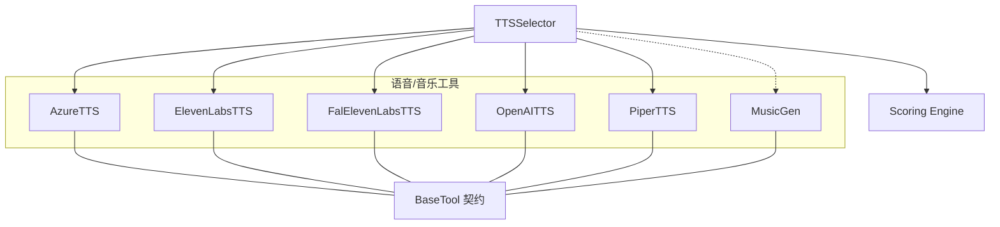
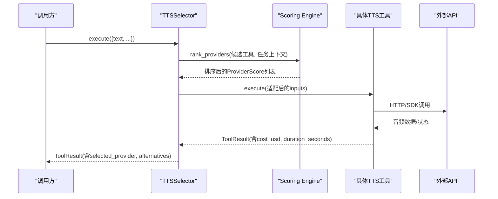
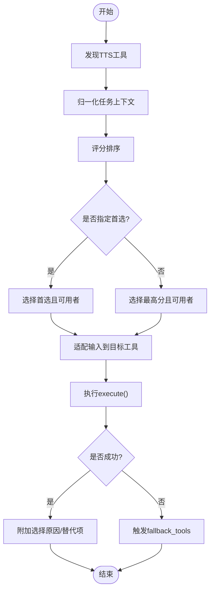
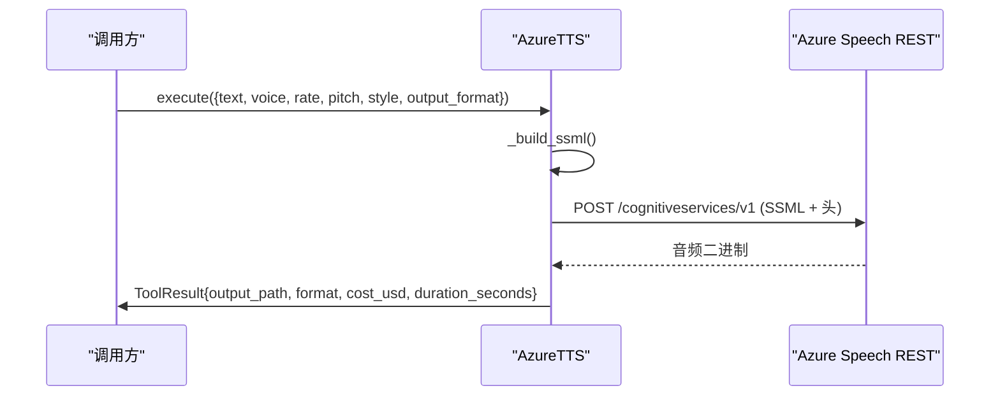
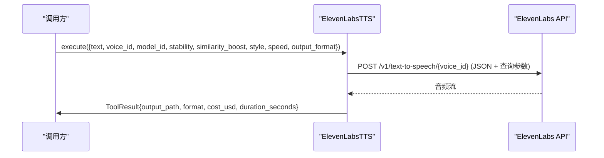
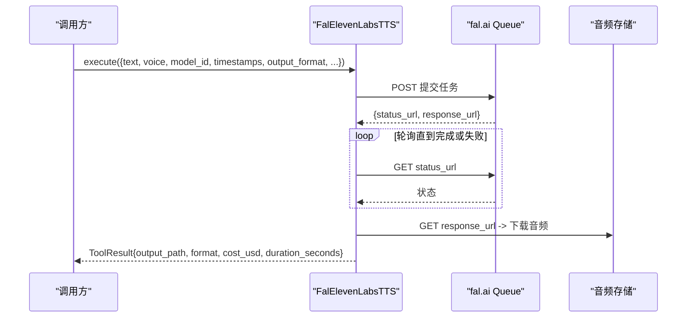
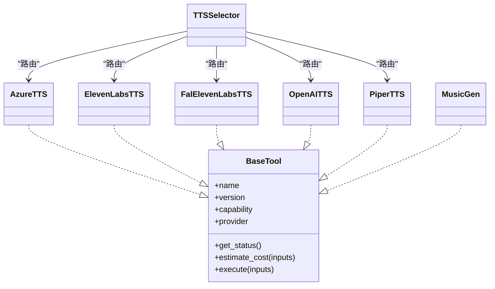

# 语音合成工具示例

<cite>
**本文引用的文件**   
- [tools/base_tool.py](file://tools/base_tool.py)
- [tools/audio/tts_selector.py](file://tools/audio/tts_selector.py)
- [tools/audio/azure_tts.py](file://tools/audio/azure_tts.py)
- [tools/audio/elevenlabs_tts.py](file://tools/audio/elevenlabs_tts.py)
- [tools/audio/fal_elevenlabs_tts.py](file://tools/audio/fal_elevenlabs_tts.py)
- [tools/audio/openai_tts.py](file://tools/audio/openai_tts.py)
- [tools/audio/piper_tts.py](file://tools/audio/piper_tts.py)
- [tools/audio/music_gen.py](file://tools/audio/music_gen.py)
- [lib/scoring.py](file://lib/scoring.py)
</cite>

## 目录
1. [简介](#简介)
2. [项目结构](#项目结构)
3. [核心组件](#核心组件)
4. [架构总览](#架构总览)
5. [详细组件分析](#详细组件分析)
6. [依赖关系分析](#依赖关系分析)
7. [性能与成本考量](#性能与成本考量)
8. [故障排查指南](#故障排查指南)
9. [结论](#结论)
10. [附录：API集成要点](#附录api集成要点)

## 简介
本文件面向OpenMontage的语音合成子系统，系统化阐述统一抽象设计、多提供商适配、音频格式转换、流式处理、错误恢复与性能监控等关键能力。重点覆盖：
- Azure TTS：REST API调用、SSML表达控制（语速、音高、风格）、输出容器选择（MP3/WAV）
- ElevenLabs：声音克隆、参数化音色控制、通过fal.ai的异步队列模式与成本优化
- 音乐生成：风格提示、时长管理、强制纯器乐策略
- 统一路由：基于评分的任务上下文感知选择最佳TTS提供商

## 项目结构
OpenMontage将每个语音/音乐能力封装为“工具”，遵循统一的BaseTool契约，便于注册、发现、编排与度量。语音相关工具集中在 tools/audio 目录下，并通过 lib/scoring.py 进行智能选型。

图表来源
- [tools/audio/tts_selector.py:15-225](file://tools/audio/tts_selector.py#L15-L225)
- [lib/scoring.py:373-542](file://lib/scoring.py#L373-L542)
- [tools/base_tool.py:227-397](file://tools/base_tool.py#L227-L397)

章节来源
- [tools/base_tool.py:227-397](file://tools/base_tool.py#L227-L397)
- [tools/audio/tts_selector.py:15-225](file://tools/audio/tts_selector.py#L15-L225)
- [lib/scoring.py:373-542](file://lib/scoring.py#L373-L542)

## 核心组件
- BaseTool：定义工具的统一接口（执行、状态、成本估算、幂等键、资源画像、重试策略、事件埋点）。所有语音/音乐工具均继承此基类，确保一致的发现与编排体验。
- TTSSelector：能力级TTS选择器，自动发现具备 capability="tts" 的工具，结合任务上下文进行加权评分并路由到最优提供商；支持“rank”模式仅返回排序结果而不实际生成。
- 各提供商工具：AzureTTS、ElevenLabsTTS、FalElevenLabsTTS、OpenAITTS、PiperTTS，分别对接不同后端，提供一致输入输出契约。
- MusicGen：通过ElevenLabs Music API生成背景音乐与音效，强调时长对齐与纯器乐默认策略。

章节来源
- [tools/base_tool.py:227-397](file://tools/base_tool.py#L227-L397)
- [tools/audio/tts_selector.py:15-225](file://tools/audio/tts_selector.py#L15-L225)
- [tools/audio/music_gen.py:28-188](file://tools/audio/music_gen.py#L28-L188)

## 架构总览
下图展示从高层选择器到底层提供商的完整调用链，以及评分引擎如何参与决策。

图表来源
- [tools/audio/tts_selector.py:190-225](file://tools/audio/tts_selector.py#L190-L225)
- [lib/scoring.py:533-542](file://lib/scoring.py#L533-L542)
- [tools/base_tool.py:148-224](file://tools/base_tool.py#L148-L224)

## 详细组件分析

### 统一抽象与选择器（TTSSelector）
- 自动发现：扫描 registry 中 capability="tts" 的工具，排除自身。
- 任务上下文归一化：将文本、意图、风格关键词、预算等归一化为评分器可理解的结构。
- 评分与选择：调用评分器对候选工具打分，支持 preferred_provider 与 allowed_providers 约束。
- 输入适配：将通用控制（如 speaking_rate/speed/pitch/style/output_format）映射到各提供商原生字段（例如将速度百分比转换为Azure SSML rate）。
- 结果增强：在成功时附加 selected_tool、selected_provider、selection_reason、provider_score、alternatives_considered 等元信息，便于审计与回退。

图表来源
- [tools/audio/tts_selector.py:157-225](file://tools/audio/tts_selector.py#L157-L225)
- [tools/audio/tts_selector.py:227-256](file://tools/audio/tts_selector.py#L227-L256)
- [lib/scoring.py:297-359](file://lib/scoring.py#L297-L359)

章节来源
- [tools/audio/tts_selector.py:15-225](file://tools/audio/tts_selector.py#L15-L225)
- [tools/audio/tts_selector.py:227-256](file://tools/audio/tts_selector.py#L227-L256)
- [lib/scoring.py:297-359](file://lib/scoring.py#L297-L359)

### Azure TTS 实现原理
- REST API：使用 /cognitiveservices/v1 同步端点，以SSML作为请求体，无需令牌交换或作业轮询。
- 语音选择：支持短名别名（如 andrew/ava/guy/jenny）与完整voice名称；未指定时使用默认语音。
- 表达控制：通过SSML的 <prosody rate/pitch> 与 <mstts:express-as style> 控制语速、音高与情感风格。
- 输出格式：根据容器选择48kHz MP3或WAV（PCM），写入本地文件路径。
- 成本与耗时：按字符计费估算；固定超时与重试策略保障稳定性。

图表来源
- [tools/audio/azure_tts.py:203-288](file://tools/audio/azure_tts.py#L203-L288)

章节来源
- [tools/audio/azure_tts.py:42-174](file://tools/audio/azure_tts.py#L42-L174)
- [tools/audio/azure_tts.py:176-288](file://tools/audio/azure_tts.py#L176-L288)

### ElevenLabs TTS 高级特性
- 声音克隆与多语言：supports.voice_cloning=True，支持多语言模型与音色相似度/稳定性/风格/速度等精细控制。
- 实时/流式：直接POST到v1/text-to-speech，返回音频流并落盘；可通过 fal_elevenlabs_tts 走异步队列模式获取更稳定的长文本生成。
- 成本优化：按字符估算成本；通过 model_id 与 output_format 平衡质量与带宽。
- 失败恢复：重试策略与明确的错误消息；当无API Key时快速失败并给出安装指引。

图表来源
- [tools/audio/elevenlabs_tts.py:162-213](file://tools/audio/elevenlabs_tts.py#L162-L213)

章节来源
- [tools/audio/elevenlabs_tts.py:24-146](file://tools/audio/elevenlabs_tts.py#L24-L146)
- [tools/audio/elevenlabs_tts.py:147-213](file://tools/audio/elevenlabs_tts.py#L147-L213)

### Fal.ai 托管的 ElevenLabs TTS（异步队列）
- 异步模式：提交到 queue.fal.run，轮询 status_url 直至 COMPLETED/FAILED/CANCELLED，再拉取 response_url 中的音频。
- 模型与价格：内置 eleven-v3/multilingual-v2/turbo-v2.5 模型映射与按字符定价。
- 输出格式：支持多种mp3/pcm/opus格式，自动扩展后缀。
- 安全与错误：异常时对敏感信息进行脱敏；超时与失败均有明确返回。

图表来源
- [tools/audio/fal_elevenlabs_tts.py:233-359](file://tools/audio/fal_elevenlabs_tts.py#L233-L359)

章节来源
- [tools/audio/fal_elevenlabs_tts.py:24-232](file://tools/audio/fal_elevenlabs_tts.py#L24-L232)
- [tools/audio/fal_elevenlabs_tts.py:233-359](file://tools/audio/fal_elevenlabs_tts.py#L233-L359)

### OpenAI TTS 与 Piper TTS（补充）
- OpenAI TTS：支持 gpt-4o-mini-tts 的 instructions 与速度控制；使用官方SDK流式写入文件，并探测音频时长。
- Piper TTS：本地离线方案，依赖 piper 命令与模型；适合隐私敏感场景与无网络环境。

章节来源
- [tools/audio/openai_tts.py:24-198](file://tools/audio/openai_tts.py#L24-L198)
- [tools/audio/piper_tts.py:25-156](file://tools/audio/piper_tts.py#L25-L156)

### 音乐生成（MusicGen）
- 风格控制：prompt描述情绪、流派、乐器、节奏等。
- 时长管理：强制要求传入 duration_seconds，避免静默默认值导致音画不同步。
- 音质与版权友好：默认 force_instrumental=true，避免人声与旁白冲突。
- 成本估算：按时长近似计费，便于预算控制。

章节来源
- [tools/audio/music_gen.py:28-188](file://tools/audio/music_gen.py#L28-L188)

## 依赖关系分析
- 工具契约：所有语音/音乐工具继承 BaseTool，共享状态检查、成本估算、幂等键、重试策略与事件埋点。
- 选择器依赖：TTSSelector 依赖工具注册表与评分器，动态发现并路由。
- 外部依赖：各工具按需引入 requests/openai SDK 等，保持最小化耦合。

图表来源
- [tools/base_tool.py:227-397](file://tools/base_tool.py#L227-L397)
- [tools/audio/tts_selector.py:15-225](file://tools/audio/tts_selector.py#L15-L225)

章节来源
- [tools/base_tool.py:227-397](file://tools/base_tool.py#L227-L397)
- [tools/audio/tts_selector.py:15-225](file://tools/audio/tts_selector.py#L15-L225)

## 性能与成本考量
- 延迟与吞吐：Azure/OpenAI/ElevenLabs均为在线服务，典型段落生成在秒级；fal.ai采用异步队列，适合长文本或高并发场景。
- 成本估算：各工具提供 estimate_cost，按字符或时长近似计算；选择器在执行前也可用于预估。
- 重试与容错：RetryPolicy配置了最大重试次数与可重试错误类型；网络异常、限流、超时均有兜底。
- 资源画像：ResourceProfile声明CPU/内存/显存/磁盘/网络需求，便于调度与配额管理。
- 事件埋点：BaseTool自动包装execute，记录start/finish/error事件，便于看板与审计。

章节来源
- [tools/base_tool.py:120-139](file://tools/base_tool.py#L120-L139)
- [tools/base_tool.py:148-224](file://tools/base_tool.py#L148-L224)
- [tools/audio/azure_tts.py:162-174](file://tools/audio/azure_tts.py#L162-L174)
- [tools/audio/elevenlabs_tts.py:120-146](file://tools/audio/elevenlabs_tts.py#L120-L146)
- [tools/audio/fal_elevenlabs_tts.py:173-223](file://tools/audio/fal_elevenlabs_tts.py#L173-L223)
- [tools/audio/openai_tts.py:109-124](file://tools/audio/openai_tts.py#L109-L124)
- [tools/audio/music_gen.py:86-112](file://tools/audio/music_gen.py#L86-L112)

## 故障排查指南
- 凭据缺失：各工具在 get_status/execute 入口校验环境变量（如 AZURE_SPEECH_KEY、ELEVENLABS_API_KEY、OPENAI_API_KEY、FAL_KEY），缺失时返回明确错误与安装指引。
- 网络/限流：requests超时与HTTP状态码检查；重试策略针对rate_limit/timeout等错误。
- 参数校验：如fal_elevenlabs_tts对stability/similarity_boost/speed范围校验；music_gen强制duration_seconds。
- 输出验证：OpenAI TTS会探测音频时长；其他工具确保输出文件存在后再返回。

章节来源
- [tools/audio/azure_tts.py:176-239](file://tools/audio/azure_tts.py#L176-L239)
- [tools/audio/elevenlabs_tts.py:139-160](file://tools/audio/elevenlabs_tts.py#L139-L160)
- [tools/audio/fal_elevenlabs_tts.py:207-259](file://tools/audio/fal_elevenlabs_tts.py#L207-L259)
- [tools/audio/openai_tts.py:117-141](file://tools/audio/openai_tts.py#L117-L141)
- [tools/audio/music_gen.py:96-130](file://tools/audio/music_gen.py#L96-L130)

## 结论
OpenMontage通过BaseTool统一契约与TTSSelector的智能路由，实现了跨Azure、ElevenLabs、OpenAI、Piper等多提供商的语音合成能力聚合。结合评分引擎的任务上下文感知选择、完善的错误恢复与成本估算，开发者可以构建高质量、可观测、可扩展的语音合成系统，并在需要时无缝切换到合适的提供商以满足质量、成本与合规要求。

## 附录：API集成要点
- Azure TTS
  - 端点：/cognitiveservices/v1
  - 内容类型：application/ssml+xml
  - 输出格式：audio-48khz-192kbitrate-mono-mp3 或 riff-48khz-16bit-mono-pcm
  - 关键头：Ocp-Apim-Subscription-Key、X-Microsoft-OutputFormat
  - 参考路径：[tools/audio/azure_tts.py:241-288](file://tools/audio/azure_tts.py#L241-L288)

- ElevenLabs TTS
  - 端点：/v1/text-to-speech/{voice_id}
  - 内容类型：application/json
  - 查询参数：output_format
  - 参考路径：[tools/audio/elevenlabs_tts.py:162-213](file://tools/audio/elevenlabs_tts.py#L162-L213)

- Fal.ai 托管 ElevenLabs TTS
  - 提交：queue.fal.run/{model_id}
  - 轮询：status_url -> COMPLETED/FAILED/CANCELLED
  - 拉取：response_url 获取音频
  - 参考路径：[tools/audio/fal_elevenlabs_tts.py:277-359](file://tools/audio/fal_elevenlabs_tts.py#L277-L359)

- OpenAI TTS
  - SDK：openai.audio.speech.with_streaming_response.create
  - 支持instructions（gpt-4o-mini-tts）与speed
  - 参考路径：[tools/audio/openai_tts.py:143-198](file://tools/audio/openai_tts.py#L143-L198)

- Piper TTS
  - 本地命令：piper --model ... --output_file ...
  - 参考路径：[tools/audio/piper_tts.py:119-156](file://tools/audio/piper_tts.py#L119-L156)

- 音乐生成
  - 端点：/v1/music
  - 必填：prompt、duration_seconds
  - 推荐：force_instrumental=true
  - 参考路径：[tools/audio/music_gen.py:132-188](file://tools/audio/music_gen.py#L132-L188)