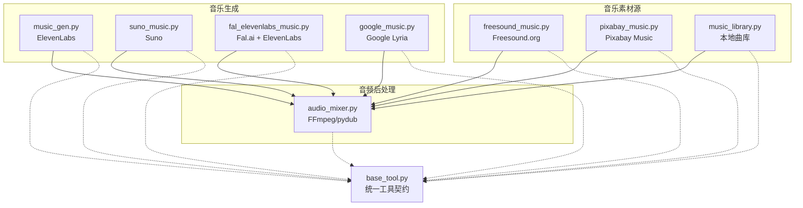
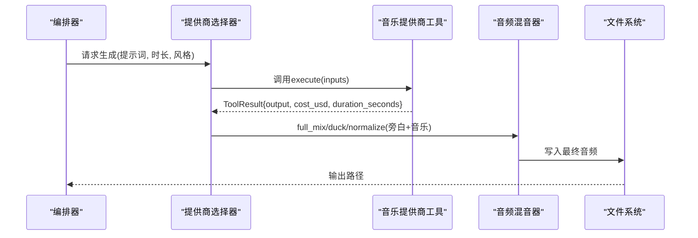
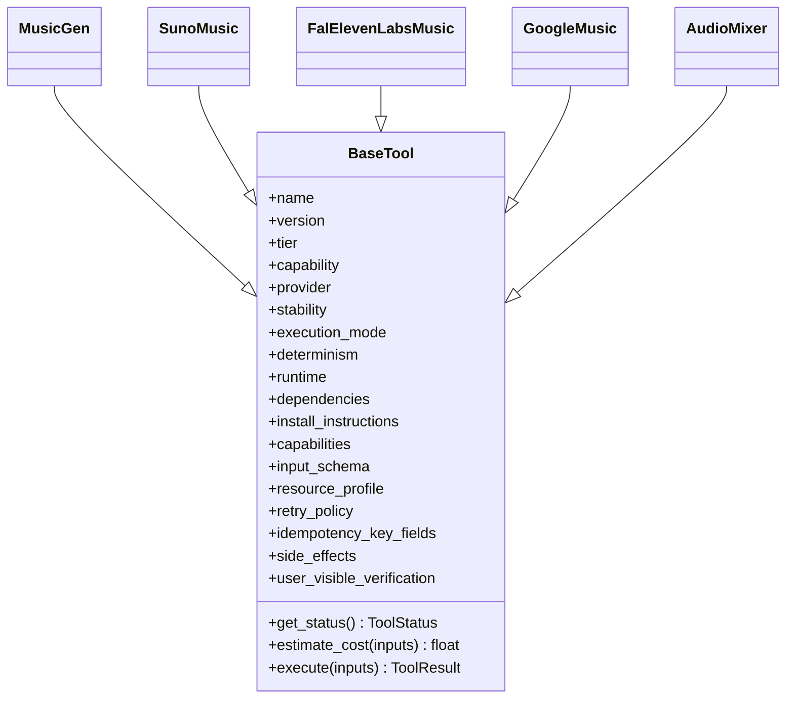
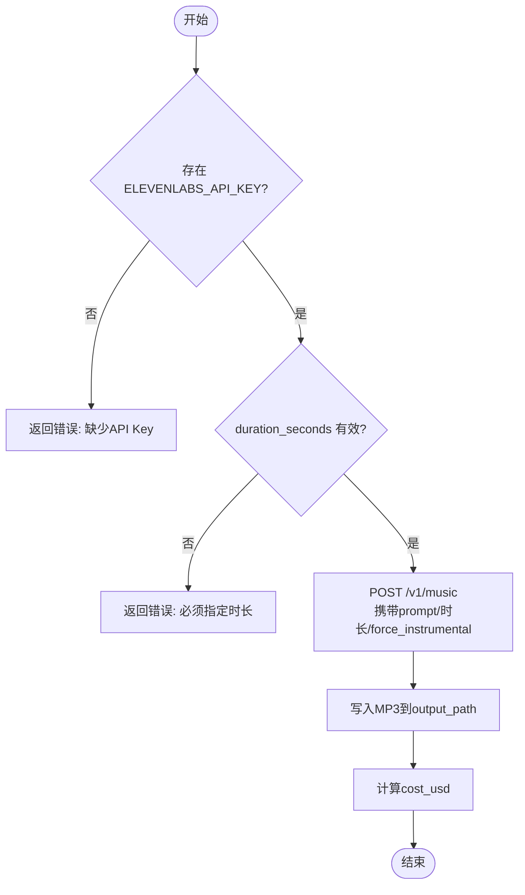
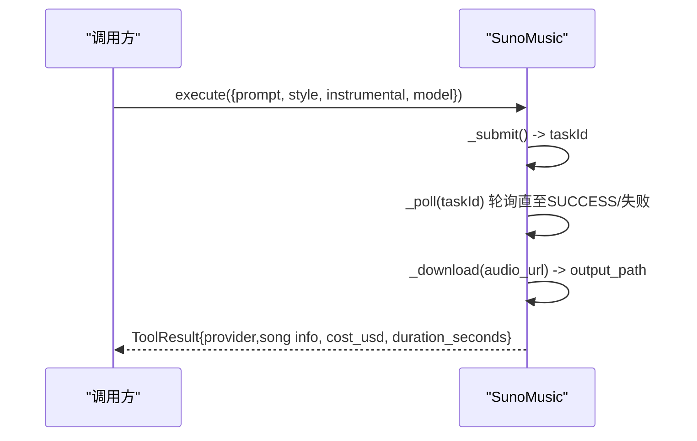
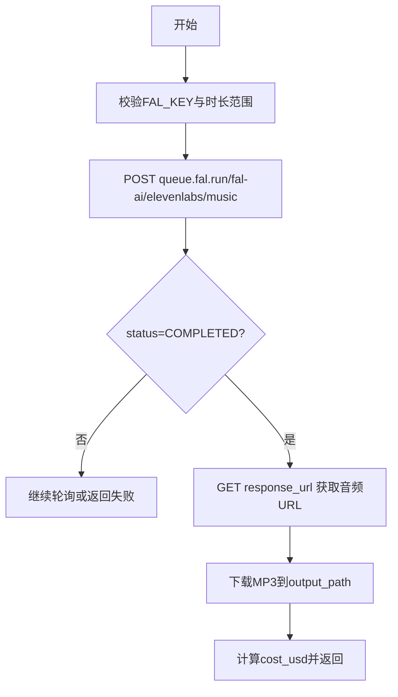
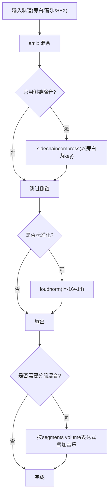
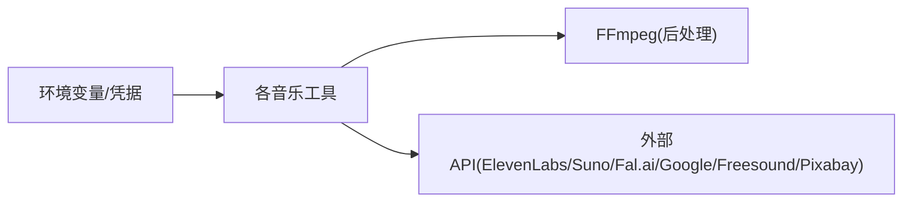

# 音乐生成工具实现

<cite>
**本文引用的文件**
- [tools/audio/music_gen.py](file://tools/audio/music_gen.py)
- [tools/audio/suno_music.py](file://tools/audio/suno_music.py)
- [tools/audio/fal_elevenlabs_music.py](file://tools/audio/fal_elevenlabs_music.py)
- [tools/audio/google_music.py](file://tools/audio/google_music.py)
- [tools/audio/music_library.py](file://tools/audio/music_library.py)
- [tools/audio/freesound_music.py](file://tools/audio/freesound_music.py)
- [tools/audio/pixabay_music.py](file://tools/audio/pixabay_music.py)
- [tools/audio/audio_mixer.py](file://tools/audio/audio_mixer.py)
- [tools/base_tool.py](file://tools/base_tool.py)
- [skills/creative/music-gen-usage.md](file://skills/creative/music-gen-usage.md)
</cite>

## 目录
1. [简介](#简介)
2. [项目结构](#项目结构)
3. [核心组件](#核心组件)
4. [架构总览](#架构总览)
5. [详细组件分析](#详细组件分析)
6. [依赖关系分析](#依赖关系分析)
7. [性能与成本考量](#性能与成本考量)
8. [故障排查指南](#故障排查指南)
9. [结论](#结论)
10. [附录：工作流、模板与创意指导](#附录工作流模板与创意指导)

## 简介
本文件系统性梳理 OpenMontage 中的“音乐生成工具”实现，覆盖 AI 音乐模型集成（ElevenLabs、Suno、Fal.ai、Google Lyria）、风格控制与时长管理、多提供商适配层抽象、音频后处理管道（混音、降噪、响度标准化、格式转换）、批量生成优化与成本监控等生产级特性。文档同时提供可操作的工作流示例、风格模板库与创意指导，帮助开发者构建专业可靠的 AI 音乐生成系统。

## 项目结构
围绕音乐能力，代码主要分布在 tools/audio 目录下，按“生成器”“素材源”“本地库”“混音后处理”分层组织；所有工具统一继承 BaseTool，具备一致的发现、执行、成本估算与健康状态上报能力。

图表来源
- [tools/audio/music_gen.py:1-188](file://tools/audio/music_gen.py#L1-L188)
- [tools/audio/suno_music.py:1-289](file://tools/audio/suno_music.py#L1-L289)
- [tools/audio/fal_elevenlabs_music.py:1-232](file://tools/audio/fal_elevenlabs_music.py#L1-L232)
- [tools/audio/google_music.py:1-335](file://tools/audio/google_music.py#L1-L335)
- [tools/audio/freesound_music.py:1-230](file://tools/audio/freesound_music.py#L1-L230)
- [tools/audio/pixabay_music.py:1-356](file://tools/audio/pixabay_music.py#L1-L356)
- [tools/audio/music_library.py:1-222](file://tools/audio/music_library.py#L1-L222)
- [tools/audio/audio_mixer.py:1-776](file://tools/audio/audio_mixer.py#L1-L776)
- [tools/base_tool.py:1-200](file://tools/base_tool.py#L1-L200)

章节来源
- [tools/base_tool.py:63-139](file://tools/base_tool.py#L63-L139)

## 核心组件
- 统一工具契约：所有音乐相关工具均继承 BaseTool，暴露 name/version/tier/capability/provider/stability/execution_mode/determinism/runtime 等元数据，并提供 execute(inputs)->ToolResult、estimate_cost(inputs)、get_status()、idempotency_key_fields 等标准接口，便于编排器调度、重试、幂等与成本归集。
- 生成器：music_gen（ElevenLabs）、suno_music（Suno via sunoapi.org）、fal_elevenlabs_music（Fal.ai 队列调用 ElevenLabs Music）、google_music（Google Lyria）。
- 素材源：freesound_music（CC 授权搜索下载）、pixabay_music（免密钥抓取下载）、music_library（本地曲库扫描）。
- 后处理：audio_mixer（mix/duck/extract/full_mix/segmented_music），基于 FFmpeg 实现音量、淡入淡出、侧链压缩、响度标准化与分段混音。

章节来源
- [tools/base_tool.py:63-139](file://tools/base_tool.py#L63-L139)
- [tools/audio/music_gen.py:28-94](file://tools/audio/music_gen.py#L28-L94)
- [tools/audio/suno_music.py:29-128](file://tools/audio/suno_music.py#L29-L128)
- [tools/audio/fal_elevenlabs_music.py:29-114](file://tools/audio/fal_elevenlabs_music.py#L29-L114)
- [tools/audio/google_music.py:29-114](file://tools/audio/google_music.py#L29-L114)
- [tools/audio/freesound_music.py:31-108](file://tools/audio/freesound_music.py#L31-L108)
- [tools/audio/pixabay_music.py:35-109](file://tools/audio/pixabay_music.py#L35-L109)
- [tools/audio/music_library.py:53-130](file://tools/audio/music_library.py#L53-L130)
- [tools/audio/audio_mixer.py:26-43](file://tools/audio/audio_mixer.py#L26-L43)

## 架构总览
音乐生成采用“选择器→提供商→后处理”的分层架构：
- 选择器：根据可用凭据、成本、时长约束与质量偏好选择具体提供商（如 Suno/Fal.ai/ElevenLabs/Google）。
- 提供商：各 provider 工具封装外部 API 或本地模型调用，返回 ToolResult 并附带 cost_usd、duration_seconds、model 等元信息。
- 后处理：audio_mixer 将生成的音乐与旁白/SFX 混合，应用 ducking、响度标准化、精确时长对齐与格式转换。

图表来源
- [tools/audio/music_gen.py:113-188](file://tools/audio/music_gen.py#L113-L188)
- [tools/audio/suno_music.py:146-200](file://tools/audio/suno_music.py#L146-L200)
- [tools/audio/fal_elevenlabs_music.py:134-232](file://tools/audio/fal_elevenlabs_music.py#L134-L232)
- [tools/audio/google_music.py:133-335](file://tools/audio/google_music.py#L133-L335)
- [tools/audio/audio_mixer.py:479-667](file://tools/audio/audio_mixer.py#L479-L667)

## 详细组件分析

### 提供商适配层设计（统一接口）
- 统一输入/输出：所有生成器遵循 BaseTool 的 input_schema 与 ToolResult 约定，包含 prompt、duration_seconds、output_path、force_instrumental 等字段，以及 cost_usd、duration_seconds、model、artifacts 等结果字段。
- 健康检查：get_status() 依据环境变量或凭据可用性返回 AVAILABLE/UNAVAILABLE。
- 幂等键：idempotency_key_fields 用于去重与缓存键构造（例如 prompt、duration_seconds、style、instrumental 等）。
- 重试策略：RetryPolicy 定义最大重试次数与可重试错误类型（rate_limit、timeout）。
- 资源画像：ResourceProfile 声明 CPU/RAM/VRAM/Disk/网络需求，便于调度。

图表来源
- [tools/base_tool.py:63-139](file://tools/base_tool.py#L63-L139)
- [tools/audio/music_gen.py:28-94](file://tools/audio/music_gen.py#L28-L94)
- [tools/audio/suno_music.py:29-128](file://tools/audio/suno_music.py#L29-L128)
- [tools/audio/fal_elevenlabs_music.py:29-114](file://tools/audio/fal_elevenlabs_music.py#L29-L114)
- [tools/audio/google_music.py:29-114](file://tools/audio/google_music.py#L29-L114)
- [tools/audio/audio_mixer.py:26-43](file://tools/audio/audio_mixer.py#L26-L43)

章节来源
- [tools/base_tool.py:63-139](file://tools/base_tool.py#L63-L139)

### ElevenLabs Music（music_gen）
- 功能：通过 ElevenLabs Music API 生成背景乐与音效，支持 force_instrumental、目标时长。
- 关键参数：prompt、duration_seconds（3-600s）、output_path、force_instrumental（默认 True）。
- 成本估算：按时长近似计费（约每30秒$0.05）。
- 错误处理：缺少 API Key 直接失败；API 异常捕获并返回 ToolResult。

图表来源
- [tools/audio/music_gen.py:96-188](file://tools/audio/music_gen.py#L96-L188)

章节来源
- [tools/audio/music_gen.py:28-188](file://tools/audio/music_gen.py#L28-L188)

### Suno Music（suno_music）
- 功能：通过 sunoapi.org 提交异步任务，轮询完成状态，下载音频。
- 模式：简单模式（描述式提示词）与自定义模式（歌词+风格+标题）。
- 模型版本：V4/V4_5/V5，最长时长不同。
- 成本估算：固定单次费用估算。
- 错误处理：任务创建失败、生成失败、敏感词错误、超时等均有明确分支。

图表来源
- [tools/audio/suno_music.py:146-289](file://tools/audio/suno_music.py#L146-L289)

章节来源
- [tools/audio/suno_music.py:29-289](file://tools/audio/suno_music.py#L29-L289)

### Fal.ai + ElevenLabs Music（fal_elevenlabs_music）
- 功能：通过 fal.ai 队列调用 ElevenLabs Music，精确时长控制。
- 认证：使用 FAL_KEY 或 FAL_AI_API_KEY。
- 成本估算：按输出分钟计费（向上取整）。
- 错误处理：队列等待超时、FAILED/CANCELLED 状态、网络异常时安全脱敏错误信息。

图表来源
- [tools/audio/fal_elevenlabs_music.py:121-232](file://tools/audio/fal_elevenlabs_music.py#L121-L232)

章节来源
- [tools/audio/fal_elevenlabs_music.py:29-232](file://tools/audio/fal_elevenlabs_music.py#L29-L232)

### Google Lyria（google_music）
- 功能：通过 Google GenAI SDK 调用 lyria-3-pro-preview 生成音乐，支持图像条件输入。
- 时长限制：最小5秒，最大184秒；auto_fix 可自动修正越界时长。
- 成本估算：固定单次费用估算。
- 错误处理：凭据缺失、SDK导入失败、模型返回无音频数据等。

章节来源
- [tools/audio/google_music.py:29-335](file://tools/audio/google_music.py#L29-L335)

### 本地曲库与免费素材源（music_library / freesound_music / pixabay_music）
- music_library：扫描项目根 music_library 目录，列出用户自有版权音乐，可选 ffprobe 探测时长。
- freesound_music：基于 Freesound.org API 搜索 CC 授权音频，支持时长过滤与评分排序。
- pixabay_music：无需 API Key，通过抓取 Pixabay 音乐页面获取 MP3 链接并下载。

章节来源
- [tools/audio/music_library.py:53-222](file://tools/audio/music_library.py#L53-L222)
- [tools/audio/freesound_music.py:31-230](file://tools/audio/freesound_music.py#L31-L230)
- [tools/audio/pixabay_music.py:35-356](file://tools/audio/pixabay_music.py#L35-L356)

### 音频后处理管道（audio_mixer）
- 能力：mix（多轨混合）、duck（侧链压缩降音）、extract（视频提取音频）、full_mix（一键混音+降音+标准化）、segmented_music（按时间段混入背景音乐）。
- 响度标准化：loudnorm 支持 LUFS 目标值（默认 -16，可按平台调整）。
- 精确时长：full_mix 支持 target_duration，使用 apad/atrim 对齐输出长度。
- 分段混音：volume 表达式在指定区间内平滑淡入淡出，非区间静音。

图表来源
- [tools/audio/audio_mixer.py:205-223](file://tools/audio/audio_mixer.py#L205-L223)
- [tools/audio/audio_mixer.py:280-338](file://tools/audio/audio_mixer.py#L280-L338)
- [tools/audio/audio_mixer.py:340-445](file://tools/audio/audio_mixer.py#L340-L445)
- [tools/audio/audio_mixer.py:479-667](file://tools/audio/audio_mixer.py#L479-L667)
- [tools/audio/audio_mixer.py:669-776](file://tools/audio/audio_mixer.py#L669-L776)

章节来源
- [tools/audio/audio_mixer.py:26-776](file://tools/audio/audio_mixer.py#L26-L776)

## 依赖关系分析
- 外部依赖：
  - ElevenLabs：ELEVENLABS_API_KEY
  - Suno：SUNO_API_KEY（经 sunoapi.org）
  - Fal.ai：FAL_KEY 或 FAL_AI_API_KEY
  - Google：GEMINI_API_KEY/GOOGLE_API_KEY 或 GOOGLE_APPLICATION_CREDENTIALS
  - Freesound：FREESOUND_API_KEY
  - FFmpeg：audio_mixer 必需
- 内部依赖：
  - 所有工具继承 BaseTool，共享 ToolResult、ResourceProfile、RetryPolicy、ToolStatus 等基础类型。
  - 编排器通过 tool_registry 注册与发现工具（不在本节展开）。

图表来源
- [tools/audio/music_gen.py:96-119](file://tools/audio/music_gen.py#L96-L119)
- [tools/audio/suno_music.py:134-140](file://tools/audio/suno_music.py#L134-L140)
- [tools/audio/fal_elevenlabs_music.py:121-125](file://tools/audio/fal_elevenlabs_music.py#L121-L125)
- [tools/audio/google_music.py:116-126](file://tools/audio/google_music.py#L116-L126)
- [tools/audio/freesound_music.py:112-115](file://tools/audio/freesound_music.py#L112-L115)
- [tools/audio/audio_mixer.py:36-41](file://tools/audio/audio_mixer.py#L36-L41)

章节来源
- [tools/base_tool.py:63-139](file://tools/base_tool.py#L63-L139)

## 性能与成本考量
- 并发与重试：各工具配置 RetryPolicy，建议对 rate_limit/timeout 进行指数退避重试；Suno/Fal.ai 为异步流程，适合批处理排队。
- 时长匹配：尽量使用 exact_duration 能力（如 Fal.ai/ElevenLabs）避免后期拼接；不足时再考虑循环与交叉淡入淡出。
- 成本估算：每个工具提供 estimate_cost(inputs)，建议在编排阶段汇总 cost_usd 做预算控制。
- 资源画像：ResourceProfile 可用于容器/节点资源分配，避免争用。
- 缓存与幂等：利用 idempotency_key_fields 构建缓存键，减少重复生成。

[本节为通用指导，不直接分析具体文件]

## 故障排查指南
- 凭据缺失：
  - ElevenLabs：检查 ELEVENLABS_API_KEY
  - Suno：检查 SUNO_API_KEY
  - Fal.ai：检查 FAL_KEY/FAL_AI_API_KEY
  - Google：检查 GEMINI_API_KEY/GOOGLE_API_KEY 或服务账号
  - Freesound：检查 FREESOUND_API_KEY
- 时长越界：
  - Google Lyria 强制 5-184s，可开启 auto_fix 或显式裁剪/填充
  - ElevenLabs/Fal.ai 要求 3-600s，需严格校验
- 网络与超时：
  - 合理设置 timeout；对异步任务设置最大等待时间
- 混音问题：
  - 确认 loudnorm_target 与平台一致（播客 -16，短视频 -14）
  - 检查 sidechaincompress 阈值/比率/attack/release 参数
  - segmented_music 确保 segments 不重叠且边界有 fade

章节来源
- [tools/audio/music_gen.py:96-126](file://tools/audio/music_gen.py#L96-L126)
- [tools/audio/suno_music.py:137-177](file://tools/audio/suno_music.py#L137-L177)
- [tools/audio/fal_elevenlabs_music.py:121-150](file://tools/audio/fal_elevenlabs_music.py#L121-L150)
- [tools/audio/google_music.py:116-180](file://tools/audio/google_music.py#L116-L180)
- [tools/audio/audio_mixer.py:205-223](file://tools/audio/audio_mixer.py#L205-L223)
- [tools/audio/audio_mixer.py:340-445](file://tools/audio/audio_mixer.py#L340-L445)
- [tools/audio/audio_mixer.py:669-776](file://tools/audio/audio_mixer.py#L669-L776)

## 结论
OpenMontage 的音乐生成体系以 BaseTool 为统一契约，聚合多家 AI 音乐提供商与免费素材源，并通过 audio_mixer 提供工业级的混音与标准化能力。借助统一的成本估算、幂等键与重试策略，可在生产环境中稳定运行。配合风格模板与创意指导，可快速产出高质量、符合平台响度规范的视频配乐。

[本节为总结性内容，不直接分析具体文件]

## 附录：工作流、模板与创意指导

### 典型工作流示例
- 生成背景乐：
  - 选择提供商（优先 Fal.ai/ElevenLabs 精确时长；备选 Suno/Google）
  - 传入 prompt（含风格/BPM/乐器/能量方向）与 duration_seconds
  - 输出 MP3 至 assets/music
- 混音与标准化：
  - 使用 audio_mixer.full_mix 将旁白与音乐混合，启用 ducking 与 normalize
  - 若视频分段落，使用 segmented_music 仅在特定时间段播放音乐
- 成本与质量校验：
  - 汇总 cost_usd，对比预算
  - 试听并验证响度与清晰度

章节来源
- [skills/creative/music-gen-usage.md:41-136](file://skills/creative/music-gen-usage.md#L41-L136)
- [tools/audio/audio_mixer.py:479-667](file://tools/audio/audio_mixer.py#L479-L667)
- [tools/audio/audio_mixer.py:669-776](file://tools/audio/audio_mixer.py#L669-L776)

### 风格模板库（来自创作指南）
- 教育讲解：gentle lo-fi ambient electronic, 90 BPM, C major, soft synth pads and light percussion, calm and steady energy, background music for narration
- 企业产品演示：modern upbeat corporate pop, 110 BPM, G major, acoustic guitar and light drums, positive energy building gradually, underscore for product walkthrough
- 技术深潜：minimal ambient electronic, 80 BPM, A minor, soft Rhodes piano and subtle bass, contemplative and focused, background music for technical explanation

章节来源
- [skills/creative/music-gen-usage.md:49-67](file://skills/creative/music-gen-usage.md#L49-L67)

### 创意指导要点
- 始终包含“background/underscore”，避免人声干扰旁白
- 明确 BPM 与能量走向，避免高频元素抢占语音频段
- 时长尽量与视频一致，必要时使用分段生成与交叉淡入淡出
- 混音时音乐低于旁白 18-20 dB，并按平台设置响度目标

章节来源
- [skills/creative/music-gen-usage.md:69-136](file://skills/creative/music-gen-usage.md#L69-L136)