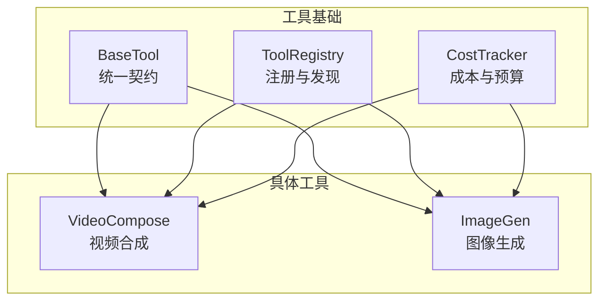
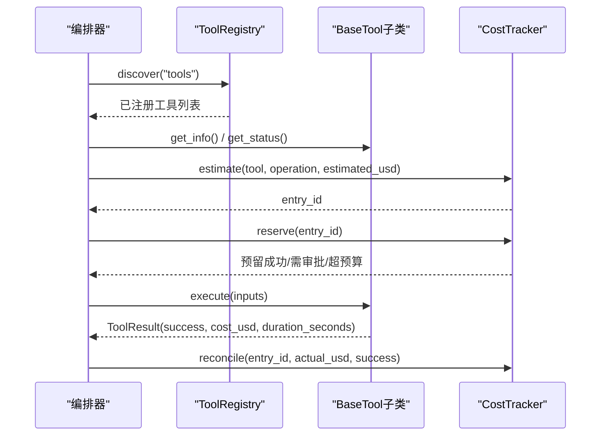
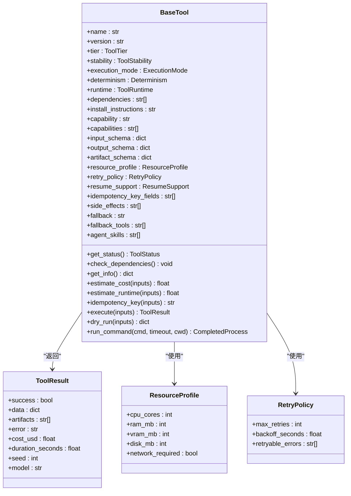
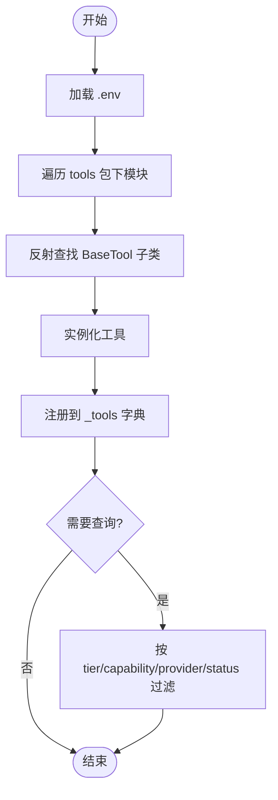
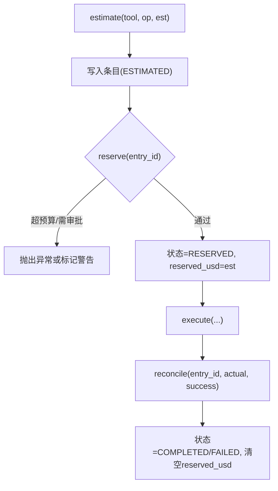
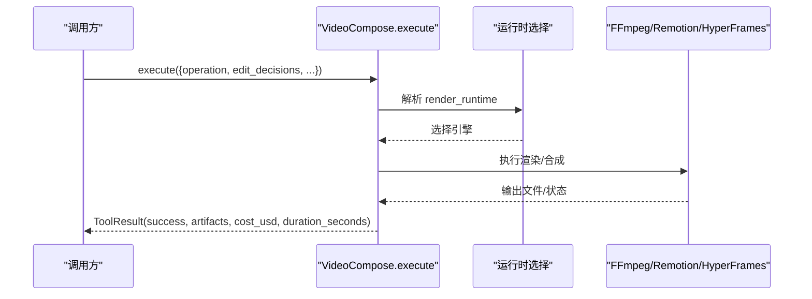
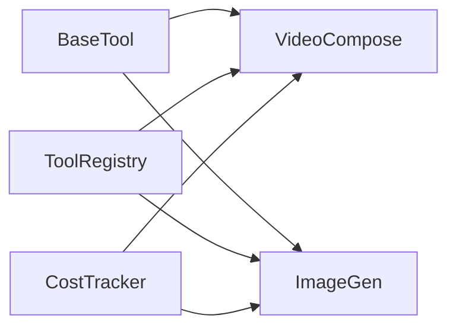

# 工具系统

<cite>
**本文引用的文件**
- [tools/base_tool.py](file://tools/base_tool.py)
- [tools/tool_registry.py](file://tools/tool_registry.py)
- [tools/cost_tracker.py](file://tools/cost_tracker.py)
- [tools/video/video_compose.py](file://tools/video/video_compose.py)
- [tools/graphics/image_gen.py](file://tools/graphics/image_gen.py)
- [tests/tools/test_base_tool_dependencies.py](file://tests/tools/test_base_tool_dependencies.py)
</cite>

## 目录
1. [简介](#简介)
2. [项目结构](#项目结构)
3. [核心组件](#核心组件)
4. [架构总览](#架构总览)
5. [详细组件分析](#详细组件分析)
6. [依赖关系分析](#依赖关系分析)
7. [性能考量](#性能考量)
8. [故障排查指南](#故障排查指南)
9. [结论](#结论)
10. [附录：工具开发指南与最佳实践](#附录工具开发指南与最佳实践)

## 简介
本技术文档面向OpenMontage的工具系统，聚焦以下目标：
- 深入解释BaseTool抽象基类的设计理念与实现机制，包括工具生命周期管理、依赖检查、成本估算、幂等性支持等。
- 详细说明工具注册表的工作原理，包括动态发现、分类管理、状态监控等。
- 阐述工具的标准化接口设计，包括execute方法、输入输出Schema定义、错误处理机制。
- 提供工具开发指南，说明如何创建自定义工具（继承BaseTool、实现必要方法、配置元数据），并给出代码示例路径与最佳实践。

## 项目结构
OpenMontage将“工具”作为一等公民进行组织：
- 基础能力集中在 tools/base_tool.py，定义了统一的工具契约、枚举类型、资源与重试策略、执行结果、命令执行封装、依赖检查与事件埋点装饰器。
- 工具注册与发现位于 tools/tool_registry.py，负责扫描模块、自动注册工具实例、按能力/提供商/层级/状态查询，以及生成支持信封与菜单。
- 成本追踪在 tools/cost_tracker.py，提供预算预留、审批、实际花费对账与持久化。
- 具体工具按领域分目录组织，例如 video、graphics、audio、analysis 等；每个工具均继承 BaseTool 并实现 execute。

图表来源
- [tools/base_tool.py:227-481](file://tools/base_tool.py#L227-L481)
- [tools/tool_registry.py:55-493](file://tools/tool_registry.py#L55-L493)
- [tools/cost_tracker.py:40-524](file://tools/cost_tracker.py#L40-L524)
- [tools/video/video_compose.py:58-200](file://tools/video/video_compose.py#L58-L200)
- [tools/graphics/image_gen.py:37-200](file://tools/graphics/image_gen.py#L37-L200)

章节来源
- [tools/base_tool.py:227-481](file://tools/base_tool.py#L227-L481)
- [tools/tool_registry.py:55-493](file://tools/tool_registry.py#L55-L493)
- [tools/cost_tracker.py:40-524](file://tools/cost_tracker.py#L40-L524)

## 核心组件
- BaseTool：所有工具的抽象基类，定义统一的生命周期、元数据、依赖检查、成本估算、幂等键、执行入口、干跑、命令行封装等。
- ToolRegistry：集中注册与发现工具，支持按能力、提供商、层级、稳定性、状态筛选，并提供支持信封与用户友好的菜单汇总。
- CostTracker：预算治理，包含预估、预留、审批、对账、退款、持久化到 cost_log.json，并支持观察/警告/封顶模式。

章节来源
- [tools/base_tool.py:227-481](file://tools/base_tool.py#L227-L481)
- [tools/tool_registry.py:55-493](file://tools/tool_registry.py#L55-L493)
- [tools/cost_tracker.py:40-524](file://tools/cost_tracker.py#L40-L524)

## 架构总览
工具系统采用“契约+注册+治理”的分层架构：
- 契约层：BaseTool 强制统一接口与元数据，确保工具可被编排、可观测、可审计。
- 注册层：ToolRegistry 通过导入工具包并反射发现所有 BaseTool 子类，构建运行时可用的工具集合。
- 治理层：CostTracker 在调用前进行成本预估与预算预留，执行后对账，必要时触发审批或阻断。

图表来源
- [tools/tool_registry.py:118-134](file://tools/tool_registry.py#L118-L134)
- [tools/base_tool.py:296-397](file://tools/base_tool.py#L296-L397)
- [tools/cost_tracker.py:101-179](file://tools/cost_tracker.py#L101-L179)

## 详细组件分析

### BaseTool 抽象基类
设计理念
- 统一契约：所有工具必须实现 execute(inputs) -> ToolResult，并通过类属性声明元数据（名称、版本、层级、能力、运行环境、依赖、Schema等）。
- 生命周期管理：通过 __init_subclass__ 自动为每个具体工具的 execute 注入 Backlot 事件埋点，记录 start/finish/error，便于看板与进度展示。
- 依赖检查：check_dependencies 支持 cmd:/binary: 外部命令、env: 环境变量、python: Python 模块三类依赖，未满足时抛出 DependencyError。
- 成本估算：estimate_cost/estimate_runtime 供编排器做预评估；dry_run 提供无副作用的预检。
- 幂等性：idempotency_key 基于 idempotency_key_fields 计算哈希键，便于缓存与去重。
- 错误处理：run_command 封装 subprocess 调用，统一异常为 ToolCommandError，保留 stderr/stdout/detail。

关键数据结构
- ToolTier/ToolStability/ToolStatus/ToolRuntime/ExecutionMode/Determinism/ResumeSupport：描述工具的分类、稳定性、状态、运行方式、执行模式、确定性、恢复能力。
- ResourceProfile：CPU/RAM/VRAM/磁盘/网络需求。
- RetryPolicy：最大重试次数、退避时间、可重试错误码。
- ToolResult：success/data/artifacts/error/cost_usd/duration_seconds/seed/model。

图表来源
- [tools/base_tool.py:63-139](file://tools/base_tool.py#L63-L139)
- [tools/base_tool.py:227-481](file://tools/base_tool.py#L227-L481)

章节来源
- [tools/base_tool.py:227-481](file://tools/base_tool.py#L227-L481)

### 工具注册表 ToolRegistry
工作原理
- 动态发现：discover(package_name) 遍历 package 下的子模块，跳过 base_tool 与 tool_registry 自身，对每个模块使用 register_module 反射查找 BaseTool 子类并实例化注册。
- 分类管理：提供 get_by_tier/get_by_capability/get_by_provider/get_by_stability 等查询；support_envelope/capability_catalog/provider_catalog 生成结构化报告。
- 状态监控：get_status 基于 check_dependencies 的结果；get_available/get_unavailable 过滤可用工具；find_fallback 根据 fallback/fallback_tools 寻找备用工具。
- 用户菜单：provider_menu 与 provider_menu_summary 聚合能力、提供商、安装提示、运行时告警，便于编排器/代理向用户呈现“N of M configured”。

图表来源
- [tools/tool_registry.py:118-134](file://tools/tool_registry.py#L118-L134)
- [tools/tool_registry.py:149-196](file://tools/tool_registry.py#L149-L196)
- [tools/tool_registry.py:198-314](file://tools/tool_registry.py#L198-L314)

章节来源
- [tools/tool_registry.py:55-493](file://tools/tool_registry.py#L55-L493)

### 成本追踪 CostTracker
功能要点
- 预算治理：estimate 记录预估，reserve 进行预留并校验单动作阈值与新付费工具审批，reconcile 完成对账，refund 取消预留。
- 参考驱动估算：estimate_from_reference 基于视频分析简报与目标时长，结合场景数、运动比例、TTS字数、音乐等生成明细与置信度。
- 持久化：保存 entries、预算总额、已批准工具列表到 cost_log.json，支持读取恢复。

图表来源
- [tools/cost_tracker.py:101-179](file://tools/cost_tracker.py#L101-L179)
- [tools/cost_tracker.py:183-398](file://tools/cost_tracker.py#L183-L398)
- [tools/cost_tracker.py:487-524](file://tools/cost_tracker.py#L487-L524)

章节来源
- [tools/cost_tracker.py:40-524](file://tools/cost_tracker.py#L40-L524)

### 具体工具示例

#### VideoCompose（视频合成）
- 继承 BaseTool，声明 name/version/tier/capability/provider/stability/execution_mode/determinism。
- 依赖 ffmpeg，具备 compose/render/remotion_render/burn_subtitles/overlay/encode 多种操作。
- 输入 Schema 严格定义 operation、edit_decisions、asset_manifest、subtitle_path、profile、codec、crf、preset、remotion_timeout_ms 等字段。
- 运行时选择由 edit_decisions.render_runtime 决定（Remotion/HyperFrames/FFmpeg），并在失败时不静默替换，交由编排器决策。

图表来源
- [tools/video/video_compose.py:58-200](file://tools/video/video_compose.py#L58-L200)

章节来源
- [tools/video/video_compose.py:58-200](file://tools/video/video_compose.py#L58-L200)

#### ImageGen（图像生成，已弃用但体现多提供者路由）
- 继承 BaseTool，声明 capability=image_generation，runtime=HYBRID。
- 动态检测提供者（openai/flux/local），estimate_cost 根据提供者返回不同单价。
- execute 根据 provider 分发到对应实现，返回 ToolResult，包含 output_path、model、cost_usd、duration_seconds 等。

章节来源
- [tools/graphics/image_gen.py:37-200](file://tools/graphics/image_gen.py#L37-L200)

## 依赖关系分析
- BaseTool 是所有工具的根依赖，提供统一接口与通用能力。
- ToolRegistry 依赖 BaseTool 的类型与枚举，用于发现与查询。
- CostTracker 独立于具体工具，通过编排器在 execute 前后介入，形成“预估-预留-对账”闭环。
- 具体工具（如 VideoCompose、ImageGen）仅依赖 BaseTool 提供的契约与工具库（如 openai、requests、subprocess）。

图表来源
- [tools/base_tool.py:227-481](file://tools/base_tool.py#L227-L481)
- [tools/tool_registry.py:55-493](file://tools/tool_registry.py#L55-L493)
- [tools/cost_tracker.py:40-524](file://tools/cost_tracker.py#L40-L524)
- [tools/video/video_compose.py:58-200](file://tools/video/video_compose.py#L58-L200)
- [tools/graphics/image_gen.py:37-200](file://tools/graphics/image_gen.py#L37-L200)

章节来源
- [tools/base_tool.py:227-481](file://tools/base_tool.py#L227-L481)
- [tools/tool_registry.py:55-493](file://tools/tool_registry.py#L55-L493)
- [tools/cost_tracker.py:40-524](file://tools/cost_tracker.py#L40-L524)

## 性能考量
- 事件埋点：BaseTool.execute 通过装饰器注入 start/finish/error 事件，开销极小且不影响主流程；若事件层不可用则直接回退。
- 子进程调用：run_command 强制 UTF-8 解码与错误替换，避免 UnicodeDecodeError 导致线程崩溃；Windows 下通过 which 解析命令路径。
- 成本估算：CostTracker 的 estimate_from_reference 引入重试缓冲与置信度，避免低估；建议工具实现更精确的 estimate_cost/estimate_runtime。
- 资源限制：ResourceProfile 明确 CPU/RAM/VRAM/磁盘/网络需求，编排器可据此调度与隔离。

[本节为通用指导，不直接分析具体文件]

## 故障排查指南
常见问题与定位
- 依赖缺失：check_dependencies 会抛出 DependencyError，提示缺少命令/环境变量/Python模块及安装说明。可通过 registry.get_status() 快速判断工具可用性。
- 命令执行失败：run_command 捕获 CalledProcessError 并包装为 ToolCommandError，包含 returncode、cmd、stderr/stdout/detail，便于定位。
- 成本超支：CostTracker.reserve 在 CAP 模式下抛出 BudgetExceededError；在 WARN 模式下标记 budget_warning；新付费工具首次使用可能触发 ApprovalRequiredError。
- 幂等重复：idempotency_key 可用于缓存命中与去重；若出现意外重复执行，检查 idempotency_key_fields 是否覆盖全部影响结果的参数。

章节来源
- [tests/tools/test_base_tool_dependencies.py:20-48](file://tests/tools/test_base_tool_dependencies.py#L20-L48)
- [tools/base_tool.py:304-328](file://tools/base_tool.py#L304-L328)
- [tools/base_tool.py:411-454](file://tools/base_tool.py#L411-L454)
- [tools/cost_tracker.py:117-179](file://tools/cost_tracker.py#L117-L179)

## 结论
OpenMontage 的工具系统以 BaseTool 为核心契约，配合 ToolRegistry 的动态发现与分类管理，以及 CostTracker 的预算治理，实现了可扩展、可观测、可审计的工具生态。开发者只需遵循统一接口与元数据约定，即可快速集成新的工具能力，并被编排器与代理无缝识别与调用。

[本节为总结，不直接分析具体文件]

## 附录：工具开发指南与最佳实践

### 如何创建自定义工具
步骤
1. 新建工具模块，继承 BaseTool，设置必要元数据：
   - name/version/tier/capability/provider/stability/execution_mode/determinism/runtime
   - dependencies/install_instructions（如 cmd:ffmpeg、env:API_KEY、python:module）
   - input_schema/output_schema/artifact_schema（JSON Schema 风格）
   - resource_profile/retry_policy/idempotency_key_fields/side_effects
   - agent_skills（关联技能文档，辅助编排器理解上下文）
2. 实现 execute(inputs) -> ToolResult：
   - 校验输入（依据 input_schema）
   - 执行核心逻辑（可调用外部命令/SDK）
   - 返回 ToolResult，包含 success/data/artifacts/error/cost_usd/duration_seconds/seed/model
3. 可选：实现 estimate_cost/estimate_runtime/dry_run 以支持预算与预检。
4. 可选：实现 get_status 以动态检测提供者可用性（如 ImageGen 的多提供者检测）。

示例路径
- 视频合成工具：[tools/video/video_compose.py:58-200](file://tools/video/video_compose.py#L58-L200)
- 图像生成工具（多提供者）：[tools/graphics/image_gen.py:37-200](file://tools/graphics/image_gen.py#L37-L200)

最佳实践
- 明确依赖：优先使用 dependencies 声明外部命令/环境变量/模块，便于 check_dependencies 与状态报告。
- 稳定幂等：合理设置 idempotency_key_fields，避免重复执行造成额外成本。
- 可观测性：在 ToolResult 中填充 cost_usd/duration_seconds，便于 CostTracker 对账与性能分析。
- 错误处理：对外部命令使用 run_command，捕获并包装异常；对 API 调用增加重试策略（RetryPolicy）。
- 安全与合规：避免硬编码密钥，使用 env: 变量；敏感操作标注 side_effects。
- 可维护性：保持 input_schema 与实现一致，新增字段时同步更新 Schema 与校验逻辑。

章节来源
- [tools/base_tool.py:227-481](file://tools/base_tool.py#L227-L481)
- [tools/video/video_compose.py:58-200](file://tools/video/video_compose.py#L58-L200)
- [tools/graphics/image_gen.py:37-200](file://tools/graphics/image_gen.py#L37-L200)