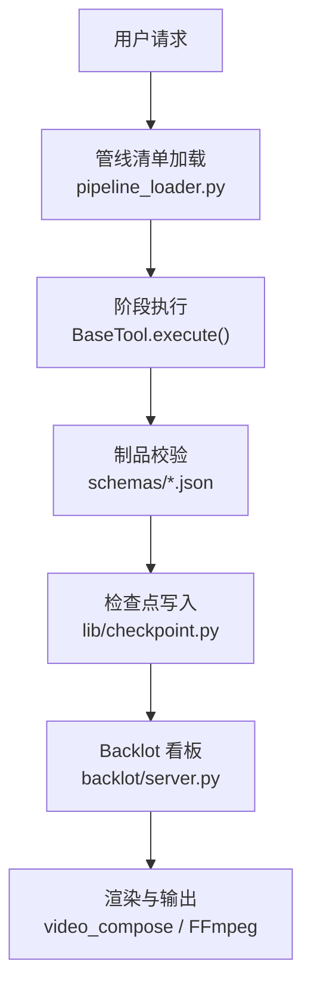
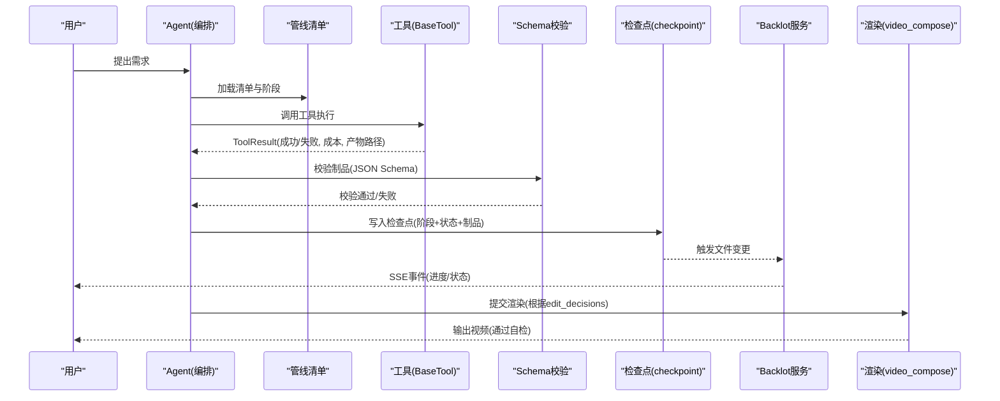
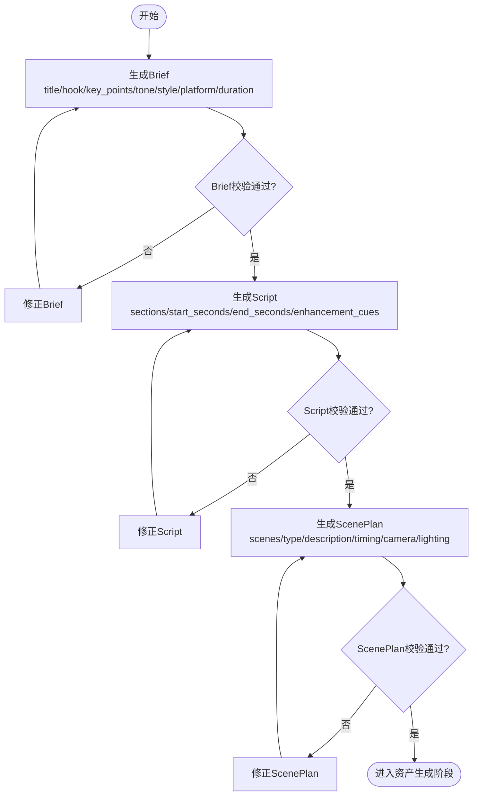
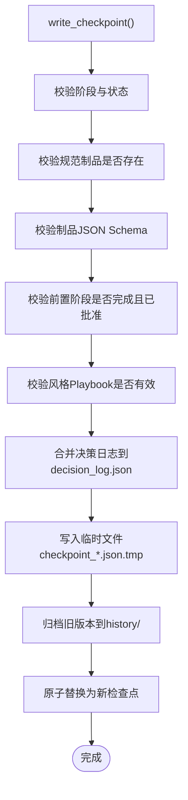
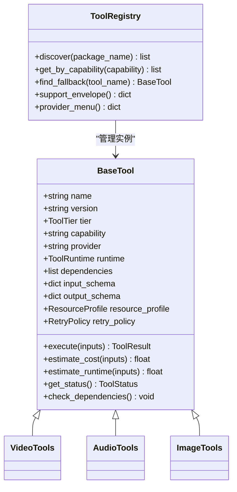
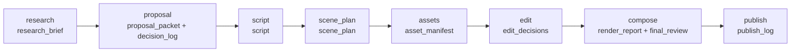
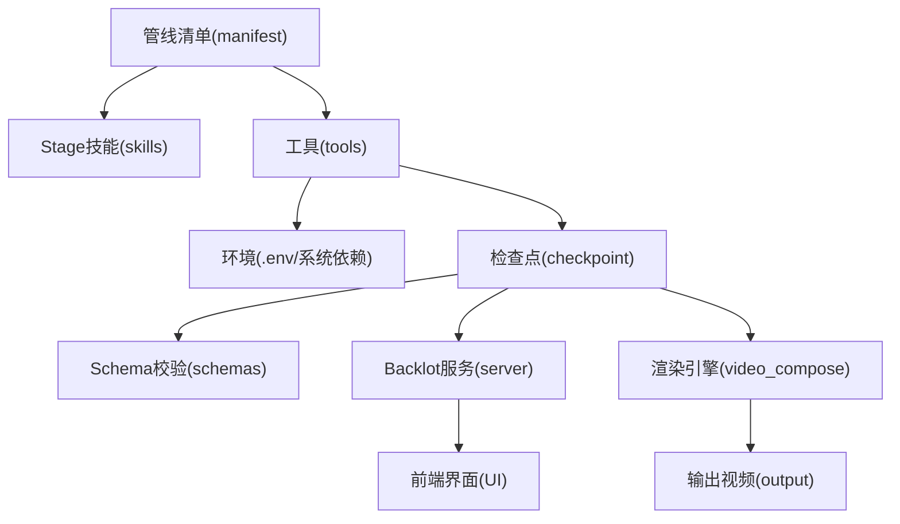

# 数据流设计

<cite>
**本文引用的文件**
- [README.md](file://README.md)
- [ARCHITECTURE.md](file://docs/ARCHITECTURE.md)
- [checkpoint.py](file://lib/checkpoint.py)
- [pipeline_loader.py](file://lib/pipeline_loader.py)
- [config_model.py](file://lib/config_model.py)
- [base_tool.py](file://tools/base_tool.py)
- [tool_registry.py](file://tools/tool_registry.py)
- [server.py](file://backlot/server.py)
- [animated-explainer.yaml](file://pipeline_defs/animated-explainer.yaml)
- [brief.schema.json](file://schemas/artifacts/brief.schema.json)
- [script.schema.json](file://schemas/artifacts/script.schema.json)
- [scene_plan.schema.json](file://schemas/artifacts/scene_plan.schema.json)
- [checkpoint.schema.json](file://schemas/checkpoints/checkpoint.schema.json)
</cite>

## 目录
1. [简介](#简介)
2. [项目结构](#项目结构)
3. [核心组件](#核心组件)
4. [架构总览](#架构总览)
5. [详细组件分析](#详细组件分析)
6. [依赖关系分析](#依赖关系分析)
7. [性能考虑](#性能考虑)
8. [故障排查指南](#故障排查指南)
9. [结论](#结论)
10. [附录](#附录)

## 简介
本架构文档聚焦 OpenMontage 的数据流设计，从用户请求到最终输出的完整数据处理流程进行系统化说明。内容覆盖输入验证、中间结果存储、输出格式化、数据模型（Brief、Script、ScenePlan）的关系与转换、工具与管道间的数据传递机制（含路径管理、临时文件清理、版本控制），以及数据流监控与调试工具。同时提供性能优化建议与最佳实践，确保数据流高效可靠。

OpenMontage 采用“代理驱动”的编排方式：LLM 编码助手充当编排器，读取 YAML 管线清单与 Markdown 技能指令，调用 Python 工具，写入检查点并自我审查，最终产出视频。Python 层仅提供工具与持久化能力，所有智能与质量规则以可编辑文本形式存在，便于审计与扩展。

**章节来源**
- [README.md:150-176](file://README.md#L150-L176)
- [ARCHITECTURE.md:9-27](file://docs/ARCHITECTURE.md#L9-L27)

## 项目结构
仓库按职责分层组织：
- lib：运行时基础设施（配置、检查点、管线加载、媒体规格等）
- tools：生产工具集合（视频、音频、图像、增强、分析、字幕等）
- pipeline_defs：YAML 管线清单（阶段顺序、工具可用性、审批策略）
- schemas：JSON Schema 校验定义（制品、检查点、管线、风格、工具）
- skills：Agent 技能与知识（Stage Director、Reviewer、Checkpoint Protocol 等）
- backlot：本地看板服务（FastAPI + SSE），实时展示管线状态与媒体
- remotion-composer：Remotion 渲染引擎（React/Node.js）
- styles：视觉风格 Playbook（YAML）

**图表来源**
- [pipeline_loader.py:39-70](file://lib/pipeline_loader.py#L39-L70)
- [base_tool.py:227-397](file://tools/base_tool.py#L227-L397)
- [checkpoint.py:422-564](file://lib/checkpoint.py#L422-L564)
- [server.py:165-212](file://backlot/server.py#L165-L212)

**章节来源**
- [ARCHITECTURE.md:31-76](file://docs/ARCHITECTURE.md#L31-L76)
- [README.md:450-475](file://README.md#L450-L475)

## 核心组件
- 管线清单加载器：负责加载与校验 YAML 管线清单，提取阶段顺序、所需工具、人类审批默认值等。
- 检查点系统：持久化每个阶段的产物与状态，支持恢复、历史归档、前置阶段强制校验、风格 Playbook 校验。
- 工具基类与注册表：统一工具契约（名称、能力、依赖、输入/输出 Schema、成本估算、重试策略等），自动发现与查询。
- Backlot 看板服务：基于 FastAPI 提供项目状态 API、SSE 事件流、缩略图与媒体访问，监听文件系统变更并推送更新。
- 配置模型：集中管理 LLM、预算、检查点策略、输出参数与路径解析。

这些组件共同构成数据流的骨架：清单驱动阶段推进，工具执行产生制品，Schema 保证数据一致性，检查点保障可恢复性，看板提供可视化监控。

**章节来源**
- [pipeline_loader.py:39-70](file://lib/pipeline_loader.py#L39-L70)
- [checkpoint.py:422-564](file://lib/checkpoint.py#L422-L564)
- [base_tool.py:227-397](file://tools/base_tool.py#L227-L397)
- [tool_registry.py:118-134](file://tools/tool_registry.py#L118-L134)
- [server.py:165-212](file://backlot/server.py#L165-L212)
- [config_model.py:65-93](file://lib/config_model.py#L65-L93)

## 架构总览
OpenMontage 的数据流遵循“清单—技能—工具—制品—检查点—渲染”的闭环：
- 用户提出需求后，Agent 读取管线清单与对应 Stage 技能，决定使用哪些工具。
- 工具执行产生中间制品（如 Brief、Script、ScenePlan、AssetManifest、EditDecisions、RenderReport）。
- 每个制品通过 JSON Schema 严格校验，写入检查点；检查点包含阶段、状态、时间戳、制品、成本快照、错误信息等。
- Backlot 服务监听项目目录变化，通过 SSE 向浏览器推送实时更新，并提供媒体与缩略图访问。
- 最终由 video_compose 选择渲染引擎（Remotion/HyperFrames/FFmpeg）生成输出视频，并通过 post-render 自检确保质量。

**图表来源**
- [pipeline_loader.py:125-149](file://lib/pipeline_loader.py#L125-L149)
- [base_tool.py:148-224](file://tools/base_tool.py#L148-L224)
- [checkpoint.py:422-564](file://lib/checkpoint.py#L422-L564)
- [server.py:183-212](file://backlot/server.py#L183-L212)

**章节来源**
- [ARCHITECTURE.md:9-27](file://docs/ARCHITECTURE.md#L9-L27)
- [README.md:408-444](file://README.md#L408-L444)

## 详细组件分析

### 数据模型与转换：Brief → Script → ScenePlan
- Brief（创意简报）：定义标题、钩子、关键要点、基调、风格、目标平台与时长，作为后续脚本创作的输入约束。
- Script（制作脚本）：将 Brief 转化为带时间戳的分段脚本，包含旁白表现意图、节奏曲线、停顿策略、发音指南与增强提示（叠加、B-roll、图表、代码片段、动画）。
- ScenePlan（场景计划）：将 Script 映射为有序场景列表，每个场景指定类型（对话头、B-roll、动画、角色场景、图表、文字卡、转场、生成、屏幕录制）、镜头语言、叙事角色、信息角色、英雄时刻标记、纹理关键词、必需资产及来源。

三者形成“概念→叙述→视觉”的逐步细化过程，确保每一帧都有明确的创作意图与实现路径。

**图表来源**
- [brief.schema.json:1-49](file://schemas/artifacts/brief.schema.json#L1-L49)
- [script.schema.json:1-105](file://schemas/artifacts/script.schema.json#L1-L105)
- [scene_plan.schema.json:1-118](file://schemas/artifacts/scene_plan.schema.json#L1-L118)

**章节来源**
- [brief.schema.json:1-49](file://schemas/artifacts/brief.schema.json#L1-L49)
- [script.schema.json:1-105](file://schemas/artifacts/script.schema.json#L1-L105)
- [scene_plan.schema.json:1-118](file://schemas/artifacts/scene_plan.schema.json#L1-L118)

### 检查点系统与版本控制
检查点是管线状态的核心载体，记录阶段、状态、时间戳、制品、成本快照、错误信息与元数据。写入时执行多重校验：
- 阶段合法性：来自管线清单的阶段列表（支持非标准阶段）
- 状态合法性：completed/failed/awaiting_human/in_progress
- 制品完整性：必须包含该阶段的规范制品（如 research→research_brief）
- 制品 Schema 校验：每个制品必须符合对应 JSON Schema
- 前置阶段强制：未完成或未批准的前置阶段不允许推进
- 风格 Playbook 校验：若引用了无效或不可用的风格，直接拒绝
- 决策日志合并：将决策记录合并到项目级 decision_log.json，并在相关制品中引用

检查点写入采用原子操作：先写临时文件，再归档旧版本到 history/，最后替换为新文件，避免中断导致损坏。

**图表来源**
- [checkpoint.py:124-191](file://lib/checkpoint.py#L124-L191)
- [checkpoint.py:284-346](file://lib/checkpoint.py#L284-L346)
- [checkpoint.py:349-419](file://lib/checkpoint.py#L349-L419)
- [checkpoint.py:422-564](file://lib/checkpoint.py#L422-L564)

**章节来源**
- [checkpoint.py:124-191](file://lib/checkpoint.py#L124-L191)
- [checkpoint.py:284-346](file://lib/checkpoint.py#L284-L346)
- [checkpoint.py:349-419](file://lib/checkpoint.py#L349-L419)
- [checkpoint.py:422-564](file://lib/checkpoint.py#L422-L564)

### 工具执行与数据传递
工具通过 BaseTool 抽象出统一接口，所有工具继承并实现 execute(inputs) -> ToolResult。工具声明：
- 身份与能力：name、version、tier、capability、provider、runtime、stability
- 依赖与环境：dependencies（cmd/env/python）、install_instructions
- 输入/输出 Schema：input_schema、output_schema、artifact_schema
- 资源与重试：resource_profile、retry_policy
- 成本与耗时估算：estimate_cost、estimate_runtime
- 幂等键：idempotency_key_fields
- 回退链：fallback_tools

工具执行被自动包装为 Backlot 事件发射器，记录 start/finish/error，附带 scene_id、depth、cost_usd、duration_s 等信息，供看板实时显示。

**图表来源**
- [base_tool.py:227-397](file://tools/base_tool.py#L227-L397)
- [tool_registry.py:55-134](file://tools/tool_registry.py#L55-L134)

**章节来源**
- [base_tool.py:227-397](file://tools/base_tool.py#L227-L397)
- [tool_registry.py:55-134](file://tools/tool_registry.py#L55-L134)

### 管线阶段与数据流转
以 animated-explainer 为例，标准阶段顺序为：research → proposal → script → scene_plan → assets → edit → compose → publish。每个阶段：
- 有对应的 Stage Director 技能（Markdown 指令）
- 声明 tools_available（可用工具）
- produces（产出的制品）
- checkpoint_required（是否需要检查点）
- human_approval_default（是否要求人类审批）
- review_focus（审查重点）
- success_criteria（成功标准）

数据在阶段间传递：
- research 产出 research_brief
- proposal 产出 proposal_packet 与 decision_log
- script 产出 script
- scene_plan 产出 scene_plan
- assets 产出 asset_manifest（包含生成的资产路径与来源）
- edit 产出 edit_decisions（剪辑决策，含 in/out 时间码）
- compose 产出 render_report（输出元数据）与 final_review（最终审查）
- publish 产出 publish_log（发布日志）

**图表来源**
- [animated-explainer.yaml:61-270](file://pipeline_defs/animated-explainer.yaml#L61-L270)

**章节来源**
- [animated-explainer.yaml:61-270](file://pipeline_defs/animated-explainer.yaml#L61-L270)

### 文件路径管理与临时文件清理
- 项目根目录：PROJECTS_DIR（默认 projects/），每个项目独立目录，包含 artifacts、assets/images、assets/video、assets/audio、assets/music、renders 等子目录
- 检查点文件：pipeline_dir/project_id/checkpoint_{stage}.json
- 历史归档：pipeline_dir/project_id/history/checkpoint_{stage}_{timestamp}.json
- 决策日志：pipeline_dir/project_id/decision_log.json
- 临时文件：检查点写入时使用 .tmp 后缀，成功后原子替换，失败不污染当前文件
- 缩略图缓存：.backlot/thumbs/ 下缓存缩略图，按源文件哈希命名，避免重复生成
- 媒体访问：/media/{project_id}/{file_path} 提供安全路径校验后的文件访问
- 路径逃逸防护：server.py 对 project_id 与 file_path 进行严格校验，防止越权访问

临时文件清理策略：
- 检查点历史归档保留完整运行记录，便于回放与审计
- 缩略图缓存基于文件 mtime 与 size 计算哈希，文件更新后自动失效重建
- 无全局清理任务，依赖文件系统生命周期与磁盘配额管理

**章节来源**
- [checkpoint.py:194-248](file://lib/checkpoint.py#L194-L248)
- [checkpoint.py:349-386](file://lib/checkpoint.py#L349-L386)
- [server.py:244-276](file://backlot/server.py#L244-L276)
- [server.py:325-365](file://backlot/server.py#L325-L365)

### 数据版本控制
- 检查点版本：每个检查点包含 version 字段（当前为 1.0），用于向后兼容
- 历史归档：每次覆盖前将旧检查点复制到 history/，保留完整版本链
- 决策日志：累积记录所有重大决策，支持追溯
- 制品 Schema 版本：每个制品 Schema 包含 version 字段（如 brief 1.0、script 1.0、scene_plan 1.0）
- 管线清单版本：manifest 包含 version 字段，支持演进

版本控制确保：
- 可恢复性：可从任意检查点恢复
- 可审计性：可回溯任何决策与状态变更
- 兼容性：Schema 与清单版本化，支持渐进式升级

**章节来源**
- [checkpoint.schema.json:1-47](file://schemas/checkpoints/checkpoint.schema.json#L1-L47)
- [checkpoint.py:349-386](file://lib/checkpoint.py#L349-L386)
- [brief.schema.json:1-49](file://schemas/artifacts/brief.schema.json#L1-L49)
- [script.schema.json:1-105](file://schemas/artifacts/script.schema.json#L1-L105)
- [scene_plan.schema.json:1-118](file://schemas/artifacts/scene_plan.schema.json#L1-L118)

## 依赖关系分析
OpenMontage 的依赖关系清晰分层：
- 管线清单依赖 Stage 技能与工具可用性
- 工具依赖环境（API Key、二进制、Python 包）
- 检查点依赖 Schema 与管线清单
- Backlot 依赖文件系统与 watchfiles（可选）
- 渲染依赖 video_compose 选择的引擎（Remotion/HyperFrames/FFmpeg）

**图表来源**
- [pipeline_loader.py:39-70](file://lib/pipeline_loader.py#L39-L70)
- [base_tool.py:304-328](file://tools/base_tool.py#L304-L328)
- [checkpoint.py:124-191](file://lib/checkpoint.py#L124-L191)
- [server.py:132-149](file://backlot/server.py#L132-L149)

**章节来源**
- [pipeline_loader.py:39-70](file://lib/pipeline_loader.py#L39-L70)
- [base_tool.py:304-328](file://tools/base_tool.py#L304-L328)
- [checkpoint.py:124-191](file://lib/checkpoint.py#L124-L191)
- [server.py:132-149](file://backlot/server.py#L132-L149)

## 性能考虑
- 清单加载缓存：load_pipeline_readonly 使用 lru_cache 缓存已加载的清单，避免重复解析与校验
- 工具发现缓存：ToolRegistry.discover 仅扫描一次，后续查询直接返回内存中的工具列表
- 检查点写入原子性：临时文件 + 原子替换，避免部分写入导致的损坏
- 缩略图缓存：按源文件哈希缓存缩略图，避免重复生成
- SSE 事件节流：ChangeHub 队列限流，避免广播风暴
- 批量文件监听：watchfiles 批量处理变更，过滤无关路径（node_modules、.git、__pycache__、.cache）
- 渲染引擎选择：根据 edit_decisions.render_runtime 锁定渲染引擎，避免运行时切换带来的不确定性
- 成本估算与预算控制：estimate_cost 与 CostTracker 在工具调用前预估成本，防止超支

最佳实践：
- 合理设置 checkpoint_policy（guided/manual_all/auto_noncreative）平衡效率与控制
- 使用 schema 校验确保数据一致性，避免下游处理失败
- 利用 tool_registry 的 find_fallback 实现优雅降级
- 通过 Backlot 看板实时监控进度与错误，快速定位问题
- 定期清理 history/ 与 .backlot/thumbs/ 下的旧文件，避免磁盘占用过大

[本节为通用性能指导，无需具体文件来源]

## 故障排查指南
常见问题与解决方案：
- 检查点写入失败：
  - 检查阶段是否在管线清单中定义
  - 检查制品是否符合 JSON Schema
  - 检查前置阶段是否已完成且已批准
  - 查看 error 字段获取具体错误信息
- 工具不可用：
  - 检查 dependencies（cmd/env/python）是否满足
  - 查看 tool_registry.provider_menu() 的输出，确认工具状态
  - 使用 find_fallback 寻找替代工具
- Backlot 无法连接：
  - 确认 PROJECTS_DIR 存在且可读
  - 检查 watchfiles 是否安装（可选依赖）
  - 查看 SSE 事件是否正常推送
- 渲染失败：
  - 检查 render_runtime 是否与提案一致
  - 查看 render_report 中的输出路径与元数据
  - 使用 ffprobe 验证输出文件有效性

调试工具：
- Backlot 看板：实时查看项目状态、阶段进度、资产生成情况
- 决策日志：project_id/decision_log.json 记录所有重大决策
- 检查点历史：project_id/history/ 保存每个阶段的版本历史
- 工具事件：events.jsonl 记录每个工具调用的 start/finish/error

**章节来源**
- [checkpoint.py:422-564](file://lib/checkpoint.py#L422-L564)
- [tool_registry.py:249-314](file://tools/tool_registry.py#L249-L314)
- [server.py:165-212](file://backlot/server.py#L165-L212)

## 结论
OpenMontage 的数据流设计以“清单驱动、Schema 校验、检查点持久化、看板可视化”为核心，实现了从用户请求到最终视频的端到端自动化生产。通过严格的输入验证、中间结果存储、输出格式化工具链，以及完善的版本控制与监控机制，确保了数据流的高效性与可靠性。开发者可基于此架构扩展新工具、新管线与新技能，持续增强系统能力。

[本节为总结性内容，无需具体文件来源]

## 附录
- 配置项参考：config.yaml 中的 llm、budget、checkpoint、output、paths 等配置
- 媒体规格：YouTube、TikTok、Instagram 等平台的目标分辨率与比例
- 渲染引擎：Remotion（React/Node.js）、HyperFrames（HTML/CSS/GSAP）、FFmpeg（基础剪辑）
- 供应商集成：20+ 视频生成、15+ 图像生成、10+ TTS 供应商，支持多云与本地部署

[本节为补充信息，无需具体文件来源]