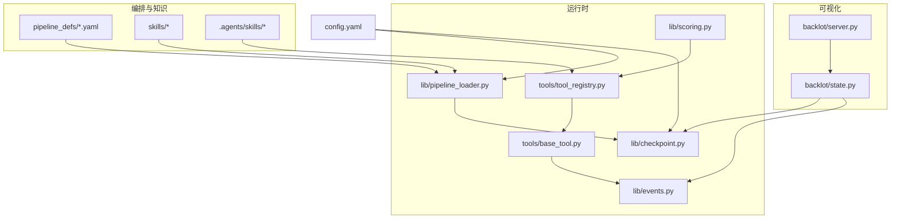
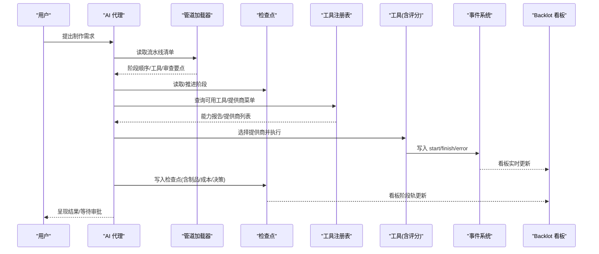
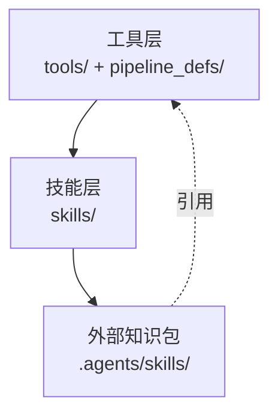
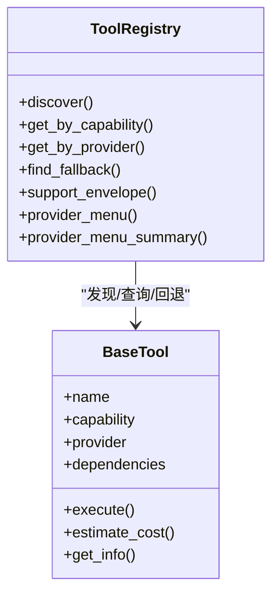
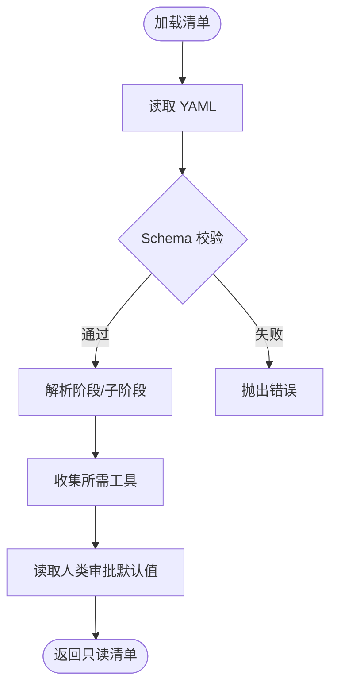
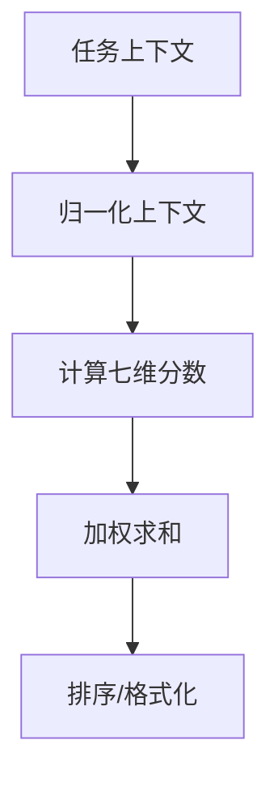
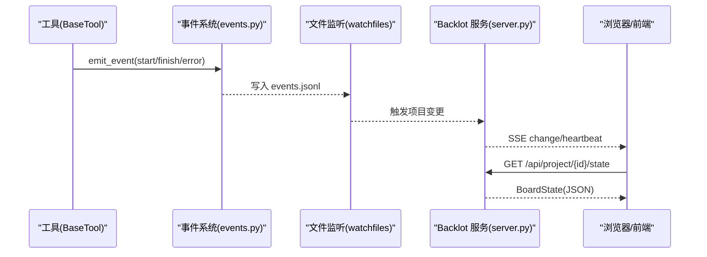
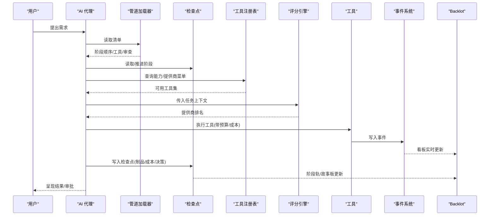
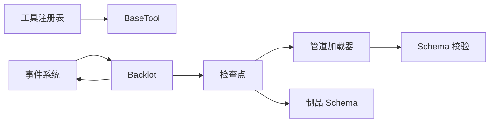

# 核心架构

<cite>
**本文引用的文件**
- [README.md](file://README.md)
- [docs/ARCHITECTURE.md](file://docs/ARCHITECTURE.md)
- [lib/pipeline_loader.py](file://lib/pipeline_loader.py)
- [lib/scoring.py](file://lib/scoring.py)
- [tools/tool_registry.py](file://tools/tool_registry.py)
- [tools/base_tool.py](file://tools/base_tool.py)
- [lib/checkpoint.py](file://lib/checkpoint.py)
- [backlot/server.py](file://backlot/server.py)
- [backlot/state.py](file://backlot/state.py)
- [lib/events.py](file://lib/events.py)
- [config.yaml](file://config.yaml)
</cite>

## 目录
1. [引言](#引言)
2. [项目结构](#项目结构)
3. [核心组件](#核心组件)
4. [架构总览](#架构总览)
5. [详细组件分析](#详细组件分析)
6. [依赖关系分析](#依赖关系分析)
7. [性能考量](#性能考量)
8. [故障排查指南](#故障排查指南)
9. [结论](#结论)
10. [附录：扩展点与最佳实践](#附录：扩展点与最佳实践)

## 引言
OpenMontage 是一个“代理优先”的开源视频生产系统。其核心理念是：没有独立的 Python 编排器，AI 编程助手（如 Claude、Cursor、Copilot）作为编排者，读取流水线清单与阶段技能，调用工具并持久化状态；Python 层仅提供工具、配置、校验与可观测性基础设施。系统通过三层知识架构组织能力与知识：工具层（可执行能力）、技能层（项目内规范与质量门槛）、外部知识包（第三方技术深度说明）。配合评分引擎、管道加载器、事件驱动与 Backlot 可视化看板，形成从用户请求到最终输出的完整数据流与治理闭环。

**章节来源**
- [docs/ARCHITECTURE.md:1-100](file://docs/ARCHITECTURE.md#L1-L100)
- [README.md:408-486](file://README.md#L408-L486)

## 项目结构
仓库采用“能力分层 + 声明式编排”的组织方式：
- lib：核心运行时（配置、检查点、管道加载、评分、媒体配置等）
- tools：工具实现与注册表（音视频生成、编辑、增强、分析、发布等）
- pipeline_defs：YAML 流水线清单（阶段、工具、审查要点、成功标准）
- skills：技能层（阶段导演技能、创作技巧、元技能）
- .agents/skills：外部知识包（Layer 3）
- backlot：本地看板服务（FastAPI + SSE），提供项目库、实时状态与媒体访问
- schemas：JSON Schema 契约（制品、检查点、流水线、风格等）
- styles：视觉风格剧本（YAML）
- remotion-composer：Remotion 渲染后端（React/TS）

**图表来源**
- [lib/pipeline_loader.py:1-77](file://lib/pipeline_loader.py#L1-L77)
- [lib/checkpoint.py:198-248](file://lib/checkpoint.py#L198-L248)
- [lib/scoring.py:373-542](file://lib/scoring.py#L373-L542)
- [tools/tool_registry.py:55-134](file://tools/tool_registry.py#L55-L134)
- [tools/base_tool.py:227-372](file://tools/base_tool.py#L227-L372)
- [lib/events.py:1-119](file://lib/events.py#L1-L119)
- [backlot/server.py:165-307](file://backlot/server.py#L165-L307)
- [backlot/state.py:588-658](file://backlot/state.py#L588-L658)
- [config.yaml:1-34](file://config.yaml#L1-L34)

**章节来源**
- [docs/ARCHITECTURE.md:31-76](file://docs/ARCHITECTURE.md#L31-L76)
- [README.md:450-486](file://README.md#L450-L486)

## 核心组件
- 工具契约与基类：所有工具继承 BaseTool，统一身份、能力、依赖、资源画像、成本估算、重试策略、执行接口与结果结构，并在子类 execute 上自动注入 Backlot 事件埋点。
- 工具注册表：单例 ToolRegistry，自动发现 tools 包下的工具，按能力/提供商/稳定性/可用性查询，生成支持信封与提供商菜单，维护回退链。
- 管道加载器：加载并校验 pipeline_defs/*.yaml，提取阶段顺序、子阶段、所需工具、人类审批默认值、扩展权限等。
- 评分引擎：对候选提供商进行七维加权评分（任务契合、输出质量、可控性、可靠性、成本效率、延迟、连续性），并归一化任务上下文以适配松散提示。
- 检查点系统：以 JSON 形式持久化阶段状态与制品，强制校验制品 schema，强制执行前置阶段完成与人类审批门控，归档历史版本，合并决策日志。
- 事件系统与 Backlot：BaseTool 执行前后写入 events.jsonl；Backlot 使用 watchfiles 监听项目目录变更，通过 SSE 推送变化；state.py 将项目目录转换为可渲染的看板状态（阶段轨、故事板、媒体、成本、活动状态）。
- 配置：全局 config.yaml 定义 LLM、预算、检查点策略、输出参数与路径；.env 管理各提供商密钥。

**章节来源**
- [tools/base_tool.py:227-372](file://tools/base_tool.py#L227-L372)
- [tools/tool_registry.py:55-134](file://tools/tool_registry.py#L55-L134)
- [lib/pipeline_loader.py:49-77](file://lib/pipeline_loader.py#L49-L77)
- [lib/scoring.py:373-542](file://lib/scoring.py#L373-L542)
- [lib/checkpoint.py:422-564](file://lib/checkpoint.py#L422-L564)
- [lib/events.py:77-119](file://lib/events.py#L77-L119)
- [backlot/server.py:165-307](file://backlot/server.py#L165-L307)
- [backlot/state.py:588-658](file://backlot/state.py#L588-L658)
- [config.yaml:1-34](file://config.yaml#L1-L34)

## 架构总览
OpenMontage 采用“代理优先”的编排模式：AI 助手作为控制面，读取 YAML 清单与 Markdown 技能，调用 Python 工具，写检查点并自我审查；Python 层负责工具、校验、可观测性与可视化。

**图表来源**
- [lib/pipeline_loader.py:49-77](file://lib/pipeline_loader.py#L49-L77)
- [tools/tool_registry.py:198-230](file://tools/tool_registry.py#L198-L230)
- [tools/base_tool.py:148-224](file://tools/base_tool.py#L148-L224)
- [lib/checkpoint.py:422-564](file://lib/checkpoint.py#L422-L564)
- [backlot/server.py:165-307](file://backlot/server.py#L165-L307)
- [backlot/state.py:588-658](file://backlot/state.py#L588-L658)

## 详细组件分析

### 三层知识架构
- 工具层（Layer 1）：tools/ 与 pipeline_defs/，描述“有什么能力”和“何时使用”。
- 技能层（Layer 2）：skills/，描述“在本项目中如何使用”，包含阶段导演技能、创作技巧、元技能。
- 外部知识包（Layer 3）：.agents/skills/，描述“技术如何工作”，由工具的 agent_skills 引用。

**图表来源**
- [docs/ARCHITECTURE.md:321-342](file://docs/ARCHITECTURE.md#L321-L342)
- [tools/base_tool.py:277-281](file://tools/base_tool.py#L277-L281)

**章节来源**
- [docs/ARCHITECTURE.md:321-342](file://docs/ARCHITECTURE.md#L321-L342)
- [README.md:477-486](file://README.md#L477-L486)

### 代理优先架构与工作流
- 无运行时编排器：AI 代理读取清单与技能，驱动阶段流转。
- 阶段流程：research → proposal → script → scene_plan → assets → edit → compose → publish。
- 每阶段有导演技能、可用工具、产出制品、审查焦点与成功标准，必要时要求人类审批。

**图表来源**
- [docs/ARCHITECTURE.md:170-239](file://docs/ARCHITECTURE.md#L170-L239)
- [AGENT_GUIDE.md:181-201](file://AGENT_GUIDE.md#L181-L201)

**章节来源**
- [docs/ARCHITECTURE.md:80-100](file://docs/ARCHITECTURE.md#L80-L100)
- [docs/ARCHITECTURE.md:170-239](file://docs/ARCHITECTURE.md#L170-L239)

### 工具注册表机制
- 自动发现：基于 pkgutil 遍历 tools 包，跳过 base_tool 与 tool_registry 自身模块，实例化每个 BaseTool 子类并注册。
- 能力查询：按 tier/capability/provider/status/stability 分组与筛选；支持 fallback 链查找。
- 支持信封与提供商菜单：聚合工具信息，过滤 selector 自身，去重 unavailable providers，汇总 setup offers 与运行时警告。
- 环境加载：导入时加载 .env，确保 API Key 在工具实例化前可用。

**图表来源**
- [tools/tool_registry.py:55-134](file://tools/tool_registry.py#L55-L134)
- [tools/tool_registry.py:198-314](file://tools/tool_registry.py#L198-L314)
- [tools/base_tool.py:227-372](file://tools/base_tool.py#L227-L372)

**章节来源**
- [tools/tool_registry.py:55-134](file://tools/tool_registry.py#L55-L134)
- [tools/tool_registry.py:198-314](file://tools/tool_registry.py#L198-L314)
- [tools/base_tool.py:25-60](file://tools/base_tool.py#L25-L60)

### 管道加载器
- 加载与校验：读取 pipeline_defs/*.yaml，使用 JSON Schema 校验清单结构。
- 阶段顺序与子阶段：支持 include_sub_stages 暴露样本/预览单元；条件激活子阶段。
- 工具需求收集：聚合 preferred_tools/fallback_tools/tools_available 及参考输入分析工具。
- 人类审批默认值：为门控逻辑提供单一来源。
- 扩展权限：限制 custom_scripts/custom_playbooks/custom_skills/custom_tools 的使用。

**图表来源**
- [lib/pipeline_loader.py:49-77](file://lib/pipeline_loader.py#L49-L77)
- [lib/pipeline_loader.py:98-162](file://lib/pipeline_loader.py#L98-L162)
- [lib/pipeline_loader.py:165-182](file://lib/pipeline_loader.py#L165-L182)
- [lib/pipeline_loader.py:201-241](file://lib/pipeline_loader.py#L201-L241)

**章节来源**
- [lib/pipeline_loader.py:49-77](file://lib/pipeline_loader.py#L49-L77)
- [lib/pipeline_loader.py:98-162](file://lib/pipeline_loader.py#L98-L162)
- [lib/pipeline_loader.py:165-182](file://lib/pipeline_loader.py#L165-L182)
- [lib/pipeline_loader.py:201-241](file://lib/pipeline_loader.py#L201-L241)

### 评分引擎
- 任务上下文归一化：从 intent/style/brief/platform/needs/prompt 等字段构建标准化上下文，推断 asset_type、motion_required、偏好生成/编辑/参考等信号。
- 提供商评分：计算 task_fit、output_quality、control、reliability、cost_efficiency、latency、continuity，并按权重加权得到总分。
- 语义匹配：同义词簇与分词提升匹配鲁棒性；针对“电影级/多镜头/参考/图像编辑”等意图给予加分或惩罚。
- 排名与格式化：rank_providers 返回排序后的 ProviderScore；format_ranking 用于展示。

**图表来源**
- [lib/scoring.py:297-359](file://lib/scoring.py#L297-L359)
- [lib/scoring.py:373-530](file://lib/scoring.py#L373-L530)
- [lib/scoring.py:533-557](file://lib/scoring.py#L533-L557)

**章节来源**
- [lib/scoring.py:297-359](file://lib/scoring.py#L297-L359)
- [lib/scoring.py:373-530](file://lib/scoring.py#L373-L530)
- [lib/scoring.py:533-557](file://lib/scoring.py#L533-L557)

### 事件驱动架构与 Backlot 监控系统
- 事件写入：BaseTool.execute 被装饰器包装，自动写入 start/finish/error 到 events.jsonl；线程安全追加，跨进程容忍损坏行。
- 项目归属推断：根据输入中的 project_dir/project_path 或任何 projects/ 下的路径推断项目目录。
- 看板服务：FastAPI 提供健康检查、项目列表、项目状态、SSE 事件流、缩略图与媒体访问；watchfiles 监听项目目录变更，去抖后广播。
- 状态推导：state.py 将项目目录转换为 BoardState（阶段轨、故事板、媒体、成本、活动状态、卡顿检测）。

**图表来源**
- [tools/base_tool.py:148-224](file://tools/base_tool.py#L148-L224)
- [lib/events.py:46-119](file://lib/events.py#L46-L119)
- [backlot/server.py:132-149](file://backlot/server.py#L132-L149)
- [backlot/server.py:165-307](file://backlot/server.py#L165-L307)
- [backlot/state.py:588-658](file://backlot/state.py#L588-L658)

**章节来源**
- [lib/events.py:1-119](file://lib/events.py#L1-L119)
- [backlot/server.py:1-369](file://backlot/server.py#L1-L369)
- [backlot/state.py:1-716](file://backlot/state.py#L1-L716)

### 数据流设计：从用户请求到最终输出

**图表来源**
- [lib/pipeline_loader.py:49-77](file://lib/pipeline_loader.py#L49-L77)
- [tools/tool_registry.py:198-314](file://tools/tool_registry.py#L198-L314)
- [lib/scoring.py:373-542](file://lib/scoring.py#L373-L542)
- [tools/base_tool.py:148-224](file://tools/base_tool.py#L148-L224)
- [lib/checkpoint.py:422-564](file://lib/checkpoint.py#L422-L564)
- [backlot/server.py:165-307](file://backlot/server.py#L165-L307)
- [backlot/state.py:588-658](file://backlot/state.py#L588-L658)

**章节来源**
- [docs/ARCHITECTURE.md:8-27](file://docs/ARCHITECTURE.md#L8-L27)
- [README.md:408-447](file://README.md#L408-L447)

## 依赖关系分析
- 组件耦合：
  - 工具注册表依赖 BaseTool 契约与 .env 加载；提供能力枚举与回退链。
  - 管道加载器依赖 JSON Schema 与 YAML 解析，为检查点与看板提供阶段与门控信息。
  - 检查点依赖管道加载器获取阶段顺序与人类审批默认值，依赖 schemas 校验制品。
  - 事件系统独立于执行路径，仅追加日志，不影响主流程。
  - Backlot 依赖事件系统与检查点/制品文件，只读推导看板状态。
- 外部依赖：
  - FFmpeg（视频处理）、Node.js（Remotion/HyperFrames）、GPU（本地模型）、Piper（离线 TTS）等。
- 循环依赖：
  - 未发现直接循环；事件与看板为单向消费。

**图表来源**
- [tools/tool_registry.py:55-134](file://tools/tool_registry.py#L55-L134)
- [lib/pipeline_loader.py:49-77](file://lib/pipeline_loader.py#L49-L77)
- [lib/checkpoint.py:118-191](file://lib/checkpoint.py#L118-L191)
- [lib/events.py:77-119](file://lib/events.py#L77-L119)
- [backlot/server.py:165-307](file://backlot/server.py#L165-L307)
- [backlot/state.py:588-658](file://backlot/state.py#L588-L658)

**章节来源**
- [docs/ARCHITECTURE.md:498-512](file://docs/ARCHITECTURE.md#L498-L512)

## 性能考量
- 缓存与只读清单：load_pipeline_readonly 使用 lru_cache 避免重复解析与校验，降低热路径开销。
- 事件写入：events.jsonl 使用线程锁与 O_APPEND 追加，容忍损坏行，保证零侵入。
- 看板状态推导：_cached_summaries 缓存项目摘要，watchfiles 批量去抖，避免频繁全量扫描。
- 缩略图缓存：/thumb 端点对图片/视频帧进行缩放并缓存 JPEG，减少重复转码。
- 评分引擎：关键词重叠与同义词簇加速匹配；测量延迟/质量指标可替代启发式，提高准确性。

[本节为通用性能建议，不直接分析具体文件]

## 故障排查指南
- 工具不可用：
  - 检查 dependencies（cmd/env/python）是否满足；查看 provider_menu_summary 的 runtime_warnings 与 setup_offers。
  - 确认 .env 已正确加载（base_tool 与 registry 均会加载）。
- 阶段无法推进：
  - 检查前置阶段是否 completed 且 human_approved（若 manifest 要求）；查看 checkpoint 历史与 decision_log。
- 看板无更新：
  - 确认 events.jsonl 存在且非空；检查 watchfiles 是否可用；验证 /api/project/{id}/events 的 SSE 连接。
- 渲染失败：
  - 查看 compose 阶段的 render_report 与 final_review；确认 FFmpeg/Remotion/HyperFrames 环境就绪。
- 预算超支：
  - 检查 cost_tracker 模式（observe/warn/cap）与阈值；核对 estimate/reserve/reconcile 流程。

**章节来源**
- [tools/tool_registry.py:316-471](file://tools/tool_registry.py#L316-L471)
- [tools/base_tool.py:296-327](file://tools/base_tool.py#L296-L327)
- [lib/checkpoint.py:251-346](file://lib/checkpoint.py#L251-L346)
- [backlot/server.py:132-149](file://backlot/server.py#L132-L149)
- [backlot/server.py:242-276](file://backlot/server.py#L242-L276)
- [config.yaml:9-18](file://config.yaml#L9-L18)

## 结论
OpenMontage 通过“代理优先 + 三层知识架构 + 评分引擎 + 事件驱动 + Backlot 可视化”的组合，实现了可扩展、可审计、可恢复的视频生产流水线。Python 层聚焦工具、校验与可观测性，AI 代理负责创意与编排决策；清单与技能驱动行为，使系统具备强可解释性与高可定制性。

[本节为总结性内容，不直接分析具体文件]

## 附录：扩展点与最佳实践
- 添加新工具：
  - 在 tools/ 下创建模块，继承 BaseTool，实现 execute 与必要元数据（name/capability/provider/dependencies/input_schema/output_schema 等）。
  - 工具会被自动发现；如需使用 Layer 3 知识，设置 agent_skills。
  - 建议在 estimate_cost/estimate_runtime 中提供成本与时长估计，便于预算治理。
- 添加新流水线：
  - 在 pipeline_defs/ 新增 YAML 清单，定义 stages、skill、produces、review_focus、success_criteria、human_approval_default 等。
  - 在 skills/pipelines/<pipeline>/ 下编写阶段导演技能，明确执行步骤与质量门槛。
- 自定义功能：
  - 通过 extensions 字段启用 custom_scripts/custom_playbooks/custom_skills/custom_tools（需显式允许）。
  - 使用评分引擎提供的 normalize_task_context 与 score_provider/rank_providers 进行提供商选择与解释。
- 最佳实践：
  - 始终使用 load_pipeline_readonly 获取清单，避免重复解析。
  - 在工具执行中尽量提供结构化 artifacts 与 cost_usd/duration_seconds，便于审计与优化。
  - 利用 Backlot 的事件与阶段轨进行问题定位与回放。

**章节来源**
- [README.md:707-724](file://README.md#L707-L724)
- [lib/pipeline_loader.py:201-241](file://lib/pipeline_loader.py#L201-L241)
- [lib/scoring.py:297-359](file://lib/scoring.py#L297-L359)
- [tools/base_tool.py:374-407](file://tools/base_tool.py#L374-L407)