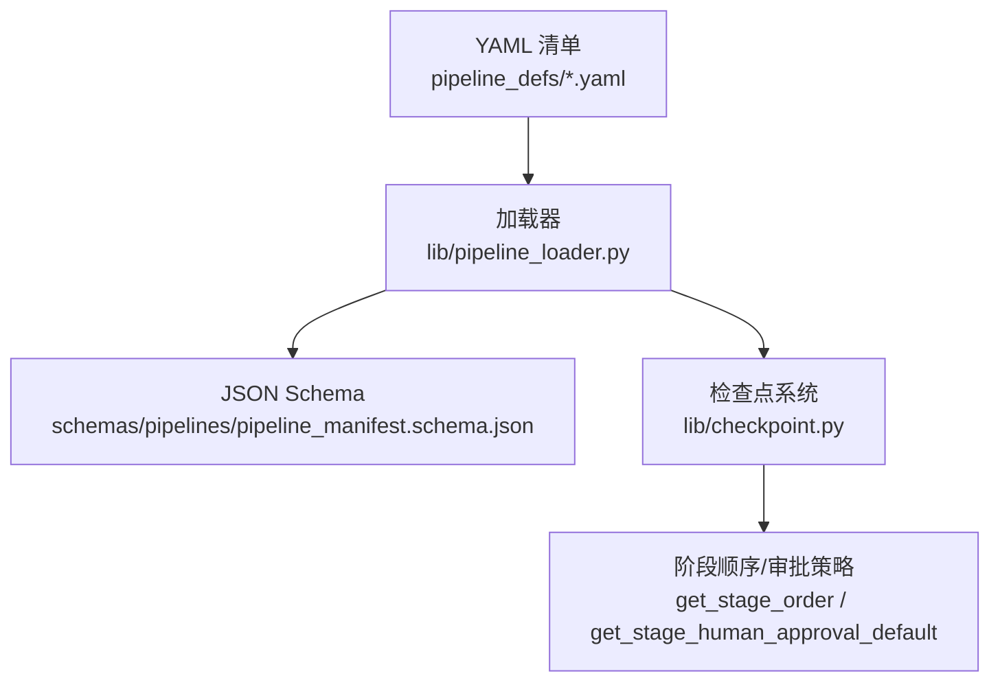
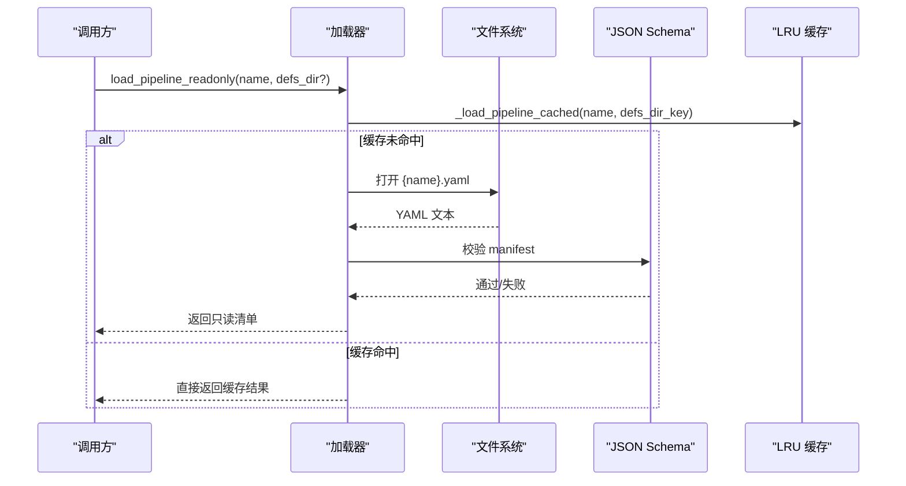
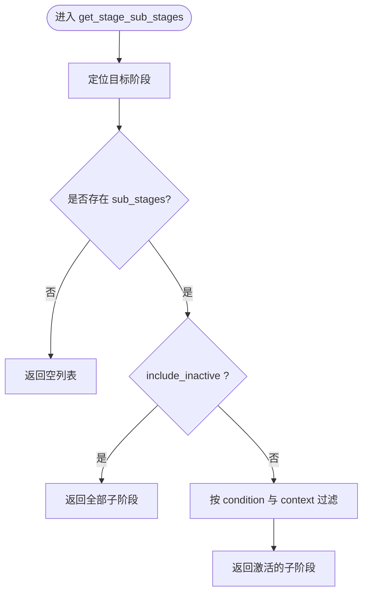
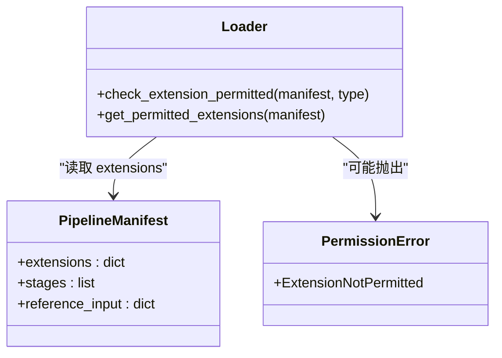
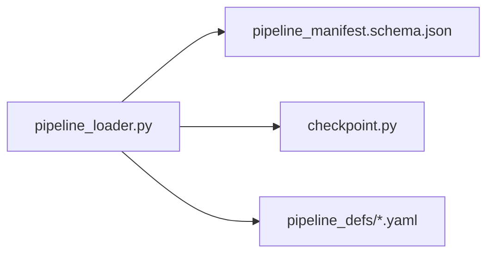

# 管道加载器

<cite>
**本文引用的文件**
- [lib/pipeline_loader.py](file://lib/pipeline_loader.py)
- [schemas/pipelines/pipeline_manifest.schema.json](file://schemas/pipelines/pipeline_manifest.schema.json)
- [pipeline_defs/talking-head.yaml](file://pipeline_defs/talking-head.yaml)
- [pipeline_defs/documentary-montage.yaml](file://pipeline_defs/documentary-montage.yaml)
- [lib/checkpoint.py](file://lib/checkpoint.py)
- [tests/contracts/test_pipeline_catalog.py](file://tests/contracts/test_pipeline_catalog.py)
- [tests/contracts/test_phase1_contracts.py](file://tests/contracts/test_phase1_contracts.py)
- [skills/meta/capability-extension.md](file://skills/meta/capability-extension.md)
</cite>

## 目录
1. [简介](#简介)
2. [项目结构](#项目结构)
3. [核心组件](#核心组件)
4. [架构总览](#架构总览)
5. [详细组件分析](#详细组件分析)
6. [依赖关系分析](#依赖关系分析)
7. [性能考量](#性能考量)
8. [故障排查指南](#故障排查指南)
9. [结论](#结论)
10. [附录：API参考与使用示例](#附录api参考与使用示例)

## 简介
本技术文档聚焦 OpenMontage 的“管道加载器”，系统性说明其实现原理与关键能力，包括：
- YAML 清单解析与 JSON Schema 校验
- 缓存机制与只读访问模式
- 管道元数据提取（阶段顺序、工具依赖、技能路径等）
- 条件执行机制（基于运行时上下文的子阶段动态过滤）
- 扩展权限控制（自定义脚本、播放列表、技能、工具的启用开关）
- 完整的 API 参考与使用示例

该加载器是编排器与检查点系统的基石，确保所有管道在启动前具备一致、可验证的结构与策略。

## 项目结构
OpenMontage 将“管道定义”以 YAML 清单形式声明在 pipeline_defs 目录下，并通过 schemas/pipelines 下的 JSON Schema 进行强约束。加载器位于 lib/pipeline_loader.py，提供统一的读取、校验与查询接口；checkpoint 系统通过加载器获取阶段顺序与审批策略，保证运行期行为与声明一致。

图表来源
- [lib/pipeline_loader.py:49-70](file://lib/pipeline_loader.py#L49-L70)
- [schemas/pipelines/pipeline_manifest.schema.json:1-197](file://schemas/pipelines/pipeline_manifest.schema.json#L1-L197)
- [lib/checkpoint.py:51-75](file://lib/checkpoint.py#L51-L75)

章节来源
- [lib/pipeline_loader.py:1-77](file://lib/pipeline_loader.py#L1-L77)
- [lib/checkpoint.py:51-75](file://lib/checkpoint.py#L51-L75)

## 核心组件
- 清单加载与校验：load_pipeline(name, defs_dir=None)
- 只读缓存访问：load_pipeline_readonly(name, defs_dir=None)
- 清单枚举：list_pipelines(defs_dir=None)
- 元数据提取：
  - get_stage_order(manifest, include_sub_stages=False, context=None)
  - get_required_tools(manifest)
  - get_stage_skill(manifest, stage_name)
  - get_stage_human_approval_default(manifest, stage_name)
  - get_stage_review_focus(manifest, stage_name)
  - get_reference_input_config(manifest) / pipeline_supports_reference_input(manifest)
- 条件执行：get_stage_sub_stages(manifest, stage_name, context=None, include_inactive=True)
- 扩展权限控制：check_extension_permitted(manifest, extension_type), get_permitted_extensions(manifest)

章节来源
- [lib/pipeline_loader.py:39-70](file://lib/pipeline_loader.py#L39-L70)
- [lib/pipeline_loader.py:73-162](file://lib/pipeline_loader.py#L73-L162)
- [lib/pipeline_loader.py:165-241](file://lib/pipeline_loader.py#L165-L241)

## 架构总览
加载器作为“声明到运行时”的桥梁，负责：
- 从 pipeline_defs 读取 YAML 清单
- 使用 JSON Schema 严格校验结构
- 提供只读缓存避免重复 I/O 与校验开销
- 暴露查询接口供编排器与检查点系统消费

图表来源
- [lib/pipeline_loader.py:27-46](file://lib/pipeline_loader.py#L27-L46)
- [lib/pipeline_loader.py:49-70](file://lib/pipeline_loader.py#L49-L70)

## 详细组件分析

### 清单加载与校验（load_pipeline）
- 路径处理：默认使用仓库根下的 pipeline_defs 目录，可通过 defs_dir 覆盖
- 错误处理：找不到清单时抛出 FileNotFoundError；YAML 解析或 Schema 校验失败由底层库抛出异常
- 性能优化：
  - Schema 对象通过 lru_cache(maxsize=1) 全局缓存
  - 清单内容通过 _load_pipeline_cached(name, defs_dir_key) 缓存，键包含 defs_dir 字符串，避免重复解析与校验
  - 对外暴露 load_pipeline_readonly 强制只读语义，便于热路径（如检查点写入）复用

章节来源
- [lib/pipeline_loader.py:27-46](file://lib/pipeline_loader.py#L27-L46)
- [lib/pipeline_loader.py:49-70](file://lib/pipeline_loader.py#L49-L70)

### 条件执行机制（子阶段动态过滤）
- 子阶段支持 condition 字段，表示激活条件（例如某个上下文键存在即激活）
- get_stage_sub_stages 支持 include_inactive=False 且传入 context 时，仅返回满足条件的子阶段
- 内部通过 _condition_is_active 对 condition 与 context 做简单布尔判断

图表来源
- [lib/pipeline_loader.py:79-122](file://lib/pipeline_loader.py#L79-L122)

章节来源
- [lib/pipeline_loader.py:79-122](file://lib/pipeline_loader.py#L79-L122)

### 管道元数据提取
- 阶段顺序：get_stage_order 返回主阶段顺序；当 include_sub_stages=True 时，会追加 <stage>.<sub_stage> 形式的子阶段名，便于代理展示但不强制为检查点阶段
- 工具依赖：get_required_tools 聚合各阶段的 preferred/fallback/tools_available 以及 reference_input.analysis_tools
- 技能路径：get_stage_skill 返回指令驱动阶段的 skill 路径
- 人工审批默认值：get_stage_human_approval_default 用于 gate 决策
- 审查焦点：get_stage_review_focus 返回每个阶段的 review_focus 列表
- 引用输入：get_reference_input_config 与 pipeline_supports_reference_input 提供引用视频输入的配置与开关

章节来源
- [lib/pipeline_loader.py:88-162](file://lib/pipeline_loader.py#L88-L162)

### 扩展权限控制机制
- 扩展类型：custom_scripts、custom_playbooks、custom_skills、custom_tools
- 校验：check_extension_permitted 若未在 manifest.extensions 中显式允许对应扩展，则抛出 ExtensionNotPermitted
- 查询：get_permitted_extensions 返回当前管道的扩展权限字典（含默认值）
- 典型用法：在执行自定义脚本、生成自定义播放列表、注册新技能或工具前，先调用 check_extension_permitted 进行白名单校验

图表来源
- [lib/pipeline_loader.py:197-241](file://lib/pipeline_loader.py#L197-L241)
- [schemas/pipelines/pipeline_manifest.schema.json:183-193](file://schemas/pipelines/pipeline_manifest.schema.json#L183-L193)

章节来源
- [lib/pipeline_loader.py:197-241](file://lib/pipeline_loader.py#L197-L241)
- [schemas/pipelines/pipeline_manifest.schema.json:183-193](file://schemas/pipelines/pipeline_manifest.schema.json#L183-L193)

### 与检查点系统的集成
- 阶段顺序：checkpoint.get_pipeline_stages 优先通过加载器获取声明的顺序，否则回退到内置的稳定顺序
- 审批策略：通过 get_stage_human_approval_default 统一读取同一字段，确保 UI 与 gate 逻辑一致
- 产物校验：检查点写入时对产物进行 schema 校验，结合清单中的 produces 与 required_artifacts_in 形成端到端一致性

章节来源
- [lib/checkpoint.py:51-75](file://lib/checkpoint.py#L51-L75)
- [lib/pipeline_loader.py:173-182](file://lib/pipeline_loader.py#L173-L182)

## 依赖关系分析
- 外部依赖：
  - yaml.safe_load：解析 YAML 清单
  - jsonschema.validate：校验清单结构
- 内部依赖：
  - schemas/pipelines/pipeline_manifest.schema.json：清单结构契约
  - lib/checkpoint.py：阶段顺序与审批策略消费加载器输出
  - pipeline_defs/*.yaml：具体管道声明样例

图表来源
- [lib/pipeline_loader.py:8-13](file://lib/pipeline_loader.py#L8-L13)
- [lib/checkpoint.py:51-75](file://lib/checkpoint.py#L51-L75)

章节来源
- [lib/pipeline_loader.py:8-13](file://lib/pipeline_loader.py#L8-L13)
- [lib/checkpoint.py:51-75](file://lib/checkpoint.py#L51-L75)

## 性能考量
- 缓存策略：
  - Schema 单例缓存（maxsize=1），避免重复读取与解析
  - 清单缓存（maxsize=64），键包含 defs_dir，避免重复 I/O 与校验
- 只读语义：load_pipeline_readonly 明确禁止修改返回的清单，适合高频热路径
- 最小化异常路径：FileNotFoundError 在清单缺失时快速失败；Schema 校验失败由 jsonschema 抛出，便于上层捕获并降级

[本节为通用指导，不直接分析具体文件]

## 故障排查指南
- 清单未找到：确认 name 与 pipeline_defs 下文件名一致（不含 .yaml 后缀）
- Schema 校验失败：对照 schemas/pipelines/pipeline_manifest.schema.json 修正字段类型、必填项与枚举值
- 条件子阶段未激活：检查 context 是否包含 condition 对应的键；必要时调整 include_inactive 参数
- 扩展权限被拒：确认 manifest.extensions 中对应扩展已设为 true；或使用 get_permitted_extensions 查看当前权限
- 阶段顺序异常：优先通过 get_stage_order 获取；若清单不可用，系统将回退到内置稳定顺序

章节来源
- [lib/pipeline_loader.py:49-70](file://lib/pipeline_loader.py#L49-L70)
- [lib/pipeline_loader.py:79-122](file://lib/pipeline_loader.py#L79-L122)
- [lib/pipeline_loader.py:197-241](file://lib/pipeline_loader.py#L197-L241)

## 结论
OpenMontage 的管道加载器以“声明即契约”的方式，将 YAML 清单与 JSON Schema 紧密结合，提供高性能、可缓存、只读的清单访问能力，并通过丰富的元数据查询接口支撑编排器与检查点系统。条件执行与扩展权限控制进一步增强了灵活性与安全性，使管道既易于维护又便于在生产环境中治理。

[本节为总结性内容，不直接分析具体文件]

## 附录：API参考与使用示例

### API 参考
- load_pipeline(name, defs_dir=None)
  - 功能：按名称加载并校验管道清单
  - 参数：
    - name：管道名（不含 .yaml）
    - defs_dir：可选，覆盖清单目录
  - 返回：校验后的清单字典
  - 异常：FileNotFoundError、jsonschema.ValidationError 等

- load_pipeline_readonly(name, defs_dir=None)
  - 功能：通过缓存加载清单，返回只读视图
  - 适用场景：热路径（如检查点写入、Board 状态推导）

- list_pipelines(defs_dir=None)
  - 功能：列出可用清单名称

- get_stage_order(manifest, include_sub_stages=False, context=None)
  - 功能：获取阶段顺序；可包含子阶段名

- get_required_tools(manifest)
  - 功能：收集全量可用工具集合

- get_stage_skill(manifest, stage_name)
  - 功能：获取指令驱动阶段的 skill 路径

- get_stage_human_approval_default(manifest, stage_name)
  - 功能：获取阶段的人工审批默认值

- get_stage_review_focus(manifest, stage_name)
  - 功能：获取阶段审查焦点

- get_reference_input_config(manifest) / pipeline_supports_reference_input(manifest)
  - 功能：获取引用输入配置与开关

- get_stage_sub_stages(manifest, stage_name, context=None, include_inactive=True)
  - 功能：获取子阶段定义，可按 context 过滤

- check_extension_permitted(manifest, extension_type)
  - 功能：校验扩展是否被允许
  - 异常：ExtensionNotPermitted

- get_permitted_extensions(manifest)
  - 功能：返回扩展权限字典

章节来源
- [lib/pipeline_loader.py:39-241](file://lib/pipeline_loader.py#L39-L241)

### 使用示例（概念性步骤）
- 加载清单并校验
  - 调用 load_pipeline("talking-head") 或 load_pipeline_readonly("documentary-montage")
  - 若需覆盖清单目录，传入 defs_dir

- 获取阶段顺序与工具依赖
  - order = get_stage_order(manifest, include_sub_stages=False)
  - tools = get_required_tools(manifest)

- 条件执行子阶段
  - active_subs = get_stage_sub_stages(manifest, "compose", context={"video_analysis_brief_exists": True}, include_inactive=False)

- 扩展权限控制
  - check_extension_permitted(manifest, "custom_scripts")
  - perms = get_permitted_extensions(manifest)

- 与检查点系统集成
  - 通过 checkpoint.get_pipeline_stages(pipeline_type) 获取阶段顺序
  - 使用 get_stage_human_approval_default 决定 gate 行为

章节来源
- [lib/pipeline_loader.py:39-241](file://lib/pipeline_loader.py#L39-L241)
- [lib/checkpoint.py:51-75](file://lib/checkpoint.py#L51-L75)

### 清单结构与示例
- 清单结构受 schemas/pipelines/pipeline_manifest.schema.json 约束，包含 name、version、stages、extensions、reference_input、orchestration 等字段
- 示例清单：
  - talking-head.yaml：演示多阶段、技能路径、工具依赖与审批策略
  - documentary-montage.yaml：演示主题蒙太奇流程与引用输入配置

章节来源
- [schemas/pipelines/pipeline_manifest.schema.json:1-197](file://schemas/pipelines/pipeline_manifest.schema.json#L1-L197)
- [pipeline_defs/talking-head.yaml:1-229](file://pipeline_defs/talking-head.yaml#L1-L229)
- [pipeline_defs/documentary-montage.yaml:1-179](file://pipeline_defs/documentary-montage.yaml#L1-L179)

### 测试与契约
- 清单目录非空与清单可加载：tests/contracts/test_pipeline_catalog.py
- 清单类别与必需技能契约：tests/contracts/test_phase1_contracts.py
- UTF-8 文件 IO 契约：tests/contracts/test_utf8_file_io.py

章节来源
- [tests/contracts/test_pipeline_catalog.py:1-36](file://tests/contracts/test_pipeline_catalog.py#L1-L36)
- [tests/contracts/test_phase1_contracts.py:318-348](file://tests/contracts/test_phase1_contracts.py#L318-L348)
- [tests/contracts/test_utf8_file_io.py:1-30](file://tests/contracts/test_utf8_file_io.py#L1-L30)

### 扩展协议参考
- 能力扩展协议说明了何时以及如何安全地引入自定义脚本、播放列表、技能与工具，并要求记录决策日志与用户可见提示

章节来源
- [skills/meta/capability-extension.md:1-116](file://skills/meta/capability-extension.md#L1-L116)