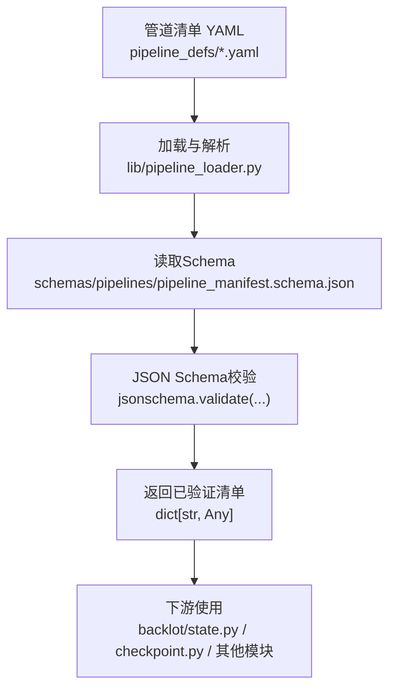
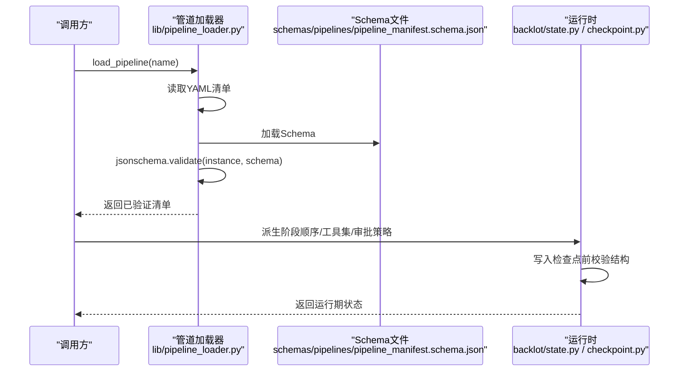
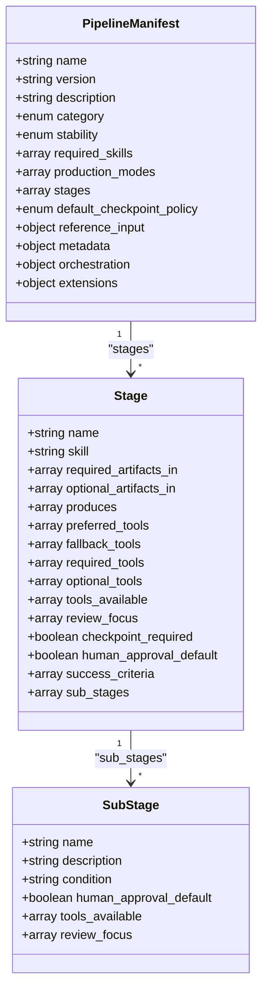
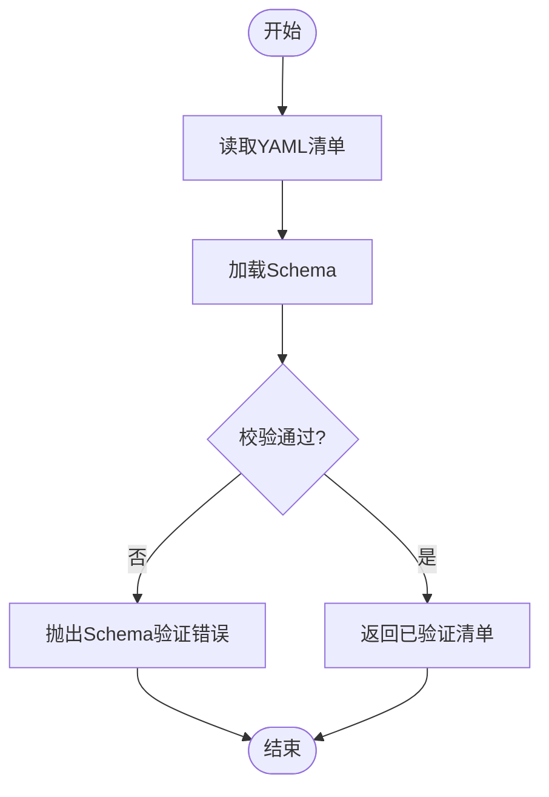
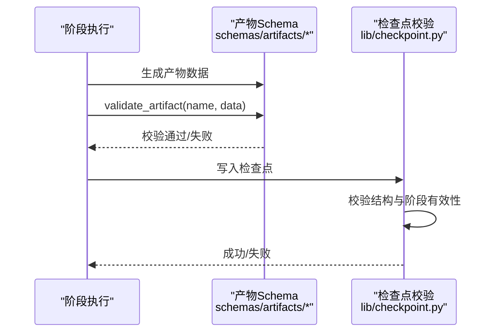
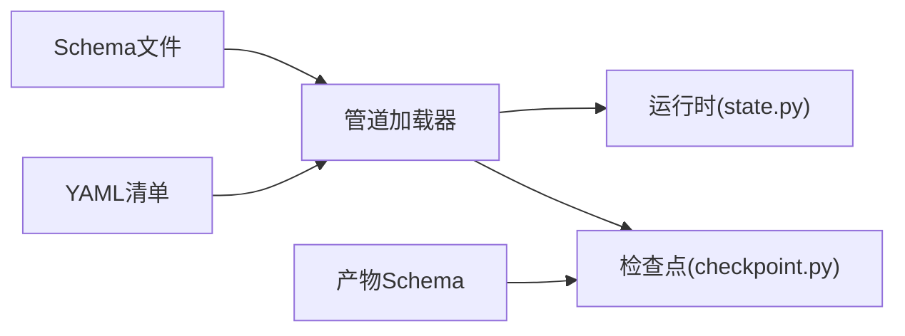
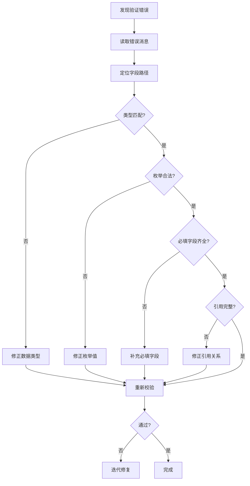

# Schema验证机制

<cite>
**本文引用的文件**
- [pipeline_manifest.schema.json](file://schemas/pipelines/pipeline_manifest.schema.json)
- [pipeline_loader.py](file://lib/pipeline_loader.py)
- [documentary-montage.yaml](file://pipeline_defs/documentary-montage.yaml)
- [brief.schema.json](file://schemas/artifacts/brief.schema.json)
- [artifacts/__init__.py](file://schemas/artifacts/__init__.py)
- [checkpoint.py](file://lib/checkpoint.py)
- [state.py](file://backlot/state.py)
- [test_pipeline_manifest_categories.py](file://tests/contracts/test_pipeline_manifest_categories.py)
</cite>

## 目录
1. [简介](#简介)
2. [项目结构](#项目结构)
3. [核心组件](#核心组件)
4. [架构总览](#架构总览)
5. [详细组件分析](#详细组件分析)
6. [依赖关系分析](#依赖关系分析)
7. [性能考量](#性能考量)
8. [故障排查指南](#故障排查指南)
9. [结论](#结论)
10. [附录](#附录)

## 简介
本文件系统性说明OpenMontage的管道Schema验证机制，重点解释JSON Schema在管道定义中的作用与重要性，解析pipeline_manifest.schema.json中的验证规则与数据模型，阐述管道加载器如何执行Schema验证（包括必填字段、数据类型、枚举值、嵌套对象约束等），并给出自定义Schema扩展的实践指南。同时提供验证错误的诊断方法与常见问题解决方案，帮助开发者快速定位和修复问题。

## 项目结构
OpenMontage将“管道清单”以YAML形式声明，并通过JSON Schema进行强类型校验。关键位置如下：
- schemas/pipelines/pipeline_manifest.schema.json：定义管道清单的Schema
- lib/pipeline_loader.py：加载并校验管道清单的核心逻辑
- pipeline_defs/*.yaml：各管道的具体清单实现
- schemas/artifacts/*.schema.json：产物（Artifact）的Schema集合
- lib/checkpoint.py：检查点结构与Schema校验
- backlot/state.py：从清单派生阶段顺序与门禁标志
- tests/contracts/*：契约测试，确保清单字段取值符合预期

图表来源
- [pipeline_loader.py:49-70](file://lib/pipeline_loader.py#L49-L70)
- [pipeline_manifest.schema.json:1-197](file://schemas/pipelines/pipeline_manifest.schema.json#L1-L197)

章节来源
- [pipeline_loader.py:1-77](file://lib/pipeline_loader.py#L1-L77)
- [pipeline_manifest.schema.json:1-197](file://schemas/pipelines/pipeline_manifest.schema.json#L1-L197)

## 核心组件
- JSON Schema定义：集中描述管道清单的数据模型、必填字段、枚举值、嵌套结构、额外属性限制等
- 管道加载器：负责读取YAML清单、加载Schema、执行校验并提供缓存与便捷查询接口
- 产物Schema：对中间产物（如brief、scene_plan等）进行独立校验，保证流水线数据一致性
- 检查点校验：在写入检查点时再次校验结构与内容，防止非法状态持久化
- 运行时派生：根据清单派生阶段顺序、工具集、是否需人工审批等运行期信息

章节来源
- [pipeline_manifest.schema.json:1-197](file://schemas/pipelines/pipeline_manifest.schema.json#L1-L197)
- [pipeline_loader.py:27-70](file://lib/pipeline_loader.py#L27-L70)
- [artifacts/__init__.py:37-54](file://schemas/artifacts/__init__.py#L37-L54)
- [checkpoint.py:160-191](file://lib/checkpoint.py#L160-L191)

## 架构总览
下图展示了从清单到运行时的完整流程：清单被加载后通过JSON Schema严格校验；随后由运行时根据清单派生阶段顺序、工具集、审批策略等信息，并在检查点写入时再次校验数据结构。

图表来源
- [pipeline_loader.py:49-70](file://lib/pipeline_loader.py#L49-L70)
- [state.py:63-94](file://backlot/state.py#L63-L94)
- [checkpoint.py:160-191](file://lib/checkpoint.py#L160-L191)

## 详细组件分析

### JSON Schema：管道清单数据模型
- 顶层必需字段：name、version、stages
- 顶层可选字段：description、category（枚举）、stability（枚举）、compatible_playbooks（数组或对象）、required_skills（字符串数组）、production_modes（对象数组）、default_checkpoint_policy（枚举）、reference_input（对象）、metadata（对象）、orchestration（对象）、extensions（对象）
- stages为对象数组，每个stage至少包含name，并可声明skill、required_artifacts_in、optional_artifacts_in、produces、preferred_tools、fallback_tools、required_tools、optional_tools、tools_available、review_focus、checkpoint_required、human_approval_default、success_criteria、sub_stages（子阶段数组）
- additionalProperties: false 禁止未知字段，增强健壮性

图表来源
- [pipeline_manifest.schema.json:7-153](file://schemas/pipelines/pipeline_manifest.schema.json#L7-L153)

章节来源
- [pipeline_manifest.schema.json:1-197](file://schemas/pipelines/pipeline_manifest.schema.json#L1-L197)

### 管道加载器：Schema验证执行流程
- 路径解析：根据名称查找pipeline_defs下的YAML清单
- 解析与校验：使用yaml.safe_load解析后，通过jsonschema.validate执行Schema校验
- 缓存优化：Schema与清单加载均使用lru_cache减少重复IO与解析开销
- 只读访问：提供load_pipeline_readonly供热路径使用，避免并发修改风险
- 辅助查询：提供获取阶段顺序、工具集、子阶段、人类审批默认值等能力

图表来源
- [pipeline_loader.py:49-70](file://lib/pipeline_loader.py#L49-L70)

章节来源
- [pipeline_loader.py:27-70](file://lib/pipeline_loader.py#L27-L70)

### 产物Schema：中间数据一致性保障
- artifacts目录下为各产物（如brief、scene_plan等）的Schema
- 通过schemas/artifacts/__init__.py统一加载与校验
- 在检查点写入前后，结合checkpoint.py的结构校验，确保产物与阶段一致

图表来源
- [artifacts/__init__.py:37-54](file://schemas/artifacts/__init__.py#L37-L54)
- [checkpoint.py:160-191](file://lib/checkpoint.py#L160-L191)

章节来源
- [artifacts/__init__.py:37-54](file://schemas/artifacts/__init__.py#L37-L54)
- [checkpoint.py:160-191](file://lib/checkpoint.py#L160-L191)

### 运行时派生：阶段顺序与门禁
- backlot/state.py从清单派生阶段顺序、是否需人工审批、产出物列表
- 若清单不可用则回退到内置阶段表，保证UI与状态机稳定
- 与checkpoint.py协同，确保检查点阶段名有效且与清单一致

章节来源
- [state.py:63-94](file://backlot/state.py#L63-L94)
- [checkpoint.py:160-191](file://lib/checkpoint.py#L160-L191)

### 示例清单：documentary-montage
- 展示category、stability、default_checkpoint_policy、reference_input、orchestration、extensions的使用
- stages中体现required_artifacts_in、produces、tools_available、review_focus、success_criteria等字段
- 作为Schema约束的实际落地样例

章节来源
- [documentary-montage.yaml:1-179](file://pipeline_defs/documentary-montage.yaml#L1-L179)

## 依赖关系分析
- 管道加载器依赖JSON Schema与YAML解析库
- 运行时依赖加载器提供的清单数据进行派生
- 检查点校验依赖清单阶段信息与Schema
- 产物Schema与检查点校验共同保障数据一致性

图表来源
- [pipeline_loader.py:49-70](file://lib/pipeline_loader.py#L49-L70)
- [state.py:63-94](file://backlot/state.py#L63-L94)
- [checkpoint.py:160-191](file://lib/checkpoint.py#L160-L191)
- [artifacts/__init__.py:37-54](file://schemas/artifacts/__init__.py#L37-L54)

章节来源
- [pipeline_loader.py:49-70](file://lib/pipeline_loader.py#L49-L70)
- [state.py:63-94](file://backlot/state.py#L63-L94)
- [checkpoint.py:160-191](file://lib/checkpoint.py#L160-L191)
- [artifacts/__init__.py:37-54](file://schemas/artifacts/__init__.py#L37-L54)

## 性能考量
- Schema与清单加载均使用lru_cache，避免重复IO与解析
- 热路径使用load_pipeline_readonly，确保只读访问与缓存命中
- 仅在清单变更时重新加载Schema，降低校验开销
- 建议在生产环境预热常用清单，提升启动与首次访问速度

[本节为通用性能建议，不直接分析具体文件]

## 故障排查指南
常见验证错误与定位方法：
- 缺失必填字段：检查name、version、stages是否存在
- 数据类型不符：确认字段类型与Schema一致（如字符串、数字、布尔、数组、对象）
- 枚举值非法：category、stability、default_checkpoint_policy等必须取自允许值
- 未知字段：additionalProperties: false会拒绝未声明字段
- 引用完整性：required_artifacts_in指向的产物必须在后续produces中出现
- 子阶段条件：sub_stages.condition需在运行时上下文中存在才激活

定位步骤：
- 查看加载器抛出的Schema验证错误消息，定位具体字段与路径
- 核对pipeline_manifest.schema.json对应字段的约束
- 检查YAML清单缩进与键名拼写
- 使用契约测试（如test_pipeline_manifest_categories.py）验证字段取值范围

章节来源
- [pipeline_loader.py:49-70](file://lib/pipeline_loader.py#L49-L70)
- [pipeline_manifest.schema.json:7-197](file://schemas/pipelines/pipeline_manifest.schema.json#L7-L197)
- [test_pipeline_manifest_categories.py:1-10](file://tests/contracts/test_pipeline_manifest_categories.py#L1-L10)

## 结论
OpenMontage通过JSON Schema对管道清单进行强类型校验，确保定义的一致性与可维护性。管道加载器在执行时完成解析与校验，并结合运行时派生与检查点校验形成闭环。借助清晰的Schema定义与完善的错误诊断，开发者可以快速扩展与定制管道行为，同时保持系统稳定性。

[本节为总结性内容，不直接分析具体文件]

## 附录

### 自定义Schema扩展指南
- 新增字段：在pipeline_manifest.schema.json中添加properties与相应约束（type、enum、minItems等）
- 新增枚举：在现有字段中添加enum值，确保所有清单更新
- 新增嵌套对象：定义新的对象结构，并在顶层或相关对象中引用
- 启用额外属性：如需允许未知字段，调整additionalProperties设置（谨慎使用）
- 运行时适配：在pipeline_loader.py或其他模块中增加对新字段的读取与处理逻辑
- 契约测试：添加测试用例覆盖新字段与约束，确保向后兼容

章节来源
- [pipeline_manifest.schema.json:1-197](file://schemas/pipelines/pipeline_manifest.schema.json#L1-L197)
- [pipeline_loader.py:27-70](file://lib/pipeline_loader.py#L27-L70)

### 验证错误诊断流程图

[此图为概念性流程图，不直接映射具体源码文件]