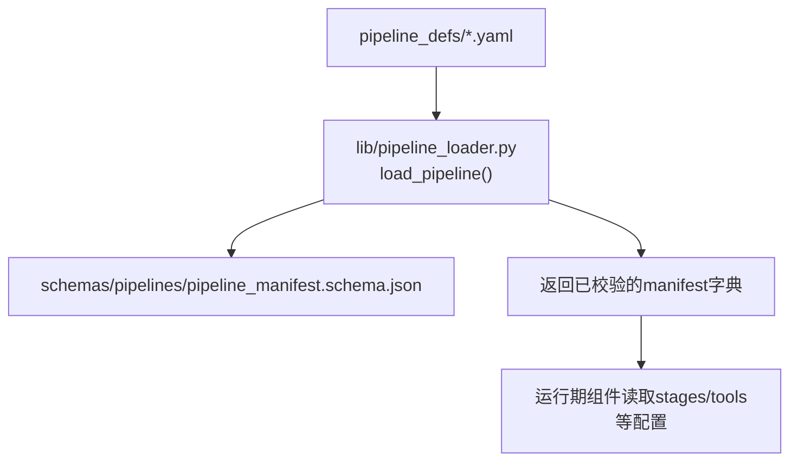
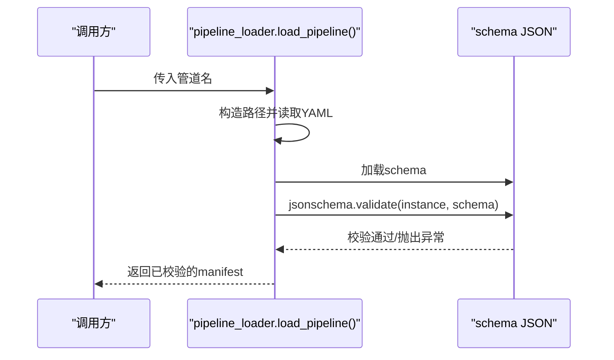
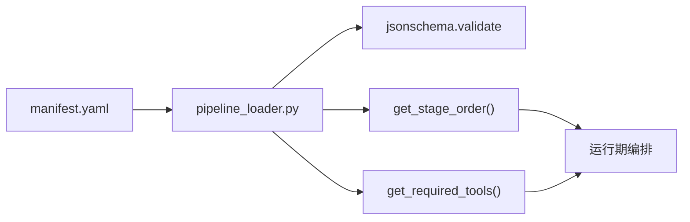

# YAML语法规范

<cite>
**本文引用的文件**
- [pipeline_manifest.schema.json](file://schemas/pipelines/pipeline_manifest.schema.json)
- [pipeline_loader.py](file://lib/pipeline_loader.py)
- [animation.yaml](file://pipeline_defs/animation.yaml)
- [talking-head.yaml](file://pipeline_defs/talking-head.yaml)
- [cinematic.yaml](file://pipeline_defs/cinematic.yaml)
</cite>

## 目录
1. [简介](#简介)
2. [项目结构](#项目结构)
3. [核心组件](#核心组件)
4. [架构总览](#架构总览)
5. [详细组件分析](#详细组件分析)
6. [依赖关系分析](#依赖关系分析)
7. [性能考虑](#性能考虑)
8. [故障排查指南](#故障排查指南)
9. [结论](#结论)
10. [附录：YAML字段参考与示例](#附录yaml字段参考与示例)

## 简介
本规范面向OpenMontage的管道（Pipeline）YAML清单，系统性说明其核心结构与约束，重点解释：
- 基础字段：name、version、description等
- stages数组：阶段定义、输入输出产物、工具声明、检查点与人工审批策略
- tools_available与required_tools的区别与使用场景
- 每个字段的类型约束、默认值与验证规则
- 嵌套对象、数组与条件语句的使用方式
- 常见错误与调试技巧

本规范基于JSON Schema与加载器实现，确保YAML清单在运行时可被严格校验与高效复用。

## 项目结构
OpenMontage将管道清单集中放置在pipeline_defs目录下，并通过lib/pipeline_loader.py统一加载与校验。Schema定义位于schemas/pipelines/pipeline_manifest.schema.json，用于强类型约束与自动校验。

图表来源
- [pipeline_loader.py:49-70](file://lib/pipeline_loader.py#L49-L70)
- [pipeline_manifest.schema.json:1-197](file://schemas/pipelines/pipeline_manifest.schema.json#L1-L197)

章节来源
- [pipeline_loader.py:1-70](file://lib/pipeline_loader.py#L1-L70)
- [pipeline_manifest.schema.json:1-197](file://schemas/pipelines/pipeline_manifest.schema.json#L1-L197)

## 核心组件
- 清单根对象：包含name、version、description、category、stability、compatible_playbooks、required_skills、production_modes、stages、default_checkpoint_policy、reference_input、metadata、orchestration、extensions等。
- stages数组：每个阶段必须声明name，并可声明skill或agent、输入产物、输出产物、工具集合、检查点策略、人工审批默认值、成功标准、子阶段等。
- 工具集合：preferred_tools、fallback_tools、required_tools、optional_tools、tools_available；以及reference_input.analysis_tools。
- 扩展能力：extensions控制是否允许自定义脚本、样式、技能、工具等。

章节来源
- [pipeline_manifest.schema.json:8-193](file://schemas/pipelines/pipeline_manifest.schema.json#L8-L193)
- [pipeline_loader.py:152-162](file://lib/pipeline_loader.py#L152-L162)

## 架构总览
加载流程与校验：
- 通过名称定位pipeline_defs下的YAML文件
- 解析为Python字典
- 使用JSON Schema进行强校验
- 缓存结果供运行期高频访问

图表来源
- [pipeline_loader.py:49-70](file://lib/pipeline_loader.py#L49-L70)
- [pipeline_manifest.schema.json:1-197](file://schemas/pipelines/pipeline_manifest.schema.json#L1-L197)

## 详细组件分析

### 根级字段与约束
- name、version、stages为必填项；其余字段可选。
- category枚举限定：talking_head、generated、hybrid、screen_recording、animation、cinematic、documentary、custom。
- stability枚举：production、beta。
- compatible_playbooks支持两种形式：字符串数组或对象{recommended, also_works, custom_allowed}。
- production_modes为数组，每项含name、description、required_tools、optional_tools、scene_type、agent_skills、best_for等。
- default_checkpoint_policy默认值为guided，枚举：guided、manual_all、auto_noncreative。
- reference_input为对象，含supported布尔、analysis_depth枚举、analysis_tools数组。
- orchestration为对象，含mode、skill、budget_default_usd、max_revisions_per_stage、max_send_backs、max_wall_time_minutes。
- extensions为对象，含custom_scripts、custom_playbooks、custom_skills、custom_tools布尔开关。

章节来源
- [pipeline_manifest.schema.json:8-193](file://schemas/pipelines/pipeline_manifest.schema.json#L8-L193)

### stages数组与阶段字段
- 每个stage必须包含name。
- agent为遗留字段（Python驱动阶段类名），skill为指令驱动阶段的技能路径。
- required_artifacts_in、optional_artifacts_in声明前置产物依赖。
- produces声明该阶段产出的产物名称。
- preferred_tools、fallback_tools为遗留偏好与回退工具列表。
- required_tools为该阶段必须可用的工具（或其回退）。
- optional_tools为增强但非必需的工具。
- tools_available为该阶段Agent可使用的工具集合（required + optional的并集）。
- review_focus为审查关注点列表。
- checkpoint_required默认true，human_approval_default默认false。
- success_criteria为成功标准列表。
- sub_stages为可选的子阶段数组，每个子阶段含name、description、condition、human_approval_default、tools_available、review_focus。

章节来源
- [pipeline_manifest.schema.json:76-153](file://schemas/pipelines/pipeline_manifest.schema.json#L76-L153)

### 工具集合语义与收集
- get_required_tools会聚合以下来源：
  - 每阶段的preferred_tools、fallback_tools、tools_available
  - 每阶段的sub_stages中的tools_available
  - reference_input.analysis_tools
- 注意：required_tools与optional_tools在schema中声明，但在当前get_required_tools聚合逻辑中未直接纳入；它们更多用于阶段执行时的可用性判定与提示。

章节来源
- [pipeline_loader.py:152-162](file://lib/pipeline_loader.py#L152-L162)
- [pipeline_manifest.schema.json:99-122](file://schemas/pipelines/pipeline_manifest.schema.json#L99-L122)

### 子阶段与条件激活
- 子阶段可通过condition字段声明激活条件。
- _condition_is_active根据context键是否存在来判断是否激活。
- get_stage_sub_stages可按include_inactive过滤出活跃子阶段。
- get_stage_order可在需要时将子阶段以“stage.sub_stage”形式暴露给上层。

章节来源
- [pipeline_loader.py:79-86](file://lib/pipeline_loader.py#L79-L86)
- [pipeline_loader.py:98-122](file://lib/pipeline_loader.py#L98-L122)
- [pipeline_loader.py:125-149](file://lib/pipeline_loader.py#L125-L149)

### 能力扩展权限
- check_extension_permitted强制检查extensions中对应能力是否开启。
- get_permitted_extensions返回各扩展能力的启用状态（默认均为False）。

章节来源
- [pipeline_loader.py:197-241](file://lib/pipeline_loader.py#L197-L241)

### 实际管道示例要点
- animation.yaml展示了完整的预生产到发布流程，包含research、proposal、script、scene_plan、assets、edit、compose、publish等阶段，并在多处声明tools_available、required_tools、optional_tools及子阶段sample的条件激活。
- talking-head.yaml演示了从idea到publish的端到端流程，强调transcriber、subtitle_gen、video_compose、audio_mixer等关键工具。
- cinematic.yaml展示了情绪驱动的剪辑流程，包含web_search、frame_sampler、scene_detect、color_grade等工具链。

章节来源
- [animation.yaml:1-300](file://pipeline_defs/animation.yaml#L1-L300)
- [talking-head.yaml:1-229](file://pipeline_defs/talking-head.yaml#L1-L229)
- [cinematic.yaml:1-288](file://pipeline_defs/cinematic.yaml#L1-L288)

## 依赖关系分析
- pipeline_loader依赖JSON Schema对manifest进行强校验。
- 运行期通过load_pipeline_readonly获取只读manifest，避免重复解析与校验。
- stages顺序与子阶段顺序由get_stage_order提供，便于编排与展示。
- 工具集合通过get_required_tools汇总，供环境预检与资源准备。

图表来源
- [pipeline_loader.py:49-70](file://lib/pipeline_loader.py#L49-L70)
- [pipeline_loader.py:125-162](file://lib/pipeline_loader.py#L125-L162)

章节来源
- [pipeline_loader.py:49-162](file://lib/pipeline_loader.py#L49-L162)

## 性能考虑
- 使用lru_cache缓存schema与manifest加载结果，减少I/O与校验开销。
- load_pipeline_readonly保证返回不可变对象，适合热路径（如每次checkpoint写入时进行门控检查）。
- 建议仅在必要时重新加载manifest，避免频繁磁盘操作。

章节来源
- [pipeline_loader.py:27-46](file://lib/pipeline_loader.py#L27-L46)

## 故障排查指南
- 常见错误
  - 缺少必填字段（name、version、stages）导致校验失败。
  - stages内stage缺少name导致校验失败。
  - category或stability使用非法枚举值。
  - compatible_playbooks格式不符合oneOf要求。
  - 子阶段condition上下文不匹配导致不激活。
- 调试技巧
  - 使用list_pipelines确认可用清单名称。
  - 使用load_pipeline(name)捕获具体校验异常信息。
  - 使用get_stage_order(include_sub_stages=True)查看完整阶段序列。
  - 使用get_stage_sub_stages(stage_name, context=..., include_inactive=False)筛选活跃子阶段。
  - 使用get_required_tools(manifest)核对工具集合是否符合预期。
  - 使用check_extension_permitted(manifest, extension_type)快速定位扩展权限问题。

章节来源
- [pipeline_loader.py:73-86](file://lib/pipeline_loader.py#L73-L86)
- [pipeline_loader.py:98-162](file://lib/pipeline_loader.py#L98-L162)
- [pipeline_loader.py:201-241](file://lib/pipeline_loader.py#L201-L241)

## 结论
OpenMontage的管道YAML通过JSON Schema实现了严格的类型与结构约束，配合pipeline_loader提供高效的加载、校验与查询能力。stages数组是编排的核心，tools_available与required_tools分别表达“可用工具集合”和“必须工具”，二者协同确保Agent在受控范围内选择工具。子阶段与条件机制增强了灵活性，而extensions则提供了安全可控的扩展边界。遵循本规范可显著提升清单的可维护性与运行稳定性。

## 附录：YAML字段参考与示例

### 根级字段
- name: 字符串，必填
- version: 字符串，必填
- description: 字符串，可选
- category: 枚举，可选
- stability: 枚举，可选
- compatible_playbooks: 数组或对象，可选
- required_skills: 字符串数组，可选
- production_modes: 对象数组，可选
- stages: 对象数组，必填
- default_checkpoint_policy: 枚举，默认guided
- reference_input: 对象，可选
- metadata: 对象，可选
- orchestration: 对象，可选
- extensions: 对象，可选

章节来源
- [pipeline_manifest.schema.json:8-193](file://schemas/pipelines/pipeline_manifest.schema.json#L8-L193)

### stages阶段字段
- name: 字符串，必填
- agent: 字符串，可选（遗留）
- skill: 字符串，可选
- required_artifacts_in: 字符串数组，可选
- optional_artifacts_in: 字符串数组，可选
- produces: 字符串数组，可选
- preferred_tools: 字符串数组，可选（遗留）
- fallback_tools: 字符串数组，可选（遗留）
- required_tools: 字符串数组，可选
- optional_tools: 字符串数组，可选
- tools_available: 字符串数组，可选
- review_focus: 字符串数组，可选
- checkpoint_required: 布尔，默认true
- human_approval_default: 布尔，默认false
- success_criteria: 字符串数组，可选
- sub_stages: 对象数组，可选

章节来源
- [pipeline_manifest.schema.json:76-153](file://schemas/pipelines/pipeline_manifest.schema.json#L76-L153)

### 子阶段字段
- name: 字符串，必填
- description: 字符串，可选
- condition: 字符串，可选（在上下文中存在即激活）
- human_approval_default: 布尔，默认true
- tools_available: 字符串数组，可选
- review_focus: 字符串数组，可选

章节来源
- [pipeline_manifest.schema.json:134-149](file://schemas/pipelines/pipeline_manifest.schema.json#L134-L149)

### 工具集合语义
- tools_available：该阶段Agent可使用的工具集合（推荐显式声明）
- required_tools：该阶段必须可用的工具（或其回退）
- optional_tools：增强但非必需的工具
- preferred_tools/fallback_tools：遗留字段，用于历史兼容
- reference_input.analysis_tools：参考视频分析所需的工具

章节来源
- [pipeline_manifest.schema.json:99-122](file://schemas/pipelines/pipeline_manifest.schema.json#L99-L122)
- [pipeline_loader.py:152-162](file://lib/pipeline_loader.py#L152-L162)

### 条件语句与上下文
- condition字段为字符串键名，当context中存在该键时子阶段激活
- 使用_get_condition_is_active判断激活状态
- 使用get_stage_sub_stages结合context过滤活跃子阶段

章节来源
- [pipeline_loader.py:79-86](file://lib/pipeline_loader.py#L79-L86)
- [pipeline_loader.py:98-122](file://lib/pipeline_loader.py#L98-L122)

### 实际配置模式示例（路径引用）
- 动画管线：包含research、proposal、script、scene_plan、assets、edit、compose、publish阶段，多处声明tools_available与required_tools，并在proposal阶段引入子阶段sample的条件激活
  - 参考：[animation.yaml:62-300](file://pipeline_defs/animation.yaml#L62-L300)
- 口播管线：强调transcriber、subtitle_gen、video_compose、audio_mixer等工具链
  - 参考：[talking-head.yaml:42-229](file://pipeline_defs/talking-head.yaml#L42-L229)
- 电影感管线：包含web_search、frame_sampler、scene_detect、color_grade等工具链，强调情绪与节奏
  - 参考：[cinematic.yaml:60-288](file://pipeline_defs/cinematic.yaml#L60-L288)

章节来源
- [animation.yaml:62-300](file://pipeline_defs/animation.yaml#L62-L300)
- [talking-head.yaml:42-229](file://pipeline_defs/talking-head.yaml#L42-L229)
- [cinematic.yaml:60-288](file://pipeline_defs/cinematic.yaml#L60-L288)