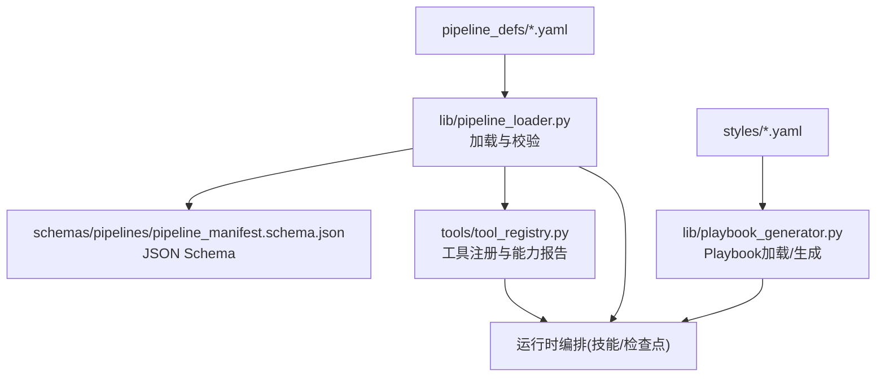
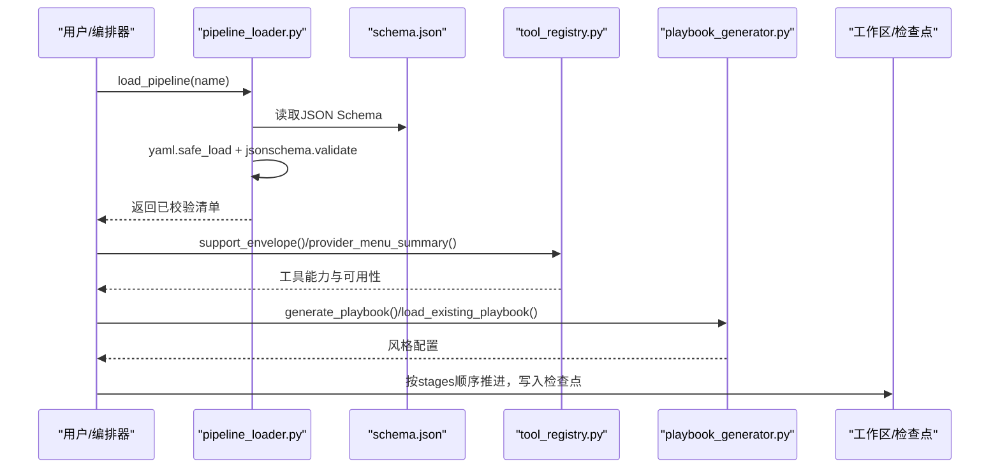
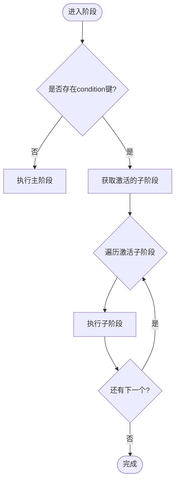
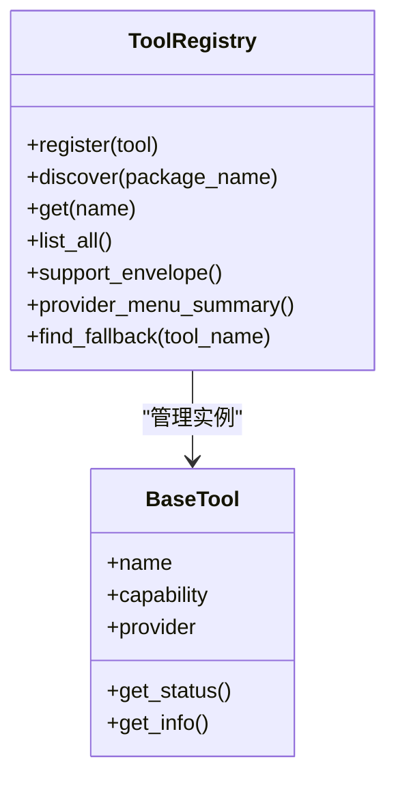
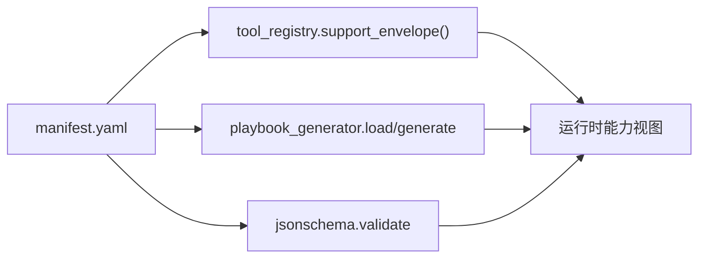

# 管道定义

<cite>
**本文引用的文件**
- [pipeline_manifest.schema.json](file://schemas/pipelines/pipeline_manifest.schema.json)
- [pipeline_loader.py](file://lib/pipeline_loader.py)
- [playbook_generator.py](file://lib/playbook_generator.py)
- [tool_registry.py](file://tools/tool_registry.py)
- [animated-explainer.yaml](file://pipeline_defs/animated-explainer.yaml)
- [cinematic.yaml](file://pipeline_defs/cinematic.yaml)
- [talking-head.yaml](file://pipeline_defs/talking-head.yaml)
- [animation.yaml](file://pipeline_defs/animation.yaml)
- [avatar-spokesperson.yaml](file://pipeline_defs/avatar-spokesperson.yaml)
</cite>

## 目录
1. [简介](#简介)
2. [项目结构](#项目结构)
3. [核心组件](#核心组件)
4. [架构总览](#架构总览)
5. [详细组件分析](#详细组件分析)
6. [依赖关系分析](#依赖关系分析)
7. [性能与可扩展性](#性能与可扩展性)
8. [故障排查指南](#故障排查指南)
9. [结论](#结论)
10. [附录：自定义管道开发指南](#附录自定义管道开发指南)

## 简介
本文件面向OpenMontage的“管道定义系统”，系统性说明YAML管道清单的结构与语法、预定义管道的架构设计（动画解释器、电影风格、对话头像等）、Schema验证机制，以及自定义管道开发的完整指南。文档同时提供实际使用示例与常见配置模式，帮助读者快速理解并安全扩展系统能力。

## 项目结构
OpenMontage将“管道定义”以声明式YAML清单形式保存在 pipeline_defs 目录下，并通过 lib/pipeline_loader.py 加载与校验；样式与主题通过 styles 下的Playbook管理，由 lib/playbook_generator.py 生成或加载；工具注册与能力发现集中在 tools/tool_registry.py；各类型管道的具体流程在各自 YAML 中声明 stages、sub_stages、tools 等字段。

图表来源
- [pipeline_loader.py:49-70](file://lib/pipeline_loader.py#L49-L70)
- [pipeline_manifest.schema.json:1-197](file://schemas/pipelines/pipeline_manifest.schema.json#L1-L197)
- [tool_registry.py:55-134](file://tools/tool_registry.py#L55-L134)
- [playbook_generator.py:32-49](file://lib/playbook_generator.py#L32-L49)

章节来源
- [pipeline_loader.py:1-77](file://lib/pipeline_loader.py#L1-L77)
- [pipeline_manifest.schema.json:1-197](file://schemas/pipelines/pipeline_manifest.schema.json#L1-L197)

## 核心组件
- 管道清单（Pipeline Manifest）：描述管道名称、版本、阶段、产物、工具、策略、编排参数等。
- 阶段（Stages）：每个阶段声明输入产物、输出产物、可用工具、是否需检查点、人类审批默认值、评审关注点与成功标准。
- 子阶段（Sub-stages）：可选的细粒度步骤（如预览样本），支持条件激活。
- 工具（Tools）：声明 required_tools / optional_tools / tools_available，并在运行期由工具注册表解析可用性。
- 编排（Orchestration）：指定执行模式、技能路径、预算与时间上限等。
- Playbook（风格模板）：控制视觉语言、排版、动效、音频风格等，可复用或动态生成。
- 校验（Schema Validation）：基于JSON Schema对清单进行强约束校验，确保一致性。

章节来源
- [pipeline_manifest.schema.json:6-197](file://schemas/pipelines/pipeline_manifest.schema.json#L6-L197)
- [pipeline_loader.py:49-70](file://lib/pipeline_loader.py#L49-L70)
- [tool_registry.py:118-134](file://tools/tool_registry.py#L118-L134)
- [playbook_generator.py:52-119](file://lib/playbook_generator.py#L52-L119)

## 架构总览
下图展示了从清单加载到运行时编排的关键交互：清单被加载并校验，工具注册表提供能力视图，Playbook提供风格配置，最终驱动各阶段技能执行与检查点治理。

图表来源
- [pipeline_loader.py:49-70](file://lib/pipeline_loader.py#L49-L70)
- [tool_registry.py:198-220](file://tools/tool_registry.py#L198-L220)
- [playbook_generator.py:52-119](file://lib/playbook_generator.py#L52-L119)

## 详细组件分析

### YAML清单结构与语法
- 顶层字段
  - name/version/description/category/stability：标识与元信息。
  - default_checkpoint_policy：默认检查点策略（guided/manual_all/auto_noncreative）。
  - reference_input：是否支持参考视频输入及分析深度与工具。
  - extensions：能力扩展开关（custom_scripts/custom_playbooks/custom_skills/custom_tools）。
  - required_skills：该管道所需的技能集合。
  - orchestration：编排模式、技能路径、预算、修订次数、超时等。
  - compatible_playbooks：兼容的Playbook列表或结构化推荐。
- stages数组
  - name/skill：阶段名与指令型阶段的技能路径。
  - required_artifacts_in/optional_artifacts_in：前置产物要求。
  - produces：本阶段产出的产物名。
  - required_tools/optional_tools/tools_available：工具声明与可用集。
  - checkpoint_required/human_approval_default：检查点与人类审批默认。
  - review_focus/success_criteria：评审关注点与成功标准。
  - sub_stages：子阶段数组，含name/description/condition/tools_available/review_focus等。
- 其他
  - production_modes（Schema中定义）：用于多生产模式的互斥选择。
  - metadata：扩展元数据。

章节来源
- [pipeline_manifest.schema.json:6-197](file://schemas/pipelines/pipeline_manifest.schema.json#L6-L197)

### 预定义管道：动画解释器（animated-explainer）
- 目标：从主题/想法自动生成带旁白、画面与音乐的讲解视频，强调研究优先与成本估算。
- 关键阶段：research → proposal（含sample子阶段）→ script → scene_plan → assets → edit → compose → publish。
- 工具与产物：
  - 资产阶段声明 tts_selector/image_selector/video_selector/math_animate/diagram_gen/code_snippet/music_gen 等。
  - 合成阶段要求 video_compose/audio_mixer，可选 video_stitch。
- 编排：executive-producer模式，预算与时长限制，严格的人类审批门控。

章节来源
- [animated-explainer.yaml:1-270](file://pipeline_defs/animated-explainer.yaml#L1-L270)

### 预定义管道：电影风格（cinematic）
- 目标：情绪驱动的预告片、品牌短片、蒙太奇、3D世界漫游等，强调情感节奏、色彩一致性与音频动态。
- 关键阶段：research → proposal（含sample）→ script → scene_plan → assets → edit → compose → publish。
- 工具与产物：
  - 资产阶段支持字幕、音频增强、图像/视频选择、Three.js/Blender/Atlas/FAL 3D、音乐生成等。
  - 合成阶段要求 video_compose/audio_mixer，可选 trim/color_grade/enhance。
- 编排：EP模式，预算与时长限制，强调渲染引擎选择与质量门控。

章节来源
- [cinematic.yaml:1-288](file://pipeline_defs/cinematic.yaml#L1-L288)

### 预定义管道：对话头像（talking-head）
- 目标：端到端处理人物讲话视频，转录、剪辑决策、字幕、混音与合成。
- 关键阶段：idea → script → scene_plan → assets → edit → compose → publish。
- 工具与产物：
  - 脚本阶段需要 transcriber。
  - 资产阶段需要 subtitle_gen，可选 audio_mixer/image_selector。
  - 合成阶段要求 video_compose/audio_mixer，可选 face_enhance/eye_enhance/color_grade/audio_enhance/auto_reframe/remotion_caption_burn/showcase_card/video_stitch/visual_qa。
- 编排：EP模式，预算较低，强调口播清晰度与字幕同步。

章节来源
- [talking-head.yaml:1-229](file://pipeline_defs/talking-head.yaml#L1-L229)

### 预定义管道：动画（animation）
- 目标：动效优先的图形、图解、动态排版、数学可视化、Three.js世界与插画序列。
- 关键阶段：research → proposal（含sample）→ script → scene_plan → assets → edit → compose → publish。
- 工具与产物：
  - 资产阶段广泛支持TTS、图像/视频选择、数学动画、图表、代码片段、3D世界/资产目录、音乐生成。
  - 合成阶段要求 video_compose/audio_mixer，可选 hyperframes_compose/video_stitch。
- 编排：EP模式，强调渲染引擎选择与HyperFrames校验。

章节来源
- [animation.yaml:1-300](file://pipeline_defs/animation.yaml#L1-L300)

### 预定义管道：虚拟发言人（avatar-spokesperson）
- 目标：以数字发言人为主角的短视频，适合内部更新、入职介绍、销售开场等。
- 关键阶段：idea → script → scene_plan → assets → edit → compose → publish。
- 工具与产物：
  - 资产阶段支持 talking_head/lip_sync/tts_selector/subtitle_gen/image_selector/audio_enhance/video_selector。
  - 合成阶段要求 video_compose/audio_mixer，可选 video_stitch/audio_enhance。
- 编排：EP模式，强调唇形同步与构图整洁。

章节来源
- [avatar-spokesperson.yaml:1-207](file://pipeline_defs/avatar-spokesperson.yaml#L1-L207)

### 子阶段（sub_stages）与条件激活
- 子阶段用于在特定条件下执行更细粒度的任务（例如“sample”预览）。
- condition字段为键名匹配，当上下文存在该键时激活。
- 获取子阶段列表与过滤逻辑由 loader 提供。

图表来源
- [pipeline_loader.py:79-122](file://lib/pipeline_loader.py#L79-L122)

章节来源
- [pipeline_loader.py:79-122](file://lib/pipeline_loader.py#L79-L122)

### 工具声明与可用性
- 清单中通过 required_tools/optional_tools/tools_available 声明工具需求与可用集。
- 运行期通过 ToolRegistry 发现并报告工具状态，聚合 provider 菜单与能力摘要。
- 支持 fallback_tools 回退机制。

图表来源
- [tool_registry.py:55-134](file://tools/tool_registry.py#L55-L134)
- [tool_registry.py:184-196](file://tools/tool_registry.py#L184-L196)

章节来源
- [tool_registry.py:55-134](file://tools/tool_registry.py#L55-L134)
- [tool_registry.py:198-220](file://tools/tool_registry.py#L198-L220)

### Playbook（风格模板）加载与生成
- 支持加载内置或自定义Playbook，也可根据生产上下文动态生成新的Playbook。
- 生成器会合并mood/tone/colors/fonts/pace等上下文，产出符合Schema的Playbook。

章节来源
- [playbook_generator.py:32-49](file://lib/playbook_generator.py#L32-L49)
- [playbook_generator.py:52-119](file://lib/playbook_generator.py#L52-L119)
- [playbook_generator.py:122-197](file://lib/playbook_generator.py#L122-L197)
- [playbook_generator.py:200-226](file://lib/playbook_generator.py#L200-L226)

## 依赖关系分析
- 清单加载依赖JSON Schema进行强校验，确保字段完整性与枚举值正确。
- 工具可用性依赖工具注册表的动态发现与状态查询。
- Playbook与清单解耦，但通过 compatible_playbooks 与 required_skills 形成软耦合。
- 子阶段与上下文条件依赖 loader 的条件评估函数。

图表来源
- [pipeline_loader.py:49-70](file://lib/pipeline_loader.py#L49-L70)
- [tool_registry.py:198-220](file://tools/tool_registry.py#L198-L220)
- [playbook_generator.py:52-119](file://lib/playbook_generator.py#L52-L119)

章节来源
- [pipeline_loader.py:49-70](file://lib/pipeline_loader.py#L49-L70)
- [tool_registry.py:198-220](file://tools/tool_registry.py#L198-L220)
- [playbook_generator.py:52-119](file://lib/playbook_generator.py#L52-L119)

## 性能与可扩展性
- 清单加载缓存：使用LRU缓存减少重复解析与校验开销。
- 工具发现一次性加载：避免重复导入模块。
- 子阶段按需激活：减少不必要的计算。
- 可扩展点：
  - 新增管道：在 pipeline_defs 添加YAML清单，遵循Schema。
  - 新增工具：实现BaseTool并注册至工具包，自动被发现。
  - 新增Playbook：在 styles 下添加或动态生成。

[本节为通用指导，不直接分析具体文件]

## 故障排查指南
- 清单未找到：确认名称与路径，确保 .yaml 存在。
- Schema校验失败：对照 pipeline_manifest.schema.json 检查必填字段、枚举值与嵌套结构。
- 工具不可用：通过 tool_registry.provider_menu_summary() 查看能力与安装提示，补齐环境变量或依赖。
- 子阶段未激活：检查 context 中是否存在 condition 对应的键。
- 检查点违规：确保前置产物存在且状态合法，遵循 success_criteria 与 review_focus。

章节来源
- [pipeline_loader.py:49-70](file://lib/pipeline_loader.py#L49-L70)
- [pipeline_loader.py:79-122](file://lib/pipeline_loader.py#L79-L122)
- [tool_registry.py:316-471](file://tools/tool_registry.py#L316-L471)

## 结论
OpenMontage的管道定义系统通过声明式YAML清单、严格的Schema校验、工具注册与Playbook体系，实现了高内聚、低耦合的可编排视频生产流水线。不同类别的预定义管道覆盖了讲解、电影风格、对话头像、动画与虚拟发言人等场景，提供了统一的阶段模型、工具抽象与治理机制。借助扩展点与最佳实践，用户可以安全地定制与扩展管道能力。

[本节为总结，不直接分析具体文件]

## 附录：自定义管道开发指南

### 创建新管道清单
- 在 pipeline_defs 下新建 <your-pipeline>.yaml。
- 必填字段：name、version、stages。
- 建议字段：description、category、stability、default_checkpoint_policy、reference_input、extensions、required_skills、orchestration、compatible_playbooks。
- 阶段设计：
  - 明确 required_artifacts_in 与 produces，保证数据流清晰。
  - 声明 required_tools/optional_tools/tools_available，便于预检与资源规划。
  - 设置 checkpoint_required 与 human_approval_default，配合 review_focus 与 success_criteria 建立质量门。
  - 如需预览或分步验证，添加 sub_stages 与 condition。

章节来源
- [pipeline_manifest.schema.json:6-197](file://schemas/pipelines/pipeline_manifest.schema.json#L6-L197)
- [pipeline_loader.py:49-70](file://lib/pipeline_loader.py#L49-L70)

### 工具与能力集成
- 若使用新工具，确保其已实现BaseTool并被工具包发现。
- 在清单中声明工具需求，运行期通过工具注册表校验可用性。
- 利用 provider_menu_summary() 获取能力概览与安装提示。

章节来源
- [tool_registry.py:118-134](file://tools/tool_registry.py#L118-L134)
- [tool_registry.py:316-471](file://tools/tool_registry.py#L316-L471)

### Playbook与风格
- 复用现有Playbook或在 compatible_playbooks 中声明兼容项。
- 需要定制风格时，使用 generate_playbook() 基于上下文生成，并通过 save_playbook() 持久化到 styles/custom。

章节来源
- [playbook_generator.py:52-119](file://lib/playbook_generator.py#L52-L119)
- [playbook_generator.py:200-226](file://lib/playbook_generator.py#L200-L226)

### 调试技巧
- 使用 get_stage_order(include_sub_stages=True) 查看包含子阶段的完整顺序。
- 使用 get_stage_sub_stages(context=...) 过滤激活的子阶段。
- 使用 get_required_tools(manifest) 汇总全管道所需工具，提前准备环境。
- 使用 check_extension_permitted() 确保扩展能力被允许。

章节来源
- [pipeline_loader.py:125-162](file://lib/pipeline_loader.py#L125-L162)
- [pipeline_loader.py:165-190](file://lib/pipeline_loader.py#L165-L190)
- [pipeline_loader.py:201-241](file://lib/pipeline_loader.py#L201-L241)

### 实际使用示例与常见配置模式
- 讲解类（animated-explainer）：强调研究优先、方案对比与成本估算，资产阶段集中生成TTS/图像/视频/音乐，合成阶段统一混音与拼接。
- 电影类（cinematic）：强调情绪节拍、色彩与音频动态，资产阶段广泛支持3D与音乐，合成阶段注重调色与裁剪。
- 对话头像（talking-head）：强调转录准确性与字幕同步，合成阶段可选面部增强与自动重框。
- 动画（animation）：强调动效与复用策略，合成阶段可选择Remotion或HyperFrames，并进行严格校验。
- 虚拟发言人（avatar-spokesperson）：强调发言人主体地位与唇形同步，资产阶段聚焦说话人相关工具链。

章节来源
- [animated-explainer.yaml:61-270](file://pipeline_defs/animated-explainer.yaml#L61-L270)
- [cinematic.yaml:60-288](file://pipeline_defs/cinematic.yaml#L60-L288)
- [talking-head.yaml:42-229](file://pipeline_defs/talking-head.yaml#L42-L229)
- [animation.yaml:62-300](file://pipeline_defs/animation.yaml#L62-L300)
- [avatar-spokesperson.yaml:45-207](file://pipeline_defs/avatar-spokesperson.yaml#L45-L207)