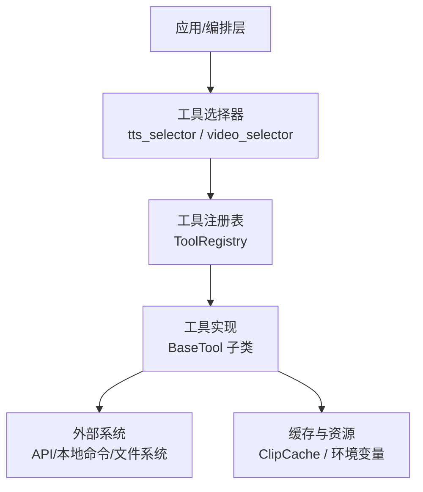
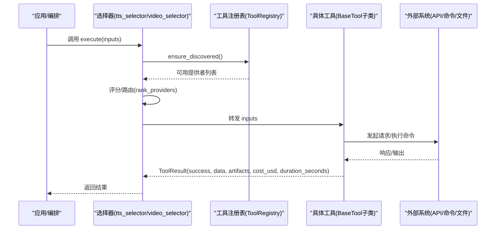
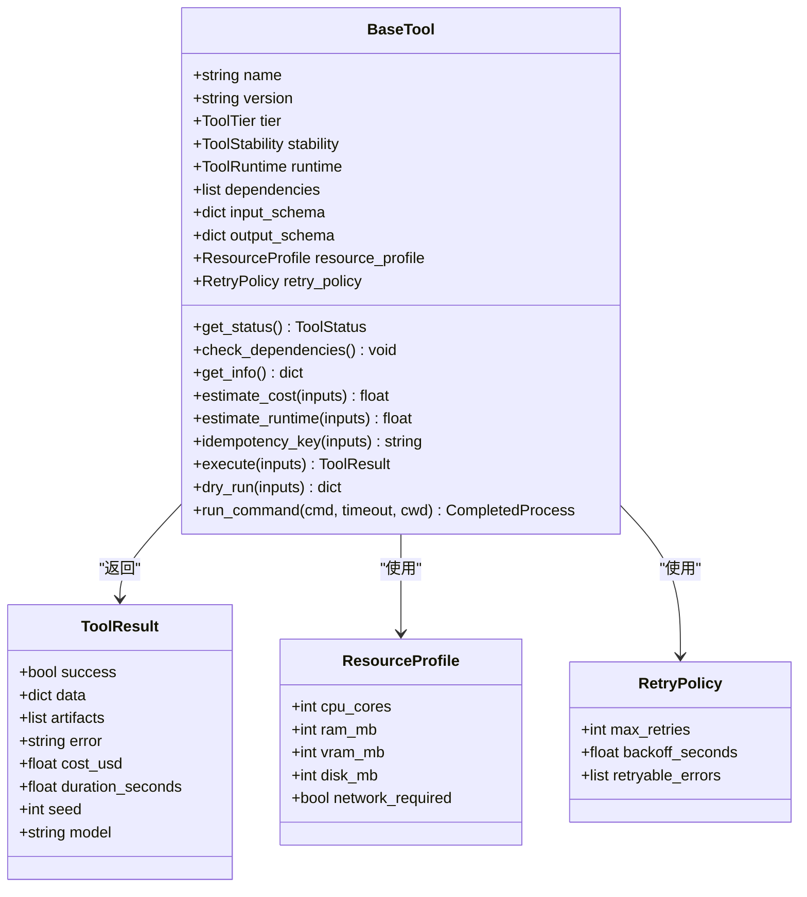
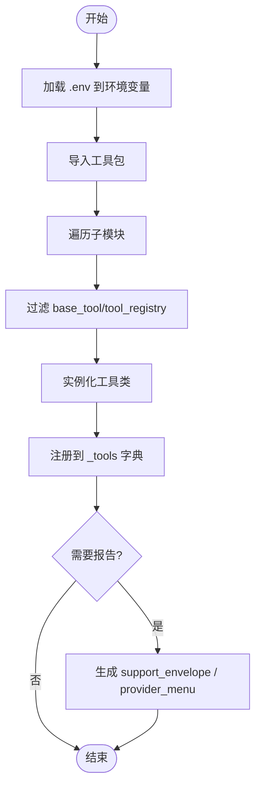
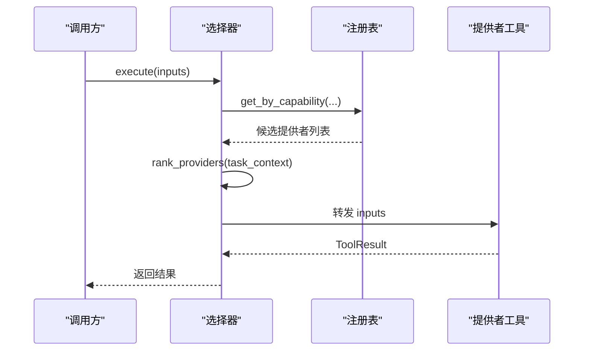
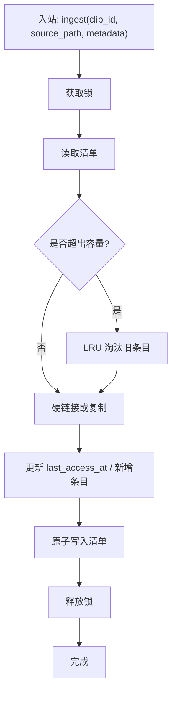
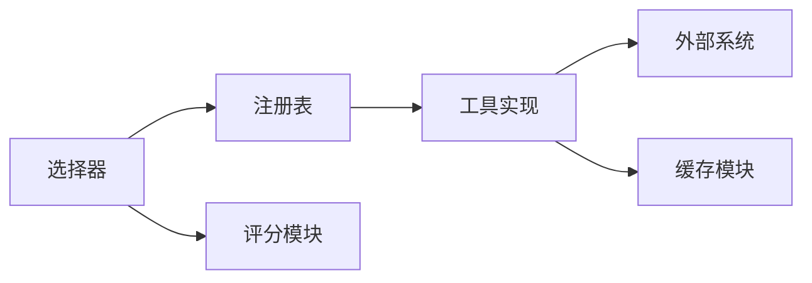

# 工具集成模式

<cite>
**本文引用的文件**
- [tools/base_tool.py](file://tools/base_tool.py)
- [tools/tool_registry.py](file://tools/tool_registry.py)
- [tools/audio/tts_selector.py](file://tools/audio/tts_selector.py)
- [tools/video/video_selector.py](file://tools/video/video_selector.py)
- [tools/video/clip_cache.py](file://tools/video/clip_cache.py)
- [lib/scoring.py](file://lib/scoring.py)
- [tests/contracts/test_phase0_contracts.py](file://tests/contracts/test_phase0_contracts.py)
- [tests/tools/test_base_tool_dependencies.py](file://tests/tools/test_base_tool_dependencies.py)
- [tests/contracts/conftest.py](file://tests/contracts/conftest.py)
</cite>

## 目录
1. [简介](#简介)
2. [项目结构](#项目结构)
3. [核心组件](#核心组件)
4. [架构总览](#架构总览)
5. [详细组件分析](#详细组件分析)
6. [依赖关系分析](#依赖关系分析)
7. [性能考虑](#性能考虑)
8. [故障排查指南](#故障排查指南)
9. [结论](#结论)
10. [附录](#附录)

## 简介
本文件系统性阐述 OpenMontage 的“工具集成模式”，聚焦以下目标：
- 工具注册表机制的工作原理：工具的发现、注册与调用流程。
- 第三方工具与 API 的集成方式：认证配置、请求封装、响应解析与错误处理。
- 工具依赖管理：依赖声明、版本控制与冲突解决策略。
- 性能优化技巧：缓存策略、并发处理与资源管理。
- 多种集成模式示例：REST API 集成、本地工具调用、流式数据处理等。
- 测试方法与调试技巧：如何验证工具可用性、回归与端到端校验。

## 项目结构
OpenMontage 将“工具”抽象为统一接口，并通过“注册表”自动发现与编排。关键目录与职责：
- tools/base_tool.py：定义工具基类、执行契约、依赖检查、成本估算、命令执行封装等。
- tools/tool_registry.py：工具注册表，负责模块扫描、能力分组、状态报告、回退选择等。
- tools/*_selector.py：能力级选择器（如 tts_selector、video_selector），按任务上下文路由到具体提供者。
- tools/video/clip_cache.py：共享片段缓存，提供进程安全、LRU 淘汰与硬链接加速。
- lib/scoring.py：提供者评分与排序，结合可用性、历史成功率、预算等指标进行决策。
- tests/*：覆盖注册、依赖、选择器路由、合同校验等测试用例。

**图表来源**
- [tools/tool_registry.py:118-134](file://tools/tool_registry.py#L118-L134)
- [tools/base_tool.py:227-397](file://tools/base_tool.py#L227-L397)
- [tools/video/clip_cache.py:177-210](file://tools/video/clip_cache.py#L177-L210)

**章节来源**
- [tools/base_tool.py:227-397](file://tools/base_tool.py#L227-L397)
- [tools/tool_registry.py:118-134](file://tools/tool_registry.py#L118-L134)

## 核心组件
- BaseTool：所有工具的抽象基类，统一身份、能力、依赖、执行、成本估算、幂等键、命令执行等契约。
- ToolRegistry：集中注册与发现工具，支持按能力、提供商、层级、稳定性筛选；生成支持信封与供应商菜单；提供回退工具查找。
- Selector（选择器）：在能力层面聚合多个提供者，基于任务上下文与评分进行路由，支持用户偏好与允许列表。
- ClipCache：跨进程安全的片段字节缓存，使用 JSONL 清单、原子写入、文件锁、LRU 淘汰与硬链接加速。

**章节来源**
- [tools/base_tool.py:110-139](file://tools/base_tool.py#L110-L139)
- [tools/base_tool.py:227-397](file://tools/base_tool.py#L227-L397)
- [tools/tool_registry.py:55-196](file://tools/tool_registry.py#L55-L196)
- [tools/video/clip_cache.py:177-210](file://tools/video/clip_cache.py#L177-L210)

## 架构总览
下图展示从选择器到具体工具再到外部系统的调用链，以及注册表的发现与回退机制。

**图表来源**
- [tools/audio/tts_selector.py:157-200](file://tools/audio/tts_selector.py#L157-L200)
- [tools/video/video_selector.py:294-311](file://tools/video/video_selector.py#L294-L311)
- [tools/tool_registry.py:118-134](file://tools/tool_registry.py#L118-L134)
- [tools/base_tool.py:394-407](file://tools/base_tool.py#L394-L407)

## 详细组件分析

### 工具基类与执行契约（BaseTool）
- 身份与能力：name、version、tier、stability、runtime、capability、capabilities、provider_matrix 等元数据用于注册表与评分。
- 依赖检查：dependencies 支持 cmd:/binary: 检查可执行、env: 检查环境变量、python: 检查 Python 模块；未满足时抛出 DependencyError。
- 执行与观测：execute 为抽象方法；通过装饰器注入 Backlot 事件（start/finish/error），便于看板与进度追踪。
- 成本与时长估算：estimate_cost、estimate_runtime 供选择器与编排层做预检与预算控制。
- 幂等键：idempotency_key 基于 idempotency_key_fields 计算哈希前缀，便于上层缓存或去重。
- 命令执行：run_command 封装 subprocess，Windows 下解析 .cmd/.bat，强制 UTF-8 解码并捕获 stderr/stdout 细节。

**图表来源**
- [tools/base_tool.py:110-139](file://tools/base_tool.py#L110-L139)
- [tools/base_tool.py:227-397](file://tools/base_tool.py#L227-L397)
- [tools/base_tool.py:411-453](file://tools/base_tool.py#L411-L453)

**章节来源**
- [tools/base_tool.py:227-397](file://tools/base_tool.py#L227-L397)
- [tools/base_tool.py:411-453](file://tools/base_tool.py#L411-L453)

### 工具注册表（ToolRegistry）
- 自动发现：discover(package_name) 遍历子模块，跳过 base_tool 与 tool_registry，实例化每个非抽象的 BaseTool 子类并注册。
- 环境加载：_load_dotenv 读取根目录 .env 中的 KEY=VALUE（支持引号与行内注释），仅设置未存在的变量。
- 查询与分组：按 tier、capability、provider、status、stability 过滤；support_envelope/capability_catalog/provider_catalog 生成全量信息。
- 回退机制：find_fallback 根据工具声明的 fallback/fallback_tools 查找下一个可用工具。
- 供应商菜单：provider_menu/provider_menu_summary 汇总可用/不可用能力、安装提示、运行时警告，便于前端或 Agent 展示。

**图表来源**
- [tools/tool_registry.py:86-134](file://tools/tool_registry.py#L86-L134)
- [tools/tool_registry.py:198-230](file://tools/tool_registry.py#L198-L230)
- [tools/tool_registry.py:249-314](file://tools/tool_registry.py#L249-L314)

**章节来源**
- [tools/tool_registry.py:55-196](file://tools/tool_registry.py#L55-L196)
- [tools/tool_registry.py:118-134](file://tools/tool_registry.py#L118-L134)
- [tools/tool_registry.py:198-314](file://tools/tool_registry.py#L198-L314)

### 选择器模式（Selector）
- 自动发现提供者：通过 registry.get_by_capability("tts"/"video_generation") 获取候选提供者。
- 评分与路由：结合任务上下文（prompt、预算、风格关键词）、历史成功率、可用性、控制能力、成本效率等进行排序；支持 preferred_provider 与 allowed_providers。
- 估计与干跑：estimate_cost/estimate_runtime 委托给选中的提供者；dry_run 提供无副作用的预检。
- 回退：当首选不可用时，按评分顺序选择次优提供者。

**图表来源**
- [tools/audio/tts_selector.py:157-200](file://tools/audio/tts_selector.py#L157-L200)
- [tools/video/video_selector.py:294-311](file://tools/video/video_selector.py#L294-L311)
- [lib/scoring.py:398-422](file://lib/scoring.py#L398-L422)

**章节来源**
- [tools/audio/tts_selector.py:157-200](file://tools/audio/tts_selector.py#L157-L200)
- [tools/video/video_selector.py:294-311](file://tools/video/video_selector.py#L294-L311)
- [lib/scoring.py:398-422](file://lib/scoring.py#L398-L422)

### 缓存与资源管理（ClipCache）
- 进程安全：使用 filelock（或 O_EXCL 回退）对 manifest 写操作加锁，避免并发竞争。
- 清单持久化：JSONL 格式，原子写入（临时文件 + os.replace），崩溃不破坏清单。
- LRU 淘汰：按 last_access_at 排序，超过容量上限时删除最久未使用的条目。
- 硬链接优先：同盘硬链接零拷贝，跨盘回退 shutil.copy2，提升速度并节省空间。
- 统计与监控：stats 返回命中率、淘汰计数、占用空间、后端类型等。

**图表来源**
- [tools/video/clip_cache.py:177-210](file://tools/video/clip_cache.py#L177-L210)
- [tools/video/clip_cache.py:318-366](file://tools/video/clip_cache.py#L318-L366)
- [tools/video/clip_cache.py:367-443](file://tools/video/clip_cache.py#L367-L443)
- [tools/video/clip_cache.py:478-516](file://tools/video/clip_cache.py#L478-L516)

**章节来源**
- [tools/video/clip_cache.py:177-210](file://tools/video/clip_cache.py#L177-L210)
- [tools/video/clip_cache.py:318-366](file://tools/video/clip_cache.py#L318-L366)
- [tools/video/clip_cache.py:367-443](file://tools/video/clip_cache.py#L367-L443)
- [tools/video/clip_cache.py:478-516](file://tools/video/clip_cache.py#L478-L516)

### 集成模式示例
- REST API 集成：
  - 认证配置：通过 dependencies 声明 env:KEY，或在 .env 中设置；工具在执行前检查依赖。
  - 请求封装：在工具 execute 中构造请求体与头，调用 HTTP 客户端。
  - 响应解析：解析 JSON，提取业务字段；异常时抛出领域错误（如认证失败、配额不足、限流）。
  - 错误处理：统一映射 HTTP 状态码与业务错误码，记录 request_id 与消息，便于追踪。
- 本地工具调用：
  - 使用 run_command 执行本地命令（如 ffmpeg、npx），自动处理 Windows 可执行解析与 UTF-8 解码。
  - 捕获 CalledProcessError 并包装为 ToolCommandError，保留 stderr/stdout 细节。
- 流式数据处理：
  - 对于长耗时或流式任务，可在工具内部分块处理并逐步产出中间结果；通过 ToolResult.artifacts 传递产物路径。
  - 结合 ClipCache 缓存中间片段，减少重复下载与 I/O。

**章节来源**
- [tools/base_tool.py:304-328](file://tools/base_tool.py#L304-L328)
- [tools/base_tool.py:411-453](file://tools/base_tool.py#L411-L453)
- [tools/video/clip_cache.py:318-366](file://tools/video/clip_cache.py#L318-L366)

## 依赖关系分析
- 组件耦合：
  - 选择器依赖注册表发现提供者，依赖评分模块进行路由。
  - 工具实现依赖 BaseTool 提供的依赖检查、命令执行与事件注入。
  - 缓存模块独立于工具实现，但被上游流程复用以提升性能。
- 直接/间接依赖：
  - 注册表 -> 工具基类 -> 外部系统。
  - 选择器 -> 注册表 -> 评分 -> 工具。
- 循环依赖：未发现明显循环；注册表与工具之间通过名称引用，避免强耦合。
- 外部依赖：
  - 环境变量（API Key）、命令行工具（ffmpeg、npm/npx）、Python 模块、HTTP 服务、文件系统。

**图表来源**
- [tools/audio/tts_selector.py:157-200](file://tools/audio/tts_selector.py#L157-L200)
- [tools/video/video_selector.py:294-311](file://tools/video/video_selector.py#L294-L311)
- [tools/tool_registry.py:118-134](file://tools/tool_registry.py#L118-L134)
- [tools/video/clip_cache.py:177-210](file://tools/video/clip_cache.py#L177-L210)

**章节来源**
- [tools/audio/tts_selector.py:157-200](file://tools/audio/tts_selector.py#L157-L200)
- [tools/video/video_selector.py:294-311](file://tools/video/video_selector.py#L294-L311)
- [tools/tool_registry.py:118-134](file://tools/tool_registry.py#L118-L134)
- [tools/video/clip_cache.py:177-210](file://tools/video/clip_cache.py#L177-L210)

## 性能考虑
- 缓存策略：
  - 使用 ClipCache 缓存片段字节，命中时硬链接直达，避免重复下载与拷贝。
  - 通过 LRU 淘汰控制磁盘占用，默认 20GB，可通过 OPENMONTAGE_CACHE_MAX_GB 调整。
- 并发处理：
  - 清单写操作加锁，避免并发竞争；filelock 优先，回退 O_EXCL 文件锁。
  - 选择器与评分模块在内存中进行快速排序与筛选，减少阻塞。
- 资源管理：
  - 工具声明 ResourceProfile（CPU/RAM/VRAM/Disk/Network），注册表可据此识别 GPU/网络需求。
  - 运行命令时强制 UTF-8 解码，避免 Unicode 错误导致线程崩溃。
- 成本与时长估算：
  - estimate_cost/estimate_runtime 供编排层做预算与调度；评分模块结合历史成功率与预算剩余进行权衡。

[本节为通用指导，无需特定文件来源]

## 故障排查指南
- 依赖缺失：
  - 检查 dependencies 中的 cmd:/binary: 是否存在；env: 是否已设置；python: 模块是否可导入。
  - 使用 check_dependencies 与 get_status 快速定位不可用工具。
- 命令执行失败：
  - 使用 run_command 捕获 ToolCommandError，查看 returncode、stderr/stdout 详情。
- 注册与发现：
  - 确认工具类继承 BaseTool 且为非抽象；确保 discover 能遍历到模块。
  - 使用 capability_catalog/provider_menu_summary 查看能力与提供商状态。
- 选择器路由问题：
  - 检查 task_context、preferred_provider、allowed_providers 配置；查看评分依据（可用性、历史成功率、成本效率）。
- 缓存异常：
  - 检查 lock 超时、manifest 损坏、blob 文件漂移；使用 stats 观察命中率与淘汰情况。

**章节来源**
- [tests/tools/test_base_tool_dependencies.py:20-48](file://tests/tools/test_base_tool_dependencies.py#L20-L48)
- [tests/contracts/test_phase0_contracts.py:407-439](file://tests/contracts/test_phase0_contracts.py#L407-L439)
- [tools/tool_registry.py:198-314](file://tools/tool_registry.py#L198-L314)
- [tools/video/clip_cache.py:214-256](file://tools/video/clip_cache.py#L214-L256)

## 结论
OpenMontage 的工具集成模式以 BaseTool 统一契约、ToolRegistry 自动发现与编排、Selector 智能路由为核心，辅以 ClipCache 高性能缓存与评分模块的成本/可靠性权衡。该设计使新增工具与 API 集成变得简单且可扩展，同时保证可观测性、可维护性与鲁棒性。

[本节为总结，无需特定文件来源]

## 附录
- 添加新工具步骤：
  - 在对应能力目录下创建工具文件，继承 BaseTool，声明 name、capability、provider、dependencies 等。
  - 实现 execute、estimate_cost、estimate_runtime；必要时实现 dry_run。
  - 通过注册表自动发现，无需手动注册；选择器将自动纳入路由。
- 测试建议：
  - 单元测试：验证依赖检查、命令执行错误处理、选择器路由逻辑。
  - 合同测试：断言工具返回结构与行为符合预期。
  - 隔离注册表：使用 isolated_tool_registry fixture 替换全局单例，避免测试间污染。

**章节来源**
- [skills/INDEX.md:37-81](file://skills/INDEX.md#L37-L81)
- [tests/contracts/conftest.py:10-15](file://tests/contracts/conftest.py#L10-L15)
- [tests/contracts/test_phase0_contracts.py:441-475](file://tests/contracts/test_phase0_contracts.py#L441-L475)