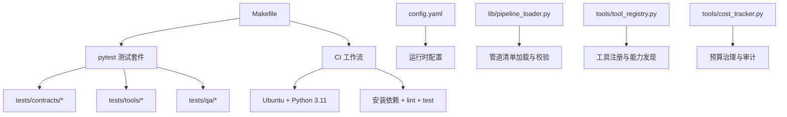
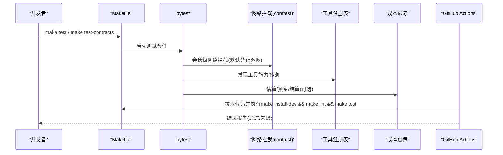
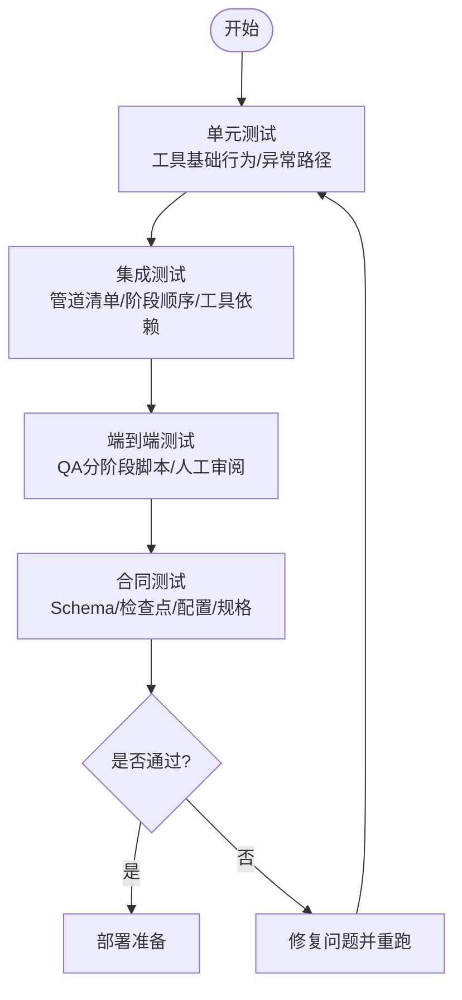
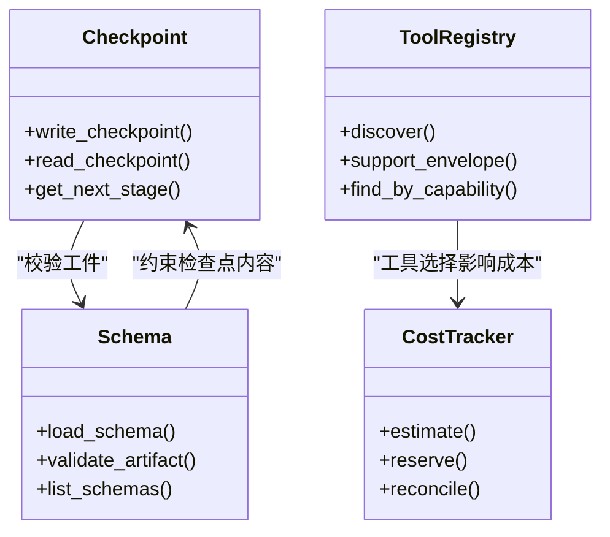
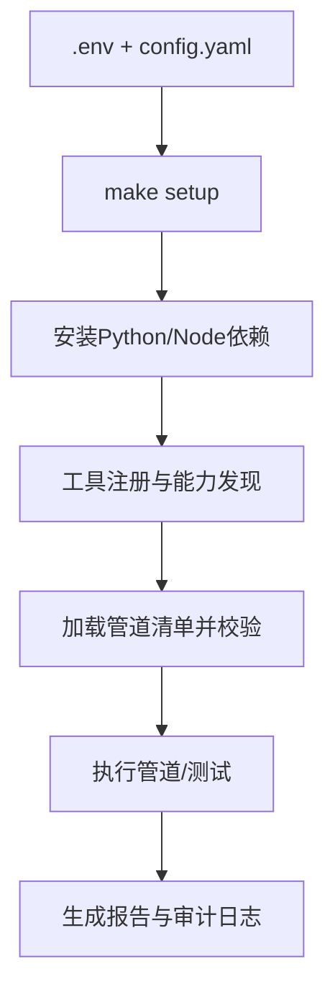
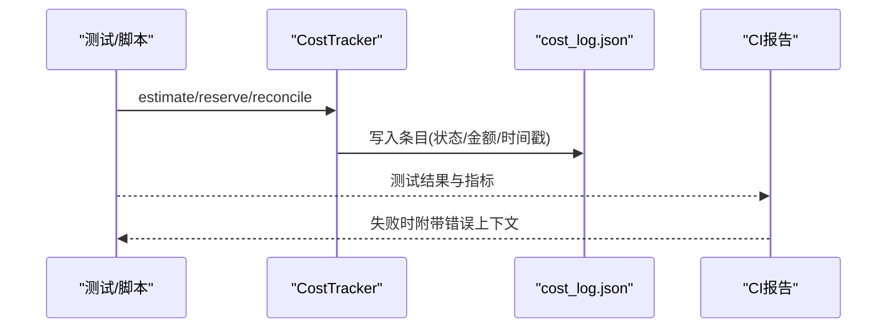
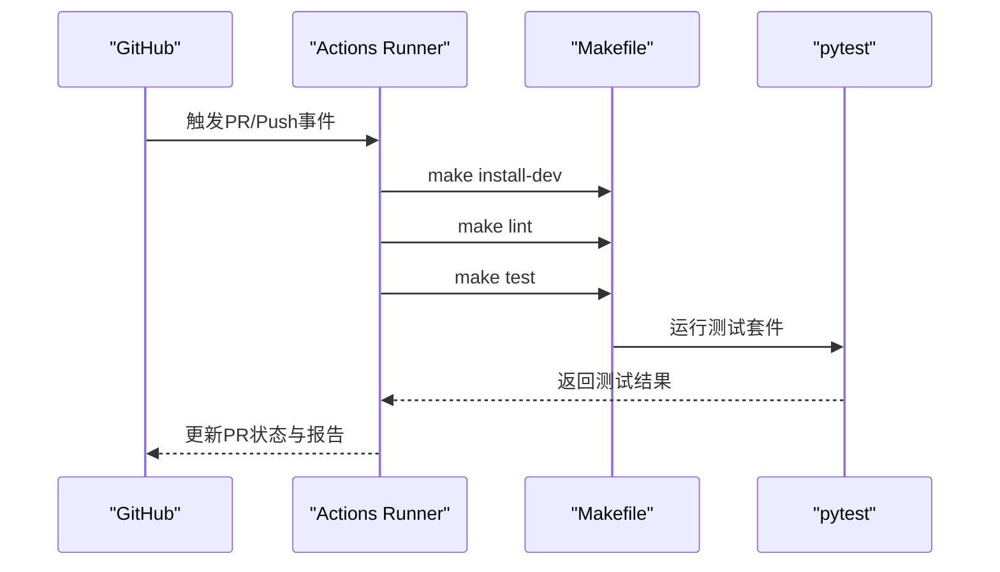
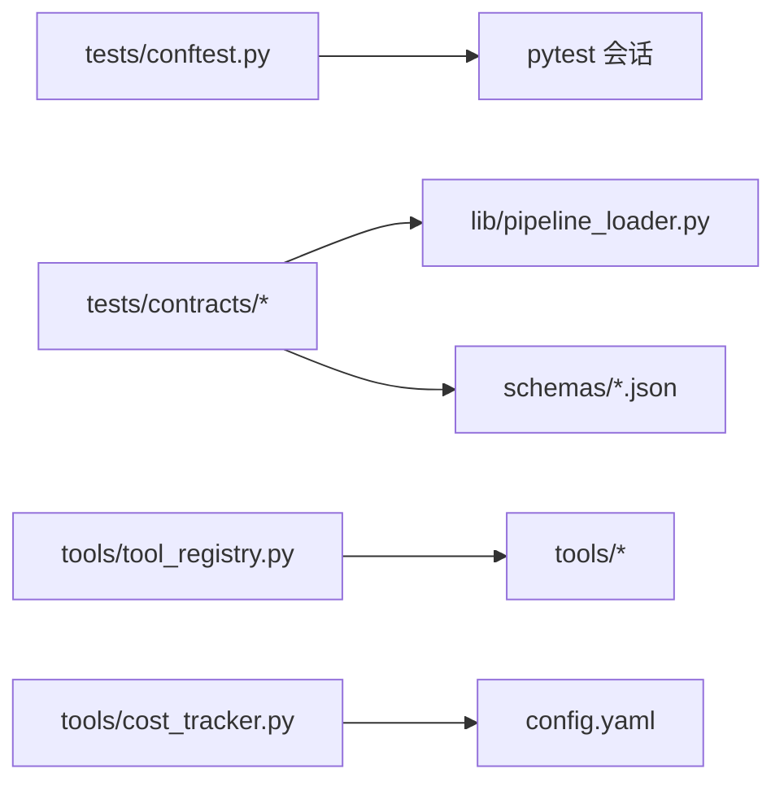

# 管道测试与部署

<cite>
**本文引用的文件**
- [README.md](file://README.md)
- [Makefile](file://Makefile)
- [config.yaml](file://config.yaml)
- [tests/conftest.py](file://tests/conftest.py)
- [tests/contracts/conftest.py](file://tests/contracts/conftest.py)
- [tests/contracts/test_phase0_contracts.py](file://tests/contracts/test_phase0_contracts.py)
- [tests/qa/QA_PLAN.md](file://tests/qa/QA_PLAN.md)
- [.github/workflows/ci.yml](file://.github/workflows/ci.yml)
- [lib/pipeline_loader.py](file://lib/pipeline_loader.py)
- [tools/tool_registry.py](file://tools/tool_registry.py)
- [tools/cost_tracker.py](file://tools/cost_tracker.py)
- [scripts/kling_official_animated_explainer_e2e.py](file://scripts/kling_official_animated_explainer_e2e.py)
</cite>

## 目录
1. [简介](#简介)
2. [项目结构](#项目结构)
3. [核心组件](#核心组件)
4. [架构总览](#架构总览)
5. [详细组件分析](#详细组件分析)
6. [依赖关系分析](#依赖关系分析)
7. [性能考量](#性能考量)
8. [故障排查指南](#故障排查指南)
9. [结论](#结论)
10. [附录](#附录)

## 简介
本指南面向OpenMontage的“管道测试与部署”，覆盖以下目标：
- 测试策略：单元测试、集成测试、端到端测试的实施方法
- 合同测试：阶段间契约一致性、数据格式验证、兼容性测试
- 部署最佳实践：环境配置、依赖管理、版本控制
- 监控与日志：关键指标收集、错误追踪、性能分析
- 自动化与CI/CD：示例与集成方式
- 故障排查：问题诊断技巧

OpenMontage以“指令驱动”的生产管线为核心，通过YAML清单定义阶段、工具与审查要点，配合技能文件指导AI代理执行。测试体系围绕“无网络调用默认安全”“合同校验”“成本治理”“质量门禁”展开，确保从开发到生产的全链路可控。

## 项目结构
- 测试根目录位于 tests/，包含 contracts（合同测试）、qa（质量验收脚本）、tools（工具级测试）、eval（评估与回放）等子目录
- 运行入口与命令由 Makefile 统一封装，提供 test、test-contracts、demo、lint 等常用任务
- CI 流水线在 .github/workflows/ci.yml 中定义，对 main 分支进行构建、安装依赖、静态检查与测试
- 全局配置集中在 config.yaml，涵盖LLM、预算、检查点、输出参数与路径
- 管道清单加载与校验由 lib/pipeline_loader.py 提供，结合 schemas/ 中的JSON Schema进行强约束
- 工具注册与能力发现由 tools/tool_registry.py 实现，支持自动发现与依赖提示
- 成本跟踪与预算治理由 tools/cost_tracker.py 实现，贯穿估算、预留、结算与审计

**图表来源**
- [Makefile:90-96](file://Makefile#L90-L96)
- [.github/workflows/ci.yml:1-46](file://.github/workflows/ci.yml#L1-L46)
- [lib/pipeline_loader.py:49-76](file://lib/pipeline_loader.py#L49-L76)
- [tools/tool_registry.py:420-451](file://tools/tool_registry.py#L420-L451)
- [tools/cost_tracker.py:1-80](file://tools/cost_tracker.py#L1-L80)

**章节来源**
- [Makefile:1-130](file://Makefile#L1-L130)
- [.github/workflows/ci.yml:1-46](file://.github/workflows/ci.yml#L1-L46)
- [config.yaml:1-34](file://config.yaml#L1-L34)
- [lib/pipeline_loader.py:49-76](file://lib/pipeline_loader.py#L49-L76)
- [tools/tool_registry.py:420-451](file://tools/tool_registry.py#L420-L451)
- [tools/cost_tracker.py:1-80](file://tools/cost_tracker.py#L1-L80)

## 核心组件
- 测试安全网：tests/conftest.py 在会话级别拦截非回环网络访问，避免测试意外产生费用；通过标记 live_api 显式启用真实API调用
- 合同测试框架：tests/contracts 下按阶段组织测试，覆盖配置、Schema、检查点、管道清单、工具注册、成本跟踪、媒体规格等
- 质量验收计划：tests/qa/QA_PLAN.md 定义了分阶段验收脚本、检查协议与成功标准
- 成本治理：tools/cost_tracker.py 实现估算、预留、结算、持久化与模式控制（observe/warn/cap），并触发审批或阻断
- 管道加载器：lib/pipeline_loader.py 负责读取YAML清单、校验Schema、列出可用管道、解析阶段顺序与所需工具
- 工具注册表：tools/tool_registry.py 自动发现工具、生成能力包、提示缺失环境变量与安装指引
- CI流水线：.github/workflows/ci.yml 在PR和push时执行Python验证、安装系统依赖、运行lint与测试

**章节来源**
- [tests/conftest.py:1-132](file://tests/conftest.py#L1-L132)
- [tests/contracts/test_phase0_contracts.py:253-602](file://tests/contracts/test_phase0_contracts.py#L253-L602)
- [tests/qa/QA_PLAN.md:1-73](file://tests/qa/QA_PLAN.md#L1-L73)
- [tools/cost_tracker.py:1-80](file://tools/cost_tracker.py#L1-L80)
- [lib/pipeline_loader.py:49-76](file://lib/pipeline_loader.py#L49-L76)
- [tools/tool_registry.py:420-451](file://tools/tool_registry.py#L420-L451)
- [.github/workflows/ci.yml:1-46](file://.github/workflows/ci.yml#L1-L46)

## 架构总览
OpenMontage的测试与部署架构围绕“安全默认、契约优先、可观测、可回滚”的原则设计：
- 测试层：以Pytest为基座，conftest.py强制网络隔离，合同测试保障数据与阶段契约，QA脚本用于人工验收与端到端演练
- 配置层：config.yaml集中管理LLM、预算、检查点策略、输出参数与路径，便于多环境切换
- 管道层：YAML清单+Schema校验，确保阶段顺序、工具依赖、审查焦点一致
- 工具层：工具注册表自动发现能力，提示缺失依赖与环境变量，降低集成成本
- 成本层：CostTracker贯穿估算、预留、结算，支持观察、警告、硬限制三种模式
- 部署层：Makefile统一安装与演示，CI流水线保证每次变更的可重复构建与测试

**图表来源**
- [tests/conftest.py:81-111](file://tests/conftest.py#L81-L111)
- [tools/tool_registry.py:420-451](file://tools/tool_registry.py#L420-L451)
- [tools/cost_tracker.py:1-80](file://tools/cost_tracker.py#L1-L80)
- [.github/workflows/ci.yml:18-46](file://.github/workflows/ci.yml#L18-L46)

## 详细组件分析

### 测试策略与实施
- 单元测试
  - 针对工具基础行为、状态机、异常路径进行断言，如BaseTool的执行与可用性判断、ToolRegistry的注册与查询、CostTracker的估算/预留/结算流程
  - 使用临时目录与隔离注册表，避免跨测试污染
- 集成测试
  - 验证管道清单加载、阶段顺序、所需工具集合、参考输入支持、媒体规格参数等
  - 通过load_pipeline与list_pipelines确认清单有效性与完整性
- 端到端测试
  - QA计划提供分阶段脚本，逐步验证TTS、图像生成、音乐、音频混音、视频合成、拼接、播放列表智能、完整管道渲染
  - 通过ffprobe与人工审阅确保输出质量
- 合同测试
  - 覆盖配置加载、Schema校验、检查点读写、管道清单、工具注册、成本跟踪、媒体规格
  - 通过sample_artifact构造最小合法数据，验证schema严格性

**章节来源**
- [tests/contracts/test_phase0_contracts.py:253-602](file://tests/contracts/test_phase0_contracts.py#L253-L602)
- [tests/qa/QA_PLAN.md:1-73](file://tests/qa/QA_PLAN.md#L1-L73)
- [lib/pipeline_loader.py:49-76](file://lib/pipeline_loader.py#L49-L76)

### 合同测试的重要性与实践
- 阶段间契约一致性
  - 检查点写入/读取需符合阶段状态与必需工件，非法阶段或状态会被拒绝
  - 管道清单必须声明skill字段，确保每个阶段有明确的执行指导
- 数据格式验证
  - 所有artifacts通过schemas/下的JSON Schema校验，确保字段完整与类型正确
  - 媒体规格（分辨率、帧率、编码）通过ALL_PROFILES与ffmpeg_output_args保证一致性
- 兼容性测试
  - 工具注册表自动发现能力，若缺少依赖或环境变量，会给出修复建议
  - 成本跟踪在不同模式下（observe/warn/cap）的行为验证，确保预算治理生效

**图表来源**
- [tests/contracts/test_phase0_contracts.py:288-355](file://tests/contracts/test_phase0_contracts.py#L288-L355)
- [tools/tool_registry.py:420-451](file://tools/tool_registry.py#L420-L451)
- [tools/cost_tracker.py:1-80](file://tools/cost_tracker.py#L1-L80)

**章节来源**
- [tests/contracts/test_phase0_contracts.py:253-602](file://tests/contracts/test_phase0_contracts.py#L253-L602)
- [tools/tool_registry.py:420-451](file://tools/tool_registry.py#L420-L451)
- [tools/cost_tracker.py:1-80](file://tools/cost_tracker.py#L1-L80)

### 管道部署最佳实践
- 环境配置
  - 使用config.yaml集中管理LLM、预算、检查点策略、输出参数与路径
  - 通过.env.example复制生成.env，按需添加API密钥；Makefile setup会自动创建.env
- 依赖管理
  - 使用Makefile统一安装Python依赖、Remotion composer、Piper TTS与HyperFrames缓存预热
  - GPU加速可通过install-gpu安装requirements-gpu.txt及diffusers/transformers/accelerate
- 版本控制
  - 管道清单与Schema作为契约，变更需通过合同测试与QA计划验证
  - CI流水线在main分支上执行安装、lint与测试，确保每次提交可构建与可测试

**图表来源**
- [Makefile:54-76](file://Makefile#L54-L76)
- [config.yaml:1-34](file://config.yaml#L1-L34)
- [lib/pipeline_loader.py:49-76](file://lib/pipeline_loader.py#L49-L76)

**章节来源**
- [Makefile:54-76](file://Makefile#L54-L76)
- [config.yaml:1-34](file://config.yaml#L1-L34)
- [lib/pipeline_loader.py:49-76](file://lib/pipeline_loader.py#L49-L76)

### 监控与日志记录
- 关键指标收集
  - 成本跟踪记录估算、预留、实际花费，支持持久化到cost_log.json
  - 管道清单与检查点保存决策轨迹，便于回溯
- 错误追踪
  - conftest.py在网络拦截失败时抛出明确错误信息，帮助定位测试中的外部调用
  - 工具注册表在缺失依赖或环境变量时给出修复建议
- 性能分析
  - QA计划建议使用ffprobe检查格式/时长/通道，结合人工审阅评估质量
  - 端到端脚本在缺失必要环境变量时会阻塞并输出报告，便于快速定位

**图表来源**
- [tools/cost_tracker.py:1-80](file://tools/cost_tracker.py#L1-L80)
- [tests/conftest.py:70-78](file://tests/conftest.py#L70-L78)
- [scripts/kling_official_animated_explainer_e2e.py:722-731](file://scripts/kling_official_animated_explainer_e2e.py#L722-L731)

**章节来源**
- [tools/cost_tracker.py:1-80](file://tools/cost_tracker.py#L1-L80)
- [tests/conftest.py:70-78](file://tests/conftest.py#L70-L78)
- [scripts/kling_official_animated_explainer_e2e.py:722-731](file://scripts/kling_official_animated_explainer_e2e.py#L722-L731)

### 自动化测试与CI/CD集成
- 本地测试
  - 使用make test与make test-contracts分别运行全量测试与合同测试
  - 通过OPENMONTAGE_ALLOW_NETWORK=1 pytest -m live_api允许真实API调用（谨慎使用）
- CI流水线
  - 在pull_request与push到main时触发
  - 安装Python 3.11、系统依赖（ffmpeg）、安装开发依赖、执行lint与测试
- 端到端脚本
  - 提供kling官方动画说明视频的端到端脚本，检测缺失环境变量并生成报告

**图表来源**
- [.github/workflows/ci.yml:1-46](file://.github/workflows/ci.yml#L1-L46)
- [Makefile:90-96](file://Makefile#L90-L96)

**章节来源**
- [.github/workflows/ci.yml:1-46](file://.github/workflows/ci.yml#L1-L46)
- [Makefile:90-96](file://Makefile#L90-L96)
- [scripts/kling_official_animated_explainer_e2e.py:722-731](file://scripts/kling_official_animated_explainer_e2e.py#L722-L731)

## 依赖关系分析
- 测试套件依赖conftest的网络拦截，确保测试不产生外部费用
- 合同测试依赖lib/pipeline_loader与schemas/进行清单与数据校验
- 工具注册表依赖工具包的元数据与依赖声明，提供能力发现与修复建议
- 成本跟踪依赖config.yaml的预算配置，并在不同模式下采取不同行为

**图表来源**
- [tests/conftest.py:81-111](file://tests/conftest.py#L81-L111)
- [lib/pipeline_loader.py:49-76](file://lib/pipeline_loader.py#L49-L76)
- [tools/tool_registry.py:420-451](file://tools/tool_registry.py#L420-L451)
- [tools/cost_tracker.py:1-80](file://tools/cost_tracker.py#L1-L80)
- [config.yaml:1-34](file://config.yaml#L1-L34)

**章节来源**
- [tests/conftest.py:81-111](file://tests/conftest.py#L81-L111)
- [lib/pipeline_loader.py:49-76](file://lib/pipeline_loader.py#L49-L76)
- [tools/tool_registry.py:420-451](file://tools/tool_registry.py#L420-L451)
- [tools/cost_tracker.py:1-80](file://tools/cost_tracker.py#L1-L80)
- [config.yaml:1-34](file://config.yaml#L1-L34)

## 性能考量
- 测试执行效率
  - 合同测试聚焦于配置、Schema与清单，运行速度快且稳定
  - 端到端测试可能涉及外部服务，建议在具备必要密钥的环境下串行执行，避免并发导致的资源竞争
- 渲染与处理
  - 使用ffprobe进行轻量级媒体探测，减少重计算
  - 通过媒体规格与编码器参数优化输出体积与质量平衡
- 成本与预算
  - 在warn模式下记录超支警告，cap模式下直接阻断，避免不可控费用
  - 通过估算与预留机制提前锁定预算，提升可预测性

[本节为通用指导，无需特定文件引用]

## 故障排查指南
- 网络调用被拦截
  - 现象：测试中抛出NetworkCallInTestError
  - 原因：conftest.py默认禁止非回环网络访问
  - 解决：如需真实API调用，设置OPENMONTAGE_ALLOW_NETWORK=1并使用@pytest.mark.live_api标记测试
- 工具不可用或缺失依赖
  - 现象：工具状态为UNAVAILABLE或能力包提示缺失
  - 原因：依赖未安装或环境变量未配置
  - 解决：根据工具注册表的修复建议安装依赖或配置环境变量
- 成本超支或审批不足
  - 现象：CostTracker抛出BudgetExceededError或ApprovalRequiredError
  - 原因：预算模式为cap或未批准新付费工具
  - 解决：调整预算配置或调用approve_tool进行审批
- 端到端脚本阻塞
  - 现象：脚本输出blocked并列出缺失的环境变量
  - 原因：缺少必要的API密钥或运行时配置
  - 解决：补充缺失的环境变量后重新运行

**章节来源**
- [tests/conftest.py:70-78](file://tests/conftest.py#L70-L78)
- [tools/tool_registry.py:420-451](file://tools/tool_registry.py#L420-L451)
- [tools/cost_tracker.py:1-80](file://tools/cost_tracker.py#L1-L80)
- [scripts/kling_official_animated_explainer_e2e.py:722-731](file://scripts/kling_official_animated_explainer_e2e.py#L722-L731)

## 结论
OpenMontage的测试与部署体系以“安全默认、契约优先、可观测、可回滚”为核心，通过严格的网络拦截、全面的合同测试、完善的成本治理与清晰的部署流程，确保管道在生产环境中的稳定性与可维护性。建议团队在开发与发布过程中：
- 坚持合同测试先行，确保数据与阶段契约一致
- 使用QA计划进行阶段性验收，结合ffprobe与人工审阅保证质量
- 在CI中固化测试与lint，保证每次变更可重复构建
- 通过成本跟踪与预算治理控制风险，避免不可控费用
- 利用工具注册表的修复建议快速补齐依赖与环境配置

[本节为总结性内容，无需特定文件引用]

## 附录
- 快速命令
  - 安装与演示：make setup、make demo
  - 运行测试：make test、make test-contracts
  - 预检能力：make preflight
  - GPU安装：make install-gpu
- 参考文档
  - README中的测试章节提供了基本命令与说明
  - QA计划提供了详细的验收步骤与成功标准

**章节来源**
- [README.md:746-754](file://README.md#L746-L754)
- [tests/qa/QA_PLAN.md:1-73](file://tests/qa/QA_PLAN.md#L1-L73)