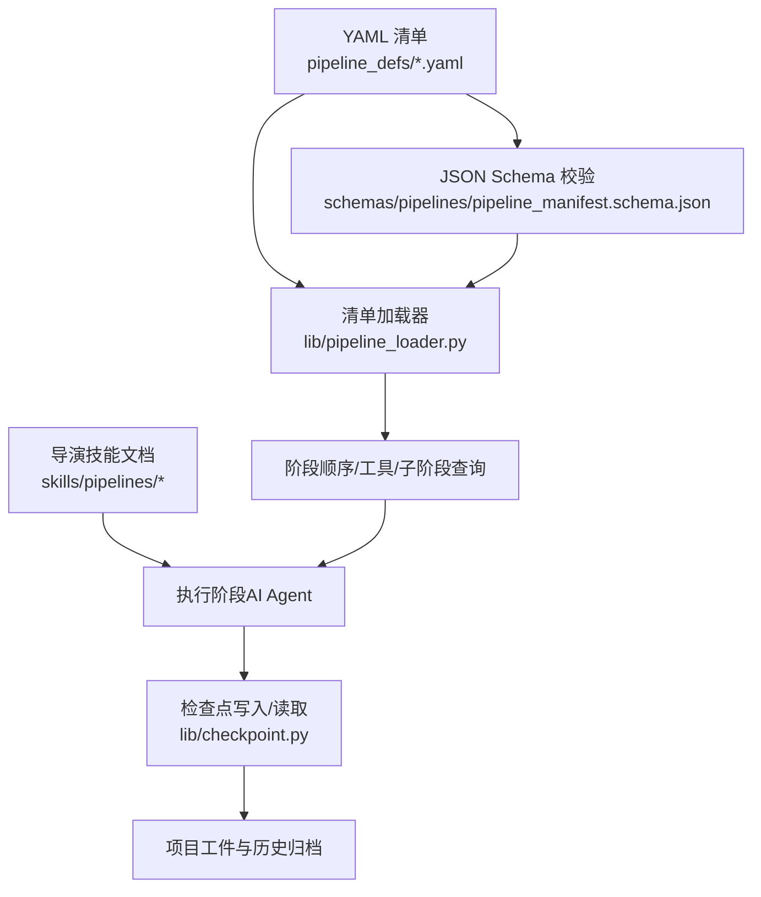
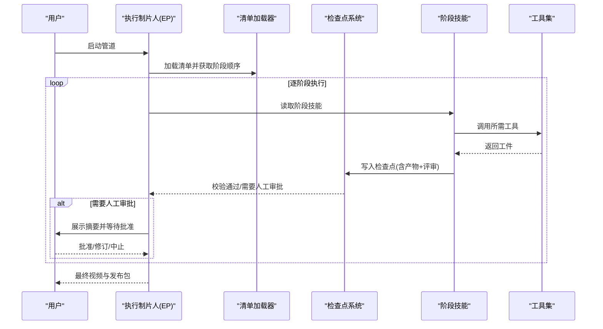
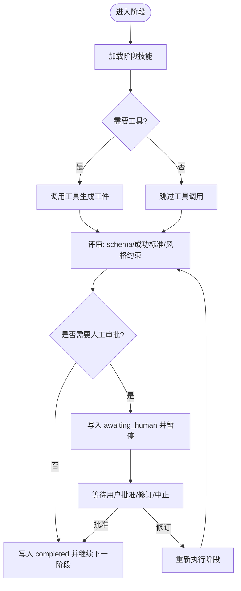

# 管道设计原则

<cite>
**本文引用的文件**
- [README.md](file://README.md)
- [pipeline_manifest.schema.json](file://schemas/pipelines/pipeline_manifest.schema.json)
- [animated-explainer.yaml](file://pipeline_defs/animated-explainer.yaml)
- [cinematic.yaml](file://pipeline_defs/cinematic.yaml)
- [documentary-montage.yaml](file://pipeline_defs/documentary-montage.yaml)
- [pipeline_loader.py](file://lib/pipeline_loader.py)
- [checkpoint.py](file://lib/checkpoint.py)
- [executive-producer.md（动画）](file://skills/pipelines/animation/executive-producer.md)
- [checkpoint-protocol.md](file://skills/meta/checkpoint-protocol.md)
</cite>

## 目录
1. [简介](#简介)
2. [项目结构](#项目结构)
3. [核心组件](#核心组件)
4. [架构总览](#架构总览)
5. [详细组件分析](#详细组件分析)
6. [依赖关系分析](#依赖关系分析)
7. [性能与可维护性考量](#性能与可维护性考量)
8. [故障排查指南](#故障排查指南)
9. [结论](#结论)
10. [附录：清单语法规则与最佳实践](#附录：清单语法规则与最佳实践)

## 简介
本文件系统化阐述 OpenMontage 的“管道设计原则”，围绕阶段化设计、声明式配置、契约驱动开发三大理念，解释如何以 YAML 清单定义管道、以技能文档指导执行、以 JSON Schema 约束产物契约，并通过检查点与人工审批门控保障质量。同时给出不同复杂度管道的实际示例与设计模式，帮助读者快速掌握从简单到复杂的管道设计与治理方法。

## 项目结构
OpenMontage 将“编排策略”与“执行能力”解耦：
- 声明层：pipeline_defs/*.yaml 描述管道名称、版本、分类、稳定性、阶段顺序、工具可用性、检查点策略等。
- 指令层：skills/pipelines/* 下的导演技能文档，指导 AI Agent 在每个阶段如何工作。
- 契约层：schemas/ 下的 JSON Schema 对产物进行强校验，确保跨阶段数据一致。
- 运行时：lib/pipeline_loader.py 加载并验证清单；lib/checkpoint.py 管理阶段推进、前置依赖、人类审批门控与审计日志。

**图表来源**
- [pipeline_manifest.schema.json:1-197](file://schemas/pipelines/pipeline_manifest.schema.json#L1-L197)
- [pipeline_loader.py:1-241](file://lib/pipeline_loader.py#L1-L241)
- [checkpoint.py:1-634](file://lib/checkpoint.py#L1-L634)

**章节来源**
- [README.md:356-486](file://README.md#L356-L486)
- [pipeline_manifest.schema.json:1-197](file://schemas/pipelines/pipeline_manifest.schema.json#L1-L197)
- [pipeline_loader.py:1-241](file://lib/pipeline_loader.py#L1-L241)
- [checkpoint.py:1-634](file://lib/checkpoint.py#L1-L634)

## 核心组件
- 清单加载器：负责读取 YAML、按 Schema 校验、缓存结果并提供阶段顺序、工具集合、子阶段过滤等查询接口。
- 检查点系统：强制阶段顺序、前置依赖、人类审批门控、产物 Schema 校验、决策日志合并与归档。
- 导演技能：每个阶段的“怎么做”由 Markdown 技能文档定义，Agent 据此产出符合契约的工件。
- 契约体系：通过 schemas/artifacts/*.schema.json 对每个阶段产物的字段、类型、必填项进行严格校验。

**章节来源**
- [pipeline_loader.py:1-241](file://lib/pipeline_loader.py#L1-L241)
- [checkpoint.py:1-634](file://lib/checkpoint.py#L1-L634)
- [README.md:450-486](file://README.md#L450-L486)

## 架构总览
OpenMontage 采用“声明式 + 契约驱动 + 阶段化”的三支柱架构：
- 声明式：YAML 清单明确阶段、产物、工具、审批策略、参考输入支持等。
- 契约驱动：每个阶段产出受 JSON Schema 约束，跨阶段引用稳定可靠。
- 阶段化：研究→提案→脚本→场景→资产→剪辑→合成→发布（或变体），每阶段有明确输入输出与成功标准。

**图表来源**
- [pipeline_loader.py:125-162](file://lib/pipeline_loader.py#L125-L162)
- [checkpoint.py:422-564](file://lib/checkpoint.py#L422-L564)
- [executive-producer.md（动画）:89-156](file://skills/pipelines/animation/executive-producer.md#L89-L156)

## 详细组件分析

### 清单结构与语法规则（基于 Schema）
- 基本属性
  - name/version/description/category/stability：标识与元信息，category 限定为 talking_head/generated/hybrid/screen_recording/animation/cinematic/documentary/custom；stability 限定为 production/beta。
  - compatible_playbooks：推荐/兼容/是否允许自定义样式。
  - required_skills：该管道必须使用的技能路径集合。
  - production_modes：可选生产模式，限制工具与场景类型，便于在创意阶段选择合适路径。
  - reference_input：是否支持参考视频输入及分析深度与工具。
  - orchestration：执行制片人模式、默认预算、最大修订次数、超时等。
  - extensions：能力扩展开关（自定义脚本/样式/技能/工具）。
- 阶段 stages
  - name/skill：阶段名与对应技能路径。
  - required_artifacts_in/optional_artifacts_in：阶段输入依赖。
  - produces：阶段产出的工件名。
  - required_tools/optional_tools/tools_available：工具可用性与偏好。
  - review_focus/success_criteria：评审关注点与成功标准。
  - checkpoint_required/human_approval_default：是否写检查点、是否默认需要人工审批。
  - sub_stages：阶段内可配置的子阶段（如预览样本），可按条件激活。

**章节来源**
- [pipeline_manifest.schema.json:1-197](file://schemas/pipelines/pipeline_manifest.schema.json#L1-L197)

### 阶段定义与执行流程
- 阶段顺序与依赖
  - 清单中的 stages 数组即阶段顺序；加载器提供 get_stage_order 暴露主阶段与可选的子阶段序列。
  - 检查点系统会强制前置阶段已完成且已获批（若要求），否则拒绝推进。
- 工具与产物契约
  - tools_available 是 required_tools 与 optional_tools 的并集，供 Agent 在该阶段使用。
  - 每个阶段 produce 的工件需满足对应 Schema，写入检查点时会被校验。
- 检查点与人工审批
  - 当 human_approval_default=true 时，阶段完成后状态为 awaiting_human，必须呈现摘要并结束本轮交互，等待用户批准后再写 completed。
  - 检查点写入前会校验前置阶段、风格样式表有效性、产物 Schema 以及阶段必需工件。

**图表来源**
- [checkpoint.py:251-347](file://lib/checkpoint.py#L251-L347)
- [checkpoint-protocol.md:110-167](file://skills/meta/checkpoint-protocol.md#L110-L167)
- [pipeline_loader.py:125-162](file://lib/pipeline_loader.py#L125-L162)

**章节来源**
- [checkpoint.py:1-634](file://lib/checkpoint.py#L1-L634)
- [checkpoint-protocol.md:110-167](file://skills/meta/checkpoint-protocol.md#L110-L167)
- [pipeline_loader.py:1-241](file://lib/pipeline_loader.py#L1-L241)

### 实际管道示例与模式

#### 示例一：动画讲解类（多阶段、强契约）
- 阶段：research → proposal → script → scene_plan → assets → edit → compose → publish
- 特点：
  - 明确的阶段产物与成功标准（如 research_brief、proposal_packet、script、scene_plan、asset_manifest、edit_decisions、render_report、publish_log）。
  - 关键阶段设置 human_approval_default=true（如 proposal/script/scene_plan/assets/publish），确保创意与成本可控。
  - 工具声明清晰（assets/compose 阶段声明 required_tools/optional_tools/tools_available）。
  - 支持参考视频输入与子阶段 sample（条件激活）。

**章节来源**
- [animated-explainer.yaml:1-270](file://pipeline_defs/animated-explainer.yaml#L1-L270)

#### 示例二：电影感短片（情绪导向、严格运行时锁定）
- 阶段：research → proposal → script → scene_plan → assets → edit → compose → publish
- 特点：
  - 强调情绪节奏、色彩一致性、音频动态；compose 阶段明确渲染运行时不得静默切换，避免降级导致质量损失。
  - 支持 deep 参考视频分析，子阶段 sample 用于预览情绪与调色方向。

**章节来源**
- [cinematic.yaml:1-288](file://pipeline_defs/cinematic.yaml#L1-L288)

#### 示例三：纪录片蒙太奇（检索优先、资源受限路径）
- 阶段：idea → scene_plan → assets → edit → compose
- 特点：
  - 检索优先：通过 corpus_builder/clip_search 或直接搜索 direct_clip_search 构建素材库，按主题槽位匹配。
  - 严格的编辑与合成规则：音乐与结尾标签（end-tag）为强制项，compose 阶段锁定渲染运行时。
  - 失败路径与统计：记录 rejected_picks、search_stats/corpus_stats，便于回溯与优化。

**章节来源**
- [documentary-montage.yaml:1-179](file://pipeline_defs/documentary-montage.yaml#L1-L179)

### 设计最佳实践
- 阶段划分
  - 将“零成本/高不确定性”的工作前置（research/proposal），再进入资源消耗阶段（assets/edit/compose）。
  - 每个阶段只负责单一职责，产物明确、成功标准可度量。
- 依赖管理
  - 使用 required_artifacts_in 显式声明上游依赖；tools_available 聚合可用工具，避免隐式耦合。
  - 利用 sub_stages 表达条件分支（如参考视频存在时才生成预览）。
- 输入输出契约
  - 所有阶段产物遵循 schemas/artifacts/*.schema.json；success_criteria 量化验收标准。
  - 在 compose 阶段锁定渲染运行时，禁止静默降级，保证交付承诺。
- 审批与可追溯
  - 关键阶段开启 human_approval_default=true；检查点系统强制 gate 流程，保留历史与决策日志。
- 可扩展性
  - 通过 extensions 控制自定义脚本/样式/技能/工具的权限；production_modes 限定工具与场景类型，降低误用风险。

[本节为通用指导，不直接分析具体文件]

## 依赖关系分析
- 清单加载器依赖 Schema 校验与 YAML 解析，提供阶段顺序、工具集合、子阶段过滤等能力。
- 检查点系统依赖清单加载器获取阶段顺序与审批策略，并对产物进行 Schema 校验与前置依赖检查。
- 导演技能与工具集通过清单的 tools_available 与 required_tools 被约束，确保执行环境一致。

**图表来源**
- [pipeline_manifest.schema.json:1-197](file://schemas/pipelines/pipeline_manifest.schema.json#L1-L197)
- [pipeline_loader.py:1-241](file://lib/pipeline_loader.py#L1-L241)
- [checkpoint.py:1-634](file://lib/checkpoint.py#L1-L634)

**章节来源**
- [pipeline_loader.py:1-241](file://lib/pipeline_loader.py#L1-L241)
- [checkpoint.py:1-634](file://lib/checkpoint.py#L1-L634)

## 性能与可维护性考量
- 清单加载缓存：使用 lru_cache 缓存 Schema 与清单，减少重复解析与校验开销。
- 原子写入与归档：检查点写入先写临时文件再替换，并将旧版归档至 history，保证可恢复与可回放。
- 最小化变更面：通过 success_criteria 与 review_focus 精确收敛修改范围，避免全量重跑。
- 运行时锁定：compose 阶段锁定渲染运行时，防止静默降级导致的返工与性能波动。

[本节为通用指导，不直接分析具体文件]

## 故障排查指南
- 阶段无法推进
  - 检查前置阶段是否 completed 且已获批（若要求）；查看检查点错误信息与前置依赖列表。
  - 确认 pipeline_type 正确，避免未知管道导致回退到默认阶段顺序。
- 人工审批未生效
  - 确认清单中 human_approval_default=true；检查点写入时必须 status=awaiting_human 并在用户批准后改为 completed。
- 产物校验失败
  - 对照 schemas/artifacts/*.schema.json 检查字段类型与必填项；根据错误提示修正工件。
- 渲染运行时不一致
  - 确保 edit_decisions 与 proposal_packet 中的 render_runtime 一致；compose 阶段禁止静默切换。

**章节来源**
- [checkpoint.py:251-347](file://lib/checkpoint.py#L251-L347)
- [checkpoint.py:422-564](file://lib/checkpoint.py#L422-L564)
- [checkpoint-protocol.md:110-167](file://skills/meta/checkpoint-protocol.md#L110-L167)

## 结论
OpenMontage 的管道设计以“声明式清单 + 契约化产物 + 阶段化执行”为核心，结合检查点与人工审批门控，实现了高质量、可追溯、可扩展的视频生产流水线。通过清晰的阶段划分、严格的输入输出契约与灵活的扩展机制，既能支撑简单的讲解视频，也能胜任复杂的电影感短片与纪录片蒙太奇。

[本节为总结性内容，不直接分析具体文件]

## 附录：清单语法规则与最佳实践

### 清单字段速查
- 基本信息：name/version/description/category/stability
- 兼容性：compatible_playbooks（recommended/also_works/custom_allowed）
- 技能与模式：required_skills、production_modes（name/description/required_tools/optional_tools/scene_type/agent_skills/best_for）
- 参考输入：reference_input（supported/analysis_depth/analysis_tools）
- 编排：orchestration（mode/skill/budget_default_usd/max_revisions_per_stage/max_send_backs/max_wall_time_minutes）
- 扩展：extensions（custom_scripts/custom_playbooks/custom_skills/custom_tools）
- 阶段 stages：name/skill/required_artifacts_in/optional_artifacts_in/produces/preferred_tools/fallback_tools/required_tools/optional_tools/tools_available/review_focus/checkpoint_required/human_approval_default/success_criteria/sub_stages

**章节来源**
- [pipeline_manifest.schema.json:1-197](file://schemas/pipelines/pipeline_manifest.schema.json#L1-L197)

### 阶段设计要点
- 明确阶段职责与产物，避免“大杂烩”阶段。
- 使用 required_artifacts_in 显式声明依赖，减少隐式耦合。
- tools_available 应包含 required_tools 与 optional_tools 的并集，便于 Agent 选择。
- success_criteria 要可度量、可自动化校验（如 Schema 有效、时长误差范围、文件存在性等）。
- 对高风险阶段启用 human_approval_default=true，配合 checkpoint-protocol 的审批流程。

**章节来源**
- [animated-explainer.yaml:61-270](file://pipeline_defs/animated-explainer.yaml#L61-L270)
- [cinematic.yaml:60-288](file://pipeline_defs/cinematic.yaml#L60-L288)
- [documentary-montage.yaml:45-179](file://pipeline_defs/documentary-montage.yaml#L45-L179)
- [checkpoint-protocol.md:110-167](file://skills/meta/checkpoint-protocol.md#L110-L167)

### 实际模式示例
- 多阶段强契约模式：适用于教育讲解、产品演示等，强调脚本与场景规划、资产一致性。
- 情绪导向模式：适用于品牌短片、预告片，强调情绪节奏、色彩与音频动态，严格运行时锁定。
- 检索优先模式：适用于纪录片蒙太奇，强调素材检索、主题槽位匹配与统一调色。

**章节来源**
- [animated-explainer.yaml:1-270](file://pipeline_defs/animated-explainer.yaml#L1-L270)
- [cinematic.yaml:1-288](file://pipeline_defs/cinematic.yaml#L1-L288)
- [documentary-montage.yaml:1-179](file://pipeline_defs/documentary-montage.yaml#L1-L179)