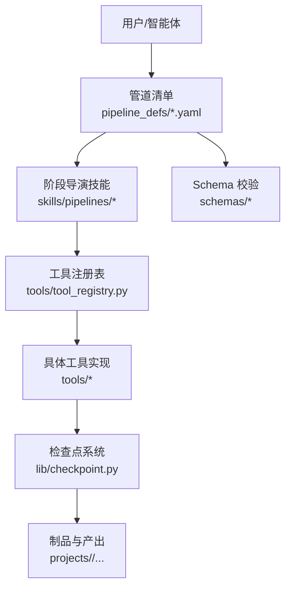
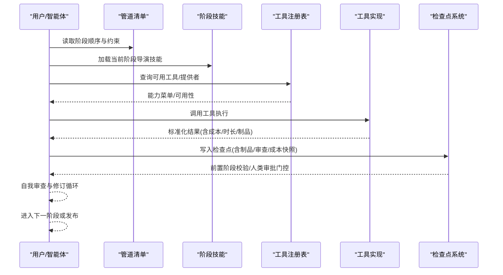
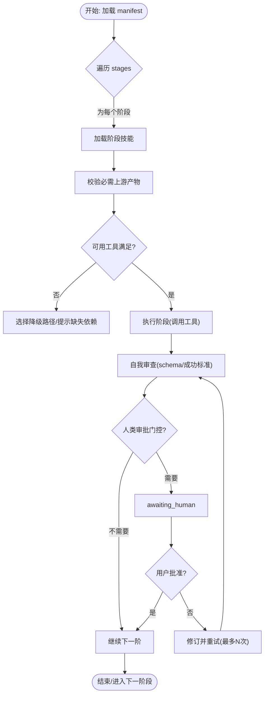
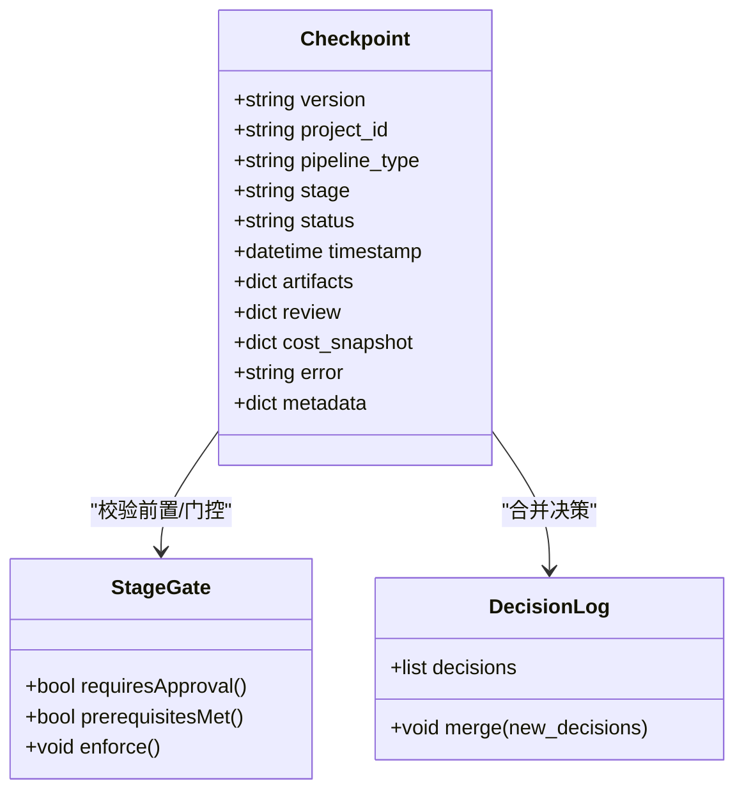
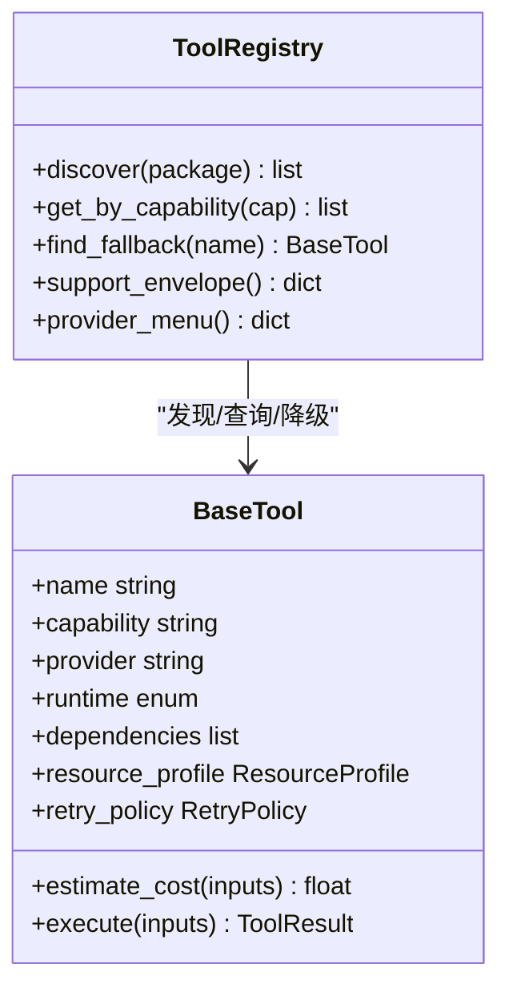
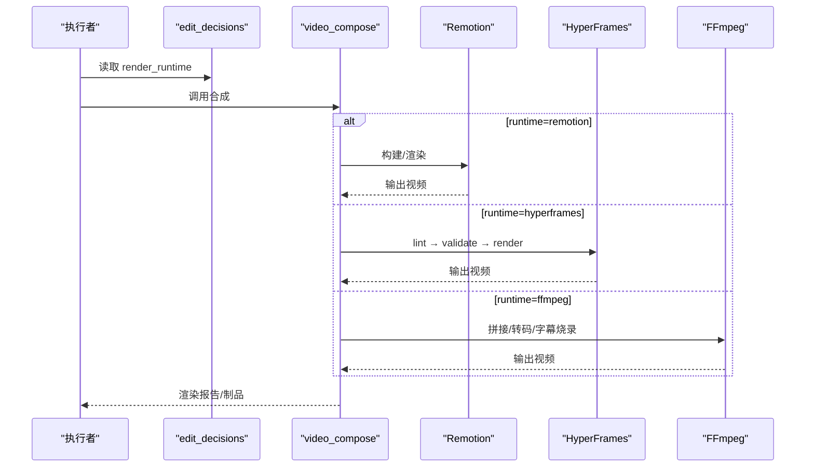
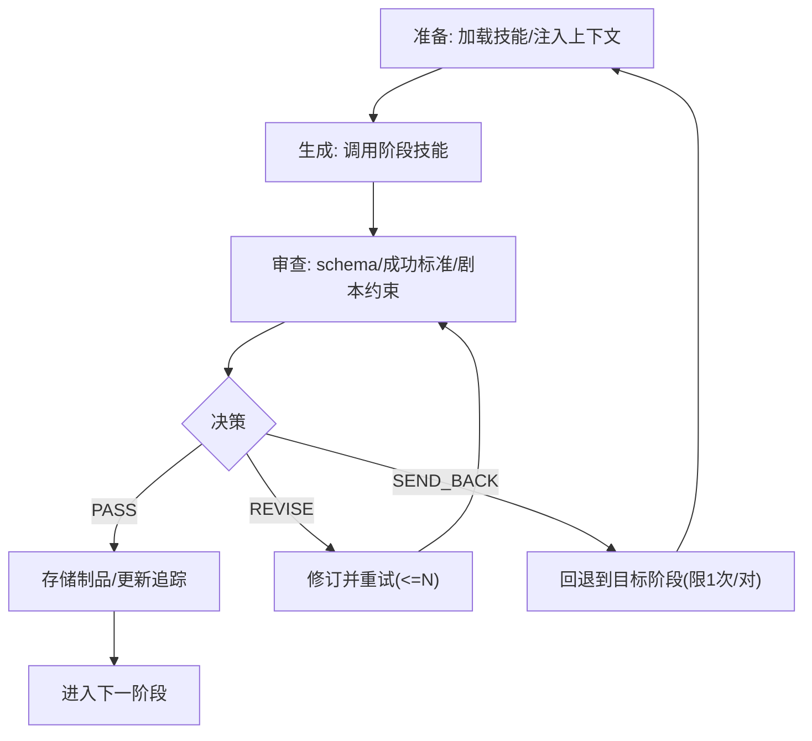
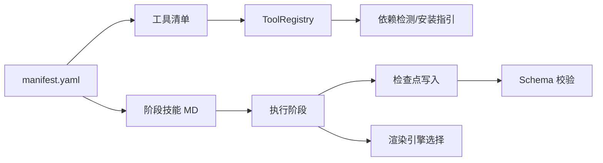

# 自定义管道开发

<cite>
**本文引用的文件**
- [README.md](file://README.md)
- [ARCHITECTURE.md](file://docs/ARCHITECTURE.md)
- [pipeline_loader.py](file://lib/pipeline_loader.py)
- [checkpoint.py](file://lib/checkpoint.py)
- [base_tool.py](file://tools/base_tool.py)
- [tool_registry.py](file://tools/tool_registry.py)
- [animated-explainer.yaml](file://pipeline_defs/animated-explainer.yaml)
- [pipeline_manifest.schema.json](file://schemas/pipelines/pipeline_manifest.schema.json)
- [executive-producer.md（explainer）](file://skills/pipelines/explainer/executive-producer.md)
- [executive-producer.md（animation）](file://skills/pipelines/animation/executive-producer.md)
- [executive-producer.md（talking-head）](file://skills/pipelines/talking-head/executive-producer.md)
- [test_runtime_presentation_contract.py](file://tests/contracts/test_runtime_presentation_contract.py)
</cite>

## 目录
1. [简介](#简介)
2. [项目结构](#项目结构)
3. [核心组件](#核心组件)
4. [架构总览](#架构总览)
5. [详细组件分析](#详细组件分析)
6. [依赖关系分析](#依赖关系分析)
7. [性能与资源管理](#性能与资源管理)
8. [测试、部署与维护](#测试部署与维护)
9. [故障排查指南](#故障排查指南)
10. [结论](#结论)
11. [附录：从零到一的开发示例](#附录从零到一的开发示例)

## 简介
本指南面向希望在 OpenMontage 中从零开始设计与实现“自定义管道”的开发者。OpenMontage 采用“智能体编排 + 声明式管道 + 工具注册表”的架构：没有传统意义上的 Python 运行时编排器，而是由 AI 编码助手读取 YAML 管道清单与 Markdown 导演技能，调用工具并持久化检查点，完成从研究、提案、脚本、场景、资产、剪辑、合成到发布的完整生产流程。

本指南覆盖：
- 需求分析与阶段设计原则
- 工具选择与配置编写
- 阶段间依赖、数据流转与错误处理机制
- 最佳实践：性能优化、资源管理与调试技巧
- 从简单测试管道到复杂生产级管道的完整示例
- 测试、部署与维护方法

## 项目结构
OpenMontage 将“能力（工具）”“编排（管道清单）”“知识（技能）”分层组织，便于扩展与治理：
- tools：可执行的生产工具集合（视频、音频、图像、增强、分析等），通过 BaseTool 统一契约与 ToolRegistry 自动发现
- pipeline_defs：YAML 管道清单，定义阶段顺序、产物、可用工具、审查焦点与成功标准
- skills：指令型知识（Layer 2），包含各管道阶段的导演技能、元技能（评审、检查点协议等）
- schemas：JSON Schema 用于校验管道清单、制品与检查点
- lib：核心基础设施（配置、检查点、管道加载、媒体规格等）
- remotion-composer / styles：渲染引擎与视觉风格剧本

图表来源
- [ARCHITECTURE.md:31-76](file://docs/ARCHITECTURE.md#L31-L76)
- [pipeline_loader.py:49-76](file://lib/pipeline_loader.py#L49-L76)
- [base_tool.py:227-397](file://tools/base_tool.py#L227-L397)
- [tool_registry.py:55-134](file://tools/tool_registry.py#L55-L134)
- [checkpoint.py:194-564](file://lib/checkpoint.py#L194-L564)

章节来源
- [ARCHITECTURE.md:31-76](file://docs/ARCHITECTURE.md#L31-L76)
- [README.md:450-475](file://README.md#L450-L475)

## 核心组件
- 管道清单（Pipeline Manifest）：以 YAML 描述管道名称、版本、类别、阶段顺序、每个阶段的产物、可用工具、人类审批默认值、审查焦点与成功标准。支持条件启用子阶段、参考输入分析、扩展权限控制等。
- 检查点系统（Checkpoint）：按阶段持久化状态，强制前置阶段完成与必要的人类审批，归档历史版本，维护决策日志，确保可恢复与可审计。
- 工具契约（BaseTool）：所有工具继承统一接口，声明能力、提供者、运行时、依赖、资源画像、重试策略、成本估算、幂等键、降级链等；execute 返回标准化结果。
- 工具注册表（ToolRegistry）：自动发现工具，提供按能力/提供者/稳定性查询、可用性报告、降级查找、能力菜单汇总等。
- 渲染引擎路由：compose 阶段根据 edit_decisions 中的 render_runtime 选择 Remotion/HyperFrames/FFmpeg，禁止静默切换。

章节来源
- [pipeline_manifest.schema.json:167-196](file://schemas/pipelines/pipeline_manifest.schema.json#L167-L196)
- [checkpoint.py:194-564](file://lib/checkpoint.py#L194-L564)
- [base_tool.py:227-397](file://tools/base_tool.py#L227-L397)
- [tool_registry.py:55-134](file://tools/tool_registry.py#L55-L134)
- [ARCHITECTURE.md:448-475](file://docs/ARCHITECTURE.md#L448-L475)

## 架构总览
OpenMontage 的编排由智能体驱动：智能体读取管道清单与阶段技能，调用工具，写入检查点，进行自我审查与人类审批门控，最终输出成品。关键特性包括：
- 无运行时编排器：Python 仅提供工具与持久化，编排逻辑在 YAML+Markdown 中
- 双提供者支持：同一能力同时支持 API 与本地/开源替代，通过选择器模式动态路由
- 预算治理：预估→预留→对账的全生命周期成本控制
- 质量门禁：预合成校验、后渲染自检、幻灯片风险评分、源媒体探测
- 决策审计：每次重大技术/创意选择均记录原因、备选与置信度

图表来源
- [ARCHITECTURE.md:9-27](file://docs/ARCHITECTURE.md#L9-L27)
- [tool_registry.py:249-314](file://tools/tool_registry.py#L249-L314)
- [checkpoint.py:422-564](file://lib/checkpoint.py#L422-L564)

## 详细组件分析

### 管道清单与阶段设计
- 阶段顺序：大多数生产管道遵循“研究→提案→脚本→场景计划→资产→剪辑→合成→发布”的标准流，但可按需插入领域特定阶段（如角色动画的“角色设计/绑定计划”）。
- 阶段声明：每个阶段指定 skill、produces、tools_available、required_artifacts_in、human_approval_default、review_focus、success_criteria，以及可选的 sub_stages 与 condition。
- 扩展控制：manifest 支持 extensions 字段控制是否允许 custom_scripts/custom_playbooks/custom_skills/custom_tools。
- 参考输入：reference_input 可启用对参考视频的解析与采样工具链。

图表来源
- [animated-explainer.yaml:61-270](file://pipeline_defs/animated-explainer.yaml#L61-L270)
- [pipeline_manifest.schema.json:167-196](file://schemas/pipelines/pipeline_manifest.schema.json#L167-L196)
- [checkpoint.py:251-346](file://lib/checkpoint.py#L251-L346)

章节来源
- [ARCHITECTURE.md:170-240](file://docs/ARCHITECTURE.md#L170-L240)
- [animated-explainer.yaml:1-270](file://pipeline_defs/animated-explainer.yaml#L1-L270)
- [pipeline_manifest.schema.json:167-196](file://schemas/pipelines/pipeline_manifest.schema.json#L167-L196)

### 检查点系统与阶段依赖
- 检查点结构：包含 version、project_id、pipeline_type、stage、status、timestamp、artifacts、review、cost_snapshot、error、metadata 等字段，并通过 JSON Schema 校验。
- 前置阶段强制：仅当所有前置阶段已完成且必要时已获人类批准，才允许推进到 awaiting_human/completed。
- 人类审批门控：若 manifest 或调用方要求 human_approval，则不能直接写 completed，必须写 awaiting_human 并在获得批准后再次写入 completed。
- 历史归档：被覆盖的非 in_progress 检查点会归档至 history/，保留版本与门控审计轨迹。
- 决策日志合并：检查点携带 decision_log 时，会合并到项目级 decision_log.json，并在 proposal_packet/render_report 中引用。

图表来源
- [checkpoint.py:124-191](file://lib/checkpoint.py#L124-L191)
- [checkpoint.py:251-346](file://lib/checkpoint.py#L251-L346)
- [checkpoint.py:388-419](file://lib/checkpoint.py#L388-L419)
- [checkpoint.py:422-564](file://lib/checkpoint.py#L422-L564)

章节来源
- [checkpoint.py:194-564](file://lib/checkpoint.py#L194-L564)

### 工具契约与注册表
- BaseTool：统一身份、能力、提供者、运行时、依赖、资源画像、重试策略、成本估算、幂等键、降级链、Agent Skills 引用等；execute 返回 ToolResult。
- ToolRegistry：自动发现 tools 包下的 BaseTool 子类，提供按能力/提供者/稳定性查询、可用性报告、降级查找、能力菜单汇总、GPU/网络需求列表等。
- 选择器模式：tts_selector/image_selector/video_selector 等根据任务匹配、质量、控制、可靠性、成本、延迟、连续性等多维打分选择提供者，透明适配输入输出格式。

图表来源
- [base_tool.py:227-397](file://tools/base_tool.py#L227-L397)
- [tool_registry.py:55-134](file://tools/tool_registry.py#L55-L134)
- [tool_registry.py:184-196](file://tools/tool_registry.py#L184-L196)
- [tool_registry.py:249-314](file://tools/tool_registry.py#L249-L314)

章节来源
- [base_tool.py:227-397](file://tools/base_tool.py#L227-L397)
- [tool_registry.py:55-134](file://tools/tool_registry.py#L55-L134)

### 渲染引擎路由与 compose 阶段
- compose 阶段依据 edit_decisions.render_runtime 选择 Remotion、HyperFrames 或 FFmpeg。
- 禁止静默切换：若所选运行时不可用，工具应返回结构化阻断信息，而非悄悄替换。
- HyperFrames 需在渲染前通过 lint/validate；Remotion 使用 React/TypeScript 工程构建。
- 测试契约确保 compose 阶段技能覆盖运行时路由，防止遗漏导致错误渲染。

图表来源
- [ARCHITECTURE.md:448-475](file://docs/ARCHITECTURE.md#L448-L475)
- [test_runtime_presentation_contract.py:127-143](file://tests/contracts/test_runtime_presentation_contract.py#L127-L143)

章节来源
- [ARCHITECTURE.md:448-475](file://docs/ARCHITECTURE.md#L448-L475)
- [test_runtime_presentation_contract.py:127-143](file://tests/contracts/test_runtime_presentation_contract.py#L127-L143)

### 执行器（Executive Producer）与阶段门控
- 每个管道通常由 Executive Producer 协调串行执行阶段：准备→生成→审查→门控决策（PASS/REVISE/SEND_BACK）。
- REVISE 最多 N 次（manifest 中 max_revisions_per_stage），超过则 PASS WITH WARNINGS 避免死锁。
- SEND_BACK 用于下游发现使上游失效时的回退重跑，限制每对阶段最多一次以避免环路。

图表来源
- [executive-producer.md（explainer）:93-120](file://skills/pipelines/explainer/executive-producer.md#L93-L120)
- [executive-producer.md（animation）:116-156](file://skills/pipelines/animation/executive-producer.md#L116-L156)
- [executive-producer.md（talking-head）:103-150](file://skills/pipelines/talking-head/executive-producer.md#L103-L150)

章节来源
- [executive-producer.md（explainer）:93-120](file://skills/pipelines/explainer/executive-producer.md#L93-L120)
- [executive-producer.md（animation）:116-156](file://skills/pipelines/animation/executive-producer.md#L116-L156)
- [executive-producer.md（talking-head）:103-150](file://skills/pipelines/talking-head/executive-producer.md#L103-L150)

## 依赖关系分析
- 管道清单依赖阶段技能与工具：manifest 声明 required_skills、stages、tools_available，确保智能体知道如何执行。
- 工具依赖环境与二进制：BaseTool.dependencies 声明 cmd/binary/env/python 依赖，ToolRegistry 检测可用性并提供安装指引。
- 检查点依赖 Schema：checkpoint 与制品均需通过 JSON Schema 校验，防止非法数据传播。
- 渲染引擎依赖 Node/FFmpeg：Remotion/HyperFrames/FFmpeg 作为后端，compose 阶段根据运行时选择。

图表来源
- [tool_registry.py:118-134](file://tools/tool_registry.py#L118-L134)
- [base_tool.py:304-328](file://tools/base_tool.py#L304-L328)
- [checkpoint.py:124-191](file://lib/checkpoint.py#L124-L191)
- [ARCHITECTURE.md:448-475](file://docs/ARCHITECTURE.md#L448-L475)

章节来源
- [tool_registry.py:118-134](file://tools/tool_registry.py#L118-L134)
- [base_tool.py:304-328](file://tools/base_tool.py#L304-L328)
- [checkpoint.py:124-191](file://lib/checkpoint.py#L124-L191)
- [ARCHITECTURE.md:448-475](file://docs/ARCHITECTURE.md#L448-L475)

## 性能与资源管理
- 资源画像：BaseTool.resource_profile 声明 CPU/RAM/VRAM/Disk/Network，ToolRegistry 可汇总 GPU/网络需求工具列表，辅助容量规划。
- 重试与幂等：RetryPolicy 与 idempotency_key_fields 支持失败重试与幂等缓存，减少重复计算。
- 成本治理：CostTracker 支持 estimate/reserve/reconcile，配合单动作审批阈值与总预算上限，避免意外开销。
- 渲染性能：优先选择合适渲染引擎（Remotion/HyperFrames/FFmpeg），避免不必要的中间步骤；合理使用帧采样与压缩参数。
- 并行与异步：ExecutionMode 支持 sync/async，结合工具自身并发策略提升吞吐。

章节来源
- [base_tool.py:110-126](file://tools/base_tool.py#L110-L126)
- [base_tool.py:374-407](file://tools/base_tool.py#L374-L407)
- [tool_registry.py:476-488](file://tools/tool_registry.py#L476-L488)
- [ARCHITECTURE.md:290-318](file://docs/ARCHITECTURE.md#L290-L318)

## 测试、部署与维护
- 合同测试：验证工具契约、Schema、注册表行为、管道清单合规性。
- QA 集成测试：调用真实工具/二进制，评估输出质量与兼容性。
- 评估框架：Golden scenario replay harness 支持容差比较，回归测试随机输出。
- 部署要点：
  - 环境：Python 3.10+、FFmpeg、Node.js（Remotion/HyperFrames）、可选 GPU
  - 密钥：按需配置 .env 变量（API Key、Region、Endpoint 等）
  - 运行时：确保所选渲染引擎可用（npx hyperframes、npm install 等）
- 维护建议：
  - 定期运行 contract/QA 测试，确保工具与依赖变更不破坏契约
  - 监控成本日志与决策日志，识别异常支出与频繁降级
  - 更新技能与清单以反映新工具/提供者能力变化

章节来源
- [ARCHITECTURE.md:478-512](file://docs/ARCHITECTURE.md#L478-L512)
- [README.md:746-754](file://README.md#L746-L754)

## 故障排查指南
- 阶段无法推进：检查前置阶段是否 completed 且必要的人类审批已通过；查看 checkpoint 的 prerequisite 校验错误。
- 人类审批门控报错：确认未跳过 gate，正确先写 awaiting_human，再在批准后写 completed。
- 工具不可用：查看 ToolRegistry 的 provider_menu_summary，按提示补齐 env 或安装依赖；必要时启用降级工具。
- 渲染失败：确认 render_runtime 与 edit_decisions 一致；HyperFrames 需通过 lint/validate；Remotion 需构建成功；FFmpeg 需可用。
- 成本超支：检查 CostTracker 模式（observe/warn/cap）与单动作审批阈值；核对 cost_log。

章节来源
- [checkpoint.py:251-346](file://lib/checkpoint.py#L251-L346)
- [checkpoint.py:422-564](file://lib/checkpoint.py#L422-L564)
- [tool_registry.py:316-471](file://tools/tool_registry.py#L316-L471)
- [ARCHITECTURE.md:448-475](file://docs/ARCHITECTURE.md#L448-L475)

## 结论
OpenMontage 的自定义管道开发以“声明式清单 + 指令型技能 + 工具契约”为核心，强调可审计、可恢复、可扩展与强治理。通过严格的前置依赖校验、人类审批门控、Schema 校验与预算治理，确保生产级质量与可控成本。借助选择器模式与多渲染引擎路由，系统能在不同环境下优雅降级并保持稳定输出。

## 附录：从零到一的开发示例

### 示例一：简单测试管道（最小可用）
- 目标：验证框架能否加载清单、执行阶段、写入检查点、通过 Schema 校验。
- 步骤：
  1. 在 pipeline_defs/ 创建 minimal-test.yaml，定义 name/version/stages（例如 idea→script→publish），设置 minimal tools_available。
  2. 在 skills/pipelines/minimal-test/ 下创建对应阶段技能（idea-director、script-director、publish-director），明确 produces 与 success_criteria。
  3. 使用 lib/pipeline_loader.load_pipeline 加载清单并校验 Schema。
  4. 模拟执行阶段：调用工具（可为空操作），写入检查点（lib/checkpoint.write_checkpoint），验证前置阶段与人类审批门控。
  5. 运行 tests/contracts 相关用例，确保清单与制品符合 Schema。

章节来源
- [pipeline_loader.py:49-76](file://lib/pipeline_loader.py#L49-L76)
- [checkpoint.py:194-564](file://lib/checkpoint.py#L194-L564)
- [pipeline_manifest.schema.json:167-196](file://schemas/pipelines/pipeline_manifest.schema.json#L167-L196)

### 示例二：中等复杂度管道（带资产与合成）
- 目标：引入资产生成与合成阶段，演示工具选择与渲染路由。
- 步骤：
  1. 在 manifest 中添加 assets 与 compose 阶段，声明 required_artifacts_in、tools_available（如 tts_selector、image_selector、video_compose）。
  2. 在阶段技能中定义资产清单与合成参数，确保 edit_decisions 中指定 render_runtime。
  3. 使用 ToolRegistry.provider_menu 展示可用提供者，选择合适工具并记录决策日志。
  4. 在 compose 阶段调用 video_compose，根据运行时选择 Remotion/HyperFrames/FFmpeg，并通过 lint/validate（HyperFrames）与构建（Remotion）。
  5. 写入 render_report 与 final_review，通过后发布。

章节来源
- [animated-explainer.yaml:160-249](file://pipeline_defs/animated-explainer.yaml#L160-L249)
- [tool_registry.py:249-314](file://tools/tool_registry.py#L249-L314)
- [ARCHITECTURE.md:448-475](file://docs/ARCHITECTURE.md#L448-L475)

### 示例三：生产级管道（强治理与高可用）
- 目标：加入预算治理、人类审批、降级与回退、决策审计与质量门禁。
- 步骤：
  1. 在 manifest 中设置 orchestration.max_revisions_per_stage、max_send_backs、budget_default_usd，并为关键阶段开启 human_approval_default。
  2. 在阶段技能中实现 REVISE/SEND_BACK 逻辑，限制次数与回退范围。
  3. 使用 CostTracker 进行 estimate/reserve/reconcile，配置单动作审批阈值与总预算上限。
  4. 在 compose 阶段加入预合成校验（delivery promise、幻灯片风险、渲染器治理）与后渲染自检（ffprobe、帧抽取、音频分析）。
  5. 合并 decision_log 到项目级日志，确保可审计；归档历史检查点以便回放。

章节来源
- [animated-explainer.yaml:45-51](file://pipeline_defs/animated-explainer.yaml#L45-L51)
- [executive-producer.md（explainer）:93-120](file://skills/pipelines/explainer/executive-producer.md#L93-L120)
- [ARCHITECTURE.md:290-318](file://docs/ARCHITECTURE.md#L290-L318)
- [checkpoint.py:349-419](file://lib/checkpoint.py#L349-L419)

### 最佳实践清单
- 明确阶段职责与产物：每个阶段只负责单一职责，produces 清晰，required_artifacts_in 严格。
- 使用 Schema 校验：所有制品与检查点必须通过 JSON Schema 校验，避免脏数据传播。
- 显式声明依赖与降级：BaseTool.dependencies 与 fallback_tools 要准确，ToolRegistry 能给出安装指引。
- 预算先行：在资产生成前进行成本预估与预留，设置审批阈值与总预算上限。
- 人类审批关键点：提案、脚本、场景计划、资产、发布等关键节点开启人类审批。
- 渲染一致性：edit_decisions.render_runtime 与提案一致，禁止静默切换；HyperFrames 需先 lint/validate。
- 可观测性：利用事件与决策日志，记录工具调用、成本、时长与错误，便于回溯与优化。

章节来源
- [base_tool.py:227-397](file://tools/base_tool.py#L227-L397)
- [tool_registry.py:184-196](file://tools/tool_registry.py#L184-L196)
- [ARCHITECTURE.md:290-318](file://docs/ARCHITECTURE.md#L290-L318)
- [ARCHITECTURE.md:448-475](file://docs/ARCHITECTURE.md#L448-L475)