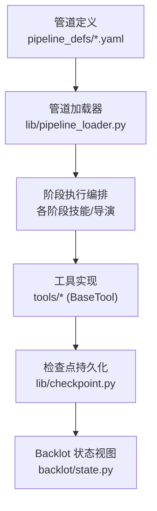
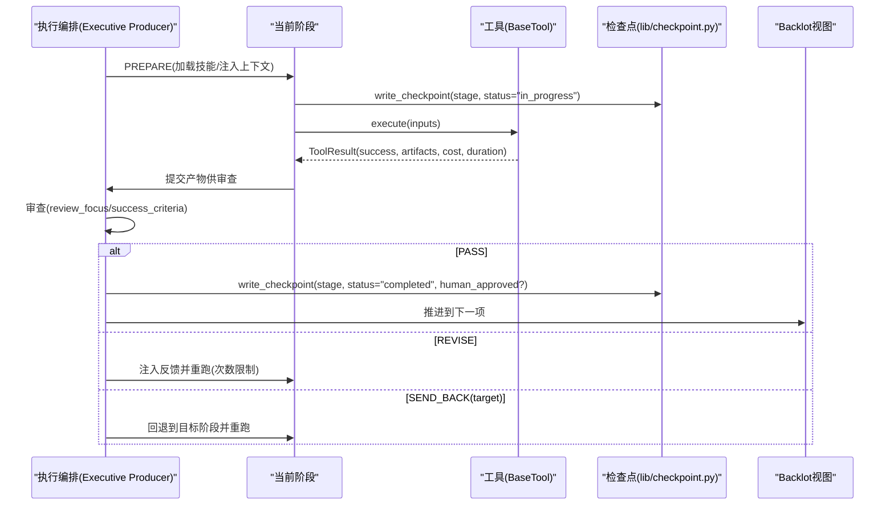
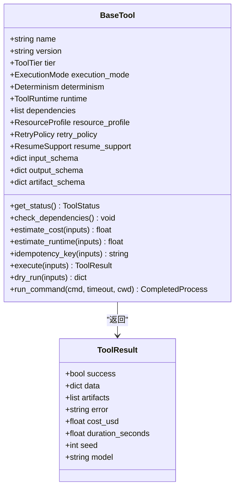
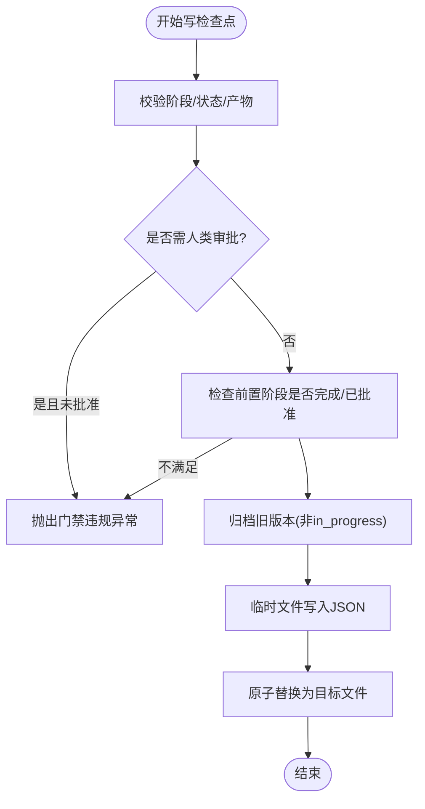
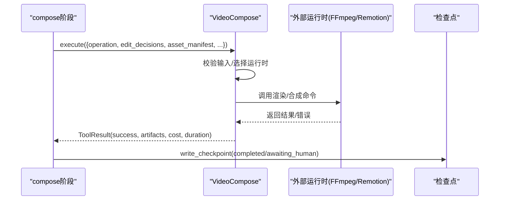
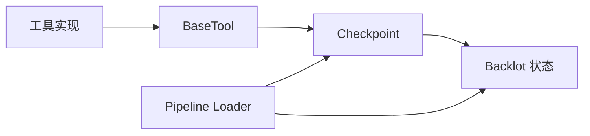

# 阶段开发指南

<cite>
**本文引用的文件**
- [tools/base_tool.py](file://tools/base_tool.py)
- [lib/checkpoint.py](file://lib/checkpoint.py)
- [lib/pipeline_loader.py](file://lib/pipeline_loader.py)
- [pipeline_defs/documentary-montage.yaml](file://pipeline_defs/documentary-montage.yaml)
- [tools/video/video_compose.py](file://tools/video/video_compose.py)
- [skills/meta/checkpoint-protocol.md](file://skills/meta/checkpoint-protocol.md)
- [backlot/state.py](file://backlot/state.py)
- [tests/contracts/test_backlot_contract.py](file://tests/contracts/test_backlot_contract.py)
- [tests/contracts/test_phase0_contracts.py](file://tests/contracts/test_phase0_contracts.py)
</cite>

## 目录
1. [简介](#简介)
2. [项目结构](#项目结构)
3. [核心组件](#核心组件)
4. [架构总览](#架构总览)
5. [详细组件分析](#详细组件分析)
6. [依赖关系分析](#依赖关系分析)
7. [性能考量](#性能考量)
8. [故障排查指南](#故障排查指南)
9. [结论](#结论)
10. [附录](#附录)

## 简介
本指南面向希望在 OpenMontage 中开发“阶段”的工程师与创作者。OpenMontage 将视频生产流程抽象为可编排的阶段（stage），每个阶段负责一个明确的职责，并通过检查点（checkpoint）持久化状态、支持恢复与人工门禁。本文将系统讲解：
- 阶段的概念、生命周期与执行流程
- 如何基于 BaseTool 开发自定义阶段工具
- 检查点机制的工作原理与最佳实践
- 错误分类、重试策略与用户反馈
- 从简单数据处理到复杂 AI 推理阶段的完整示例路径

## 项目结构
OpenMontage 采用“声明式管道 + 可插拔工具”的架构：
- 管道定义位于 pipeline_defs/*.yaml，声明阶段顺序、所需技能、工具集、审查焦点与成功标准
- 工具实现集中在 tools/*，所有工具继承 BaseTool，统一接口与元数据
- 检查点与项目状态由 lib/checkpoint.py 管理，提供写入、读取、校验、归档与门禁
- 管道加载器 lib/pipeline_loader.py 负责解析 YAML 并暴露阶段顺序、人类审批默认值等
- Backlot 界面通过 backlot/state.py 读取检查点与历史，呈现项目进度

**图表来源**
- [lib/pipeline_loader.py:39-70](file://lib/pipeline_loader.py#L39-L70)
- [lib/checkpoint.py:422-564](file://lib/checkpoint.py#L422-L564)
- [backlot/state.py:118-142](file://backlot/state.py#L118-L142)

**章节来源**
- [pipeline_defs/documentary-montage.yaml:45-179](file://pipeline_defs/documentary-montage.yaml#L45-L179)
- [lib/pipeline_loader.py:39-70](file://lib/pipeline_loader.py#L39-L70)
- [lib/checkpoint.py:422-564](file://lib/checkpoint.py#L422-L564)

## 核心组件
- BaseTool：所有工具的抽象基类，定义统一的身份、能力、资源、重试、成本估算、执行入口与命令运行封装
- Checkpoint：检查点读写、校验、归档、前置阶段门禁、人类审批门禁
- Pipeline Loader：加载并验证管道清单，提供阶段顺序、人类审批默认值、工具集合等查询
- VideoCompose：以 BaseTool 实现的复杂视频合成工具，展示输入输出契约、运行时路由与错误处理模式

**章节来源**
- [tools/base_tool.py:227-481](file://tools/base_tool.py#L227-L481)
- [lib/checkpoint.py:160-192](file://lib/checkpoint.py#L160-L192)
- [lib/pipeline_loader.py:125-182](file://lib/pipeline_loader.py#L125-L182)
- [tools/video/video_compose.py:58-200](file://tools/video/video_compose.py#L58-L200)

## 架构总览
阶段在管道中的职责与生命周期如下：
- 准备阶段：根据管道清单确定当前阶段、注入上下文（前序产物、预算、风格锚点）、加载对应技能/导演
- 执行阶段：调用具体工具或脚本完成工作，产出阶段产物（artifacts）
- 审查阶段：按清单定义的 review_focus 与 success_criteria 进行校验
- 门禁决策：PASS 进入下一阶段；REVISE 带反馈重跑（上限控制）；SEND_BACK 回退到上游阶段（防环）
- 检查点写入：在进入阶段时写入 in_progress 心跳，完成后写入 completed/awaiting_human，受前置阶段与人类审批门禁约束

**图表来源**
- [skills/meta/checkpoint-protocol.md:50-78](file://skills/meta/checkpoint-protocol.md#L50-L78)
- [lib/checkpoint.py:422-564](file://lib/checkpoint.py#L422-L564)
- [tools/base_tool.py:148-224](file://tools/base_tool.py#L148-L224)

## 详细组件分析

### BaseTool：阶段工具的统一基类
- 身份与能力：name、version、tier、capability、provider、stability、execution_mode、determinism、runtime、dependencies、capabilities、input_schema/output_schema/artifact_schema
- 资源与重试：resource_profile、retry_policy、resume_support、idempotency_key_fields
- 成本与运行时间估算：estimate_cost、estimate_runtime
- 执行入口：execute(inputs) -> ToolResult，被自动包装以记录 start/finish/error 事件
- 辅助方法：dry_run、run_command（跨平台子进程封装，UTF-8 解码与错误增强）

**图表来源**
- [tools/base_tool.py:110-139](file://tools/base_tool.py#L110-L139)
- [tools/base_tool.py:227-481](file://tools/base_tool.py#L227-L481)

**章节来源**
- [tools/base_tool.py:227-481](file://tools/base_tool.py#L227-L481)

### 检查点机制：保存、恢复与门禁
- 写入流程：write_checkpoint 会校验 stage/status/artifacts，强制前置阶段完成与人类审批门禁，归档旧版本，原子替换
- 读取与恢复：read_checkpoint/get_latest_checkpoint/get_next_stage 用于恢复与推进
- 项目初始化：init_project 创建标准目录结构与 project.json 标记
- 历史归档：_archive_superseded_checkpoint 保留非 in_progress 的历史版本，便于审计与回放
- 决策日志合并：decision_log 会被合并到项目级 decision_log.json，并在相关产物中引用

**图表来源**
- [lib/checkpoint.py:422-564](file://lib/checkpoint.py#L422-L564)
- [lib/checkpoint.py:349-386](file://lib/checkpoint.py#L349-L386)

**章节来源**
- [lib/checkpoint.py:198-248](file://lib/checkpoint.py#L198-L248)
- [lib/checkpoint.py:422-564](file://lib/checkpoint.py#L422-L564)
- [skills/meta/checkpoint-protocol.md:50-78](file://skills/meta/checkpoint-protocol.md#L50-L78)

### 管道加载器：阶段顺序与门禁配置
- 加载与缓存：load_pipeline_readonly 使用 lru_cache 避免重复解析与校验
- 阶段顺序：get_stage_order 提取主阶段与可选子阶段序列
- 人类审批默认值：get_stage_human_approval_default 决定某阶段是否必须 human_approved=True 才能 completed
- 扩展权限：check_extension_permitted 限制自定义脚本/样式/技能/工具的使用

**章节来源**
- [lib/pipeline_loader.py:39-70](file://lib/pipeline_loader.py#L39-L70)
- [lib/pipeline_loader.py:125-182](file://lib/pipeline_loader.py#L125-L182)
- [lib/pipeline_loader.py:201-241](file://lib/pipeline_loader.py#L201-L241)

### 示例工具：VideoCompose（复杂AI/媒体处理阶段）
- 角色：视频合成阶段的核心工具，支持多运行时（Remotion/HyperFrames/FFmpeg）路由
- 输入契约：operation、edit_decisions、asset_manifest、proposal_packet、subtitle_path、profile、options 等
- 输出契约：ToolResult 包含 success、artifacts、cost_usd、duration_seconds 等
- 错误处理：对不可用运行时进行结构化阻断，禁止静默切换，确保治理合规
- 资源与重试：声明依赖 cmd:ffmpeg，可通过 RetryPolicy 配置重试策略

**图表来源**
- [tools/video/video_compose.py:58-200](file://tools/video/video_compose.py#L58-L200)
- [tools/base_tool.py:148-224](file://tools/base_tool.py#L148-L224)
- [lib/checkpoint.py:422-564](file://lib/checkpoint.py#L422-L564)

**章节来源**
- [tools/video/video_compose.py:1-200](file://tools/video/video_compose.py#L1-L200)

## 依赖关系分析
- BaseTool 是所有工具的统一入口，提供执行包装、依赖检查、命令封装
- Checkpoint 依赖管道清单（通过 pipeline_type）进行门禁与阶段顺序校验
- Pipeline Loader 提供清单解析与查询，被 Checkpoint 与编排层使用
- Backlot 视图依赖检查点与历史目录，展示项目进度与变更轨迹

**图表来源**
- [tools/base_tool.py:227-481](file://tools/base_tool.py#L227-L481)
- [lib/checkpoint.py:422-564](file://lib/checkpoint.py#L422-L564)
- [lib/pipeline_loader.py:39-70](file://lib/pipeline_loader.py#L39-L70)
- [backlot/state.py:118-142](file://backlot/state.py#L118-L142)

**章节来源**
- [tools/base_tool.py:227-481](file://tools/base_tool.py#L227-L481)
- [lib/checkpoint.py:422-564](file://lib/checkpoint.py#L422-L564)
- [lib/pipeline_loader.py:39-70](file://lib/pipeline_loader.py#L39-L70)
- [backlot/state.py:118-142](file://backlot/state.py#L118-L142)

## 性能考量
- 检查点写入采用临时文件+原子替换，避免部分写入导致的状态损坏
- 管道清单加载使用 lru_cache，减少高频解析开销
- 工具执行通过装饰器包装，记录耗时与成本，便于分析与优化
- 建议：
  - 合理设置 resource_profile，避免过度分配
  - 使用 idempotency_key_fields 启用幂等缓存，减少重复计算
  - 对长耗时操作设置 estimate_runtime，提升编排体验
  - 谨慎使用重试策略，结合 RetryPolicy 的 backoff 与可重试错误列表

[本节为通用指导，无需特定文件来源]

## 故障排查指南
- 常见错误类型
  - 依赖缺失：DependencyError（环境变量/命令/模块未安装）
  - 命令失败：ToolCommandError（子进程返回码与stderr/stdout增强）
  - 检查点校验失败：CheckpointValidationError（阶段/状态/产物不符合规范）
  - 门禁违规：人类审批未通过或前置阶段未完成
- 调试建议
  - 查看 Backlot 的事件流（start/finish/error）定位问题阶段
  - 检查 history/ 下的归档检查点，确认状态变迁
  - 使用 dry_run 预检成本与可用性
  - 针对网络/外部API错误，参考重试策略文档进行分类与指数退避

**章节来源**
- [tools/base_tool.py:456-481](file://tools/base_tool.py#L456-L481)
- [lib/checkpoint.py:160-192](file://lib/checkpoint.py#L160-L192)
- [tests/contracts/test_backlot_contract.py:218-244](file://tests/contracts/test_backlot_contract.py#L218-L244)
- [tests/contracts/test_phase0_contracts.py:288-325](file://tests/contracts/test_phase0_contracts.py#L288-L325)

## 结论
OpenMontage 的阶段体系通过 BaseTool 统一工具接口、通过 Checkpoint 保障状态一致性与可恢复性、通过 Pipeline Loader 声明式编排阶段顺序与门禁。遵循本指南，你可以：
- 清晰定义阶段职责与输入输出契约
- 正确设置检查点与人类审批门禁
- 实施稳健的错误分类与重试策略
- 构建从简单数据处理到复杂AI推理的可靠阶段

[本节为总结，无需特定文件来源]

## 附录

### 开发自定义阶段的步骤清单
- 继承 BaseTool，声明 name/version/tier/capability/runtime/dependencies/input_schema/output_schema/artifact_schema
- 实现 execute(inputs) -> ToolResult，返回 success、artifacts、cost_usd、duration_seconds
- 在阶段开始时写入 in_progress 检查点，完成后写入 completed/awaiting_human
- 若阶段需要人类审批，遵守 human_approval_default 与 human_approved 协议
- 使用 run_command 安全调用外部命令，捕获并增强错误信息
- 在管道清单中声明该阶段所需的工具与审查焦点，确保治理合规

**章节来源**
- [tools/base_tool.py:227-481](file://tools/base_tool.py#L227-L481)
- [skills/meta/checkpoint-protocol.md:50-78](file://skills/meta/checkpoint-protocol.md#L50-L78)
- [pipeline_defs/documentary-montage.yaml:45-179](file://pipeline_defs/documentary-montage.yaml#L45-L179)

### 错误分类与重试策略（参考）
- 可重试错误：网络超时、服务端5xx、限流429
- 不可重试错误：参数错误4xx、内容策略违规、无效输入
- 指数退避：等待时间 = base * 2^attempt + jitter
- 最大重试次数：根据工具稳定性与成本设定

**章节来源**
- [.agents/skills/bfl-api/references/error-handling.md:148-197](file://.agents/skills/bfl-api/references/error-handling.md#L148-L197)