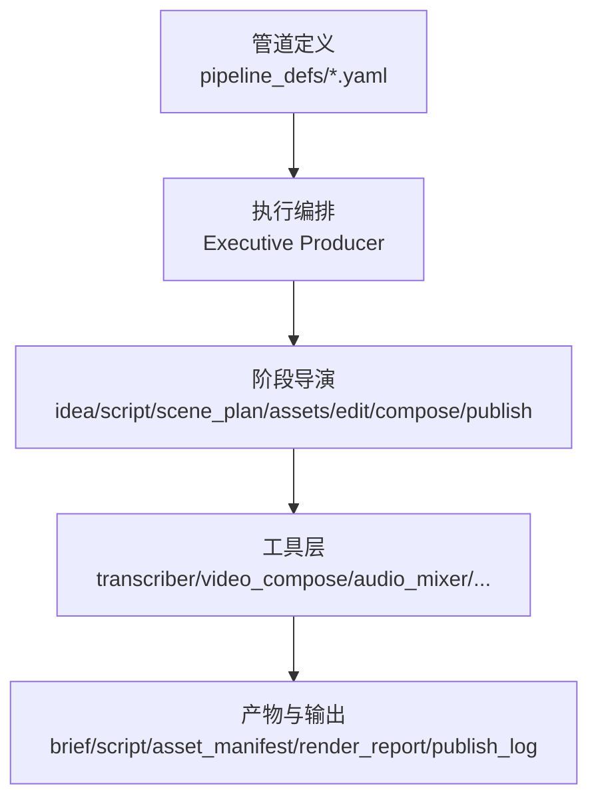
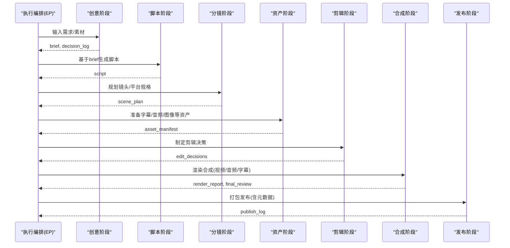
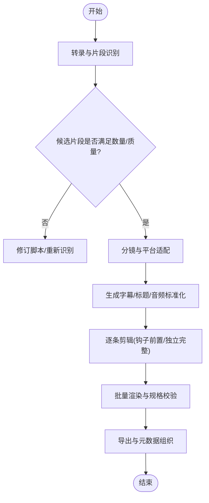
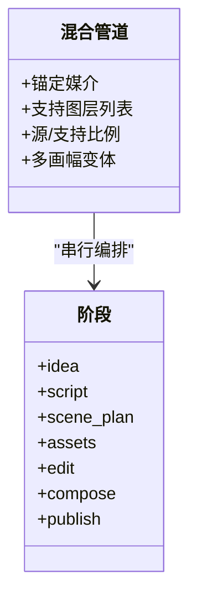
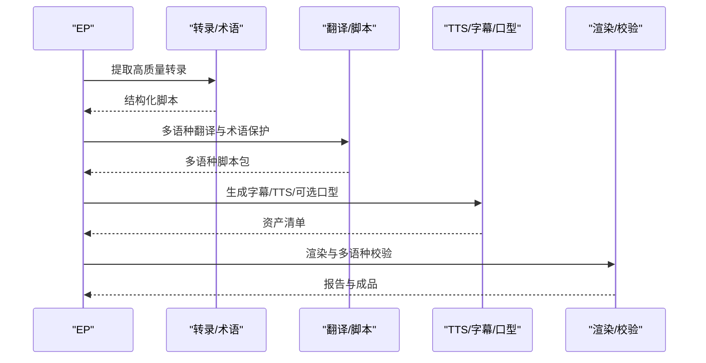
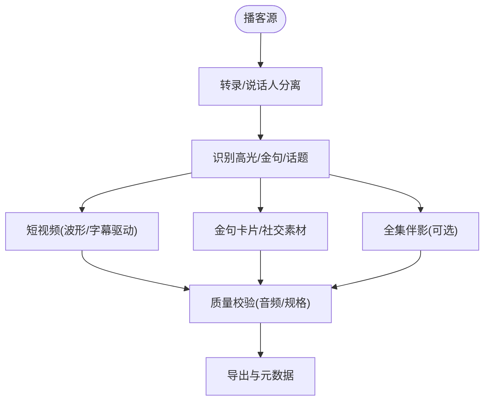
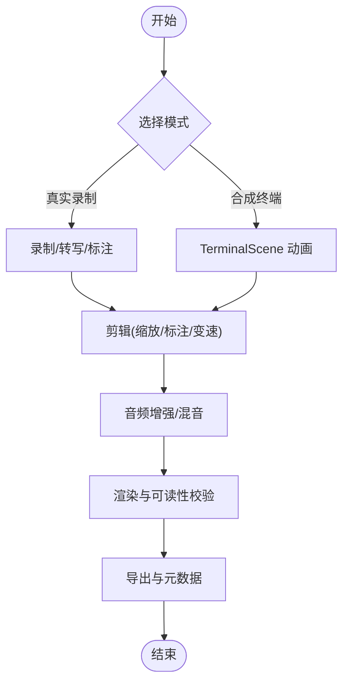
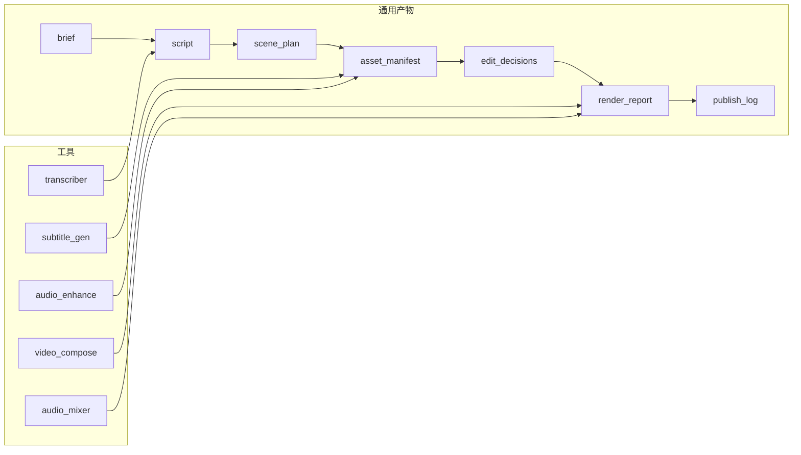

# 其他预定义管道

<cite>
**本文引用的文件**
- [clip-factory.yaml](file://pipeline_defs/clip-factory.yaml)
- [hybrid.yaml](file://pipeline_defs/hybrid.yaml)
- [localization-dub.yaml](file://pipeline_defs/localization-dub.yaml)
- [podcast-repurpose.yaml](file://pipeline_defs/podcast-repurpose.yaml)
- [screen-demo.yaml](file://pipeline_defs/screen-demo.yaml)
- [executive-producer.md（素材工厂）](file://skills/pipelines/clip-factory/executive-producer.md)
- [executive-producer.md（混合模式）](file://skills/pipelines/hybrid/executive-producer.md)
- [executive-producer.md（本地化配音）](file://skills/pipelines/localization-dub/executive-producer.md)
- [executive-producer.md（播客重制）](file://skills/pipelines/podcast-repurpose/executive-producer.md)
- [executive-producer.md（屏幕演示）](file://skills/pipelines/screen-demo/executive-producer.md)
</cite>

## 目录
1. [简介](#简介)
2. [项目结构](#项目结构)
3. [核心组件](#核心组件)
4. [架构总览](#架构总览)
5. [详细组件分析](#详细组件分析)
6. [依赖关系分析](#依赖关系分析)
7. [性能与成本考量](#性能与成本考量)
8. [故障排查指南](#故障排查指南)
9. [结论](#结论)
10. [附录：快速上手与配置模板](#附录快速上手与配置模板)

## 简介
本章节面向需要批量内容生产、多语言本地化、现有内容再利用以及屏幕录制类演示视频的团队，系统梳理 OpenMontage 的五个“其他预定义管道”：素材工厂（clip-factory）、混合模式（hybrid）、本地化配音（localization-dub）、播客重制（podcast-repurpose）、屏幕演示（screen-demo）。文档从适用场景、核心能力、阶段质量门、关键工具链与配置要点出发，给出对比分析与快速上手建议，帮助用户按业务需求选择合适管道并高效落地。

## 项目结构
OpenMontage 将“管道定义”与“导演技能”解耦：
- 管道定义位于 pipeline_defs/*.yaml，描述阶段、产物、可用工具、质量门与编排策略。
- 导演技能位于 skills/pipelines/<pipeline>/executive-producer.md 等，提供执行协议、跨阶段检查、预算与时限控制、常见陷阱与回退策略。

图表来源
- [clip-factory.yaml:1-207](file://pipeline_defs/clip-factory.yaml#L1-L207)
- [hybrid.yaml:1-228](file://pipeline_defs/hybrid.yaml#L1-L228)
- [localization-dub.yaml:1-208](file://pipeline_defs/localization-dub.yaml#L1-L208)
- [podcast-repurpose.yaml:1-213](file://pipeline_defs/podcast-repurpose.yaml#L1-L213)
- [screen-demo.yaml:1-247](file://pipeline_defs/screen-demo.yaml#L1-L247)

章节来源
- [clip-factory.yaml:1-207](file://pipeline_defs/clip-factory.yaml#L1-L207)
- [hybrid.yaml:1-228](file://pipeline_defs/hybrid.yaml#L1-L228)
- [localization-dub.yaml:1-208](file://pipeline_defs/localization-dub.yaml#L1-L208)
- [podcast-repurpose.yaml:1-213](file://pipeline_defs/podcast-repurpose.yaml#L1-L213)
- [screen-demo.yaml:1-247](file://pipeline_defs/screen-demo.yaml#L1-L247)

## 核心组件
- 统一编排模型：所有管道采用 Executive Producer（EP）串行编排，贯穿 idea→script→scene_plan→assets→edit→compose→publish 七个阶段，每个阶段产出标准产物并通过质量门。
- 质量门与治理：每阶段设置 review_focus 与 success_criteria；EP 在阶段间进行跨阶段检查（如钩子位置、源/支持层平衡、翻译准确性、字幕可读性等），必要时退回修订或回滚到上游阶段。
- 工具与风格：各管道声明 required_tools/optional_tools 与 compatible_playbooks，确保渲染一致性与可复用性。

章节来源
- [executive-producer.md（素材工厂）:1-137](file://skills/pipelines/clip-factory/executive-producer.md#L1-L137)
- [executive-producer.md（混合模式）:1-130](file://skills/pipelines/hybrid/executive-producer.md#L1-L130)
- [executive-producer.md（本地化配音）:1-134](file://skills/pipelines/localization-dub/executive-producer.md#L1-L134)
- [executive-producer.md（播客重制）:1-136](file://skills/pipelines/podcast-repurpose/executive-producer.md#L1-L136)
- [executive-producer.md（屏幕演示）:1-278](file://skills/pipelines/screen-demo/executive-producer.md#L1-L278)

## 架构总览
下图展示通用七阶段流水线在各管道中的共性流程与差异点。

图表来源
- [clip-factory.yaml:45-207](file://pipeline_defs/clip-factory.yaml#L45-L207)
- [hybrid.yaml:46-228](file://pipeline_defs/hybrid.yaml#L46-L228)
- [localization-dub.yaml:44-208](file://pipeline_defs/localization-dub.yaml#L44-L208)
- [podcast-repurpose.yaml:46-213](file://pipeline_defs/podcast-repurpose.yaml#L46-L213)
- [screen-demo.yaml:77-247](file://pipeline_defs/screen-demo.yaml#L77-L247)

## 详细组件分析

### 素材工厂（clip-factory）
- 适用场景：将长视频（网络研讨会、直播、演讲、访谈）批量拆解为多条独立短视频，适配多平台分发。
- 核心功能：
  - 转录与片段识别：通过 transcriber 定位高价值片段并排序。
  - 分镜与平台适配：为不同平台规划画幅与时长。
  - 批量一致性：字幕偏移、品牌元素、音频标准化保持一致。
  - 钩子前置：每条短视频前2-3秒放置强钩子。
- 关键质量门：
  - 片段独立性、钩子位置、批次多样性、平台规格校验、渲染验证。
- 配置要点：
  - 明确目标平台与片段数量；合理估算“每5-10分钟源内容产出1条”。
  - 使用 recommended playbooks（clean-professional、flat-motion-graphics）保证风格统一。
  - 关注预算门限与最大墙时限制。

图表来源
- [clip-factory.yaml:45-207](file://pipeline_defs/clip-factory.yaml#L45-L207)
- [executive-producer.md（素材工厂）:46-118](file://skills/pipelines/clip-factory/executive-producer.md#L46-L118)

章节来源
- [clip-factory.yaml:1-207](file://pipeline_defs/clip-factory.yaml#L1-L207)
- [executive-producer.md（素材工厂）:1-137](file://skills/pipelines/clip-factory/executive-producer.md#L1-L137)

### 混合模式（hybrid）
- 适用场景：真实拍摄素材与设计/生成辅助图层结合（采访+图示、产品实拍+覆盖图形、录屏+配套图形、蒙太奇+插入素材）。
- 核心功能：
  - 源/支持层分离：脚本阶段明确“源主导”和“支持主导”节拍。
  - 画面密度控制：叠加层不超过并发上限，避免视觉过载。
  - 多画幅变体：确保横竖屏可读性。
  - 渲染一致性：推荐 remotion 作为合成运行时，保障源与覆盖层一次合成。
- 关键质量门：
  - 源优先、叠加密度、变体可读性、最终渲染平衡与音频连贯。
- 配置要点：
  - 明确锚定媒介与支持的必要性；避免“装饰性”过度。
  - 使用 recommended/also_works playbooks（clean-professional、flat-motion-graphics、minimalist-diagram）。
  - 注意 render_runtime 与 proposal_packet 的一致性，防止静默替换。

图表来源
- [hybrid.yaml:1-228](file://pipeline_defs/hybrid.yaml#L1-L228)
- [executive-producer.md（混合模式）:1-130](file://skills/pipelines/hybrid/executive-producer.md#L1-L130)

章节来源
- [hybrid.yaml:1-228](file://pipeline_defs/hybrid.yaml#L1-L228)
- [executive-producer.md（混合模式）:1-130](file://skills/pipelines/hybrid/executive-producer.md#L1-L130)

### 本地化配音（localization-dub）
- 适用场景：对已有视频进行多语言本地化，产出字幕版、配音版，可选口型同步版本。
- 核心功能：
  - 转录与术语保护：保留专有名词与术语表。
  - 多语种脚本包：翻译后脚本可审校再合成。
  - 多模式交付：字幕仅配音/带口型同步（受限场景）。
  - 时序保持：控制语言扩展带来的时长漂移。
- 关键质量门：
  - 翻译准确性、时序保持、口型同步可行性、每语种一致性。
- 配置要点：
  - 明确源语言与目标语言、每语种的交付模式。
  - 记录术语表与受保护词；评估语言扩展导致的时长变化。
  - 谨慎启用口型同步，仅限正面清晰口型镜头。

图表来源
- [localization-dub.yaml:1-208](file://pipeline_defs/localization-dub.yaml#L1-L208)
- [executive-producer.md（本地化配音）:1-134](file://skills/pipelines/localization-dub/executive-producer.md#L1-L134)

章节来源
- [localization-dub.yaml:1-208](file://pipeline_defs/localization-dub.yaml#L1-L208)
- [executive-producer.md（本地化配音）:1-134](file://skills/pipelines/localization-dub/executive-producer.md#L1-L134)

### 播客重制（podcast-repurpose）
- 适用场景：将播客音频（或视频播客）重制为可视化内容：波形图/字幕驱动的短视频、金句卡片、可选全集伴影视频。
- 核心功能：
  - 全节目转录与说话人分离，标注高光段落与话题过渡。
  - 多类型产出：audiogram clips、quote-led clips、companion video。
  - 音频保真：不降级原始播客音质。
  - 轻量伴影：避免过度制作，强调波形/字幕/主题图形。
- 关键质量门：
  - 片段独立性、开场钩子、多产出一致性、音频质量保持。
- 配置要点：
  - 明确输出类型与平台目标；根据源长度设定合理片段数。
  - 全集伴影保持轻触式视觉处理；章节标记对齐话题转换。

图表来源
- [podcast-repurpose.yaml:1-213](file://pipeline_defs/podcast-repurpose.yaml#L1-L213)
- [executive-producer.md（播客重制）:1-136](file://skills/pipelines/podcast-repurpose/executive-producer.md#L1-L136)

章节来源
- [podcast-repurpose.yaml:1-213](file://pipeline_defs/podcast-repurpose.yaml#L1-L213)
- [executive-producer.md（播客重制）:1-136](file://skills/pipelines/podcast-repurpose/executive-producer.md#L1-L136)

### 屏幕演示（screen-demo）
- 适用场景：应用/浏览器/代码教程等屏幕录制演示；支持两种模式：
  - 真实录制：捕获桌面/浏览器会话，添加标注、缩放裁剪、字幕与降噪。
  - 合成终端（Remotion TerminalScene）：CLI/安装流程等可脚本化演示，像素级可控、隐私安全、迭代快。
- 核心功能：
  - 模式选择：idea 阶段根据演示表面选择 real_capture 或 synthetic_terminal。
  - 可读性优先：缩放裁剪区域需保证 UI 文字可读；标注不遮挡关键元素。
  - 节奏优化：剪掉加载/打字停顿，平滑变速。
  - 音频清理：降低键盘噪声与背景嗡鸣。
- 关键质量门：
  - 文本可读性、缩放合理性、标注密度、死时间处理、音频清晰度。
- 配置要点：
  - 明确目标分辨率与平台；合成模式优先用于可预测的 CLI/安装流程。
  - 严格校验 render_runtime 与 proposal_packet 一致性。

图表来源
- [screen-demo.yaml:1-247](file://pipeline_defs/screen-demo.yaml#L1-L247)
- [executive-producer.md（屏幕演示）:1-278](file://skills/pipelines/screen-demo/executive-producer.md#L1-L278)

章节来源
- [screen-demo.yaml:1-247](file://pipeline_defs/screen-demo.yaml#L1-L247)
- [executive-producer.md（屏幕演示）:1-278](file://skills/pipelines/screen-demo/executive-producer.md#L1-L278)

## 依赖关系分析
- 共同依赖：
  - 阶段产物：brief、script、scene_plan、asset_manifest、edit_decisions、render_report、publish_log。
  - 常用工具：transcriber、video_compose、audio_mixer、subtitle_gen、audio_enhance、image_selector/diagram_gen/music_gen（视管道而定）。
- 管道差异化依赖：
  - clip-factory：强调批量一致性、平台规格与钩子前置。
  - hybrid：强调源/支持层平衡与多画幅变体。
  - localization-dub：强调术语表、多语种脚本包、时序保持与可选口型同步。
  - podcast-repurpose：强调音频保真、多产出一致性与章节标记。
  - screen-demo：强调可读性、缩放裁剪、标注密度与死时间处理。

图表来源
- [clip-factory.yaml:45-207](file://pipeline_defs/clip-factory.yaml#L45-L207)
- [hybrid.yaml:46-228](file://pipeline_defs/hybrid.yaml#L46-L228)
- [localization-dub.yaml:44-208](file://pipeline_defs/localization-dub.yaml#L44-L208)
- [podcast-repurpose.yaml:46-213](file://pipeline_defs/podcast-repurpose.yaml#L46-L213)
- [screen-demo.yaml:77-247](file://pipeline_defs/screen-demo.yaml#L77-L247)

章节来源
- [clip-factory.yaml:45-207](file://pipeline_defs/clip-factory.yaml#L45-L207)
- [hybrid.yaml:46-228](file://pipeline_defs/hybrid.yaml#L46-L228)
- [localization-dub.yaml:44-208](file://pipeline_defs/localization-dub.yaml#L44-L208)
- [podcast-repurpose.yaml:46-213](file://pipeline_defs/podcast-repurpose.yaml#L46-L213)
- [screen-demo.yaml:77-247](file://pipeline_defs/screen-demo.yaml#L77-L247)

## 性能与成本考量
- 预算与时限：各管道默认预算与最大墙时不同，本地化配音因多语种成本更高；屏幕演示通常更轻量。
- 渲染路径：混合模式与屏幕演示推荐使用 remotion 作为合成运行时，减少多次重编；屏幕演示的合成终端模式具备可重复渲染优势。
- 资源利用：
  - 转录与音频增强在前期投入可显著降低后期返工。
  - 批量管线（素材工厂、播客重制）应重视批次一致性与标准化，降低边际成本。
- 风险点：
  - 语言扩展导致时长漂移（本地化配音）。
  - 叠加层过多导致视觉过载（混合模式）。
  - 缩放裁剪导致像素化（屏幕演示）。

[本节为通用指导，无需特定文件引用]

## 故障排查指南
- 素材工厂常见问题：
  - 片段上下文依赖：确保每条短视频自包含。
  - 钩子过慢：前2-3秒必须放置强钩子。
  - 音频不一致：批量标准化音量。
- 混合模式常见问题：
  - 支持层喧宾夺主：控制叠加层数量与密度。
  - 多画幅不可读：提前验证横竖屏可读性。
- 本地化配音常见问题：
  - 术语未保护：在脚本阶段维护术语表。
  - 口型同步滥用：仅在合适镜头启用。
  - 语言扩展导致超时：调整时序或分段。
- 播客重制常见问题：
  - 音频降级：保持原音质。
  - 伴影过度：保持轻触式视觉。
- 屏幕演示常见问题：
  - 文本不可读：校验缩放裁剪区域与输出分辨率。
  - 死时间过长：剪除或加速。
  - 标注遮挡：控制并发标注数量。

章节来源
- [executive-producer.md（素材工厂）:120-137](file://skills/pipelines/clip-factory/executive-producer.md#L120-L137)
- [executive-producer.md（混合模式）:114-130](file://skills/pipelines/hybrid/executive-producer.md#L114-L130)
- [executive-producer.md（本地化配音）:117-134](file://skills/pipelines/localization-dub/executive-producer.md#L117-L134)
- [executive-producer.md（播客重制）:120-136](file://skills/pipelines/podcast-repurpose/executive-producer.md#L120-L136)
- [executive-producer.md（屏幕演示）:261-278](file://skills/pipelines/screen-demo/executive-producer.md#L261-L278)

## 结论
- 若目标是“从长内容批量产出短视频”，首选素材工厂。
- 若目标是“真实素材与设计/生成图层融合”，选择混合模式。
- 若目标是“多语言本地化与配音”，选择本地化配音。
- 若目标是“播客音频的多形态再利用”，选择播客重制。
- 若目标是“屏幕录制演示或可复现的终端演示”，选择屏幕演示。

[本节为总结性内容，无需特定文件引用]

## 附录：快速上手与配置模板
以下为各管道的“最小可行配置”要点，便于快速启动与迭代。

- 素材工厂（clip-factory）
  - 输入：长视频源（webinar/stream/interview 等）。
  - 关键参数：目标平台、期望片段数、播放时长上限。
  - 工具：transcriber、subtitle_gen、video_compose、audio_mixer。
  - 质量门：片段独立性、钩子位置、批次一致性、平台规格。
  - 参考：[clip-factory.yaml:45-207](file://pipeline_defs/clip-factory.yaml#L45-L207)

- 混合模式（hybrid）
  - 输入：源素材（采访/产品/录屏等）+ 设计/生成支持层。
  - 关键参数：锚定媒介、支持层类型、源/支持比例、多画幅变体。
  - 工具：transcriber、image_selector/diagram_gen/music_gen、video_compose、audio_mixer。
  - 质量门：源优先、叠加密度、变体可读性、渲染一致性。
  - 参考：[hybrid.yaml:46-228](file://pipeline_defs/hybrid.yaml#L46-L228)

- 本地化配音（localization-dub）
  - 输入：源视频（单语）。
  - 关键参数：源语言、目标语言列表、每语种交付模式（字幕/配音/口型同步）、术语表。
  - 工具：transcriber、tts_selector、subtitle_gen、lip_sync（可选）、audio_mixer。
  - 质量门：翻译准确性、时序保持、口型同步可行性、多语种一致性。
  - 参考：[localization-dub.yaml:44-208](file://pipeline_defs/localization-dub.yaml#L44-L208)

- 播客重制（podcast-repurpose）
  - 输入：播客音频或视频播客。
  - 关键参数：输出类型（audiogram clips/quote clips/companion video）、平台目标、章节标记。
  - 工具：transcriber、subtitle_gen、image_selector/diagram_gen/music_gen（可选）、video_compose、audio_mixer。
  - 质量门：音频保真、片段独立性、多产出一致性。
  - 参考：[podcast-repurpose.yaml:46-213](file://pipeline_defs/podcast-repurpose.yaml#L46-L213)

- 屏幕演示（screen-demo）
  - 输入：屏幕录制或可脚本化的终端流程。
  - 关键参数：模式选择（real_capture/synthetic_terminal）、目标分辨率、标注策略、变速策略。
  - 工具：transcriber、subtitle_gen、audio_enhance、video_compose、audio_mixer。
  - 质量门：文本可读性、缩放合理性、标注密度、死时间处理、音频清晰度。
  - 参考：[screen-demo.yaml:22-42](file://pipeline_defs/screen-demo.yaml#L22-L42), [screen-demo.yaml:77-247](file://pipeline_defs/screen-demo.yaml#L77-L247)

章节来源
- [clip-factory.yaml:45-207](file://pipeline_defs/clip-factory.yaml#L45-L207)
- [hybrid.yaml:46-228](file://pipeline_defs/hybrid.yaml#L46-L228)
- [localization-dub.yaml:44-208](file://pipeline_defs/localization-dub.yaml#L44-L208)
- [podcast-repurpose.yaml:46-213](file://pipeline_defs/podcast-repurpose.yaml#L46-L213)
- [screen-demo.yaml:22-42](file://pipeline_defs/screen-demo.yaml#L22-L42)
- [screen-demo.yaml:77-247](file://pipeline_defs/screen-demo.yaml#L77-L247)