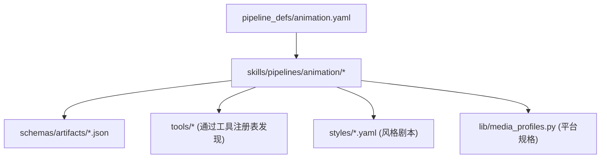
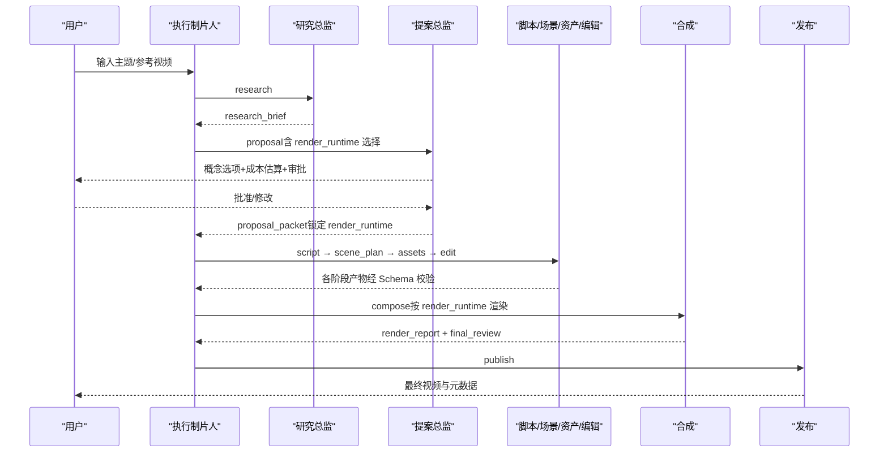
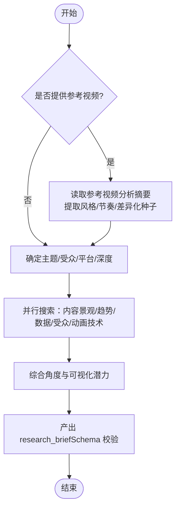
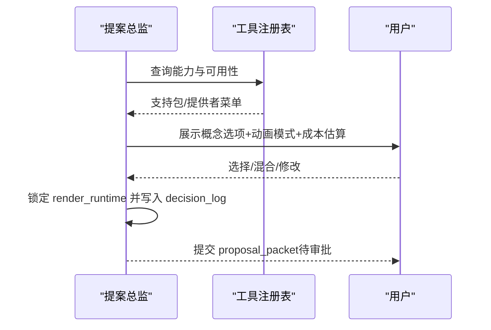
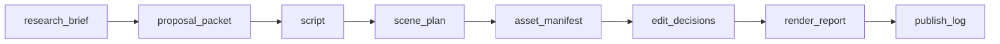

# 动画解释器管道

<cite>
**本文引用的文件**
- [animation.yaml](file://pipeline_defs/animation.yaml)
- [animated-explainer.yaml](file://pipeline_defs/animated-explainer.yaml)
- [ARCHITECTURE.md](file://docs/ARCHITECTURE.md)
- [README.md](file://README.md)
- [research-director.md](file://skills/pipelines/animation/research-director.md)
- [proposal-director.md](file://skills/pipelines/animation/proposal-director.md)
- [edit-director.md](file://skills/pipelines/animation/edit-director.md)
- [executive-producer.md](file://skills/pipelines/animation/executive-producer.md)
- [animation-runtime-selector.md](file://skills/meta/animation-runtime-selector.md)
- [research_brief.schema.json](file://schemas/artifacts/research_brief.schema.json)
- [proposal_packet.schema.json](file://schemas/artifacts/proposal_packet.schema.json)
- [flat-motion-graphics.yaml](file://styles/flat-motion-graphics.yaml)
- [media_profiles.py](file://lib/media_profiles.py)
</cite>

## 目录
1. [简介](#简介)
2. [项目结构](#项目结构)
3. [核心组件](#核心组件)
4. [架构总览](#架构总览)
5. [详细组件分析](#详细组件分析)
6. [依赖关系分析](#依赖关系分析)
7. [性能与成本考量](#性能与成本考量)
8. [故障排查指南](#故障排查指南)
9. [结论](#结论)
10. [附录：配置与使用指南](#附录配置与使用指南)

## 简介
本文件面向“动画解释器管道”（animation）的使用与实现说明。该管道以“研究优先”的预制作阶段为核心，在生成任何素材前完成主题调研、动画技术选型、概念提案、成本估算与用户审批；随后进入脚本、场景规划、素材生成、编辑决策、视频合成与发布的完整流程。它特别适用于运动图形、图表驱动的解释视频、动态排版、数学可视化以及 Three.js 世界等动画模式。

与通用“动画解说”（animated-explainer）相比，animation 管道更强调动画技术与视觉系统的选择、复用策略与可维护性，适合对动效语言、风格一致性与生产计划有更高要求的场景。

**章节来源**
- [animation.yaml:1-12](file://pipeline_defs/animation.yaml#L1-L12)
- [animated-explainer.yaml:1-12](file://pipeline_defs/animated-explainer.yaml#L1-L12)
- [README.md:356-383](file://README.md#L356-L383)

## 项目结构
OpenMontage 采用“清单 + 技能 + 工具”的分层组织方式：
- pipeline_defs：定义管道的阶段、产物、工具与评审标准
- skills：导演技能（Markdown），指导 AI 在每个阶段如何工作
- schemas：各阶段产物的 JSON Schema 校验契约
- styles：风格剧本（Playbook），统一视觉语言
- lib：运行时基础设施（媒体规格、配置加载等）
- tools：注册的工具集合（图像、视频、音频、合成等）

**图示来源**
- [animation.yaml:62-300](file://pipeline_defs/animation.yaml#L62-L300)
- [ARCHITECTURE.md:170-240](file://docs/ARCHITECTURE.md#L170-L240)

**章节来源**
- [ARCHITECTURE.md:31-76](file://docs/ARCHITECTURE.md#L31-L76)
- [ARCHITECTURE.md:170-240](file://docs/ARCHITECTURE.md#L170-L240)

## 核心组件
- 执行制片人（Executive Producer）：串联 8 个阶段，维护累计状态、预算与质量门控
- 研究总监（Research Director）：主题与动画技术双重调研，产出结构化研究简报
- 提案总监（Proposal Director）：基于研究提出多套概念、动画模式与成本估算，设置审批门禁
- 脚本/场景/资产/编辑/合成/发布：将创意方案落地为可渲染的视频成品

关键特点：
- 研究优先：零成本先做研究与技术扫描，再决定是否花钱
- 动画模式选择：明确区分 image_animation、clip_video、manim、remotion_dataviz、diagram_stills、mixed
- 成本透明：逐项估算、预算上限、单动作审批阈值
- 运行时代码锁定：render_runtime 在提案阶段锁定，禁止静默替换

**章节来源**
- [executive-producer.md:32-114](file://skills/pipelines/animation/executive-producer.md#L32-L114)
- [research-director.md:1-10](file://skills/pipelines/animation/research-director.md#L1-L10)
- [proposal-director.md:1-14](file://skills/pipelines/animation/proposal-director.md#L1-L14)
- [animation.yaml:62-300](file://pipeline_defs/animation.yaml#L62-L300)

## 架构总览
动画解释器管道遵循统一的 8 阶段流水线，并在每个阶段通过 Schema 校验、自我审查与人类审批进行质量治理。

**图示来源**
- [animation.yaml:62-300](file://pipeline_defs/animation.yaml#L62-L300)
- [ARCHITECTURE.md:170-240](file://docs/ARCHITECTURE.md#L170-L240)

## 详细组件分析

### 研究阶段（research）
目标：同时调研“要讲什么”和“怎么动画化”，形成可被后续阶段复用的结构化研究简报。

关键要点：
- 若存在参考视频，需对比其动画风格与技术，寻找差异化机会
- 内容景观扫描、趋势脉搏、数据证据、受众挖掘、动画技术调研、数学/技术准确性检查
- 输出 research_brief，至少包含 3 个角度与 5 个以上引用来源

**图示来源**
- [research-director.md:21-53](file://skills/pipelines/animation/research-director.md#L21-L53)
- [research-director.md:67-200](file://skills/pipelines/animation/research-director.md#L67-L200)
- [research_brief.schema.json:1-246](file://schemas/artifacts/research_brief.schema.json#L1-L246)

**章节来源**
- [research-director.md:55-200](file://skills/pipelines/animation/research-director.md#L55-L200)
- [research_brief.schema.json:1-246](file://schemas/artifacts/research_brief.schema.json#L1-L246)

### 提案阶段（proposal）
目标：基于研究提出多个差异化的概念，明确动画模式、复用策略、成本估算与运行时代码（Remotion/HyperFrames/FFmpeg），并等待用户批准。

关键要点：
- 必须呈现两种运行时代码（如均可用），记录决策日志
- 动画模式选择矩阵：image_animation / clip_video / manim / remotion_dataviz / diagram_stills / mixed
- 成本估算逐项列出，标注免费/本地替代项
- 审批门禁：未获批准不得继续

**图示来源**
- [proposal-director.md:11-38](file://skills/pipelines/animation/proposal-director.md#L11-L38)
- [proposal-director.md:95-120](file://skills/pipelines/animation/proposal-director.md#L95-L120)
- [proposal-director.md:340-431](file://skills/pipelines/animation/proposal-director.md#L340-L431)
- [animation-runtime-selector.md:26-72](file://skills/meta/animation-runtime-selector.md#L26-L72)

**章节来源**
- [proposal-director.md:55-120](file://skills/pipelines/animation/proposal-director.md#L55-L120)
- [proposal_director.md:340-431](file://skills/pipelines/animation/proposal-director.md#L340-L431)
- [proposal_packet.schema.json:1-379](file://schemas/artifacts/proposal_packet.schema.json#L1-L379)
- [animation-runtime-selector.md:26-72](file://skills/meta/animation-runtime-selector.md#L26-L72)

### 脚本编写（script）
目标：将选定概念转化为“动画节拍”驱动的脚本，确保每段对应一个清晰的视觉想法，时长与目标匹配。

重点：
- 文本克制、留白给视觉停顿
- 旁白类脚本加入配音表现提示
- 字数与时长偏差控制在 ±10%

**章节来源**
- [animation.yaml:123-148](file://pipeline_defs/animation.yaml#L123-L148)

### 场景规划（scene_plan）
目标：把脚本映射到具体场景系统，规定每场景的动画模式、转场逻辑与工具路径，保证可执行与可复用。

重点：
- 遵循提案中的复用策略（母题、布局、过渡家族、字体层级）
- 每场景具备可行的工具路径

**章节来源**
- [animation.yaml:149-168](file://pipeline_defs/animation.yaml#L149-L168)

### 素材生成（assets）
目标：根据场景计划与脚本，生成或选取所需素材，包括语音、图像、视频、数学动画、图表、代码片段、3D 世界与音乐等。

重点：
- 优先使用选择器工具（tts_selector、image_selector、video_selector）
- 最大化片段时长以减少 API 调用与成本
- 真实 3D 世界需在合成前进行语义或线框诊断审查

**章节来源**
- [animation.yaml:169-223](file://pipeline_defs/animation.yaml#L169-L223)

### 编辑决策（edit）
目标：制定时间线上的剪辑与动效节奏，保护关键信息的停留时间，错开次要元素出现顺序，保持运动服务于层次而非装饰。

重点：
- 保留 hold time 与 staggered reveals
- 使用元数据描述 hold_windows、stagger_rules、transition_map

**章节来源**
- [edit-director.md:1-55](file://skills/pipelines/animation/edit-director.md#L1-L55)
- [animation.yaml:224-244](file://pipeline_defs/animation.yaml#L224-L244)

### 视频合成（compose）
目标：按锁定的 render_runtime 进行渲染与混音，输出可播放视频并通过自审。

重点：
- 文本与图表在最终分辨率下保持锐利
- HyperFrames 渲染前必须通过 lint 与 validate
- 必须完成逐场景自检并记录质量备注

**章节来源**
- [animation.yaml:245-279](file://pipeline_defs/animation.yaml#L245-L279)

### 发布（publish）
目标：按动画风格打包平台所需的视频与元数据，确保缩略图概念与最终视觉语言一致。

**章节来源**
- [animation.yaml:280-300](file://pipeline_defs/animation.yaml#L280-L300)

## 依赖关系分析
- 阶段依赖：每个阶段声明 required_artifacts_in，确保上游产物完备
- 工具依赖：通过工具注册表动态发现可用能力，避免硬编码
- 风格与规格：Playbook 控制视觉语言；媒体规格（分辨率、比例、编码）由 media_profiles 提供
- 运行时代码：render_runtime 在提案阶段锁定，compose 阶段不可静默切换

**图示来源**
- [animation.yaml:62-300](file://pipeline_defs/animation.yaml#L62-L300)
- [ARCHITECTURE.md:243-287](file://docs/ARCHITECTURE.md#L243-L287)

**章节来源**
- [animation.yaml:62-300](file://pipeline_defs/animation.yaml#L62-L300)
- [ARCHITECTURE.md:243-287](file://docs/ARCHITECTURE.md#L243-L287)

## 性能与成本考量
- 研究阶段零成本：仅使用网络搜索，不产生费用
- 成本估算前置：每项操作预估费用，支持预算上限与单动作审批阈值
- 素材时长最大化：优先长片段以降低 API 调用次数
- 免费/本地优先：Manim、Remotion 数据可视化、diagram_gen 等为免费路径
- 运行时代码选择：Remotion 适合 React 场景栈与词级字幕；HyperFrames 适合 HTML/GSAP 动效与网站转视频；FFmpeg 用于简单拼接

**章节来源**
- [proposal-director.md:389-408](file://skills/pipelines/animation/proposal-director.md#L389-L408)
- [animation-runtime-selector.md:57-72](file://skills/meta/animation-runtime-selector.md#L57-L72)
- [README.md:282-303](file://README.md#L282-L303)

## 故障排查指南
常见问题与对策：
- 运行时代码不可用：compose 阶段会返回结构化阻断，需回退到提案重新选择
- 缺少工具或密钥：在提案阶段进行能力扫描，明确缺失项与安装指引
- 超预算：成本跟踪会在执行前预留、执行后对账，必要时暂停审批
- 渲染失败：HyperFrames 必须先通过 lint/validate；Remotion 需确保组件可用
- 质量不达标：启用自审（ffprobe、帧采样、音频分析），必要时退回上一阶段修订

**章节来源**
- [animation.yaml:245-279](file://pipeline_defs/animation.yaml#L245-L279)
- [ARCHITECTURE.md:290-318](file://docs/ARCHITECTURE.md#L290-L318)
- [README.md:652-686](file://README.md#L652-L686)

## 结论
动画解释器管道通过“研究优先 + 动画模式选择 + 成本透明 + 审批门禁”的组合，确保从创意到成品的每一步都可追溯、可审计、可控制。它既能在零 API Key 环境下产出高质量数据可视化与动效视频，也能在配置付费服务时快速扩展至电影感与复杂 3D 世界。对于需要强风格一致性、高复用率与严格预算控制的团队，animation 管道是首选。

## 附录：配置与使用指南

### 支持的动画模式
- motion graphics（运动图形）
- diagram-led explainers（图表驱动解释）
- kinetic typography（动态排版）
- math visuals（数学可视化）
- Three.js worlds（Three.js 世界）
- 其他：image_animation、clip_video、manim、remotion_dataviz、diagram_stills、mixed

选择依据：
- 数据图表与现有 React 场景栈 → Remotion
- 动效原生 HTML/GSAP、网站转视频、注册块 → HyperFrames
- 纯拼接/裁剪 → FFmpeg

**章节来源**
- [animation.yaml:1-12](file://pipeline_defs/animation.yaml#L1-L12)
- [animation-runtime-selector.md:57-72](file://skills/meta/animation-runtime-selector.md#L57-L72)

### 与其他管道的区别与适用场景
- animation vs animated-explainer：
  - animation 更强调动画技术选型、复用策略与生产计划，适合对动效语言与风格一致性要求更高的场景
  - animated-explainer 侧重全 AI 生成的解释视频，适合教育内容与主题拆解

**章节来源**
- [animation.yaml:1-12](file://pipeline_defs/animation.yaml#L1-L12)
- [animated-explainer.yaml:1-12](file://pipeline_defs/animated-explainer.yaml#L1-L12)

### 完整配置示例与使用步骤
- 环境准备：Python 3.10+、FFmpeg、Node.js 18+、AI 编程助手
- 安装与运行：克隆仓库、执行 setup、在 AI 助手内输入需求
- 可选 API Key：按需配置图像/视频/TTS/音乐等提供商
- 选择管道：使用 animation 管道，遵循研究→提案→脚本→场景→素材→编辑→合成→发布流程
- 审批门禁：在提案阶段确认动画模式、成本与运行时代码；在资产与发布阶段进行最终审阅

**章节来源**
- [README.md:180-216](file://README.md#L180-L216)
- [README.md:234-278](file://README.md#L234-L278)
- [animation.yaml:62-300](file://pipeline_defs/animation.yaml#L62-L300)

### 风格与平台规格
- 风格剧本：例如“扁平运动图形”定义了色彩、排版、动效与质量规则
- 平台规格：YouTube、TikTok、Instagram、LinkedIn 等平台的分辨率、比例、编码与限制

**章节来源**
- [flat-motion-graphics.yaml:1-105](file://styles/flat-motion-graphics.yaml#L1-L105)
- [media_profiles.py:14-166](file://lib/media_profiles.py#L14-L166)