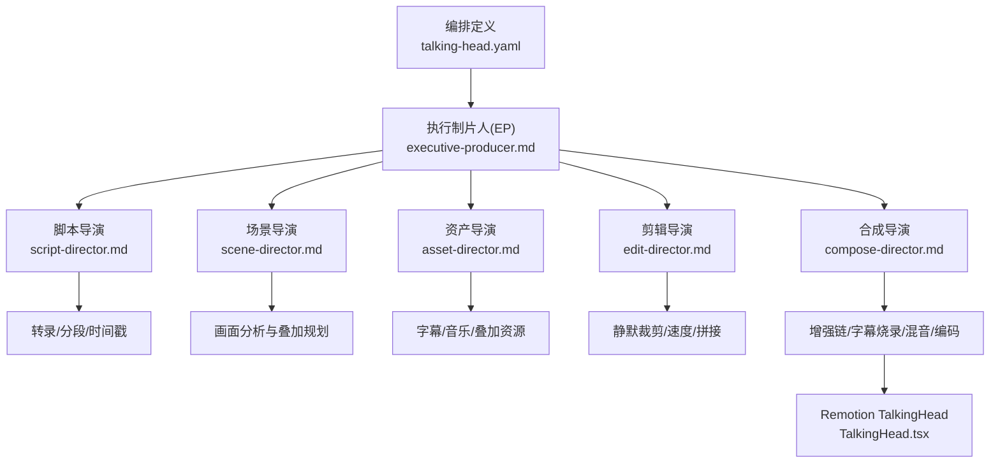
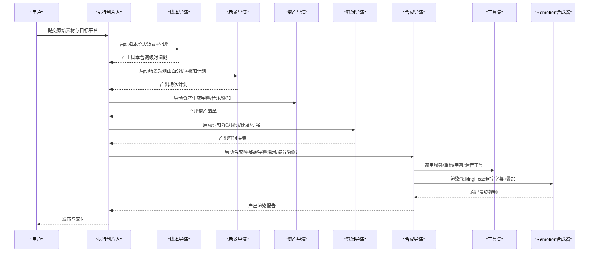
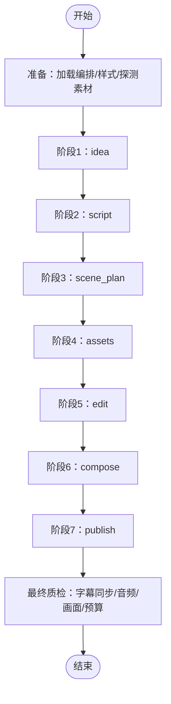
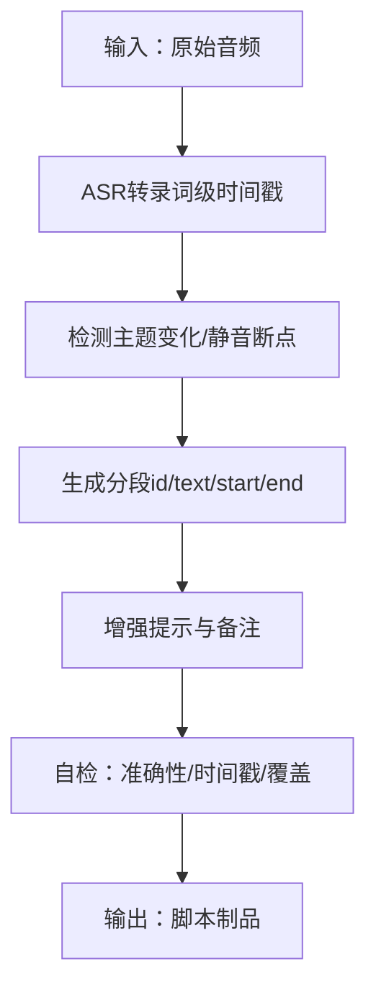
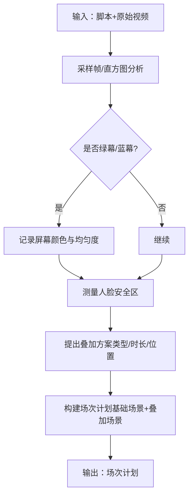
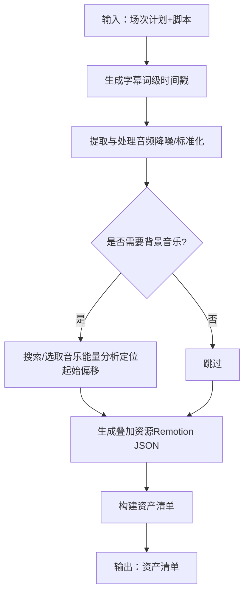
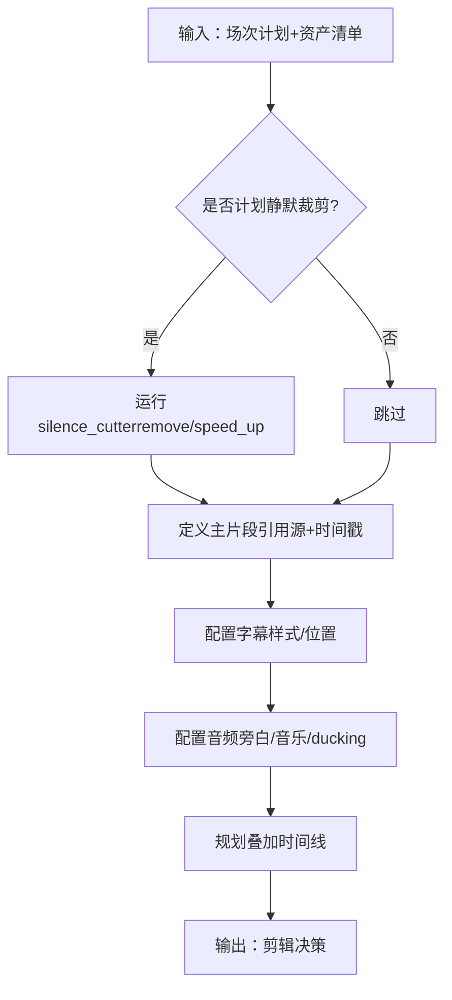
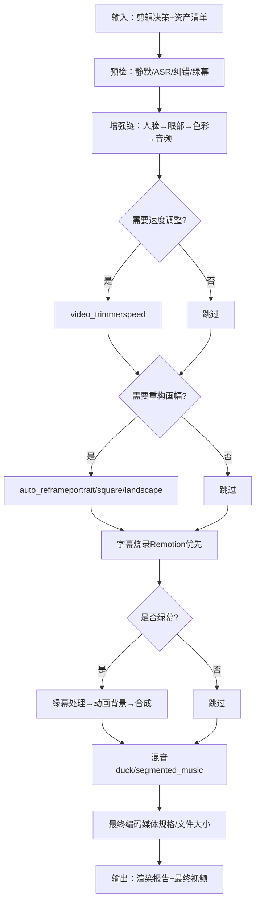
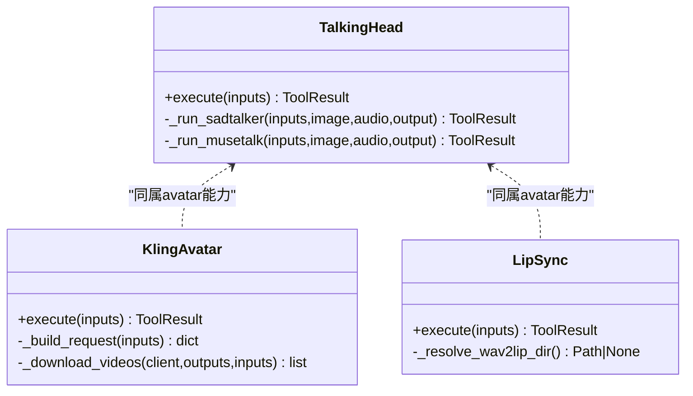
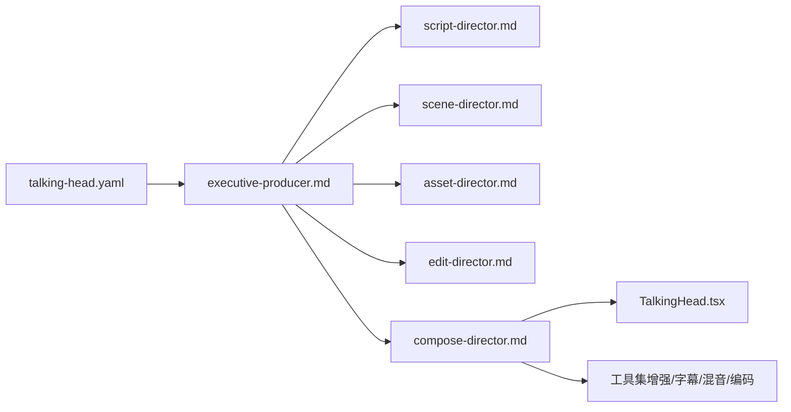

# 对话头像管道

<cite>
**本文引用的文件**
- [pipeline_defs/talking-head.yaml](file://pipeline_defs/talking-head.yaml)
- [skills/pipelines/talking-head/executive-producer.md](file://skills/pipelines/talking-head/executive-producer.md)
- [skills/pipelines/talking-head/script-director.md](file://skills/pipelines/talking-head/script-director.md)
- [skills/pipelines/talking-head/scene-director.md](file://skills/pipelines/talking-head/scene-director.md)
- [skills/pipelines/talking-head/asset-director.md](file://skills/pipelines/talking-head/asset-director.md)
- [skills/pipelines/talking-head/edit-director.md](file://skills/pipelines/talking-head/edit-director.md)
- [skills/pipelines/talking-head/compose-director.md](file://skills/pipelines/talking-head/compose-director.md)
- [tools/avatar/talking_head.py](file://tools/avatar/talking_head.py)
- [tools/avatar/kling_avatar.py](file://tools/avatar/kling_avatar.py)
- [tools/avatar/lip_sync.py](file://tools/avatar/lip_sync.py)
- [remotion-composer/src/TalkingHead.tsx](file://remotion-composer/src/TalkingHead.tsx)
</cite>

## 目录
1. [简介](#简介)
2. [项目结构](#项目结构)
3. [核心组件](#核心组件)
4. [架构总览](#架构总览)
5. [详细组件分析](#详细组件分析)
6. [依赖关系分析](#依赖关系分析)
7. [性能与质量考量](#性能与质量考量)
8. [故障排查指南](#故障排查指南)
9. [结论](#结论)
10. [附录：场景配置模板](#附录：场景配置模板)

## 简介
本使用文档面向“对话头像管道”（Talking Head Pipeline），聚焦真人头像合成、口型同步、自然语音合成与专业演讲效果。该管道以“素材优先”的方式，将原始人物讲话视频转化为带字幕、可选增强与视觉叠加的最终成品，并通过严格的阶段门禁与跨阶段校验保障质量。

核心特点
- 真人头像合成：支持本地模型驱动（SadTalker/MuseTalk）与云端提供商（Kling官方）两种路径。
- 口型同步：提供唇形同步工具链，适配配音与多语言本地化。
- 自然语音合成：通过TTS工具生成高质量旁白，结合Remotion逐字高亮字幕提升观感。
- 专业演讲效果：自动静默裁剪、速度调节、人脸/眼部增强、色彩校正、绿幕合成与背景替换等。

特殊工作流程概览
- 脚本优化：基于ASR词级时间戳进行分段与校对，确保字幕与语音严格对齐。
- 头像素材准备：选择合适的人像照片或视频，控制表情强度、预处理方式与是否仅动嘴。
- 语音合成：按风格与平台要求生成音频，必要时做降噪与响度标准化。
- 口型同步处理：根据目标音频对原视频进行唇形重绘或替换，保证口型一致。

## 项目结构
对话头像管道由“编排定义 + 导演技能 + 工具实现 + Remotion合成器”构成：
- 编排定义：描述阶段、产物、可用工具、审查重点与成功标准。
- 导演技能：每个阶段的具体执行流程、检查项与提交规范。
- 工具实现：头像生成、唇形同步、音视频处理等可复用能力。
- Remotion合成器：最终渲染层，负责逐字字幕、叠加图形与输出编码。

图示来源
- [pipeline_defs/talking-head.yaml:1-229](file://pipeline_defs/talking-head.yaml#L1-L229)
- [skills/pipelines/talking-head/executive-producer.md:92-150](file://skills/pipelines/talking-head/executive-producer.md#L92-L150)
- [skills/pipelines/talking-head/script-director.md:17-56](file://skills/pipelines/talking-head/script-director.md#L17-L56)
- [skills/pipelines/talking-head/scene-director.md:19-47](file://skills/pipelines/talking-head/scene-director.md#L19-L47)
- [skills/pipelines/talking-head/asset-director.md:29-63](file://skills/pipelines/talking-head/asset-director.md#L29-L63)
- [skills/pipelines/talking-head/edit-director.md:15-64](file://skills/pipelines/talking-head/edit-director.md#L15-L64)
- [skills/pipelines/talking-head/compose-director.md:24-156](file://skills/pipelines/talking-head/compose-director.md#L24-L156)
- [remotion-composer/src/TalkingHead.tsx](file://remotion-composer/src/TalkingHead.tsx)

章节来源
- [pipeline_defs/talking-head.yaml:1-229](file://pipeline_defs/talking-head.yaml#L1-L229)

## 核心组件
- 执行制片人（EP）：串联各阶段，维护累计状态，执行跨阶段检查与回退策略，确保字幕同步、音频质量与视觉一致性。
- 脚本导演：从原始音频提取词级时间戳，划分段落并标注增强提示。
- 场景导演：分析画面（背景、人脸位置、光照），规划叠加内容与安全区域，制定增强链。
- 资产导演：生成字幕、背景音乐与叠加资源，构建资产清单。
- 剪辑导演：应用静默裁剪、速度调整、片段拼接与字幕配置。
- 合成导演：运行增强链、自动重构画幅、烧录字幕（Remotion）、绿幕合成、混音与最终编码。
- 头像与唇形工具：本地SadTalker/MuseTalk、云端Kling官方头像生成；Wav2Lip唇形同步。

章节来源
- [skills/pipelines/talking-head/executive-producer.md:45-192](file://skills/pipelines/talking-head/executive-producer.md#L45-L192)
- [skills/pipelines/talking-head/script-director.md:17-56](file://skills/pipelines/talking-head/script-director.md#L17-L56)
- [skills/pipelines/talking-head/scene-director.md:19-47](file://skills/pipelines/talking-head/scene-director.md#L19-L47)
- [skills/pipelines/talking-head/asset-director.md:29-163](file://skills/pipelines/talking-head/asset-director.md#L29-L163)
- [skills/pipelines/talking-head/edit-director.md:15-77](file://skills/pipelines/talking-head/edit-director.md#L15-L77)
- [skills/pipelines/talking-head/compose-director.md:65-156](file://skills/pipelines/talking-head/compose-director.md#L65-L156)
- [tools/avatar/talking_head.py:29-105](file://tools/avatar/talking_head.py#L29-L105)
- [tools/avatar/kling_avatar.py:36-140](file://tools/avatar/kling_avatar.py#L36-L140)
- [tools/avatar/lip_sync.py:36-108](file://tools/avatar/lip_sync.py#L36-L108)

## 架构总览
对话头像管道的端到端数据流如下：

图示来源
- [pipeline_defs/talking-head.yaml:42-229](file://pipeline_defs/talking-head.yaml#L42-L229)
- [skills/pipelines/talking-head/executive-producer.md:103-192](file://skills/pipelines/talking-head/executive-producer.md#L103-L192)
- [skills/pipelines/talking-head/compose-director.md:154-176](file://skills/pipelines/talking-head/compose-director.md#L154-L176)
- [remotion-composer/src/TalkingHead.tsx](file://remotion-composer/src/TalkingHead.tsx)

## 详细组件分析

### 执行制片人（EP）
职责
- 串行调度各阶段，注入上下文与预算信息。
- 在每个阶段后执行Schema校验、审查重点与成功标准检查。
- 跨阶段检查：字幕同步、音频质量、画面覆盖与增强可行性。
- 回退机制：当发现上游错误时，可将任务发回至特定阶段修正。

关键流程
- 初始化：加载编排、选择样式、探测原始素材元数据。
- 阶段执行：idea → script → scene_plan → assets → edit → compose → publish。
- 最终质检：播放性、字幕同步、音频响度、视觉增强一致性、预算核对。

图示来源
- [pipeline_defs/talking-head.yaml:42-229](file://pipeline_defs/talking-head.yaml#L42-L229)
- [skills/pipelines/talking-head/executive-producer.md:92-192](file://skills/pipelines/talking-head/executive-producer.md#L92-L192)

章节来源
- [skills/pipelines/talking-head/executive-producer.md:92-192](file://skills/pipelines/talking-head/executive-producer.md#L92-L192)

### 脚本导演（Transcription & Segmentation）
职责
- 使用ASR获取词级时间戳，划分逻辑段落。
- 为每段添加增强提示与说话人备注。
- 自检准确性、时间戳单调性与覆盖范围。

图示来源
- [skills/pipelines/talking-head/script-director.md:17-56](file://skills/pipelines/talking-head/script-director.md#L17-L56)

章节来源
- [skills/pipelines/talking-head/script-director.md:17-56](file://skills/pipelines/talking-head/script-director.md#L17-L56)

### 场景导演（Visual Analysis & Overlay Planning）
职责
- 采样帧分析背景类型、人脸位置与光照质量。
- 规划叠加内容（术语卡、统计卡、对比、图表、进度条等）。
- 确定安全区域与重构需求（如竖屏适配）。

图示来源
- [skills/pipelines/talking-head/scene-director.md:19-47](file://skills/pipelines/talking-head/scene-director.md#L19-L47)
- [skills/pipelines/talking-head/scene-director.md:65-108](file://skills/pipelines/talking-head/scene-director.md#L65-L108)
- [skills/pipelines/talking-head/scene-director.md:178-227](file://skills/pipelines/talking-head/scene-director.md#L178-L227)

章节来源
- [skills/pipelines/talking-head/scene-director.md:19-47](file://skills/pipelines/talking-head/scene-director.md#L19-L47)
- [skills/pipelines/talking-head/scene-director.md:65-108](file://skills/pipelines/talking-head/scene-director.md#L65-L108)
- [skills/pipelines/talking-head/scene-director.md:178-227](file://skills/pipelines/talking-head/scene-director.md#L178-L227)

### 资产导演（Subtitles, Music & Overlays）
职责
- 生成SRT/ASS字幕，按样式设置字体/大小/位置。
- 提取并处理音频（降噪、响度标准化）。
- 生成叠加资源（Remotion JSON props），映射到具体组件。
- 构建资产清单（字幕、音乐、叠加、转录片段）。

图示来源
- [skills/pipelines/talking-head/asset-director.md:29-63](file://skills/pipelines/talking-head/asset-director.md#L29-L63)
- [skills/pipelines/talking-head/asset-director.md:65-163](file://skills/pipelines/talking-head/asset-director.md#L65-L163)

章节来源
- [skills/pipelines/talking-head/asset-director.md:29-63](file://skills/pipelines/talking-head/asset-director.md#L29-L63)
- [skills/pipelines/talking-head/asset-director.md:65-163](file://skills/pipelines/talking-head/asset-director.md#L65-L163)

### 剪辑导演（Silence Cut, Speed & Assembly）
职责
- 应用静默裁剪（remove/speed_up模式）。
- 定义主片段（引用原始或裁剪后的源，使用脚本时间戳）。
- 配置字幕与音频（旁白/背景音乐/ducking）。
- 规划增强叠加的时间线。

图示来源
- [skills/pipelines/talking-head/edit-director.md:15-64](file://skills/pipelines/talking-head/edit-director.md#L15-L64)

章节来源
- [skills/pipelines/talking-head/edit-director.md:15-64](file://skills/pipelines/talking-head/edit-director.md#L15-L64)

### 合成导演（Enhancement Chain, Captions, Mix & Encode）
职责
- 预检：静默标记、ASR置信度检查、纠错字典、绿幕标志。
- 增强链：人脸增强→眼部增强→色彩校正→音频增强。
- 速度调整与自动重构画幅（适配不同平台）。
- 字幕烧录（优先Remotion逐字高亮，FFmpeg降级）。
- 绿幕合成（移除背景→渲染动画背景→合成）。
- 混音与最终编码（媒体规格与文件大小控制）。

图示来源
- [skills/pipelines/talking-head/compose-director.md:24-156](file://skills/pipelines/talking-head/compose-director.md#L24-L156)
- [skills/pipelines/talking-head/compose-director.md:154-176](file://skills/pipelines/talking-head/compose-director.md#L154-L176)
- [skills/pipelines/talking-head/compose-director.md:275-333](file://skills/pipelines/talking-head/compose-director.md#L275-L333)
- [skills/pipelines/talking-head/compose-director.md:366-418](file://skills/pipelines/talking-head/compose-director.md#L366-L418)

章节来源
- [skills/pipelines/talking-head/compose-director.md:24-156](file://skills/pipelines/talking-head/compose-director.md#L24-L156)
- [skills/pipelines/talking-head/compose-director.md:154-176](file://skills/pipelines/talking-head/compose-director.md#L154-L176)
- [skills/pipelines/talking-head/compose-director.md:275-333](file://skills/pipelines/talking-head/compose-director.md#L275-L333)
- [skills/pipelines/talking-head/compose-director.md:366-418](file://skills/pipelines/talking-head/compose-director.md#L366-L418)

### 头像与唇形工具
- 本地头像生成（SadTalker/MuseTalk）：输入人像图片与驱动音频，输出口型动画视频；支持表达式强度、静止头模式与预处理方式。
- 云端头像生成（Kling官方）：通过API创建任务并轮询结果，支持多种音频输入形式与回调。
- 唇形同步（Wav2Lip）：将新音频与原始视频对齐，适用于配音与本地化。

图示来源
- [tools/avatar/talking_head.py:29-105](file://tools/avatar/talking_head.py#L29-L105)
- [tools/avatar/kling_avatar.py:36-140](file://tools/avatar/kling_avatar.py#L36-L140)
- [tools/avatar/lip_sync.py:36-108](file://tools/avatar/lip_sync.py#L36-L108)

章节来源
- [tools/avatar/talking_head.py:29-105](file://tools/avatar/talking_head.py#L29-L105)
- [tools/avatar/kling_avatar.py:36-140](file://tools/avatar/kling_avatar.py#L36-L140)
- [tools/avatar/lip_sync.py:36-108](file://tools/avatar/lip_sync.py#L36-L108)

## 依赖关系分析
- 编排与技能：talking-head.yaml定义了阶段顺序、所需技能与可用工具；各导演技能细化执行步骤与检查项。
- 工具与运行时：本地GPU（SadTalker/Wav2Lip）与云端API（Kling）并存；Remotion用于高质量字幕与叠加渲染。
- 外部依赖：ffmpeg、MediaPipe（部分增强）、ASR引擎（WhisperX等）、TTS服务（多供应商）。

图示来源
- [pipeline_defs/talking-head.yaml:42-229](file://pipeline_defs/talking-head.yaml#L42-L229)
- [skills/pipelines/talking-head/compose-director.md:24-156](file://skills/pipelines/talking-head/compose-director.md#L24-L156)
- [remotion-composer/src/TalkingHead.tsx](file://remotion-composer/src/TalkingHead.tsx)

章节来源
- [pipeline_defs/talking-head.yaml:42-229](file://pipeline_defs/talking-head.yaml#L42-L229)

## 性能与质量考量
- 字幕同步：EP在资产阶段与最终质检中严格校验字幕与语音的对齐误差（±0.3s以内）。
- 音频质量：目标响度约-16 LUFS；必要时降噪与ducking避免音乐盖过旁白。
- 视觉增强：人脸与眼部增强需保持自然强度；色彩校正统一风格；绿幕合成需匹配动画背景。
- 平台规格：最终编码遵循目标平台尺寸与时长限制（如Instagram Reels、TikTok、YouTube Shorts）。
- 成本与耗时：本地工具零API成本但需GPU；云端头像生成有费用与延迟；EP预算与超时保护防止无限循环。

[本节为通用指导，不直接分析具体文件]

## 故障排查指南
常见问题与解决思路
- 转录置信度低：在脚本阶段重试更大模型或提示语言；EP发送回退指令重新转录。
- 字幕错位：资产阶段重新生成字幕，使用词级时间戳与纠错字典；最终质检再次验证。
- 音频噪声大：在资产或合成阶段启用降噪与响度标准化；必要时重新混音。
- 绿幕合成失败：确认背景颜色与均匀度；使用自动方法检测并替换为动画背景。
- 字幕遮挡人脸：在垂直视频中强制字幕位于下20%区域；避免默认居中位置。
- 输出过大：降低比特率或分辨率；遵循平台最大文件大小限制。

章节来源
- [skills/pipelines/talking-head/executive-producer.md:152-192](file://skills/pipelines/talking-head/executive-producer.md#L152-L192)
- [skills/pipelines/talking-head/compose-director.md:154-186](file://skills/pipelines/talking-head/compose-director.md#L154-L186)
- [skills/pipelines/talking-head/compose-director.md:391-418](file://skills/pipelines/talking-head/compose-director.md#L391-L418)

## 结论
对话头像管道通过严谨的阶段化流程与跨阶段校验，实现了从原始素材到高质量成品的自动化生产。其核心优势在于：
- 以ASR词级时间戳为基础的字幕同步保障。
- 灵活的头像与唇形工具链，兼顾本地与云端方案。
- 强大的Remotion合成能力，提供逐字高亮与丰富叠加。
- 明确的平台规格与质量控制标准，确保成品可用性。

建议在实际项目中：
- 优先保证转录质量与字幕同步。
- 合理选择头像与唇形工具，平衡质量与成本。
- 依据平台规格进行最终编码与尺寸适配。
- 利用EP的预算与超时保护，避免过度处理。

[本节为总结，不直接分析具体文件]

## 附录：场景配置模板
以下为常见应用场景的配置要点（基于管道能力与工具约束）：

- 企业宣传
  - 风格：干净专业（clean-professional）
  - 叠加：术语卡、统计卡、KPI网格（数值型）
  - 字幕：底部居中，逐字高亮
  - 音频：旁白清晰，背景音乐ducking
  - 平台：LinkedIn/YouTube（横屏16:9）

- 教育培训
  - 风格：简洁明了
  - 叠加：进度条、图表、标题卡
  - 字幕：较大字号，便于阅读
  - 音频：语速适中，必要时速度调整
  - 平台：YouTube/教育平台（横屏16:9）

- 产品演示
  - 风格：现代科技感
  - 叠加：对比卡、数据图表、展示卡
  - 字幕：强调关键词
  - 音频：节奏明快，背景音乐轻
  - 平台：社交媒体（竖屏9:16或方形1:1）

[本节为概念性说明，不直接分析具体文件]