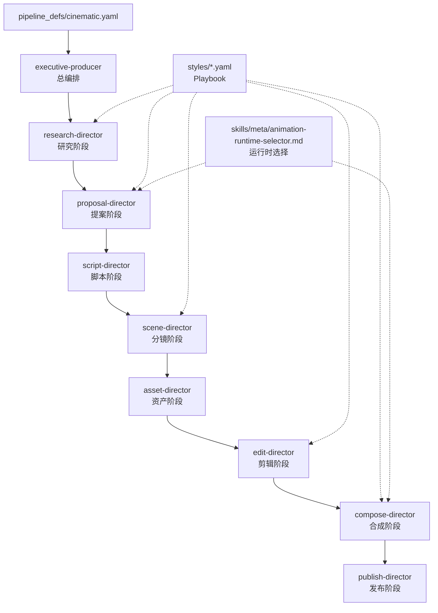
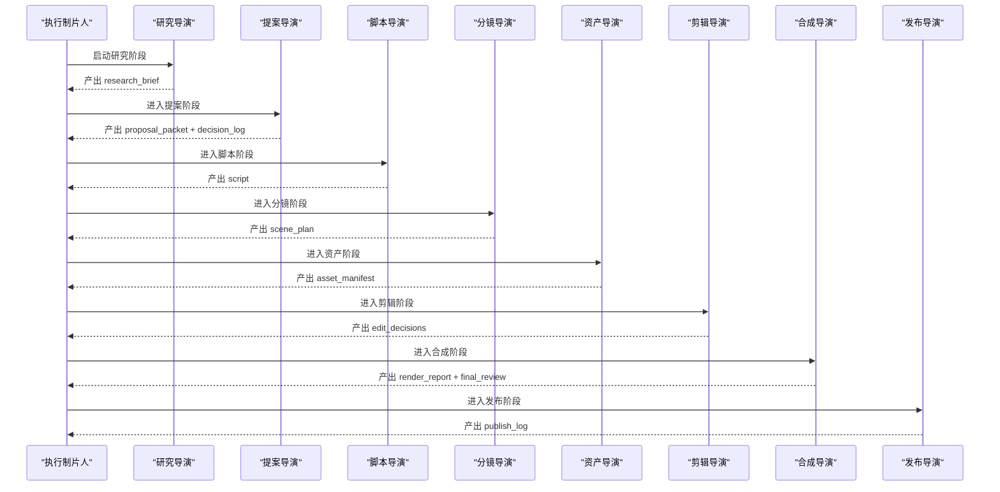
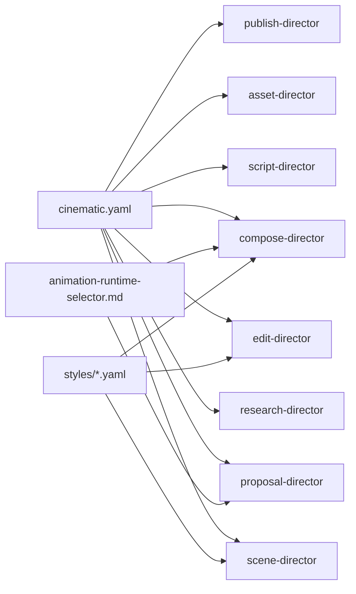

# 电影风格管道

<cite>
**本文引用的文件**
- [pipeline_defs/cinematic.yaml](file://pipeline_defs/cinematic.yaml)
- [skills/pipelines/cinematic/executive-producer.md](file://skills/pipelines/cinematic/executive-producer.md)
- [skills/pipelines/cinematic/research-director.md](file://skills/pipelines/cinematic/research-director.md)
- [skills/pipelines/cinematic/proposal-director.md](file://skills/pipelines/cinematic/proposal-director.md)
- [skills/pipelines/cinematic/script-director.md](file://skills/pipelines/cinematic/script-director.md)
- [skills/pipelines/cinematic/scene-director.md](file://skills/pipelines/cinematic/scene-director.md)
- [skills/pipelines/cinematic/asset-director.md](file://skills/pipelines/cinematic/asset-director.md)
- [skills/pipelines/cinematic/edit-director.md](file://skills/pipelines/cinematic/edit-director.md)
- [skills/pipelines/cinematic/compose-director.md](file://skills/pipelines/cinematic/compose-director.md)
- [skills/pipelines/cinematic/publish-director.md](file://skills/pipelines/cinematic/publish-director.md)
- [styles/clean-professional.yaml](file://styles/clean-professional.yaml)
- [skills/meta/animation-runtime-selector.md](file://skills/meta/animation-runtime-selector.md)
- [remotion-composer/src/CinematicRenderer.tsx](file://remotion-composer/src/CinematicRenderer.tsx)
</cite>

## 目录
1. [简介](#简介)
2. [项目结构](#项目结构)
3. [核心组件](#核心组件)
4. [架构总览](#架构总览)
5. [详细组件分析](#详细组件分析)
6. [依赖关系分析](#依赖关系分析)
7. [性能与质量考量](#性能与质量考量)
8. [故障排查指南](#故障排查指南)
9. [结论](#结论)
10. [附录：配置项、参数与最佳实践](#附录：配置项参数与最佳实践)

## 简介
本文件面向需要制作“电影级”视频的用户与创作者，系统性说明 OpenMontage 的 cinematic（电影风格）管道。该管道以情绪驱动为核心，强调电影级视觉质量、专业叙事结构、高级视觉效果与电影化转场，适用于预告片、品牌短片、蒙太奇以及短剧式剪辑等场景。

cinematic 管道的关键特点
- 电影级视觉质量：通过严格的色彩分级、镜头语言、景深与纹理控制，确保画面具备电影感。
- 专业叙事结构：从研究到提案再到脚本、分镜、资产、剪辑、合成与发布，每个阶段都有明确的质量门禁与人类审批点。
- 高级视觉效果：支持 Remotion CinematicRenderer、HyperFrames 动效与 GSAP 曲线运动、粒子/胶片颗粒叠加、调色与混音。
- 电影化转场：限制转场词汇表，避免过度花哨，用硬切、淡入淡出、慢溶解与克制的推拉来服务情绪。

与动画解释器管道的区别
- 目标不同：解释器侧重信息密度与数据可视化；电影风格侧重情绪弧、节奏与画面质感。
- 结构与节奏：电影风格采用更慢的节奏（约 120 WPM），强调高潮与落点；解释器通常更快、更直接。
- 技术选择：电影风格在提案阶段锁定渲染引擎（Remotion/HyperFrames/FFmpeg），并严格禁止无声降级；解释器更偏模板化与数据驱动。
- 质量控制：电影风格在每个阶段设置质量门禁，关注情感连贯性、音频动态与色彩一致性。

适用业务场景
- 预告片、品牌宣传片、概念蒙太奇、短剧情片、产品发布重映、音乐向短片、3D 世界漫游展示等。

## 项目结构
cinematic 管道由 YAML 管线定义与各导演技能文档组成，配合样式 Playbook 与元技能进行运行时路由与质量约束。

图示来源
- [pipeline_defs/cinematic.yaml:1-288](file://pipeline_defs/cinematic.yaml#L1-L288)
- [skills/pipelines/cinematic/executive-producer.md:1-192](file://skills/pipelines/cinematic/executive-producer.md#L1-L192)
- [skills/meta/animation-runtime-selector.md:1-156](file://skills/meta/animation-runtime-selector.md#L1-L156)

章节来源
- [pipeline_defs/cinematic.yaml:1-288](file://pipeline_defs/cinematic.yaml#L1-L288)

## 核心组件
- 执行制片人（Executive Producer）：串行编排各阶段，维护累计状态、预算与时间上限，并在关键节点进行质量门禁与用户决策透明化。
- 研究导演（Research Director）：基于真实参考与情绪语言进行深度调研，产出 research_brief，为提案提供方向素材。
- 提案导演（Proposal Director）：将研究转化为可评审的提案，锁定渲染家族与渲染引擎，制定交付承诺、音乐计划与成本估算，并强制人类审批。
- 脚本导演（Script Director）：将提案转为节拍清晰的脚本，保证情绪递进与时长匹配。
- 分镜导演（Scene Director）：把节拍映射为具体镜头方案，定义英雄帧、转场规则与画幅策略。
- 资产导演（Asset Director）：准备源素材、标题卡、可选生成插入、音乐与环境声，必要时构建 3D 世界。
- 剪辑导演（Edit Director）：按情绪、揭示时机与音乐转折进行剪辑，保护强时刻。
- 合成导演（Compose Director）：执行渲染、调色、混音与帧处理，确保输出符合电影级标准。
- 发布导演（Publish Director）：打包主版本与衍生版本，标注元数据与发行意图。

章节来源
- [skills/pipelines/cinematic/executive-producer.md:1-192](file://skills/pipelines/cinematic/executive-producer.md#L1-L192)
- [skills/pipelines/cinematic/research-director.md:1-207](file://skills/pipelines/cinematic/research-director.md#L1-L207)
- [skills/pipelines/cinematic/proposal-director.md:1-310](file://skills/pipelines/cinematic/proposal-director.md#L1-L310)
- [skills/pipelines/cinematic/script-director.md:1-200](file://skills/pipelines/cinematic/script-director.md#L1-L200)
- [skills/pipelines/cinematic/scene-director.md:1-88](file://skills/pipelines/cinematic/scene-director.md#L1-L88)
- [skills/pipelines/cinematic/asset-director.md:1-188](file://skills/pipelines/cinematic/asset-director.md#L1-L188)
- [skills/pipelines/cinematic/edit-director.md:1-57](file://skills/pipelines/cinematic/edit-director.md#L1-L57)
- [skills/pipelines/cinematic/compose-director.md:1-94](file://skills/pipelines/cinematic/compose-director.md#L1-L94)
- [skills/pipelines/cinematic/publish-director.md:1-66](file://skills/pipelines/cinematic/publish-director.md#L1-L66)

## 架构总览
cinematic 管道采用“执行制片人”模式，串联九个阶段，每阶段产出特定工件并通过质量门禁。提案阶段锁定渲染家族与渲染引擎，合成阶段严格按已锁定的运行时执行，禁止静默降级。

图示来源
- [pipeline_defs/cinematic.yaml:60-288](file://pipeline_defs/cinematic.yaml#L60-L288)
- [skills/pipelines/cinematic/executive-producer.md:50-173](file://skills/pipelines/cinematic/executive-producer.md#L50-L173)

## 详细组件分析

### 研究阶段（Research）
- 目标：收集视觉参考、声音与音乐方向、运动先例与受众语境，形成 research_brief。
- 流程要点：
  - 若存在参考视频分析简报，则聚焦差异化与情绪相邻区域。
  - 多批次并行搜索：视觉参考、声音景观、主题深度、镜头语言、受众与平台。
  - 至少识别三种真正不同的电影方向，并记录依据与可行性。
- 质量门禁：参考具体且相关、声音方向实质化、运动承诺诚实、至少三个不同方向。

章节来源
- [skills/pipelines/cinematic/research-director.md:1-207](file://skills/pipelines/cinematic/research-director.md#L1-L207)
- [pipeline_defs/cinematic.yaml:60-78](file://pipeline_defs/cinematic.yaml#L60-L78)

### 提案阶段（Proposal）
- 目标：将研究转化为可评审的提案，锁定渲染家族与渲染引擎，制定交付承诺与音乐计划，给出成本估算。
- 运行时选择（硬性规则）：
  - 必须同时呈现 Remotion 与 HyperFrames 选项（若均可用），并给出适配分析与权衡。
  - 根据交付承诺（尤其是 motion_required）推荐其一，等待用户明确批准后再写入 production_plan。
  - 若 motion_required=true，则所选运行时是承诺，禁止静默降级。
- 质量门禁：情感弧线清晰、来源模式明确、交付承诺完整、渲染家族锁定、音乐计划解决、成本明细。

章节来源
- [skills/pipelines/cinematic/proposal-director.md:1-310](file://skills/pipelines/cinematic/proposal-director.md#L1-L310)
- [skills/meta/animation-runtime-selector.md:1-156](file://skills/meta/animation-runtime-selector.md#L1-L156)
- [pipeline_defs/cinematic.yaml:79-114](file://pipeline_defs/cinematic.yaml#L79-L114)

### 脚本阶段（Script）
- 目标：将提案转为节拍清晰的脚本，确保情绪递进与时长匹配。
- 质量门禁：节拍图清晰升级、对白或标题卡使用克制、揭示与落点明确。

章节来源
- [pipeline_defs/cinematic.yaml:115-136](file://pipeline_defs/cinematic.yaml#L115-L136)

### 分镜阶段（Scene Plan）
- 目标：将节拍映射为具体镜头方案，定义英雄帧、转场规则与画幅策略。
- 五方面清单：主体、主体运动、场景、空间构图、摄影机。
- 质量门禁：英雄帧可识别且全维度指定、支持插入有理由、覆盖物记录正确、视觉语言一致。

章节来源
- [skills/pipelines/cinematic/scene-director.md:1-88](file://skills/pipelines/cinematic/scene-director.md#L1-L88)
- [pipeline_defs/cinematic.yaml:137-160](file://pipeline_defs/cinematic.yaml#L137-L160)

### 资产阶段（Assets）
- 目标：准备源素材、标题卡、可选生成插入、音乐与环境声；必要时构建 3D 世界。
- 关键点：
  - 优先源素材，生成插入仅用于填补空白。
  - 若 motion_required=true，必须包含实际视频片段而非静态替代。
  - 生成前进行三遍提示词自检（预述—批评—重写），记录三元组。
  - 音乐优先免费库（如 pixabay_music），再考虑生成 API。
- 质量门禁：源与支撑资产区分清晰、生成插入有限且有目的、音频计划匹配节拍、所有引用文件存在。

章节来源
- [skills/pipelines/cinematic/asset-director.md:1-188](file://skills/pipelines/cinematic/asset-director.md#L1-L188)
- [pipeline_defs/cinematic.yaml:161-208](file://pipeline_defs/cinematic.yaml#L161-L208)

### 剪辑阶段（Edit）
- 目标：按情绪、揭示时机与音乐转折进行剪辑，保护强时刻。
- 质量门禁：情感弧线完整、揭示清晰、标题卡稀疏且有意为之、强时刻不被覆盖。

章节来源
- [skills/pipelines/cinematic/edit-director.md:1-57](file://skills/pipelines/cinematic/edit-director.md#L1-L57)
- [pipeline_defs/cinematic.yaml:209-228](file://pipeline_defs/cinematic.yaml#L209-L228)

### 合成阶段（Compose）
- 目标：执行渲染、调色、混音与帧处理，确保输出符合电影级标准。
- 运行时路由（硬性规则）：
  - 严格按 edit_decisions.render_runtime 执行，禁止静默切换。
  - 若 Remotion 不可用或失败，立即上报，不得降级为 FFmpeg 静态演示。
  - 对 Blender 世界影片，FFmpeg 仅作为图像序列与音频打包器。
- 质量门禁：ffprobe 校验、颜色分级一致、音频动态可控、画框处理提升输出、render_runtime 与提案一致。

章节来源
- [skills/pipelines/cinematic/compose-director.md:1-94](file://skills/pipelines/cinematic/compose-director.md#L1-L94)
- [pipeline_defs/cinematic.yaml:229-267](file://pipeline_defs/cinematic.yaml#L229-L267)

### 发布阶段（Publish）
- 目标：打包主版本与衍生版本，标注元数据与发行意图。
- 质量门禁：主导出清晰、衍生版本按用途命名、元数据契合情绪、包可直接使用。

章节来源
- [skills/pipelines/cinematic/publish-director.md:1-66](file://skills/pipelines/cinematic/publish-director.md#L1-L66)
- [pipeline_defs/cinematic.yaml:268-288](file://pipeline_defs/cinematic.yaml#L268-L288)

## 依赖关系分析
- 管线定义依赖导演技能与工件 Schema，确保阶段产物可验证。
- 提案与合成阶段依赖运行时选择元技能，决定 Remotion/HyperFrames/FFmpeg 路径。
- 资产阶段依赖工具注册表与媒体能力（图像/视频/音乐/增强）。
- 样式 Playbook 贯穿多个阶段，约束色彩、排版与动效规范。

图示来源
- [pipeline_defs/cinematic.yaml:1-288](file://pipeline_defs/cinematic.yaml#L1-L288)
- [skills/meta/animation-runtime-selector.md:1-156](file://skills/meta/animation-runtime-selector.md#L1-L156)
- [styles/clean-professional.yaml:1-105](file://styles/clean-professional.yaml#L1-L105)

章节来源
- [pipeline_defs/cinematic.yaml:1-288](file://pipeline_defs/cinematic.yaml#L1-L288)
- [skills/meta/animation-runtime-selector.md:1-156](file://skills/meta/animation-runtime-selector.md#L1-L156)
- [styles/clean-professional.yaml:1-105](file://styles/clean-professional.yaml#L1-L105)

## 性能与质量考量
- 预算与时间上限：默认预算与最大墙钟时间需严格遵守，避免无限迭代。
- 生成样本先行：昂贵生成类型（视频/音乐）先出样片确认，再批量生产。
- 运行时承诺：motion_required=true 时，所选运行时是承诺，失败需上报而非降级。
- 音频动态：保持安静时刻、冲击时刻、对白清晰度与音乐起伏，避免压平。
- 色彩与帧处理：仅在有助于作品时使用 Letterbox、24fps 意图与重度调色。

章节来源
- [skills/pipelines/cinematic/executive-producer.md:174-192](file://skills/pipelines/cinematic/executive-producer.md#L174-L192)
- [skills/pipelines/cinematic/asset-director.md:66-86](file://skills/pipelines/cinematic/asset-director.md#L66-L86)
- [skills/pipelines/cinematic/compose-director.md:34-56](file://skills/pipelines/cinematic/compose-director.md#L34-L56)

## 故障排查指南
- 运行时不可用：若 Remotion 不可用或失败，立即上报，不要静默切换到 FFmpeg 静态路径。
- 运行时漂移：合成阶段的 render_runtime 必须与提案一致，否则视为严重违规。
- 生成失败：若首选路径失败，停止并询问用户，不要擅自更换提供商或模型。
- 音频问题：检查混音是否保留动态，对白是否清晰，音乐是否平衡。
- 色彩问题：检查分级是否自然，是否破坏人脸或文字可读性。

章节来源
- [skills/pipelines/cinematic/compose-director.md:34-56](file://skills/pipelines/cinematic/compose-director.md#L34-L56)
- [skills/pipelines/cinematic/asset-director.md:77-86](file://skills/pipelines/cinematic/asset-director.md#L77-L86)
- [skills/pipelines/cinematic/executive-producer.md:56-77](file://skills/pipelines/cinematic/executive-producer.md#L56-L77)

## 结论
电影风格管道通过严谨的阶段划分、质量门禁与运行时契约，确保从研究到发布的每一步都服务于情绪与电影感。它适合需要高质量视觉与专业叙事的业务场景，并与动画解释器管道在目标、节奏与技术选择上形成互补。遵循本指南可在预算与时间内稳定产出电影级作品。

## 附录：配置项、参数与最佳实践

### 管道配置要点（来自 cinematic.yaml）
- 编排模式：executive-producer，串行执行，带质量门禁。
- 默认检查点策略：guided，关键阶段要求 checkpoint。
- 兼容 Playbook：推荐 flat-motion-graphics，也接受 clean-professional 等。
- 各阶段工具集：研究可使用 web_search；资产与合成阶段开放多种媒体与增强工具。

章节来源
- [pipeline_defs/cinematic.yaml:1-59](file://pipeline_defs/cinematic.yaml#L1-L59)
- [pipeline_defs/cinematic.yaml:60-288](file://pipeline_defs/cinematic.yaml#L60-L288)

### 运行时选择矩阵（来自 animation-runtime-selector.md）
- 当 Remotion 与 HyperFrames 均可用时，必须同时呈现并等待用户批准。
- 根据需求选择：
  - 现有 React 场景栈、字幕燃烧、头像/口型同步 → remotion
  - 动效字体、HTML/GSAP 原生动效、网站→视频、注册块、3D 世界漫游 → hyperframes
  - 纯拼接/裁剪 → ffmpeg
- 若选定运行时不可用，必须上报，不得静默替换。

章节来源
- [skills/meta/animation-runtime-selector.md:26-76](file://skills/meta/animation-runtime-selector.md#L26-L76)

### 视觉风格与质量控制（来自 styles/clean-professional.yaml）
- 色彩与排版：主色、强调色、背景与文本对比度满足无障碍标准。
- 动效规则：最小场景停留、过渡时长、入场/出场方式。
- 音频规则：配音风格、音乐音量、SFX 风格、ducking 阈值。
- 资产生成：提示词前缀与负向提示，一致性锚点。
- 质量规则：对比度、屏幕颜色数量、可读性、最低持镜时长、最少快速切。

章节来源
- [styles/clean-professional.yaml:1-105](file://styles/clean-professional.yaml#L1-L105)

### 使用案例与最佳实践
- 预告片/品牌短片：
  - 提案阶段锁定 remotion（CinematicRenderer）或 hyperframes（动效字体/注册块）。
  - 资产阶段先出音乐与插入样片，确认情绪与能量匹配节拍。
  - 合成阶段严格保持运行时承诺，进行调色与混音。
- 3D 世界漫游：
  - 提案阶段明确 threejs_world 与 hyperframes 组合，或 Blender 渲染+ffmpeg 打包。
  - 资产阶段完成全局/区域/行走/语义/线框视图审查。
- 音乐向短片：
  - 使用 hyperframes beats 检测节拍，按节拍网格布局画面。
  - 合成阶段保留动态范围，避免压平。

章节来源
- [skills/pipelines/cinematic/proposal-director.md:10-39](file://skills/pipelines/cinematic/proposal-director.md#L10-L39)
- [skills/pipelines/cinematic/asset-director.md:35-48](file://skills/pipelines/cinematic/asset-director.md#L35-L48)
- [skills/meta/animation-runtime-selector.md:62-68](file://skills/meta/animation-runtime-selector.md#L62-L68)

### 与动画解释器管道的差异对照
- 目标：电影风格强调情绪与质感；解释器强调信息密度与数据可视化。
- 节奏：电影风格较慢，注重高潮与落点；解释器较快。
- 运行时：电影风格在提案阶段锁定并严格执行；解释器更偏模板化。
- 质量门禁：电影风格关注情感连贯、音频动态与色彩一致性；解释器关注可读性与图表准确性。

章节来源
- [pipeline_defs/cinematic.yaml:1-11](file://pipeline_defs/cinematic.yaml#L1-L11)
- [skills/pipelines/cinematic/executive-producer.md:160-173](file://skills/pipelines/cinematic/executive-producer.md#L160-L173)