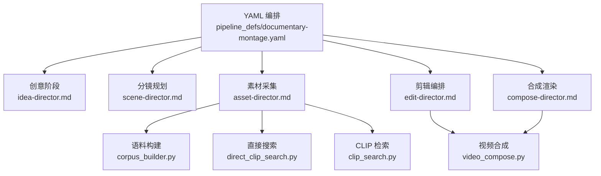
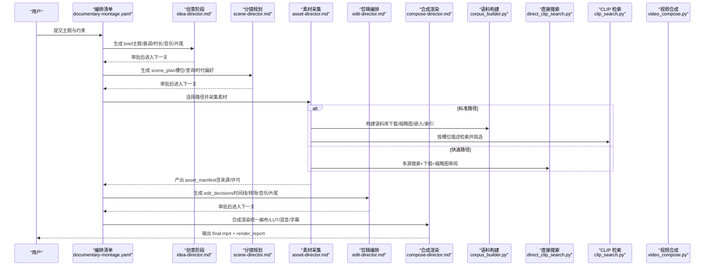
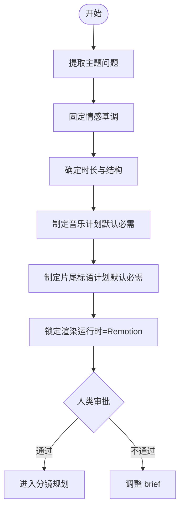
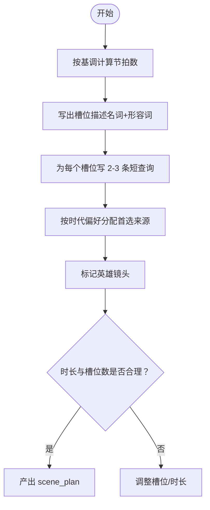
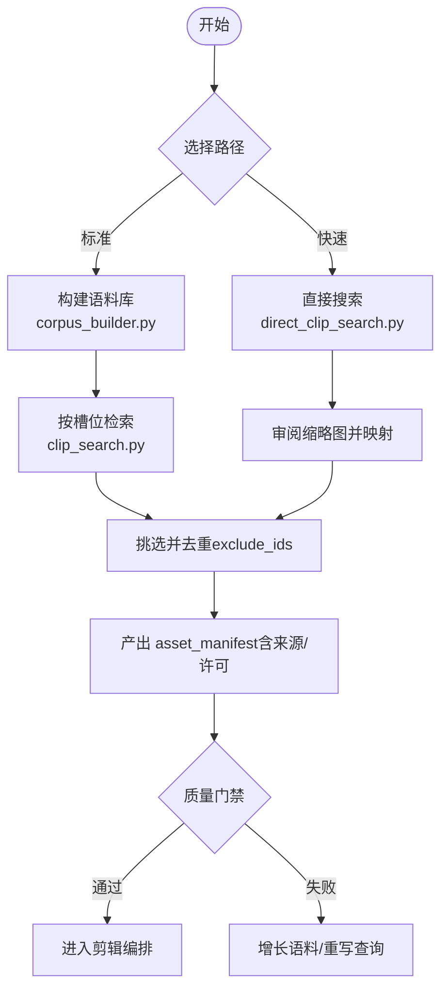
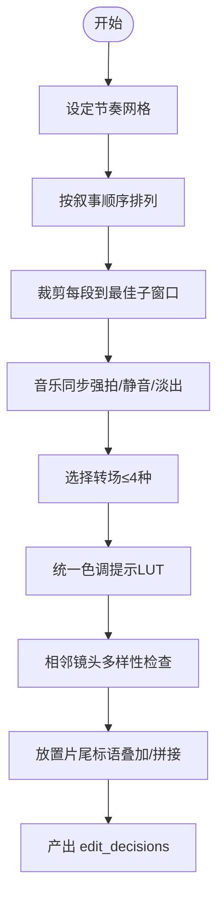
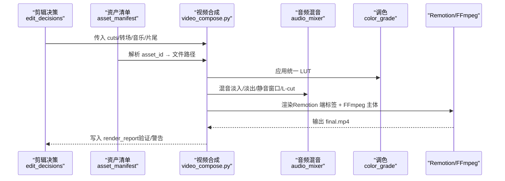
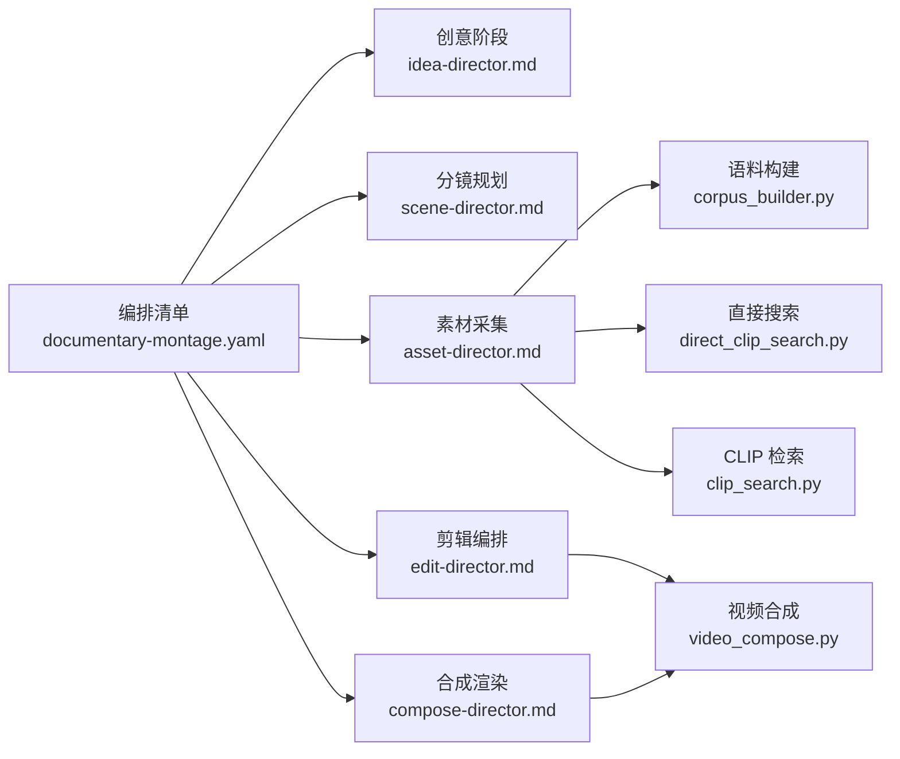

# 纪录片蒙太奇管道

<cite>
**本文引用的文件**
- [documentary-montage.yaml](file://pipeline_defs/documentary-montage.yaml)
- [executive-producer.md](file://skills/pipelines/documentary-montage/executive-producer.md)
- [idea-director.md](file://skills/pipelines/documentary-montage/idea-director.md)
- [scene-director.md](file://skills/pipelines/documentary-montage/scene-director.md)
- [asset-director.md](file://skills/pipelines/documentary-montage/asset-director.md)
- [edit-director.md](file://skills/pipelines/documentary-montage/edit-director.md)
- [compose-director.md](file://skills/pipelines/documentary-montage/compose-director.md)
- [corpus_builder.py](file://tools/video/corpus_builder.py)
- [clip_search.py](file://tools/video/clip_search.py)
- [video_compose.py](file://tools/video/video_compose.py)
- [direct_clip_search.py](file://tools/video/direct_clip_search.py)
- [README.md](file://README.md)
</cite>

## 目录
1. [简介](#简介)
2. [项目结构](#项目结构)
3. [核心组件](#核心组件)
4. [架构总览](#架构总览)
5. [详细组件分析](#详细组件分析)
6. [依赖关系分析](#依赖关系分析)
7. [性能与质量考量](#性能与质量考量)
8. [故障排查指南](#故障排查指南)
9. [结论](#结论)
10. [附录：配置与案例](#附录配置与案例)

## 简介
OpenMontage 的“纪录片蒙太奇”管道以“检索优先”的方式，从真实世界素材库（Pexels、Archive.org、NASA、Wikimedia、Unsplash 等）构建语义语料库，通过 CLIP 检索为每个叙事槽位匹配最合适的镜头，再按主题节拍进行剪辑、音乐同步与统一调色，最终输出具有说服力的纪录片风格作品。该管道强调多素材整合、叙事性剪辑、真实感呈现与纪录片美学，适用于新闻报道、教育内容、企业故事等场景。

## 项目结构
本管道的编排由 YAML 清单定义，各阶段由“导演技能”文档指导执行，工具层提供检索、检索增强、剪辑与合成能力。

图表来源
- [documentary-montage.yaml:1-179](file://pipeline_defs/documentary-montage.yaml#L1-L179)
- [corpus_builder.py:1-715](file://tools/video/corpus_builder.py#L1-L715)
- [clip_search.py:1-357](file://tools/video/clip_search.py#L1-L357)
- [video_compose.py:1-800](file://tools/video/video_compose.py#L1-L800)
- [direct_clip_search.py:199-270](file://tools/video/direct_clip_search.py#L199-L270)

章节来源
- [documentary-montage.yaml:1-179](file://pipeline_defs/documentary-montage.yaml#L1-L179)
- [README.md:356-383](file://README.md#L356-L383)

## 核心组件
- 创意阶段（Idea Director）：将用户意图提炼为“主题问题”，确定基调、时长、形状、音乐计划与片尾标语计划，锁定 Remotion 作为唯一合规渲染运行时。
- 分镜规划（Scene Director）：把主题问题拆解为可检索的槽位描述与查询，标注英雄镜头、时代偏好与目标时长。
- 素材采集（Asset Director）：支持两条路径——标准路径（语料库+CLIP 检索）与快速路径（直接搜索+缩略图审阅），产出带完整来源与版权信息的资产清单。
- 剪辑编排（Edit Director）：基于节奏、对位、音乐同步与转场词汇表生成时间线决策，包含片尾标语叠加或拼接策略。
- 合成渲染（Compose Director）：统一画布、统一 LUT 调色、音频混音、字幕烧录与最终封装，确保输出符合平台规格。

章节来源
- [idea-director.md:1-226](file://skills/pipelines/documentary-montage/idea-director.md#L1-L226)
- [scene-director.md:1-359](file://skills/pipelines/documentary-montage/scene-director.md#L1-L359)
- [asset-director.md:1-527](file://skills/pipelines/documentary-montage/asset-director.md#L1-L527)
- [edit-director.md:1-381](file://skills/pipelines/documentary-montage/edit-director.md#L1-L381)
- [compose-director.md:1-384](file://skills/pipelines/documentary-montage/compose-director.md#L1-L384)

## 架构总览
纪录片蒙太奇管道采用“编排清单 + 导演技能 + 工具链”的分层架构。编排清单定义阶段、产物、工具与审查点；导演技能规定每阶段的创作原则与质量门禁；工具链负责跨供应商的检索、索引、剪辑与合成。

图表来源
- [documentary-montage.yaml:45-179](file://pipeline_defs/documentary-montage.yaml#L45-L179)
- [corpus_builder.py:239-461](file://tools/video/corpus_builder.py#L239-L461)
- [clip_search.py:186-229](file://tools/video/clip_search.py#L186-L229)
- [video_compose.py:337-360](file://tools/video/video_compose.py#L337-L360)

## 详细组件分析

### 创意阶段（Idea Director）
- 任务：提取一句话主题问题，固定情感基调（如哀婉、紧迫、崇敬、讽刺、梦幻），确定时长与结构（单图扩展、前后对比、三幕、目录式）。
- 音乐计划：默认必须包含音乐，除非用户明确拒绝并记录原因。
- 片尾标语：默认使用 Remotion 的 EndTag 组件，支持“叠加”或“拼接”模式。
- 运行时锁定：强制使用 Remotion，禁止静默切换到 HyperFrames。

图表来源
- [idea-director.md:24-156](file://skills/pipelines/documentary-montage/idea-director.md#L24-L156)
- [idea-director.md:157-226](file://skills/pipelines/documentary-montage/idea-director.md#L157-L226)

章节来源
- [idea-director.md:1-226](file://skills/pipelines/documentary-montage/idea-director.md#L1-L226)

### 分镜规划（Scene Director）
- 任务：将主题问题分解为具体、可检索的槽位描述，并为每个槽位编写 2-3 条短查询。
- 英雄镜头：至少标记 2-3 个关键镜头，给予更长停留与更大候选池。
- 时代偏好：根据 era_mix 指定首选来源（现代/复古/任意），控制素材年代质感。
- 儿童/童话内容：切换至 Pixabay 的 AI 奇幻动画风格，重写查询词以确保风格一致。

图表来源
- [scene-director.md:39-169](file://skills/pipelines/documentary-montage/scene-director.md#L39-L169)
- [scene-director.md:171-205](file://skills/pipelines/documentary-montage/scene-director.md#L171-L205)
- [scene-director.md:206-281](file://skills/pipelines/documentary-montage/scene-director.md#L206-L281)

章节来源
- [scene-director.md:1-359](file://skills/pipelines/documentary-montage/scene-director.md#L1-L359)

### 素材采集（Asset Director）
- 标准路径：构建语料库（下载、缩略图、CLIP 嵌入、索引），按槽位描述检索并挑选，要求 corpus 行数≥8×槽位数，分数阈值与多样性检查。
- 快速路径：直接搜索多源，下载 2-3 条/查询，审阅缩略图并映射到槽位；支持跨幕复用已下载片段。
- 版权与来源：每条素材必须携带 provider、original_url、license，确保下游发布合规。
- 音乐计划：严格按 brief 执行，不得静默替换。

图表来源
- [asset-director.md:8-49](file://skills/pipelines/documentary-montage/asset-director.md#L8-L49)
- [asset-director.md:117-183](file://skills/pipelines/documentary-montage/asset-director.md#L117-L183)
- [asset-director.md:186-343](file://skills/pipelines/documentary-montage/asset-director.md#L186-L343)
- [corpus_builder.py:239-461](file://tools/video/corpus_builder.py#L239-L461)
- [clip_search.py:274-304](file://tools/video/clip_search.py#L274-L304)
- [direct_clip_search.py:245-270](file://tools/video/direct_clip_search.py#L245-L270)

章节来源
- [asset-director.md:1-527](file://skills/pipelines/documentary-montage/asset-director.md#L1-L527)

### 剪辑编排（Edit Director）
- 节奏网格：依据基调设定基础/最小/最大停留时长，英雄镜头取最大值。
- 叙事顺序：遵循分镜规划的槽位顺序，仅在音乐对齐或视觉重复时微调，并记录原因。
- 转场词汇：限制在 cut/dissolve/fade_to_black/fade_in/out 四种以内，避免花哨效果破坏纪录片基调。
- 音乐同步：切点在强拍，设置一次静音窗口，尾部淡出；记录音量、淡入淡出与 ducking。
- 片尾标语：叠加模式下计算 offset_seconds，使标签淡出与结尾淡出对齐；拼接模式直接追加。

图表来源
- [edit-director.md:59-152](file://skills/pipelines/documentary-montage/edit-director.md#L59-L152)
- [edit-director.md:153-253](file://skills/pipelines/documentary-montage/edit-director.md#L153-L253)
- [edit-director.md:254-331](file://skills/pipelines/documentary-montage/edit-director.md#L254-L331)

章节来源
- [edit-director.md:1-381](file://skills/pipelines/documentary-montage/edit-director.md#L1-L381)

### 合成渲染（Compose Director）
- 画布与比例：按 target_platform 决定画布与 letterbox 策略（如 16:9 或 9:16）。
- 统一调色：整条时间线应用单一 LUT，弥合不同年代素材的质感差异。
- 音频混音：执行音乐淡入/淡出、静音窗口、L-cut 环境声延续，确保无旁白则不 ducking。
- 片尾标语：叠加模式使用 ProRes 4444 alpha 通道与 FFmpeg overlay 合成；拼接模式用 concat 追加。
- 编码规格：H.264 + AAC，CRF 18，24fps，yuv420p，192k 音频比特率。

图表来源
- [compose-director.md:69-152](file://skills/pipelines/documentary-montage/compose-director.md#L69-L152)
- [compose-director.md:153-257](file://skills/pipelines/documentary-montage/compose-director.md#L153-L257)
- [compose-director.md:258-341](file://skills/pipelines/documentary-montage/compose-director.md#L258-L341)
- [video_compose.py:438-714](file://tools/video/video_compose.py#L438-L714)

章节来源
- [compose-director.md:1-384](file://skills/pipelines/documentary-montage/compose-director.md#L1-L384)

## 依赖关系分析
- 编排清单依赖导演技能与工具能力，严格限定阶段产物与审查点。
- 素材采集依赖语料构建与检索工具，支持多源聚合与缓存加速。
- 剪辑编排依赖编辑决策与音频配置，保证节奏与音乐一致性。
- 合成渲染依赖视频合成工具与 Remotion/FFmpeg 运行时，确保画质与兼容性。

图表来源
- [documentary-montage.yaml:45-179](file://pipeline_defs/documentary-montage.yaml#L45-L179)
- [corpus_builder.py:1-715](file://tools/video/corpus_builder.py#L1-L715)
- [clip_search.py:1-357](file://tools/video/clip_search.py#L1-L357)
- [video_compose.py:1-800](file://tools/video/video_compose.py#L1-L800)

章节来源
- [documentary-montage.yaml:45-179](file://pipeline_defs/documentary-montage.yaml#L45-L179)

## 性能与质量考量
- 语料规模与检索效率：建议 corpus 行数≥8×槽位数，使用 per_source 4-8 的 fan-out，避免过大噪声；必要时针对慢源（如 NASA）单独批次。
- 运动过滤与多样性：通过 motion_min 过滤静态片段，使用 diversify 降低相邻镜头重复度。
- 渲染性能：统一分辨率与帧率，避免逐片段插值；Remotion 用于文本/动画元素，FFmpeg 处理纯视频拼接。
- 质量控制：每阶段设有人类审批与成功标准；合成阶段进行 ffprobe 校验、首尾帧检查、静音窗口验证与音乐存在性确认。

章节来源
- [asset-director.md:233-343](file://skills/pipelines/documentary-montage/asset-director.md#L233-L343)
- [edit-director.md:318-352](file://skills/pipelines/documentary-montage/edit-director.md#L318-L352)
- [compose-director.md:258-341](file://skills/pipelines/documentary-montage/compose-director.md#L258-L341)

## 故障排查指南
- 语料构建失败：检查可用来源与 API Key；若所有候选处理失败，查看错误日志中的解码器/CLIP 兼容性问题。
- 检索结果弱：增加 corpus 规模或重写查询；对特定槽位仅运行 targeted 重建。
- 渲染失败：确认 asset_id 到文件路径解析正确；若编解码错误，先标准化容器；内存/超时错误可分段渲染后拼接。
- 运行时违规：若检测到 render_runtime 被静默替换，立即中止并上报，等待用户批准后再继续。

章节来源
- [corpus_builder.py:395-467](file://tools/video/corpus_builder.py#L395-L467)
- [compose-director.md:368-384](file://skills/pipelines/documentary-montage/compose-director.md#L368-L384)
- [video_compose.py:337-360](file://tools/video/video_compose.py#L337-L360)

## 结论
纪录片蒙太奇管道通过严谨的阶段划分、严格的创作规则与工具化实现，实现了从主题到成片的自动化生产。其核心价值在于：以真实素材为基础，以叙事节奏为核心，以统一视听语言为品质保障，适合新闻、教育与品牌故事的规模化制作。

## 附录：配置与案例
- 典型提示词示例：
  - “制作一段 90 秒关于城市凌晨四点的纪录片蒙太奇，仅使用真实素材，无旁白，哀婉基调。”
  - “制作一段 60 秒的 Adam Curtis 风格档案拼贴，偏好 Archive.org 与 Wikimedia 素材。”
- 配置要点：
  - 在 .env 中配置免费素材源（PEXELS_API_KEY、UNSPLASH_ACCESS_KEY 等）以获得更丰富的检索结果。
  - 确保安装 FFmpeg 与 Node.js，以便 Remotion 与 FFmpeg 渲染链路可用。
- 发布优化建议：
  - 根据目标平台选择 profile（YouTube 16:9、Instagram/TikTok 9:16）。
  - 保持统一 LUT 与 24fps 输出，确保跨平台播放一致性。
  - 在 compose 阶段进行端到端验证（时长、分辨率、音频、首尾帧、静音窗口）。

章节来源
- [README.md:180-216](file://README.md#L180-L216)
- [README.md:234-265](file://README.md#L234-L265)
- [README.md:328-352](file://README.md#L328-L352)
- [compose-director.md:69-86](file://skills/pipelines/documentary-montage/compose-director.md#L69-L86)
- [compose-director.md:258-274](file://skills/pipelines/documentary-montage/compose-director.md#L258-L274)