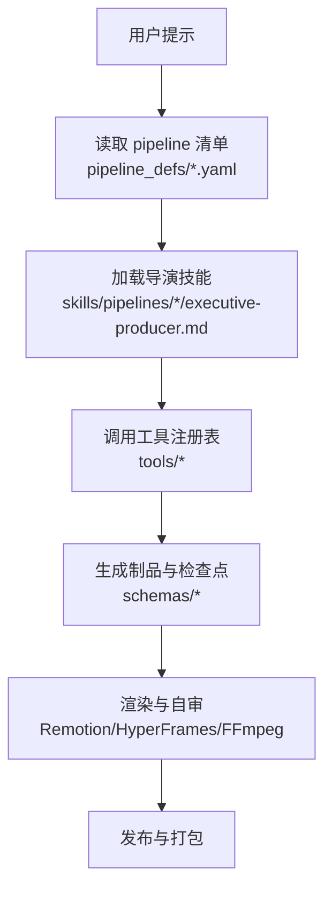
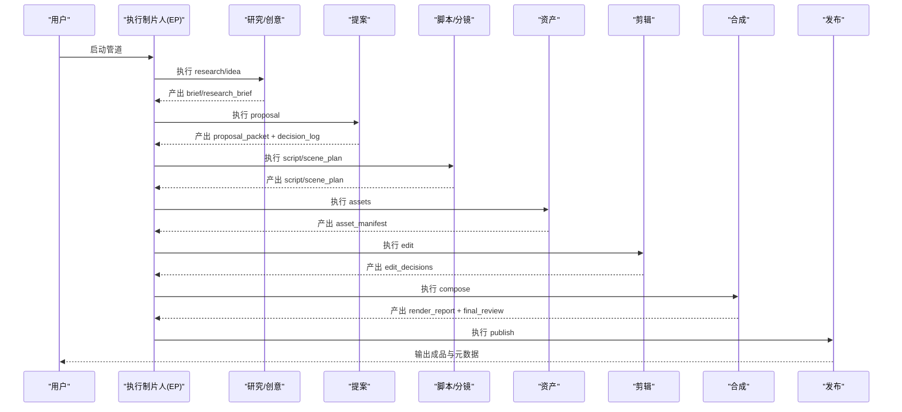
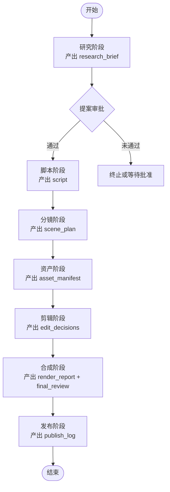
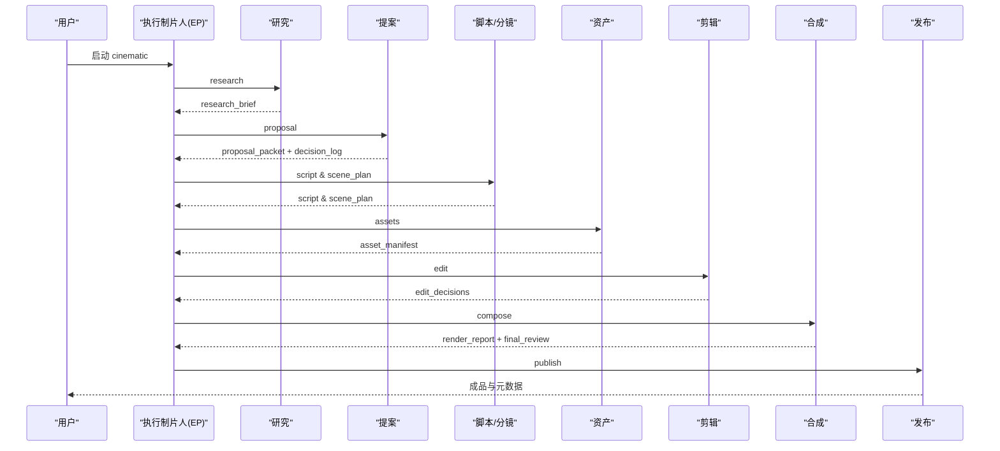
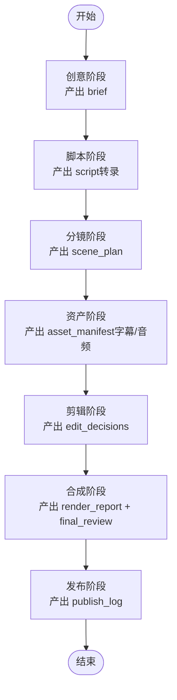
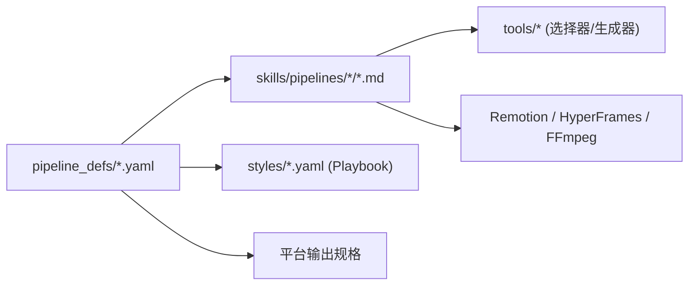

# 预定义管道详解

<cite>
**本文引用的文件**   
- [animation.yaml](file://pipeline_defs/animation.yaml)
- [cinematic.yaml](file://pipeline_defs/cinematic.yaml)
- [talking-head.yaml](file://pipeline_defs/talking-head.yaml)
- [animated-explainer.yaml](file://pipeline_defs/animated-explainer.yaml)
- [executive-producer.md（动画）](file://skills/pipelines/animation/executive-producer.md)
- [executive-producer.md（电影风格）](file://skills/pipelines/cinematic/executive-producer.md)
- [executive-producer.md（对话头像）](file://skills/pipelines/talking-head/executive-producer.md)
- [README.md](file://README.md)
</cite>

## 目录
1. [简介](#简介)
2. [项目结构](#项目结构)
3. [核心组件](#核心组件)
4. [架构总览](#架构总览)
5. [详细组件分析](#详细组件分析)
6. [依赖关系分析](#依赖关系分析)
7. [性能与成本考量](#性能与成本考量)
8. [故障排查指南](#故障排查指南)
9. [结论](#结论)
10. [附录：使用示例与配置模板](#附录使用示例与配置模板)

## 简介
本文件面向需要快速上手并深度掌握 OpenMontage 预定义管道的用户，聚焦以下三类核心管道：
- animation（动画解释器）：以动效、图表、数学可视化、程序化动画为主，强调研究先行、复用策略与文本/图示清晰度。
- cinematic（电影风格）：情绪驱动的电影感剪辑，适合预告片、品牌短片、蒙太奇与短剧式编辑，强调情感节奏、色彩一致性与音频动态。
- talking-head（对话头像）：基于真实拍摄素材的说话人视频，强调转录准确性、字幕同步、画面增强与音频处理。

每个管道都通过 YAML 清单定义阶段、工具链、质量门与成功标准；并通过“执行制片人（Executive Producer, EP）”技能串联各阶段，实现串行编排、跨阶段校验与预算治理。

## 项目结构
OpenMontage 将“可执行能力（tools）”“编排清单（pipeline_defs）”“导演技能（skills/pipelines/*）”“样式与平台输出（styles、平台配置）”解耦，形成三层知识体系：
- Layer 1：工具与清单——“有什么能力”
- Layer 2：技能——“如何按 OpenMontage 规范使用”
- Layer 3：外部技术知识包——“底层技术细节”

**章节来源**
- [README.md:450-486](file://README.md#L450-L486)

## 核心组件
- 管道清单（YAML）：定义名称、版本、类别、稳定性、参考输入支持、扩展项、必需技能、编排参数、兼容样式、阶段序列、每阶段的产物、可用工具、检查点策略、人工审批默认值、评审关注点与成功标准。
- 执行制片人（EP）：在每个管道中作为状态机与质量守门员，负责串行调度、跨阶段校验、预算控制、失败回滚与最终 QA。
- 导演技能（Markdown）：为每个阶段提供具体执行指引、评审要点与成功标准。
- 工具链：涵盖视频生成、图像生成、TTS、音乐、字幕、混音、转码、增强、分析等。
- 样式与平台：Playbook 控制视觉语言；内置平台输出规格便于一键适配。

**章节来源**
- [animation.yaml:1-62](file://pipeline_defs/animation.yaml#L1-L62)
- [cinematic.yaml:1-60](file://pipeline_defs/cinematic.yaml#L1-L60)
- [talking-head.yaml:1-42](file://pipeline_defs/talking-head.yaml#L1-L42)
- [executive-producer.md（动画）:32-116](file://skills/pipelines/animation/executive-producer.md#L32-L116)
- [executive-producer.md（电影风格）:18-55](file://skills/pipelines/cinematic/executive-producer.md#L18-L55)
- [executive-producer.md（对话头像）:45-105](file://skills/pipelines/talking-head/executive-producer.md#L45-L105)

## 架构总览
三个核心管道的共性流程：
research → proposal → script → scene_plan → assets → edit → compose → publish

差异在于：
- animation：强调研究先行、动画模式选择、复用策略、文本/图示清晰度与程序化动画（Manim/Remotion）。
- cinematic：强调情绪弧线、英雄镜头、色彩一致性、音乐节拍与运动承诺。
- talking-head：强调转录质量、字幕同步、覆盖完整性、增强可选与低成本处理。

**图表来源**
- [animation.yaml:62-300](file://pipeline_defs/animation.yaml#L62-L300)
- [cinematic.yaml:60-288](file://pipeline_defs/cinematic.yaml#L60-L288)
- [talking-head.yaml:42-229](file://pipeline_defs/talking-head.yaml#L42-L229)

## 详细组件分析

### 动画解释器（animation）
- 目标场景：动效图形、图表讲解、动态排版、数学可视化、Three.js 世界与风格化插画序列。
- 关键特点：
  - 研究先行：至少 3 个数据点、2 种动画技法参考、5 个以上引用来源。
  - 提案阶段锁定动画模式（image_animation/clip_video/manim/remotion_dataviz/diagram_stills/mixed）与复用策略（主题、布局系统、过渡家族、字体层级）。
  - 严格文本/图示清晰度要求：最终分辨率下文字可读、线条锐利、数学符号正确。
  - 预算治理：提案阶段给出逐项成本估算，生产阶段在预算内选择免费/本地优先路径。
- 阶段设计（节选）：
  - research：产出 research_brief，无工具依赖，无需检查点。
  - proposal：产出 proposal_packet + decision_log，需人工审批，包含动画模式、复用策略、音频架构、渲染运行时选择。
  - script：产出 script，字数与时长匹配，保留视觉停顿空间。
  - scene_plan：产出 scene_plan，每场景指定动画模式与视觉处理。
  - assets：产出 asset_manifest，明确每场景资产路径与生成方式，支持 TTS、图像/视频选择器、数学动画、3D 世界、音乐生成等。
  - edit：产出 edit_decisions，确保停顿与交错揭示不被压缩，音频旁白段配置 ducking。
  - compose：必须使用 video_compose 与 audio_mixer，可选 hyperframes_compose/video_stitch；通过后进行 ffprobe 验证与自审。
  - publish：产出 publish_log，包装平台所需元数据与缩略图概念。
- 质量控制点：
  - 提案审批（approval.status）
  - 文本/图示清晰度（compose 阶段）
  - 预算与工具可用性（assets 阶段）
  - 渲染运行时一致性（proposal 锁定，edit/compose 不得静默替换）
- 典型工具链：
  - 选择器：tts_selector、image_selector、video_selector
  - 生成：math_animate、diagram_gen、threejs_world、threejs_asset_catalog、atlas_3d、fal_3d、blender_world、music_gen/fal_elevenlabs_music
  - 合成：video_compose、hyperframes_compose、audio_mixer、video_stitch

**图表来源**
- [animation.yaml:62-300](file://pipeline_defs/animation.yaml#L62-L300)

**章节来源**
- [animation.yaml:1-300](file://pipeline_defs/animation.yaml#L1-L300)
- [executive-producer.md（动画）:32-116](file://skills/pipelines/animation/executive-producer.md#L32-L116)
- [executive-producer.md（动画）:205-342](file://skills/pipelines/animation/executive-producer.md#L205-L342)

### 电影风格（cinematic）
- 目标场景：预告片、品牌短片、蒙太奇、明确的 3D 世界漫游与短剧式剪辑。
- 关键特点：
  - 情绪驱动：构建→揭示→落地的清晰情感弧线。
  - 运动承诺：若声明 motion_required，则必须保持实际视频片段而非静态替代。
  - 色彩与音频：统一调色与受控的动态范围，标题卡与音效强化故事节拍。
  - 渲染运行时：通常选择 Remotion（CinematicRenderer），HTML/GSAP 驱动的片头/标题卡可使用 HyperFrames。
- 阶段设计（节选）：
  - research：至少 8 次网络搜索，产出具体视觉参考与声音方向。
  - proposal：至少 3 个不同情感弧的概念选项，明确交付承诺与成本明细。
  - script：节拍地图清晰，对白/标题卡克制且目的明确。
  - scene_plan：定义英雄镜头与揭示时刻，源素材优先。
  - assets：区分源选择与支持资产，限制生成插入内容，3D 世界需连贯场景图。
  - edit：保护强段落不被过度裁剪，音频 cue 与标题卡时机强化故事。
  - compose：保证输出情绪、运动承诺、音频动态与帧处理有效；禁止静默切换渲染运行时。
  - publish：主导出与衍生导出标注清晰，元数据匹配发行意图。
- 质量控制点：
  - 提案审批与交付承诺
  - 英雄镜头与色彩一致性
  - 运动承诺与音频动态
  - 渲染运行时锁定与合规性

**图表来源**
- [cinematic.yaml:60-288](file://pipeline_defs/cinematic.yaml#L60-L288)

**章节来源**
- [cinematic.yaml:1-288](file://pipeline_defs/cinematic.yaml#L1-L288)
- [executive-producer.md（电影风格）:18-192](file://skills/pipelines/cinematic/executive-producer.md#L18-L192)

### 对话头像（talking-head）
- 目标场景：演讲、播客、访谈、Vlog 等基于真实拍摄素材的说话人视频。
- 关键特点：
  - 素材优先：从原始素材出发，转录→剪辑→字幕→混音→合成。
  - 转录质量：平均词置信度阈值与时间戳单调性检查；必要时重转录。
  - 字幕同步：字幕 cue 与语音时间戳误差容忍 ±0.3s。
  - 增强可选：人脸增强、眼部提亮、色彩校正、降噪、自动重构图等。
  - 低成本：默认预算较低，主要消耗在分析与处理。
- 阶段设计（节选）：
  - idea：brief 准确反映素材内容与平台目标，需人工审批。
  - script：必须使用 transcriber，产出带时间戳的 script。
  - scene_plan：覆盖完整时长，识别增强机会与叠加层可行性。
  - assets：必须生成字幕，可选音频预处理与图片叠加。
  - edit：可选静音切割与速度控制，确保所有切点引用有效源文件。
  - compose：必须使用 video_compose 与 audio_mixer，可选多种增强与字幕烧录。
  - publish：结构化导出包与元数据。
- 质量控制点：
  - 素材可行性（音频存在、质量）
  - 转录质量与时间戳
  - 字幕同步与音频平衡
  - 输出有效性（ffprobe）

**图表来源**
- [talking-head.yaml:42-229](file://pipeline_defs/talking-head.yaml#L42-L229)

**章节来源**
- [talking-head.yaml:1-229](file://pipeline_defs/talking-head.yaml#L1-L229)
- [executive-producer.md（对话头像）:45-192](file://skills/pipelines/talking-head/executive-producer.md#L45-L192)

## 依赖关系分析
- 管道清单依赖导演技能：每个 stage 指向 skills/pipelines/<pipeline>/<director>.md。
- 导演技能依赖工具注册表：通过 tools/* 提供的选择器与生成器完成资源获取与处理。
- 样式与平台：compatible_playbooks 约束视觉语言；平台输出规格影响分辨率与画幅。
- 渲染运行时：proposal 阶段锁定 render_runtime（Remotion 或 HyperFrames），后续阶段不得静默替换。

**图表来源**
- [animation.yaml:30-62](file://pipeline_defs/animation.yaml#L30-L62)
- [cinematic.yaml:38-60](file://pipeline_defs/cinematic.yaml#L38-L60)
- [talking-head.yaml:17-42](file://pipeline_defs/talking-head.yaml#L17-L42)

**章节来源**
- [animation.yaml:30-62](file://pipeline_defs/animation.yaml#L30-L62)
- [cinematic.yaml:38-60](file://pipeline_defs/cinematic.yaml#L38-L60)
- [talking-head.yaml:17-42](file://pipeline_defs/talking-head.yaml#L17-L42)

## 性能与成本考量
- 预算治理：
  - 提案阶段给出逐项成本估算与供应商对比；生产阶段在剩余预算内调整工具选择。
  - 默认预算：animation 与 cinematic 为 $2.00，talking-head 为 $0.50。
- 渲染运行时：
  - Remotion 适合数据驱动与 React 场景栈；HyperFrames 适合 HTML/GSAP 动效与程序化动效。
  - 运行时在提案阶段锁定，任何变更需在决策日志中记录。
- 工具选择：
  - 优先使用选择器（tts_selector、image_selector、video_selector）而非直接调用提供商工具。
  - 长片段优先（如 10s 优于 5s）以减少 API 调用与成本。
- 质量与效率平衡：
  - 文本/图示清晰度与运动一致性是动画管道的关键瓶颈，需在 compose 阶段验证。
  - 电影风格需保护强段落与情绪节奏，避免过度裁剪与过度调色。
  - 对话头像需严格控制转录质量与字幕同步，避免下游错误传播。

**章节来源**
- [animation.yaml:45-62](file://pipeline_defs/animation.yaml#L45-L62)
- [cinematic.yaml:24-36](file://pipeline_defs/cinematic.yaml#L24-L36)
- [talking-head.yaml:29-42](file://pipeline_defs/talking-head.yaml#L29-L42)
- [executive-producer.md（动画）:286-342](file://skills/pipelines/animation/executive-producer.md#L286-L342)
- [executive-producer.md（电影风格）:125-158](file://skills/pipelines/cinematic/executive-producer.md#L125-L158)
- [executive-producer.md（对话头像）:244-285](file://skills/pipelines/talking-head/executive-producer.md#L244-L285)

## 故障排查指南
- 常见失败模式：
  - 动画：文本模糊、图示失真、数学符号渲染错误、运动时序被压缩。
  - 电影风格：情绪节奏被打乱、色彩不一致、音频动态失控、运动承诺降级。
  - 对话头像：转录置信度低、字幕漂移、覆盖缺口、音频噪声。
- 定位方法：
  - 检查点与决策日志：查看 proposal 阶段的 approval 与 render_runtime 锁定。
  - 工具可用性：确认选择器与生成器是否可用，必要时提供设置指引。
  - 输出探测：使用 ffprobe 验证容器、分辨率、音频通道与时长。
  - 自审流程：帧抽取、音频电平分析、字幕存在性检查。
- 修复策略：
  - 动画：返回 compose 调整分辨率/缩放，或返回 assets 重新生成；必要时返回 scene_plan 调整过渡与停顿。
  - 电影风格：返回 edit 保护强段落，返回 assets 调整音乐/插入内容，返回 compose 调整调色与动态。
  - 对话头像：返回 script 重转录，返回 assets 重新生成字幕，返回 edit 修正切点与覆盖。

**章节来源**
- [executive-producer.md（动画）:386-410](file://skills/pipelines/animation/executive-producer.md#L386-L410)
- [executive-producer.md（电影风格）:160-192](file://skills/pipelines/cinematic/executive-producer.md#L160-L192)
- [executive-producer.md（对话头像）:338-361](file://skills/pipelines/talking-head/executive-producer.md#L338-L361)

## 结论
- animation 适合以动效与程序化动画为核心的内容，强调研究、复用与文本/图示清晰度。
- cinematic 适合情绪驱动的电影感作品，强调情感弧线、色彩与音频动态。
- talking-head 适合基于真实素材的说话人视频，强调转录质量、字幕同步与低成本处理。
- 通过 YAML 清单与 EP 技能，OpenMontage 实现了可审计、可治理、可扩展的视频生产流水线。

## 附录：使用示例与配置模板
- 选择管道：根据业务目标选择 animation、cinematic 或 talking-head。
- 准备素材：
  - animation：主题与参考视频（可选），明确动画模式与复用策略。
  - cinematic：情绪参考、音乐方向、运动需求。
  - talking-head：原始素材（含音频）、目标平台与时长。
- 运行步骤（通用）：
  - 安装与激活环境，配置必要 API Key（可选）。
  - 在 AI 编码助手内描述需求，选择对应管道。
  - 审阅提案与关键检查点，批准后再进入生产。
  - 查看 Backlot 看板，跟踪阶段进度与制品。
  - 完成后导出与发布。

- 配置模板（以 YAML 清单为核心）：
  - 名称/版本/类别/稳定性：用于标识与兼容性。
  - 参考输入支持：启用视频分析工具集。
  - 扩展项：允许自定义脚本、样式与技能。
  - 必需技能：列出各阶段导演技能与元技能。
  - 编排参数：模式、默认预算、最大修订次数、超时。
  - 兼容样式：推荐与可用的 Playbook。
  - 阶段序列：每阶段的 skill、produces、tools_available、checkpoint_required、human_approval_default、review_focus、success_criteria。

- 实际示例（路径引用）：
  - 动画解释器：[animation.yaml](file://pipeline_defs/animation.yaml)
  - 电影风格：[cinematic.yaml](file://pipeline_defs/cinematic.yaml)
  - 对话头像：[talking-head.yaml](file://pipeline_defs/talking-head.yaml)
  - 动画解释器（另一种）：[animated-explainer.yaml](file://pipeline_defs/animated-explainer.yaml)

**章节来源**
- [README.md:180-216](file://README.md#L180-L216)
- [animation.yaml:1-300](file://pipeline_defs/animation.yaml#L1-L300)
- [cinematic.yaml:1-288](file://pipeline_defs/cinematic.yaml#L1-L288)
- [talking-head.yaml:1-229](file://pipeline_defs/talking-head.yaml#L1-L229)
- [animated-explainer.yaml:1-270](file://pipeline_defs/animated-explainer.yaml#L1-L270)