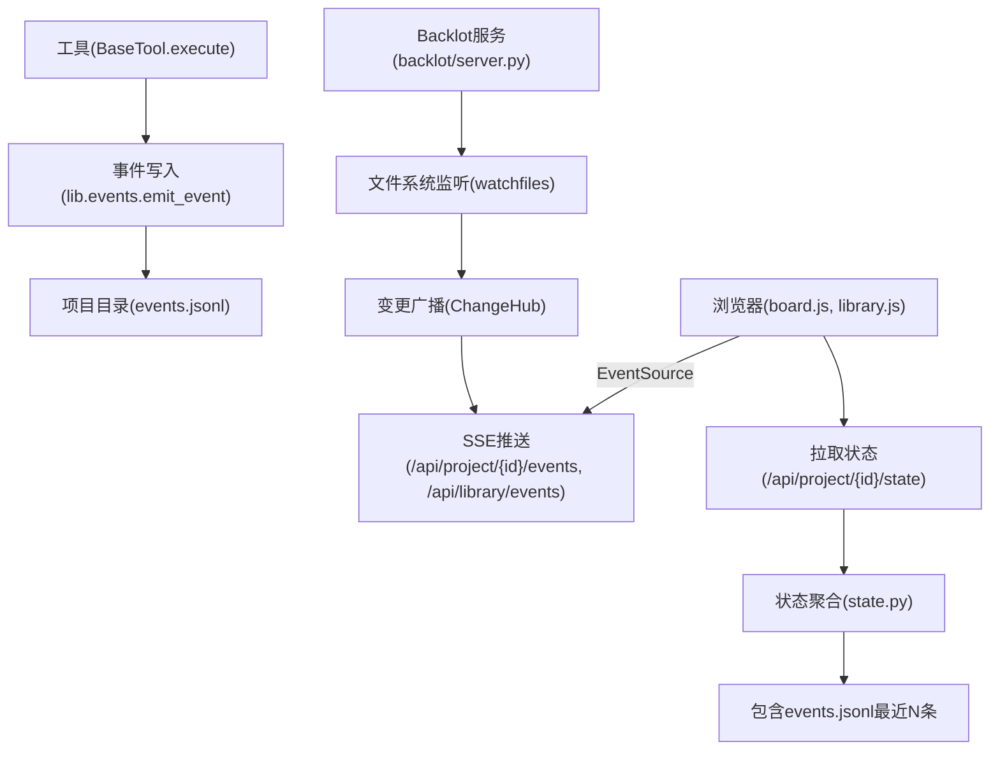
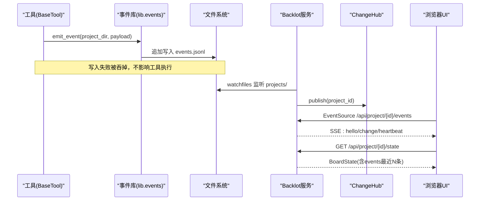
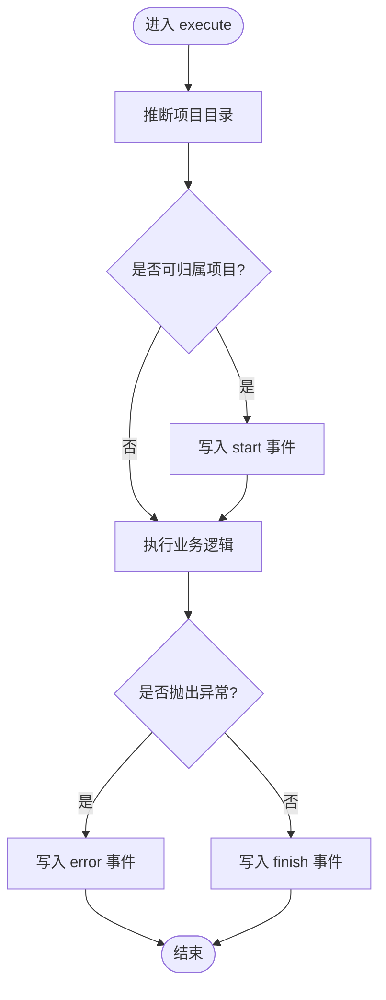
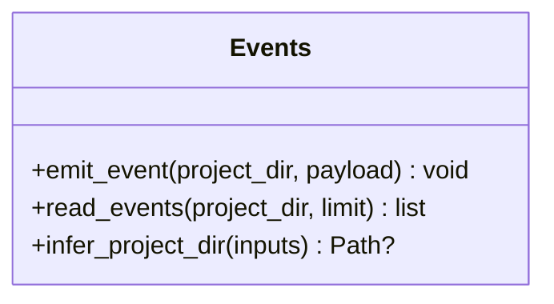
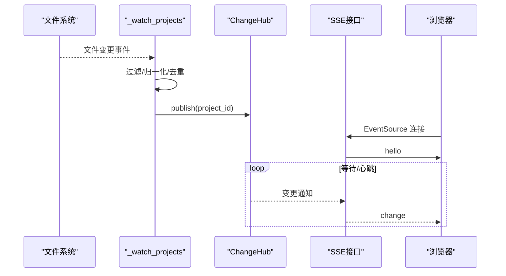
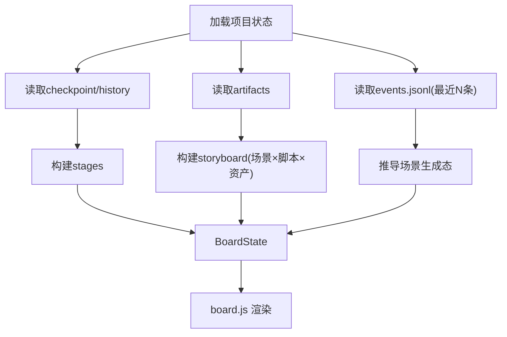
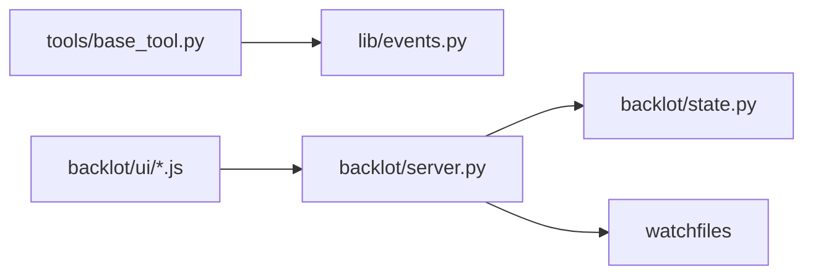

# 事件系统

<cite>
**本文引用的文件**
- [lib/events.py](file://lib/events.py)
- [tools/base_tool.py](file://tools/base_tool.py)
- [backlot/server.py](file://backlot/server.py)
- [backlot/state.py](file://backlot/state.py)
- [backlot/ui/board.js](file://backlot/ui/board.js)
- [backlot/ui/lib.js](file://backlot/ui/lib.js)
- [backlot/ui/library.js](file://backlot/ui/library.js)
- [tests/contracts/test_backlot_contract.py](file://tests/contracts/test_backlot_contract.py)
</cite>

## 目录
1. [简介](#简介)
2. [项目结构](#项目结构)
3. [核心组件](#核心组件)
4. [架构总览](#架构总览)
5. [详细组件分析](#详细组件分析)
6. [依赖关系分析](#依赖关系分析)
7. [性能与扩展性](#性能与扩展性)
8. [故障排查指南](#故障排查指南)
9. [结论](#结论)
10. [附录：事件消息格式规范](#附录事件消息格式规范)

## 简介
本技术文档聚焦 OpenMontage 的事件驱动架构，围绕以下目标展开：
- 解释事件系统的核心概念：事件类型、发布订阅模式、异步事件处理机制。
- 深入分析 Backlot 监控界面如何实时接收和处理管道执行事件，实现进度跟踪和状态更新。
- 说明事件消息格式规范（元数据、负载数据、错误信息）。
- 阐述事件流生命周期管理：创建、路由、处理、清理。
- 讨论分布式环境下的扩展性与可靠性保证。
- 提供事件调试与监控的最佳实践。

## 项目结构
OpenMontage 的事件系统由“工具侧埋点”、“事件持久化”、“服务端监听与推送”、“前端消费”四部分组成：
- 工具侧埋点：BaseTool 在执行前后自动注入事件发射逻辑，将 start/finish/error 写入项目的 events.jsonl。
- 事件持久化：lib/events.py 提供 emit_event/read_events/infer_project_dir，负责追加写入与容错读取。
- 服务端监听与推送：backlot/server.py 使用 watchfiles 监听 projects/ 变更，通过 SSE（Server-Sent Events）向浏览器推送变更通知。
- 前端消费：board.js/library.js 通过 EventSource 订阅 SSE，收到 change 后刷新看板或库视图。

图表来源
- [tools/base_tool.py:148-224](file://tools/base_tool.py#L148-L224)
- [lib/events.py:46-119](file://lib/events.py#L46-L119)
- [backlot/server.py:132-242](file://backlot/server.py#L132-L242)
- [backlot/state.py:588-658](file://backlot/state.py#L588-L658)
- [backlot/ui/lib.js:66-81](file://backlot/ui/lib.js#L66-L81)

章节来源
- [tools/base_tool.py:148-224](file://tools/base_tool.py#L148-L224)
- [lib/events.py:46-119](file://lib/events.py#L46-L119)
- [backlot/server.py:132-242](file://backlot/server.py#L132-L242)
- [backlot/state.py:588-658](file://backlot/state.py#L588-L658)
- [backlot/ui/lib.js:66-81](file://backlot/ui/lib.js#L66-L81)

## 核心组件
- 工具埋点层（tools/base_tool.py）
  - 自动包装 execute()，在调用前后发射 start/finish/error 事件。
  - 通过 infer_project_dir 推断归属项目，避免侵入业务代码。
  - 支持嵌套深度 depth，便于上层去重统计成本等。
- 事件存储层（lib/events.py）
  - 追加式 JSONL 文件 per project：events.jsonl。
  - 线程安全写入（进程间无锁，但单行 O_APPEND 写具备原子性保障）。
  - 读取时容忍损坏行，确保看板不崩溃。
- 服务端监听与推送（backlot/server.py）
  - watchfiles 监听 projects/ 变更，过滤无关路径，按项目去重。
  - ChangeHub 维护每个订阅者的队列，按项目过滤广播。
  - SSE 接口：/api/project/{project_id}/events 与 /api/library/events，心跳保活。
- 状态聚合（backlot/state.py）
  - 从 checkpoint/history/artifacts/events 构建 BoardState。
  - 计算 stages、storyboard、media、cost、live/stalled 等。
  - 读取 events.jsonl 最近 N 条用于活动面板与生成态判断。
- 前端消费（backlot/ui/*.js）
  - board.js 渲染项目看板，library.js 渲染项目库。
  - lib.js 提供 subscribe(EventSource) 统一订阅 SSE，收到 change 后节流刷新。

章节来源
- [tools/base_tool.py:148-224](file://tools/base_tool.py#L148-L224)
- [lib/events.py:46-119](file://lib/events.py#L46-L119)
- [backlot/server.py:43-74](file://backlot/server.py#L43-L74)
- [backlot/server.py:132-242](file://backlot/server.py#L132-L242)
- [backlot/state.py:588-658](file://backlot/state.py#L588-L658)
- [backlot/ui/lib.js:66-81](file://backlot/ui/lib.js#L66-L81)

## 架构总览
下图展示了事件从产生到展示的全链路：

图表来源
- [tools/base_tool.py:148-224](file://tools/base_tool.py#L148-L224)
- [lib/events.py:77-119](file://lib/events.py#L77-L119)
- [backlot/server.py:132-242](file://backlot/server.py#L132-L242)
- [backlot/state.py:588-658](file://backlot/state.py#L588-L658)

## 详细组件分析

### 事件埋点与发布（BaseTool 自动注入）
- 设计要点
  - 非侵入：所有 BaseTool 子类无需手动埋点，execute 自动被装饰器包裹。
  - 可观测性优先但不影响生产：事件层异常被吞，绝不中断工具执行。
  - 自动归属：infer_project_dir 基于输入参数推断项目根目录，仅对 projects/ 下路径生效。
  - 嵌套深度：selector→provider 的嵌套调用中，depth 字段帮助消费者区分顶层与子调用。
- 关键流程
  - 进入 execute：记录开始时间、tool、scene_id、depth，发射 start。
  - 执行成功：发射 finish，携带 success、duration_s、cost_usd。
  - 执行异常：发射 error，携带 error 摘要与 duration_s，并重新抛出异常。
- 复杂度与性能
  - 每次调用额外开销为一次 JSON 序列化 + 一次文件追加写，极低。
  - 并发安全：线程级写锁；跨进程无锁，但单行追加写具备近似原子性。

图表来源
- [tools/base_tool.py:148-224](file://tools/base_tool.py#L148-L224)

章节来源
- [tools/base_tool.py:148-224](file://tools/base_tool.py#L148-L224)

### 事件存储与读取（lib/events.py）
- 设计要点
  - 追加式 JSONL：每项目一个 events.jsonl，顺序追加，读端容忍损坏行。
  - 项目归属：仅接受 projects/ 下的路径，防止误写外部目录。
  - 线程安全：写锁保护同一进程内并发写入；跨进程无锁，但单行写入通常不会撕裂。
- 关键函数
  - infer_project_dir(inputs)：从显式键或路径提示推断项目根。
  - emit_event(project_dir, payload)：追加一行 JSON，永不抛错。
  - read_events(project_dir, limit)：读取最近 N 条，忽略非法行。
- 复杂度与性能
  - 写入 O(1)，读取 O(N)。limit 控制内存占用。
  - 容错：OSError/JSONDecodeError 均被捕获，返回空或跳过坏行。

图表来源
- [lib/events.py:46-119](file://lib/events.py#L46-L119)

章节来源
- [lib/events.py:46-119](file://lib/events.py#L46-L119)

### 服务端监听与 SSE 推送（backlot/server.py）
- 设计要点
  - 文件系统监听：watchfiles 监听 projects/，过滤 node_modules/.git/__pycache__/.cache 等噪声。
  - 变更广播：ChangeHub 为每个订阅者维护队列，支持按项目过滤，避免无关项目风暴。
  - SSE 接口：
    - /api/project/{project_id}/events：订阅特定项目变更。
    - /api/library/events：订阅全局变更（库视图用）。
  - 心跳：每 15 秒发送 heartbeat，保持连接活跃。
  - 缓存失效：变更时清除对应项目的 summary 缓存，下次请求重新计算。
- 关键流程
  - 启动：创建后台任务 _watch_projects。
  - 监听：awatch 批量收集变更，映射到 project_id，去重后 hub.publish。
  - 订阅：客户端建立 EventSource，服务端循环等待队列，合并突发，推送 change。
  - 断开：检测 request.is_disconnected 及时退出。

图表来源
- [backlot/server.py:132-242](file://backlot/server.py#L132-L242)
- [backlot/server.py:43-74](file://backlot/server.py#L43-L74)

章节来源
- [backlot/server.py:43-74](file://backlot/server.py#L43-L74)
- [backlot/server.py:132-242](file://backlot/server.py#L132-L242)

### 状态聚合与看板渲染（backlot/state.py + board.js）
- 状态聚合
  - 读取 checkpoint/history/artifacts/events，构建 stages、storyboard、media、cost、live/stalled。
  - 从 events.jsonl 推导场景级“正在生成”状态（start 未闭合视为生成中）。
  - 计算 last_activity，结合 LIVE_WINDOW_SECONDS 与 STALL_WINDOW_SECONDS 判定 live 与 stalled。
- 前端渲染
  - board.js 渲染阶段轨道、脚本卡片、故事板胶片、活动面板等。
  - 活动面板根据 events 列表显示运行中的工具、完成/错误状态、耗时与成本。
  - 生成态：若某 scene 的最近顶层事件为 start 且未 finish/error，则标记 generating。

图表来源
- [backlot/state.py:588-658](file://backlot/state.py#L588-L658)
- [backlot/state.py:403-495](file://backlot/state.py#L403-L495)
- [backlot/ui/board.js:610-658](file://backlot/ui/board.js#L610-L658)

章节来源
- [backlot/state.py:403-495](file://backlot/state.py#L403-L495)
- [backlot/state.py:588-658](file://backlot/state.py#L588-L658)
- [backlot/ui/board.js:610-658](file://backlot/ui/board.js#L610-L658)

### 库视图与全局事件（library.js）
- 功能
  - 获取项目列表，展示海报、管线类型、场景数、渲染数、最近活动时间。
  - 订阅 /api/library/events，收到任意项目变更时刷新库视图。
- 交互
  - 点击卡片进入项目看板 /p/{project_id}。
  - 主题切换、轻量级迷你阶段轨展示。

章节来源
- [backlot/ui/library.js:1-92](file://backlot/ui/library.js#L1-L92)

## 依赖关系分析
- 模块耦合
  - tools/base_tool.py → lib/events.py：工具埋点依赖事件写入。
  - backlot/server.py → backlot/state.py：服务端状态查询依赖状态聚合。
  - backlot/server.py → watchfiles：文件系统监听。
  - backlot/ui/*.js → backlot/server.py：前端通过 HTTP/SSE 消费后端能力。
- 外部依赖
  - FastAPI：HTTP 服务与流式响应。
  - watchfiles：高效文件变更监听。
  - EventSource：浏览器原生 SSE 客户端。
- 潜在循环依赖
  - 当前未见循环导入；各层职责清晰，单向依赖。

图表来源
- [tools/base_tool.py:148-224](file://tools/base_tool.py#L148-L224)
- [backlot/server.py:132-242](file://backlot/server.py#L132-L242)
- [backlot/state.py:588-658](file://backlot/state.py#L588-L658)

章节来源
- [tools/base_tool.py:148-224](file://tools/base_tool.py#L148-L224)
- [backlot/server.py:132-242](file://backlot/server.py#L132-L242)
- [backlot/state.py:588-658](file://backlot/state.py#L588-L658)

## 性能与扩展性
- 性能特性
  - 事件写入：单行追加写，极低成本；线程锁仅保护同进程并发。
  - 事件读取：限制最近 N 条，避免大文件全量读取。
  - 监听与广播：watchfiles 批量处理，ChangeHub 队列限流，避免 UI 抖动。
  - 缩略图与媒体：按需生成与缓存，减少带宽与 IO。
- 扩展性建议
  - 多进程/多机部署：
    - 将 events.jsonl 迁移至共享存储（如对象存储+索引），或使用消息队列（Redis Streams/Kafka）替代本地文件。
    - 将 ChangeHub 替换为集中式事件总线，支持跨进程/跨实例广播。
  - 高吞吐：
    - 增加批处理写入与压缩归档策略。
    - 前端采用增量 diff 与虚拟滚动，降低渲染压力。
  - 可靠性：
    - 引入幂等与去重（event id），支持断线重连后的补发。
    - 增加事件落盘校验与修复工具。

[本节为通用指导，不直接分析具体文件]

## 故障排查指南
- 常见问题
  - 事件未出现：检查 infer_project_dir 是否能正确推断项目；确认输出路径位于 projects/ 下。
  - 看板不刷新：确认 SSE 连接正常（hello/change/heartbeat），检查服务器日志与防火墙。
  - 卡顿或假死：关注 stalled 标记（长时间无活动），检查 agent 是否卡住。
  - 媒体无法显示：确认 /media 与 /thumb 路径权限与存在性。
- 定位方法
  - 查看 events.jsonl 内容，验证 start/finish/error 是否成对出现。
  - 使用测试用例验证埋点行为（见下方“测试参考”）。
  - 通过 /api/health 检查服务健康。
- 恢复措施
  - 清理临时文件（node_modules/.git/__pycache__/.cache）以减少监听噪音。
  - 重启服务以重建 watcher 与缓存。

章节来源
- [tests/contracts/test_backlot_contract.py:167-245](file://tests/contracts/test_backlot_contract.py#L167-L245)

## 结论
OpenMontage 的事件系统以“工具埋点 + 追加式 JSONL + 文件系统监听 + SSE 推送”为核心，实现了低侵入、高可靠、易扩展的实时可观测性方案。Backlot 看板通过状态聚合与事件流，提供了项目级与场景级的进度跟踪、人工审批门控与问题定位能力。未来可通过消息队列与共享存储进一步增强分布式能力与可靠性。

[本节为总结，不直接分析具体文件]

## 附录：事件消息格式规范
- 事件元数据
  - ts：ISO 时间戳（UTC）。
  - tool：触发事件的工具名。
  - scene_id：场景标识（可选）。
  - depth：调用嵌套深度（可选，用于去重与统计）。
- 负载数据
  - event：事件类型，取值包括 start、finish、error。
  - output_path：输出路径（可选）。
  - success：finish 时指示是否成功（布尔，可选）。
  - duration_s：耗时（秒，浮点数，可选）。
  - cost_usd：成本（美元，浮点数，可选）。
  - error：错误信息摘要（字符串，可选）。
- 错误信息结构
  - error 字段为字符串摘要，长度受限（例如截断至 300 字符），避免污染日志。
- 示例（示意，非代码）
  - start：{ts, tool, scene_id, depth, event:"start", output_path}
  - finish：{ts, tool, scene_id, depth, event:"finish", success, duration_s, cost_usd, output_path}
  - error：{ts, tool, scene_id, depth, event:"error", error, duration_s}

章节来源
- [tools/base_tool.py:182-220](file://tools/base_tool.py#L182-L220)
- [lib/events.py:77-119](file://lib/events.py#L77-L119)
- [tests/contracts/test_backlot_contract.py:167-245](file://tests/contracts/test_backlot_contract.py#L167-L245)