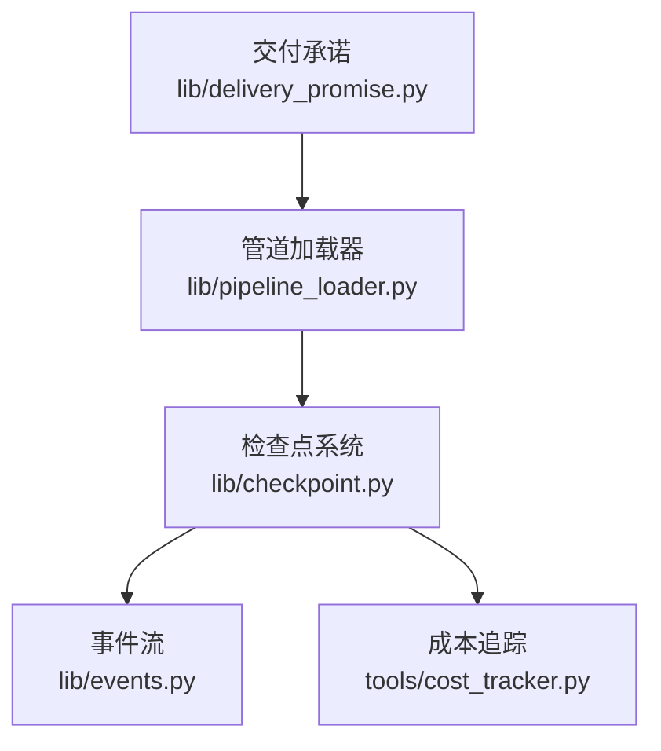
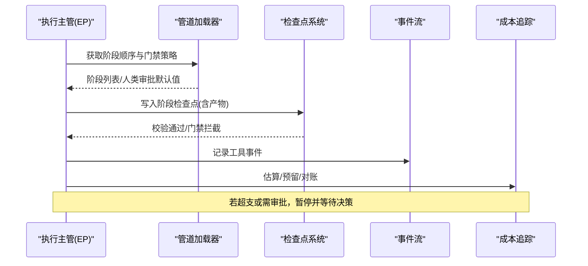
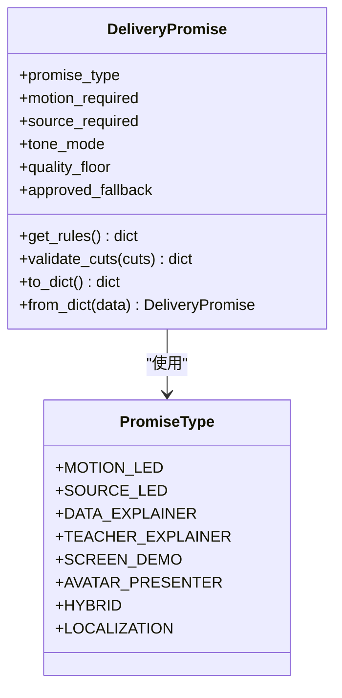
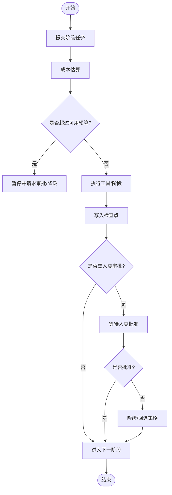
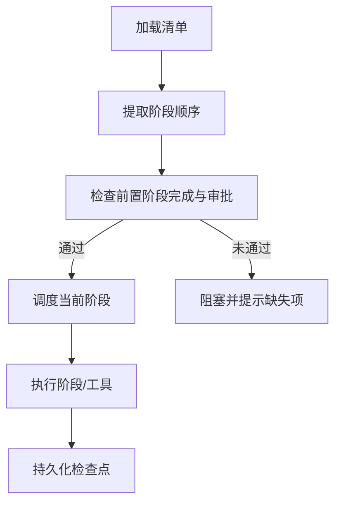
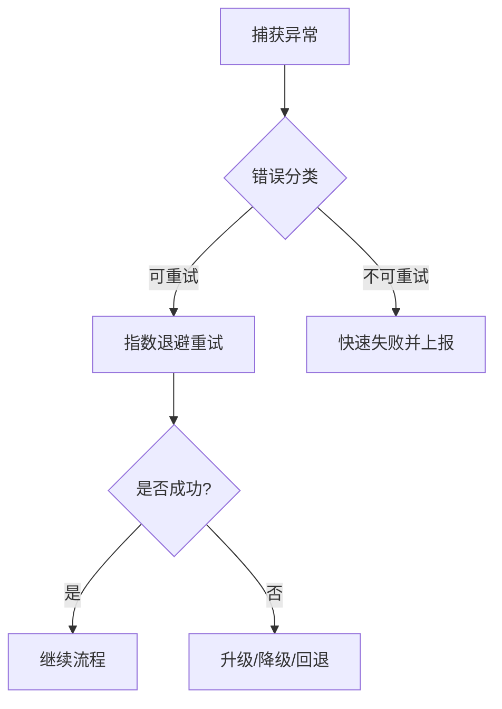
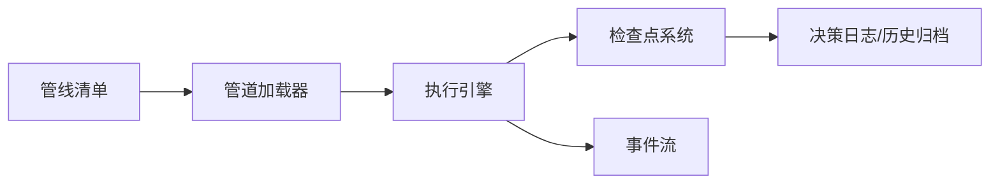
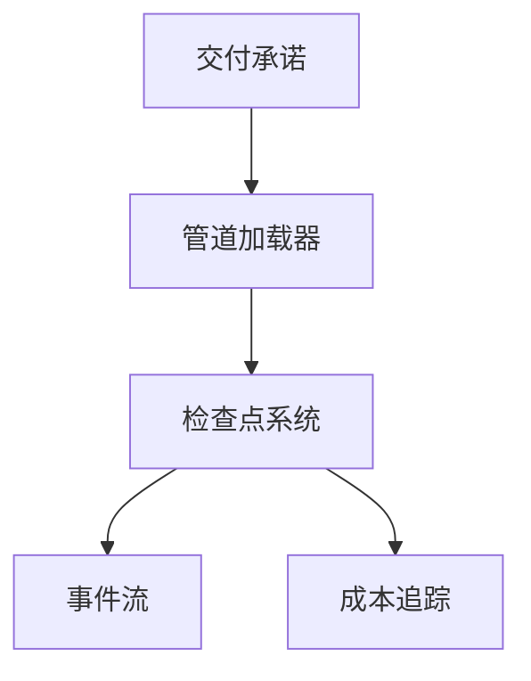

# 交付承诺机制

<cite>
**本文引用的文件**
- [lib/delivery_promise.py](file://lib/delivery_promise.py)
- [lib/checkpoint.py](file://lib/checkpoint.py)
- [lib/pipeline_loader.py](file://lib/pipeline_loader.py)
- [lib/events.py](file://lib/events.py)
- [tools/cost_tracker.py](file://tools/cost_tracker.py)
- [tests/tools/test_delivery_promise.py](file://tests/tools/test_delivery_promise.py)
</cite>

## 目录
1. [简介](#简介)
2. [项目结构](#项目结构)
3. [核心组件](#核心组件)
4. [架构总览](#架构总览)
5. [详细组件分析](#详细组件分析)
6. [依赖关系分析](#依赖关系分析)
7. [性能考虑](#性能考虑)
8. [故障排查指南](#故障排查指南)
9. [结论](#结论)
10. [附录](#附录)

## 简介
本技术文档聚焦 OpenMontage 的“交付承诺机制”，围绕异步任务管理模式（提交、状态跟踪、结果回调）、交付承诺的数据结构与校验规则、任务调度与执行顺序优化、错误处理与重试策略，以及与管道执行引擎的集成方式展开。目标是帮助读者理解系统如何在不降低质量的前提下可靠地编排和执行多阶段、跨工具的生产流水线，并在出现异常或资源受限时自动降级与恢复。

## 项目结构
OpenMontage 将“交付承诺”作为生产管线在提案阶段的约束契约，贯穿后续的资源选择、阶段推进、人工门禁与审计。关键模块职责如下：
- 交付承诺分类与校验：定义承诺类型、规则与剪辑运动量阈值，确保不静默降级。
- 管道加载器：解析并缓存管线清单，提供阶段顺序、人类审批默认值等元数据。
- 检查点系统：持久化阶段状态、产物、门禁决策与审计日志，保证可恢复与可审计。
- 事件流：记录工具调用活动，支撑可视化与监控。
- 成本追踪：预算估算、预留、超支控制与事后对账，保障经济性与可控性。

**图表来源**
- [lib/delivery_promise.py:18-79](file://lib/delivery_promise.py#L18-L79)
- [lib/pipeline_loader.py:125-182](file://lib/pipeline_loader.py#L125-L182)
- [lib/checkpoint.py:422-564](file://lib/checkpoint.py#L422-L564)
- [lib/events.py:77-95](file://lib/events.py#L77-L95)
- [tools/cost_tracker.py:101-171](file://tools/cost_tracker.py#L101-L171)

**章节来源**
- [lib/delivery_promise.py:18-79](file://lib/delivery_promise.py#L18-L79)
- [lib/pipeline_loader.py:125-182](file://lib/pipeline_loader.py#L125-L182)
- [lib/checkpoint.py:422-564](file://lib/checkpoint.py#L422-L564)
- [lib/events.py:77-95](file://lib/events.py#L77-L95)
- [tools/cost_tracker.py:101-171](file://tools/cost_tracker.py#L101-L171)

## 核心组件
- 交付承诺分类器：根据管线类型与用户意图推断承诺类型，锁定质量底线与是否允许静态回退。
- 管道加载器：提供阶段顺序、子阶段、人类审批默认值、能力扩展许可等元数据。
- 检查点系统：以 JSON 形式持久化每个阶段的产物与状态，强制执行前置阶段完成与人类门禁。
- 事件流：追加式写入工具事件，供前端与监控消费。
- 成本追踪：估算-预留-对账闭环，支持观察/警告/封顶模式与单动作审批阈值。

**章节来源**
- [lib/delivery_promise.py:82-193](file://lib/delivery_promise.py#L82-L193)
- [lib/pipeline_loader.py:125-182](file://lib/pipeline_loader.py#L125-L182)
- [lib/checkpoint.py:422-564](file://lib/checkpoint.py#L422-L564)
- [lib/events.py:77-95](file://lib/events.py#L77-L95)
- [tools/cost_tracker.py:101-171](file://tools/cost_tracker.py#L101-L171)

## 架构总览
交付承诺机制与管道执行引擎通过“清单-阶段-检查点-事件-成本”五层协作，形成从承诺到落地的闭环：
- 提案阶段：基于管线类型和用户意图生成交付承诺，锁定质量与回退策略。
- 编排阶段：依据清单获取阶段顺序与门禁策略，按依赖推进。
- 执行阶段：各阶段产出产物并写入检查点；必要时触发人类审批。
- 观测阶段：事件流记录工具调用，成本追踪记录预算使用。
- 恢复阶段：读取最近检查点与历史归档，支持断点续跑与审计回溯。

**图表来源**
- [lib/pipeline_loader.py:125-182](file://lib/pipeline_loader.py#L125-L182)
- [lib/checkpoint.py:422-564](file://lib/checkpoint.py#L422-L564)
- [lib/events.py:77-95](file://lib/events.py#L77-L95)
- [tools/cost_tracker.py:101-171](file://tools/cost_tracker.py#L101-L171)

## 详细组件分析

### 交付承诺数据结构与校验
- 承诺类型：包括运动主导、素材主导、数据解释、教师讲解、屏幕演示、虚拟发言人、混合、本地化等。
- 规则集：每种类型定义是否允许静态回退、是否需要视频生成、最低运动比例等。
- DeliveryPromise：封装承诺类型、是否必须运动、是否必须源素材、基调模式、质量下限与已批准的回退策略。
- validate_cuts：统计真实运动剪辑、动画幻灯片与静态剪辑数量，计算运动比例，并与规则对比，输出有效性、违规项与指标。

**图表来源**
- [lib/delivery_promise.py:18-79](file://lib/delivery_promise.py#L18-L79)
- [lib/delivery_promise.py:82-193](file://lib/delivery_promise.py#L82-L193)

**章节来源**
- [lib/delivery_promise.py:18-79](file://lib/delivery_promise.py#L18-L79)
- [lib/delivery_promise.py:82-193](file://lib/delivery_promise.py#L82-L193)
- [tests/tools/test_delivery_promise.py:4-26](file://tests/tools/test_delivery_promise.py#L4-L26)

### 任务提交、状态跟踪与结果回调
- 任务提交：由上层编排器（如执行主管）决定当前阶段与所需工具，调用工具执行并估算成本。
- 状态跟踪：每个阶段完成后写入检查点，包含产物、状态、时间戳、人类审批标记与可选审查意见。
- 结果回调：事件流以追加式 JSONL 记录工具调用事件，供看板与监控消费；成本追踪记录估算、预留与实际花费。

**图表来源**
- [lib/checkpoint.py:422-564](file://lib/checkpoint.py#L422-L564)
- [tools/cost_tracker.py:101-171](file://tools/cost_tracker.py#L101-L171)
- [lib/events.py:77-95](file://lib/events.py#L77-L95)

**章节来源**
- [lib/checkpoint.py:422-564](file://lib/checkpoint.py#L422-L564)
- [tools/cost_tracker.py:101-171](file://tools/cost_tracker.py#L101-L171)
- [lib/events.py:77-95](file://lib/events.py#L77-L95)

### 任务调度算法与依赖优化
- 阶段顺序：从管线清单中解析阶段顺序，支持主阶段与子阶段组合，确保不同管线的正确推进。
- 前置依赖：检查点写入时强制要求前置阶段已完成且通过必要的人类审批，避免非法推进。
- 并行化建议：对于无相互依赖的工具调用，采用并发策略最大化吞吐；对存在部分依赖的任务，优先构建所有 Promise 并在最后统一等待，以减少水床效应。

**图表来源**
- [lib/pipeline_loader.py:125-149](file://lib/pipeline_loader.py#L125-L149)
- [lib/checkpoint.py:284-346](file://lib/checkpoint.py#L284-L346)

**章节来源**
- [lib/pipeline_loader.py:125-149](file://lib/pipeline_loader.py#L125-L149)
- [lib/checkpoint.py:284-346](file://lib/checkpoint.py#L284-L346)

### 错误处理与重试策略
- 门禁与前置校验：检查点写入时进行强校验，违反前置条件或门禁策略直接抛出错误，防止静默失败。
- 成本超支与审批：成本追踪在封顶模式下拒绝超额预留，在警告模式下标记警告；单动作超阈需审批。
- 重试建议：对外部 API 的临时错误（如限流、服务端错误）可采用指数退避重试；内容违规等不可重试错误应快速失败。

**图表来源**
- [tools/cost_tracker.py:101-171](file://tools/cost_tracker.py#L101-L171)
- [lib/checkpoint.py:422-564](file://lib/checkpoint.py#L422-L564)

**章节来源**
- [tools/cost_tracker.py:101-171](file://tools/cost_tracker.py#L101-L171)
- [lib/checkpoint.py:422-564](file://lib/checkpoint.py#L422-L564)

### 与管道执行引擎的集成
- 清单驱动：执行引擎通过管道加载器获取阶段顺序、人类审批默认值与工具能力集合，确保执行路径一致。
- 门禁集成：检查点系统在写入时读取清单中的人类审批默认值，强制门禁策略，避免绕过。
- 审计与恢复：检查点历史归档与决策日志合并，便于回放与审计；事件流提供实时活动视图。

**图表来源**
- [lib/pipeline_loader.py:125-182](file://lib/pipeline_loader.py#L125-L182)
- [lib/checkpoint.py:422-564](file://lib/checkpoint.py#L422-L564)
- [lib/events.py:77-95](file://lib/events.py#L77-L95)

**章节来源**
- [lib/pipeline_loader.py:125-182](file://lib/pipeline_loader.py#L125-L182)
- [lib/checkpoint.py:422-564](file://lib/checkpoint.py#L422-L564)
- [lib/events.py:77-95](file://lib/events.py#L77-L95)

## 依赖关系分析
- 低耦合高内聚：交付承诺仅关注质量契约与剪辑运动量校验；管道加载器专注清单解析与缓存；检查点系统负责状态持久化与门禁；事件流与成本追踪为横切关注点。
- 外部依赖：YAML 清单、JSON Schema 校验、文件系统读写、线程锁用于事件追加。
- 潜在循环：模块间依赖方向清晰，未见循环引用；检查点与加载器通过清单名称解耦。

**图表来源**
- [lib/delivery_promise.py:18-79](file://lib/delivery_promise.py#L18-L79)
- [lib/pipeline_loader.py:125-182](file://lib/pipeline_loader.py#L125-L182)
- [lib/checkpoint.py:422-564](file://lib/checkpoint.py#L422-L564)
- [lib/events.py:77-95](file://lib/events.py#L77-L95)
- [tools/cost_tracker.py:101-171](file://tools/cost_tracker.py#L101-L171)

**章节来源**
- [lib/delivery_promise.py:18-79](file://lib/delivery_promise.py#L18-L79)
- [lib/pipeline_loader.py:125-182](file://lib/pipeline_loader.py#L125-L182)
- [lib/checkpoint.py:422-564](file://lib/checkpoint.py#L422-L564)
- [lib/events.py:77-95](file://lib/events.py#L77-L95)
- [tools/cost_tracker.py:101-171](file://tools/cost_tracker.py#L101-L171)

## 性能考虑
- 清单缓存：管道加载器使用 LRU 缓存清单与 schema，减少重复解析与校验开销。
- 原子写入：检查点先写临时文件再替换，避免中断导致的不完整状态。
- 事件追加：事件流使用线程锁保护追加写入，容忍跨进程非同步写入，失败静默丢弃以保证生产稳定性。
- 成本对账：成本追踪在估算-预留-对账闭环中减少无效支出，支持观察/警告/封顶模式，避免运行期抖动。

[本节为通用指导，无需特定文件来源]

## 故障排查指南
- 门禁违规：当阶段需要人类审批却直接写入“完成”状态时，检查点系统会抛出错误；需改为“等待人类”并在批准后重新写入。
- 前置阶段未完成：推进阶段前会检查前置阶段是否完成并通过必要审批；缺失项会在错误信息中列出。
- 成本超支：在封顶模式下，超出可用预算会拒绝预留；在警告模式下会记录警告消息；单动作超阈需审批。
- 事件丢失：事件写入失败会被静默忽略，不影响主流程；可通过读取事件文件确认是否写入成功。

**章节来源**
- [lib/checkpoint.py:422-564](file://lib/checkpoint.py#L422-L564)
- [tools/cost_tracker.py:101-171](file://tools/cost_tracker.py#L101-L171)
- [lib/events.py:77-95](file://lib/events.py#L77-L95)

## 结论
OpenMontage 的交付承诺机制通过明确的契约、严格的门禁与可审计的状态持久化，确保了生产管线在执行过程中的质量底线与可靠性。结合管道加载器的清单驱动、检查点的强校验与成本追踪的经济治理，系统能够在复杂的多阶段、多工具环境中稳定推进，并在异常情况下提供降级与恢复能力。建议在工程实践中遵循清单驱动、门禁强制、事件可观测与成本可控的原则，以获得最佳的可维护性与可运营性。

[本节为总结性内容，无需特定文件来源]

## 附录
- 术语说明
  - 交付承诺：在提案阶段确定的质量与回退策略契约。
  - 检查点：阶段产物的持久化快照，包含状态、产物与审计信息。
  - 事件流：工具调用的追加式日志，用于可视化与监控。
  - 成本追踪：预算估算、预留与对账的全流程管理。

[本节为概念性内容，无需特定文件来源]