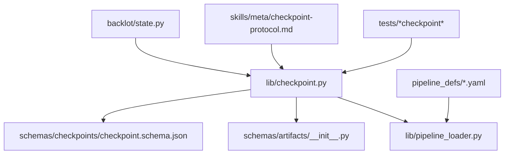
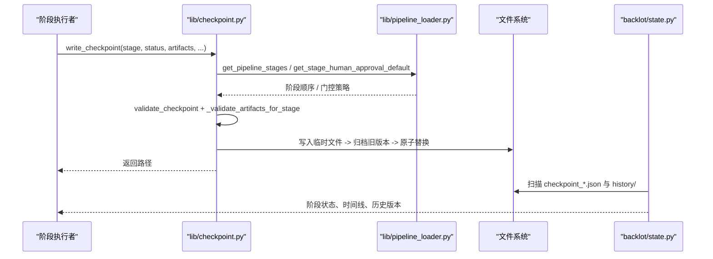
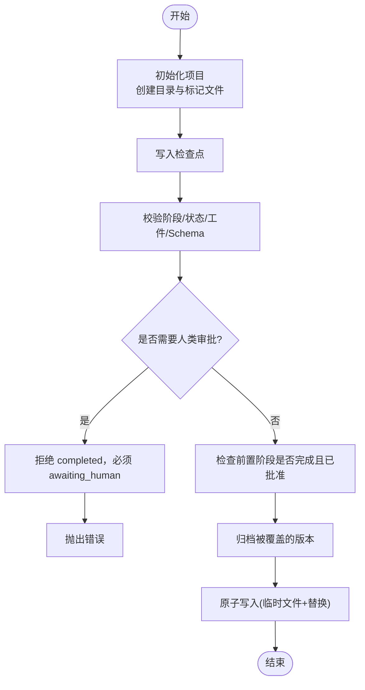
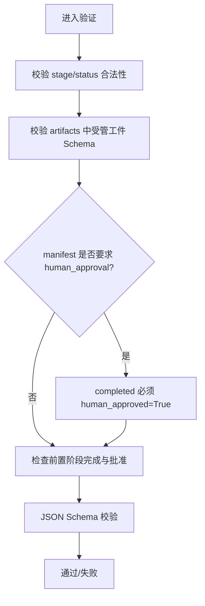
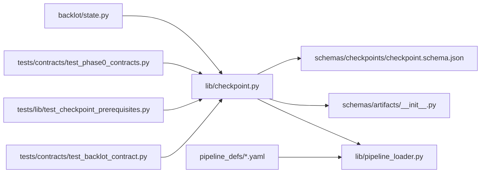

# 检查点系统

<cite>
**本文引用的文件**
- [lib/checkpoint.py](file://lib/checkpoint.py)
- [schemas/checkpoints/checkpoint.schema.json](file://schemas/checkpoints/checkpoint.schema.json)
- [schemas/artifacts/__init__.py](file://schemas/artifacts/__init__.py)
- [lib/pipeline_loader.py](file://lib/pipeline_loader.py)
- [backlot/state.py](file://backlot/state.py)
- [pipeline_defs/framework-smoke.yaml](file://pipeline_defs/framework-smoke.yaml)
- [skills/meta/checkpoint-protocol.md](file://skills/meta/checkpoint-protocol.md)
- [tests/contracts/test_phase0_contracts.py](file://tests/contracts/test_phase0_contracts.py)
- [tests/lib/test_checkpoint_prerequisites.py](file://tests/lib/test_checkpoint_prerequisites.py)
- [tests/contracts/test_backlot_contract.py](file://tests/contracts/test_backlot_contract.py)
</cite>

## 目录
1. [简介](#简介)
2. [项目结构](#项目结构)
3. [核心组件](#核心组件)
4. [架构总览](#架构总览)
5. [详细组件分析](#详细组件分析)
6. [依赖关系分析](#依赖关系分析)
7. [性能与可靠性](#性能与可靠性)
8. [故障排除指南](#故障排除指南)
9. [结论](#结论)
10. [附录：最佳实践](#附录：最佳实践)

## 简介
本文件系统性阐述 OpenMontage 的检查点（Checkpoint）系统，覆盖其生命周期管理、数据结构设计、验证流程、存储策略、恢复机制以及最佳实践与故障排除。检查点是管道执行过程中的“可恢复快照”，用于断点续传、人工审批门控、审计追踪与界面展示。

## 项目结构
检查点系统由以下关键部分组成：
- 检查点读写与校验：lib/checkpoint.py
- 检查点 JSON Schema：schemas/checkpoints/checkpoint.schema.json
- 工件（Artifact）Schema 注册与校验：schemas/artifacts/__init__.py
- 管道清单加载与阶段顺序/门控策略：lib/pipeline_loader.py
- 看板状态聚合（读取当前与历史检查点）：backlot/state.py
- 管道定义示例：pipeline_defs/framework-smoke.yaml
- 协议文档与使用指引：skills/meta/checkpoint-protocol.md
- 测试用例：tests/...

图表来源
- [lib/checkpoint.py:1-634](file://lib/checkpoint.py#L1-L634)
- [schemas/checkpoints/checkpoint.schema.json:1-47](file://schemas/checkpoints/checkpoint.schema.json#L1-L47)
- [schemas/artifacts/__init__.py:1-55](file://schemas/artifacts/__init__.py#L1-L55)
- [lib/pipeline_loader.py:1-241](file://lib/pipeline_loader.py#L1-L241)
- [backlot/state.py:100-142](file://backlot/state.py#L100-L142)
- [pipeline_defs/framework-smoke.yaml:1-26](file://pipeline_defs/framework-smoke.yaml#L1-L26)
- [skills/meta/checkpoint-protocol.md:1-200](file://skills/meta/checkpoint-protocol.md#L1-L200)
- [tests/contracts/test_phase0_contracts.py:288-325](file://tests/contracts/test_phase0_contracts.py#L288-L325)

章节来源
- [lib/checkpoint.py:1-634](file://lib/checkpoint.py#L1-L634)
- [schemas/checkpoints/checkpoint.schema.json:1-47](file://schemas/checkpoints/checkpoint.schema.json#L1-L47)
- [schemas/artifacts/__init__.py:1-55](file://schemas/artifacts/__init__.py#L1-L55)
- [lib/pipeline_loader.py:1-241](file://lib/pipeline_loader.py#L1-L241)
- [backlot/state.py:100-142](file://backlot/state.py#L100-L142)
- [pipeline_defs/framework-smoke.yaml:1-26](file://pipeline_defs/framework-smoke.yaml#L1-L26)
- [skills/meta/checkpoint-protocol.md:1-200](file://skills/meta/checkpoint-protocol.md#L1-L200)
- [tests/contracts/test_phase0_contracts.py:288-325](file://tests/contracts/test_phase0_contracts.py#L288-L325)

## 核心组件
- 检查点写入器/读取器：负责创建、验证、归档、原子写入与读取检查点，并维护项目工作区布局。
- 检查点 Schema：定义检查点必填字段、枚举值与扩展字段约束。
- 工件 Schema 注册表：集中声明所有受管工件名称并提供按名加载与校验能力。
- 管道清单加载器：提供阶段顺序、人类审批默认策略、工具与子阶段等元数据。
- 看板状态聚合：从磁盘收集当前检查点与历史版本，供 UI 渲染与回放。

章节来源
- [lib/checkpoint.py:1-634](file://lib/checkpoint.py#L1-L634)
- [schemas/checkpoints/checkpoint.schema.json:1-47](file://schemas/checkpoints/checkpoint.schema.json#L1-L47)
- [schemas/artifacts/__init__.py:1-55](file://schemas/artifacts/__init__.py#L1-L55)
- [lib/pipeline_loader.py:1-241](file://lib/pipeline_loader.py#L1-L241)
- [backlot/state.py:100-142](file://backlot/state.py#L100-L142)

## 架构总览
检查点系统的核心交互如下：
- 阶段完成后调用 write_checkpoint，进行前置条件与门控校验、Schema 校验、工件校验、决策日志合并、历史归档与原子写入。
- 读取端通过 read_checkpoint/get_latest_checkpoint/get_next_stage 获取进度并驱动后续步骤。
- 看板通过 backlot/state.py 聚合当前与历史检查点，呈现阶段状态、时间线与审批轨迹。
- 管道清单决定阶段顺序与是否要求人类审批。

图表来源
- [lib/checkpoint.py:422-564](file://lib/checkpoint.py#L422-L564)
- [lib/pipeline_loader.py:125-182](file://lib/pipeline_loader.py#L125-L182)
- [backlot/state.py:118-142](file://backlot/state.py#L118-L142)

## 详细组件分析

### 检查点数据结构与字段语义
- 必填字段：version、project_id、pipeline_type、stage、status、timestamp、artifacts。
- 状态枚举：completed、failed、awaiting_human、in_progress。
- 可选字段：style_playbook、checkpoint_policy、human_approval_required、human_approved、review、cost_snapshot、error、metadata。
- 工件映射：artifacts 为对象，键为工件名，值为该工件的数据或路径；受管工件需通过 schemas/artifacts 的 Schema 校验。

章节来源
- [schemas/checkpoints/checkpoint.schema.json:1-47](file://schemas/checkpoints/checkpoint.schema.json#L1-L47)
- [schemas/artifacts/__init__.py:13-34](file://schemas/artifacts/__init__.py#L13-L34)

### 检查点生命周期与写入流程
- 初始化项目：init_project 创建标准目录结构与 project.json 标记文件，便于看板识别项目。
- 写入检查点：write_checkpoint 完成身份回填、阶段合法性校验、门控策略校验、前置阶段检查、Schema 校验、工件校验、决策日志合并、历史归档与原子写入。
- 读取检查点：read_checkpoint 读取并校验单个阶段的检查点；get_latest_checkpoint 按 mtime 取最新；get_completed_stages/get_next_stage 计算已完成阶段与下一步。

图表来源
- [lib/checkpoint.py:198-248](file://lib/checkpoint.py#L198-L248)
- [lib/checkpoint.py:422-564](file://lib/checkpoint.py#L422-L564)
- [lib/checkpoint.py:284-346](file://lib/checkpoint.py#L284-L346)
- [lib/checkpoint.py:349-386](file://lib/checkpoint.py#L349-L386)

章节来源
- [lib/checkpoint.py:198-248](file://lib/checkpoint.py#L198-L248)
- [lib/checkpoint.py:422-564](file://lib/checkpoint.py#L422-L564)
- [lib/checkpoint.py:567-634](file://lib/checkpoint.py#L567-L634)

### 检查点验证流程
- JSON Schema 校验：基于 schemas/checkpoints/checkpoint.schema.json。
- 阶段前置条件检查：仅对 advancing 状态（awaiting_human/completed）进行前置阶段完整性与审批检查；in_progress 允许写入以便心跳与恢复。
- 工件校验：对已知工件名调用 schemas/artifacts/__init__.py 的 validate_artifact 进行 Schema 校验；缺失必需工件将报错。
- 风格策略校验：若指定 style_playbook，则尝试加载对应样式策略，失败即阻断。

图表来源
- [lib/checkpoint.py:124-191](file://lib/checkpoint.py#L124-L191)
- [lib/checkpoint.py:251-282](file://lib/checkpoint.py#L251-L282)
- [lib/checkpoint.py:284-346](file://lib/checkpoint.py#L284-L346)
- [schemas/artifacts/__init__.py:46-49](file://schemas/artifacts/__init__.py#L46-L49)

章节来源
- [lib/checkpoint.py:124-191](file://lib/checkpoint.py#L124-L191)
- [lib/checkpoint.py:251-282](file://lib/checkpoint.py#L251-L282)
- [lib/checkpoint.py:284-346](file://lib/checkpoint.py#L284-L346)
- [schemas/artifacts/__init__.py:46-49](file://schemas/artifacts/__init__.py#L46-L49)

### 工件引用与决策日志
- 工件引用：artifacts 可为内联对象或相对路径；看板在安全范围内解析路径（仅限项目目录）。
- 决策日志：当 artifacts 包含 decision_log 时，会合并到项目级 decision_log.json，并在 proposal_packet/render_report 中回写引用，便于审计与回溯。

章节来源
- [backlot/state.py:100-115](file://backlot/state.py#L100-L115)
- [lib/checkpoint.py:388-419](file://lib/checkpoint.py#L388-L419)
- [lib/checkpoint.py:527-546](file://lib/checkpoint.py#L527-L546)

### 存储策略与历史版本管理
- 项目目录结构：projects/<project_id>/ 下包含 artifacts、assets/images、assets/video、assets/audio、assets/music、renders 及 project.json。
- 检查点文件：每个阶段一个 checkpoint_<stage>.json。
- 历史归档：覆盖前将非 in_progress 的旧版本复制到 history/，文件名带时间戳，保留完整运行记录。
- 原子写入：先写入 .tmp 再 os.replace，避免部分写入导致损坏。

章节来源
- [lib/checkpoint.py:194-248](file://lib/checkpoint.py#L194-L248)
- [lib/checkpoint.py:349-386](file://lib/checkpoint.py#L349-L386)
- [lib/checkpoint.py:549-564](file://lib/checkpoint.py#L549-L564)

### 恢复机制与断点续传
- 阶段内心跳：长耗时阶段应频繁写入 in_progress 检查点，保存 partial_progress 或有效工件片段，以支持中断后继续。
- 恢复流程：启动时调用 get_next_stage 判断下一步；若存在 in_progress，读取其 artifacts/metadata 中的部分结果，跳过已完成子任务，继续生成。
- 看板支持：UI 根据历史条目回放阶段状态与时间线，辅助定位断点。

章节来源
- [skills/meta/checkpoint-protocol.md:74-100](file://skills/meta/checkpoint-protocol.md#L74-L100)
- [skills/meta/checkpoint-protocol.md:169-200](file://skills/meta/checkpoint-protocol.md#L169-L200)
- [lib/checkpoint.py:567-634](file://lib/checkpoint.py#L567-L634)
- [backlot/state.py:118-142](file://backlot/state.py#L118-L142)

### 人类审批门控机制
- 门控来源：管道清单中 human_approval_default 为唯一权威来源；write_checkpoint 强制实施，禁止绕过。
- 行为约束：对于需要审批的阶段，只能先写入 awaiting_human，待用户批准后以 human_approved=True 写入 completed。
- 前置阶段门控：推进阶段时，若前置阶段需要审批但未批准，将阻止前进。

章节来源
- [lib/pipeline_loader.py:173-182](file://lib/pipeline_loader.py#L173-L182)
- [lib/checkpoint.py:251-282](file://lib/checkpoint.py#L251-L282)
- [lib/checkpoint.py:467-495](file://lib/checkpoint.py#L467-L495)
- [lib/checkpoint.py:284-346](file://lib/checkpoint.py#L284-L346)
- [pipeline_defs/framework-smoke.yaml:1-26](file://pipeline_defs/framework-smoke.yaml#L1-L26)

## 依赖关系分析
- lib/checkpoint.py 依赖：
  - schemas/checkpoints/checkpoint.schema.json：检查点结构约束
  - schemas/artifacts/__init__.py：工件 Schema 加载与校验
  - lib/pipeline_loader.py：阶段顺序与人类审批默认策略
  - backlot/state.py：看板读取当前与历史检查点
- 外部输入：
  - pipeline_defs/*.yaml：定义阶段、工具、审批策略等
- 测试覆盖：
  - 读写往返、下一步阶段计算、无效阶段拒绝、工件 Schema 校验、历史归档、前置阶段门控等

图表来源
- [lib/checkpoint.py:1-634](file://lib/checkpoint.py#L1-L634)
- [schemas/checkpoints/checkpoint.schema.json:1-47](file://schemas/checkpoints/checkpoint.schema.json#L1-L47)
- [schemas/artifacts/__init__.py:1-55](file://schemas/artifacts/__init__.py#L1-L55)
- [lib/pipeline_loader.py:1-241](file://lib/pipeline_loader.py#L1-L241)
- [backlot/state.py:100-142](file://backlot/state.py#L100-L142)
- [pipeline_defs/framework-smoke.yaml:1-26](file://pipeline_defs/framework-smoke.yaml#L1-L26)
- [tests/contracts/test_phase0_contracts.py:288-325](file://tests/contracts/test_phase0_contracts.py#L288-L325)
- [tests/lib/test_checkpoint_prerequisites.py:1-46](file://tests/lib/test_checkpoint_prerequisites.py#L1-L46)
- [tests/contracts/test_backlot_contract.py:106-129](file://tests/contracts/test_backlot_contract.py#L106-L129)

章节来源
- [lib/checkpoint.py:1-634](file://lib/checkpoint.py#L1-L634)
- [lib/pipeline_loader.py:1-241](file://lib/pipeline_loader.py#L1-L241)
- [backlot/state.py:100-142](file://backlot/state.py#L100-L142)
- [tests/contracts/test_phase0_contracts.py:288-325](file://tests/contracts/test_phase0_contracts.py#L288-L325)
- [tests/lib/test_checkpoint_prerequisites.py:1-46](file://tests/lib/test_checkpoint_prerequisites.py#L1-L46)
- [tests/contracts/test_backlot_contract.py:106-129](file://tests/contracts/test_backlot_contract.py#L106-L129)

## 性能与可靠性
- 缓存：检查点 Schema 与管道清单加载均使用 lru_cache，减少重复 I/O 与解析开销。
- 原子写入：临时文件 + os.replace 保证崩溃不产生半写文件。
- 归档健壮性：历史归档失败不影响主流程，仅记录警告。
- 只读访问：看板读取检查点与工件时限制路径范围，防止越权读取。

章节来源
- [lib/checkpoint.py:118-121](file://lib/checkpoint.py#L118-L121)
- [lib/pipeline_loader.py:27-46](file://lib/pipeline_loader.py#L27-L46)
- [lib/checkpoint.py:349-386](file://lib/checkpoint.py#L349-L386)
- [lib/checkpoint.py:549-564](file://lib/checkpoint.py#L549-L564)
- [backlot/state.py:100-115](file://backlot/state.py#L100-L115)

## 故障排除指南
- 阶段非法或工件缺失：
  - 现象：写入时报错提示无效阶段或缺少必需工件。
  - 处理：确认 stage 属于当前管道清单；确保 completed/awaiting_human 包含对应 canonical artifact。
  - 参考：[lib/checkpoint.py:124-191](file://lib/checkpoint.py#L124-L191)、[tests/contracts/test_phase0_contracts.py:313-325](file://tests/contracts/test_phase0_contracts.py#L313-L325)
- 人类审批门控违规：
  - 现象：对需要审批的阶段直接写入 completed 且未设置 human_approved=True。
  - 处理：先写 awaiting_human，经用户批准后再写 completed 并设置 human_approved=True。
  - 参考：[lib/checkpoint.py:467-495](file://lib/checkpoint.py#L467-L495)、[lib/pipeline_loader.py:173-182](file://lib/pipeline_loader.py#L173-L182)
- 前置阶段未完成或未批准：
  - 现象：推进阶段时报 PREREQUISITE VIOLATION。
  - 处理：补齐前置阶段并完成必要审批。
  - 参考：[lib/checkpoint.py:284-346](file://lib/checkpoint.py#L284-L346)、[tests/lib/test_checkpoint_prerequisites.py:29-46](file://tests/lib/test_checkpoint_prerequisites.py#L29-L46)
- 历史归档失败：
  - 现象：日志中出现归档警告。
  - 处理：通常不影响主流程；检查磁盘权限与文件占用情况。
  - 参考：[lib/checkpoint.py:349-386](file://lib/checkpoint.py#L349-L386)
- 看板无法显示工件：
  - 现象：工件路径为空或不可解析。
  - 处理：确保工件路径在项目目录下且可读；避免绝对路径越界。
  - 参考：[backlot/state.py:100-115](file://backlot/state.py#L100-L115)

章节来源
- [lib/checkpoint.py:124-191](file://lib/checkpoint.py#L124-L191)
- [lib/checkpoint.py:284-346](file://lib/checkpoint.py#L284-L346)
- [lib/checkpoint.py:349-386](file://lib/checkpoint.py#L349-L386)
- [lib/checkpoint.py:467-495](file://lib/checkpoint.py#L467-L495)
- [lib/pipeline_loader.py:173-182](file://lib/pipeline_loader.py#L173-L182)
- [backlot/state.py:100-115](file://backlot/state.py#L100-L115)
- [tests/lib/test_checkpoint_prerequisites.py:29-46](file://tests/lib/test_checkpoint_prerequisites.py#L29-L46)
- [tests/contracts/test_phase0_contracts.py:313-325](file://tests/contracts/test_phase0_contracts.py#L313-L325)

## 结论
OpenMontage 的检查点系统通过严格的 Schema 校验、工件校验、前置阶段与人类审批门控、原子写入与历史归档，提供了可靠的管道执行保障与可恢复能力。配合看板的状态聚合与回放，能够支撑复杂媒体管道的生产级运行。

## 附录：最佳实践
- 在每个阶段开始时写入 in_progress 检查点，作为心跳与恢复锚点。
- 仅在阶段完成并通过内部审查后，写入 completed；如需人类审批，先写 awaiting_human。
- 长耗时阶段分步产出有效工件或 partial_progress，便于中断恢复。
- 始终传递 pipeline_type，以确保阶段顺序与门控策略正确生效。
- 利用 get_next_stage 自动确定下一步，避免硬编码阶段跳转。
- 谨慎修改管道清单，确保 human_approval_default 与实际流程一致。

章节来源
- [skills/meta/checkpoint-protocol.md:74-100](file://skills/meta/checkpoint-protocol.md#L74-L100)
- [skills/meta/checkpoint-protocol.md:169-200](file://skills/meta/checkpoint-protocol.md#L169-L200)
- [lib/checkpoint.py:567-634](file://lib/checkpoint.py#L567-L634)
- [pipeline_defs/framework-smoke.yaml:1-26](file://pipeline_defs/framework-smoke.yaml#L1-L26)