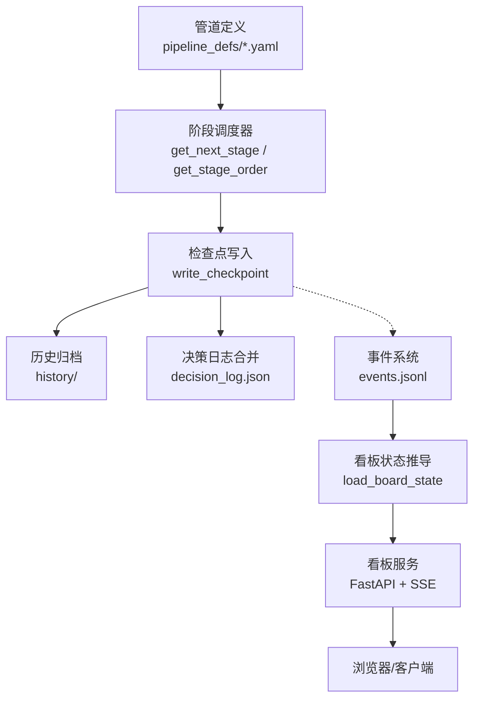
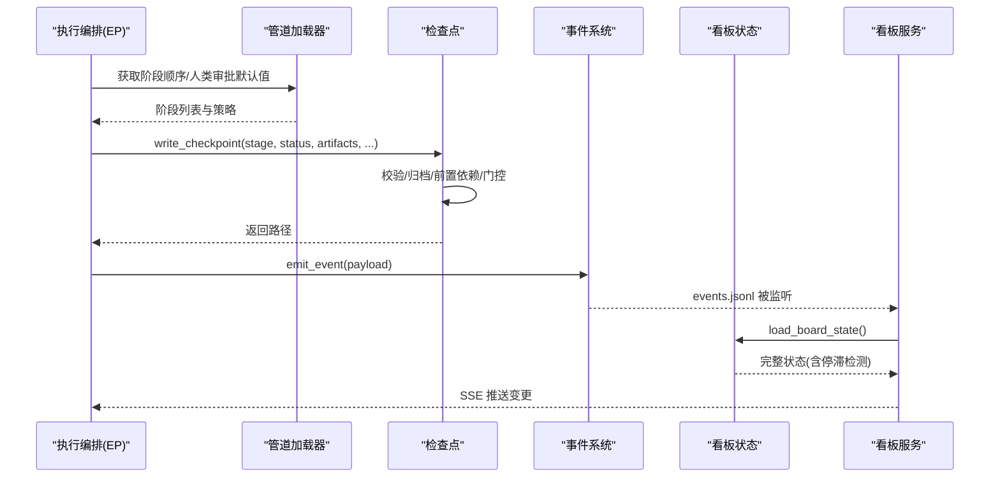
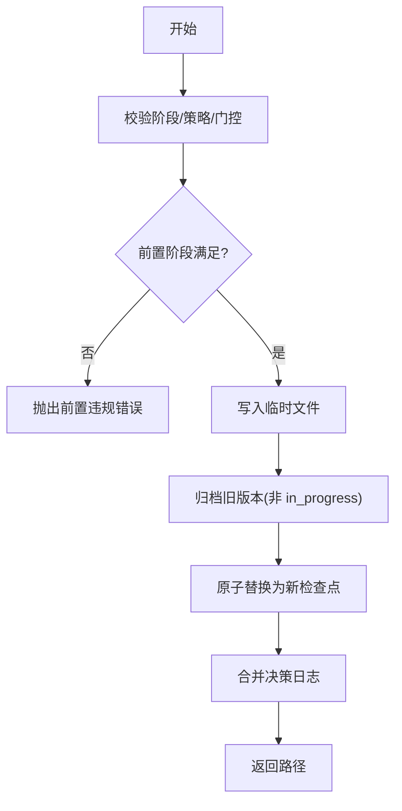
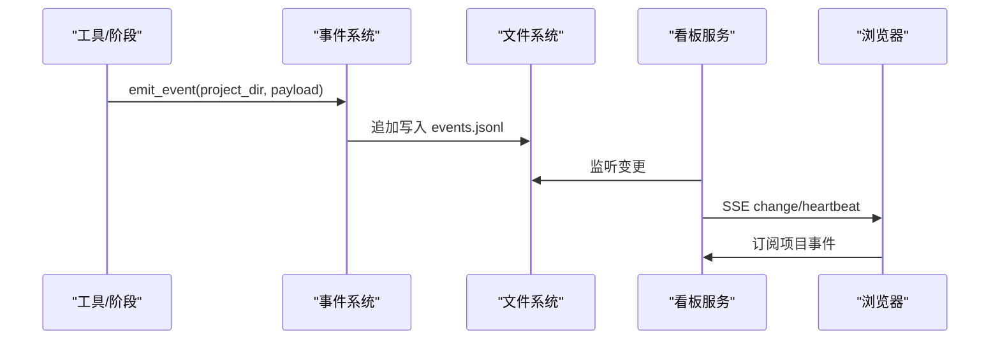
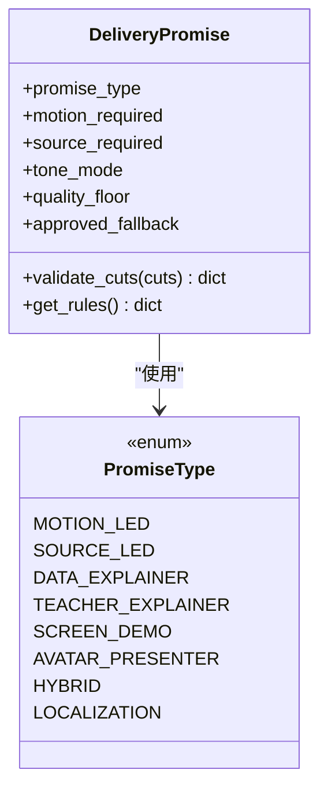
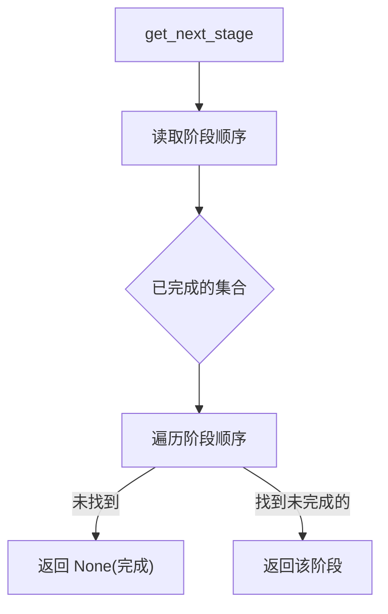
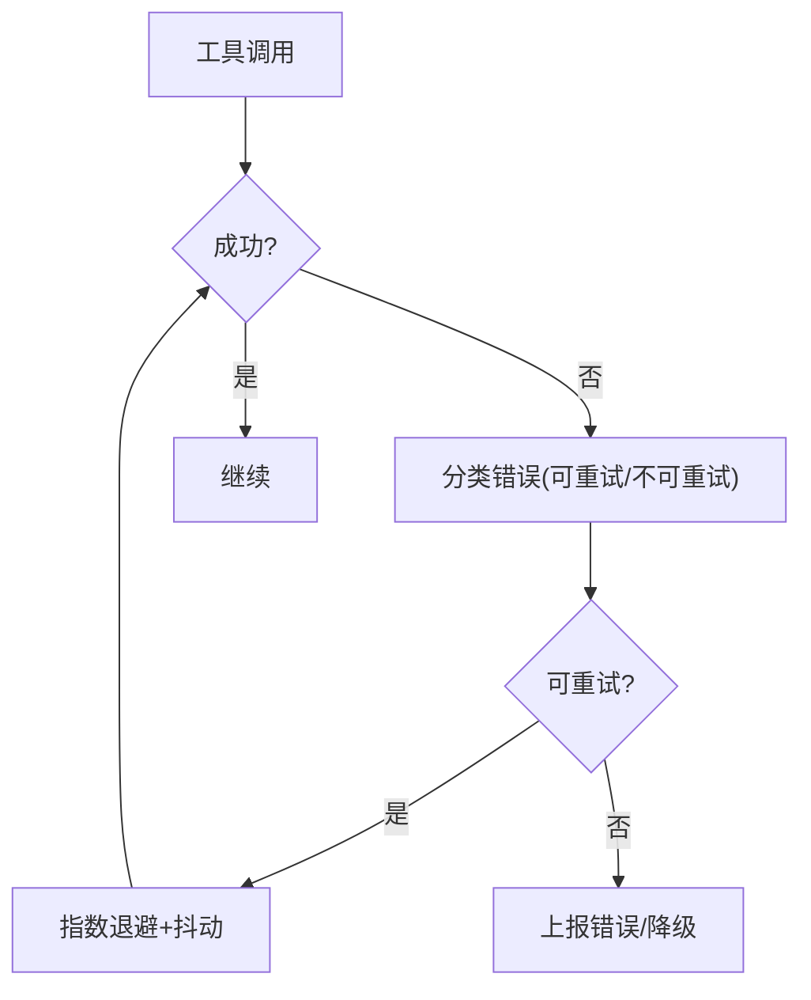
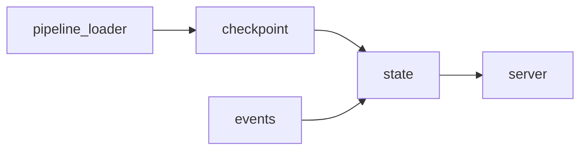

# 管道执行引擎

<cite>
**本文引用的文件**
- [lib/checkpoint.py](file://lib/checkpoint.py)
- [lib/events.py](file://lib/events.py)
- [lib/delivery_promise.py](file://lib/delivery_promise.py)
- [lib/pipeline_loader.py](file://lib/pipeline_loader.py)
- [backlot/server.py](file://backlot/server.py)
- [backlot/state.py](file://backlot/state.py)
- [pipeline_defs/cinematic.yaml](file://pipeline_defs/cinematic.yaml)
- [config.yaml](file://config.yaml)
- [skills/meta/checkpoint-protocol.md](file://skills/meta/checkpoint-protocol.md)
</cite>

## 目录
1. [简介](#简介)
2. [项目结构](#项目结构)
3. [核心组件](#核心组件)
4. [架构总览](#架构总览)
5. [详细组件分析](#详细组件分析)
6. [依赖关系分析](#依赖关系分析)
7. [性能考量](#性能考量)
8. [故障排查指南](#故障排查指南)
9. [结论](#结论)
10. [附录](#附录)

## 简介
本技术文档聚焦 OpenMontage 的“管道执行引擎”，围绕以下目标展开：
- 生命周期管理：阶段调度、状态转换、检查点机制与断点续传。
- 检查点协议：保存/恢复执行状态，支持人类审批门控与审计追踪。
- 事件驱动模型：通过事件流监控进度、传递中间结果。
- 交付承诺机制：在提案阶段锁定交付形态，防止静默降级。
- 错误处理与重试：异常捕获、降级策略与资源清理。
- 执行监控与调试：看板状态推导、SSE 实时推送、停滞检测等最佳实践。

## 项目结构
OpenMontage 将“管道定义”“执行持久化”“事件流”“可视化看板”解耦为独立模块：
- 管道定义：YAML 清单描述阶段顺序、工具、审查焦点、是否需人工审批等。
- 检查点：每个阶段完成后写入 checkpoint，支持归档历史版本与前置依赖校验。
- 事件流：append-only 日志记录工具调用与场景级活动，供看板实时消费。
- 看板服务：FastAPI + SSE 提供项目状态、媒体访问、缩略图与变更通知。
- 配置：集中式运行时配置（预算、输出、路径、检查点策略）。

**图示来源**
- [lib/pipeline_loader.py:125-149](file://lib/pipeline_loader.py#L125-L149)
- [lib/checkpoint.py:422-564](file://lib/checkpoint.py#L422-L564)
- [lib/events.py:77-118](file://lib/events.py#L77-L118)
- [backlot/state.py:588-658](file://backlot/state.py#L588-L658)
- [backlot/server.py:165-240](file://backlot/server.py#L165-L240)

**章节来源**
- [pipeline_defs/cinematic.yaml:60-288](file://pipeline_defs/cinematic.yaml#L60-L288)
- [lib/pipeline_loader.py:1-70](file://lib/pipeline_loader.py#L1-L70)
- [lib/checkpoint.py:194-564](file://lib/checkpoint.py#L194-L564)
- [lib/events.py:1-118](file://lib/events.py#L1-L118)
- [backlot/state.py:1-128](file://backlot/state.py#L1-L128)
- [backlot/server.py:1-240](file://backlot/server.py#L1-L240)
- [config.yaml:1-34](file://config.yaml#L1-L34)

## 核心组件
- 管道加载器：读取并缓存 YAML 清单，提取阶段顺序、子阶段、工具集、人类审批默认值、扩展权限等。
- 检查点子系统：校验、归档、原子写入、前置依赖强制、人类审批门控、决策日志合并。
- 事件系统：线程安全追加写、按项目推断归属、容忍损坏行、限制读取条数。
- 交付承诺：分类承诺类型、规则约束、剪辑运动比例校验，防止静默降级。
- 看板状态推导：从检查点、历史、事件、制品、媒体扫描构建可渲染状态，含停滞检测。
- 看板服务：SSE 变更推送、媒体与缩略图服务、项目列表与详情 API。

**章节来源**
- [lib/pipeline_loader.py:33-70](file://lib/pipeline_loader.py#L33-L70)
- [lib/checkpoint.py:124-191](file://lib/checkpoint.py#L124-L191)
- [lib/events.py:46-118](file://lib/events.py#L46-L118)
- [lib/delivery_promise.py:18-79](file://lib/delivery_promise.py#L18-L79)
- [backlot/state.py:145-224](file://backlot/state.py#L145-L224)
- [backlot/server.py:165-240](file://backlot/server.py#L165-L240)

## 架构总览
下图展示从“管道定义”到“执行与观测”的整体数据与控制流：

**图示来源**
- [lib/pipeline_loader.py:125-182](file://lib/pipeline_loader.py#L125-L182)
- [lib/checkpoint.py:422-564](file://lib/checkpoint.py#L422-L564)
- [lib/events.py:77-118](file://lib/events.py#L77-L118)
- [backlot/state.py:588-658](file://backlot/state.py#L588-L658)
- [backlot/server.py:165-240](file://backlot/server.py#L165-L240)

## 详细组件分析

### 检查点协议与生命周期管理
- 写入流程：
  - 回填项目标识（pipeline_type/style_playbook），校验风格策略。
  - 校验阶段有效性、人类审批门控、前置阶段完成与批准。
  - 序列化至临时文件，归档旧版本，原子替换。
  - 合并决策日志，并在相关制品中回写引用。
- 状态机：
  - in_progress：阶段进行中，允许覆盖；不归档。
  - awaiting_human：需要人类审批；不得直接写 completed。
  - completed：阶段完成；若门控开启需 human_approved=True。
- 断点续传：
  - 启动时通过 get_next_stage 定位下一待执行阶段。
  - 若存在 in_progress，读取 partial_progress 或 artifacts 中的部分产物，跳过已完成子任务。

**图示来源**
- [lib/checkpoint.py:422-564](file://lib/checkpoint.py#L422-L564)
- [lib/checkpoint.py:284-346](file://lib/checkpoint.py#L284-L346)
- [lib/checkpoint.py:567-633](file://lib/checkpoint.py#L567-L633)

**章节来源**
- [lib/checkpoint.py:194-564](file://lib/checkpoint.py#L194-L564)
- [skills/meta/checkpoint-protocol.md:1-200](file://skills/meta/checkpoint-protocol.md#L1-L200)

### 事件驱动的执行模型
- 事件写入：
  - 线程锁保护追加写，避免并发破坏。
  - 自动推断项目归属（基于 project_dir 或路径提示键）。
  - 失败即丢弃，保证生产不受影响。
- 事件读取：
  - 容错解析 JSONL，忽略损坏行。
  - 支持限制条数，便于 UI 快速加载。
- 看板集成：
  - 服务侧 watchfiles 监听 projects/ 变化，去抖后通过 SSE 推送。
  - 状态推导聚合事件，计算“生成中”的场景卡片与活跃性。

**图示来源**
- [lib/events.py:77-118](file://lib/events.py#L77-L118)
- [backlot/server.py:132-240](file://backlot/server.py#L132-L240)
- [backlot/state.py:403-495](file://backlot/state.py#L403-L495)

**章节来源**
- [lib/events.py:1-118](file://lib/events.py#L1-L118)
- [backlot/server.py:132-240](file://backlot/server.py#L132-L240)
- [backlot/state.py:403-495](file://backlot/state.py#L403-L495)

### 交付承诺机制
- 承诺分类：
  - motion_led/source_led/data_explainer/teacher_explainer/screen_demo/avatar_presenter/hybrid/localization。
- 规则约束：
  - 最小运动比例、是否允许静止降级、是否需要视频生成。
- 剪辑校验：
  - 统计真实运动/动画幻灯片/静态剪辑比例，违反规则时阻止静默降级。
- 集成点：
  - 提案阶段锁定承诺；compose 阶段若无法兑现则停止并请求用户确认。

**图示来源**
- [lib/delivery_promise.py:18-79](file://lib/delivery_promise.py#L18-L79)
- [lib/delivery_promise.py:82-193](file://lib/delivery_promise.py#L82-L193)

**章节来源**
- [lib/delivery_promise.py:18-248](file://lib/delivery_promise.py#L18-L248)

### 阶段调度与状态转换
- 阶段顺序：
  - 从 manifest 提取主阶段与可选子阶段（带条件激活）。
  - 未指定 pipeline_type 时使用稳定回退顺序。
- 下一步判定：
  - 扫描已完成的检查点，返回首个未完成阶段。
- 人类审批门控：
  - 由 manifest 的 human_approval_default 决定；写入 completed 时必须 human_approved=True。
- 前置依赖：
  - 仅当推进到 awaiting_human/completed 时检查前置阶段必须 completed 且必要时已批准。

**图示来源**
- [lib/pipeline_loader.py:125-149](file://lib/pipeline_loader.py#L125-L149)
- [lib/checkpoint.py:602-633](file://lib/checkpoint.py#L602-L633)
- [lib/checkpoint.py:251-346](file://lib/checkpoint.py#L251-L346)

**章节来源**
- [lib/pipeline_loader.py:125-182](file://lib/pipeline_loader.py#L125-L182)
- [lib/checkpoint.py:602-633](file://lib/checkpoint.py#L602-L633)

### 错误处理与重试策略
- 检查点写入：
  - 前置违规/门控违规直接抛错，阻止非法状态推进。
  - 归档失败为 best-effort，不影响主流程。
- 事件系统：
  - 所有写入异常吞掉，确保观测不阻塞生产。
- 看板状态推导：
  - 任何 JSON 解析/IO 异常均降级为可读状态，不崩溃。
- 外部工具重试：
  - 参考通用重试模式（指数退避+随机抖动），区分可重试与不可重试错误。

**图示来源**
- [lib/checkpoint.py:467-502](file://lib/checkpoint.py#L467-L502)
- [lib/events.py:77-95](file://lib/events.py#L77-L95)
- [backlot/state.py:41-48](file://backlot/state.py#L41-L48)

**章节来源**
- [lib/checkpoint.py:467-502](file://lib/checkpoint.py#L467-L502)
- [lib/events.py:77-95](file://lib/events.py#L77-L95)
- [backlot/state.py:41-48](file://backlot/state.py#L41-L48)

### 执行监控与调试最佳实践
- 使用 in_progress 心跳：
  - 进入阶段立即写入 in_progress，避免“卡死”误判。
- 利用 history/ 审计：
  - 每次覆盖前归档旧版，保留 gate 审计轨迹与版本回放。
- 观察事件流：
  - 通过 read_events 或 SSE 查看最近活动，定位卡顿场景。
- 停滞检测：
  - 看板根据最后活动时间与阈值标记 stalled，辅助排障。
- 预算与成本快照：
  - 在检查点携带 cost_snapshot，看板聚合最新快照用于成本追踪。

**章节来源**
- [skills/meta/checkpoint-protocol.md:74-195](file://skills/meta/checkpoint-protocol.md#L74-L195)
- [lib/checkpoint.py:349-386](file://lib/checkpoint.py#L349-L386)
- [backlot/state.py:565-638](file://backlot/state.py#L565-L638)

## 依赖关系分析
- 低耦合高内聚：
  - 管道加载器只负责读配置；检查点专注持久化与门控；事件系统专注观测；看板专注呈现。
- 关键依赖链：
  - checkpoint 依赖 pipeline_loader 获取阶段顺序与门控策略。
  - state 依赖 events 与 checkpoint 构建视图。
  - server 依赖 state 暴露 API 并通过 SSE 推送。
- 潜在循环：
  - 当前无直接循环依赖；各模块通过明确接口交互。

**图示来源**
- [lib/pipeline_loader.py:125-182](file://lib/pipeline_loader.py#L125-L182)
- [lib/checkpoint.py:422-564](file://lib/checkpoint.py#L422-L564)
- [backlot/state.py:588-658](file://backlot/state.py#L588-L658)
- [backlot/server.py:165-240](file://backlot/server.py#L165-L240)

**章节来源**
- [lib/pipeline_loader.py:125-182](file://lib/pipeline_loader.py#L125-L182)
- [lib/checkpoint.py:422-564](file://lib/checkpoint.py#L422-L564)
- [backlot/state.py:588-658](file://backlot/state.py#L588-L658)
- [backlot/server.py:165-240](file://backlot/server.py#L165-L240)

## 性能考量
- 缓存：
  - 管道清单加载使用 lru_cache，减少重复解析与校验开销。
- 原子写入：
  - 检查点先写临时文件再原子替换，避免半写损坏。
- 事件追加：
  - 单进程内线程锁，跨进程采用 O_APPEND 追加，容忍撕裂行。
- 看板优化：
  - 摘要缓存与失效策略；SSE 心跳与去抖；媒体缩略图缓存。
- 停滞检测窗口：
  - LIVE_WINDOW_SECONDS 与 STALL_WINDOW_SECONDS 平衡灵敏度与误报。

**章节来源**
- [lib/pipeline_loader.py:27-46](file://lib/pipeline_loader.py#L27-L46)
- [lib/checkpoint.py:551-564](file://lib/checkpoint.py#L551-L564)
- [lib/events.py:26-29](file://lib/events.py#L26-L29)
- [backlot/server.py:76-108](file://backlot/server.py#L76-L108)
- [backlot/state.py:32-38](file://backlot/state.py#L32-L38)

## 故障排查指南
- 常见错误：
  - 前置阶段未完成或未批准：检查历史与当前检查点状态。
  - 人类审批门控违规：确保 awaiting_human → 批准后 completed。
  - 事件丢失：检查 events.jsonl 是否存在损坏行或服务端 SSE 连接。
  - 看板显示停滞：确认阶段是否持续写入 in_progress 心跳。
- 诊断步骤：
  - 读取 get_latest_checkpoint 与 get_completed_stages 定位进度。
  - 通过 read_events 查看最近工具调用与场景级活动。
  - 检查 history/ 下的归档以回溯 gate 审计轨迹。
  - 核对 manifest 中 human_approval_default 与 review_focus。

**章节来源**
- [lib/checkpoint.py:567-633](file://lib/checkpoint.py#L567-L633)
- [lib/events.py:98-118](file://lib/events.py#L98-L118)
- [backlot/state.py:130-142](file://backlot/state.py#L130-L142)
- [pipeline_defs/cinematic.yaml:60-288](file://pipeline_defs/cinematic.yaml#L60-L288)

## 结论
OpenMontage 的管道执行引擎通过“声明式管道定义 + 强一致检查点 + 事件驱动观测 + 稳健看板服务”的组合，实现了：
- 可靠的阶段调度与状态推进，严格的人类审批门控与前置依赖保障。
- 完善的断点续传与审计追踪，支持复杂长时任务的恢复与复盘。
- 低侵入的事件系统，为实时监控与调试提供基础。
- 交付承诺机制防止静默降级，保障最终产出符合预期。
- 健壮的监控与调试能力，帮助快速定位问题与优化执行效率。

## 附录
- 配置项说明：
  - checkpoint.policy：guided/manual_all/auto_noncreative。
  - budget.mode：observe/warn/cap。
  - output.*：默认格式、编码、分辨率、帧率、CRF。
  - paths.*：pipeline/library/styles/skills/output 目录。

**章节来源**
- [config.yaml:1-34](file://config.yaml#L1-L34)
- [lib/config_model.py:16-46](file://lib/config_model.py#L16-L46)