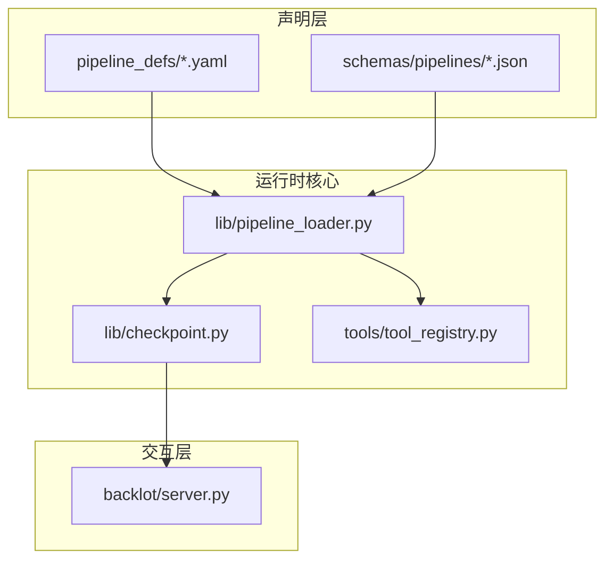
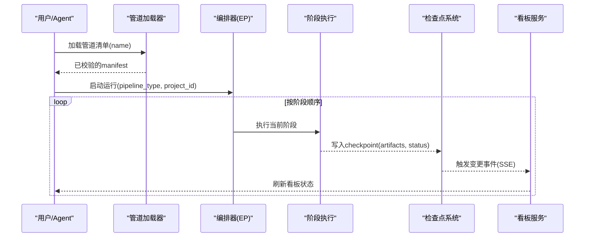
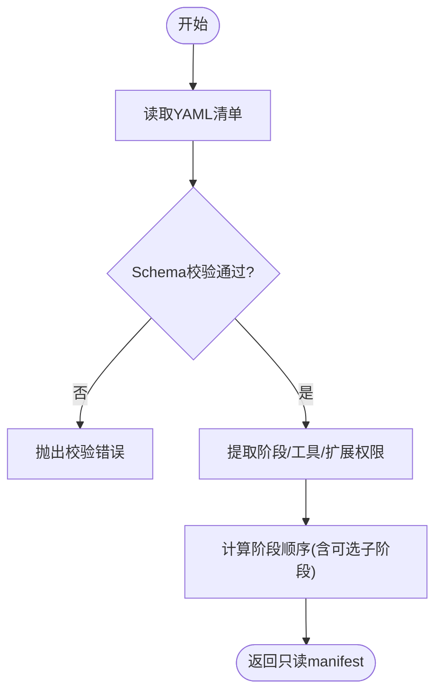
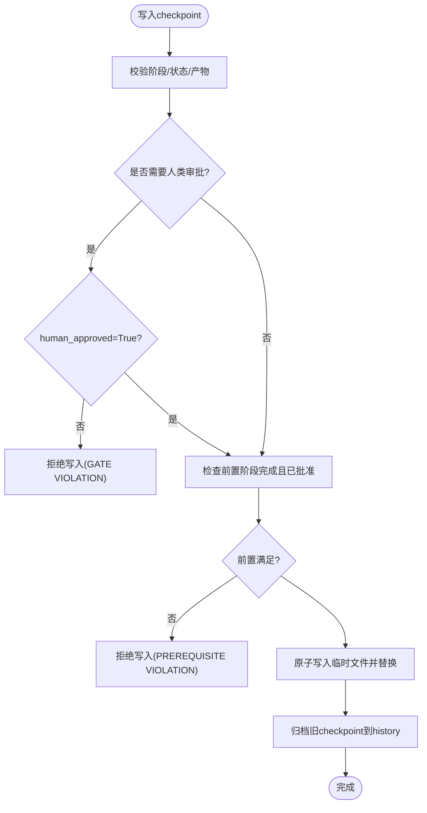
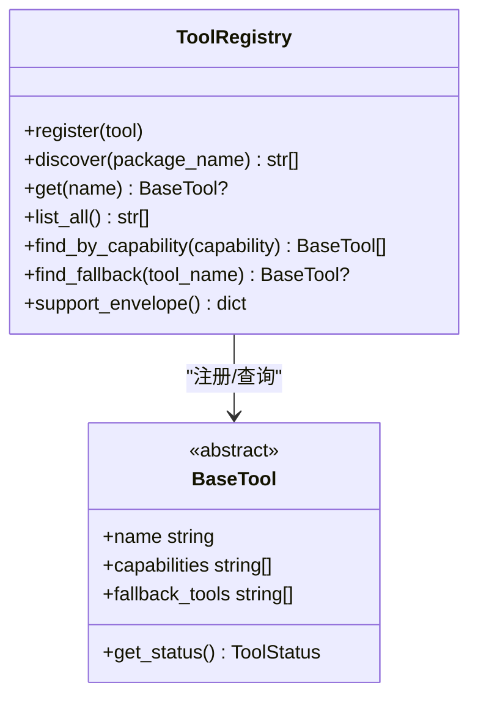
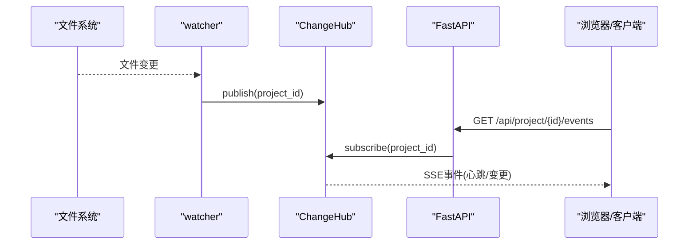
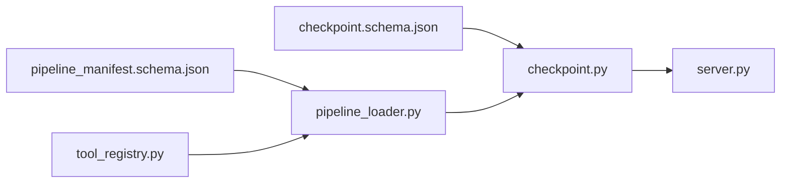

# 管道系统

<cite>
**本文引用的文件**
- [lib/pipeline_loader.py](file://lib/pipeline_loader.py)
- [schemas/pipelines/pipeline_manifest.schema.json](file://schemas/pipelines/pipeline_manifest.schema.json)
- [pipeline_defs/animation.yaml](file://pipeline_defs/animation.yaml)
- [pipeline_defs/documentary-montage.yaml](file://pipeline_defs/documentary-montage.yaml)
- [pipeline_defs/animated-explainer.yaml](file://pipeline_defs/animated-explainer.yaml)
- [lib/checkpoint.py](file://lib/checkpoint.py)
- [schemas/checkpoints/checkpoint.schema.json](file://schemas/checkpoints/checkpoint.schema.json)
- [tools/tool_registry.py](file://tools/tool_registry.py)
- [backlot/server.py](file://backlot/server.py)
</cite>

## 目录
1. [简介](#简介)
2. [项目结构](#项目结构)
3. [核心组件](#核心组件)
4. [架构总览](#架构总览)
5. [详细组件分析](#详细组件分析)
6. [依赖关系分析](#依赖关系分析)
7. [性能考量](#性能考量)
8. [故障排查指南](#故障排查指南)
9. [结论](#结论)
10. [附录：自定义管道开发指南](#附录自定义管道开发指南)

## 简介
本技术文档面向OpenMontage的“管道系统”，聚焦以下目标：
- 解释管道加载器的实现原理：YAML清单解析、Schema校验、依赖与能力声明管理。
- 深入解析管道清单结构，说明字段含义与使用方法。
- 阐述预定义管道的架构设计：动画解释器、纪录片蒙太奇等类型的工作流程。
- 提供自定义管道开发指南：定义语法、步骤编排、数据传递机制。
- 说明执行引擎的实现细节：任务调度、状态管理、错误恢复。
- 给出实际使用示例与最佳实践。

## 项目结构
OpenMontage将“管道”抽象为可配置、可验证、可执行的阶段化工作流。关键目录与职责如下：
- pipeline_defs：以YAML形式声明各类型管道的阶段、产物、工具、策略等。
- schemas：集中式JSON Schema，用于校验管道清单与中间产物（artifacts/checkpoints）。
- lib：运行时核心库，包含管道加载器、检查点（checkpoint）持久化与校验、路径管理等。
- tools：工具注册与发现，统一暴露可用能力给编排层与Agent。
- backlot：Web服务，负责项目看板、变更监听、SSE事件推送，不直接写入项目目录。

图表来源
- [lib/pipeline_loader.py:1-77](file://lib/pipeline_loader.py#L1-L77)
- [schemas/pipelines/pipeline_manifest.schema.json:1-197](file://schemas/pipelines/pipeline_manifest.schema.json#L1-L197)
- [lib/checkpoint.py:1-120](file://lib/checkpoint.py#L1-L120)
- [tools/tool_registry.py:55-134](file://tools/tool_registry.py#L55-L134)
- [backlot/server.py:1-60](file://backlot/server.py#L1-L60)

章节来源
- [lib/pipeline_loader.py:1-77](file://lib/pipeline_loader.py#L1-L77)
- [schemas/pipelines/pipeline_manifest.schema.json:1-197](file://schemas/pipelines/pipeline_manifest.schema.json#L1-L197)

## 核心组件
- 管道加载器（Pipeline Loader）
  - 从pipeline_defs读取YAML清单，按schema校验后返回只读字典；支持缓存与条件子阶段过滤。
- 检查点系统（Checkpoint System）
  - 每个阶段完成后写入结构化快照，支持前置依赖校验、人类审批门控、历史归档与恢复。
- 工具注册表（Tool Registry）
  - 动态发现并注册工具，提供按能力、稳定性、可用性查询与回退选择。
- 看板服务（Backlot Server）
  - 基于FastAPI提供项目状态API与SSE事件流，监听项目目录变更并广播更新。

章节来源
- [lib/pipeline_loader.py:27-77](file://lib/pipeline_loader.py#L27-L77)
- [lib/checkpoint.py:198-564](file://lib/checkpoint.py#L198-L564)
- [tools/tool_registry.py:55-134](file://tools/tool_registry.py#L55-L134)
- [backlot/server.py:165-200](file://backlot/server.py#L165-L200)

## 架构总览
下图展示了从清单到执行的关键路径：加载器解析YAML并校验→编排层根据阶段顺序调度→各阶段产出通过检查点持久化→看板服务实时展示状态。

图表来源
- [lib/pipeline_loader.py:49-77](file://lib/pipeline_loader.py#L49-L77)
- [lib/checkpoint.py:422-564](file://lib/checkpoint.py#L422-L564)
- [backlot/server.py:132-200](file://backlot/server.py#L132-L200)

## 详细组件分析

### 管道加载器（YAML解析、Schema校验、依赖管理）
- YAML解析与缓存
  - 通过safe_load读取YAML，并使用lru_cache缓存schema与清单，避免重复I/O与校验。
- Schema校验
  - 使用JSON Schema对清单进行强约束，确保name/version/stages等必填字段存在且类型正确。
- 依赖与能力声明
  - 提取stages中的required_tools/optional_tools/tools_available，以及reference_input.analysis_tools，汇总所需工具集合。
  - 支持extensions权限控制（custom_scripts/custom_playbooks/custom_skills/custom_tools），防止越权扩展。
- 阶段顺序与子阶段
  - get_stage_order输出主阶段顺序，并可展开sub_stages为stage.sub_stage形式，便于Agent预览。
  - 子阶段可通过condition在运行时上下文激活。

图表来源
- [lib/pipeline_loader.py:27-77](file://lib/pipeline_loader.py#L27-L77)
- [schemas/pipelines/pipeline_manifest.schema.json:1-197](file://schemas/pipelines/pipeline_manifest.schema.json#L1-L197)

章节来源
- [lib/pipeline_loader.py:27-163](file://lib/pipeline_loader.py#L27-L163)
- [schemas/pipelines/pipeline_manifest.schema.json:1-197](file://schemas/pipelines/pipeline_manifest.schema.json#L1-L197)

### 检查点系统（状态管理、前置依赖、人类审批、历史归档）
- 结构与校验
  - checkpoint schema强制version/project_id/pipeline_type/stage/status/artifacts等字段，status限定为completed/failed/awaiting_human/in_progress。
  - 写入前校验阶段是否属于当前管道、产物是否符合artifact schema。
- 前置依赖与门控
  - _enforce_stage_prerequisites确保所有前置阶段已完成并通过必要的人类审批。
  - _stage_requires_approval从manifest读取human_approval_default，若为true则必须human_approved=True才能写completed。
- 原子写入与历史归档
  - 先写临时文件再替换，保证中断不破坏当前checkpoint。
  - 覆盖前将旧checkpoint复制到history目录，保留版本与审计轨迹。
- 决策日志合并
  - 若artifacts中包含decision_log，会合并到项目级decision_log.json，并在相关产物中记录引用。

图表来源
- [lib/checkpoint.py:124-191](file://lib/checkpoint.py#L124-L191)
- [lib/checkpoint.py:251-346](file://lib/checkpoint.py#L251-L346)
- [lib/checkpoint.py:422-564](file://lib/checkpoint.py#L422-L564)
- [schemas/checkpoints/checkpoint.schema.json:1-47](file://schemas/checkpoints/checkpoint.schema.json#L1-L47)

章节来源
- [lib/checkpoint.py:198-564](file://lib/checkpoint.py#L198-L564)
- [schemas/checkpoints/checkpoint.schema.json:1-47](file://schemas/checkpoints/checkpoint.schema.json#L1-L47)

### 工具注册表（能力发现、回退策略）
- 动态发现
  - discover遍历tools包，自动导入模块并注册BaseTool子类实例。
- 能力查询
  - 支持按tier、capability、provider、status、stability筛选，获取可用或不可用工具列表。
- 回退机制
  - find_fallback根据工具的fallback_tools与fallback字段查找可用替代工具，提升鲁棒性。

图表来源
- [tools/tool_registry.py:55-134](file://tools/tool_registry.py#L55-L134)
- [tools/tool_registry.py:141-196](file://tools/tool_registry.py#L141-L196)

章节来源
- [tools/tool_registry.py:55-196](file://tools/tool_registry.py#L55-L196)

### 看板服务（状态展示、事件推送）
- 项目摘要与缓存
  - summarize_project生成项目摘要，按最后活动时间排序，结果缓存并按项目失效。
- 变更监听与SSE
  - 使用watchfiles监听projects目录变化，去重后发布项目ID到ChangeHub；订阅者通过SSE接收心跳与事件。
- API端点
  - /api/health健康检查；/api/projects列出项目；/api/project/{id}/state获取状态；/api/project/{id}/events推送事件流。

图表来源
- [backlot/server.py:43-74](file://backlot/server.py#L43-L74)
- [backlot/server.py:132-200](file://backlot/server.py#L132-L200)

章节来源
- [backlot/server.py:1-200](file://backlot/server.py#L1-L200)

## 依赖关系分析
- 清单与Schema
  - pipeline_loader依赖schemas/pipelines/pipeline_manifest.schema.json进行强校验。
- 阶段与产物
  - checkpoint依赖schemas/checkpoints/checkpoint.schema.json，并对artifacts调用validate_artifact。
- 工具与能力
  - tool_registry提供工具能力视图，供编排层在选择工具时参考。
- 看板与状态
  - backlot/server依赖lib/state（未在本节展开）与checkpoint读写来呈现状态。

图表来源
- [lib/pipeline_loader.py:15-77](file://lib/pipeline_loader.py#L15-L77)
- [lib/checkpoint.py:77-120](file://lib/checkpoint.py#L77-L120)
- [tools/tool_registry.py:55-134](file://tools/tool_registry.py#L55-L134)
- [backlot/server.py:165-200](file://backlot/server.py#L165-L200)

章节来源
- [lib/pipeline_loader.py:15-77](file://lib/pipeline_loader.py#L15-L77)
- [lib/checkpoint.py:77-120](file://lib/checkpoint.py#L77-L120)
- [tools/tool_registry.py:55-134](file://tools/tool_registry.py#L55-L134)
- [backlot/server.py:165-200](file://backlot/server.py#L165-L200)

## 性能考量
- 清单与Schema缓存
  - lru_cache缓存schema与清单加载，减少重复I/O与校验开销。
- 原子写入与最小锁竞争
  - 检查点先写临时文件再替换，降低并发写入冲突风险。
- 看板事件去抖
  - watcher批量收集变更，按项目聚合后发布，避免高频事件风暴。
- 摘要缓存
  - 项目摘要按项目维度缓存，变更时失效，提高列表接口响应速度。

[本节为通用指导，无需特定文件来源]

## 故障排查指南
- 清单校验失败
  - 现象：加载YAML时报错。
  - 处理：对照schemas/pipelines/pipeline_manifest.schema.json逐项核对字段类型与必填项。
- 检查点写入被拒
  - 现象：write_checkpoint抛出GATE VIOLATION或PREREQUISITE VIOLATION。
  - 处理：确认前置阶段已完成且已通过人类审批；如需跳过门控，需调整manifest的human_approval_default或传入human_approved=True。
- 工具不可用
  - 现象：编排阶段因工具缺失失败。
  - 处理：通过tool_registry查询可用工具；必要时配置fallback_tools或使用find_fallback选择替代工具。
- 看板无更新
  - 现象：前端长时间无SSE事件。
  - 处理：检查watchfiles是否可用；确认PROJECTS_DIR路径与权限；查看服务器日志是否有异常。

章节来源
- [lib/pipeline_loader.py:49-77](file://lib/pipeline_loader.py#L49-L77)
- [lib/checkpoint.py:251-346](file://lib/checkpoint.py#L251-L346)
- [tools/tool_registry.py:184-196](file://tools/tool_registry.py#L184-L196)
- [backlot/server.py:132-200](file://backlot/server.py#L132-L200)

## 结论
OpenMontage的管道系统通过“声明式清单+严格Schema+检查点治理+工具注册+看板可视化”的组合，实现了高可控、可恢复、可扩展的视频生产流水线。其核心优势在于：
- 清单驱动的阶段编排，清晰表达输入/输出与依赖。
- 严格的校验与门控，保障质量与合规。
- 原子化的状态持久化与历史归档，支持断点续跑与审计。
- 工具能力的动态发现与回退，增强鲁棒性。
- 实时的看板与事件推送，提升协作效率。

[本节为总结性内容，无需特定文件来源]

## 附录：自定义管道开发指南

### 管道定义语法与字段说明
- 顶层字段
  - name/version/description/category/stability：标识与元信息。
  - compatible_playbooks：推荐/兼容的视觉风格集，支持recommended/also_works/custom_allowed。
  - required_skills：该管道所需的技能路径列表。
  - production_modes：多生产模式声明，限制场景类型、必需/可选工具、Agent技能等。
  - stages：阶段数组，每个阶段声明名称、产物、工具、审查焦点、成功标准、子阶段等。
  - default_checkpoint_policy：默认检查点策略（guided/manual_all/auto_noncreative）。
  - reference_input：是否支持参考视频输入及分析深度与工具。
  - orchestration：执行制片人模式、预算、最大修订次数、超时等。
  - extensions：能力扩展权限开关。
- 阶段字段要点
  - skill：指令驱动的导演技能路径。
  - required_artifacts_in/optional_artifacts_in：前置产物依赖。
  - produces：本阶段产出的产物名。
  - required_tools/optional_tools/tools_available：工具能力声明。
  - review_focus/success_criteria：审查关注点与成功标准。
  - sub_stages：可选子阶段，支持condition激活。

章节来源
- [schemas/pipelines/pipeline_manifest.schema.json:1-197](file://schemas/pipelines/pipeline_manifest.schema.json#L1-L197)

### 步骤编排与数据传递机制
- 阶段顺序
  - 由manifest的stages顺序决定；可通过get_stage_order获取完整顺序（含子阶段）。
- 数据传递
  - 阶段通过produces声明产物，后续阶段通过required_artifacts_in消费；产物经检查点持久化，跨阶段共享。
- 工具选择
  - 优先使用tools_available；当必需工具不可用时，可借助tool_registry.find_fallback选择回退工具。

章节来源
- [lib/pipeline_loader.py:125-163](file://lib/pipeline_loader.py#L125-L163)
- [lib/checkpoint.py:422-564](file://lib/checkpoint.py#L422-L564)
- [tools/tool_registry.py:184-196](file://tools/tool_registry.py#L184-L196)

### 预定义管道工作流程概览
- 动画管道（animation）
  - 典型阶段：research → proposal → script → scene_plan → assets → edit → compose → publish。
  - 特点：研究先行、方案评审、资产生成、编辑决策、合成渲染、发布打包；支持参考视频分析与样本预览子阶段。
- 纪录片蒙太奇（documentary-montage）
  - 典型阶段：idea → scene_plan → assets → edit → compose。
  - 特点：检索优先、语义语料构建、片段选择、剪辑编排、统一调色与音乐混音；强调叙事节奏与主题一致性。
- 动画解释器（animated-explainer）
  - 典型阶段：research → proposal → script → scene_plan → assets → edit → compose → publish。
  - 特点：AI全量生成（旁白、画面、音乐），研究先行、方案评审、脚本与分镜、资产生成、编辑与合成、发布。

章节来源
- [pipeline_defs/animation.yaml:1-300](file://pipeline_defs/animation.yaml#L1-L300)
- [pipeline_defs/documentary-montage.yaml:1-179](file://pipeline_defs/documentary-montage.yaml#L1-L179)
- [pipeline_defs/animated-explainer.yaml:1-270](file://pipeline_defs/animated-explainer.yaml#L1-L270)

### 执行引擎与错误恢复
- 任务调度
  - 由编排器按阶段顺序串行执行；每个阶段完成后写入检查点，看板实时更新。
- 状态管理
  - 检查点记录stage/status/artifacts/timestamp等；支持in_progress心跳、awaiting_human等待人类审批、completed推进下一步。
- 错误恢复
  - 历史归档保留每次覆盖前的checkpoint，支持回放与审计；前置依赖校验防止跳步；门控机制确保人类审批不被绕过。

章节来源
- [lib/checkpoint.py:349-420](file://lib/checkpoint.py#L349-L420)
- [lib/checkpoint.py:422-564](file://lib/checkpoint.py#L422-L564)

### 实际使用示例与最佳实践
- 示例
  - 加载动画管道清单并获取阶段顺序；在assets阶段启用TTS/图像/视频/3D工具；compose阶段要求video_compose与audio_mixer。
  - 纪录片蒙太奇在assets阶段使用direct_clip_search/corpus_builder/clip_search；compose阶段锁定remotion渲染。
- 最佳实践
  - 明确声明required_artifacts_in与produces，确保数据契约清晰。
  - 合理设置review_focus与success_criteria，使Agent产出可评估。
  - 使用reference_input支持参考视频分析，提升创作对齐度。
  - 谨慎开启extensions.custom_tools，遵循最小权限原则。
  - 在compose阶段固定render_runtime，避免运行时切换导致的质量问题。

章节来源
- [pipeline_defs/animation.yaml:150-279](file://pipeline_defs/animation.yaml#L150-L279)
- [pipeline_defs/documentary-montage.yaml:86-179](file://pipeline_defs/documentary-montage.yaml#L86-L179)
- [pipeline_defs/animated-explainer.yaml:160-249](file://pipeline_defs/animated-explainer.yaml#L160-L249)